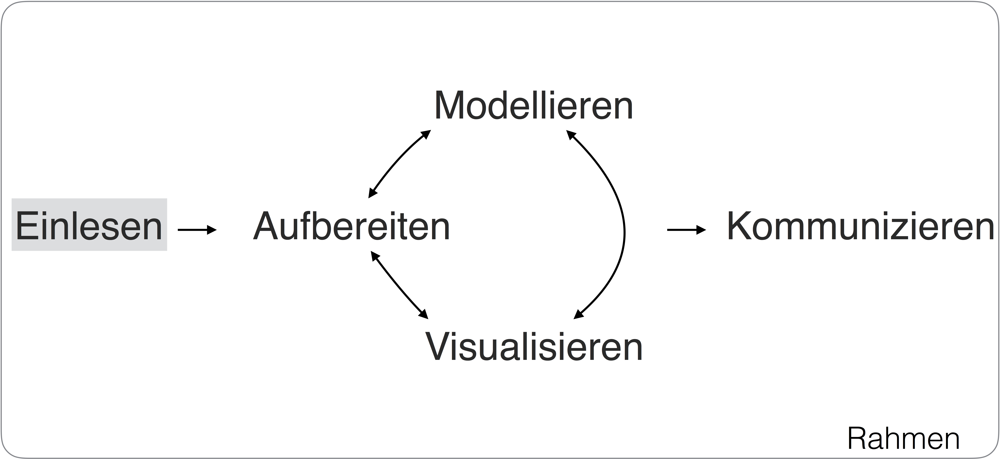
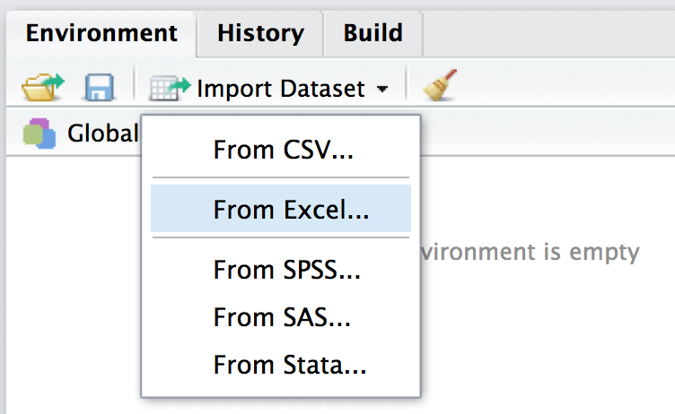
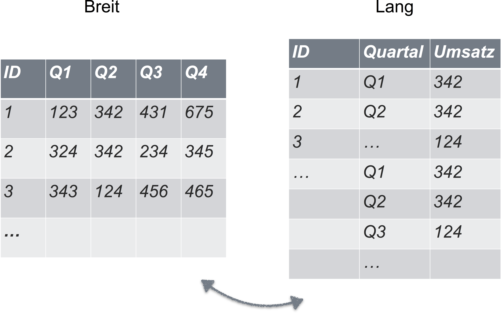
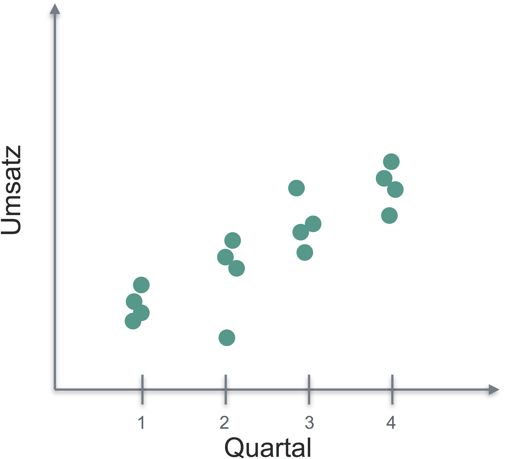

# Daten einlesen {#daten-einlesen}


```{r echo = FALSE, out.width = "30%", fig.align = "center"}
knitr::include_graphics("images/FOM.jpg")
```

```{r echo = FALSE, out.width = "10%", fig.align = "center"}
knitr::include_graphics("images/licence.png")
```

```{block2, ziele-tidy-data, type='rmdcaution', echo = TRUE} 
Lernziele:

- Wissen, auf welchen Wegen man Daten in R hineinbekommt.
- Wissen, was eine CSV-Datei ist.
- Wissen, was UTF-8 bedeutet.
- Erläutern können, was R unter dem "working directory" versteht.
- Erkennen können, ob eine Tabelle in Normalform vorliegt.
- Daten aus R hinauskriegen (exportieren).


```


In diesem Kapitel werden folgende Pakete benötigt: 
```{r}
library(readr)  # Daten einlesen
library(tidyverse) # Datenjudo und Visualisierung
```


Dieses Kapitel beantwortet eine Frage: "Wie kriege ich Daten in vernünftiger Form in R hinein?".

```{r step-Einlesen, echo = FALSE, fig.cap = "Daten sauber einlesen"}

```


## Daten in R importieren
In R kann man ohne Weiteres verschiedene, gebräuchliche (Excel oder CSV) oder weniger
gebräuchliche (Feather^[<https://cran.r-project.org/web/packages/feather/index.html>]) Datenformate einlesen. In RStudio lässt sich dies
z.B. durch einen schnellen Klick auf `Import Dataset` im Reiter `Environment`
erledigen^[Um CSV-Dateien zu laden wird durch den Klick im Hintergrund das Paket `readr` verwendet [@readr];
die entsprechende Syntax wird in der Konsole ausgegeben, so dass man sie sich
anschauen und weiterverwenden kann].


### Excel-Dateien importieren

Am einfachsten ist es, eine Excel-Datei (.xls oder .xlsx) über die RStudio-Oberfläche zu importieren; das ist mit ein paar Klicks geschehen^[im Hintergrund wird das Paket `readxl` verwendet]:

```{r data-import-RStudio, echo = FALSE, out.width = "50%", fig.cap = "Daten einlesen (importieren) mit RStudio"}

```


Es ist für bestimmte Zwecke sinnvoll, nicht zu klicken, sondern die Syntax einzutippen. Zum Beispiel: Wenn Sie die komplette Analyse als Syntax in einer Datei haben (eine sog. "Skriptdatei"), dann brauchen Sie (in RStudio) nur alles auszuwählen und auf `Run` zu klicken, und die komplette Analyse läuft durch! Die Erfahrung zeigt, dass das ein praktisches Vorgehen ist.


```{block2, file-open-not-for-data, type='rmdcaution', echo = TRUE} 

Daten (CSV, Excel,...)  können Sie *nicht* öffnen über `File > Open File ...`. Dieser Weg ist Skript-Dateien und R-Daten-Objekten vorbehalten. 

```


### Daten aus R-Paketen importieren

In R-Paketen wohnen nicht nur Funktionen, sondern auch Daten. Diese Daten kann man mit dem Befehl `data` laden, dem man den Namen des zu ladenen Datensatzes `dataset` und seines Heimatpakets `paket` übergibt: `data(dataset, package = "paket")`. Natürlich muss das Paket installiert sein. Zum Beispiel:

```{r eval = FALSE}
data(movies, package = "ggplot2movies")
```

### Daten im R-Format laden

Das R-Datenformat erkennt man an der R-Endung `.rda` oder `RData`. Dateien mit diesem Format kann man in RStudio über `File > Open File...` öffnen. Oder mit dem Befehl `load(file)`, wobei `file` der Dateiname ist, also z.B. `extra.RData`. Mit dem Schwesterbefehl `save` können Sie ein Objekt im R-Datenformat speichern, z.B. `save(stats_test, file = "stats_test.RData")`.


### CSV-Dateien importieren

Die gebräuchlichste Form von Daten für statistische Analysen ist wahrscheinlich das CSV-Format. Das ist ein einfaches Format, basierend auf einer Textdatei. Schauen Sie sich mal diesen Auszug aus einer CSV-Datei an.

```
row_number,date_time,study_time,self_eval,interest,score
1,05.01.2017 13:57:01,5,8,5,29
2,05.01.2017 21:07:56,3,7,3,29
3,05.01.2017 23:33:47,5,10,6,40
4,06.01.2017 09:58:05,2,3,2,18
5,06.01.2017 14:13:08,4,8,6,34
6,06.01.2017 14:21:18,NA,NA,NA,39
```


Erkennen Sie das Muster? Die erste Zeile gibt die "Spaltenköpfe" wieder, also die Namen der Variablen. Hier sind es 6 Spalten; die fünft heißt "score" und gibt die Punkte eines Studierenden in einer Statistikklausur wieder. Die Spalten sind offenbar durch Komma `,` voneinander getrennt. Dezimalstellen sind in amerikanischer Manier mit einem Punkt `.` dargestellt. Die Daten sind "rechteckig"; alle Spalten haben gleich viele Zeilen und umgekehrt alle Spalten gleich viele Zeilen. Man kann sich diese Tabelle gut als Excel-Tabelle mit Zellen vorstellen, in denen z.B. "row_number" (Zelle oben links) oder "39" (Zelle unten rechts) steht.

An einigen Stelle steht `NA`. Das ist Errisch für "fehlender Wert". Häufig wird die Zelle auch leer gelassen, um auszudrücken, dass ein Wert hier fehlt (hört sich nicht ganz doof an). Aber man findet alle möglichen Ideen, um fehlende Werte darzustellen. Ich rate von allen anderen ab; führt nur zu Verwirrung.

Lesen wir diese Daten jetzt ein:


```{r, eval=FALSE}
df <- read.csv("data/stats_test.csv")
```


Übrigens, Sie können die Daten (als CSV) für diesen Kurs auch über diese URL importieren. Z.B. den Datensatz `stats_test`:
```{r eval = FALSE}
prada_stats_test_url <- "https://raw.github.com/sebastiansauer/Praxis_der_Datenanalyse/master/data/stats_test.csv"

stats_test <- read.csv(prada_stats_test_url)

```

Analog gehen Sie für die anderen PraDa-Datensätze vor (vgl. Kapitel \@ref(daten)).


#### Vorsicht bei nicht-amerikanisch kodierten Textdateien

Der Befehl `read.csv` liest also eine CSV-Datei, was uns jetzt nicht übermäßig überrascht. Aber Achtung: Wenn Sie aus einem Excel mit *deutscher* Einstellung eine CSV-Datei exportieren, wird diese CSV-Datei als Spaltentrennung `;` (Strichpunkt) und als Dezimaltrennzeichen `,` verwenden. Da der Befehl `read.csv` laut  amerikanischen Standard mit Komma als Spaltentrennung und Punkt als Dezimaltrennzeichen arbeitet, müssen wir die deutschen Sonderlocken explizit angeben, z.B. so:

```{r eval = FALSE}
# nicht ausführen:
daten_deutsch <- read.csv("daten_deutsch.csv", sep = ";", dec = ".")
```

Dabei steht `sep` (separator) für das Trennzeichen zwischen den Spalten und `dec` für das Dezimaltrennzeichen. R bietet eine Kurzfassung für `read.csv` mit diesen Parametern: `read.csv2("daten_deutsch.csv")`.

Man kommt hier auch mit "Klicken statt Tippen" zum Ziel; in der Maske von "Import Dataset" (für CSV-Dateien) gibt es den Auswahlpunkt "Delimiter" (Trennzeichen). Dort kann man das Komma durch einen Strichpunkt (oder was auch immer) ersetzen. Es hilft, im Zweifel, die Textdatei vorab mit einem Texteditor zu öffnen.

```{r rstudio-delimiter, echo = FALSE, fig.cap = "Trennzeichen einer CSV-Datei in RStudio einstellen"}
knitr::include_graphics("images/tidy/delimiter.png")
```


## Normalform einer Tabelle
Tabellen in R werden als `data frames` ("Dataframe" auf Denglisch; moderner: als `tibble`, Tibble kurz für "Table-df") bezeichnet. Tabellen sollten in "Normalform" vorliegen ("tidy"), bevor wir weitere Analysen starten. Unter Normalform verstehen sich folgende Punkte:

- Es handelt sich um einen Dataframe, also um eine Tabelle mit Spalten mit Namen und gleicher Länge; eine Datentabelle in rechteckiger Form und die Spalten haben einen Namen.
- In jeder Zeile steht eine Beobachtung, in jeder Spalte eine Variable.
- Fehlende Werte sollten sich in *leeren* Zellen niederschlagen.
- Daten sollten nicht mit Farbmarkierungen o.ä. kodiert werden.
- Es gibt keine Leerzeilen und keine Leerspalten.
- In jeder Zelle steht ein Wert.
- Am besten verwendet man keine Sonderzeichen verwenden und keine Leerzeichen in Variablennamen und -werten, sondern nur Ziffern und Buchstaben und Unterstriche.
- Variablennamen dürfen nicht mit einer Zahl beginnen.

Abbildung \@ref(fig:tidy1) visualisiert die Bestimmungsstücke eines Dataframes [@r4ds]: 

```{r tidy1, fig.cap = "Schematische Darstellung eines Dataframes in Normalform", echo = FALSE}
knitr::include_graphics("images/tidy/tidy-1.png")
```


Der Punkt *Jede Zeile eine Beobachtung, jede Spalte eine Variable, jede Zelle ein Wert* verdient besondere Beachtung. Betrachten Sie das Beispiel in Abbildung \@ref(fig:lang-breit).

```{r lang-breit, echo = FALSE, fig.cap = "Dieselben Daten - einmal breit, einmal lang"}

```


In der rechten Tabelle sind die Variablen `Quartal` und `Umsatz` klar getrennt; jede hat ihre eigene Spalte. In der linken Tabelle hingegen sind die beiden Variablen vermischt. Sie haben nicht mehr ihre eigene Spalte, sondern sind über vier Spalten verteilt. Die rechte Tabelle ist ein Beispiel für eine Tabelle in Normalform, die linke nicht.


## Tabelle in Normalform bringen {#normalform}

Eine der ersten Aktionen einer Datenanalyse sollte also die "Normalisierung" Ihrer Tabelle sein. In R bietet sich dazu das Paket `tidyr` an, mit dem die Tabelle von *Breit- auf Langformat* (und wieder zurück) geschoben werden kann.


Abb. \@ref(fig:gather-spread) zeigt ein Beispiel dazu.


```{r gather-spread, echo = FALSE, fig.cap = "Mit 'gather' und 'spread' wechselt man von der breiten Form zur langen Form"}

knitr::include_graphics("images/tidy/gather_spread-crop.png")

```


Warum ist es wichtig, von der "breiten" (links in Abb. \@ref(fig:gather-spread)) zur "langen" oder "Normalform" (rechts in Abb. \@ref(fig:gather-spread)) zu wechseln. Ganz einfach: viele Befehle (allgemeiner: Tätigkeiten) verlangen die Normalform; hin und wieder sind aber die Tabellen von ihrem Schöpfer in breiter Form geschaffen worden. Zum Beispiel erwartet `ggplot2` - und viele andere Diagrammbefehle - dass man *einer* Achse *eine* Spalte (Variable)  zuweist, z.B. die Variable "Umsatz" auf die Y-Achse. Der X-Achse könnten wir dann z.B. die Variable "Quartal" packen (s. Abb. \@ref(fig:bsp-abb)).

```{r bsp-abb, echo = FALSE, fig.cap = "Ein Beispiel für eine Abbildung zu einer Normalform-Tabelle", out.width = "50%"}


```


Um von der breiten Form zur langen Form zu kommen, kann man den Befehl `tidyr::gather` nehmen. Von der langen Form zur breiten Form gibt es `tidyr::spread`. Also etwa:

```
library(tidyr)
df_lang <- gather(df_breit, key = "Quartal", value = "Umsatz")

df_breit <- spread(df_lang, Quartal, Umsatz)
```

Dabei baut `gather` den Dataframe so um, dass nur zwei Spalten übrig bleiben (s. Abb. \@ref(fig:gather-spread)). Eine Spalte  nur *Spaltennamen* ("Q1", "Q2", ...) enthält; diese Spalte nennt `gather` im Standard `key`. Die zweite Spalte enthält die Werte (z.B. Umsätze), die vormals über mehrere Spalten verstreut waren. Diese Spalte heißt per Default `value`. Im Beispiel oben macht die Spalte `ID` bei dem Spiel "Aus vielen Spalten werden zwei" nicht mit. Möchte man eine Spalte aussparen, so schreibt man das bei `gather` so:

```
df_lang <- gather(df_breit, key = "Quartal", value = "Umsatz", -ID)
```

In Kapitel \@ref(case-movies) werden wir dazu ein Fallstudie einüben.


## Textkodierung

Öffnet man eine Textdatei mit einem Texteditor seiner Wahl, so sieht man... Text und sonst nichts, also keine Formatierung etc. Eine Textdatei besteht aus Text und sonst nichts (daher der Name...). Auch eine R-Skript-Datei (`Coole_Syntax.R`) ist eine Textdatei.
Technisch gesprochen werden nur die Textzeichen gespeichert, sonst nichts; im Gegensatz dazu speichert eine Word-Datei noch mehr, z.B. Formatierung. Jetzt steht in der Textdatei der Code "42" für den nächsten Buchstaben. Ja, ist das jetzt ein "A", oder ein "Ä" oder vielleicht ein "ξ"? Woher weiß der Computer das eigentlich? Die Antwort ist: Er braucht eine Art Übersetzungstabelle oder Kodierungstafel. Mehrere solcher Kodierungstafeln existieren. Die gebräuchlichste im Internet heißt *UTF-8*^[https://de.wikipedia.org/wiki/UTF-8]. Leider benutzen unterschiedliche Betriebssysteme unterschiedliche Kodierungstafeln, was zu Verwirrung führt. Ich empfehle, Ihre Textdateien als UTF-8 zu kodieren. RStudio fragt sie, wie eine Textdatei kodiert werden soll. Sie können auch unter `File > Save with Encoding...` die Kodierung einer Textdatei festlegen.

>    Speichern Sie R-Textdateien wie Skripte stets mit UTF-8-Kodierung ab.


Wie bekommt man seine Daten wieder aus R raus ("ich will zu Excel zurück!")?

Eine Möglichkeit bietet die Funktion `write.csv`; sie schreibt eine CSV-Datei:

```
write.csv(name_der_tabelle, "Dateiname.csv")
```

Mit `help(write.csv)` bekommt man mehr Hinweise dazu. Beachten Sie, dass immer in das aktuelle Arbeitsverzeichnis geschrieben wird.


## Befehlsübersicht

Tabelle \@ref(tab:befehle-tidy) stellt die Befehle dieses Kapitels dar. 


```{r befehle-tidy, echo = FALSE, message = FALSE}

df <- readr::read_csv("includes/Befehle_tidy.csv")

knitr::kable(df,
             caption = "Befehle des Kapitels 'Daten einlesen'")
```


## Aufgaben^[F, R, F, R, R, R, F, F]

```{block2, exercises-read-data, type='rmdexercises', echo = TRUE} 
Richtig oder Falsch!?

1. In CSV-Dateien dürfen Spalten *nie* durch Komma getrennt sein.
2. RStudio bietet die Möglichkeit, CSV-Dateien per Klick zu importieren.
2. RStudio bietet *nicht* die Möglichkeit, CSV-Dateien per Klick zu importieren.
2. "Deutsche" CSV-Dateien verwenden als Spalten-Trennzeichen einen Strichpunkt.
2. In einer Tabelle in Normalform stehen in jeder Zeile eine Beobachtung.
2. In einer Tabelle in Normalform stehen in jeder Spalte eine Variable.
2. R stellt fehlende Werte mit einem Fragezeichen `?` dar.
2. Um Excel-Dateien zu importieren, kann man den Befehl `read.csv` verwenden.


```


## Verweise

- *R for Data Science* bietet umfangreiche Unterstützung zu diesem Thema [@r4ds].


