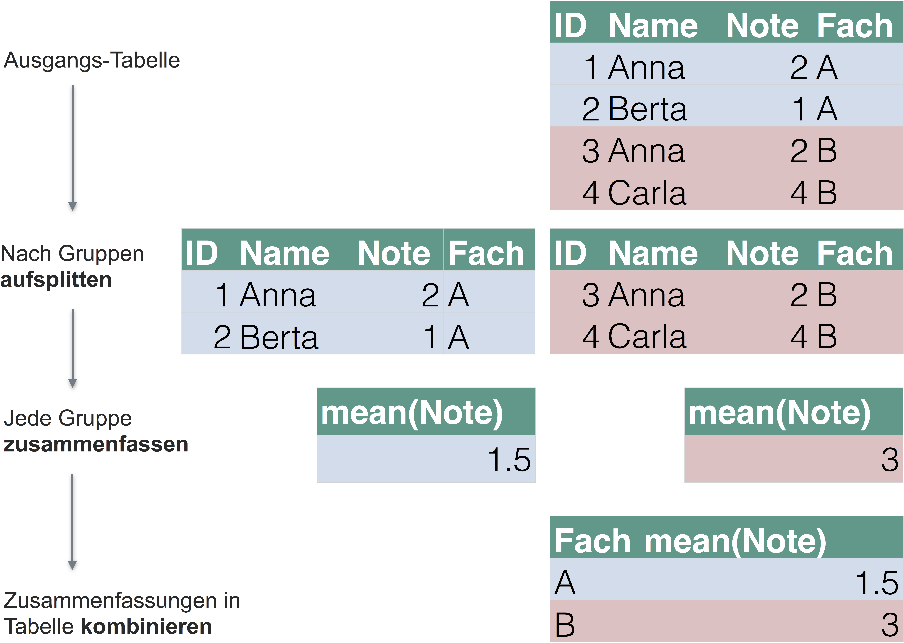

# Datenjudo


\BeginKnitrBlock{rmdcaution}<div class="rmdcaution">Lernziele:

- Die zentralen Ideen der Datenanalye mit dplyr verstehen.
- Typische Probleme der Datenanalyse schildern können.
- Zentrale `dplyr`-Befehle anwenden können.
- `dplyr`-Befehle kombinieren können.
- Die Pfeife anwenden können.
- Werte umkodieren und "binnen" können.

</div>\EndKnitrBlock{rmdcaution}


<div class="figure" style="text-align: center">

<p class="caption">(\#fig:fig-datenjudo)Daten aufbereiten</p>
</div>

In diesem Kapitel werden folgende Pakete benötigt: 

```r
library(tidyverse)  # Datenjudo
library(stringr)   # Texte bearbeiten
library(car)  # für 'recode'
library(desctable)  # Statistiken auf einen Streich
library(lsr)  # für Befehl `aad`
```


Das Paket `tidyverse` lädt `dplyr`, `ggplot2` und weitere Pakete^[für eine Liste s. `tidyverse_packages(include_self = TRUE)`]. Daher ist es komfortabler, `tidyverse` zu laden, damit spart man sich Tipparbeit. Die eigentliche Funktionalität, die wir in diesem Kapitel nutzen, kommt aus dem Paket `dplyr`.


Mit *Datenjudo*\index{Datenjudo} ist gemeint, die Daten für die eigentliche Analyse "aufzubereiten". Unter *Aufbereiten*\index{Datenjudo} ist hier das Umformen, Prüfen, Bereinigen, Gruppieren und Zusammenfassen von Daten gemeint. Die deskriptive Statistik fällt unter die Rubrik Aufbereiten. Kurz gesagt: Alles, wan tut, nachdem die Daten "da" sind und bevor man mit anspruchsvoller(er) Modellierung beginnt.

Ist das Aufbereiten von Daten auch nicht statistisch anspruchsvoll, so ist es trotzdem von großer Bedeutung und häufig recht zeitintensiv. Eine Anekdote zur Relevanz der Datenaufbereitung, die (so will es die Geschichte) mir an einer Bar nach einer einschlägigen Konferenz erzählt wurde (daher keine Quellenangebe, Sie verstehen...). Eine Computerwissenschaftlerin aus den USA (deutschen Ursprungs) hatte einen beeindruckenden "Track Record" an Siegen in Wettkämpfen der Datenanalyse. Tatsächlich hatte sie keine besonderen, raffinierten Modellierungstechniken eingesetzt; klassische Regression war ihre Methode der Wahl. Bei einem Wettkampf, bei dem es darum ging, Krebsfälle aus Krankendaten vorherzusagen (z.B. von Röntgenbildern) fand sie nach langem Datenjudo heraus, dass in die "ID-Variablen" Information gesickert war, die dort nicht hingehörte und die sie nutzen konnte für überraschend (aus Sicht der Mitstreiter) gute Vorhersagen zu Krebsfällen. Wie war das möglich? Die Daten stammten aus mehreren Kliniken, jede Klinik verwendete ein anderes System, um IDs für Patienten zu erstellen. Überall waren die IDs stark genug, um die Anonymität der Patienten sicherzustellen, aber gleich wohl konnte man (nach einigem Judo) unterscheiden, welche ID von welcher Klinik stammte. Was das bringt? Einige Kliniken waren reine Screening-Zentren, die die Normalbevölkerung versorgte. Dort sind wenig Krebsfälle zu erwarten. Andere Kliniken jedoch waren Onkologie-Zentren für bereits bekannte Patienten oder für Patienten mit besonderer Risikolage. Wenig überraschen, dass man dann höhere Krebsraten vorhersagen kann. Eigentlich ganz einfach; besondere Mathe steht hier (zumindest in dieser Geschichte) nicht dahinter. Und, wenn man den Trick kennt, ganz einfach. Aber wie so oft ist es nicht leicht, den Trick zu finden. Sorgfältiges Datenjudo hat hier den Schlüssel zum Erfolg gebracht.


## Typische Probleme der Datenaufbereitung
Bevor man seine Statistik-Trickkiste so richtig schön aufmachen kann, muss man die Daten häufig erst noch in Form bringen. Das ist nicht schwierig in dem Sinne, dass es um komplizierte Mathe ginge. Allerdings braucht es mitunter recht viel Zeit und ein paar (oder viele) handwerkliche Tricks sind hilfreich. Hier soll das folgende Kapitel helfen.


Typische Probleme, die immer wieder auftreten, sind:

- *Fehlende Werte*: Irgend jemand hat auf eine meiner schönen Fragen in der Umfrage nicht geantwortet!
- *Unerwartete Daten*: Auf die Frage, wie viele Facebook-Freunde er oder sie habe, schrieb die Person "I like you a lot". Was tun???
- *Daten müssen umgeformt werden*: Für jede der beiden Gruppen seiner Studie hat Joachim einen Google-Forms-Fragebogen aufgesetzt. Jetzt hat er zwei Tabellen, die er "verheiraten" möchte. Geht das?
- *Neue Variablen (Spalten) berechnen*: Ein Student fragt nach der Anzahl der richtigen Aufgaben in der Statistik-Probeklausur. Wir wollen helfen und im entsprechenden Datensatz eine Spalte erzeugen, in der pro Person die Anzahl der richtig beantworteten Fragen steht.


## Daten aufbereiten mit `dplyr`

Willkommen in der Welt von `dyplr`! `dplyr` hat seinen Namen, weil es sich ausschließlich um *D*ataframes bemüht; es erwartet einen Dataframe als Eingabe und gibt einen Dataframe zurück (zumindest bei den meisten Befehlen).


### Die zwei Prinzipien von `dplyr` 

Es gibt viele Möglichkeiten, Daten mit R aufzubereiten; `dplyr`^[https://cran.r-project.org/web/packages/dplyr/index.html] ist ein populäres Paket dafür. `dplyr` basiert auf zwei Ideen: 

1. *Lego-Prinzip* Komplexe Datenanalysen in Bausteine zerlegen (vgl. Abb. \@ref(fig:bausteine)).
2. *Durchpfeifen*: Alle Operationen werden nur auf Dataframes angewendet; jede Operation erwartet einen Dataframe als Eingabe und gibt wieder einen Dataframe aus (vgl. Abb. \@ref(fig:durchpfeifen-allgemein)).


Das *erste Prinzip* von `dplyr` ist, dass es nur ein paar *wenige Grundbausteine* geben sollte, die sich gut kombinieren lassen. Sprich: Wenige grundlegende Funktionen mit eng umgrenzter Funktionalität. Der Autor, Hadley Wickham, sprach einmal in einem Forum (citation needed...), dass diese Befehle wenig können, das Wenige aber gut. Ein Nachteil dieser Konzeption kann sein, dass man recht viele dieser Bausteine kombinieren muss, um zum gewünschten Ergebnis zu kommen. Außerdem muss man die Logik des Baukastens gut verstanden habe - die Lernkurve ist also erstmal steiler. Dafür ist man dann nicht darauf angewiesen, dass es irgendwo "Mrs Right" gibt, die genau das kann, was ich will. Außerdem braucht man sich auch nicht viele Funktionen merken. Es reicht einen kleinen Satz an Funktionen zu kennen (die praktischerweise konsistent in Syntax und Methodik sind). Diese Bausteine sind typische Tätigkeiten im Umgang mit Daten; nichts Überraschendes. Wir schauen wir uns diese Bausteine gleich näher an.

<div class="figure" style="text-align: center">

<p class="caption">(\#fig:bausteine)Lego-Prinzip: Zerlege eine komplexe Struktur in einfache Bausteine</p>
</div>


Das *zweite Prinzip* von `dplyr` ist es, einen Dataframe von Operation zu Operation *durchzureichen.* `dplyr` arbeitet also *nur* mit Dataframes. Jeder Arbeitsschritt bei `dplyr` erwartet einen Dataframe als Eingabe und gibt im Gegenzug wieder einen Dataframe aus.


<div class="figure" style="text-align: center">

<p class="caption">(\#fig:durchpfeifen-allgemein)Durchpfeifen: Ein Dataframe wird von Operation zu Operation weitergereicht</p>
</div>


Werfen wir einen Blick auf ein paar typische Bausteine von `dplyr`.

## Zentrale Bausteine von `dplyr`

### Zeilen filtern mit `filter`

Häufig will man bestimmte Zeilen aus einer Tabelle filtern; `filter`\index{dplyr::filter}. Zum Beispiel man arbeitet für die Zigarettenindustrie und ist nur an den Rauchern interessiert (die im Übrigen unser Gesundheitssystem retten [@kraemer2011wir]), nicht an Nicht-Rauchern; es sollen die nur Umsatzzahlen des letzten Quartals untersucht werden, nicht die vorherigen Quartale; es sollen nur die Daten aus Labor X (nicht Labor Y) ausgewertet werden etc.

Abb. \@ref(fig:fig-filter) zeigt ein Sinnbild für `filter`.

<div class="figure" style="text-align: center">

<p class="caption">(\#fig:fig-filter)Zeilen filtern</p>
</div>

Merke:

>    Die Funktion `filter` filtert Zeilen aus einem Dataframe.

Schauen wir uns einige Beispiel an; zuerst die Daten laden nicht vergessen. Achtung: "Wohnen" die Daten in einem Paket, muss dieses Paket installiert sein, damit man auf die Daten zugreifen kann.


```r
data(profiles, package = "okcupiddata")  # Das Paket muss installiert sein
```


```r
df_frauen <- filter(profiles, sex == "f")  # nur die Frauen
df_alt <- filter(profiles, age > 70)  # nur die alten Menschen
df_alte_frauen <- filter(profiles, age > 70, sex == "f") 
# nur die alten Frauen, d.h. UND-Verknüpfung

df_nosmoke_nodrinks <- filter(profiles, smokes == "no" | drinks == "not at all") 
# liefert alle Personen, die Nicht-Raucher *oder* Nicht-Trinker sind
```

Gar nicht so schwer, oder? Allgemeiner gesprochen werden diejenigen Zeilen gefiltert (also behalten bzw. zurückgeliefert), für die das Filterkriterium `TRUE` ist. 


`filter` ist deutlich einfacher (und klarer) als Standard-R. Vergleichen Sie mal:


```r
filter(profiles, age > 70, sex == "f", drugs == "sometimes")

# base-R:

profiles[df$age > 70 & df$sex == "f" & df$drugs == "sometimes", ]

```


\BeginKnitrBlock{rmdcaution}<div class="rmdcaution">Manche Befehle wie `filter` haben einen Allerweltsnamen; gut möglich, dass ein Befehl mit gleichem Namen in einem anderen (geladenen) Paket existiert. Das kann dann zu Verwirrungen führen - und kryptischen Fehlern. Im Zweifel den Namen des richtigen Pakets ergänzen, und zwar zum Beispiel so: `dplyr::filter(...)`.
</div>\EndKnitrBlock{rmdcaution}

#### Aufgaben^[F, R, F, F, R]

\BeginKnitrBlock{rmdexercises}<div class="rmdexercises">Richtig oder Falsch!?

1. `filter` filtert Spalten.
1. `filter` ist eine Funktion aus dem Paket `dplyr`.
1. `filter` erwartet als ersten Parameter das Filterkriterium.
1. `filter` lässt nur ein Filterkriterium zu.
1. Möchte man aus dem Datensatz `profiles` (`okcupiddata`) die Frauen filtern, so ist folgende Syntax korrekt: `filter(profiles, sex == "f")`.


</div>\EndKnitrBlock{rmdexercises}


#### Vertiefung: Fortgeschrittene Beispiele für `filter`

Einige fortgeschrittene Beispiele für `filter`:

Man kann alle Elemente (Zeilen) filtern, die zu einer Menge gehören und zwar mit diesem Operator: `%in%`:


```r
filter(profiles, body_type %in% c("a little extra", "average"))
```

Besonders Textdaten laden zu einigen Extra-Überlegungen ein; sagen wir, wir wollen alle Personen filtern, die Katzen bei den Haustieren erwähnen. Es soll reichen, wenn `cat` ein Teil des Textes ist; also `likes dogs and likes cats` wäre OK (soll gefiltert werden). Dazu nutzen wir ein Paket zur Bearbeitung von Strings (Textdaten):


```r

filter(profiles, str_detect(pets, "cats"))
```


Ein häufiger Fall ist, Zeilen *ohne* fehlende Werte (`NA`s) zu filtern. Das geht einfach:


```r
profiles_keine_nas <- na.omit(profiles)

```

Aber was ist, wenn wir nur bei bestimmten Spalten wegen fehlender Werte besorgt sind? Sagen wir bei `income` und bei `sex`:


```r
filter(profiles, !is.na(income) | !is.na(sex))
```

Der horizontale Strich `|` steht bei R für logisches 'oder'.

### Spalten wählen mit `select`

Das Gegenstück zu `filter` ist `select`\index{dplyr::select}; dieser Befehl liefert die gewählten Spalten zurück. Das ist häufig praktisch, wenn der Datensatz sehr "breit" ist, also viele Spalten enthält. Dann kann es übersichtlicher sein, sich nur die relevanten auszuwählen. Abb. \@ref(fig:fig-select) zeigt Sinnbild für diesen Befehl:

<div class="figure" style="text-align: center">

<p class="caption">(\#fig:fig-select)Spalten auswählen</p>
</div>


Merke:

>    Die Funktion select wählt Spalten aus einem Dataframe aus.

Laden wir als ersten einen Datensatz.


```r
stats_test <- read.csv("data/test_inf_short.csv")
```

Dieser Datensatz beinhaltet Daten zu einer Statistikklausur.

Beachten Sie, dass diese Syntax davon ausgeht, dass sich die Daten in einem Unterordner mit dem Namen `data` befinden, welcher sich im Arbeitsverzeichnis befindet^[der angegebene Pfad ist also *relativ*  zum aktuellen Verzeichnis.].


```r

stats_test <- read.csv("data/test_inf_short.csv")
```


```r
select(stats_test, score)  # Spalte `score` auswählen
select(stats_test, score, study_time)  
# Spalten `score` und `study_time` auswählen

select(stats_test, score:study_time) # dito
select(stats_test, 5:6)  # Spalten 5 bis 6 auswählen
```

Tatsächlich ist der Befehl `select` sehr flexibel; es gibt viele Möglichkeiten, Spalten auszuwählen. Im `dplyr`-Cheatsheet findet sich ein guter Überblick dazu.


#### Aufgaben^[F, F, R, R, F]

\BeginKnitrBlock{rmdexercises}<div class="rmdexercises">Richtig oder Falsch!?

1. `select` wählt *Zeilen* aus.
1. `select` ist eine Funktion aus dem Paket `knitr`.
1. Möchte man zwei Spalten auswählen, so ist folgende Syntax prinzipiell korrekt: `select(df, spalte1, spalte2)`.
1. Möchte man Spalten 1 bis 10 auswählen, so ist folgende Syntax prinzipiell korrekt: `select(df, spalte1:spalte10)
1. Mit `select` können Spalten nur bei ihrem Namen, aber nicht bei ihrer Nummer aufgerufen werden.

</div>\EndKnitrBlock{rmdexercises}


### Zeilen sortieren mit `arrange`

Man kann zwei Arten des Umgangs mit R unterscheiden: Zum einen der "interaktive Gebrauch" und zum anderen "richtiges Programmieren". Im interaktiven Gebrauch geht es uns darum, die Fragen zum aktuell vorliegenden Datensatz (schnell) zu beantworten. Es geht nicht darum, eine allgemeine Lösung zu entwickeln, die wir in die Welt verschicken können und die dort ein bestimmtes Problem löst, ohne dass der Entwickler (wir) dabei Hilfestellung geben muss. "Richtige" Software, wie ein R-Paket oder Microsoft Powerpoint, muss diese Erwartung erfüllen; "richtiges Programmieren" ist dazu vonnöten. Natürlich sind in diesem Fall die Ansprüche an die Syntax (der "Code", hört sich cooler an) viel höher. In dem Fall muss man alle Eventualitäten voraussehen und sicherstellen, dass das Programm auch beim merkwürdigsten Nutzer brav seinen Dienst tut. Wir haben hier, beim interaktiven Gebrauch, niedrigere Ansprüche bzw. andere Ziele. 

Beim interaktiven Gebrauch von R (oder beliebigen Analyseprogrammen) ist das Sortieren von Zeilen eine recht häufige Tätigkeit. Typisches Beispiel wäre der Lehrer, der eine Tabelle mit Noten hat und wissen will, welche Schüler die schlechtesten oder die besten sind in einem bestimmten Fach. Oder bei der Prüfung der Umsätze nach Filialen möchten wir die umsatzstärksten sowie -schwächsten Niederlassungen kennen. 

Ein R-Befehl hierzu ist `arrange`\index{dplyr::arrange}; einige Beispiele zeigen die Funktionsweise am besten:


```r

arrange(stats_test, score) # liefert die *schlechtesten* Noten zuerst zurück
arrange(stats_test, -score) # liefert die *besten* Noten zuerst zurück
arrange(stats_test, interest, score)

```


```
#>   row_number           date_time bestanden study_time self_eval interest
#> 1        234 23.01.2017 18:13:15      nein          3         1        1
#> 2          4 06.01.2017 09:58:05      nein          2         3        2
#>   score
#> 1    17
#> 2    18
#>   row_number           date_time bestanden study_time self_eval interest
#> 1          3 05.01.2017 23:33:47        ja          5        10        6
#> 2          7 06.01.2017 14:25:49        ja         NA        NA       NA
#>   score
#> 1    40
#> 2    40
#>   row_number           date_time bestanden study_time self_eval interest
#> 1        234 23.01.2017 18:13:15      nein          3         1        1
#> 2        142 19.01.2017 19:02:12      nein          3         4        1
#>   score
#> 1    17
#> 2    18
```

Einige Anmerkungen. Die generelle Syntax lautet `arrange(df, Spalte1, ...)`, wobei `df` den Dataframe bezeichnet und `Spalte1` die erste zu sortierende Spalte; die Punkte `...` geben an, dass man weitere Parameter übergeben kann. Man kann sowohl numerische Spalten als auch Textspalten sortieren. Am wichtigsten ist hier, dass man weitere Spalten übergeben kann. Dazu gleich mehr.

Standardmäßig sortiert `arrange` *aufsteigend*  (weil kleine Zahlen im Zahlenstrahl vor den großen Zahlen kommen). Möchte man diese Reihenfolge umdrehen (große Werte zuert, d.h. *absteigend*), so kann man ein Minuszeichen vor den Namen der Spalte setzen.

Gibt man *zwei oder mehr* Spalten an, so werden pro Wert von `Spalte1` die Werte von `Spalte2` sortiert etc; man betrachte den Output des Beispiels oben dazu. Abbildung \@ref(fig:fig-arrange)) erläutert die Arbeitsweise von `arrange`.


Merke:

>    Die Funktion `arrange` sortiert die Zeilen eines Datafames.


<div class="figure" style="text-align: center">

<p class="caption">(\#fig:fig-arrange)Spalten sortieren</p>
</div>


Ein ähnliches Ergebnis erhält mit man `top_n()`, welches die `n` *größten Ränge* widergibt:


```r


top_n(stats_test, 3, interest)
#>   row_number           date_time bestanden study_time self_eval interest
#> 1          3 05.01.2017 23:33:47        ja          5        10        6
#> 2          5 06.01.2017 14:13:08        ja          4         8        6
#> 3         43 13.01.2017 14:14:16        ja          4         8        6
#> 4         65 15.01.2017 12:41:27      nein          3         6        6
#> 5        110 18.01.2017 18:53:02        ja          5         8        6
#> 6        136 19.01.2017 18:22:57        ja          3         1        6
#> 7        172 20.01.2017 20:42:46        ja          5        10        6
#> 8        214 22.01.2017 21:57:36        ja          2         6        6
#> 9        301 27.01.2017 08:17:59        ja          4         8        6
#>   score
#> 1    40
#> 2    34
#> 3    36
#> 4    22
#> 5    37
#> 6    39
#> 7    34
#> 8    31
#> 9    33
```

Gibt man *keine* Spalte an (also nur `top_n(stats_test)`), so bezieht sich `top_n` auf die letzte Spalte im Datensatz.

Wenn sich aber, wie hier, mehrere Objekte, den größten Rang (Wert 6) teilen, bekommen wir *nicht* 3 Zeilen zurückgeliefert, sondern entsprechend mehr. dplyr "denkt" sich: "Ok, er will die drei besten Ränge; aber 9 Studenten teilen sich den ersten Rang (Interesse 6), wen sollte ich da ausschließen? Am besten ich liefere alle 9 zurück, sonst wäre es ja ungerecht, weil alle 9 sind ja gleich vom Interesse her". 

#### Aufgaben^[F, F, F, F, F]

\BeginKnitrBlock{rmdexercises}<div class="rmdexercises">Richtig oder Falsch!?

1. `arrange` arrangiert Spalten.
1. `arrange` sortiert im Standard absteigend.
1. `arrange` lässt nur ein Sortierkriterium zu.
1. `arrange` kann numerische Werte, aber nicht Zeichenketten sortieren.
1. `top_n(5)` liefert immer fünf Werte zurück.
</div>\EndKnitrBlock{rmdexercises}

### Datensatz gruppieren mit `group_by`

Einen Datensatz zu gruppieren ist eine häufige Angelegenheit: Was ist der mittlere Umsatz in Region X im Vergleich zu Region Y? Ist die Reaktionszeit in der Experimentalgruppe kleiner als in der Kontrollgruppe? Können Männer schneller ausparken als Frauen? Man sieht, dass das Gruppieren v.a. in Verbindung mit Mittelwerten oder anderen Zusammenfassungen sinnvol ist; dazu im nächsten Abschnitt mehr.

>   Gruppieren meint, einen Datensatz anhand einer diskreten Variablen (z.B. Geschlecht) so aufzuteilen, dass Teil-Datensätze entstehen - pro Gruppe ein Teil-Datensatz (z.B. ein Datensatz, in dem nur Männer enthalten sind und einer, in dem nur Frauen enthalten sind).

<div class="figure" style="text-align: center">

<p class="caption">(\#fig:fig-groupby)Datensätze nach Subgruppen aufteilen</p>
</div>

In Abbildung \@ref(fig:fig-groupby) wurde der Datensatz anhand der Spalte (d.h. Variable) `Fach` in mehrere Gruppen geteilt (Fach A, Fach B...). Wir könnten uns als nächstes z.B. Mittelwerte pro Fach - d.h. pro Gruppe (pro Ausprägung von `Fach`) - ausgeben lassen; in diesem Fall vier Gruppen (Fach A bis D).


```r
test_gruppiert <- group_by(stats_test, interest)
test_gruppiert
#> Source: local data frame [306 x 7]
#> Groups: interest [7]
#> 
#> # A tibble: 306 x 7
#>    row_number           date_time bestanden study_time self_eval interest
#>         <int>              <fctr>    <fctr>      <int>     <int>    <int>
#>  1          1 05.01.2017 13:57:01        ja          5         8        5
#>  2          2 05.01.2017 21:07:56        ja          3         7        3
#>  3          3 05.01.2017 23:33:47        ja          5        10        6
#>  4          4 06.01.2017 09:58:05      nein          2         3        2
#>  5          5 06.01.2017 14:13:08        ja          4         8        6
#>  6          6 06.01.2017 14:21:18        ja         NA        NA       NA
#>  7          7 06.01.2017 14:25:49        ja         NA        NA       NA
#>  8          8 06.01.2017 17:24:53      nein          2         5        3
#>  9          9 07.01.2017 10:11:17        ja          2         3        5
#> 10         10 07.01.2017 18:10:05        ja          4         5        5
#> # ... with 296 more rows, and 1 more variables: score <int>
```

Schaut man sich nun den Datensatz an, sieht man erstmal wenig Effekt der Gruppierung. R teilt uns lediglich mit `Groups: interest [7]`, dass es 7 Gruppen gibt, aber es gibt keine extra Spalte oder sonstige Anzeichen der Gruppierung. Aber keine Sorge, wenn wir gleich einen Mittelwert ausrechnen, bekommen wir den Mittelwert pro Gruppe!

Ein paar Hinweise: `Source: local data frame [306 x 6]` will sagen, dass die Ausgabe sich auf einen `tibble` bezieht^[http://stackoverflow.com/questions/29084380/what-is-the-meaning-of-the-local-data-frame-message-from-dplyrprint-tbl-df], also eine bestimmte Art von Dataframe. `Groups: interest [7]` zeigt, dass der Tibble in 7 Gruppen - entsprechend der Werte von `interest` aufgeteilt ist.

`group_by` an sich ist nicht wirklich nützlich. Nützlich wird es erst, wenn man weitere Funktionen auf den gruppierten Datensatz anwendet - z.B. Mittelwerte ausrechnet (z.B mit `summarise`, s. unten). Die nachfolgenden Funktionen (wenn sie aus `dplyr` kommen), berücksichtigen nämlich die Gruppierung. So kann man einfach Mittelwerte pro Gruppe ausrechnen. `dplyr` kombiniert dann die Zusammenfassungen (z.B. Mittelwerte) der einzelnen Gruppen in einen Dataframe und gibt diesen dann aus.


Die Idee des "Gruppieren - Zusammenfassen - Kombinieren" ist flexibel; man kann sie häufig brauchen. Es lohnt sich, diese Idee zu lernen (vgl. Abb. \@ref(fig:sac)).

<div class="figure" style="text-align: center">

<p class="caption">(\#fig:sac)Schematische Darstellung des 'Gruppieren - Zusammenfassen - Kombinieren'</p>
</div>


#### Aufgaben^[R, F, R, R]

\BeginKnitrBlock{rmdexercises}<div class="rmdexercises">Richtig oder Falsch!?

1. Mit `group_by` gruppiert man einen Datensatz.
1. `group_by` lässt nur ein Gruppierungskriterium zu.
1. Die Gruppierung durch `group_by` wird nur von Funktionen aus `dplyr` erkannt.
1. `group_by` ist sinnvoll mit `summarise` zu kombinieren.

</div>\EndKnitrBlock{rmdexercises}


Merke:

>    Mit group_by teilt man einen Datensatz in Gruppen ein, entsprechend der Werte einer mehrerer Spalten.


### Eine Spalte zusammenfassen mit `summarise`

Vielleicht die wichtigste oder häufigte Tätigkeit in der Analyse von Daten ist es, eine Spalte zu *einem* Wert zusammenzufassen; `summarise`\index{dplyr::summarise} leistet dies. Anders gesagt: Einen Mittelwert berechnen, den größten (kleinsten) Wert heraussuchen, die Korrelation berechnen oder eine beliebige andere Statistik ausgeben lassen. Die Gemeinsamkeit dieser Operaitonen ist, dass sie eine Spalte zu einem Wert zusammenfassen, "aus Spalte mach Zahl", sozusagen. Daher ist der Name des Befehls `summarise` ganz passend. Genauer gesagt fasst dieser Befehl eine Spalte zu einer Zahl zusammen *anhand* einer Funktion wie `mean` oder `max` (vgl. Abb. \@ref(fig:fig-summarise). Hierbei ist jede Funktion erlaubt, die eine Spalte als Input verlangt und eine Zahl zurückgibt; andere Funktionen sind bei `summarise` nicht erlaubt. 

<div class="figure" style="text-align: center">

<p class="caption">(\#fig:fig-summarise)Spalten zu einer Zahl zusammenfassen</p>
</div>


```r
summarise(stats_test, mean(score))
#>   mean(score)
#> 1        31.1
```

Man könnte diesen Befehl so ins Deutsche übersetzen: `Fasse aus Tabelle stats_test die Spalte score anhand des Mittelwerts zusammen`. Nicht vergessen, wenn die Spalte `score` fehlende Werte hat, wird der Befehl `mean` standardmäßig dies mit `NA` quittieren. Ergänzt man den Parameter `nr.rm = TRUE`, so ignoriert R fehlende Werte und der Befehl `mean` liefert ein Ergebnis zurück.

Jetzt können wir auch die Gruppierung nutzen:

```r
test_gruppiert <- group_by(stats_test, interest)
summarise(test_gruppiert, mean(score, na.rm = TRUE))
#> # A tibble: 7 x 2
#>   interest `mean(score, na.rm = TRUE)`
#>      <int>                       <dbl>
#> 1        1                        28.3
#> 2        2                        29.7
#> 3        3                        30.8
#> 4        4                        29.9
#> 5        5                        32.5
#> 6        6                        34.0
#> 7       NA                        33.1
```

Der Befehl `summarise` erkennt also, wenn eine (mit `group_by`) gruppierte Tabelle vorliegt. Jegliche Zusammenfassung, die wir anfordern, wird anhand der Gruppierungsinformation aufgeteilt werden. In dem Beispiel bekommen wir einen Mittelwert für jeden Wert von `interest`. Interessanterweise sehen wir, dass der Mittelwert tendenziell größer wird, je größer `interest` wird.

Alle diese `dplyr`-Befehle geben einen Dataframe zurück, was praktisch ist für weitere Verarbeitung. In diesem Fall heißen die Spalten `interst` und `mean(score)`. Zweiter Name ist nicht so schön, daher ändern wir den wie folgt:

Jetzt können wir auch die Gruppierung nutzen:

```r
test_gruppiert <- group_by(stats_test, interest)
summarise(test_gruppiert, mw_pro_gruppe = mean(score, na.rm = TRUE))
#> # A tibble: 7 x 2
#>   interest mw_pro_gruppe
#>      <int>         <dbl>
#> 1        1          28.3
#> 2        2          29.7
#> 3        3          30.8
#> 4        4          29.9
#> 5        5          32.5
#> 6        6          34.0
#> 7       NA          33.1
```

Nun heißt die zweite Spalte `mw_pro_Gruppe`. `na.rm = TRUE` veranlasst, bei fehlenden Werten trotzdem einen Mittelwert zurückzuliefern (die Zeilen mit fehlenden Werten werden in dem Fall ignoriert).

Grundsätzlich ist die Philosophie der `dplyr`-Befehle: "Mach nur eine Sache, aber die dafür gut". Entsprechend kann `summarise` nur *Spalten* zusammenfassen, aber keine *Zeilen*.

Merke:

>    Mit summarise kann man eine Spalte eines Dataframes zu einem Wert zusammenfassen.


#### Aufgaben^[R, R, R, R, R]


\BeginKnitrBlock{rmdexercises}<div class="rmdexercises">Richtig oder Falsch!?

1. Möchte man aus der Tabelle `stats_test` den Mittelwert für die Spalte `score` berechnen, so ist folgende Syntax korrekt: `summarise(stats_test, mean(score))`.
1. `summarise` liefert eine Tabelle, genauer: einen Tibble, zurück.
1. Die Tabelle, die diese Funktion zurückliefert: `summarise(stats_test, mean(score))`, hat eine Spalte mit dem Namen `mean(score)`.
1. `summarise` lässt zu, dass die zu berechnende Spalte einen Namen vom Nutzer zugewiesen bekommt.
1. `summarise` darf nur verwendet werden, wenn eine Spalte zu einem Wert zusammengefasst werden soll.
</div>\EndKnitrBlock{rmdexercises}


1. (Fortgeschritten) Bauen Sie einen eigenen Weg, um den mittleren Absolutabstand auszurechnen! Gehen Sie der Einfachheit halber (zuerst) von einem Vektor mit den Werten (1,2,3) aus!


Lösung:


```r
x <- c(1, 2, 3)
x_mw <- mean(x)
x_delta <- x - x_mw
x_delta <- abs(x_delta)
mad <- mean(x_delta)
mad
#> [1] 0.667
```


### Zeilen zählen mit `n` und `count`
Ebenfalls nützlich ist es, Zeilen zu zählen, also Häufigkeiten zu bestimmen. Im Gegensatz zum Standardbefehl^[Standardbefehl meint, dass die Funktion zum Standardrepertoire von R gehört, also nicht über ein Paket extra geladen werden muss] `nrow` versteht der `dyplr`-Befehl `n`\index{dplyr::n} auch Gruppierungen. `n` darf im Pfeifen-Workflow nur im Rahmen  von `summarise` oder ähnlichen `dplyr`-Befehlen verwendet werden.


```r
summarise(stats_test, n())
#>   n()
#> 1 306
summarise(test_gruppiert, n())
#> # A tibble: 7 x 2
#>   interest `n()`
#>      <int> <int>
#> 1        1    30
#> 2        2    47
#> 3        3    66
#> 4        4    41
#> 5        5    45
#> 6        6     9
#> 7       NA    68
nrow(stats_test)
#> [1] 306
```

Außerhalb von gruppierten Datensätzen ist `nrow` meist praktischer.


Praktischer ist der Befehl `count`\index{dplyr::count}, der nichts anderes ist als die Hintereinanderschaltung von `group_by` und `n`. Mit `count` zählen wir die Häufigkeiten nach Gruppen; Gruppen sind hier zumeist die Werte einer auszuzählenden Variablen (oder mehrerer auszuzählender Variablen). Das macht `count` zu einem wichtigen Helfer bei der Analyse von Häufigkeitsdaten.


```r
dplyr::count(stats_test, interest)
#> # A tibble: 7 x 2
#>   interest     n
#>      <int> <int>
#> 1        1    30
#> 2        2    47
#> 3        3    66
#> 4        4    41
#> 5        5    45
#> 6        6     9
#> 7       NA    68
dplyr::count(stats_test, study_time)
#> # A tibble: 6 x 2
#>   study_time     n
#>        <int> <int>
#> 1          1    31
#> 2          2    49
#> 3          3    85
#> 4          4    56
#> 5          5    17
#> 6         NA    68
dplyr::count(stats_test, interest, study_time)
#> Source: local data frame [29 x 3]
#> Groups: interest [?]
#> 
#> # A tibble: 29 x 3
#>    interest study_time     n
#>       <int>      <int> <int>
#>  1        1          1    12
#>  2        1          2     7
#>  3        1          3     8
#>  4        1          4     2
#>  5        1          5     1
#>  6        2          1     9
#>  7        2          2    15
#>  8        2          3    16
#>  9        2          4     6
#> 10        2          5     1
#> # ... with 19 more rows
```

Allgemeiner formuliert lautet die Syntax: `count(df, Spalte1, ...)`, wobei `df` der Dataframe ist und `Spalte1` die erste (es können mehrere sein) auszuzählende Spalte. Gibt man z.B. zwei Spalten an, so wird pro Wert der 1. Spalte die Häufigkeiten der 2. Spalte ausgegeben (vgl. Abb. \@ref(fig:fig-count)).

<div class="figure" style="text-align: center">

<p class="caption">(\#fig:fig-count)Sinnbild für 'count'</p>
</div>


Merke:

>    n und count zählen die Anzahl der Zeilen, d.h. die Anzahl der Fälle. 


#### Vertiefung zum Zählen von Zeilen: Relative Häufigkeiten

Manchmal ist es praktisch, nicht zur die (absolute) Häufigkeiten von Zeilen zu zählen, sondern ihren Anteil nach (relative Häufigkeit). Klassisches Beispiel: Wieviel Prozent der Fälle sind Frauen, wie viele sind Männer?

In `dplyr` kann man das so umsetzen:


```r
stats_test %>% 
  count(interest) %>% 
  mutate(prop_interest = n / sum(n))
#> # A tibble: 7 x 3
#>   interest     n prop_interest
#>      <int> <int>         <dbl>
#> 1        1    30        0.0980
#> 2        2    47        0.1536
#> 3        3    66        0.2157
#> 4        4    41        0.1340
#> 5        5    45        0.1471
#> 6        6     9        0.0294
#> 7       NA    68        0.2222
```

`prop` steht hier für "Proportion", also Anteil. `sum(n)` liefert die Summe der Fälle zurück, also 306 in diesem Fall.

Etwas komplexer ist es, wenn man zwei Gruppierungsvariablen hat und dann Anteile auszählen möchte:


```r

stats_test$bestanden <- stats_test$score > 25

stats_test %>% 
  group_by(interest, bestanden) %>% 
  summarise(n = n()) %>% 
  mutate(prop_interest = n / sum(n)) 
#> Source: local data frame [14 x 4]
#> Groups: interest [7]
#> 
#> # A tibble: 14 x 4
#>    interest bestanden     n prop_interest
#>       <int>     <lgl> <int>         <dbl>
#>  1        1     FALSE    10         0.333
#>  2        1      TRUE    20         0.667
#>  3        2     FALSE     9         0.191
#>  4        2      TRUE    38         0.809
#>  5        3     FALSE    14         0.212
#>  6        3      TRUE    52         0.788
#>  7        4     FALSE     9         0.220
#>  8        4      TRUE    32         0.780
#>  9        5     FALSE     6         0.133
#> 10        5      TRUE    39         0.867
#> 11        6     FALSE     1         0.111
#> 12        6      TRUE     8         0.889
#> 13       NA     FALSE     7         0.103
#> 14       NA      TRUE    61         0.897
```

Synonym zur letzten Syntax könnte man auch schreiben:


```r
stats_test %>% 
  count(interest, bestanden) %>% 
  mutate(prop_interest = n / sum(n)) 
```


#### Aufgaben^[R, R, F, F]


\BeginKnitrBlock{rmdexercises}<div class="rmdexercises">Richtig oder Falsch!?

1. Mit `count` kann man Zeilen zählen.
1. `count` ist ähnlich (oder identisch) zu einer Kombination von `group_by` und `n()`. 
1. Mit `count` kann man nur nur eine Gruppe beim Zählen berücksichtigen.
1. `count` darf nicht bei nominalskalierten Variablen verwendet werden.
</div>\EndKnitrBlock{rmdexercises}


1. Bauen Sie sich einen Weg, um den Modus mithilfe von `count` und `arrange` zu bekommen!


```r
stats_count <- count(stats_test, score)
stats_count_sortiert <- arrange(stats_count, -n)
head(stats_count_sortiert,1)
#> # A tibble: 1 x 2
#>   score     n
#>   <int> <int>
#> 1    34    22
```

Ah! Der Score `34` ist der häufigste!


## Die Pfeife
Die zweite Idee zentrale Idee von `dplyr` kann man salopp als "Durchpfeifen"\index{Pfeife} oder die "Idee der Pfeife" (Durchpfeifen)\index{Durchpfeifen} bezeichnen; ikonographisch mit einem Pfeifen ähnlichen Symbol dargestellt ` %>% `. Der Begriff "Durchpfeifen" ist frei vom Englischen "to pipe" übernommen. Das berühmte Bild von René Magritte stand dabei Pate (s. Abb. \@ref(fig:cecie-une-pipe); [@m7_savinellis_2004]).

<div class="figure" style="text-align: center">

<p class="caption">(\#fig:cecie-une-pipe)Das ist keine Pfeife</p>
</div>


 Hierbei ist gemeint, einen Datensatz sozusagen auf ein Fließband zu legen und an jedem Arbeitsplatz einen Arbeitsschritt auszuführen. Der springende Punkt ist, dass ein Dataframe als "Rohstoff" eingegeben wird und jeder Arbeitsschritt seinerseits wieder einen Datafram ausgiebt. Damit kann man sehr schön, einen "Flow" an Verarbeitung erreichen, außerdem spart man sich Tipparbeit und die Syntax wird lesbarer. Damit das Durchpfeifen funktioniert, benötigt man Befehle, die als Eingabe einen Dataframe erwarten und wieder einen Dataframe zurückliefern. Das Schaubild verdeutlich beispielhaft eine Abfolge des Durchpfeifens (s. Abb. \@ref(fig:fig-durchpfeifen)).


<div class="figure" style="text-align: center">

<p class="caption">(\#fig:fig-durchpfeifen)Das 'Durchpeifen'</p>
</div>

Die sog. "Pfeife" (pipe\index{Pfeife}: ` %>% `) in Anspielung an das berühmte Bild von René Magritte, verkettet Befehle hintereinander. Das ist praktisch, da es die Syntax vereinfacht. 


\BeginKnitrBlock{rmdcaution}<div class="rmdcaution">
Tipp: In RStudio gibt es einen Shortcut für die Pfeife: Strg-Shift-M (auf allen Betriebssystemen).
</div>\EndKnitrBlock{rmdcaution}


Vergleichen Sie mal diese Syntax


```r
filter(summarise(group_by(filter(stats_test, 
       !is.na(score)), interest), mw = mean(score)), mw > 30)
```

mit dieser


```r
stats_test %>% 
  filter(!is.na(score)) %>% 
  group_by(interest) %>% 
  summarise(mw = mean(score)) %>% 
  filter(mw > 30)
#> # A tibble: 4 x 2
#>   interest    mw
#>      <int> <dbl>
#> 1        3  30.8
#> 2        5  32.5
#> 3        6  34.0
#> 4       NA  33.1
```

Die zweite ist viel einfacher! Lassen Sie uns die "Pfeifen-Syntax" in deutschen Pseudo-Code zu übersetzen.


\BeginKnitrBlock{rmdpseudocode}<div class="rmdpseudocode">Nimm die Tabelle "stats_test" UND DANN  
filtere alle nicht-fehlenden Werte UND DANN  
gruppiere die verbleibenden Werte nach "interest" UND DANN  
bilde den Mittelwert (pro Gruppe) für "score" UND DANN  
liefere nur die Werte größer als 30 zurück.  
</div>\EndKnitrBlock{rmdpseudocode}


Die zweite Syntax, in "Pfeifenform" ist viel einfacher zu verstehen als die erste! Die erste Syntax ist verschachelt, man muss sie von innen nach außen lesen. Das ist kompliziert. Die Pfeife in der 2. Syntax macht es viel einfacher, die Snytax zu verstehen, da die Befehle "hintereinander" gestellt (sequenziell organisiert) sind.


Die Pfeife zerlegt die "russische Puppe", also ineinander verschachelteten Code, in sequenzielle Schritte und zwar in der richtigen Reihenfolge (entsprechend der Abarbeitung). Wir müssen den Code nicht mehr von innen nach außen lesen (wie das bei einer mathematischen Formel der Fall ist), sondern können wie bei einem Kochrezept "erstens ..., zweitens .., drittens ..." lesen. Die Pfeife macht die Syntax einfacher. Natürlich hätten wir die verschachtelte Syntax in viele einzelne Befehle zerlegen können und jeweils eine Zwischenergebnis speichern mit dem Zuweisungspfeil `<-` und das Zwischenergebnis dann explizit an den nächsten Befehl weitergeben. Eigentlich macht die Pfeife genau das - nur mit weniger Tipparbeit. Und auch einfacher zu lesen. Flow!


\BeginKnitrBlock{rmdcaution}<div class="rmdcaution">
Wenn Sie Befehle verketten mit der Pfeife, sind nur Befehle erlaubt, die einen Datensatz als Eingabe verlangen und einen Datensatz ausgeben. Das ist bei den hier vorgestellten Funktionen der Fall. Viele andere Funktionen erfüllen dieses Kriterium aber nicht; in dem Fall liefert `dplyr` eine Fehlermeldung.
</div>\EndKnitrBlock{rmdcaution}


### Spalten berechnen mit `mutate`

Wenn man die Pfeife benutzt, ist der Befehl `mutate`\index{dplyr::mutate} ganz praktisch: Er berechnet eine Spalte. Normalerweise kann man einfach eine Spalte berechnen mit dem Zuweisungsoperator:

Zum Beispiel so:

```
df$neue_spalte <- df$spalte1 + df$spalte2
```

Innerhalb einer Pfeifen-Syntax geht das aber nicht (so gut). Da ist man mit der Funtion `mutate` besser beraten; `mutate` leistest just dasselbe wie die Pseudo-Syntax oben:

```
df %>% 
  mutate(neue_spalte = spalte1 + spalte2)
```

In Worten:


\BeginKnitrBlock{rmdpseudocode}<div class="rmdpseudocode">Nimm die Tabelle "df" UND DANN  
bilde eine neue Spalte mit dem Namen `neue_spalte`,
die sich berechnet als Summe von `spalte1` und `spalte2`.  
</div>\EndKnitrBlock{rmdpseudocode}


Allerdings berücksichtigt `mutate` auch Gruppierungen, das ist praktisch. Der Hauptvorteil ist die bessere Lesbarkeit durch Auflösen der Verschachtelungen.

Ein konkretes Beispiel:


```r
stats_test %>% 
  select(bestanden, interest, score) %>% 
  mutate(Streber = score > 38) %>% 
  head()
#>   bestanden interest score Streber
#> 1      TRUE        5    29   FALSE
#> 2      TRUE        3    29   FALSE
#> 3      TRUE        6    40    TRUE
#> 4     FALSE        2    18   FALSE
#> 5      TRUE        6    34   FALSE
#> 6      TRUE       NA    39    TRUE
```

Diese Syntax erzeugt eine neue Spalte innerhalb von `stats_test`; diese Spalte prüft pro Persion, ob `score` > 38 ist. Falls ja (TRUE), dann ist `Streber` TRUE, ansonsten ist `Streber` FALSE (tja). `head` zeigt die ersten 6 Zeilen des resultierenden Dataframes an.


Abb. \@ref(fig:fig-mutate) zeigt Sinnbild für `mutate`:

<div class="figure" style="text-align: center">

<p class="caption">(\#fig:fig-mutate)Sinnbild für mutate</p>
</div>


\BeginKnitrBlock{rmdcaution}<div class="rmdcaution">
`mutate` erwartet als Input *keinen* Dateframe, sondern eine Spalte. Betrachten Sie das Sinnbild von `mutate`. Die Idee ist, eine Spalte umzuwandeln nach dem Motto: "Nimm eine Spalte, mach was damit und liefere die neue Spalte zurück". Die Spalte (und damit jeder einzelne Wert in der Spalte) wird *verändert* ('mutiert', daher 'mutate'). Man kann auch sagen, die Spalte wird *transformiert*.
</div>\EndKnitrBlock{rmdcaution}


### Aufgaben

1. Entschlüsseln Sie dieses Ungetüm! Übersetzen Sie diese Syntax auf Deutsch:


```r

bestanden_gruppen <-
  filter(
    summarise(
      group_by(filter(select(stats_test, -c(row_number, date_time)) , bestanden == "ja"), interest), 
      Punkte = mean(score), n = n()))
```


2. Entschlüsseln Sie jetzt diese Syntax bzw. übersetzen Sie sie ins Deutsche:


```r

stats_test %>% 
  select(-row_number, -date_time) %>% 
  filter(bestanden == "ja") %>% 
  group_by(interest) %>% 
  summarise(Punkte = mean(score),
            n = n())
#> # A tibble: 0 x 3
#> # ... with 3 variables: interest <int>, Punkte <dbl>, n <int>
```


3. Die Pfeife bei im Klausur-Datensatz

- (Übersetzen Sie die folgende Pseudo-Syntax ins ERRRische!

\BeginKnitrBlock{rmdpseudocode}<div class="rmdpseudocode">Nimm den Datensatz `stats_test` UND DANN...  
Wähle daraus die Spalte `score` UND DANN...  
Berechne den Mittelwert der Spalte UND DANN...  
ziehe vom Mittelwert die Spalte ab UND DANN...
quadriere die einzelnen Differenzen UND DANN...
bilde davon den Mittelwert.  
</div>\EndKnitrBlock{rmdpseudocode}

Lösung:


```r
stats_test %>% 
  select(score) %>% 
  mutate(score_delta = score - mean(.$score)) %>% 
  mutate(score_delta_squared = score_delta^2) %>% 
  summarise(score_var = mean(score_delta_squared)) %>% 
  summarise(sqrt(score_var))
#>   sqrt(score_var)
#> 1            5.73
```


Was sagt uns der Punkt `.` in der Syntax oben? Der Punkt steht für die Tabelle, wie sie gerade aufbereitet ist (also laut letzter Zeile in der Syntax). Warum müssen wir dem Befehl `mean` sagen, welche Spalte/Variable `score` wir meinen? Ist doch logo, wir meinen natürlich die Spalte score im aktuellen, durchgepfiffenen Datensatz! Leider weiß das der Befehl `mean` nicht. `mean` hat keinerlei Idee von Pfeifen, unseren Wünschen und Sorgen. `mean` denkt sich: "Not my job! Sag mir gefälligst *wie immer*, in welchem Dataframe ich die Spalte finde!". Also sagen wir `mean`, wo er die Spalte findet...


- Berechnen Sie die sd von `score` in `stats_test`! Vergleichen Sie sie mit dem Ergebnis der vorherigen Aufgabe!^[`sd(stats_test$score)`]


- Was hat die Pfeifen-Syntax oben berechnet?^[die sd von `score`]


## Deskriptive Statistik

`dplyr` kann man gut gebrauchen, um deskriptive Statistik zu berechnen. `summarise` charakterisiert eine Hauptidee der Deskriptivstatistik: Einen Vektor zu einer Zahl zusammenzufassen. `group_by` steht für die Idee, 'Zahlensäcke' (Verteilungen) in Subgruppen aufzuteilen. `mutate` tranformiert Daten. `n` zählt Häufigkeiten.

Ein weiterer zentraler Gedanken der Deskriptivstatistik ist es, dass es beim Zusammenfassen von Daten nicht reicht, sich auf den Mittelwert oder eine (hoffentlich) 'repräsentative' Zahl zu verlassen. Man braucht auch einen Hinweis, wie unterschiedlich die Daten sind. Entsprechend spricht man von zwei Hauptbereichen der deskriptiven Statistik.

>    Die deskriptive Statistik hat zwei Hauptbereiche: Lagemaße und Streuungsmaße.

*Lagemaße* geben den "typischen", "mittleren" oder "repräsentativen" Vertreter der Verteilung an. Bei den Lagemaßen\index{Lagemaße} denkt man sofort an das *arithmetische Mittel* (synonym: Mittelwert, arithmetisches Mittel; häufig als $\bar{X}$ abgekürzt; `mean`). Ein Nachteil von Mittelwerten ist, dass sie *nicht robust* gegenüber Extremwerte sind: Schon ein vergleichsweise großer Einzelwert kann den Mittelwert stark verändern und damit die Repräsentativität des Mittelwerts für die Gesamtmenge der Daten in Frage stellen. Eine robuste Variante ist der *Median* (Md; `median`). Ist die Anzahl der (unterschiedlichen) Ausprägungen nicht zu groß im Verhältnis zur Fallzahl, so ist der *Modus* eine sinnvolle Statistik; er gibt die häufigste Ausprägung an^[Der *Modus* ist im Standard-R nicht mit einem eigenen Befehl vertreten. Man kann ihn aber leicht von Hand bestimmen; s.u. Es gibt auch einige Pakete, die diese Funktion anbieten: z.B. <https://cran.r-project.org/web/packages/modes/index.html>].

*Streuungsmaße*\index{Streuungsmaße} geben die Unterschiedlichkeit in den Daten wieder; mit anderen Worten: sind die Daten sich ähnlich oder unterscheiden sich die Werte deutlich? Zentrale Statistiken sind der *mittlere Absolutabstand* (MAA; engl. mean absolute deviation, MAD) ^[Der *MAD* ist im Standard-R nicht mit einem eigenen Befehl vertreten. Es gibt einige Pakete, die diese Funktion anbieten: z.B. `lsr::aad` (absolute average deviation from the mean) <https://artax.karlin.mff.cuni.cz/r-help/library/lsr/html/aad.html>], die *Standardabweichung* (sd; `sd`), die *Varianz* (Var; `var`) und der *Interquartilsabstand* (IQR; `IQR`). Da nur der IQR *nicht* auf dem Mittelwert basiert, ist er robuster als Statistiken, die sich aus dem Mittelwert ergeben. Beliebige Quantile bekommt man mit dem R-Befehl `quantile`. Möchte man z.B. Q1, Median und Q3, so kann man das so sagen: `quantile(x, probs = c(.25, .50, .75)), wobei `x` eine Spalte (ein Vektor) ist.

Der Befehl `summarise` eignet sich, um deskriptive Statistiken auszurechnen.


```r
summarise(stats_test, mean(score))
#>   mean(score)
#> 1        31.1
summarise(stats_test, sd(score))
#>   sd(score)
#> 1      5.74
summarise(stats_test, aad(score))  # aus Paket 'lsr'
#>   aad(score)
#> 1       4.84
```

Natürlich könnte man auch einfacher schreiben:


```r
mean(stats_test$score)
#> [1] 31.1
median(stats_test$score)
#> [1] 31
aad(stats_test$score)
#> [1] 4.84
```


\BeginKnitrBlock{rmdcaution}<div class="rmdcaution">
Viele R-Befehle der deskriptiven Statistik sind im Standard so eingestellt, dass sie `NA` zurückliefern, falls es in den Daten fehlende Werte gibt. Das ist einerseits informativ, aber oft unnötig. Mit dem Parameter `na.rm = TRUE` kann man dieses Verhalten abstellen.

Tipp: Mit dem Befehl `df <- na.omit(df)` entfernen Sie alle fehlenden Werte aus `df`.
</div>\EndKnitrBlock{rmdcaution}


`summarise` liefert aber im Unterschied zu `mean` etc. immer einen Dataframe zurück. Da der Dataframe die typische Datenstruktur ist, ist es häufig praktisch, wenn man einen Dataframe zurückbekommt, mit dem man weiterarbeiten kann. Außerdem lassen `mean` etc. keine Gruppierungsoperationen zu; über `group_by` kann man dies aber bei `dplyr` erreichen.


Möchte man die "üblichen Verdächtigen" an deskriptiven Statistiken mit einem Befehl bekommen, so ist der Befehl `desctable` hilfreich:


```r
stats_test2 <- select(stats_test, -date_time) 
desctable(stats_test2)
#>                N Med IQR
#> 1 row_number 306 154 152
#> 2  bestanden 306   1   0
#> 3 study_time 238   3   2
#> 4  self_eval 238   5   3
#> 5   interest 238   3   2
#> 6      score 306  31   9
```


Die Variable `date_time` wurde deswegen entfernt, weil sie vom Typ `factor` ist. Wenn es Faktorvariablen gibt, werden die metrischen Werte von `desctable` für jede Faktorstufe getrennt ausgewiesen. Das wäre hier aber nicht sinnvoll. `desctable` wählt die passenden Statistiken selber aus. Bei metrischen Variablen wird zum Beispiel nur dann der Mittelwert und die SD angezeigt, wenn die Variablen normalverteilt sind. Man kann die Auswahl der Statistiken mit dem Parameter `stats` steuern; folgnde Möglichkeiten stehen zur Verfügung: `stats_auto`, `stats_normal`, `stats_nonnormal`, `stats_default`.


```r
stats_test2 <- select(stats_test, -date_time) 
desctable(stats_test2, stats = stats_normal)
#>                N  Mean/%     sd
#> 1 row_number 306 153.500 88.479
#> 2  bestanden 306   0.817  0.387
#> 3 study_time 238   2.912  1.116
#> 4  self_eval 238   5.382  2.455
#> 5   interest 238   3.214  1.390
#> 6      score 306  31.121  5.744
```

`stats_normal` gibt Statistiken unter der Annahme von Normalverteilung an.

#### Vertiefung - eigene Statistikauswahl bei `desctable`

Möchte man Statistiken nach eigenem Gusto präsentiert bekommen bei `desctable`, so kann man dies so einstellen^[Die Idee kommt von Norman Markgraf]:


```r
stats_yeah = function(data) {
  list(N=length, 'Mean/%' = is.factor ~ percent | mean, sd = is.factor ~ NA | sd, Med = median, IQR = is.factor ~ NA | IQR)
}

desctable(stats_test2, stats = stats_yeah)
#>                N  Mean/%     sd Med IQR
#> 1 row_number 306 153.500 88.479 154 152
#> 2  bestanden 306   0.817  0.387   1   0
#> 3 study_time 238   2.912  1.116   3   2
#> 4  self_eval 238   5.382  2.455   5   3
#> 5   interest 238   3.214  1.390   3   2
#> 6      score 306  31.121  5.744  31   9
```


Natürlich kann man auch Subgruppen so vergleichen:


```r
stats_test %>% 
  select(-c(row_number, date_time)) %>% 
  group_by(bestanden) %>% 
  desctable
```


## Befehlsübersicht

Tabelle \@ref(tab:befehle-datenjudo) fasst die R-Funktionen dieses Kapitels zusammen.


Table: (\#tab:befehle-datenjudo)Befehle des Kapitels 'Datenjudo'

Paket::Funktion        Beschreibung                                      
---------------------  --------------------------------------------------
dplyr::arrange         Sortiert Spalten                                  
dplyr::filter          Filtert Zeilen                                    
dplyr::select          Wählt Spalten                                     
dplyr::group_by        gruppiert einen Dataframe                         
dplyr::n               zählt Zeilen                                      
dplyr::count           zählt Zeilen nach Untergruppen                    
%>% (dplyr)            verkettet Befehle                                 
dplyr::mutate          erzeugt/berechnet Spalten                         
desctable::desctable   Liefert Tabelle mit deskriptiver Statistik zurück 


## Verweise

- Die offizielle Dokumentation von `dplyr` findet sich hier: <https://cran.r-project.org/web/packages/dplyr/dplyr.pdf>. 

- Eine schöne Demonstration wie mächtig `dplyr` ist findet sich hier:  <http://bit.ly/2kX9lvC>.

- Die GUI "exploratory" ist ein "klickbare" Umsetzung von `dplyr` and friends; mächtig, modern und sieht cool aus: <https://exploratory.io>.

- *R for Data Science* bietet umfangreiche Unterstützung zu diesem Thema [@r4ds].  


