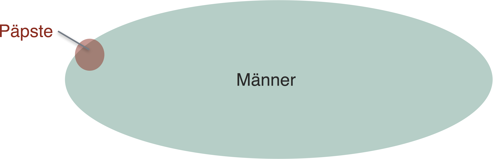

---
output:
  pdf_document: default
  html_document: default
---
```{r include=FALSE, cache=FALSE}
set.seed(1014)
options(digits = 3)

knitr::opts_chunk$set(
  comment = "#>",
  collapse = TRUE,
  message = FALSE,
  warning = FALSE,
  cache = TRUE,
  out.width = "70%",
  fig.align = 'center',
  fig.width = 6,
  fig.asp = 0.618,  # 1 / phi
  fig.show = "hold",
  size = "tiny"
)

script <- TRUE


library(methods)  # sometimes not loaded, although built-in, appears like a bug
```


# Der p-Wert, Inferenzstatistik und Alternativen


```{r echo = FALSE, out.width = "30%", fig.align = "center"}
knitr::include_graphics("images/FOM.jpg")
```

```{r echo = FALSE, out.width = "10%", fig.align = "center"}
knitr::include_graphics("images/licence.png")
```


```{block2, ziele-inferenz, type='rmdcaution', echo = TRUE} 
Lernziele:

- Den p-Wert erläutern können.
- Den p-Wert kritisieren können.
- Alternativen zum p-Wert kennen.
- Inferenzstatistische Verfahren für häufige Fragestellungen kennen.

```


In diesem Kapitel werden folgende Pakete benötigt:

```{r}
library(pwr)  # Powerberechnung
library(compute.es)  # Effektstärken
library(tidyverse)  # Datenjudo
library(broom)  # Anova-Ergebnisse aufräumen
library(BayesFactor)  # Bayes-Faktor berechnen
```


```{r sir-fisher, echo = FALSE, fig.cap = "Der größte Statistiker des 20. Jahrhunderts (p < .05)", out.width = "20%", fig.align = "center"}

```

## Der p-Wert sagt nicht das, was viele denken


Der p-Wert\index{p-Wert}, entwickelt von Sir Ronald Fisher (Abb. \@ref(fig:sir-fisher)), ist die heilige Kuh der Forschenden. Das ist nicht normativ, sondern deskriptiv gemeint. Der p-Wert entscheidet (häufig) darüber, was publiziert wird, und damit, was als Wissenschaft sichtbar ist - und damit, was Wissenschaft ist (wiederum deskriptiv, nicht normativ gemeint). Kurz: Dem p-Wert kommt viel Bedeutung zu bzw. ihm wird viel Bedeutung zugemessen (vgl. Abb. \@ref(fig:who-said)). 


```{r who-said, echo = FALSE, out.width = "35%", fig.cap  = "Der p-Wert wird oft als wichtig erachtet", fig.align = "center"}

```


Der p-Wert ist der tragende Ziegelstein in einem Theoriegebäude, das als *Nullhypothesen-Signifikanztesten*\index{Nullhypothesen-Signifikanztesten} (NHST^[Der Term 'Signifikanz-Hypothesen-Inferenz-Testen' hat sich nicht durchgesetzt]) bezeichnet wird. Oder kurz als 'Inferenzstatistik' bezeichnet. Was sagt uns der p-Wert? Eine gute intuitive Definition ist:

>    Der p-Wert sagt, wie gut die Daten zur Nullhypothese passen.


Die (genaue) Definition des p-Werts ist kompliziert; man kann sie leicht missverstehen:

> Der p-Wert - P(D|H) - gibt die Wahrscheinlichkeit P unserer Daten D an (und noch extremerer), unter der Annahme, dass die getestete Hypothese H wahr ist (und wenn wir den Versuch unendlich oft wiederholen würden, unter identischen Bedingungen und ansonsten zufällig).

Mit anderen Worten: Je *größer p*, desto *besser* passen die Daten zur *Nullhypothese*. Mit Nullhypothese\index{Nullhypothese} (H0) bezeichnet man die getestete Hypothese. Der Name Nullhypothese rührt vom Begriff 'nullifizieren' (verwerfen) her, da (nach dem Falsifikationismus) eine These immer nur verworfen, nie bestätigt werden kann. Da viele die eigene Hypothese nur ungern verwerfen wollen, wird die 'gegnerische Hypothese', die man loswerden will, getestet. Fällt p unter die magische Zahl von 5%, so proklamiert man Erfolg (*Signifikanz*\index{Signifikanz}) und verwirft die H0.

Der p-Wert ist weit verbreitet. Er bietet die Möglichkeit, relativ objektiv zu quantifizieren, wie gut ein Kennwert, mindestens so extrem wie der aktuell vorliegende, zu einer Hypothese passt. Allerdings hat der p-Wert seine Probleme. Vor allem: Er wird missverstanden. Jetzt kann man sagen, dass es dem p-Wert (dem armen) nicht anzulasten, dass andere/ einige ihn missverstehen. Auf der anderen Seite finde ich, dass sich Technologien dem Nutzer anpassen sollten (soweit als möglich) und nicht umgekehrt. 

Viele Menschen - inkl. Professoren und Statistik-Dozenten - haben Probleme mit dieser Definition [@Gigerenzer2004]. Das ist nicht deren Schuld: Die Definition ist kompliziert. Vielleicht denken viele, der p-Wert sage das, was tatsächlich interessant ist: die Wahrscheinlichkeit der (getesteten) Hypothese H, gegeben der Tatsache, dass bestimmte Daten D vorliegen. Leider ist das *nicht* die Definition des p-Werts. Also:

$$ P(D|H) \ne P(H|D) $$

### Von Männern und Päpsten

Formeln haben die merkwürdige Angewohnheit vor dem inneren Auge zu verschwimmen; Bilder sind für viele Menschen klarer, scheint's. Übersetzen wir die obige Formel in folgenden Satz:

>   Wahrscheinlichkeit, Mann zu sein, wenn man Papst ist UNGLEICH zur 
Wahrscheinlichkeit, Papst zu sein, wenn man Mann ist.


Oder kürzer:


$$ P(M|P) \ne P(P|M) $$


```{r moslems-terroristen, echo = FALSE, fig.cap = "Mann und Papst zu sein ist nicht das gleiche."}

```


Das Bild (Abb. \@ref(fig:moslems-terroristen)) zeigt den Anteil der Männer an den Päpsten (sehr hoch). Und es zeigt den Anteil der Päpsten von allen Männern (sehr gering). Dabei können wir uns Anteil mit Wahrscheinlichkeit übersetzen. Kurz: Die beiden Anteile (Wahrscheinlichkeiten) sind nicht gleich. Man denkt leicht, der p-Wert sei die *Wahrscheinlichkeit, Papst zu sein, wenn man Mann ist*. Das ist falsch. Der p-Wert ist die *Wahrscheinlichkeit, Papst zu sein, wenn man Mann ist*. Ein großer Unterschied.


## Der p-Wert ist eine Funktion der Stichprobengröße

Der p-Wert ist für weitere Dinge kritisiert worden [@Wagenmakers2007, @uncertainty]; z.B. dass die "5%-Hürde" einen zu schwachen Test für die getestete Hypothese bedeutet. Letzterer Kritikpunkt ist aber nicht dem p-Wert anzulasten, denn dieses Kriterium ist beliebig, könnte konservativer gesetzt werden und jegliche mechanisierte Entscheidungsmethode kann ausgenutzt werden. Ähnliches kann man zum Thema "P-Hacking" argumentieren [@Head2015, @Wicherts2016]: andere statistische Verfahren können auch gehackt werden. "Hacken" soll hier sagen, dass man - Kreativität und Wille vorausgesetzt - immer Wege finden kann, um einen Kennwert in die gewünschte Richtung zu drängen.

Ein anderer Anklagepunkt lautet, dass der p-Wert nicht nur eine Funktion der Effektgröße sei, sondern auch der Stichprobengröße. Sprich: Bei großen Stichproben wird jede Hypothese signifikant. Das ist richtig. Das schränkt die praktische Nützlichkeit ein (vgl. Abb. \@ref(fig:einfluss-pwert). Die Details der Simulation, die hinter Abb. \@ref(fig:einfluss-pwert) sind etwas umfangreicher und hier nicht so wichtig, daher nicht angegeben^[s. hier für Details: https://sebastiansauer.github.io/pvalue_sample_size/].

```{r einfluss-pwert, echo = FALSE, fig.cap = "Zwei Haupteinflüsse auf den p-Wert"}

knitr::include_graphics("images/inferenz/einfluss_pwert-crop.png")
```


>   Egal wie klein die Effektstärke ist, es existiert eine Stichprobengröße, die diesen Effekt beliebig signifikant werden lässt.


Die Verteidigung argumentiert hier, dass das "kein Bug, sondern ein Feature" sei: Wenn man z.B. die Hypothese prüfe, dass der Gewichtsunterschied zwischen Männern und Frauen 0,000000000kg sei und man findet 0,000000123kg Unterschied, ist die getestete Hypothese falsch. Punkt. Der p-Wert gibt demnach das korrekte Ergebnis. Meiner Ansicht nach ist die Antwort zwar richtig, geht aber an den Anforderungen der Praxis vorbei.


## Mythen zum p-Wert

Falsche Lehrmeinungen sterben erst aus, wenn die beteiligten Professoren in Rente gehen, heißt es. Jedenfalls halten sich eine Reihe von Mythen hartnäckig; sie sind alle falsch.


>    Wenn der p-Wert kleiner als 5% ist, dann ist meine Hypothese (H1) sicher richtig.

Falsch. Richtig ist: "Wenn der p-Wert kleines ist als 5% (oder allgemeiner: kleiner als $\alpha$, dann sind die Daten (oder noch extremer) unwahrscheinlich, vorausgesetzt die H0 gilt".

>    Wenn der p-Wert kleiner als 5% ist, dann ist meine Hypothese (H1) höchstwahrscheinlich richtig.

Falsch. Richtig ist: Wenn der p-Wert kleiner ist als $alpha$, dann sind die Daten unwahrscheinlich, *falls* die H0 gilt. Ansonsten (wenn H0 nicht gilt) können die Daten sehr wahrscheinlich sein.


>    Wenn der p-Wert kleiner als 5% ist, dann ist die Wahrscheinlichkeit der H0 kleiner als 5%.

Falsch. Der p-Wert gibt *nicht* die Wahrscheinlichkeit einer Hypothese an. Richtig ist: Ist der p-Wert kleiner als 5%, dann sind meine Daten (oder noch extremere) unwahrscheinlich (<5%), *wenn* die H0 gilt.


>    Wenn der p-Wert kleiner als 5% ist, dann habe ich die Ursache eines Phänomens gefunden.

Falsch. Richtig ist: Keine Statistik kann für sich genommen eine Ursache erkennen. Bestenfalls kann man sagen: hat man alle konkurrierenden Ursachen ausgeschlossen *und* sprechen die Daten für die Ursache *und* sind die Daten eine plausible Erklärung, so erscheint es der beste Schluss, anzunehmen, dass man *eine* Ursache gefunden hat - im Rahmen des Geltungsbereichs einer Studie.

>    Wenn der p-Wert kleiner als 5% ist, dann kann ich meine Studie veröffentlichen.

Richtig. Leider entscheidet zu oft (nur) der p-Wert über das Wohl und Wehe einer Studie. Wichtiger wäre zu prüfen, wie "gut" das Modell ist - wie präzise sind die Vorhersagen? Wie theoretisch befriedigend ist das Modell? 


>    Wenn der p-Wert *größer* als 5% ist, dann ist das ein Beleg *für* die H0.


Falsch. Richtig ist: Ein großer p-Wert ist ein Beleg, dass die Daten plausibel unter der H0 sind. Wenn es draußen regnet, ist es plausibel, dass es Herbst ist. Das heißt aber nicht, dass andere Hypothesen nicht auch plausibel sind. Ein großer p-Wert ist also Abwesenheit von klarer Evidenz -- *nicht* Anwesenheit von klarer Evidenz zugunsten der H0. Schöner ausgedrückt: "No evidence of effect ist not the same as evidence of no effect". Für die Wissenschaft ist das insofern ein großes Problem, als dass sich Zeitschriften weigern, nicht-signifikante Studien aufzunehmen: "Das ist eine unklare Befundlage. Kein Mehrwert." so die Haltung. Das führt dazu, dass die wissenschaftliche Literatur einer großen Verzerrung unterworfen ist.


## Wann welcher Inferenztest? {#wannwelcher}

In der Praxis ist es eine häufige Frage, wann man welchen statistischen Test verwenden soll. Bei @eid2010statistik findet man eine umfangreiche Tabelle dazu; auch online wird man schnell fündig (z.B. bei der [Methodenberatung der Uni Zürich](http://www.methodenberatung.uzh.ch/de/datenanalyse.html) oder beim [Ärzteblatt](https://www.aerzteblatt.de/archiv/74880/Auswahl-statistischer-Testverfahren), @welchertest). 

Die folgende Auflistung gibt einen *kurzen* Überblick zu gebräuchlichen Verfahren. Entscheidungskriterium ist hier (etwas vereinfacht) das Skalenniveau der Variablen (unterschieden in Input- und Outputvariablen).

1. 2 nominale Variablen: $\chi^2$-Test - `chisq.test`
1. Output: 1 metrisch, Input: 1 dichotom: t-Test - `t.test`
1. Output: 1 oder mehr metrisch, 1 nominal: Varianzanalyse - `aov`
1. 2 metrische Variablen: Korrelation - `cor.test`
1. Output: 1 metrisch, Input: 1 oder mehr nominal oder metrisch: Regression - `lm`
1. Output: 1 ordinal, Input: 1 dichotom: Wilcoxon (Mann-Whitney-U-Test) - `wilcox.test`
1. Output: 1 ordinal, Input: 1 nominal: Kruskal-Wallis-Test - `kruskal.test`
1. 1 metrisch (Test auf Normalverteilung): Shapiro-Wilk-Test - `shapiro.test`
1. Output: 1 dichotom, Input 1 oder mehr nominal oder metrisch: logistische (klassifikatorische) Regression: `glm(..., family = "binomial")`
1. 2 ordinal: Spearmans Rangkorrelation - `cor.test(x, y, method = "spearman")`


## Vertiefung: Beispiele für häufige Inferenztests

Schauen wir uns für jeden Test aus Kapitel \@ref(wannwelcher) ein Anwendungsbeispiel an.

### $\chi^2$-Test

Laden wir den Datensatz `extra`. Ob es wohl einen Zusammenhang gibt zwischen (der Anzahl von) Geschlecht und extremen Alkoholgenuss? Definieren wir 'extrem' durch mehr als 10 Kater.


*Forschungsfrage: Gibt es einen Zusammenhang zwischen Geschlecht und extremen Alkoholgenuss?*

Synonym wäre zu fragen, ob sich die Stufen von Geschlecht (die Geschlechter, also Mann und Frau) hinsichtlich ~~Saufen~~extremen Alkoholgenuss unterscheiden.


```{r warning = FALSE}
extra <- read.csv("data/extra.csv")

extra$viel_saeufer <- extra$n_hangover > 10

chisq.test(x = extra$sex, extra$viel_saeufer)
```

Achtung, falls Ihre Daten in aggregierter Form vorliegen, müssen Sie sie folgendermaßen übergeben werden:

```{r}
table(x = extra$sex, extra$viel_saeufer) %>% chisq.test
```

### t-Test

*Forschungsfrage: Sind Männer im Schnitt extrovertierter als Frauen?*


```{r}
extra %>% 
 filter(sex %in% c("Frau", "Mann")) %>% 
  mutate(sex = factor(.$sex)) %>% 
  t.test(extra_mean ~ sex, data = ., alternative = "less")

```

Auf Deutsch liest sich der letzte Befehlsblock so:

```{block2, ttest-syntax, type='rmdpseudocode', echo = TRUE} 

Nimm den Datensatz `extra` UND DANN  
filtere nur Zeilen heraus, in denen bei Geschlecht 'Mann' oder 'Frau' steht (es gibt Zeilen mit '""' als Wert)  UND DANN  
definiere `sex` als Faktor und zwar so, dass es nur Faktorstufen gibt, die es auch in den Daten gibt ('Frau oder 'Mann') UND DANN 
führe einen gerichteten t-Test durch mit ´extra_mean` als Output-Variable und `sex` als Gruppierungsvariable.

```


Der Punkt `.` meint hier den Datensatz in aktueller Form, so also, wie er aus der letzten (vorherigen) Zeile herausgekommen ist.


Hinweise:

- Der t-Test testet im Standard *un*gerichtet.
- Wird eine Gruppierungsvariable (wie Geschlecht) vom Typ `factor` angegeben, so muss diese 2 Faktorstufen haben. Allein durch filtern wird man zusätzliche Faktorstufen nicht los (im Gegensatz zu Variablen vom Typ `character`, Text). Man muss die Faktorvariable neu als Faktorvariable definieren. Dann werden nur die existierenden Werte als Faktorstufen herangezogen.
- Bei gerichteten Hypothesen sieht `t.test` zwei Möglichkeiten vor: `less` und `greater`. Woher weiß man, welches von beiden man nehmen muss? Die Antwort lautet: Bei Textvariablen sind die Stufen alphabetisch geordnet. R sagt also sozusagen: `Frau ? Mann`. Und für `?` müssen wir das richtige Ungleichheitszeichen einsetzen (< oder >), so dass es unserer Hypothese entspricht. In diesem Fall glauben wir, dass Frauen weniger (bzw. Männer mehr) trinken, also haben wir `less` gewählt.
- Liegt der Datensatz nicht tidy vor, also gibt es z.B. eine Spalte mit Extraversionswerten für Männer und eine für Frauen, so darf man *nicht* die Formelsyntax (Kringel, Tilde "~"") nehmen, sondern benennt die Spalten mit X und Y: `t.text(x = df$extra_maenner, y = df$extra_frauen)`.
  
  

### Varianzanalyse 

*Forschungsfrage: Unterscheiden sich Menschen mit unterschiedlich viel Kundenkontakt in ihrer Extraversion?*

Der Kundenkontakt wurde mit einer Likertskala gemessen, die mehrere Stufen von "weniger als einmal pro Quartal" bis "im Schnitt mehrfach pro Tag" reichte. Wir gehen nicht davon aus, dass diese Skala Intervallniveau aufweist. Obwohl Ordinalskalenniveau plausibel ist, bleiben wir bei der ANOVA (Varianzanalyse, AOV), die nur nominales Niveau ausschöpft. Beachten Sie, dass die entsprechende Variable `clients_freq` als Ganzzahl in R definiert ist, obwohl die Abstände nicht sicher gleich sind. Es ist zwar erlaubt, den Stufen einer nominalen Variablen Zahlen zuzuordnen, aber wir sollten nicht vergessen, dass die Zahlen "keine echten Zahlen" sind, also nicht metrisches Niveau aufweisen (zumindest ist das nicht sicher).

Die verschiedenen Stufen einer Variablen kann man sich so ausgeben lassen:

```{r eval = FALSE}
extra %>% distinct(clients_freq)
```


Jetzt die ANOVA:

```{r}
aov(extra_mean ~ sex, data = extra) %>% glance
```

`glance` räumt das Ergebnis der ANOVA etwas auf, so dass die Ausgabe ein Dataframe ist und die "Überblick-Koeffizienten" (daher 'glance', engl. 'Blick') ausgegeben werden. Ganz interessantes Ergebnis: statistisch signifikant (p<.05), aber $R^2$ ist sehr klein. Der F-Wert ist als `stastistic` bezeichnet.

### Korrelationen auf Signifikanz prüfen

*Forschungsfrage: Ist der Extraversion-Mittelwert und die Anzahl der Facebook-Freunde korreliert?*

Der Test prüft, ob diese Korrelation 0 ist.

```{r}
cor.test(extra$extra_mean, extra$n_facebook_friends)
```

Man kann auch - wie beim t-Test - gerichtet testen mit der gleichen Syntax, vgl. `?cor.test`.

### Regression

*Forschungsfrage: Wie groß ist der Einfluss von der Anzahl von Parties auf die Anzahl der Kater?*

```{r}
lm(n_hangover ~ n_party, data = extra) %>% tidy
lm(n_hangover ~ n_party, data = extra) %>% glance
```

`statistic` ist bei dieser Ausgabe übrigens der F-Wert und `sigma` die SD der Residualstreuung. `estimate ist die Steigung der Regressionsgeraden`.

### Wilcoxon-Test

*Forschungsfrage: Unterscheiden sich die Geschlechter in ihrer mittleren Extraversion?*

Hier nehmen wir nicht an, dass Extraversion metrisch ist, sondern begnügen uns mit der schwächeren Annahme eines ordinalen Niveaus.

```{r}
extra %>% 
 filter(sex %in% c("Frau", "Mann")) %>% 
  mutate(sex = factor(.$sex)) %>% 
  wilcox.test(extra_mean ~ sex, data = .)
```


### Kruskal-Wallis-Test

*Forschungsfrage: Unterscheiden sich Menschen mit unterschiedlich viel Kundenkontakt in ihrer Extraversion?*

Genau wie beim Wilcoxon-Test gehen wir wieder nur von ordinalem Niveau bei Extraversion aus.

```{r}
extra %>% 
 filter(sex %in% c("Frau", "Mann")) %>% 
  mutate(sex = factor(.$sex)) %>% 
  kruskal.test(extra_mean ~ sex, data = .)
```


### Shapiro-Test

*Forschungsfrage: Ist Extraversion normalverteilt?*

Wahrscheinlich ist es sinnvoller, diese Frage mit einem Histogramm (oder QQ-Plot) zu beantworten, weil der Test bei großen Stichproben (zu) schnell signifikant wird. Aber machen wir es mal:

```{r}
shapiro.test(extra$extra_mean)
```

Signifikant. Die Variable ist also *nicht* (exakt) normalverteilt. Böse Zungen behaupten, die Normalverteilung sei ungefähr so häufig wie Einhörner [@Micceri1989]. Trotzdem setzen viele Verfahren sie voraus. Glücklicherweise reicht es häufig, wenn eine Variable *einigermaßen*  normalverteilt ist (wobei es hier keine klaren Grenzen gibt).

### Logistische Regression 

*Forschungsfrage: Kann man anhand der Extraversion vorhersagen, ob eine Person Extremtrinker ist?*

```{r}
glm(viel_saeufer ~ extra_mean, data = extra, family = "binomial") %>% tidy
```


### Spearmans Korrelation

*Forschungsfrage: Ist die Extraversion assoziiert mit der Anzahl der Kundenbesuche?*

```{r warning = FALSE, eval = FALSE}
cor.test(extra$extra_single_item, extra$clients_freq, method = "spearman")
```


## Zur Philosophie des p-Werts: Frequentismus

Der p-Wert basiert auf der Idee, dass man ein Experiment *unendlich* oft wiederholen könnte (wer die Zeit hat, nicht wahr); und das unter *zufälligen* aber *ansonsten komplett gleichen* Bedingungen; das ist eine Kernidee des sog. 'Frequentismus' [@Neyman1933]. Diese Philosophie betrachtet Wahrscheinlichkeit als der Anteil, der sich bei unendlich häufiger Wiederholung eines Experiments ergibt. Ein Münzwurf hingegen ist das klassische Modell der frequentistischen Idee der Wahrscheinlichkeit (vgl. Abb. \@ref(fig:muenzwurf)). Wirft man eine faire Münze oft, so nähert sich der relative Anteil von 'Kopf' an 50% an.

```{r echo = FALSE}
df <- data_frame(
  i = 1:500,
  flip = sample(x = c(0,1), size = 500, replace = TRUE),
  prop = cumsum(flip) / i
)
```


```{r muenzwurf, echo = FALSE, fig.cap = "Anteil von 'Kopf' bei wiederholtem Münzwurf"}

ggplot(df) +
  aes(x = i, y = prop) +
  geom_line() +
  geom_point(color = "grey40") +
  ylim(c(0,1)) +
  labs(x = "Anzahl der Würfe",
       y = "Anteil von 'Kopf'")

```


Ob es im Universum irgendetwas gibt, das unendlich ist, ist streitbar [@ruckerinfinity, @uncertainty]. Jedenfalls ist die Vorstellung, das Experiment unendlich oft zu wiederholen, unrealistisch. Inwieweit Zufälligkeit und Vergleichbarkeit hergestellt werden kann, ist auch fragwürdig [@uncertainty].


Die frequentistische Idee der Wahrscheinlichkeit darf Aussagen wie dieser keine Wahrscheinlichkeit zuweisen: "5 von 10 Marsianer trinken gerne Bier und Schorsch ist Marsianer" [@uncertainty; @neyman1992problem; @Neyman1933]. Häufigkeitsaussagen a la Frequentismus machen hier offenbar wenig Sinn. Trotzdem fühlen sich manche unter uns geneigt, die Wahrscheinlichkeit, dass Schorsch der Marsianer gern Bier trinkt, auf 50% zu bemessen. Ein anderes, weniger fernes Beispiel: Ich werfe eine Münze hoch, fange sie auf, verdeckt. Wie hoch ist die Wahrscheinlichkeit, dass die Münze mit Kopf nach oben liegt? 50%? Moment, einzelne Ereignisse haben keine Wahrscheinlichkeit, sagt der Frequentismus. Wer sich geneigt fühlt (wie ich), hier doch eine Wahrscheinlichkeit zuzuordnen (50%), der tut dies offenbar nicht auf Basis des Frequentismus. Eine theoretische Position, die Wahrscheinlichkeiten erlaubt, kann man als *epistemologische Wahrscheinlichkeit*  bezeichnen [@uncertainty]: Alle möglichen von $n$ Ergebnissen erscheinen uns gleich plausibel. Daher schließen wir, dass die Wahrscheinlichkeit des Ereignisses $k$ 1 durch $n$ ($1/n$) beträgt.


## Alternativen zum p-Wert

Eine Reihen von Alternativen (oder Ergänzungen zum p-Wert) wurden vorgeschlagen.

### Konfidenzintervalle

Konfidenzintervalle\index{Konfidenzintervalle} (Zu) einfach gesagt, gibt ein 95%- Konfidenzintervall an, wie groß der Bereich ist, mit dem der gesuchte Parameter zu 95% Wahrscheinlichkeit liegt (oder allgemeiner das $1-\alpha$ -Konfidenzintervall. Das kennt man aus dem Wetterbericht, wenn es heißt, dass die Höchsttemperatur morgen zwischen 20 und 24 Grad liegen werde. 

Etwas genauer gesagt ist es nach den Urhebern des Konfidenzintervalls, Neyman und Pearson, gar nicht möglich, für ein einzelnes Ereignis eine Wahrscheinlichkeit anzugeben [@clopper1934use; @neyman1935problem]. Wenn ich eine Münze hochwerfe und sie auffange, wie groß ist die Wahrscheinlichkeit, dass sie auf Kopf gelandet ist? 50%? Falsch, sagen 'Frequentisten' a la Neyman und Pearson, entweder ist die Münze auf Kopf gelandet, dann kann man höchstens sagen, $p(K)=1$ oder auf Zahl, dann entsprechend $p(Z)=1$. Eine Wahrscheinlichkeit macht nur Sinn nach diesem Verständnis, wenn man den Versuch *oft* (unendlich) wiederholt. Daher lautet  eine genauere Definition: 

>   Das 95%-Konfidenzintervall ist der Bereich, in dem der Parameter in 95% der Fälle fallen würde bei sehr häufiger Wiederholung des Versuchs. 


Mit Parameter ist hier der Mittelwert der Population gemeint (auch bezeichnet als 'wahrer Mittelwert'). Das Konfidenzintervall macht also Aussagen zur *über ein Verfahren* (einen Bereich berechnen auf Basis von Stichprobendaten), *nicht über den wahren Mittelwert*.


Hier findet sich eine schöne [Visualisierung zum Konfidenzintervall](http://rpsychologist.com/d3/CI/).


Genau wie der p-Wert werden Konfidenzintervalle häufig missverstanden (sie sind Blutsbrüder im Geiste). Die Studie von Hoekstra, Morey, Rouder und Wagenmakerks [-@hoekstra2014robust] zeigt das auf amüsante Weise. In der Studie legten die Autoren einigen Studenten und Wissenschaftlern sechs Fragen zum Wissens-Konfidenzintervall vor, die beantwortet werden sollten. Es wurde ein Kontext vorgestellt, etwa so "Professor Bumbledorf führt ein Experiment durch. Das Ergebnis fasst er in einem 95%-Konfidenzintervall für den Mittelwert zusammen, welches von 0,1 bis 0,4 reicht". Dann folgten sechs Aussagen, die mit *stimmt* oder *stimmt nicht* zu beantworten waren. Beurteilen auch Sie diese Aussagen^[alle sechs sind falsch].


---

1. Die Wahrscheinlichkeit, dass der wahre Mittelwert größer als 0 ist, liegt bei mindestens 95%.
2. Die Wahrscheinlichkeit, dass der wahre Mittelwert gleich 0 ist, ist kleiner als 5%.
3. Die Nullhypothese, dass der wahre Mittelwert 0 ist, ist wahrscheinlich falsch.
4. Die Wahrscheinlichkeit, dass der wahre Mittelwert zwischen 0,1 und 0,4 liegt, beträgt 95%.
5. Wir können zu 95% sicher sein, dass der wahre Mittelwert zwischen 0,1 und 0,4 liegt.
6. Wenn wir das Experiment immer wieder wiederholen würden, dann würde der wahre Mittelwert in 95% der Fälle zwischen 0,1 und 0,4 fallen.

---


Aussagen 1, 2, 3 und 4 behaupten, der Hypothese bzw. dem Parameter eine Wahrscheinlichkeit zuweisen zu können. Innerhalb des NHST ist das nicht erlaubt, für da Konfidenzintervall sowenig wie für den p-Wert. Aussagen 5 trifft eine Aussage über den wahren Wert, aber Konfidenzintervalle treffen Aussagen über ein Verfahren. Aussage 6 behauptet, dass der wahre Wert variieren könne, tut der aber nicht. Die richtige Aussage, die nicht dabei stand, ist: "Wenn man den Versuch immer wiederholen würden, würden 95% der Intervalle den wahren Mittelwert enthalten". Im Schnitt wurden etwa 3,5 Antworten mit *stimmt* angekreuzt (die Wissenschaftler waren nicht besser als die Studenten).


### Effektstärke

Eine weitere Alternative sind Maße der *Effektstärke*\index{Effektstärke} [@Cohen1992]. Effektstärkemaße geben an, wie sehr sich zwei Parameter unterscheiden: "Deutsche Männer sind im Schnitt 13cm größer als Frauen" [@wiki:groesse]. Oder: "In Deutschland ist die Korrelation von Gewicht und Größe um 0,12 Punkte höher als in den USA" (frei erfunden). Im Gegensatz zu p-Werten wird keine Art von Wahrscheinlichkeitsaussage angestrebt, sondern die Größe von Parameter(unterschieden) quantifiziert. Effektstärken sind, im Gegensatz zum p-Wert, auch nicht abhängig von der Stichprobengröße. Man kann Effektstärken in nicht-standardisierte (wie Unterschiede in der Größe) oder standardisierte (wie Unterschiede in der Korrelation) einteilen. 

Nicht-standardisierte Effektstärken haben den Vorteil der Anschaulichkeit. Standardisierte Effektgrößen sind präziser, aber unanschaulicher. Bei Variablen mit unanschaulichen Metriken (wie psychologische Variablen und Umfragen) ist ein standardisiertes Maß häufig nützlicher. 

>   Anschauliche Variablen sind oft mit unstandardisiertes Effektstärken adäquat dargestellt. Variablen mit wenig anschaulichen Metriken profitieren von standardisierten Effektstärkemaßen.


Um zwei Mittelwerte zu vergleichen, ist *Cohens d*\index{Cohens d} gebräuchlich. Es gibt den Unterschied der Mittelwert standardisiert an der Standardabweichung an [@cohen_statistical_1988]. Das ist oft sinnvoll, denn 5$ Preisunterschied können viel oder weniger sein: Bei Eiskugeln wäre der Unterschied enorm (die Streuung ist viel weniger als 5€), bei Sportwagen wäre der Unterschied gering (die Streuung ist viel höher als 5€).


#### Typische Effektstärkemaße

Zu den typischen Effektstärkemaßen zählen die folgenden (vgl. @eid2010statistik):

- $d$ (Cohens d) wird zur Bemessung des Unterschieds der Überlappung zweier Verteilungen verwendet, z.B. um die Effektstärke eines t-Werts zu quantifizieren. $d$ berechnet sich im einfachsten Fall als: $d = \frac{\mu_1 - \mu_2}{sd}$.
- $r$	Pearsons R ist ein Klassiker, um die Stärke des linearen Zusammenhangs zweier metrischen Größen zu quantifizieren. $r$ berechnet sich als: $r = mw(\sum z_x z_y)$, wobei $mw$ für den Mittelwert steht und $z$ für einen z-Wert.
- $R^2$, $\eta^2$ sind Maße für den Anteil aufgeklärter Varianz; sie finden in der Varianzanalyse oder der Regressionsanalyse Verwendung. $R^2$ wird u.a. so berechnet: $R^2 = \frac{QS_F}{QS_T}$, wobei $QS$ für die Quadratsummen stehen und $QS_F$ für die Varianz, die auf den Faktor (uanbhängige Variable) zurückgeht und $QS_T$ für die Gesamtvarianz. 
- $f^2$ ist ein Maß, dass aus der erklärten Varianz abgeleitet ist. Es gibt das Verhältnis von erklärter zu nicht-erklärter Varianz wieder (auch 'signal-noise-ratio' genannt). Es berechnet sich als $f^2 = \frac{R^2}{1-R^2}$.
- $\omega$ (Cohens Omega) ist ein Maß für die Stärke des Zusammenhangs zweier nominaler Variablen, abgeleitet vom $\chi^2$-Test. Es berechnet sich als $\omega = \sqrt{\chi^2}$.
- $OR$ (Odds Ratio) ist ebenfalls ein Maß für die Stärke des Zusammenhangs zweier nominaler Variablen, allerdings *binärer* (zweistufige) Variablen. Es berechnet sich als $OR = \frac{c}{1-c}$, wobei $c$ die Chancen für ein Ereignis $E$ angeben (z.B. 9:1). $OR$ kann aus $\omega$ abgleitet werden.


Tabelle \@ref(tab:effectsizes) gibt einen groben Überblick über Effektstärken (nach  -@cohen_statistical_1988 und Eid, Schmitt und Gollwitzer [-@eid2010statistik]. Zu beachten ist, dass die Einschätzung was ein 'großer' oder 'kleiner' Effekt ist, nicht pauschal übers Knie gebrochen werden sollte. Besser ist es, die Höhe der  Effektstärke im eigenen Datensatz mit relevanten anderen Datensätzen zu vergleichen.

```{r effectsizes, echo = FALSE}

df <- read_csv("includes/effectsizes.csv")

knitr::kable(df, caption = "Überblick über gängige Effektstärkemaße")

```


>   Was ein "kleiner" oder "großer" Effekt ist, sollte im Einzelfall entschieden werden.


Mit dem Paket `pwr` kann man sich Cohens Konventionen der Effektstärkehöhen in Erinnerung rufen lassen. Er bietet folgende Optionen:

```{r eval = FALSE}
cohen.ES(test = c("p", "t", "r", "anov", "chisq", "f2"),
    size = c("small", "medium", "large"))

```


#### Effektstärken berechnen

Möchte man sich Effektstärken berechnen lassen, ist das Paket `compute.es` hilfreich. Im Folgenden sind Effektstärkeberechnungen für gängige Inferenztests vorgestellt, in Fortsetzung zu den Beispielen oben.


- $\chi^2$-Test: `compute.es::chies(30, n  = 826)`
- t-Test: `compute.es::tes(t = 1, n.1 = 529, n.2 = 286)`
- Varianzanalyse (F-Test): `glance` gibt $R^2$ aus; mit `etaSquared(mein_aov)` ebenfalls. Möchte man $f^2$ berechnen, so tut man das am besten per Hand, z.B. `0.002 / (1-0.002)`.
- Korrelation: Der Korrelationswert $r$ ist schon ein Maß der Effekstärke. Yeah.
- Regression: Die Steigung der Regressionsgeraden ($b$) ist ein (unstandardisiertes) Maß für die Stärke des ("Netto"-)Einflusses eines Prädiktors. $R^2$ hingegen ein Maß für die relative Varianzaufklärung aller Prädiktoren gemeinsam.
- Logistische Regression: Mit `BaylorEdPsych::PseudoR2(mein_glm_objekt)` kann man eine Art $R^2$ bekommen (s. Kapitel \@ref(Modellguete)).
- Wilcoxon-Test/ Mann-Whitney-U-Test: Anteil der paarweisen Vergleiche, die hypothesenkonform sind [vgl. @Kerby2014]. Dazu kann man z.B. die Funktion `prop_fav` aus dem Paket `prada` nutzen (vgl. `help(prop_fav)`).


### Bayes-Statistik

Bayes' Ansatz verrechnet zwei Komponenten, um die Wahrscheinlichkeit einer Hypothese im Lichte bestimmter Daten zu berechnen. Der Ansatz ist elegant, mathematisch lupenrein und ist überhaupt eine tolle Sache. Bayes' Theorem gibt uns das, was uns eigentlich interessiert: Die Wahrscheinlichkeit der getesteten Hypothese, im Lichte der vorliegenden Daten: $p(H|D)$. Diesen Wert nennt man auch den *Vorhersagewert*. Zur Erinnerung: Der p-Wert gibt die Wahrscheinlichkeit der Daten an, unter Annahme der getesteten Hypothese: $p(D|H)$. Offenbar sind beide Terme nicht identisch.

Die Bayes-Statistik zieht zwei Komponenten zur Berechnung von $p(H|D)$ heran. Zum einen die Grundrate einer Hypothese $p(H)$ zum anderen die relative Plausibilität der Daten unter meiner Hypothese im Vergleich zur Plausibilität der Daten unter konkurrierenden Hypothesen. Betrachten wir ein Beispiel. Die Hypothese "Ich bin krank" sei unter Betrachtung (jetzt noch keine vorschnellen Einschätzungen). Die Grundrate der fraglichen Krankheit sei 10 von 1000 (1%). Der Test, der zur Diagnose der Krankheit verwendet wird, habe eine Sicherheit von 90%. Von 100 Kranken wird der Test demnach 90 identifizieren (auch *Sensitivität* genannt) und 10 werden übersehen (ein Überseh- oder *Betafehler* von 10%). Umgekehrt wird der Test von 100 Gesunden wiederum 90 als Gesund, und demnach korrekt diagnostizieren (*Spezifität*); 10 werden fälschlich als krank einschätzt (*Fehlalarm*  oder *Alpha-Fehler*). 

Jetzt Achtung: Der Test sagt, ich sei krank. Die Gretchen-Frage lautet, wie hoch ist die Wahrscheinlichkeit, dass diese Hypothese, basierend auf den vorliegenden Daten, korrekt ist?

Abbildung \@ref(fig:bayes) stellt das Beispiel in Form eines Baumdiagrammes dar.

```{r bayes, echo = FALSE, fig.cap = "Die zwei Stufen der Bayes-Statistik in einem einfachen Beispieli"}

knitr::include_graphics("images/inferenz/bayes-crop.png")

```

In der Medizin ist 'positiv' zumeist eine schlechte Nachricht, es soll sagen, dass der Test der Meinung ist, die getestete Person ist krank (das getestete Kriterium trifft zu).

Wie man leicht nachrechnen kann, beträgt die Wahrscheinlichkeit, *in Wirklichkeit krank* zu sein, wenn der positiv ist, ~8%: $9 / (99+9) = \frac{9}{108} \approx 8\%$. Das überrascht auf den ersten Blick, ist doch der Test so überaus zufällig (jedenfalls zu 90%)! Aber die Wahrscheinlichkeit, dass die Hypothese 'krank' zutrifft, ist eben nicht nur abhängig von der Sicherheit des Tests, sondern auch von der Grundrate. Beide Komponenten sind nötig, um den Vorhersagewert zu berechnen. Der p-Wert begnügt sich mit der Aussage, ob der Test positiv oder negativ ist. Die Grundrate wird nicht berücksichtigt.


>    Die Bayes-Statistik liefert die Wahrscheinlichkeit einer Hypothese H, wenn wir die Daten D (d.h. ein gewisses Stichprobenergebnis) gefunden habe: p(H|D). Damit gibt die Bayes-Statistik die Antwort, die sich die meisten Anwedner wünschen.

Fairerweise muss man hinzufügen, dass die Grundrate für die Wissenschaft oft nicht einfach zu bestimmen ist. Wer kennt schon die Grundrate der 'guten Ideen'? Vielleicht der liebe Gott, aber [der hilft uns nicht](https://twitter.com/TheTweetOfGod/status/688035049187454976) [@god_i_2016]. Wir werden also eine Einschätzung treffen müssen, die subjektiv sein kann. Diese Subjektivität ist von Kritikern moniert worden.

Auf der anderen Seite kann man diese Subjektivität umgehen, indem man nur angibt, um welchen Faktor die H1 wahrscheinlicher ist als die H0, durch die Daten der Studie. Das wird durch den sog. *Bayes-Faktor* $BF$ ausgedrückt. Liegt $BF$ bei 10, so eine gängige Konvention, so ist dies "starke" Evidenz für H1 (da H1 dann 10 mal wahrscheinlicher als die H0); entsprechend stark ist ein $BF$ von 0.1 (1/10) - zugunsten H0. Gängige Software (s. Abschnitt \@ref(verweise-inferenz)) geben den Bayes-Faktor aus.


Ein t-Test a la Bayes kann z.B. so berechnet werden:

```{r}

extra %>% 
  group_by(sex) %>% 
  summarise(mean(extra_mean, na.rm = TRUE))

extra %>% 
  filter(sex %in% c("Mann", "Frau")) %>% 
  mutate(sex = factor(sex)) %>% 
  as.data.frame %>%  # 'ttestBF' verkraftet nur althergebrachte data.frames!
  ttestBF(formula = extra_mean ~ sex,
        data = .)  # 'formula' musst hingeschrieben sein, sonst droht Fehlermeldung


```


Hey, Sie haben gerade einen Bayes-Test gerechnet! Wow! Das Ergebnis zeigt einen $BF$ von 0.24; Evidenz *zugunsten* der H0. Nicht stark; sondern schwach. Keine überzeugende Evidenz für H1. Man beachte, dass der Befehl hier "indifferent" gegenüber der H0 und der H1 war. A priori wurden hier beide Hypothesen als gleich wahrscheinlich angesehen. Jetzt ist unsere Überzeugung für die H1 gesunken bzw. für die H0 gestiegen und zwar etwa um den Faktor 1/4 auf 0.24.


## Aufgaben^[F, F, R, F, F, F, F, R, R, R]


```{block2, exercises-inferenz, type='rmdexercises', echo = TRUE} 
Richtig oder Falsch!?

1. Der p-Wert gibt die Wahrscheinlichkeit der H0 an unter der Annahme der Daten.

1. p(D|H) = p(H|D)

1. Der p-Wert sagt, wie gut die Daten zur Nullhypothese passen.

1. Bei sehr großen Stichproben werden nur sehr große Effekte signifikant.

5. Egal wie klein die Effektstärke ist, es existiert eine Stichprobengröße, die diesen Effekt beliebig signifikant werden lässt.

1. Wenn der p-Wert kleiner als 5% ist, dann ist meine Hypothese (H1) höchstwahrscheinlich richtig.

1. Wenn der p-Wert größer als 5% ist, dann ist das ein Beleg für die H0.

1. Der p-Wert basiert auf der Idee, dass man ein Experiment unendlich oft wiederholt; und das unter zufälligen aber ansonsten komplett gleichen Bedingungen.

1. Das 95%-Konfidenzintervall ist der Bereich, in dem der Parameter in 95% der Fälle fallen würde bei sehr häufiger Wiederholung des Versuchs.

1. Der Vorhersagewert ist definiert als p(H|D).


```


## Fazit

Der p-Wert ist eine häufig verwendete Methode, um datenbasiert zu entscheiden, ob man eine Hypothese annimmt oder nicht. Allerdings hat der p-Wert auch seine Probleme. 

>   Der p-Wert sollte nicht als einziges Kriterium verwendet werden, um eine Hypothese bzw. ein Modell zu beurteilen.


Da der p-Wert aber immer noch der Platzhirsch auf vielen Forschungsauen ist, führt kein Weg um ihn herum. Er muss genau verstanden werden: Was er sagt und - wichtiger noch - was er nicht sagt.

Alternativen zum p-Wert sind

- Konfidenzintervalle
- Effektstärkemaße inkl. Maße der Vorhersagegenauigkeit
- Bayes-Theorem


```{r fig-dino, echo = FALSE, out.width = "30%", fig.align = "center"}

```


## Verweise {#verweise-inferenz}

- Eine Einführung zur Bayes-Statistik findet man z.B. bei Kruschke [-@kruschke2010bayesian] oder bei @etz2016become. 
- Eine ausführliche Darstellung der Inferenzstatistik und des p-Werts findet sich z.B. bei @lubke2014angewandte oder @eid2010statistik.

- Eine vielversprechende, noch recht neue Software ist [JASP](), die nicht nur schöne Diagramme erstellt, sondern auch auf Mausklick eine Reihe von bayesianischer (und frequentistischer) Tests durchrechnet.

