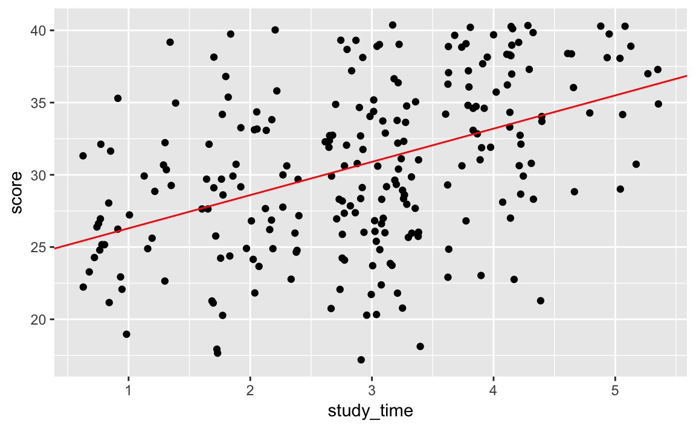
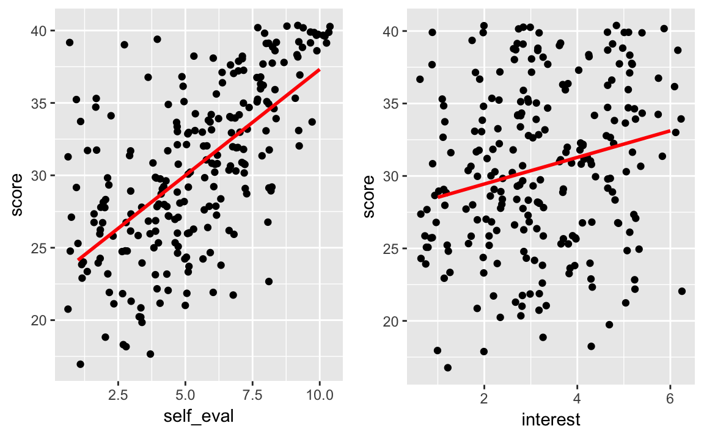
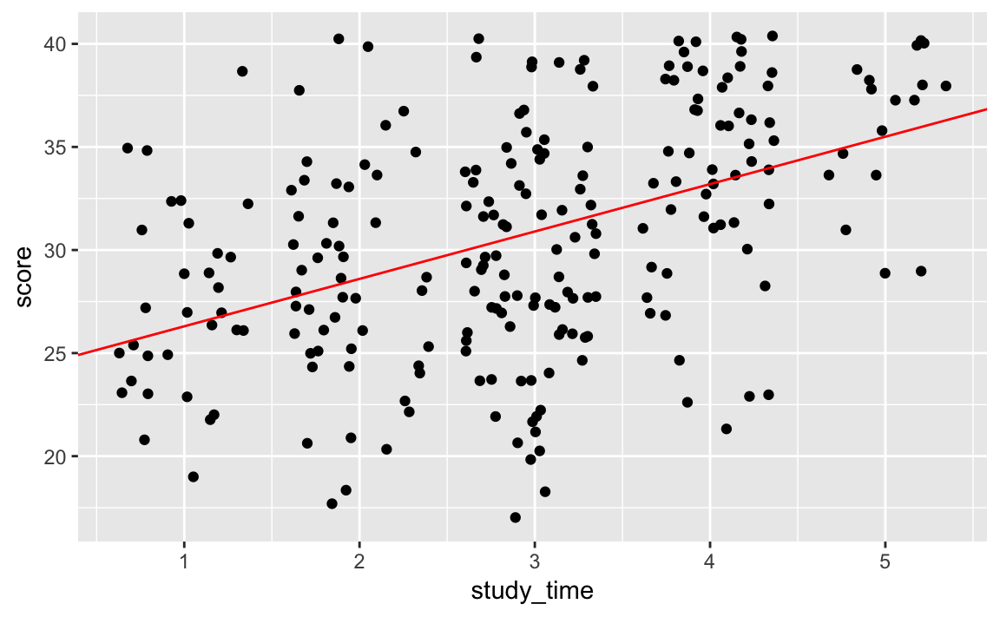
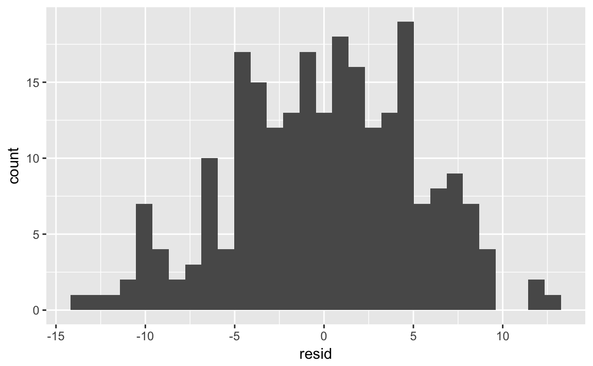
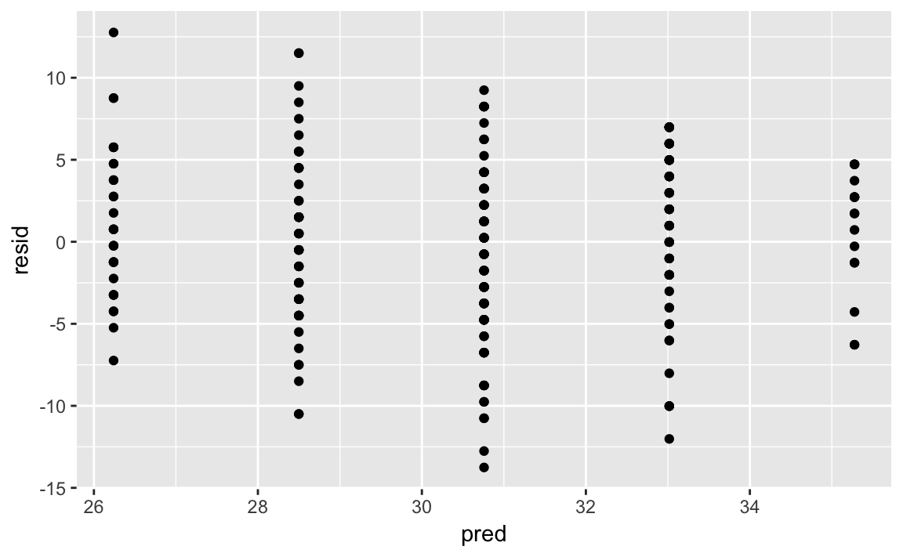
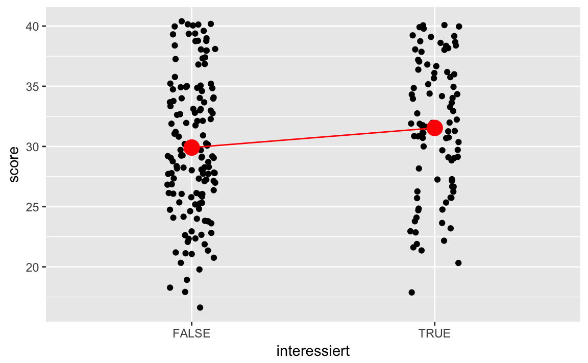
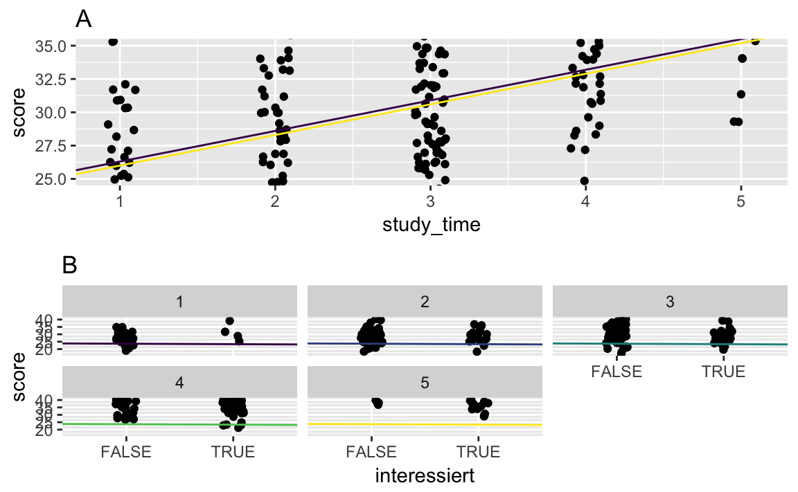
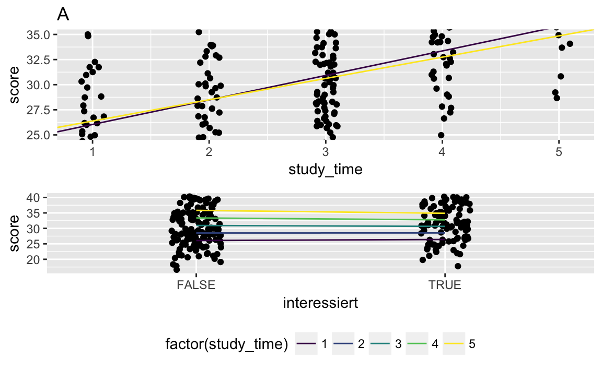

\part{Geleitetes Modellieren}


# Lineare Regression


\BeginKnitrBlock{rmdcaution}<div class="rmdcaution">Lernziele:


- Wissen, was man unter Regression versteht.
- Die Annahmen der Regression überprüfen können.
- Regression mit kategorialen Prädiktoren durchführen können.
- Die Modellgüte bei der Regression bestimmen können.
- Interaktionen erkennen und ihre Stärke einschätzen können.


</div>\EndKnitrBlock{rmdcaution}


Für dieses Kapitel benötigen Sie folgende Pakete:

```r
library(caret)  # Modellieren
library(tidyverse)  # Datenjudo, Visualisierung,...
library(gridExtra)  # Mehrere Plots kombinieren
library(modelr)  # Residuen und Schätzwerte zum Datensatz hinzufügen
library(broom)  # Regressionswerte geordnet ausgeben lassen
```


## Die Idee der klassischen Regression

Regression\index{Regression} ist eine bestimmte Art der *Modellierung* von Daten. Wir legen eine Gerade 'schön mittig' in die Daten; damit haben wir ein einfaches Modell der Daten (vgl. Abb. \@ref(fig:bsp-regression)). Die Gerade 'erklärt' die Daten: Für jeden X-Wert liefert sie einen Y-Wert als Vorhersage zurück.


```r
stats_test <- read.csv("data/test_inf_short.csv")

stats_test %>% 
  ggplot +
  aes(x = study_time, y = score) +
  geom_jitter() +
  geom_abline(intercept = 24, 
              slope = 2.3, 
              color = "red")
```

<div class="figure" style="text-align: center">

<p class="caption">(\#fig:bsp-regression)Beispiel für eine Regression</p>
</div>

Wie wir genau die Regressionsgerade berechnet haben, dazu gleich mehr. Fürs Erste begnügen wir uns mit der etwas groberen Beobachtung, dass die Gerade 'schön mittig' in der Punktewolke liegt. 

Schauen wir uns zunächst die Syntax genauer an.

\BeginKnitrBlock{rmdpseudocode}<div class="rmdpseudocode">
Lade die CSV-Datei mit den Daten als `stats_test`.
  
Nehme `stats_test` UND DANN...  
starte ein neues Diagramm mit ggplot  
definiere das Diagramm (X-Achse, Y-Achse)  
zeichne das Geom "Jitter" (verwackeltes Punktediagramm)  
und zeichne danach eine Gerade ("abline" in rot). 

</div>\EndKnitrBlock{rmdpseudocode}

Eine Regression zeigt anhand einer Regressionsgeraden einen "Trend" in den Daten an (s. weitere Beispiele in Abb. \@ref(fig:bsp-regression2)).

<div class="figure" style="text-align: center">

<p class="caption">(\#fig:bsp-regression2)Zwei weitere Beispiele für Regressionen</p>
</div>


Eine Regression lädt förmlich dazu ein, Vorhersagen zu treffen: Hat man erstmal eine Gerade, so kann man für jeden X-Wert ("Prädiktor") eine Vorhersage für den Y-Wert ("Kriterium") treffen. Anhand des Diagramms kann man also für jede Person (d.h. jeden Wert innerhalb des Wertebereichs von `study_time` oder einem anderen Prädiktor) einen Wert für `score` vorhersagen. Wie gut die Vorhersage ist, steht erstmal auf einen anderen Blatt.

Man beachte, dass eine Gerade über ihre *Steigung* und ihren *Achsenabschnitt* festgelegt ist; in Abb. \@ref(fig:bsp-regression) ist die Steigung 2.3 und der Achsenabschnitt 24.

Der Achsenabschnitt zeigt also an, wie viele Klausurpunkte man "bekommt", wenn man gar nicht lernt (Gott bewahre); die Steigung gibt eine Art "Wechselkurs" an: Wie viele Klausurpunkte bekomme ich pro Stunde, die ich lerne. 

Unser Modell ist übrigens einfach gehalten: Man könnte argumentieren, dass der Zusatznutzen der 393. Stunde lernen geringer ist als der Zusatznutzen der ersten paar Stunden. Aber dann müssten wir anstelle der Gerade eine andere Funktion nutzen, um die Daten zu modellieren. Lassen wir es erst einmal einfach hier.

Als "Pseudo-R-Formel" ausgedrückt: 
```
score = achsenabschnitt + steigung*study_time
```

Die Vorhersage für die Klausurpunkte (`score`) einer Person sind der Wert des Achsenabschnitts plus das Produkt aus der Anzahl der gelernten Stunden mal den Zusatznutzen pro gelernter Stunde.


Aber wie erkannt man, ob eine Regression "gut" ist - die Vorhersagen also präzise?

In R kann man eine Regression so berechnen:


```r
lm(score ~ study_time, data = stats_test)
#> 
#> Call:
#> lm(formula = score ~ study_time, data = stats_test)
#> 
#> Coefficients:
#> (Intercept)   study_time  
#>       23.98         2.26
```

`lm` steht dabei für "lineares Modell"; allgemeiner gesprochen lautet die Rechtschreibung für diesen Befehl:

```
lm(kriterium ~ praediktor, data = meine_datentabelle)
```

Um ausführlichere Informationen über das Regressionsmodell zu bekommen, kann man die Funktion `summary` nutzen:


```r
mein_lm <- lm(kriterium ~ praediktor, data = meine_datentabelle)
summary(mein_lm)
```


Natürlich kann das auch ~~in der Pfeife rauchen~~ mit der Pfeife darstellen:

```
lm(kriterium ~ praediktor, data = meine_datentabelle) %>% 
  summary
```


## Vorhersagegüte

Der einfache Grundsatz lautet: Je geringer die Vorhersagefehler, desto besser; Abb. \@ref(fig:resids-plot) zeigt ein Regressionsmodell mit wenig Vorhersagefehler (links) und ein Regressionsmodell mit viel Vorhersagefehler (rechts).

<div class="figure" style="text-align: center">

<p class="caption">(\#fig:resids-plot)Geringer (links) vs. hoher (rechts) Vorhersagefehler</p>
</div>


In einem Regressionsmodell lautet die grundlegenden Überlegung zur Modellgüte damit:

>    Wie groß ist der Unterschied zwischen Vorhersage und Wirklichkeit?

Die Größe des Unterschieds (Differenz, "Delta") zwischen vorhergesagten (geschätzten) Wert und Wirklichkeit, bezeichnet man als *Fehler*, *Residuum* oder Vohersagefehler, häufig mit $\epsilon$ (griechisches e wie "error") abgekürzt.


Betrachten Sie die beiden Plots in Abb. \@ref(fig:resids-plot). Die rote Linie gibt die *vorhergesagten* (geschätzten) Werte wieder; die Punkte die *beobachteten* ("echten") Werte. Je länger die blauen Linien, desto größer die Vorhersagefehler. Je größer der Vorhersagefehler, desto schlechter. Und umgekehrt.

>   Je kürzer die typische "Abweichungslinie", desto besser die Vohersage.


Sagt mein Modell voraus, dass Ihre Schuhgröße 49 ist, aber in Wahrheit liegt sie bei 39, so werden Sie dieses Modell als schlecht beurteilen, wahrscheinlich.

Leider ist es nicht immer einfach zu sagen, wie groß der Fehler sein muss, damit das Modell als "gut" bzw. "schlecht" gilt. Man kann argumentieren, dass es keine wissenschaftliche Frage sei, wie viel "viel" oder "genug" ist [@uncertainty]. Das ist zwar plausibel, hilft aber nicht, wenn ich eine Entscheidung treffen muss. Stellen Sie sich vor: Ich zwinge Sie mit der Pistole auf der Brust, meine Schuhgröße zu schätzen.

Eine einfache Lösung ist, das beste Modell unter mehreren Kandidaten zu wählen.

Ein anderer Ansatz ist, die Vorhersage in Bezug zu einem Kriterium zu setzen. Dieses "andere Kriterium" könnte sein "einfach die Schuhgröße raten". Oder, etwas intelligenter, Sie schätzen meine Schuhgröße auf einen Wert, der eine gewisse Plausibilität hat, also z.B. die durchschnittliche Schuhgröße des deutschen Mannes. Auf dieser Basis kann man dann quantifizieren, ob und wieviel besser man als dieses Referenzkriterium ist.

### Mittlere Quadratfehler
Eine der häufigsten Gütekennzahlen ist der *mittlere quadrierte Fehler* (engl. "mean squared error", MSE), wobei Fehler wieder als Differenz zwischen Vorhersage (`pred`) und beobachtete Wirklichkeit (`obs`, `y`) definiert ist. Dieser berechnet für jede Beobachtung den Fehler, quadriert diesen Fehler und bilden dann den Mittelwert dieser "Quadratfehler", also einen *mittleren Quadratfehler*. Die englische Abkürzung *MSE* ist auch im Deutschen gebräuchlich.

$$ MSE = \frac{1}{n} \sum{(pred - obs)^2} $$

Konzeptionell ist dieses Maß an die Varianz angelehnt. Zieht man aus diesem Maß die Wurzel, so erhält man den sog. *root mean square error* (RMSE), welchen man sich als die Standardabweichung der Vorhersagefehler vorstellen kann. In Pseudo-R-Syntax:

```
RMSE <- sqrt(mean((df$pred - df$obs)^2))
```

Der RMSE hat die selben Einheiten wie die zu schätzende Variable, also z.B. Schuhgrößen-Nummern.


### R-Quadrat ($R^2$)
$R^2$, auch *Bestimmtheitsmaß*\index{Bestimmtheitsmaß} oder *Determinationskoeffizient*\index{Determinationskoeffizient} genannt, setzt die Höhe unseres Vorhersagefehlers\index{Vorhersagefehler} im Verhältnis zum Vorhersagefehler eines "Nullmodell". Das Nullmodell hier würde sagen, wenn es sprechen könnte: "Keine Ahnung, was ich schätzen soll, mich interessieren auch keine Prädiktoren, ich schätzen einfach immer den Mittelwert der Grundgesamtheit!".

Analog zum Nullmodell-Fehler spricht auch von der Gesamtvarianz oder $SS_T$ (sum of squares total); beim Vorhersagefehler des eigentlichen Modells spricht man auch von $SS_M$ (sum of squares model).

Damit gibt $R^2$ an, wie gut unsere Vorhersagen im Verhältnis zu den Vorhersagen des Nullmodells sind. Ein $R^2$ von 25% (0.25) hieße, dass unser Vorhersagefehler 25% *kleiner* ist als der der Nullmodells. Ein $R^2$ von 100% (1) heißt also, dass wir den kompletten Fehler reduziert haben (Null Fehler übrig) - eine perfekte Vorhersage. Etwas formaler, kann man $R^2$ so definieren:

$$ R^2 = 1 - \left( \frac{SS_T - SS_M}{SS_T} \right)$$

Präziser, in R-Syntax:

```
R2 <- 1 - sum((df$pred - df$obs)^2) / sum((mean(df$obs) - df$obs)^2)
```


Praktischerweise gibt es einige R-Pakete, z.B. `caret`, die diese Berechnung für uns besorgen:


```r
postResample(obs = obs, pred = pred)
```

Hier steht `obs` für beobachtete Werte und `pred` für die vorhergesagten Werte (beides numerische Vektoren). Dieser Befehl gibt sowohl RMSE als auch $R^2$ wieder.


\BeginKnitrBlock{rmdcaution}<div class="rmdcaution">Man sollte in der Regel die Korrelation (r) nicht als Gütekriterium verwenden. Der Grund ist, dass die Korrelation sich nicht verändert, wenn man die Variablen skaliert. Die Korrelation zieht allein auf das Muster der Zusammenhänge - nicht die Größe der Abstände - ab. In der Regel ist die Größe der Abstände zwischen beobachteten und vorhergesagten Werten das, was uns interessiert.
</div>\EndKnitrBlock{rmdcaution}


## Die Regression an einem Beispiel erläutert

Schauen wir uns den Datensatz zur Statistikklausur noch einmal an. Welchen Einfluss hat die Lernzeit auf den Klausurerfolg? Wieviel bringt es also zu lernen? Wenn das Lernen keinen Einfluss auf den Klausurerfolg hat, dann kann man es ja gleich sein lassen... Aber umgekehrt, wenn es viel bringt, ok gut, dann könnte man sich die Sache (vielleicht) noch mal überlegen. Aber was heißt "viel bringen" eigentlich?

>   Wenn für jede Stunde Lernen viele zusätzliche Punkte herausspringen, dann bringt Lernen viel. Allgemeiner: Je größer der Zuwachs im Kriterium ist pro zusätzliche Einheit des Prädiktors, desto größer ist der Einfluss des Prädiktors.

Natürlich könnte jetzt jemand argumentieren, dass die ersten paar Stunden lernen viel bringen, aber dann flacht der Nutzen ab, weil es ja schnell einfach und trivial wird. Aber wir argumentieren (erstmal) so nicht. Wir gehen davon aus, dass jede Stunde Lernen gleich viel (oder wenig) Nutzen bringt.

>   Geht man davon aus, dass jede Einheit des Prädiktors gleich viel Zuwachs bringt, unabhängig von dem Wert des Prädiktors, so geht man von einem linearen Einfluss aus.


Versuchen wir im ersten Schritt die Stärke des Einfluss an einem Streudiagramm abzuschätzen (s. Abb. \@ref(fig:bsp-regression)).


Hey R - berechne uns die "Trendlinie"! Dazu nimmt man den Befehl `lm`:


```r
mein_lm <- lm(score ~ study_time, data = stats_test)
summary(mein_lm)
#> 
#> Call:
#> lm(formula = score ~ study_time, data = stats_test)
#> 
#> Residuals:
#>     Min      1Q  Median      3Q     Max 
#> -13.758  -3.693   0.242   3.983  12.760 
#> 
#> Coefficients:
#>             Estimate Std. Error t value Pr(>|t|)    
#> (Intercept)   23.981      0.934   25.67   <2e-16 ***
#> study_time     2.259      0.300    7.54    1e-12 ***
#> ---
#> Signif. codes:  0 '***' 0.001 '**' 0.01 '*' 0.05 '.' 0.1 ' ' 1
#> 
#> Residual standard error: 5.15 on 236 degrees of freedom
#>   (68 observations deleted due to missingness)
#> Multiple R-squared:  0.194,	Adjusted R-squared:  0.191 
#> F-statistic: 56.8 on 1 and 236 DF,  p-value: 1.02e-12
```

`lm` steht für 'lineares Modell', eben weil eine *Linie* als Modell in die Daten gelegt wird. Aha. Die Steigung der Geraden beträgt 2.3 - das ist der Einfluss des Prädiktors Lernzeit auf das Kriterium Klausurerfolg! Man könnte sagen: Der "Wechselkurs" von Lernzeit auf Klausurpunkte. Für jede Stunde Lernzeit bekommt man offenbar 2.3 Klausurpunkte (natürlich viel zu leicht). Wenn man nichts lernt (`study_time == 0`) hat man 24 Punkte.

>    Der Einfluss des Prädiktors steht unter 'estimate'. Der Kriteriumswert wenn der Prädiktor Null ist steht unter '(Intercept)'.


Malen wir diese Gerade in unser Streudiagramm (Abbildung \@ref(fig:stats-test-scatter2).


```r
ggplot(data = stats_test) +
  aes(y = score, x = study_time) +
  geom_jitter() +
  geom_abline(slope = 2.3, intercept = 24, color = "red")
```

<div class="figure" style="text-align: center">

<p class="caption">(\#fig:stats-test-scatter2)Streudiagramm von Lernzeit und Klausurerfolg</p>
</div>

Jetzt kennen wir die Stärke (und Richtung) des Einflusses der Lernzeit. Ob das viel oder wenig ist, ist am besten im Verhältnis zu einem Referenzwert zu sagen.

Die Gerade wird übrigens so in die Punktewolke gelegt, dass die (quadrierten) Abstände der Punkte zur Geraden minimal sind. Dies wird auch als *Kriterium der Kleinsten Quadrate*\index{Kriterium der Kleinsten Quadrate} (*Ordinary Least Squares*, *OLS*)\index{Ordinary Least Squares} bezeichnet.

Jetzt können wir auch einfach Vorhersagen machen. Sagt uns jemand, ich habe "viel" gelernt (Lernzeit = 4), so können wir den Klausurerfolg grob im Diagramm ablesen.

Genauer geht es natürlich mit dieser Rechnung:

$y = 4*2.3 + 24$

Oder mit diesem R-Befehl:


```r
predict(mein_lm, data.frame(study_time = 4))
#>  1 
#> 33
```


Berechnen wir noch die Vorversagegüte des Modells.


```r
summary(mein_lm)
#> 
#> Call:
#> lm(formula = score ~ study_time, data = stats_test)
#> 
#> Residuals:
#>     Min      1Q  Median      3Q     Max 
#> -13.758  -3.693   0.242   3.983  12.760 
#> 
#> Coefficients:
#>             Estimate Std. Error t value Pr(>|t|)    
#> (Intercept)   23.981      0.934   25.67   <2e-16 ***
#> study_time     2.259      0.300    7.54    1e-12 ***
#> ---
#> Signif. codes:  0 '***' 0.001 '**' 0.01 '*' 0.05 '.' 0.1 ' ' 1
#> 
#> Residual standard error: 5.15 on 236 degrees of freedom
#>   (68 observations deleted due to missingness)
#> Multiple R-squared:  0.194,	Adjusted R-squared:  0.191 
#> F-statistic: 56.8 on 1 and 236 DF,  p-value: 1.02e-12
```


Das Bestimmtheitsmaß $R^2$ ist mit 0.19 "ok": 19-\% der Varianz des Klausurerfolg wird im Modell 'erklärt'. 'Erklärt' meint hier, dass wenn die Lernzeit konstant wäre, würde die Varianz von Klausurerfolg um diesen Prozentwert sinken.


## Überprüfung der Annahmen der linearen Regression

Aber wie sieht es mit den Annahmen aus?

- Die *Linearität des Zusammenhangs* haben wir zu Beginn mit Hilfe des Scatterplots überprüft. Es schien einigermaßen zu passen.

- Zur Überprüfung der *Normalverteilung der Residuen* zeichnen wir ein Histogramm (s. Abbildung \@ref(resid-distrib)). Die *Residuen*\index{Residuen} können über den Befehl `add_residuals` (Paket `modelr`) zum Datensatz hinzugefügt werden. Dann wird eine Spalte mit dem Namen `resid` zum Datensatz hinzugefügt.  

Hier scheint es zu passen:


```r
stats_test %>% 
  add_residuals(mein_lm) %>% 
  ggplot +
  aes(x = resid) +
  geom_histogram()
```

<div class="figure" style="text-align: center">

<p class="caption">(\#fig:resid-distrib)Die Residuen verteilen sich hinreichend normal.</p>
</div>


Sieht passabel aus. Übrigens kann man das Paket `modelr` auch nutzen, um sich komfortabel die vorhergesagten Werte zum Datensatz hinzufügen zu lassen (Spalte `pred`):


```r
stats_test %>% 
  add_predictions(mein_lm) %>% 
  select(pred) %>% 
  head
#>   pred
#> 1 35.3
#> 2 30.8
#> 3 35.3
#> 4 28.5
#> 5 33.0
#> 6   NA
```


- *Konstante Varianz*: Dies kann z. B. mit einem Scatterplot der Residuen auf der Y-Achse und den vorhergesagten Werten auf der X-Achse überprüft werden. Bei jedem X-Wert sollte die Varianz der Y-Werte (etwa) gleich sein (s. Abbildung \@ref(fig:tips-preds-resid)).

Die geschätzten (angepassten) Werte kann man über den Befehl `add_predictions()` aus dem Paket `modelr` bekommen. Die Fehlerwerte entsprechend mit dem Befehl `add_residuals`. 


```r

stats_test %>% 
  add_predictions(mein_lm) %>% 
  add_residuals(mein_lm) %>% 
  ggplot() +
  aes(y = resid, x = pred) +
  geom_point()
```

<div class="figure" style="text-align: center">

<p class="caption">(\#fig:tips-preds-resid)Vorhergesagte Werte vs. Residualwerte im Datensatz tips</p>
</div>


Die Annahme der konstanten Varianz scheint verletzt zu sein: Die sehr großen vorhersagten Werte können recht genau geschätzt werden; aber die mittleren Werte nur ungenau.
Die Verletzung dieser Annahme beeinflusst *nicht* die Schätzung der Steigung, sondern die Schätzung des Standardfehlers, also des p-Wertes der Einflusswerte.

- *Extreme Ausreißer*: Extreme Ausreißer scheint es nicht zu geben.

- *Unabhängigkeit der Beobachtungen*: Wenn die Studenten in Lerngruppen lernen, kann es sein, dass die Beobachtungen nicht unabhängig voneinander sind: Wenn ein Mitglied der Lerngruppe gute Noten hat, ist die Wahrscheinlichkeit für ebenfalls gute Noten bei den anderen Mitgliedern der Lerngruppe erhöht. Böse Zungen behaupten, dass 'Abschreiben' eine Gefahr für die Unabhängigkeit der Beobachtungen sei.


\BeginKnitrBlock{rmdexercises}<div class="rmdexercises">1.  Wie groß ist der Einfluss des Interesss?

2.  Für wie aussagekräftig halten Sie Ihr Ergebnis aus 1.?

3.  Welcher Einflussfaktor (in unseren Daten) ist am stärksten?
</div>\EndKnitrBlock{rmdexercises}


## Regression mit kategorialen Prädiktoren
Vergleichen wir interessierte und nicht interessierte Studenten. Dazu teilen wir die Variable `interest` in zwei Gruppen (1-3 vs. 4-6) auf:


```r
stats_test$interessiert <- stats_test$interest > 3
```


Vergleichen wir die Mittelwerte des Klausurerfolgs zwischen den Interessierten und Nicht-Interessierten:


```r
stats_test %>% 
  group_by(interessiert) %>% 
  summarise(score = mean(score)) -> score_interesse

score_interesse
#> # A tibble: 3 x 2
#>   interessiert score
#>          <lgl> <dbl>
#> 1        FALSE  29.9
#> 2         TRUE  31.5
#> 3           NA  33.1
```

Aha, die Interessierten haben im Schnitt mehr Punkte; aber nicht viel.


```r
stats_test %>% 
  na.omit %>% 
  ggplot() +
  aes(x = interessiert, y = score) +
  geom_jitter(width = .1) +
  geom_point(data = score_interesse, color = "red", size = 5) +
  geom_line(data = score_interesse, group = 1, color = "red")
```



Mit `group=1` bekommt man eine Linie, die alle Punkte verbindet. Wir haben in dem Fall nur zwei Punkte, die entsprechend verbunden werden.


Visualisieren Sie den Gruppenunterschied auch mit einem Boxplot.


Und als Lineares Modell:

```r
lm2 <- lm(score ~ interessiert, data = stats_test)
summary(lm2)
#> 
#> Call:
#> lm(formula = score ~ interessiert, data = stats_test)
#> 
#> Residuals:
#>     Min      1Q  Median      3Q     Max 
#> -13.537  -4.380  -0.537   4.463  10.091 
#> 
#> Coefficients:
#>                  Estimate Std. Error t value Pr(>|t|)    
#> (Intercept)        29.909      0.475   62.99   <2e-16 ***
#> interessiertTRUE    1.628      0.752    2.17    0.031 *  
#> ---
#> Signif. codes:  0 '***' 0.001 '**' 0.01 '*' 0.05 '.' 0.1 ' ' 1
#> 
#> Residual standard error: 5.68 on 236 degrees of freedom
#>   (68 observations deleted due to missingness)
#> Multiple R-squared:  0.0195,	Adjusted R-squared:  0.0153 
#> F-statistic: 4.69 on 1 and 236 DF,  p-value: 0.0313
```

Der Einfluss von `interessiert` ist statistisch signifikant (p = .03). Der Stärke des Einflusses ist im Schnitt 1.6 Klausurpunkte (zugunsten `interessiertTRUE`). Das ist genau, was wir oben herausgefunden haben.


\BeginKnitrBlock{rmdexercises}<div class="rmdexercises">3.  Vie ist der Einfluss von `study_time`, auch in zwei Gruppen geteilt?

4.  Wie viel \% der Variation des Klausurerfolgs können Sie durch das Interesse modellieren?
</div>\EndKnitrBlock{rmdexercises}


## Multiple Regression
Aber wie wirken sich mehrere Einflussgrößen *zusammen* auf den Klausurerfolg aus?


```r
lm3 <- lm(score ~ study_time + interessiert, data = stats_test)
summary(lm3)
#> 
#> Call:
#> lm(formula = score ~ study_time + interessiert, data = stats_test)
#> 
#> Residuals:
#>     Min      1Q  Median      3Q     Max 
#> -13.896  -3.577   0.418   3.805  13.065 
#> 
#> Coefficients:
#>                  Estimate Std. Error t value Pr(>|t|)    
#> (Intercept)        23.955      0.938   25.55  < 2e-16 ***
#> study_time          2.314      0.323    7.15  1.1e-11 ***
#> interessiertTRUE   -0.333      0.736   -0.45     0.65    
#> ---
#> Signif. codes:  0 '***' 0.001 '**' 0.01 '*' 0.05 '.' 0.1 ' ' 1
#> 
#> Residual standard error: 5.16 on 235 degrees of freedom
#>   (68 observations deleted due to missingness)
#> Multiple R-squared:  0.195,	Adjusted R-squared:  0.188 
#> F-statistic: 28.4 on 2 and 235 DF,  p-value: 8.81e-12
```

Interessant ist das *negative* Vorzeichen vor dem Einfluss von `interessiertTRUE`! Die multiple Regression untersucht den 'Nettoeinfluss' jedes Prädiktors. Den Einfluss also, wenn der andere Prädiktor *konstant* gehalten wird. Anders gesagt: Betrachten wir jeden Wert von `study_time` separat, so haben die Interessierten jeweils im Schnitt etwas *weniger* Punkte (jesses). Allerdings ist dieser Unterschied nicht statistisch signifikant.

>   Die multiple Regression zeigt den 'Nettoeinfluss' jedes Prädiktor: Den Einfluss dieses Prädiktor, wenn der andere Prädiktor oder die anderne Prädiktoren konstant gehalten werden.


Hier haben wir übrigens dem Modell aufgezwungen, dass der Einfluss von Lernzeit auf Klausurerfolg bei den beiden Gruppen gleich groß sein soll  (d.h. bei Interessierten und Nicht-Interessierten ist die Steigung der Regressionsgeraden gleich). Das illustriert sich am einfachsten in einem Diagramm (s. Abbildung \@ref(fig:no-interakt)).


<div class="figure" style="text-align: center">

<p class="caption">(\#fig:no-interakt)Eine multivariate Analyse fördert Einsichten zu Tage, die bei einfacheren Analysen verborgen bleiben</p>
</div>


Diese *multivariate*\index{multivariat} Analyse (mehr als 2 Variablen sind beteiligt) zeigt uns, dass die Regressionsgerade nicht gleich ist in den beiden Gruppen (Interessierte vs. Nicht-Interessierte; s. Abbildung \@ref(fig:no-interakt)): Im Teildiagramm A sind die Geraden (leicht) versetzt. Analog zeigt Teildiagramm B, dass die Interessierten (`interessiert == TRUE`) geringe Punktewerte haben als die Nicht-Interessierten, wenn man die Werte von `study_time` getrennt betrachtet.

>    Die multivariate Analyse zeigt ein anderes Bild, ein genaueres Bild als die einfachere Analyse. Ein Sachverhalt, der für den ganzen Datensatz gilt, kann in Subgruppen anders sein.

Ohne multivariate Analyse hätten wir dies nicht entdeckt. Daher sind multivariate Analysen sinnvoll und sollten gegenüber einfacheren Analysen bevorzugt werden.

Man könnte sich jetzt noch fragen, ob die Regressiongeraden in Abbildung \@ref(fig:no-interakt) parallel sein müssen. Gerade hat unser R-Befehl sie noch gezwungen, parallel zu sein. Gleich lassen wir hier die Zügel locker. Wenn die Regressionsgerade nicht mehr parallel sind, spricht man von *Interaktionseffekten*.


Das Ergebnis des zugrunde-liegenden F-Tests (vgl. Varianzanalyse) wird in der letzten Zeile angegeben (`F-Statistic`). Hier wird $H_0$ also verworfen.


## Interaktionen 

Es könnte ja sein, dass die Stärke des Einflusses von Lernzeit auf Klausurerfolg in der Gruppe der Interessierten anders ist als in der Gruppe der Nicht-Interessierten. Wenn man nicht interessiert ist, so könnte man argumentieren, dann bringt eine Stunden Lernen weniger als wenn man interessiert ist. Darum müssten die Steigungen der Regressiongeraden in den beiden Gruppen unterschiedlich sein. Schauen wir uns es an. Um R dazu zu bringen, die Regressiongeraden frei variieren zu lassen, so dass sie nicht mehr parallel sind, nutzen wir das Symbol `*`, dass wir zwischen die betreffenden Prädiktoren schreiben:


```r
lm4 <- lm(score ~ interessiert*study_time, data = stats_test)
summary(lm4)
#> 
#> Call:
#> lm(formula = score ~ interessiert * study_time, data = stats_test)
#> 
#> Residuals:
#>     Min      1Q  Median      3Q     Max 
#> -13.950  -3.614   0.356   4.020  12.598 
#> 
#> Coefficients:
#>                             Estimate Std. Error t value Pr(>|t|)    
#> (Intercept)                   23.627      1.158   20.40  < 2e-16 ***
#> interessiertTRUE               0.655      2.170    0.30     0.76    
#> study_time                     2.441      0.418    5.85  1.7e-08 ***
#> interessiertTRUE:study_time   -0.321      0.662   -0.48     0.63    
#> ---
#> Signif. codes:  0 '***' 0.001 '**' 0.01 '*' 0.05 '.' 0.1 ' ' 1
#> 
#> Residual standard error: 5.17 on 234 degrees of freedom
#>   (68 observations deleted due to missingness)
#> Multiple R-squared:  0.196,	Adjusted R-squared:  0.185 
#> F-statistic:   19 on 3 and 234 DF,  p-value: 4.81e-11
```

Interessanterweise zeigen die Interessierten nun wiederum - betrachtet man jede Stufe von `study_time` einzeln - bessere Klausurergebnisse als die Nicht-Interessierten. Ansonsten ist noch die Zeile `interessiertTRUE:study_time` neu. Diese Zeile zeigt die Höhe des *Interaktionseffekts*\index{Interaktionseffekts}. Bei den Interessierten ist die Steigung der Geraden um 0.32 Punkte geringer als bei den Interessierten. Der Effekt ist klein und nicht statistisch signifikant, so dass wir wahrscheinlich Zufallsrauschen überinterpretieren. Aber die reine Zahl sagt, dass bei den Interessierten jede Lernstunde weniger Klausurerfolg bringt als bei den Nicht-Interessierten. Auch hier ist eine Visualisierung wieder hilfreich. 


<div class="figure" style="text-align: center">

<p class="caption">(\#fig:interakt-stats-test)Eine Regressionsanalyse mit Interaktionseffekten</p>
</div>


Wir wir in Abbildung \@ref(fig:interakt-stats-test) sehen, ist der Einfluss von `study_time' je nach Gruppe (Wert von `interessiert`) unterschiedlich (Teildiagramm A). Analog ist der Einfluss des Interesses (leicht) unterschiedlich, wenn man die fünf Stufen von `study_time` getrennt betrachtet. 

>   Sind die Regressionsgerade nicht parallel, so liegt ein Interaktionseffekt vor. Andernfalls nicht.


## Fallstudie zu Overfitting {#overfitting-casestudy}

Vergleichen wir im ersten Schritt eine Regression, die die Modellgüte anhand der *Trainingsstichprobe* schätzt mit einer Regression, bei der die Modellgüte in einer *Test-Stichprobe* überprüft wird.


Betrachten wir nochmal die einfache Regression von oben. Wie lautet das $R^2$?


```r

lm1 <- lm(score ~ study_time, data = stats_test)
```

Es lautet `round(summary(lm1)$r.squared, 2)`.

Im zweiten Schritt teilen wir die Stichprobe in eine Trainings- und eine Test-Stichprobe auf. Wir "trainineren" das Modell anhand der Daten aus der Trainings-Stichprobe:


```r
train <- stats_test %>% 
  sample_frac(.8, replace = FALSE)  # Stichprobe von 80%, ohne Zurücklegen

test <- stats_test %>% 
  anti_join(train)  # Alle Zeilen von "df", die nicht in "train" vorkommen

lm_train <- lm(score ~ study_time, data = train)
```


Dann testen wir (die Modellgüte) anhand der *Test*-Stichprobe. Also los, `lm_train`, mach Deine Vorhersage:


```r
lm2_predict <- predict(lm_train, newdata = test)
```

Diese Syntax sagt:

\BeginKnitrBlock{rmdpseudocode}<div class="rmdpseudocode">Speichere unter dem Namen "lm2_predict" das Ergebnis folgender Berechnung:  
Mache eine Vorhersage ("to predict") anhand des Modells "lm2",   
wobei frische Daten ("newdata = test") verwendet werden sollen. 
</div>\EndKnitrBlock{rmdpseudocode}

Als Ergebnis bekommen wir einen Vektor, der für jede Beobachtung des Test-Samples den geschätzten (vorhergesagten) Klausurpunktewert speichert.


```r
caret::postResample(pred = lm2_predict, obs = test$score)
#>     RMSE Rsquared 
#>    4.974    0.195
```

Die Funktion `postResample` aus dem Paket `caret` liefert uns zentrale Gütekennzahlen unser Modell. Wir sehen, dass die Modellgüte im Test-Sample deutlich *schlechter* ist als im Trainings-Sample. Ein typischer Fall, der uns warnt, nicht vorschnell optimistisch zu sein!


>   Die Modellgüte im in der Test-Stichprobe ist meist schlechter als in der Trainings-Stichprobe. Das warnt uns vor Befunden, die naiv nur die Werte aus der Trainings-Stichprobe berichten.


## Befehlsübersicht

Tabelle \@ref(tab:befehle-regression) stellt die Befehle dieses Kapitels dar. 


-----------------------------------------------------------
Paket..Funktion           Beschreibung                     
------------------------- ---------------------------------
lm                        Berechnet eine Regression        
                          ("lm" steht für "lineares        
                          Modell")                         

sqrt                      Zieht die Quadratwurzel          

caret::postResample       Berechnet Gütekriterien für      
                          das Testsample                   

summary                   Fasst zentrale Informationen     
                          zu einem Objekt zusammen         

modelr::add_residuals     Fügt eine Spalte mit den         
                          Residuen zu einem Dataframe      
                          hinzu                            

modelr::add_predictions   Fügt eine Spalte mit den         
                          vorhergesagten Werten zu einem   
                          Dataframe hinzu                  

levels                    Zeigt oder ändert die Stufen     
                          eines Faktors                    

factor                    Erstellt einen Faktor            
                          (nominalskalierte Variable)      

coef                      Zeigt die Koeffizienten eines    
                          Objekts z.B. vom typ "lm" an.    

step                      Führt iene                       
                          Schrittweise-Rückwärtsselektion  
                          auf Basis des                    
                          Akaike-Informationskriteriums    
                          für ein Regressionsmodell        
                          durch                            

sample_frac               Sampelt einen Prozentsatz aus    
                          einem Datensatz                  

anti_join                 Fügt nicht-matchende Zeilen      
                          eines Datensatzes zu einem       
                          anderen Datensatz hinzu          
-----------------------------------------------------------

Table: Befehle des Kapitels 'Regression'


