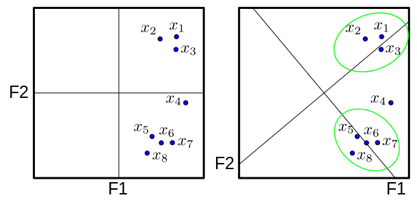

```{r include=FALSE, cache=FALSE}
set.seed(1014)
options(digits = 3)

knitr::opts_chunk$set(
  comment = "#>",
  collapse = TRUE,
  message = FALSE,
  warning = FALSE,
  cache = TRUE,
  out.width = "70%",
  fig.align = 'center',
  fig.width = 6,
  fig.asp = 0.618,  # 1 / phi
  fig.show = "hold",
  size = "tiny"
)

script <- TRUE


library(methods)  # sometimes not loaded, although built-in, appears like a bug
```


# Vertiefung: Dimensionsreduktion


```{r echo = FALSE, out.width = "30%", fig.align = "center"}
knitr::include_graphics("images/FOM.jpg")
```

```{r echo = FALSE, out.width = "10%", fig.align = "center"}
knitr::include_graphics("images/licence.png")
```


```{block2, ziele-dimred, type='rmdcaution', echo = TRUE} 
Lernziele:

- Den Unterschied zwischen einer Hauptkomponentenanalyse und einer Exploratorische Faktorenanalyse kennen
- Methoden kennen, um die Anzahl von Dimensionen zu bestimmen
- Methoden der Visualisierung anwenden können
- Umsetzungsmethoden in R anwenden können
- Ergebnisse interpretieren können.

```


In diesem Kapitel werden folgende Pakete benötigt:

```{r}
library(corrplot)  # für `corrplot`
library(gplots)  # für `heatmap.2`
library(nFactors)  # PCA und EFA
library(tidyverse)  # Datenjudo
library(psych)  # für z.B. 'alpha'

```


## Einführung

Häufig möchte man in den Sozialwissenschaften *latente Variablen*\index{latente Konstrukte} messen - z.B. Arbeitszufriedenheit, Extraversion, Schmerz oder Intelligenz. Solche Variablen nennt man *latent*, da man sie nicht direkt messen kann^[ Halt, da vorn läuft ein IQ-Punkt. Schnell, fangt ihn!].

>    Konstrukte bezeichnen gedankliche bzw. theoretische Sachverhalt dar, die nicht direkt beobachtbar und damit nicht direkt messbar sind.

Komplementär zu latenten Konstrukten spricht man von manifesten Variablen, wie Schuhgröße oder Körpergewicht; Dinge also, die man in gewohntem Sinne beobachtbar messen kann. Messung von manifesten Variablen bezeichnet man auch als *extensives Messen* [@Michell2000].

Was ist eigentlich *Messen*\index{Messen}? Sagen wir, ich finde den Urmeter auf der Straße (Details tun nichts zur Sache). Dann betrachte ich intensiv den Weg von meinem Carport bis zu meiner Haustür. Alsdann schaue ich, wie oft ich den Urmeter hintereinander legen muss, um den Weg von Haustür zu Carport zurückzulegen. Voilà! Die Länge des Weges ist *gemessen*. Allgemein ist Messen - nach diesem Verständnis - also das Vielfache eines Maßstabes in einer Größe [@Michell2000, aber s. @eid2010statistik für eine andere, verbreitete Definition].


Nach einer anderen Art von Messdefinition ist Messen alles, was aus manifesten Variablen eine Zahl erzeugt [@Michell2000]. Das ist das Verständnis von Messen der meisten Sozialwissenschaftler (doch, im Ernst). Bei Lichte betrachtet "misst" man in den Sozialwissenschaften gerne so:

1. Such ein paar Variablen, die mit dem zu messenden Konstrukt zu tun haben könnten (z.B. Extraversion)
1. Frage ein paar Leute, wie sich selber einschätzen in diesen Variablen
1. Die Antwortskala denkst Du Dir nach eigenem Gusto aus (z.B. von `1` bis `10`).
1. Addiere die Punkte aller Variablen auf.
1. Verkündige, dass Du Dein Konstrukt gemessen hast. Fertig.


Natürlich ist das ... nicht ganz richtig. Zumindest kann man nicht sicher sein, dass man Extraversion gemessen hat, oder ausreichend genau gemessen hat. 


Da komplexe Phänomene wie Extraversion facettenreich sind, nimmt man häufig mehrere manifeste Variablen und bezeichnet deren Mittelwert dann als Messung von Extraversion. Handelt es sich um Kreuze in einer Befragung, so spricht man von *Items (Indikatoren)*\index{Item}. 

Eine notwendige (aber nicht hinreichende) Voraussetzung, dass eine Reihe von Items sagen wir Extraversion messen, ist, dass sie miteinander stark korrelieren. Wenn sie das tun, so kann man sie auf *eine* Variable zusammenfassen, welche dann als Extraversion bezeichnet wird.

 
In diesem Kapitel betrachten wir zwei gängige Methoden solcher Zusammenfassungsmethoden. Da diese Methoden Variablen zusammenfassen, spricht man *Dimensionsreduktion*. Wir setzen voraus, dass es sich um metrische Variablen handelt (wir prüfen das nicht weiter).

* Die *Hauptkomponentenanalyse*\index{Hauptkomponentenanalyse} (engl. principal component analysis, PCA) versucht, unkorrelierte Linearkombinationen zu finden, die die Gesamtvarianz in den Daten erfassen. Die PCA\index{PCA} beinhaltet also das Extrahieren von linearen Zusammenhängen der beobachteten Variablen. 
* Die *Exploratorische Faktorenanalyse (EFA)*\index{Exploratorische Faktorenanalyse} versucht, die Varianz auf Basis einer kleinen Anzahl von Dimensionen zu modellieren, während sie gleichzeitig versucht, die Dimensionen in Bezug auf die ursprünglichen Variablen interpretierbar zu machen. Es wird davon ausgegangen, dass die Daten einem Faktoren Modell entsprechen, bei der die beobachteten Korrelationen auf `latente` Faktoren zurückführen. Mit der EFA wird *nicht* die gesamte Varianz erklärt.  


Die EFA wird oft als *Common Factor Analysis* oder *principal axis analysis (Hauptachsenanalyse)* bezeichnet\index{Hauptachsenanalyse}. Die EFA eröffnet dem Nutzer eine Menge an analytischen Varianten, so dass  das Ergebnis, im Gegensatz zu PCA, recht unterschiedlich ausfallen kann. Es gibt also *keine einzige* Lösung bei der EFA. Wichtig ist, genau zu berichten, welche Details man verwendet hat.

Eine einfache Faustregel für die Entscheidung zwischen diesen beiden Methoden:

* Führe die PCA durch, wenn die korrelierten beobachteten Variablen einfach auf einen kleineren Satz von wichtigen unabhängigen zusammengesetzten Variablen reduziert werden soll. 
* Führe die EFA durch, wenn ein theoretisches Modell von latenten Faktoren zugrunde liegt, dass die beobachtete Variablen verursacht. 


## Warum Datenreduktion wichtig ist

* *Dimensionen reduzieren*: Im technischen Sinne der Dimensionsreduktion können wir statt Variablen-Sets die Faktor-/ Komponentenwerte verwenden (z. B. für Mittelwertvergleiche zwischen Experimental- und Kontrollgruppe, Regressionsanalyse und Clusteranalyse).
* *Unsicherheit verringern*: Wenn wir glauben, dass ein Konstrukt nicht eindeutig messbar ist, dann kann mit einem Variablen-Set die Unsicherheit reduziert werden. 
* *Aufwand verringern*: Wir können den Aufwand bei der Datenerfassung vereinfachen, indem wir uns auf Variablen konzentrieren, von denen bekannt ist, dass sie einen hohen Beitrag zum interessierenden Faktor/ Komponente leisten. Wenn wir feststellen, dass einige Variablen für einen Faktor nicht wichtig sind, können wir sie aus dem Datensatz eliminieren. Außerdem werden die statistischen Modelle einfacher, wenn wir statt vieler Ausgangsvariablen einige wenige Komponenten/Faktoren als Eingabevariablen verwenden.


## Intuition zur Dimensionsreduktion

Betrachten Sie die die Visualisierung eines Datensatzes mit 3 Dimensionen (Spalten) in Abbildung \@ref(fig:fig-scatter3d)). Man braucht nicht viel Phantasie, um einen Pfeil (Vektor) in der Punktewolke zu sehen. Um jeden Punkt einigermaßen genau zu bestimmen, reicht es, seine "Pfeil-Koordinate" zu wissen. Praktischerweise geben in Abbildung \@ref(fig:fig-scatter3d) die Farben (in etwa) die Koordinaten auf dem Pfeil an^[genau genommen ist hier die Regressionsgerade gezeichnet, es müsste aber der größte Eigenvektor sein. Geschenkt.]. Damit können wir die Anzahl der Variablen (Dimensionen), die es braucht, um einen Punkt zu beschreiben von 3 auf 1 reduzieren; 2/3 der Komplexität eingespart. Wir verlieren etwas Genauigkeit, aber nicht viel. Dieser Pfeil, der mitten durch den Punkteschwarm geht, nennt man auch die 1. *Hauptkomponente*\index{Hauptkomponente}.

```{r fig-scatter3d, echo = FALSE, fig.cap = "Der Pfeil ist eindimensional; reduziert also die drei Dimensionen auf eine"}

library(MASS)
library(plot3D)


mu3d <- c(0, 0,0 )
sigma3d <- c(17, 16, 16, 16, 17, 14, 16, 14, 17) %>% matrix(nrow = 3)


corvars3d <- MASS::mvrnorm(n=100, mu=mu3d, Sigma=sigma3d) %>% as_tibble


lm3d <- lm(V3 ~ V1+V2, data = corvars3d)


add_3dline <- function(){
  
  arrows3D(x0 =  -10, y0 = -10 , z0 = -10, 
           x1 = 7, y1 = 7, z1 = 7*1.31+7*-.41,
           add = TRUE)
}


op <- par(mfrow = c(2,2),
          oma = c(5,4,0,0) + 0.1,
          mar = c(0,0,1,1) + 0.1)

scatter3D(corvars3d$V1, corvars3d$V2, corvars3d$V2, corvars3d$V3, theta = 15, phi = 20)
add_3dline()

scatter3D(corvars3d$V1, corvars3d$V2, corvars3d$V2, corvars3d$V3, theta = 15, phi = 20)
add_3dline()

scatter3D(corvars3d$V1, corvars3d$V2, corvars3d$V2, corvars3d$V3, theta = 190, phi = 20)
add_3dline()

scatter3D(corvars3d$V1, corvars3d$V2, corvars3d$V2, corvars3d$V3, theta = 100, phi = 60)
add_3dline()

par(op)


```


Beachten Sie, dass hoch korrelierte Variablen eng an der Regressionsgeraden liegen; entsprechend sind in Abbildung \@ref(fig:fig-scatter3d) die drei Variablen stark korreliert. Sehen Sie auch, dass die Hauptkomponente Varianz erklärt: Jede Variable für sich genommen, hat recht viel Streuung. Die Streuung der Punkte zur Hauptkomponente ist aber relativ gering. Daher sagt man, die Streuung (Varianz) wurde reduziert durch die Hauptkomponente.


>   Der längste Vektor, den man in die Punktewolke legen kann, bezeichnet man als den 1. Eigenvektor oder die 1. Hauptkomponente.

In Abbildung \@ref(fig:fig-scatter3d) ist dieser als Pfeil eingezeichnet^[die Hauptkomponente ist hier ähnlich zur Regressionslinie, aber nicht identisch]. Weitere Hauptkomponenten kann man nach dem gleichen Muster bestimmen mit der Auflage, dass sie im *rechten Winkel* zu bestehenden Hauptkomponenten liegen. Damit kann man in einer 3D-Raum nicht mehr als 3 Hauptkomponenten bestehen (in einem $n$-dimensionalen Raum also maximal $n$ Hauptkomponenten). 

>   Hauptkomponenten liegen stets im rechten Winkel zueinander ('orthogonal'). Das bedeutet, dass Werte, die auf verschiedenen Hauptkomponenten liegen, unkorreliert sind.


```{r echo = FALSE}
cor(corvars3d)
```

>   Je stärker die Korrelation zwischen Variablen, desto besser kann man sie zusammenfassen. 


## Daten

Wir untersuchen die Dimensionalität mittels einer auf 1000 Fälle reduzierten Zufallsauswahl von 15 Variablen zur Messung der grundlegenden Wertorientierungen von Menschen. Die Daten wurden im Sommersemester 2017 von FOM Studierenden im ersten Semester an der FOM bundesweit erhoben. Die Variablen zu Wertorientierungen wurden ursprüngliche aus dem 40-Item-Set des Portraits Value Questionnaire» (PVQ) von @Schmidt2007 adaptiert und durch Studien an der FOM seit 2014 stufenweise bis auf 15 relevante Variablen reduziert. Alle Variablen wurden auf einer Skala von 1 bis 7 (wobei 1 am wenigsten und 7 am meisten zutrifft) abgefragt. 

Laden wir zunächst den Datensatz:

```{r}
data(Werte, package = "prada")
```


Wir überprüfen zuerst die Struktur des Datensatzes, die ersten 6 Zeilen und die Zusammenfassung. Probieren Sie die folgenden Befehle aus:

```{r eval = FALSE}
glimpse(Werte)
```

Wir sehen mit `glimpse`, dass die Bereiche der Bewertungen für jede Variable 1-7 sind. Außerdem sehen wir, dass die Bewertungen als numerisch (Integer, also ganzzahlig) eingelesen wurden. Die Daten sind somit offenbar richtig formatiert.

## Neuskalierung der Daten 

In vielen Fällen ist es sinnvoll, Rohdaten neu zu skalieren - auch bei der Dimensionsreduktion. Warum ist das nötig? 


Dies wird üblicherweise als *Standardisierung*, *Normierung*, oder *Z-Transformation* bezeichnet. Als Ergebnis ist der Mittelwert aller Variablen über alle Beobachtungen dann 0 und die Standardabweichung (SD) 1. Da wir hier gleiche Skalenstufen haben, ist ein Skalieren nicht unbedingt notwendig, wir führen es aber trotzdem durch. 

Ein einfacher Weg, alle Variablen im Datensatz auf einmal zu skalieren ist der Befehl `scale()`. Da wir die Rohdaten nie ändern wollen, weisen wir die Rohwerte zuerst einem neuen Dataframe `Werte.sc` zu und skalieren anschließend die Daten. Wir skalieren in unserem Datensatz alle Variablen.


```{r show-z-scaled, results = "hide"}
Werte.sc <- Werte %>% scale %>% as_tibble
summary(Werte.sc)
```


```{block2, qplot-syntax, type='rmdpseudocode', echo = TRUE}

`<-`: Das Objekt `Werte.sc` soll wie folgt definiert sein  
Nimm das Objekt (ein Dataframe) `Werte` UND DANN   
z-skaliere das Objekt UND DANN  
definiere es als Dataframe (genauer: tibble). FERTIG.  

Ach ja, dann zeig noch ein `summary` von diesem Objekt.


```


Die Daten wurden richtig skaliert, da der Mittelwert aller Variablen über alle Beobachtungen 0 und die sd 1 ist. 

## Zusammenhänge in den Daten

Wir verwenden den Befehl `corrplot()` für die Erstinspektion von bivariaten Beziehungen zwischen den Variablen. Das Argument `order = "hclust"` ordnet die Zeilen und Spalten entsprechend der Ähnlichkeit der Variablen in einer hierarchischen Cluster-Lösung der Variablen (mehr dazu im Kapitel \@ref(cluster)) neu an.

```{r}
corrplot(cor(Werte.sc), order = "hclust")
```

Die Visualisierung der Korrelation der Variablen scheint fünf Cluster zu zeigen:

* ("Führung", "Entscheidung")
* ("Aufregung", "Spaß", "Freude")
* ("Umweltbewusstsein", "Zuhören", "Interesse")
* ("Ordentlichkeit", "Gefahrenvermeidung", "Sicherheit")
* ("Respekt", "Religiösität", "Demut")

## Daten mit fehlende Werten

Wenn in den Daten leere Zellen, also fehlende Werte, vorhanden sind, dann kann es bei bestimmten Rechenoperationen zu Fehlermeldungen kommen. Dies betrifft zum Beispiel Korrelationen, PCA und EFA. Der Ansatz besteht deshalb darin, NA-Werte explizit zu entfernen. Dies kann am einfachsten mit dem Befehl `na.omit()` geschehen:

Beispiel: 
```{r, eval=FALSE}

Werte.sc <- na.omit(Werte.sc)

corrplot(cor(Werte.sc), order = "hclust")
```

Da wir in unserem Datensatz vollständige Daten verwenden, gibt es auch keine Leerzellen. 

Mit dem Parameter `order` kann man die Reihenfolge (order) der Variablen, wie sie im Diagramm dargestellt werden ändern (vgl `help(corrplot)`). Hier haben wir die Variablen nach Ähnlichkeit aufgereiht: Ähnliche Variablen stehen näher beieinander. Damit können wir gut erkennen, welche Variablen sich ähnlich sind (hoch korreliert sind) und somit Kandidaten für eine Einsparung (Zusammenfassung zu einer Hauptkomponente bzw. einem Faktor) sind.


## Hauptkomponentenanalyse (PCA)

Die PCA berechnet ein Variablenset (Komponenten) in Form von linearen Gleichungen, die die linearen Beziehungen in den Daten erfassen. Die erste Komponente erfasst so viel Streuung (Varianz) wie möglich von allen Variablen als eine einzige lineare Funktion. Die zweite Komponente erfasst unkorreliert zur ersten Komponente so viel Streuung wie möglich, die nach der ersten Komponente verbleibt. Das geht so lange weiter, bis es so viele Komponenten gibt wie Variablen. 

### Bestimmung der Anzahl der Hauptkomponenten

Betrachten wir in einem ersten Schritt die wichtigsten Komponenten für die Werte. Wir finden die Komponenten mit `prcomp()`.


```{r}
Werte.pc <- prcomp(Werte.sc)  # Principal Components berechnen
summary(Werte.pc)

```

```{r}
# Berechnung der Gesamtvarianz
Gesamtvarianz <- sum(Werte.pc$sdev^2)

# Bei sum(Werte.pc$sdev^2) wird die Summe aller 15 Standardabweichungen berechnet.

# Varianzanteil der ersten Hauptkomponente
Werte.pc$sdev[1]^2 / Gesamtvarianz
```


### Scree-Plot

Der Standard-Plot `plot()` für die PCA ist ein *Scree-Plot*^[scree: engl. "Geröll"], Dieser zeigt uns die jeweils durch eine Hauptkomponente erfasste Streuung (Varianz). Wir plotten ein Liniendiagramm mit dem Argument `type = "l"` (`l` für Linie), s. Abb. \@ref(fig:pca-scree)).

```{r pca-scree, fig.cap = "Screeplot"}
plot(Werte.pc, type="l")
```

>    Die Höhe der Varianz entspricht der Länge der Pfeile (Eigenvektoren) in Abbildung \@ref(fig:fig-scatter3d): Längere Pfeile bedeuten größere erklärte Varianz. Die Länge der Eigenvektoren bezeichnet man auch als Eigenwert.

Wir sehen in Abb. \@ref(fig:pca-scree), dass bei den Werte-Daten der Anteil der Streuung nach der fünften Komponente nicht mehr wesentlich abnimmt. Es soll die Stelle gefunden werden, ab der die Varianzen der Hauptkomponenten deutlich kleiner sind. Je kleiner die Varianzen, desto weniger Streuung erklärt diese Hauptkomponente. 

### Ellbogen-Kriterium

Nach dem *Ellbogen-Kriterium*\index{Ellbogen-Kriterium} werden alle Hauptkomponenten berücksichtigt, die links von der Knickstelle im Scree-Plot liegen. Gibt es mehrere Knicks, dann werden jene Hauptkomponenten ausgewählt, die links vom rechtesten Knick liegen. Gibt es keinen Knick, dann hilft der Scree-Plot nicht weiter. Bei den Werte-Daten tritt der Ellbogen, je nach Betrachtungsweise, entweder bei vier oder sechs Komponenten auf. Dies deutet darauf hin, dass die ersten fünf Komponenten die meiste Streuung in den Werte-Daten erklären. 

### Eigenwert-Kriterium

Der *Eigenwert*\index{Eigenwert} ist eine Metrik für den Anteil der erklärten Varianz pro Hauptkomponente. Die Anzahl Eigenwerte können wir über den Befehl `eigen()` ausgeben.   

```{r show-eigenvalues, results = "hide"}
eigen(cor(Werte))
```

Der Eigenwert einer Komponente/ eines Faktors sagt aus, wie viel Varianz dieser Faktor an der Gesamtvarianz aufklärt. Laut dem Eigenwert-Kriterium sollen nur Faktoren mit einem *Eigenwert größer 1* extrahiert werden. Dies sind bei den Werte-Daten fünf Komponenten/ Faktoren, da fünf Eigenwerte größer 1 sind. Der Grund ist, dass Komponenten/ Faktoren mit einem Eigenwert kleiner als 1 weniger Erklärungswert haben als die ursprünglichen Variablen. 

Dies kann auch grafisch mit dem `psych::VSS.Scree`^[das Paket `psych` wird automatisch vom Paket `nfactors` gestartet, sie müssen es nicht extra starten] geplottet werden (s. Abb. \@ref(fig:vss-scree)). 

```{r vss-scree, fig.cap = "VSS-Screeplot"}
VSS.scree(Werte)
```


### Biplot

Eine gute Möglichkeit die Ergebnisse der PCA zu analysieren, besteht darin, die ersten Komponenten zuzuordnen, die es uns ermöglichen, die Daten in einem niedrigdimensionalen Raum zu visualisieren. Eine gemeinsame Visualisierung ist ein *Biplot*\index{Biplot}. Ein Biplot zeigt die Ausprägungen der Fälle auf den ersten beiden Hauptkomponenten. Häufig sind die beiden ersten Hauptkomponenten schon recht aussagekräftig, vereinen also einen Gutteil der Streuung auf sich. Dazu verwenden wir `biplot()` (s. Abbildung \@ref(fig:fig-biplot)).


```{r fig-biplot, fig.cap = "Ein Biplot für den Werte-Datensatz"}
biplot(Werte.pc)
```

Die einzelnen Ausgangsvariablen sind in Abbildung Abbildung \@ref(fig:fig-biplot) durch rote Pfeile (Vektoren) gekennzeichnet. 

>   Je paralleler der Vektor einer Ausgangsvariable zur X-Achse (1. Hauptkomponente) ist, umso identischer sind sich die entsprechende Variable und die Hauptkomponente (für die Y-Achse gilt entsprechendes). Das hilft uns, die Hauptkomponente inhatlich zu interpretieren. Hauptkomponenten (oder Faktoren) sollten stets inhaltlich interpretiert werden - auch wenn eine subjektive Komponente mitschwingt. 

Die 1. Hauptkomponente wird offenbar stark geprägt durch die Ausgangsvariablen `W6`, `W7`, `W9` und `W11`. Die 2. Hauptkomponente primär durch `W18` und `W19`. 

Zusätzlich erhalten wir einen Einblick in die Bewertungscluster (als dichte Bereiche von Beobachtungspunkten): Gruppen von Punkten entsprechen ähnlichen Fällen (ähnlich hinsichtlich ihrer Werte in den ersten zwei Hauptkomponenten). Der Biplot ist hier durch die große Anzahl an Beobachtung allerdings recht unübersichtlich. 


### Aufgaben

```{block2, pca-ex, type='rmdexercises', echo = TRUE} 

1. Ziehen Sie eine Zufallsstichprobe aus dem Datensatz, berechnen Sie die PCA erneut und betrachten Sie den Biplot. Wie stark ist die Änderung?

2. Erstellen Sie mehrere Streudiagramme und überprüfen Sie die bivariaten Zusammenhänge (die ja zur Dimensionsreduktion führen) visuell.

```

Am einfachsten lassen sich die Komponenten extrahieren mit dem `principal`-Befehl aus dem Paket `psych`:

```{r}
Werte.pca <- principal(Werte, nfactors = 5, rotate = "none")
print(Werte.pca, cut = 0.5, sort = TRUE, digits = 2)

```

`cut = 0.5` heißt, dass nur Ladungen ab 0.5 angezeigt werden sollen. Mit `rotate = 'none'` sagen wir, dass wir keine Rotation wünschen. Eine Rotation ist 

### Interpretation der Ergebnisse der PCA

Das Ergebnis sieht sehr gut aus. Es laden immer mehrere Items (Ausgangsvariablen) (mindestens 2) hoch (> 0,5) auf einer Komponente (die mit RC1 bis RC5 bezeichnet werden, *RC* steht für *Rotated Component*). Mit "laden" ist die Parallelität der Ausgangsvariable zur Hauptkomponente gemeint. Vereinfacht gesprochen ist die Ladung die Korrelation der Items mit der jeweiligen Komponente.


Innerhalb einer PCA kann die Interpretierbarkeit über eine **Rotation** erhöht werden. Wenn die Rotation nicht ausgeschlossen wird (mit dem Argument `rotate="none"`), dann ist die Voreinstellung eine `Varimax-Rotation`.

Mit `h2` (Kommunalität) ist der Anteil eines Items bezeichnet, der durch die Komponenten insgesamt erklärt wird. Hier haben die Anzahl der Komponenten auf 5 beschränkt. Daher wird nicht die ganze Varianz des Items erklärt.

Es gibt keine Items die auf mehr als einer Komponente hoch laden. Die Ladungen sind Korrelationskoeffizienten zwischen den Items und den Hauptkomponenten. In der Zeile *SS loadings* finden wir die Eigenwerte der fünf Hauptkomponenten (berechnet als Summe der quadrierten Ladungen). Den Anteil an der Gesamtvarianz, den sie erklären, findet man in der Zeile *Proportion Var*. Aufsummiert sind die Anteile in der Zeile *Cumlative Var*. Insgesamt werden durch die fünf Hauptkomponenten 64% der Gesamtvarianz erklärt. Die stärke Hauptkomponente hat einen Eigenwert von 2.08 und erklärt 14% der Varianz.

Einzig das Item "Unabhängigkeit" lädt auf keine der Hauptkomponenten hoch. 

Um die inhaltliche Bedeutung der Komponenten zu interpretieren, schauen wir uns die Inhalte der jeweiligen Items an und versuchen hierfür einen inhaltlichen Gesamtbegriff zu finden. Die Erste Komponenten könnte mit **Genuss**, die zweite mit **Sicherheit**, die dritte mit **Bewusstsein**, die vierte mit **Konformismus** und die fünfte mit **Anerkennung** bezeichnet werden. 

Mit der Funktion `fa.diagram` kann das Ergebnis auch grafisch dargestellt werden.

```{r}
fa.diagram(Werte.pca)
```


## Exploratorische Faktorenanalyse (EFA)

Genau genommen ist der Begriff *Faktorenanalyse (FA)*\index{Faktorenanalyse} ein Überbegriff für mehrere Arten von ähnlichen Verfahren der Dimensionsreduktion. Ein Beispiel für eine Art von Faktorenanalyse wäre dann die PCA. Aber der Begriff Faktorenanalyse wird auch verwendet, um eine bestimmte Art von Faktorenanalyse - sozusagen eine Faktorenanalyse im engeren Sinne - zu bezeichnen. Wir halten uns hier an letztere Begriffskonvention.

In diesem Sinne ist die *Exploratorische Faktorenanalyse (EFA)*\index{Exploratorische Faktorenanalyse} ist eine Methode, um die Beziehung von Konstrukten (Konzepten), d. h. Faktoren zu Variablen zu beurteilen. Dabei werden die Faktoren als *latente Variablen* betrachtet, die nicht direkt beobachtet werden können. Stattdessen werden sie empirisch durch mehrere Variablen beobachtet, von denen jede ein Indikator der zugrunde liegenden Faktoren ist. Diese beobachteten Werte werden als *manifeste Variablen* bezeichnet und umfassen Indikatoren. Die EFA versucht den Grad zu bestimmen, in dem Faktoren die beobachtete Streuung der manifesten Variablen berücksichtigen.

Das Ergebnis der EFA ist ähnlich zur PCA: eine Matrix von Faktoren (ähnlich zu den PCA-Komponenten) und ihre Beziehung zu den ursprünglichen Variablen (Ladung der Faktoren auf die Variablen). Im Gegensatz zur PCA versucht die EFA, Lösungen zu finden, die in den *manifesten variablen maximal interpretierbar* sind. Im Allgemeinen versucht sie, Lösungen zu finden, bei denen eine kleine Anzahl von Ladungen für jeden Faktor sehr hoch ist, während andere Ladungen für diesen Faktor gering sind. Wenn dies möglich ist, kann dieser Faktor mit diesem Variablen-Set interpretiert werden. 


### Finden einer EFA Lösung

Als erstes muss die Anzahl der zu schätzenden Faktoren bestimmt werden. Hierzu verwenden wir wieder das Ellbow-Kriterium und das Eigenwert-Kriterium. Beide Kriterien haben wir schon bei der PCA verwendet, dabei kommen wir auf 5 Faktoren. 

Durch das Paket `nFactors` bekommen wir eine ausgefuchstere Berechnung der Scree-Plot Lösung mit dem Befehl `nScree()` - es werden noch weitere, sophistiziertere Methoden zur Berechnung der 'richtigen' Anzahl von Faktoren eingesetzt. Wir sparen uns hier die Details.

```{r}
nScree(Werte)

```

`nScree` gibt vier methodische Schätzungen für die Anzahl an Faktoren durch den Scree-Plot aus. Wir sehen, dass drei von vier Methoden fünf Faktoren vorschlagen. Nach kurzer Überlegung und Blick aus dem Fenster entscheiden wir uns für 5 Faktoren.


### Schätzung der EFA

Eine EFA wird geschätzt mit dem Befehl `factanal(x,factors = k)`, wobei `k` die Anzahl Faktoren angibt und `x` den Datensatz.

```{r werte-factanal, results = "hide"}
Werte.fa<-factanal(Werte, factors = 5)
Werte.fa
```

Eine übersichtlichere Ausgabe bekommen wir mit dem `print` Befehl, in dem wir zusätzlich noch die Dezimalstellen kürzen mit `digits = 2`, alle Ladungen kleiner als 0,5 ausblenden mit `cutoff = .4` und die Ladungen mit `sort = TRUE` so sortieren, dass die Ladungen, die auf einen Faktor laden, untereinander stehen.
```{r out.width = "100%", eval = FALSE}
print(Werte.fa, digits = 2, cutoff = .4, sort = TRUE)
```


Standardmäßig wird bei `factanal()` eine *Varimax-Rotation* durchgeführt (das Koordinatensystem der Faktoren wird so rotiert, das eine optimale Zuordnung zu den Variablen erfolgt). Bei Varimax gibt es keine Korrelationen zwischen den Faktoren. Sollen Korrelationen zwischen den Faktoren zugelassen werden, empfiehlt sich die Oblimin-Rotation mit dem Argument `rotation="oblimin"` aus dem Paket `GPArotation`.

Das eine Rotation sinnvoll ist, kann man sich am einfachsten an einem Diagramm verdeutlichen (s. Abbildung \@ref(fig:rotation), [@fjalnes_orthogonale_2014]).


```{r rotation, echo = FALSE, fig.cap = "Beispiel für eine rechtwinklige Rotation"}



```

Das Rotieren kann man sich als Drehen des Koordinatensystems vorstellen. Durch die Rotation sind die Items 'näher' an den Faktoren: Die Faktorladung zu einem Faktor wurde größer, zum anderen Faktor hingegen geringer. Damit wurde die Ladung, also die Zuordnung der Items zu den Faktoren, insgesamt klarer, besser. Das wollen wir. Übrigens: Der Winkel der Achsen ist beim Rotieren gleich (rechtwinklig, orthogonal) geblieben. Daher spricht man von einer rechtwinkligen oder orthogonalen Rotation. Man kann auch die Achsen unterschiedlich rotieren, so dass sie nicht mehr rechtwinklig sind. Das könnte die Ladung noch klarer machen, führt aber dazu, dass die Faktoren dann korreliert sind. Korrelierte Faktoren sind oft nicht wünschenswert, weil ähnlich.


### Vertiefung: Heatmap mit Ladungen

In der obigen Ausgabe werden die Item-to-Faktor-Ladungen angezeigt. Im zurückgegebenen Objekt `Werte.fa` sind diese als  `$loadings` vorhanden. Wir können die Item-Faktor-Beziehungen mit einer Heatmap  von `$loadings` visualisieren aus dem Paket `gplots`^[bereits automatisch geladen], s. Abb. \@ref(fig:efa-heatmap):

```{r efa-heatmap, fig.cap = "Heatmap einer EFA"}
heatmap.2(Werte.fa$loadings,
          dendrogram = "both",
          labRow = NULL,
          labCol = NULL,
          cexRow=1,
          cexCol=1,
          margins = c(7,7),
          trace = "none",
          #lmat = rbind(c(0,0),c(0,1)),
          lhei = c(1,4),
          keysize=0.75, 
          key.par = list(cex=0.5)
          )
```


Die Heatmap stellt ähnliche Objekte - hier: Variablen, die hoch auf einer Hauptkomponenten laden - räumlich nahe (nebeneinander) dar. Im Ergebnis zeigt die Heatmap  eine deutliche Trennung der Items in 5 Faktoren, die interpretierbar sind als *Anerkennung*, *Genuss*, *Sicherheit*, *Bewusstsein* und *Konformismus*. 


### Berechnung der Faktor-Scores

Zusätzlich zur Schätzung der Faktorstruktur kann die EFA auch die latenten Faktorwerte für jede Beobachtung schätzen. Die gängige Extraktionsmethode ist die Bartlett-Methode, worauf wir hier nicht weiter eingehen. Kurz gesagt: Jeder Fall (jede Zeile im Datensatz, jede Person) bekommt einen Wert pro Komponente bzw. Faktor, man spricht von Faktor-Scores oder Faktorwerten der Beobachtungen.


```{r}
Werte.ob <- factanal(Werte, factors = 5, scores = "Bartlett")
Werte.scores <- data.frame(Werte.ob$scores)
names(Werte.scores) <- c("Anerkennung", "Genuss", "Sicherheit", "Bewusstsein", "Konformismus") 
head(Werte.scores)
```


Wir haben nun anstatt der 15 Variablen 5 Faktoren mit Scores. Die Dimensionen wurden um ein Drittel reduziert. 


## Interne Konsistenz der Skalen

Das einfachste Maß für die *interne Konsistenz*\index{interne Konsistenz} ist die *Split-Half-Reliabilität*\index{Split-Half-Reliabilität}. Die Items werden in zwei Hälften unterteilt und die resultierenden Scores sollten in ihren Kenngrößen ähnlich sein. Hohe Korrelationen zwischen den Hälften deuten auf eine hohe interne Konsistenz hin. Das Problem ist, dass die Ergebnisse davon abhängen, wie die Items aufgeteilt werden. Ein üblicher Ansatz zur Lösung dieses Problems besteht darin, den Koeffizienten *Alpha (Cronbachs Alpha)*\index{Cronbachs Alpha} zu verwenden.

Der Koeffizient *Alpha* ist der Mittelwert aller möglichen Split-Half-Koeffizienten, die sich aus verschiedenen Arten der Aufteilung der Items ergeben. Dieser Koeffizient variiert von 0 bis 1. Inhaltlich ist Alpha eine Art mittlere Korrelation, die sich ergibt wenn man alle Items (paarweise) miteinander korreliert: I1-I2, I1-I3,...

Faustregeln für die Bewertung von Cronbachs Alpha:

Alpha      |   Bedeutung    
-----------|--------------
größer 0,9 |   exzellent     
größer 0,8 |   gut     
größer 0,7 |   akzeptabel     
größer 0,6 |   fragwürdig     
größer 0,5 |   schlecht     


Wir bewerten nun die interne Konsistent der Items Beispielhaft für das Konstrukt `Sicherheit` und nehmen zur Demonstration das Item `W15` mit in die Analyse auf.
```{r}
Werte %>%
  dplyr::select(Unabhaengigkeit, Zuhoeren, Umweltbewusstsein, Interesse) -> df

psych::alpha(df, check.keys = TRUE)
```

Bei dem Konstrukt `Sicherheit` können wir durch Elimination von `Unabhängigkeit` das Cronbachs Alpha von 0,63 auf einen fast akzeptablen Wert von 0,69 erhöhen.

Das Argument `check.keys=TRUE` gibt uns eine Warnung aus, sollte die Ladung eines oder mehrerer Items negativ sein. Dies ist hier nicht der Fall, somit müssen auch keine Items recodiert werden. 


## Aufgaben^[F, F, R, R, R, R, R]


```{block2, exercises-dimred, type='rmdexercises', echo = TRUE} 

Richtig oder Falsch!?

1. Addiert man Antwortpunkte einer Reihe von Items zu Aggression, so hat (sicher) man Aggression gemessen.

1. Die Hauptkomponentenanalyse ist eine Methode zur Verringerung der Anzahl der Fälle eines Datensatzes.

3. Hauptkomponenten sind stets orthogonal zueinander (in einem Datesatz).

4. Ein Screeplot ist ein Diagramm, welches die Eigenwerte darstellt.

5. Längere Eigenvektoren sind durch größere Eigenwerte gekennzeichnet.

6. Bei einer rechtwinkligen Rotation bleiben die Faktoren rechtwinklig.

7. Die interne Konsistenz einer Skala ist ein Maß dafür, wie stark die Items miteinander korrelieren.

```


## Befehlsübersicht


Tabelle \@ref(tab:befehle-dimred) fasst die R-Funktionen dieses Kapitels zusammen.

```{r befehle-dimred, echo = FALSE}

df <- readr::read_csv("includes/Befehle_dimred.csv")

knitr::kable(df,
             caption = "Befehle des Kapitels 'Dimensionsreduktion'")
```
