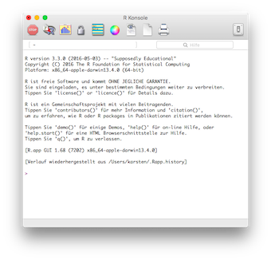
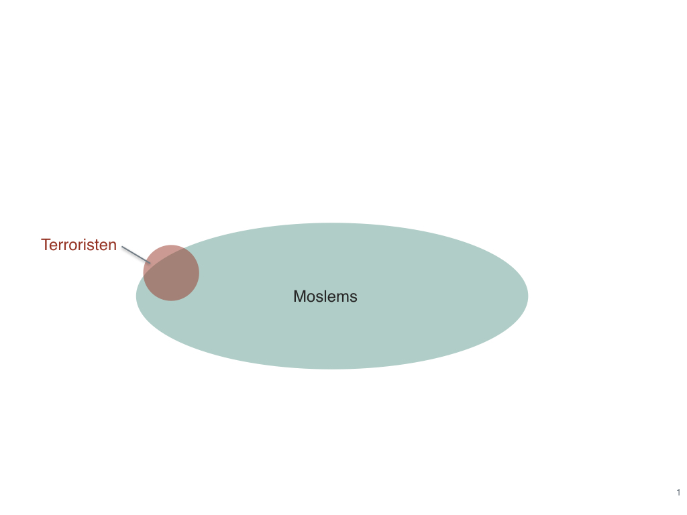

--- 
title: "Praxis der Datenanalyse"
author: "Sebastian Sauer, Matthias Gehrke, Karsten Lübke, Oliver Gansser"
date: '`r Sys.Date()`'
colorlinks: yes
cover-image: cover.jpg
bibliography:
- Praxis_der_Datenanalyse.bib
- libs.bib
description: Eine Einführung in moderne Statistik für Praktiker
lang: de-De
documentclass: book
fontsize: 12pt
github-repo: sebastiansauer/Praxis_der_Datenanalyse
link-citations: yes
lof: yes
#lot: yes
toc: yes
#nocite: |
#  @*
site: bookdown::bookdown_site
#biblio-style: apalike
---


```{r sourcelibs, echo = FALSE, include = FALSE, warning = FALSE, message = FALSE}
source("source/libs.R")
```


# Vorwort {-}

```{r echo = FALSE, out.width = "30%", fig.align = "center"}
knitr::include_graphics("images/FOM.jpg")
```


Statistik heute; was ist das? Sicherlich haben sich die Schwerpunkte von "gestern" zu "heute" verschoben. Wenig überraschend spielt der Computer eine immer größere Rolle; die Daten werden vielseitiger und massiger. Entsprechend sind neue Verfahren nötig - und vorhanden, in Teilen - um auf diese neue Situation einzugehen. Einige Verfahren werden daher weniger wichtig, z.B. der p-Wert oder der t-Test. Allerdings wird vielfach, zumeist, noch die Verfahren gelehrt und verwendet, die für die erste Hälfte des 20. Jahrhunderts entwickelt wurden. Eine Zeit, in der kleine Daten, ohne Hilfe von Computern und basierend auf einer kleinen Theoriefamilie im Rampenlicht standen [cobb2007introductory]. Die Zeiten haben sich geändert!

```{r research_plot, echo = FALSE}
knitr::include_graphics("images/Forschung_frueher_heute.jpg")
```

Zu Themen, die heute zu den dynamischten Gebieten der Datenanalyse gehören, die aber früher keine große Rolle spielten, gehören [@hardin2015data]: 

- Nutzung von Datenbanken und anderen Data Warehouses
- Daten aus dem Internet automatisch einlesen ("scraping")
- Genanalysen mit Tausenden von Variablen
- Gesichtserkennung


Sie werden in diesem Kurs einige praktische Aspekte der modernen Datenanalyse lernen. Ziel ist es, Sie - in Grundzügen - mit der Art und Weise vertraut zu machen, wie angewandte Statistik bei führenden Organisationen und Praktikern verwendet wird^[Statistiker, die dabei als Vorbild Pate standen sind: Roger D. Peng: http://www.biostat.jhsph.edu/~rpeng/, Hadley Wickham: http://hadley.nz, Jennifer Bryan: <https://github.com/jennybc>].


Es ist ein Grundlagenkurs; das didaktische Konzept beruht auf einem induktiven, intuitiven Lehr-Lern-Ansatz. Formeln und mathematische Hintergründe such man meist vergebens (tja).

Im Gegensatz zu anderen Statistik-Büchern steht hier die Umsetzung mit R stark im Vordergrund. Dies hat pragmatische Gründe: Möchte man Daten einer statistischen Analyse unterziehen, so muss man sie zumeist erst aufbereiten; oft mühselig aufbereiten. Selten kann man den Luxus genießen, einfach "nur", nach Herzenslust sozusagen, ein Feuerwerk an multivariater Statistik abzubrennen. Zuvor gilt es, die Daten aufzubereiten, umzuformen, zu prüfen und zusammenzufassen. Diesem Teil ist hier recht ausführlich Rechnung getragen. 


"Statistical thinking" sollte, so eine verbreitete Idee, im Zentrum oder als Ziel einer Statistik-Ausbildung stehen [wild1999statistical]. Es ist die Hoffnung der Autoren dieses Buches, dass das praktische Arbeiten (im Gegensatz zu einer theoretischen Fokus) zur Entwicklung einer Kompetenz im statistischen Denken beiträgt.

Außerdem spielt in diesem Kurs die Visualisierung von Daten eine große Rolle. Zum einen könnte der Grund einfach sein, dass Diagramme ansprechen und gefallen (einigen Menschen). Zum anderen bieten Diagramme bei umfangreichen Daten Einsichten, die sonst leicht wortwörtlich überersehen würden.

>   Dieser Kurs zielt auf die praktischen Aspekte der Analyse von Daten ab: "wie mache ich es?"; mathematische und philosophische Hintergründe werden vernachlässigt bzw. auf einschlägige Literatur verwiesen.

*R-Pseudo-Syntax*: R ist (momentan) die führende Umgebung für Datenanalyse. Entsprechend zentral ist R in diesem Kurs. Zugebenermaßen braucht es etwas Zeit, bis man ein paar Brocken "Errisch" spricht. Um den Einstieg zu erleichern, ist Errisch auf Deutsch übersetzt an einigen Stellen, wo mir dies besonders hilfreich erschien. Diese Stellen sind mit diesem Symbol { width=5% } gekennzeichnet (für R-Pseudo-Syntax).

*Achtung, Falle*: Schwierige oder fehlerträchtige Stellen sind mit diesem Symbol { width=5% } markiert.

*Übungsaufgaben*: Das Skript beinhaltet in jedem Kapitel Übungsaufgaben oder/und Testfragen. Auf diese wird mit diesem Icon { width=5% } verwiesen oder die Übungen sind in einem Abschnitt mit einsichtigem Titel zu finden.

*Love*: Wenn Ihnen R diesen Smiley präsentiert, dann sind Sie am Ziel Ihrer Träume: { width=5% }. 


Dieses Buch hat einige *Voraussetzungen*, was das Vorwissen der Leser angeht; folgende Themengebiete werden vorausgsetzt:

- Deskriptive Statistik
- Grundlagen der Inferenzstatistik
- Grundagen der Regressionsanalyse
- Skalenniveaus
- Grundlagen von R

Dieses Skript wurde mit dem Paket `bookdown` [xie2015] erstellt, welches wiederum stark auf den Paketen `knitr` [xie2015] und `rmarkdown` [markdown] beruht. Diese Pakete stellen verblüffende Funktionalität zur Verfügung als freie Software (frei wie in Bier und frei wie in Freiheit).

Aus Gründen des Lesbarkeit wird das männliche Generikum verwendet, welches Frauen und Männer in gleichen Maßen ansprechen soll.


Die Bildnachweise sind in folgenden Muster aufgebaut:
Nummer, Verweis zum Bild, Names des Autors, Titel, Quelle (URL), Lizenz, Abrufdatum.


Sebastian Sauer

<!--chapter:end:index.Rmd-->

```{r include=FALSE, cache=FALSE}
set.seed(1014)
options(digits = 3)

knitr::opts_chunk$set(
  comment = "#>",
  message = FALSE,
  warning = FALSE,
  collapse = TRUE,
  cache = TRUE,
  out.width = "70%",
  fig.align = 'center',
  fig.width = 6,
  fig.asp = 0.618,  # 1 / phi
  fig.show = "hold"
)


```


# Organisatorisches

## Modulziele

Die Studierenden können nach erfolgreichem Abschluss des Moduls:


- den Ablauf eines Projekts aus der Datenanalyse in wesentlichen Schritten nachvollziehen,
-	Daten aufbereiten und ansprechend visualisieren,
-	Inferenzstatistik anwenden und kritisch hinterfragen,
- klassische Vorhersagemethoden (Regression) anwenden,
-	moderne Methoden der angewandten Datenanalyse anwenden (z.B. Textmining),
-	betriebswirtschaftliche Fragestellungen mittels datengetriebener Vorhersagemodellen beantworten.


## Themen pro Termin

Anahmen: 

- Zeitumfang: 44 UE für Lehre

- Vorerfahrung: Deskriptive Statistik, Inferenzstatistik, Grundlagen R, Grundlagen Visualisierung


Termin    Thema/ Kapitel                      
-------   --------------------------------------                              
1         Organisatorisches
          Einführung
          Rahmen
          Daten einlesen
2         Datenjudo
3         Daten visualisieren
4         Fallstudie
5         Daten modellieren     
          Der p-Wert
6         Lineare Regression - metrisch
7         Lineare Regression - kategorial
8         Fallstudie
9         Vertiefung: Textmining und Clusteranalyse
10        Vertiefung: Baumbasierte Verfahren
11        Wiederholung

          

  
## Prüfung

### Prüfungshinweise


- Die Prüfung besteht aus zwei Teilen
    - einer Klausur (50% der Teilnote)
    - einer Datenanalyse (50% der Teilnote).
   
   
   
*Prüfungsrelevant* ist der gesamte Stoff aus dem Skript und dem Unterricht mit folgenden Ausnahmen:

  - Inhalte/Abschnitte, die als "nicht klausurrelevant" gekennzeichnet sind,
  - Inhalte/Abschnitte, die als "Vertiefung" gekennzeichnet sind,
  - Fallstudien (nur für Klausuren nicht prüfungslevant),
  - die Inhalte von Links,
  - die Inhalte von Fußnoten.
  
  
  
### Klausur
  

- Die Klausur besteht fast oder komplett aus Multiple-Choice (MC-)-Aufgaben mit mehreren Antwortoptionen; zumeist ist eine Antwort aus vieren auszuwählen.

- Die (maximale) Anzahl der richtigen Aussagen ist pro Aufgabe angegeben. Werden mehr Aussagen als "richtig" angekreuzt als angegeben, so wird die Aufgabe mit 0 Punkten beurteilt. Ansonsten werden Teilpunkte für jede Aufgabe vergeben.

- Jede Aussage gilt ceteris paribus (unter sonst gleichen Umständen). Aussagen der Art "A ist B" (z.B. "Menschen sind sterblich") sind *nur* dann als richtig auszuwählen, wenn die Aussage *immer* richtig ist.

- Im Zweifel ist eine Aussage auf den Stoff, so wie im Unterricht behandelt, zu beziehen.
Werden in Aussagen Zahlen abgefragt, so sind Antworten auch dann richtig, wenn die vorgeschlagene Antwort ab der 1. Dezimale von der wahren Antwort abweicht (einigermaßen genaue Aussagen werden als richtig akzeptiert). Bei Fragen zu R-Syntax spielen Aspekte wie Enter-Taste o.ä. bei der Beantwortung der Frage keine Rolle; diese Aspekte dürfen zu ignorieren.

- Jede Aussage einer MC-Aufgabe ist entweder richtig oder falsch (aber nicht beides oder keines).

- Die MC-Aufgaben sind nur mit Kreuzen zu beantworten; Text wird bei der Korrektur nicht berücksichtigt.

- Bei Nachholklausuren gelten die selben Inhalte (inkl. Schwerpunkte) wie bei der Standard-Klausur, sofern nicht anderweitig angegeben.

- I.d.R. sind nur Klausurpapier und ein nicht-programmierbarer Taschenrechner als Hilfsmittel zulässig.

- Die Musterlösungen zu offenen Fragen sind elektronisch hinterlegt.


### Datenanalyse

- Wenden Sie die passenden, im Modul eingeführten statistischen Verfahren an.

- Werten Sie die Daten mit R aus; R-Syntax soll verwendet und im Hauptteil dokumentiert werden.

- In der Wahl des Datensatzes sind Sie frei, mit folgender Ausnahme: Im Unterricht besprochene Datensätze dürfen nicht als Prüfungsleistung eingereicht werden (vgl. Abschnitt \@ref(daten)).

- Der (Original-)Name des Datensatzes (sowie ggf. Link) ist bei der Anmeldung anzugeben. 

- Gruppenarbeiten sind nicht zulässig.

- Hat sich jemand schon für einen Datensatz angemeldet, so darf dieser Datensatz nicht mehr gewählt werden ("first come, first serve").

- Fundorte für Datensätze sind z.B. [hier](http://www.stat.ufl.edu/~winner/datasets.html), [hier](http://archive.ics.uci.edu/ml/datasets.html) und [hier](http://vincentarelbundock.github.io/Rdatasets/datasets.html); im Internet finden sich viele Datensätze^[Googeln Sie mal nach "open datasets" o.ä.].

- Schreiben Sie Ihre Ergebnisse in einer Ausarbeitung zusammen; der Umfang der Ausarbeitung umfasst ca. *1000-1500 Wörter* (nur Hauptteil; d.h. exklusive Deckblatt, Verzeichnisse, Anhang etc.).

- Untersuchen Sie 2-3 Hypothesen.

- Denken Sie daran, Name, Matrikelnummer, Modulname etc. anzugeben (Deckblatt). Bei der Gestaltung des Layout entscheiden Sie selbständig bitte nach Zweckmäßigkeit (und Ästhetik).

- Fügen Sie keine Erklärungen oder Definitionen von statistischen Verfahren an.


### Gliederungsvorschlag zur Datenanalyse


1. Datensatz

    1. Beschreibung
        - Name
        - Hintergrund (Themengebiet, Theorien, Relevanz), ca. 100 Wörter
        - Dimension (Zeilen*Spalten)
        - Zitation (wenn vorhanden)
        - sonstige Hinweise (z.B. Datenqualität, Entstehung des Datensatzes)

    2. Variablendeskription (nur für Variablen der Hypothese)
    
        - Skalenniveaus
        - Kontinuität (nur bei metrischen Variablen) 
        - R-Datentyp
        - Anzahl Fälle und fehlende Werte
        - Erläuterung der Variablen


2. Deduktive Analyse

    1. Hypothese(n)
           Beschreiben Sie die Vermutung(en), die Sie prüfen möchten, möglichst exakt.

    2. Deskriptive Statistiken
          - Berichten Sie deskriptive Statistiken für alle Variablen der Hypothesen.
          - Berichten Sie aber nur univariate Statistiken sowie Subgruppenanalysen dazu.
          - Berichten Sie ggf. Effektstärken.

    3. Diagramme
        - Visualisieren Sie Ihre Hypothese(n) bzw. die Daten dazu, gerne aus mehreren Blickwinkeln.

    4. Signifikanztest


3. Explorative Analyse

  - Eörtern Sie interessante Einblicke, die über Ihre vorab getroffenen Hypothesen hinausgehen.
  - Diagramme können hier eine zentrale Rolle spielen.

4. Diskussion

    1. Zentrale Ergebnisse
        Fassen Sie das zentrale Ergebnisse zusammen.

    2. Interpretation
        Interpretieren Sie die Ergebnisse: Was bedeuten die Zahlen/Fakten, die die Rechnungen ergeben haben?

    3. Grenzen der Analyse
        - Schildern Sie etwaige Schwachpunkte oder Einschränkungen der Analyse.
        - Geben Sie Anregungen für weiterführende Analysen dieses Datensatzes.
        
## Literatur

Zum Bestehen der Prüfung ist keine weitere Literatur fomal notwendig; allerdings ist es hilfreich, den Stoff aus unterschiedlichen Blickwinkeln aufzuarbeiten. Dazu ist am ehesten das Buch von Wickham und Grolemund [@r4ds] hilreich, obwohl es deutlich tiefer geht als dieses Skript. 

<!-- Hatzinger? -->

<!--chapter:end:010_Organisatorisches.Rmd-->

```{r include=FALSE, cache=FALSE}
set.seed(1014)
options(digits = 3)

knitr::opts_chunk$set(
  message = FALSE,
  warning = FALSE,
  comment = "#>",
  collapse = TRUE,
  cache = TRUE,
  out.width = "70%",
  fig.align = 'center',
  fig.width = 6,
  fig.asp = 0.618,  # 1 / phi
  fig.show = "hold"
)

width.cutoff=60
```


<!-- \pagenumbering{arabic} -->


# I EXPLORIEREN {-}


```{r echo = FALSE, out.width = "100%"}
knitr::include_graphics("images/farb1.jpg")
```

# Rahmen

```{block2, ziele-rahmen, type='rmdcaution', echo = TRUE} 
Lernziele:

- Einen Überblick über die fünf wesentliche Schritte der Datenanalyse gewinnen.
- R und RStudio installieren können.
- Einige häufige technische Probleme zu lösen wissen.
- R-Pakete installieren können.
- Einige grundlegende R-Funktionalitäten verstehen.
- Auf die Frage "Was ist Statistik?" eine Antwort geben können.


```


In diesem Skript geht es um die Praxis der Datenanalyse. Mit Rahmen ist das 
"Drumherum" oder der Kontext der eigentlichen Datenanalyse gemeint. Dazu gehören
einige praktische Vorbereitungen und ein paar Überlegungen. Zum Beispiel 
brauchen wir einen Überblick über das Thema. Voilà (Abb. \@ref(fig:fig-prozess)):

```{r fig-prozess, echo = FALSE, fig.cap = "Der Prozess der Datenanalyse"}
knitr::include_graphics("images/Prozess_Datenanalyse.pdf") 
```


Datenanalyse, praktisch betrachtet, kann man in fünf Schritte einteilen [@r4ds].
Zuerst muss man die Daten *einlesen*, die Daten also in R (oder einer anderen 
Software) verfügbar machen (laden). Fügen wir hinzu: In *schöner Form* verfügbar
machen; man nennt dies auch *tidy data*[hört sich cooler an]. Sobald die Daten in geeigneter 
Form in R geladen sind, folgt das *Aufbereiten*. Das beinhaltet Zusammenfassen, 
Umformen oder Anreichern je nach Bedarf. Ein nächster wesentlicher Schritt ist 
das *Visualisieren* der Daten. Ein Bild sagt bekanntlich mehr als viele Worte. 
Schließlich folgt das *Modellieren* oder das Hypothesen prüfen: Man überlegt 
sich, wie sich die Daten erklären lassen könnten. Zu beachten ist, dass diese 
drei Schritte - Aufbereiten, Visualisieren, Modellieren - keine starre Abfolge 
sind, sondern eher ein munteres Hin-und-Her-Springen, ein aufbauendes 
Abwechseln. Der letzte Schritt ist das *Kommunizieren* der Ergebnisse der 
Analyse - nicht der Daten. Niemand ist an Zahlenwüsten interessiert; es gilt, 
spannende Einblicke zu vermitteln.

Der Prozess der Datenanalyse vollzieht sich nicht im luftleeren Raum, sondern 
ist in einem *Rahmen* eingebettet. Dieser beinhaltet praktische Aspekte - wie 
Software, Datensätze - und grundsätzliche Überlegungen - wie Ziele und 
Grundannahmen.


## Software installieren


Als Haupt-Analysewerkzeug nutzen wir R; daneben wird uns die sog. 
"Entwicklungsumgebung" RStudio einiges an komfortabler Funktionalität bescheren.
Eine Reihe von R-Paketen ("Packages"; d.h. Erweiterungen) werden wir auch 
nutzen. R ist eine recht alte Sprache; viele Neuerungen finden in Paketen 
Niederschlag, da der "harte Kern" von R lieber nicht so stark geändert wird. 
Stellen Sie sich vor: Seit 29 Jahren nutzen Sie eine Befehl, der Ihnen einen 
Mittelwert ausrechnet, sagen wir die mittlere Anzahl von Tassen Kaffee am Tag. 
Und auf einmal wird der Mittelwert anders berechnet?! Eine Welt stürzt ein! 
Naja, vielleicht nicht ganz so tragisch in dem Beispiel, aber grundsätzlich sind
Änderungen in viel benutzen Befehlen potenziell problematisch. Das ist wohl ein 
Grund, warum sich am "R-Kern" nicht so viel ändert. Die Innovationen in R 
passieren in den Paketen. Und es gibt viele davon; als ich diese Zeilen 
schreibe, sind es fast schon 10.000! Genauer: 9937 nach dieser Quelle: 
<https://cran.r-project.org/web/packages/>.


### R und RStudio installieren

{ width=20% } 

Sie können R unter 
<https://cran.r-project.org> herunterladen und installieren (für Windows, Mac 
oder Linux). RStudio finden Sie auf der gleichnamigen Homepage: 
<https://www.rstudio.com>; laden Sie die "Desktop-Version" für Ihr 
Betriebssystem herunter.
{ width=20% }

Die Oberfläche von R, die "Console", sieht so aus:

<!--   -->

```{r eval = FALSE, echo = FALSE,  fig.width = 3} 
# knitr::include_graphics("images/R.jpg") 
knitr::include_graphics("images/R-Mac.png")

```


Die Oberfläche von RStudio sieht (unter allen Betriebssystemen etwa gleich) so 
aus:

```{r echo = FALSE} 
knitr::include_graphics("images/RStudio-Screenshot.png")

```


Das *Skript-Fenster*\index{Skript-Fenster} ähnelt einem normalem Text-Editor; 
praktischerweise finden Sie aber einen Button "run", der 
die aktuelle Zeile oder die Auswahl "abschickt", d.h. in die 
Konsole gibt, wo die Syntax ausgeführt wird. Wenn Sie ein Skript-Fenster
öffnen möchten, so können Sie das Icon  
klicken^[Alternativ: Cntrl-Shift-N oder File > New File > R Script].

Aus dem Fenster der *Konsole*\index{Konsole} spricht R zu uns bzw. 
wir mit ihm (ihr?). Wird ein Befehl hier eingegeben, so führt R ihn aus. 
Es ist aber viel praktischer, Befehle in das Skript-Fenster einzugeben, als in
die Konsole. Behalten Sie dieses Fenster im Blick, wenn Sie Antwort von R erwarten.

Im Fenster *Umgebung*\index{Umgebung} (engl. "environment") zeigt R, 
welche Variablen (Objekte) vorhanden sind. Stellen Sie sich die Umgebung wie einen
Karpfenteich vor, in dem die Datensätze und andere Objekte herumschwimmen. Was nicht
in der Umgebung angezeigt wird, existiert nicht für R.

Im Fenster rechts unten werden mehrere Informationen bereit gestellt, z.B. 
werden Diagramme (Plots) dort ausgegeben. Klicken Sie mal die anderen Reiter im Fenster
rechts unten durch.


Wer Shortcuts mag, wird in RStudio überschwänglich beschenkt; der Shortcut für die Shortcuts ist `Shift-Alt-K`.


### Hilfe! R tut nicht so wie ich das will

>    Manntje, Manntje, Timpe Te,   
    Buttje, Buttje inne See,    
    myne Fru de Ilsebill    
    will nich so, as ik wol will. 


*Gebrüder Grimm, Märchen vom Fischer und seiner Frau^[<https://de.wikipedia.org/wiki/Vom_Fischer_und_seiner_Frau>]*


Ihr R startet nicht oder nicht richtig? Die drei wichtigsten Heilmittel sind:

1. Schließen Sie die Augen für eine Minute. Denken Sie an etwas Schönes und was 
Rs Problem sein könnte. 
2. Schalten Sie den Rechner aus und probieren Sie es 
morgen noch einmal. 
3. Googeln.

Sorry für die schnoddrigen Tipps. Aber: Es passiert allzu leicht, dass man 
Fehler wie diese macht:

- `install.packages(dplyr)` 
- `install.packages("dliar")`
- `install.packages("derpyler")` 
- `install.packages("dplyr")  # dependencies vergessen` 
- Keine Internet-Verbindung 
- `library(dplyr)  # ohne vorher zu installieren`


Wenn R oder RStudio dann immer noch nicht starten oder nicht richtig laufen, 
probieren Sie dieses:


- Sehen Sie eine Fehlermeldung, die von einem fehlenden Paket spricht (z.B. 
"Package 'Rcpp' not available") oder davon spricht, dass ein Paket nicht 
installiert werden konnte (z.B. "Package 'Rcpp' could not be installed" oder "es
gibt kein Paket namens ‘Rcpp’" oder "unable to move temporary installation XXX 
to YYY"), dann tun Sie folgendes:

- Schließen Sie R und starten Sie es neu. 
- Installieren Sie das oder die angesprochenen Pakete mit `install.packages("name_des_pakets", dependencies = TRUE)` oder mit dem entsprechenden Klick in RStudio. 
- Starten Sie das entsprechende Paket mit `library(paket_name)`.


- Gerade bei Windows 10 scheinen die Schreibrechte für R (und damit RStudio oder
RCommander) eingeschränkt zu sein. Ohne Schreibrechte kann R aber nicht die 
Pakete ("packages") installieren, die Sie für bestimmte R-Funktionen benötigen. 
Daher schließen Sie R bzw. RStudio und suchen Sie das Icon von R oder wenn Sie 
RStudio verwenden von RStudio. Rechtsklicken Sie das Icon und wählen Sie "als 
Administrator ausführen". Damit geben Sie dem Programm Schreibrechte. Jetzt 
können Sie etwaige fehlende Pakete installieren.

- Ein weiterer Grund, warum R bzw. RStudio die Schreibrechte verwehrt werden 
könnten (und damit die Installation von Paketen), ist ein Virenscanner. Der 
Virenscanner sagt, nicht ganz zu Unrecht: "Moment, einfach hier Software zu 
installieren, das geht nicht, zu gefährlich". Grundsätzlich gut, in diesem Fall 
unnötig. Schließen Sie R/RStudio und schalten Sie dann den Virenscanner 
*komplett* (!) aus. Öffnen Sie dann R/RStudio wieder und versuchen Sie fehlende 
Pakete zu installieren.


### Hier werden Sie geholfen

Es ist keine Schande, nicht alle Befehle der ca. 10,000 R-Pakete auswendig zu 
wissen. Schlauer ist, zu wissen, wo man Antworten findet. Hier eine Auswahl:

- Zu diesen Paketen gibt es gute "Spickzettel" (cheatsheets): ggplot2, 
RMarkdown, dplyr, tidyr. Klicken Sie dazu in RStudio auf *Help > Cheatsheets > 
...* oder gehen Sie auf <https://www.rstudio.com/resources/cheatsheets/>.

- In RStudio gibt es eine Reihe (viele) von Tastaturkürzeln (Shortcuts), die Sie
hier finden: *Tools > Keyboard Shortcuts Help*.

- Für jeden Befehl (d.i. Funktion) können Sie mit `?` Hilfe erhalten; probieren 
Sie z.B. `?mean`.

- Im Internet finden sich zuhauf Tutorials.

- Die bekannteste Seite, um Fragen rund um R zu diskutieren ist 
http://stackoverflow.com.


### Die Denk- und Gefühlswelt von R

- Wenn Sie RStudio starten, startet R automatisch auch. Starten Sie daher, wenn 
Sie RStudio gestartet haben, *nicht* noch extra R. Damit hätten Sie sonst zwei 
Instanzen von R laufen, was zu Verwirrungen (bei R und beim Nutzer) führen kann.

#### R-Skript-Dateien

- Ein neues *R-Skript*\index{R-Skript} im RStudio können Sie z.B. öffnen mit `File-New File-R Script`. Schreiben Sie dort Ihre R-Befehle; Sie können die Skriptdatei speichern, öffnen, ausdrucken, übers Bett hängen...

- R-Skripte können Sie speichern (`File-Save`) und öffnen.

- R-Skripte sind einfache Textdateien, die jeder Texteditor verarbeiten kann. 
Nur statt der Endung `.txt`, sind R-Skripte stolzer Träger der Endung `.R`. Es 
bleibt aber eine schnöde Textdatei. Geben Sie Ihren R-Skript-Dateien die Endung ".R",
damit erkennt RStudio, dass es sich um ein R-Skript handelt und bietet ein paar 
praktische Funktionen wie den "Run-Button".


#### Stolpersteine beim Errisch lernen

>    I Errr, therefore I am...


Verwenden Sie möglichst die neueste Version von R, RStudio und Ihres 
Betriebssystems. Ältere Versionen führen u.U. zu Problemen; je älter, desto 
Problem... Updaten Sie Ihre Packages regelmäßig z.B. mit `update.packages()` 
oder dem Button "Update" bei RStudio (Reiter `Packages`).

R zu lernen kann hart sein. Ich weiß, wovon ich spreche. Wahrscheinlich eine 
spirituelle Prüfung in Geduld und Hartnäckigkeit... Tolle Gelegenheit, sich in 
diesen Tugenden zu trainieren :-)


### Pakete installieren

Ein R-Paket, welches für die praktische Datenanalyse praktisch ist, heißt 
`dplyr`. Wir werden viel mit diesem Paket arbeiten. Bitte installieren Sie es 
schon einmal, sofern noch nicht geschehen:

```{r eval = FALSE} 
install.packages("dplyr", dependencies = TRUE) 
```


```{block2, CRAN_mirrors, type='rmdcaution', echo = TRUE} 
Beim Installieren von 
R-Paketen könnten Sie gefragt werden, welchen "Mirror" Sie verwenden möchten. 
Das hat folgenden Hintergrund: R-Pakete sind in einer Art "App-Store", mit Namen
CRAN (Comprehense R Archive Network) gespeichert. Damit nicht ein armer, kleiner
Server überlastet wird, wenn alle Studis dieser Welt just gerade beschließen, 
ein Paket herunterzuladen, gibt es viele Kopien dieses Servers - die "Mirrors", 
Spiegelbilder. Suchen Sie sich einfach einen aus, der in der Nähe ist.

```


Bei der Installation von Paketen mit `install.packages("name_des_pakets")` 
sollte stets der Parameter `dependencies = TRUE` angefügt werden. Also 
`install.packages("name_des_pakets", dependencies = TRUE)`. Hintergrund ist: 
Falls das zu installierende Paket seinerseits Pakete benötigt, die noch nicht 
installiert sind (gut möglich), dann werden diese sog. "dependencies" gleich 
mitinstalliert (wenn Sie  `dependencies = TRUE` setzen).


Sie müssen online sein, um Packages zu installieren.

Nicht vergessen: Installieren muss man eine Software *nur einmal*; *starten* 
(laden) muss man sie jedes Mal, wenn man sie vorher geschlossen hat und wieder 
nutzen möchte:

```{r eval = FALSE} 
library(dplyr) 
```

Der Befehl bedeutet sinngemäß: "Hey R, geh in die Bücherei (library) und hole 
das Buch (package) dplyr!".


```{block2, quotation_marks, type='rmdcaution', echo = TRUE} 
Wann benutzt man bei R Anführungszeichen? Das ist etwas verwirrend im Detail, aber die Grundegel 
lautet: wenn man Text anspricht. Im Beispiel oben "library(dplyr)" ist "dplyr" 
hier erst mal für R nichts Bekanntes, weil noch nicht geladen. Demnach müssten 
*eigentlich* Anführungsstriche stehen. Allerdings meinte ein Programmierer, dass
es doch so bequemer ist. Hat er Recht. Aber bedenken Sie, dass es sich um die 
Ausnahme einer Regel handelt. Sie können also auch schreiben: library("dplyr") 
oder library('dplyr'); geht beides.

```


Das Installieren und Starten anderer Pakete läuft genauso ab. Am besten 
installieren Sie alle Pakete, die wir in diesem Buch benötigen auf einmal, dann 
haben Sie Ruhe.


### R-Pakete für dieses Buch 

In diesem Buch verwenden wir die folgenden 
R-Pakete; diese müssen installiert^[Ggf. benötigen Sie Administrator-Rechte, um Pakete zu installieren. Virenscanner müssen evtl. ausgestaltet sein.] sein und geladen:

```{r source_packages, include = FALSE, message = FALSE, warning = FALSE} 
source("includes/Pakete.R") 
```


```{r Paketliste} 
Pakete 
```


<!-- ### Vertiefung: Mehrere Pakete auf einmal installieren/starten -->
<!-- Anstelle alle einzeln zu laden (`library` verdaut nur ein Paket auf einmal),  -->
<!-- können wir mit etwas R-Judo alle auf einen Haps laden: -->

<!-- ```{r eval = FALSE}  -->
<!-- lapply(Pakete, require, character.only = TRUE)  -->
<!-- ``` -->


<!-- ```{r load_packages, include = FALSE}  -->
<!-- lapply(Pakete, require, character.only = TRUE)  -->
<!-- ``` -->


<!-- ``` {r include = FALSE, echo = FALSE, eval = FALSE}  -->
<!-- knitr::write_bib(Pakete, file = "libs.bib")  -->
<!-- ``` -->

<!-- Der Befehl heißt auf Deutsch: "Wende auf jedes Element von `Pakete` den Befehl  -->
<!-- `library` an"^[http://stackoverflow.com/questions/8175912/load-multiple-packages-at-once]. -->

<!-- Hin und wieder ist es sinnvoll, die Pakete auf den neuesten Stand zu bringen;  -->
<!-- das geht mit `update.packages()` . -->


### Datensätze { #daten }


- Datensatz `profiles` aus dem R-Paket {okcupiddata} [@kim2015okcupid]; es handelt sich um Daten von einer Online-Singlebörse 
- Datensatz `Wage` aus dem R-Paket {ISLR} [@introstatlearning]; es handelt sich um Gehaltsdaten von US-amerikanischen Männern 
- Datensatz `inf_test_short`, hier herunterzuladen: <osf.io/sjhu> [@Sauer_2017]; es handelt sich um Ergebnisse einer Statistikklausur 
- Datensatz `flights` aus dem R-Paket {nycflights13} [@nycflights13]; es handelt sich um Abflüge von den New Yorker Flughäfen 
- Datensatz 'wo_men`, hier herunterzuladen: <osf.io/ja9dw> [@Sauer_2017a]; es handelt sich um Körper- und Schuhgröße von Studierenden
- Datensatz `tips` aus dem R-Paket {reshape2} [@bryant1995practical]; es handelt sich um Trinkgelder in einem Restaurant 
- Datensatz `extra`, hier herunterzuladen: <osf.io/4kgzh> [@Sauer_2016]; es handelt sich die Ergebnisse einer Umfrage zu Extraversion


Wir verwenden zwei Methoden, um Datensätze in R zu laden.

- Zum einen laden wir Datensätze aus R-Paketen, z.B. aus dem Paket 
`okcupiddata`. Dazu muss das entsprechende Paket installiert und geladen sein. 
Mit dem Befehl `data(name_des_datensatzes, package = "name_des_paketes")`, kann 
man dann die Daten laden. Das Laden eines Pakets lädt noch *nicht* die Daten des
Paketes; dafür ist der Befehl `data` zuständig.

```{r eval = FALSE} 
library(okcupiddata) data(profiles, package = "okcupiddata")
```


- Alternativ kann man die Daten als CSV- oder als XLS(X)-Datei importieren. Die 
Datei darf dabei sowohl auf einer Webseite als auch lokal (Festplatte, Stick...) 
liegen.

```{r example_load_data, eval = FALSE} 
Daten <- read.csv("https://sebastiansauer.github.io/data/tips.csv") 
```

Wir werden mit beiden Methoden arbeiten und "on the job" Details besprechen.


### Übungen

1. Öffnen Sie das Cheatsheet für RStudio und machen Sie sich mit dem Cheatsheet vertraut.

2. Sichten Sie kurz die übrigen Cheatsheets; später werden die Ihnen vielleicht von Nutzen sein.


## ERRRstkontakt

<!-- Es fehlen noch: -->
<!-- - Hinweise zu R-Datentypen -->


### Hinweise


Unser erster Kontakt mit R! Ein paar Anmerkungen vorweg:

- R unterscheidet zwischen Groß- und Kleinbuchstaben, d.h. `Oma` und `oma` sind 
zwei verschiedene Dinge für R!
- R verwendet den Punkt `.` als 
Dezimaltrennzeichen.
- Fehlende Werte werden in R durch `NA` kodiert.
- Kommentare werden mit dem Rautezeichen `#` eingeleitet; der Rest der Zeile von von R dann ignoriert. 
- Hilfe zu einem Befehl erhält man über ein vorgestelltes Fragezeichen `?`.
- Zusätzliche Funktionalität kann über Zusatzpakete hinzugeladen werden. Diese 
müssen ggf. zunächst installiert werden.
- *Variablennamen*\index{Variablen} (synonym: *Objekte*\index{Objekte}) in R müssen mit Buchstaben beginnen; ansonsten dürfen nur Zahlen, Unterstriche `-` und Minuszeichen `-` enthalten sein. Leerzeichen sind nicht erlaubt.
- Variablen einen Namen zu geben, ist nicht leicht, aber wichtig. Namen sollten knapp, aber aussagekräftig sein.

```
# so nicht:
var
x
dummy
objekt
dieser_name_ist_etwas_lang_vielleicht

# gut:
tips_mw
lm1
```

Um den Inhalt einer Variablen auszulesen, geben wir einfach den Namen des Objekts ein (und schicken den Befehl ab).

### R als Taschenrechner

Auch wenn Statistik nicht Mathe ist, so kann man mit R 
auch rechnen. Geben Sie zum Üben die Befehle in der R Konsole hinter der 
Eingabeaufforderung `>` ein und beenden Sie die Eingabe mit `Return` bzw. 
`Enter`. 

```{r} 
4+2 
``` 
Das Ergebnis wird direkt angezeigt. Bei 
```{r} 
x <- 4+2 
``` 

erscheint zunächst kein Ergebnis. Über `<-` wird der Variable `x` der Wert 
`4+2` zugewiesen. Wenn Sie jetzt 
```{r eval=FALSE} 
x 
``` 

eingeben, wird das 
Ergebnis 
```{r echo=FALSE} 
x
``` 

angezeigt. Sie können jetzt auch mit `x` 
weiterrechnen, z.B.: 

```{r} 
x/4 
``` 

Vielleicht fragen Sie sich was die `[1]` vor dem 
Ergebnis bedeutet. R arbeitet vektororientiert, und die `[1]` zeigt an, dass es 
sich um das erste (und hier auch letzte) Element des Vektors handelt.


### Text und Variablen zuweisen

Man kann einer Variablen auch Text zuweisen (im Gegensatz zu Zahlen):

```{r hallo, eval = FALSE}
y <- "Hallo R!"
```


Man kann auch einer Variablen eine andere zuweisen:

```{r eval = FALSE}
y <- x
```

Wird jetzt y mit dem Inhalt von x überschrieben oder umgekehrt? Der Zuweisungspfeil `<-` macht die Richtung der Zuweisung ganz klar. Zwar ist in R das Gleichheitszeichen synonym zum Zuweisungspfeil erlaubt, aber der Zuweisungspfeil macht die Sache glasklar und sollte daher bevorzugt werden.


Man kann auch einer Variablen *mehr als* einen Wert zuweisen:

```{r}
x <- c(1, 2, 3)
```

Dieser Befehl erzeugt eine "Spalte" (einen Vektor). Will man einer Variablen *mehr als* einen Wert zuweisen, muss man die Werte erst in einen Vektor "zusammen binden"; das geht mit dem Befehl `c` (wie *c*ombine).


### Funktionen aufrufen


Um einen "Befehl" (präziser: eine Funktion) aufzurufen, geben wir ihren Namen an
und definieren sog. "Parameter" in einer runden Klammer, z.B. so:

```{r}
wo_men <- read.csv("data/wo_men.csv")
```

Allgemein gesprochen:

```
funktionsname(parametername1 = wert1, parametername2 = wert2, ...)
```

Die drei Punkte `...` sollen andeuten, dass evtl. weitere Parameter zu übergeben wären. 
Die Reihenfolge der Parameter ist egal - wenn man die Parameternamen anführt. 
Ansonsten muss man sich an die Standard-Reihenfolge, die eine Funktion vorgibt halten:

```{r read-csv-example, eval = FALSE}
#ok:
wo_men <- read.csv(file = "data/wo_men.csv", header = TRUE, sep = ",")
wo_men <- read.csv("data/wo_men.csv", TRUE, ",")
wo_men <- read.csv(header = TRUE, sep = ",", file = "data/wo_men.csv")


# ohno:
wo_men <- read.csv(TRUE, "data/wo_men.csv", ",")
```


### Übungen 

3. Führen Sie diese Syntax aus:

```{r eval = FALSE}
meine_coole_variable <- 10
meine_coole_var1able 
```

Woher rührt der Fehler?

4. Korrigieren Sie die Syntax:

```{r eval = FALSE}
install.packages(dplyer)
```


`y <- Hallo R!`


`Hallo R <- 1`


```{r eval = FALSE}
Hallo_R < - 1
```


## Was ist Statistik? Wozu ist sie gut?

Zwei Fragen bieten sich sich am Anfang der Beschäftigung mit jedem Thema an: Was
ist die Essenz des Themas? Warum ist das Thema (oder die Beschäftigung damit) 
wichtig?

Was ist Statistik? *Eine* Antwort dazu ist, dass Statistik die Wissenschaft von
Sammlung, Analyse, Interpretation und Kommunikation von Daten ist mithilfe 
mathematischer Verfahren ist und zur Entscheidungshilfe beitragen solle 
[@oxford; @sep-statistics]. Damit hätten wir auch den Unterschied zur schnöden 
Datenanalyse (ein Teil der Statistik) herausgemeißelt. Statistik wird häufig in 
die zwei Gebiete *deskriptive* und *inferierende* Statistik eingeteilt. Erstere 
fasst viele Zahlen zusammen, so dass wir den Wald statt vieler Bäume sehen. 
Letztere verallgemeinert von den vorliegenden (sog. "Stichproben-")Daten auf 
eine zugrunde liegende Grundmenge (Population). Dabei spielt die 
Wahrscheinlichkeitsrechnung (Stochastik) eine große 
Rolle.


Aufgabe der deskriptiven Statistik ist es primär, Daten prägnant 
zusammenzufassen. Aufgabe der Inferenzstatistik ist es, zu prüfen, ob Daten 
einer Stichprobe auf eine Grundgesamtheit verallgemeinert werden können.


Dabei lässt sich der Begriff "Statistik" als Überbegriff von "Datenanalyse" 
verstehen, wenn diese Sicht auch nicht von allen geteilt wird 
[@grolemund2014cognitive]. In diesem Buch steht die Aufbereitung, Analyse, 
Interpretation und Kommunikation von Daten im Vordergrund. Liegt der Schwerpunkt
dieser Aktivitäten bei computerintensiven Methoden, so wird auch von *Data 
Science* gesprochen, wobei der Begriff nicht einheitlich verwendet wird [@r4ds;
@hardin2015data]

*Daten* kann man definieren als *Informationen, die in einem Kontext stehen*
[@moore1990uncertainty], wobei eine numerische Konnotation mitschwingt.

*Modellieren* kann man als *zentrale Aufgabe von Statistik* begreifen 
[@cobb2007introductory; @grolemund2014cognitive]. Einfach gesprochen, bedeutet 
Modellieren in diesem Sinne, ein mathematisches Narrativ ("Geschichte") zu 
finden, welches als Erklärung für gewisse Muster in den Daten fungiert; vgl. 
Kap. \@ref(mod1).

Statistisches Modellieren läuft gewöhnlich nach folgendem Muster ab [@grolemund2014cognitive]:


```
Prämisse 1: Wenn Modell M wahr ist, dann sollten die Daten das Muster D aufweisen.
Prämisse 2: Die Daten weisen das Muster D auf.

---

Konklusion: Daher muss das Modell M wahr sein.
```

Die Konklusion ist *nicht* zwangsläufig richtig. Es ist falsch zu sagen, dass dieses Argumentationsmuster - Abduktion [@peirce1955abduction] genannt - wahre, sichere Schlüsse (Konklusionen) liefert. Die Konklusion *kann, muss aber nicht*, zutreffen.

Ein Beispiel: Auf dem Nachhauseweg eines langen Arbeitstags wartet, in einer dunklen Ecke, ein Mann, der sich als Statistik-Professor vorstellt und Sie zu einem Glücksspiel einlädt. Sofort sagen Sie zu. Der Statistiker will 10 Mal eine Münze werfen, er setzt auf Zahl (versteht sich). Wenn er gewinnt, bekommt er 10€ von Ihnen; gewinnen Sie, bekommen Sie 11€ von ihm. Hört sich gut an, oder? Nun wirft er die Münze zehn Mal. Was passiert? Er gewinnt 10 Mal, natürlich (so will es die Geschichte). Sollten wir glauben, dass er ein Betrüger ist?

Ein Modell, welches wir hier verwenden könnten, lautet: Wenn die Münze gezinkt ist (Modell M zutrifft), dann wäre diese Datenlage D (10 von 10 Treffern) wahrscheinlich - Prämisse 1. Datenlage D ist tatsächlich der Fall; der Statistiker hat 10 von 10 Treffer erzielt - Prämisse 2. Die Daten D "passen" also zum Modell M; man entscheidet sich, dass der Professor ein Falschspieler ist. 

Wichtig zu erkennen ist, dass Abduktion mit dem Wörtchen *wenn* beginnt. Also davon *ausgeht*, dass ein Modell M der Fall ist (der Professor also tatsächlich ein Betrüger ist). Dass, worüber wir entscheiden wollen, wird also bereits vorausgesetzt. Gilt also M, wie gut passen dann die Daten dazu? 

>    Wie gut passen die Daten D zum Modell M?

Das ist die Frage, die hier tatsächlich gestellt bzw. beantwortet wird.

Natürlich ist es keineswegs sicher, *dass* das Modell gilt. Darüber macht die Abduktion auch keine Aussage. Es könnte also sein, dass ein anderes Modell zutrifft: Der Professor könnte ein Heiliger sein, der uns auf etwas merkwürdige Art versucht, Geld zuzuschanzen... Oder er hat einfach Glück gehabt.

>   Statistische Modelle beantworten i.d.R. nicht, wie wahrsheinlich es ist, dass ein Modell gilt. Statistische Modelle beurteilen, wie gut Daten zu einem Modell passen.

Häufig trifft ein Modell eine Reihe von Annahmen, die nicht immer explizit gemacht werden, aber die klar sein sollten. Z.B. sind die Münzwürfe unabhängig voneinander? Oder kann es sein, dass sich die Münze "einschießt" auf eine Seite? Dann wären die Münzwürfe nicht unabhängig voneinander. In diesem Fall klingt das reichlich unplausibel; in anderen Fällen kann dies eher der Fall sein[^447]. Auch wenn die Münzwürfe unabhängig voneinander sind, ist die Wahrscheinlichkeit für Zahl jedes Mal gleich? Hier ist es wiederum unwahrscheinlich, dass sich die Münze verändert, ihre Masse verlagert, so dass eine Seite Unwucht bekommt. In anderen Situationen können sich Untersuchungsobjekte verändern (Menschen lernen manchmal etwas, sagt man), so dass die Wahrscheinlichkeiten für ein Ereignis unterschiedlich sein können, man dies aber nicht berücksichtigt. 


## Befehlsübersicht


Funktion             Beschreibung
-----------------    -------------
install.packages     installiert ein Paket
library              lädt ein Paket
<-                   Weist einer Variablen einen Wert zu
c                    erstellt eine Spalte/ einen Vektor

Diese Befehle "wohnen" alle im Standard-R; es ist für diese Befehle nicht nötig, zusätzliche Pakete zu installieren/ laden.


## Verweise

- Chester Ismay erläutert einige Grundlagen von R und RStudio, die für 
Datenanalyse hilfreich sind: https://bookdown.org/chesterismay/rbasics/.

- Roger Peng und Kollegen bieten hier einen Einstieg in Data Science mit R: 
https://bookdown.org/rdpeng/artofdatascience/

- Wickam und Grolemund [-@r4ds] geben einen hervorragenden Überblick in das 
Thema dieses Buches; ihr Buch ist sehr zu empfehlen.

- Wer einen stärker an der Statistik orientierten Zugang sucht, aber 
"mathematisch sanft" behandelt werden möchte, wird bei James et al. 
[-@introstatlearning] glücklich oder zumindest fündig werden.


[^447]: Sind z.B. die Prüfungsergebnisse von Schülern unabhängig voneinander? Möglicherweise haben sie von einem "Superschüler" abgeschrieben. Wenn der Superschüler viel weiß, dann zeigen die Abschreiber auch gute Leistung.

<!--chapter:end:020_Rahmen_1.Rmd-->

```{r include=FALSE, cache=FALSE}
set.seed(1014)

knitr::opts_chunk$set(
  comment = "#>",
  collapse = TRUE,
  cache = TRUE,
  out.width = "70%",
  fig.align = 'center',
  fig.width = 6,
  fig.asp = 0.618,  # 1 / phi
  fig.show = "hold"
)

```


# Daten einlesen


```{block2, ziele-tidy-data, type='rmdcaution', echo = TRUE} 
Lernziele:

- Wissen, was eine CSV-Datei ist.
- Wissen, was UTF-8 bedeutet.
- Erläutern können, was R unter dem "working directory" versteht.
- Erkennen können, ob eine Tabelle in Normalform vorliegt.
- Daten aus R hinauskriegen (exportieren).


```

Dieses Kapitel beantwortet eine Frage: "Wie kriege ich Daten in vernünftiger Form in R hinein?".

```{r step-Einlesen, echo = FALSE, fig.cap = "Daten sauber einlesen"}
knitr::include_graphics("images/Einlesen.pdf")
```


## Daten in R importieren
In R kann man ohne Weiteres verschiedene, gebräuchliche (Excel oder CSV) oder weniger
gebräuchliche (Feather^[<https://cran.r-project.org/web/packages/feather/index.html>]) Datenformate einlesen. In RStudio lässt sich dies
z.B. durch einen schnellen Klick auf `Import Dataset` im Reiter `Environment`
erledigen^[Um CSV-Dateien zu laden wird durch den Klick im Hintergrund das Paket `readr` verwendet [@readr];
die entsprechende Syntax wird in der Konsole ausgegeben, so dass man sie sich
anschauen und weiterverwenden kann].


### Excel-Dateien importieren

Am einfachsten ist es, eine Excel-Datei (.xls oder .xlsx) über die RStudio-Oberfläche zu importieren; das ist mit ein paar Klicks geschehen^[im Hintergrund wird das Paket `readxl` verwendet]:

```{r data-import-RStudio, echo = FALSE, out.width = "50%", fig.cap = "Daten einlesen (importieren) mit RStudio"}
knitr::include_graphics("images/import_RStudio.png")
```


Es ist für bestimmte Zwecke sinnvoll, nicht zu klicken, sondern die Syntax einzutippen. Zum Beispiel: Wenn Sie die komplette Analyse als Syntax in einer Datei haben (eine sog. "Skriptdatei"), dann brauchen Sie (in RStudio) nur alles auszuwählen und auf `Run` zu klicken, und die komplette Analyse läuft durch! Die Erfahrung zeigt, dass das ein praktisches Vorgehen ist.


```{block2, file-open-not-for-data, type='rmdcaution', echo = TRUE} 

Daten (CSV, Excel,...)  können Sie *nicht* öffnen über `File > Open File ...`. Dieser Weg ist Skript-Dateien vorbehalten. 

```


### CSV-Dateien importieren

Die gebräuchlichste Form von Daten für statistische Analysen ist wahrscheinlich das CSV-Format. Das ist ein einfaches Format, basierend auf einer Textdatei. Schauen Sie sich mal diesen Auszug aus einer CSV-Datei an.

```
"ID","time","sex","height","shoe_size"
"1","04.10.2016 17:58:51",NA,160.1,40
"2","04.10.2016 17:58:59","woman",171.2,39
"3","04.10.2016 18:00:15","woman",174.2,39
"4","04.10.2016 18:01:17","woman",176.4,40
"5","04.10.2016 18:01:22","man",195.2,46
```

Erkennen Sie das Muster? Die erste Zeile gibt die "Spaltenköpfe" wieder, also die Namen der Variablen. Hier sind es 5 Spalten; die vierte heißt "shoe_size". Die Spalten sind offenbar durch Komma `,` voneinander getrennt. Dezimalstellen sind in amerikanischer Manier mit einem Punkt `.` dargestellt. Die Daten sind "rechteckig"; alle Spalten haben gleich viele Zeilen und umgekehrt alle Spalten gleich viele Zeilen. Man kann sich diese Tabelle gut als Excel-Tabelle mit Zellen vorstellen, in denen z.B. "ID" (Zelle oben links) oder "46" (Zelle unten rechts) steht.

An einer Stelle steht `NA`. Das ist Errisch für "fehlender Wert". Häufig wird die Zelle auch leer gelassen, um auszudrücken, dass ein Wert hier fehlt (hört sich nicht ganz doof an). Aber man findet alle möglichen Ideen, um fehlende Werte darzustellen. Ich rate von allen anderen ab; führt nur zu Verwirrung.

Lesen wir diese Daten jetzt ein:


```{r, eval=FALSE}
daten <- read.csv("data/wo_men.csv")
```


Der Befehl `read.csv` liest also eine CSV-Datei, was uns jetzt nicht übermäßig überrascht. Aber Achtung: Wenn Sie aus einem Excel mit deutscher Einstellung eine CSV-Datei exportieren, wird diese CSV-Datei als Trennzeichen `;` (Strichpunkt) und als Dezimaltrennzeichen `,` verwenden. Da der Befehl `read.csv` als Standard mit Komma und Punkt arbeitet, müssen wir die deutschen Sonderlocken explizit angeben, z.B. so:

```{r eval = FALSE}
# nicht ausführen:
daten_deutsch <- read.csv("daten_deutsch.csv", sep = ";", dec = ".")
```

Dabei steht `sep` (separator) für das Trennzeichen zwischen den Spalten und `dec` für das Dezimaltrennzeichen. R bietet eine Kurzfassung für `read.csv` mit diesen Parametern: `read.csv2("daten_deutsch.csv")`.

### Vertiefung: Einlesen mit Prüfung

```{r load-wo-men, echo = FALSE}
if (!file.exists("data/wo_men.csv")){
  daten <- read.csv("https://sebastiansauer.github.io/data/wo_men.csv")
} else {
  daten <- read.csv("data/wo_men.csv")
}
head(daten)
```

Wir haben zuerst geprüft, ob die Datei (`wo_men.csv`) im entsprechenden Ordner existiert oder nicht (das `!`-Zeichen heißt auf Errisch "nicht"). Falls die Datei nicht im Ordner existiert, laden wir sie mit `read.csv` herunter und direkt ins R hinein. Andernfalls (`else`) lesen wir sie direkt ins R hinein.


### Das Arbeitsverzeichnis

```{block2, working-directory, type='rmdcaution', echo = TRUE} 

Übrigens: Wenn Sie keinen Pfad angeben, so geht R davon aus, dass die Daten im aktuellen Verzeichnis (dem *working directory*) liegen. 

```

Das aktuelle Verzeichnis (Arbeitsverzeichnis; "working directory") kann man mit `getwd()` erfragen und mit `setwd()` einstellen. Komfortabler ist es aber, das aktuelle Verzeichnis per Menü zu ändern. In RStudio: `Session > Set Working Directory > Choose Directory ...` (oder per Shortcut, der dort angezeigt wird).

Es ist praktisch, das Arbeitsverzeichnis festzulegen, denn dann kann man z.B. eine Datendatei einlesen, ohne den Pfad eingeben zu müssen:

```{r eval = FALSE}
# nicht ausführen:
daten_deutsch <- read.csv("daten_deutsch.csv", sep = ";", dec = ".")
```

R geht dann davon aus, dass sich die Datei `daten_deutsch.csv` im Arbeitsverzeichnis befindet.

## Normalform einer Tabelle
Tabellen in R werden als `data frames` ("Dataframe" auf Denglisch; moderner: als `tibble`, Tibble kurz für "Table-df") bezeichnet. Tabellen sollten in "Normalform" vorliegen ("tidy"), bevor wir weitere Analysen starten. Unter Normalform verstehen sich folgende Punkte:

- Es handelt sich um einen Dataframe, also um eine Tabelle mit Spalten mit Namen und gleicher Länge; eine Datentabelle in rechteckiger Form und die Spalten haben einen Namen.
- In jeder Zeile steht eine Beobachtung, in jeder Spalte eine Variable.
- Fehlende Werte sollten sich in *leeren* Zellen niederschlagen.
- Daten sollten nicht mit Farbmarkierungen o.ä. kodiert werden.
- Es gibt keine Leerzeilen und keine Leerspalten.
- In jeder Zelle steht ein Wert.
- Am besten verwendet man keine Sonderzeichen verwenden und keine Leerzeichen in Variablennamen und -werten, sondern nur Ziffern und Buchstaben und Unterstriche.
- Variablennamen dürfen nicht mit einer Zahl beginnen.

Abbildung \@ref(fig:tidy1) visualisiert die Bestimmungsstücke eines Dataframes [@r4ds]: 

```{r tidy1, fig.cap = "Schematische Darstellung eines Dataframes in Normalform", echo = FALSE}
knitr::include_graphics("images/tidy-1.png")
```


Der Punkt "Jede Zeile eine Beobachtung, jede Spalte eine Variable" verdient besondere Beachtung. Betrachten Sie dieses Beispiel:

```{r lang-breit, echo = FALSE, fig.cap = "Dieselben Daten - einmal breit, einmal lang"}
knitr::include_graphics("images/breit_lang.pdf")
```


In der rechten Tabelle sind die Variablen `Quartal` und `Umsatz` klar getrennt; jede hat ihre eigene Spalte. In der linken Tabelle hingegen sind die beiden Variablen vermischt. Sie haben nicht mehr ihre eigene Spalte, sondern sind über vier Spalten verteilt. Die rechte Tabelle ist ein Beispiel für eine Tabelle in Normalform, die linke nicht.


```{r fig-Normalform, echo = FALSE, fig.cap = "Illustration eines Datensatzes in Normalform"}
knitr::include_graphics("images/Normalform.pdf")
```

## Vertiefung

### Tabelle in Normalform bringen

Eine der ersten Aktionen einer Datenanalyse sollte also die "Normalisierung" Ihrer Tabelle sein. In R bietet sich dazu das Paket `tidyr` an, mit dem die Tabelle von Breit- auf Langformat (und wieder zurück) geschoben werden kann.

Ein Beispiel dazu:

```{r eval = FALSE}
meindf <- read.csv("http://stanford.edu/~ejdemyr/r-tutorials/data/unicef-u5mr.csv")

df_lang <- gather(meindf, year, u5mr, U5MR.1950:U5MR.2015)

df_lang <- separate(df_lang, year, into = c("U5MR", "year"), sep = ".")
```

- Die erste Zeile liest die Daten aus einer CSV-Datei ein; praktischerweise direkt von einer Webseite.   
- Die zweite Zeile `gather` formt die Daten *von breit nach lang* um. Die neuen Spalten, nach der Umformung heißen dann `year` und `u5mr` (Sterblichkeit bei Kindern unter fünf Jahren). In die Umformung werden die Spalten `U5MR 1950` bis `U5MR 2015` einbezogen.
- Die dritte Zeile `separate` *entzerrt* die Werte der Spalte `year`; hier stehen die ehemaligen Spaltenköpfe. Man nennt sie auch `key` Spalte daher. Steht in einer Zelle von `year` bspw. `U5MR 1950`, so wird `U5MR` in eine Spalte mit Namen `U5MR` und `1950` in eine Spalte mit Namen `year` geschrieben.


### Textkodierung

Öffnet man eine Textdatei mit einem Texteditor seiner Wahl, so sieht man... Text und sonst nichts, also keine Formatierung etc. Eine Textdatei besteht aus Text und sonst nichts (daher der Name...). Auch eine R-Skript-Datei (`Coole_Syntax.R`) ist eine Textdatei.
Technisch gesprochen werden nur die Textzeichen gespeichert, sonst nichts; im Gegensatz dazu speichert eine Word-Datei noch mehr, z.B. Formatierung. Ein bestimmtes Zeichen wie "A" bekommt einen bestimmten Code wie "41". Mit etwas Glück weiß der Computer jetzt, dass er das Zeichen "41" auf den Bildschirm ausgeben soll. Es stellt sich jetzt die Frage, welche Code-Tabelle der Computer nutzt? Welchem Code wird "A" (bzw. ein beliebiges Zeichen) zugeordnet? Mehrere solcher Kodierungstafeln existieren. Die gebräuchlichste im Internet heißt *UTF-8*^[https://de.wikipedia.org/wiki/UTF-8]. Leider benutzen unterschiedliche Betriebssysteme unterschiedliche Kodierungstafeln, was zu Verwirrung führt. Ich empfehle, ihre Textdateien als UTF-8 zu kodieren. RStudio fragt sie, wie eine Textdatei kodiert werden soll. Sie können auch unter `File > Save with Encoding...` die Kodierung einer Textdatei festlegen.

>    Speichern Sie R-Textdateien wie Skripte stets mit UTF-8-Kodierung ab.


### Daten exportieren

Wie bekommt man seine Daten wieder aus R raus ("ich will zu Excel zurück!")?

Eine Möglichkeit bietet die Funktion `write.csv`; sie schreibt eine CSV-Datei:

```
write.csv(name_der_tabelle, "Dateiname.csv")
```

Mit `help(write.csv)` bekommt man mehr Hinweise dazu. Beachten Sie, dass immer in das aktuelle Arbeitsverzeichnis geschrieben wird.


## Befehlsübersicht

Paket::Funktion      Beschreibung
-----------------    -------------
read.csv             Liest eine CSV-Datei ein.
write.csv            Schreibt einen Dateframe in eine CSV-Datei.
readr::gather        Macht aus einem "breiten" Dataframe einen "langen".
readr::separate      "Zieht" Spalten auseinander.  


## Übungen^[F, R, F, R, R, R, F, F]

```{block2, exercises-read-data, type='rmdexercises', echo = TRUE} 
Richtig oder Falsch!?

1. In CSV-Dateien dürfen Spalten *nie* durch Komma getrennt sein.
2. RStudio bietet die Möglichkeit, CSV-Dateien per Klick zu importieren.
2. RStudio bietet *nicht* die Möglichkeit, CSV-Dateien per Klick zu importieren.
2. "Deutsche" CSV-Dateien verwenden als Spalten-Trennzeichen einen Strichpunkt.
2. In einer Tabelle in Normalform stehen in jeder Zeile eine Beobachtung.
2. In einer Tabelle in Normalform stehen in jeder Spalte eine Variable.
2. R stellt fehlende Werte mit einem Fragezeichen `?` dar.
2. Um Excel-Dateien zu importieren, kann man den Befehl `read.csv` verwenden.


```


## Verweise

- *R for Data Science* bietet umfangreiche Unterstützung zu diesem Thema [@r4ds].


<!--chapter:end:030_Tidy_Data.Rmd-->

```{r include=FALSE, cache=FALSE}
set.seed(1014)
options(digits = 3)

knitr::opts_chunk$set(
  comment = "#>",
  collapse = TRUE,
  message = FALSE,
  warning = FALSE,
  cache = TRUE,
  out.width = "70%",
  fig.align = 'center',
  fig.width = 6,
  fig.asp = 0.618,  # 1 / phi
  fig.show = "hold"
)

```


# Datenjudo

```{block2, ziele-datenjudo, type='rmdcaution', echo = TRUE} 
Lernziele:

- Typische Probleme der Datenanalyse schildern können.
- Zentrale `dplyr`-Befehle anwenden können.
- `dplyr`-Befehle kombinieren können.
- Die Pfeife anwenden können.
- Werte umkodieren und "binnen" können.


```


```{r fig-datenjudo, echo = FALSE, fig.cap = "Daten aufbereiten"}
knitr::include_graphics("images/Datenjudo/Aufbereiten.pdf")
```

In diesem Kapitel benötigte Pakete: 
```{r}
library(tidyverse)  # Datenjudo
library(stringr)   # Texte bearbeiten
library(car)  # für 'recode'
```

Das Paket `tidyverse` lädt `dplyr`, `ggplot2` und weitere Pakete^[für eine Liste s. `tidyverse_packages(include_self = TRUE)`]. Daher ist es komfortabler, `tidyverse` zu laden, damit spart man sich Tipparbeit. Die eigentliche Funktionalität, die wir in diesem Kapitel nutzen, kommt aus dem Paket `dplyr`.


Mit *Datenjudo*\index{Datenjudo} ist gemeint, die Daten für die eigentliche Analyse "aufzubereiten". Unter *Aufbereiten*\index{Datenjudo} ist hier das Umformen, Prüfen, Bereinigen, Gruppieren und Zusammenfassen von Daten gemeint. Die deskriptive Statistik fällt unter die Rubrik Aufbereiten. Kurz gesagt: Alles, wan tut, nachdem die Daten "da" sind und bevor man mit anspruchsvoller(er) Modellierung beginnt.

Ist das Aufbereiten von Daten auch nicht statistisch anspruchsvoll, so ist es trotzdem von großer Bedeutung und häufig recht zeitintensiv. Eine Anekdote zur Relevanz der Datenaufbereitung, die (so will es die Geschichte) mir an einer Bar nach einer einschlägigen Konferenz erzählt wurde (daher keine Quellenangebe, Sie verstehen...). Eine Computerwissenschaftlerin aus den USA (deutschen Ursprungs) hatte einen beeindruckenden "Track Record" an Siegen in Wettkämpfen der Datenanalyse. Tatsächlich hatte sie keine besonderen, raffinierten Modellierungstechniken eingesetzt; klassische Regression war ihre Methode der Wahl. Bei einem Wettkampf, bei dem es darum ging, Krebsfälle aus Krankendaten vorherzusagen (z.B. von Röntgenbildern) fand sie nach langem Datenjudo heraus, dass in die "ID-Variablen" Information gesickert war, die dort nicht hingehörte und die sie nutzen konnte für überraschend (aus Sicht der Mitstreiter) gute Vorhersagen zu Krebsfällen. Wie war das möglich? Die Daten stammten aus mehreren Kliniken, jede Klinik verwendete ein anderes System, um IDs für Patienten zu erstellen. Überall waren die IDs stark genug, um die Anonymität der Patienten sicherzustellen, aber gleich wohl konnte man (nach einigem Judo) unterscheiden, welche ID von welcher Klinik stammte. Was das bringt? Einige Kliniken waren reine Screening-Zentren, die die Normalbevölkerung versorgte. Dort sind wenig Krebsfälle zu erwarten. Andere Kliniken jedoch waren Onkologie-Zentren für bereits bekannte Patienten oder für Patienten mit besonderer Risikolage. Wenig überraschen, dass man dann höhere Krebsraten vorhersagen kann. Eigentlich ganz einfach; besondere Mathe steht hier (zumindest in dieser Geschichte) nicht dahinter. Und, wenn man den Trick kennt, ganz einfach. Aber wie so oft ist es nicht leicht, den Trick zu finden. Sorgfältiges Datenjudo hat hier den Schlüssel zum Erfolg gebracht.


## Typische Probleme
Bevor man seine Statistik-Trickkiste so richtig schön aufmachen kann, muss man die Daten häufig erst noch in Form bringen. Das ist nicht schwierig in dem Sinne, dass es um komplizierte Mathe ginge. Allerdings braucht es mitunter recht viel Zeit und ein paar (oder viele) handwerkliche Tricks sind hilfreich. Hier soll das folgende Kapitel helfen.

<!-- Mit "Datenjudo" (ein Fachbegriff aus der östlichen Zahlentheorie) ist gemeint, die Daten so "umzuformen", "aufzubereiten", oder "reinigen" , dass sie passend für statistische Analysen sind.  -->

Typische Probleme, die immer wieder auftreten, sind:

- *Fehlende Werte*: Irgend jemand hat auf eine meiner schönen Fragen in der Umfrage nicht geantwortet!
- *Unerwartete Daten*: Auf die Frage, wie viele Facebook-Freunde er oder sie habe, schrieb die Person "I like you a lot". Was tun???
- *Daten müssen umgeformt werden*: Für jede der beiden Gruppen seiner Studie hat Joachim einen Google-Forms-Fragebogen aufgesetzt. Jetzt hat er zwei Tabellen, die er "verheiraten" möchte. Geht das?
- *Neue Variablen (Spalten) berechnen*: Ein Student fragt nach der Anzahl der richtigen Aufgaben in der Statistik-Probeklausur. Wir wollen helfen und im entsprechenden Datensatz eine Spalte erzeugen, in der pro Person die Anzahl der richtig beantworteten Fragen steht.


## Daten aufbereiten mit `dplyr`

Es gibt viele Möglichkeiten, Daten mit R aufzubereiten; `dplyr`^[https://cran.r-project.org/web/packages/dplyr/index.html] ist ein populäres Paket dafür. Eine zentrale Idee von `dplyr` ist, dass es nur ein paar wenige Grundbausteine geben sollte, die sich gut kombinieren lassen. Sprich: Wenige grundlegende Funktionen mit eng umgrenzter Funktionalität. Der Autor, Hadley Wickham, sprach einmal in einem Forum (citation needed), dass diese Befehle wenig können, das Wenige aber gut. Ein Nachteil dieser Konzeption kann sein, dass man recht viele dieser Bausteine kombinieren muss, um zum gewünschten Ergebnis zu kommen. Außerdem muss man die Logik des Baukastens gut verstanden habe - die Lernkurve ist also erstmal steiler. Dafür ist man dann nicht darauf angewiesen, dass es irgendwo "Mrs Right" gibt, die genau das kann, was ich will. Außerdem braucht man sich auch nicht viele Funktionen merken. Es reicht einen kleinen Satz an Funktionen zu kennen (die praktischerweise konsistent in Syntax und Methodik sind). 


Willkommen in der Welt von `dyplr`! `dplyr` hat seinen Namen, weil es sich ausschließlich um *D*ataframes bemüht; es erwartet einen Dataframe als Eingabe und gibt einen Dataframe zurück (zumindest bei den meisten Befehlen).


Diese Bausteine sind typische Tätigkeiten im Umgang mit Daten; nichts Überraschendes. Schauen wir uns diese Bausteine näher an.


### Zeilen filtern mit `filter`

Häufig will man bestimmte Zeilen aus einer Tabelle filtern; `filter`\index{dplyr::filter}. Zum Beispiel man arbeitet für die Zigarettenindustrie und ist nur an den Rauchern interessiert (die im Übrigen unser Gesundheitssystem retten [@kraemer2011wir]), nicht an Nicht-Rauchern; es sollen die nur Umsatzzahlen des letzten Quartals untersucht werden, nicht die vorherigen Quartale; es sollen nur die Daten aus Labor X (nicht Labor Y) ausgewertet werden etc.

Ein Sinnbild:

```{r fig-filter, echo = FALSE, fig.cap = "Zeilen filtern"}
knitr::include_graphics("images/Datenjudo/filter.pdf")
```

Merke:

>    Die Funktion `filter` filtert Zeilen aus einem Dataframe.

Schauen wir uns einige Beispiel an; zuerst die Daten laden nicht vergessen. Achtung: "Wohnen" die Daten in einem Paket, muss dieses Paket installiert sein, damit man auf die Daten zugreifen kann.

```{r}
data(profiles, package = "okcupiddata")  # Das Paket muss installiert sein
```


```{r filter_ex, eval = FALSE}
df_frauen <- filter(profiles, sex == "f")  # nur die Frauen
df_alt <- filter(profiles, age > 70)  # nur die alten
df_alte_frauen <- filter(profiles, age > 70, sex == "f")  # nur die alten Frauen, d.h. UND-Verknüpfung
df_nosmoke_nodrinks <- filter(profiles, smokes == "no" | drinks == "not at all") 
# liefert alle Personen, die Nicht-Raucher *oder* Nicht-Trinker sind
```

Gar nicht so schwer, oder? Allgemeiner gesprochen werden diejenigen Zeilen gefiltert (also behalten bzw. zurückgeliefert), für die das Filterkriterium `TRUE` ist. 


```{block2, fcntn-dublicates, type='rmdcaution', echo = TRUE}
Manche Befehle wie `filter` haben einen Allerweltsnamen; gut möglich, dass ein Befehl mit gleichem Namen in einem anderen (geladenen) Paket existiert. Das kann dann zu Verwirrungen führen - und kryptischen Fehlern. Im Zweifel den Namen des richtigen Pakets ergänzen, und zwar zum Beispiel so: `dplyr::filter(...)`.

```

#### Aufgaben^[F, R, F, F, R]

```{block2, exercises-filter, type='rmdexercises', echo = TRUE} 
Richtig oder Falsch!?

1. `filter` filtert Spalten.
1. `filter` ist eine Funktion aus dem Paket `dplyr`.
1. `filter` erwartet als ersten Parameter das Filterkriterium.
1. `filter` lässt nur ein Filterkriterium zu.
1. Möchte man aus dem Datensatz `profiles` (`okcupiddata`) die Frauen filtern, so ist folgende Syntax korrekt: `filter(profiles, sex == "f")´.


```


#### Vertiefung: Fortgeschrittene Beispiele für `filter`

Einige fortgeschrittene Beispiele für `filter`:

Man kann alle Elemente (Zeilen) filtern, die zu einer Menge gehören und zwar mit diesem Operator: `%in%`:

```{r eval = FALSE}
filter(profiles, body_type %in% c("a little extra", "average"))
```

Besonders Textdaten laden zu einigen Extra-Überlegungen ein; sagen wir, wir wollen alle Personen filtern, die Katzen bei den Haustieren erwähnen. Es soll reichen, wenn `cat` ein Teil des Textes ist; also `likes dogs and likes cats` wäre OK (soll gefiltert werden). Dazu nutzen wir ein Paket zur Bearbeitung von Strings (Textdaten):

```{r eval = FALSE}

filter(profiles, str_detect(pets, "cats"))
```


Ein häufiger Fall ist, Zeilen *ohne* fehlende Werte (`NA`s) zu filtern. Das geht einfach:

```{r eval = FALSE}
profiles_keine_nas <- na.omit(profiles)

```

Aber was ist, wenn wir nur bei bestimmten Spalten wegen fehlender Werte besorgt sind? Sagen wir bei `income` und bei `sex`:

```{r eval = FALSE}
filter(profiles, !is.na(income) | !is.na(sex))
```

### Spalten wählen mit `select`

Das Gegenstück zu `filter` ist `select`\index{dplyr::select}; dieser Befehl liefert die gewählten Spalten zurück. Das ist häufig praktisch, wenn der Datensatz sehr "breit" ist, also viele Spalten enthält. Dann kann es übersichtlicher sein, sich nur die relevanten auszuwählen. Das Sinnbild für diesen Befehl:

```{r fig-select, echo = FALSE, fig.cap = "Spalten auswählen"}
knitr::include_graphics("images/Datenjudo/select.pdf")
```


Merke:

>    Die Funktion select wählt Spalten aus einem Dataframe aus.

Laden wir als ersten einen Datensatz.

```{r eval = FALSE}
stats_test <- read.csv("data/test_inf_short.csv")
```

Dieser Datensatz beinhaltet Daten zu einer Statistikklausur.

Beachten Sie, dass diese Syntax davon ausgeht, dass sich die Daten in einem Unterordner mit dem Namen `data` befinden, welcher sich im Arbeitsverzeichnis befindet^[der angegebene Pfad ist also *relativ*  zum aktuellen Verzeichnis.].


```{r read-test-inf-short, echo = FALSE}
if (!file.exists("./data/test_inf_short.csv")) {
  stats_test <- read.csv("https://sebastiansauer.github.io/data/test_inf_short.csv") 
} else {
  stats_test <- read.csv("data/test_inf_short.csv")
}
```

<!-- Hier haben wir erst geprüft, ob die Datei `test_inf_short.csv` existiert; falls nein, laden wir sie herunter. Andernfalls lesen wir sie aus dem lokalen Verzeichnis. -->

```{r eval = FALSE}
select(stats_test, score)  # Spalte `score` auswählen
select(stats_test, score, study_time)  # Splaten `score` und `study_time` auswählen
select(stats_test, score:study_time) # dito
select(stats_test, 5:6) Spalten 5 bis 6 auswählen
```

Tatsächlich ist der Befehl `select` sehr flexibel; es gibt viele Möglichkeiten, Spalten auszuwählen. Im `dplyr`-Cheatsheet findet sich ein guter Überblick dazu.


#### Aufgaben^[F, F, R, R, F]

```{block2, exercises-select, type='rmdexercises', echo = TRUE} 
Richtig oder Falsch!?

1. `select` wählt *Zeilen* aus.
1. `select` ist eine Funktion aus dem Paket `knitr`.
1. Möchte man zwei Spalten auswählen, so ist folgende Syntax prinzipiell korrekt: `select(df, spalte1, spalte2)`.
1. Möchte man Spalten 1 bis 10 auswählen, so ist folgende Syntax prinzipiell korrekt: `select(df, spalte1:spalte10)
1. Mit `select` können Spalten nur bei ihrem Namen, aber nicht bei ihrer Nummer aufgerufen werden.


```


### Zeilen sortieren mit `arrange`

Man kann zwei Arten des Umgangs mit R unterscheiden: Zum einen der "interaktive Gebrauch" und zum anderen "richtiges Programmieren". Im interaktiven Gebrauch geht es uns darum, die Fragen zum aktuell vorliegenden Datensatz (schnell) zu beantworten. Es geht nicht darum, eine allgemeine Lösung zu entwickeln, die wir in die Welt verschicken können und die dort ein bestimmtes Problem löst, ohne dass der Entwickler (wir) dabei Hilfestellung geben muss. "Richtige" Software, wie ein R-Paket oder Microsoft Powerpoint, muss diese Erwartung erfüllen; "richtiges Programmieren" ist dazu vonnöten. Natürlich sind in diesem Fall die Ansprüche an die Syntax (der "Code", hört sich cooler an) viel höher. In dem Fall muss man alle Eventualitäten voraussehen und sicherstellen, dass das Programm auch beim merkwürdigsten Nutzer brav seinen Dienst tut. Wir haben hier, beim interaktiven Gebrauch, niedrigere Ansprüche bzw. andere Ziele. 

Beim interaktiven Gebrauch von R (oder beliebigen Analyseprogrammen) ist das Sortieren von Zeilen eine recht häufige Tätigkeit. Typisches Beispiel wäre der Lehrer, der eine Tabelle mit Noten hat und wissen will, welche Schüler die schlechtesten oder die besten sind in einem bestimmten Fach. Oder bei der Prüfung der Umsätze nach Filialen möchten wir die umsatzstärksten sowie -schwächsten Niederlassungen kennen. 

Ein R-Befehl hierzu ist `arrange`\index{dplyr::arrange}; einige Beispiele zeigen die Funktionsweise am besten:

```{r arrange-demo, eval = FALSE}

arrange(stats_test, score) # liefert die *schlechtesten* Noten zuerst zurück
arrange(stats_test, -score) # liefert die *besten* Noten zuerst zurück
arrange(stats_test, interest, score)
```


```{r arrange-demo2, echo = FALSE}

arrange(stats_test, score)  %>% head() # liefert die *schlechtesten* Noten zurück
arrange(stats_test, -score) %>% head() # liefert die *besten* Noten zurück
arrange(stats_test, interest, score) %>% head()
```

Einige Anmerkungen. Die generelle Syntax lautet `arrange(df, Spalte1, ...)`, wobei `df` den Dataframe bezeichnet und `Spalte1` die erste zu sortierende Spalte; die Punkte `...` geben an, dass man weitere Parameter übergeben kann. Man kann sowohl numerische Spalten als auch Textspalten sortieren. Am wichtigsten ist hier, dass man weitere Spalten übergeben kann. Dazu gleich mehr.

Standardmäßig sortiert `arrange` *aufsteigend*  (weil kleine Zahlen im Zahlenstrahl vor den großen Zahlen kommen). Möchte man diese Reihenfolge umdrehen (große Werte zuert, d.h. *absteigend*), so kann man ein Minuszeichen vor den Namen der Spalte setzen.

Gibt man *zwei oder mehr* Spalten an, so werden pro Wert von `Spalte1` die Werte von `Spalte2` sortiert etc; man betrachte den Output des Beispiels oben dazu.

<!-- Aber was heißt dieses komisch Symbol:  `%>%`? Diese sogenannte "Pfeife" lässt sich mit "und dann" ins Deutsce übersetzen. Also: -->

<!-- ``` -->
<!-- sortiere(diese_Tabelle, nach_dieser_Spalte) UND DANN zeig_die_ersten_Zeilen -->
<!-- ``` -->

<!-- Der Befehl `head` zeigt dier ersten paar Zeilen eines Dataframes [^5]. -->


Merke:

>    Die Funktion arrange sortiert die Zeilen eines Datafames.

Ein Sinnbild zur Verdeutlichung:

```{r fig-arrange, echo = FALSE, fig.cap = "Spalten sortieren"}
knitr::include_graphics("images/Datenjudo/arrange.pdf")
```


Ein ähnliches Ergebnis erhält mit man `top_n()`, welches die `n` *größten Ränge* widergibt:

```{r demo-top-n}

top_n(stats_test, 3)
top_n(stats_test, 3, interest)
```

Gibt man *keine* Spalte an, so bezieht sich `top_n` auf die letzte Spalte im Datensatz.

Da sich hier mehrere Personen den größten Rang (Wert 40) teilen, bekommen wir *nicht* 3 Zeilen zurückgeliefert, sondern entsprechend mehr.

#### Aufgaben^[F, F, F, F, R]

```{block2, exercises-arrange, type='rmdexercises', echo = TRUE} 
Richtig oder Falsch!?

1. `arrange` arrangiert Spalten.
1. `arrange` sortiert im Standard absteigend.
1. `arrange` lässt nur ein Sortierkriterium zu.
1. `arrange` kann numerische Werte, aber nicht Zeichenketten sortieren.
1. `top_n(5)` liefert die fünf kleinsten Ränge.
```

### Datensatz gruppieren mit `group_by`

Einen Datensatz zu gruppieren ist eine häufige Angelegenheit: Was ist der mittlere Umsatz in Region X im Vergleich zu Region Y? Ist die Reaktionszeit in der Experimentalgruppe kleiner als in der Kontrollgruppe? Können Männer schneller ausparken als Frauen? Man sieht, dass das Gruppieren v.a. in Verbindung mit Mittelwerten oder anderen Zusammenfassungen sinnvol ist; dazu im nächsten Abschnitt mehr.

>   Gruppieren meint, einen Datensatz anhand einer diskreten Variablen (z.B. Geschlecht) so aufzuteilen, dass Teil-Datensätze entstehen - pro Gruppe ein Teil-Datensatz (z.B. Mann vs. Frau).

```{r fig-groupby, echo = FALSE, fig.cap = "Datensätze nach Subgruppen aufteilen"}
knitr::include_graphics("images/Datenjudo/group_by.pdf")
```

In der Abbildung wurde der Datensatz anhand der Spalte `Fach` in mehrere Gruppen geteilt. Wir könnten uns als nächstes z.B. Mittelwerte pro Fach - d.h. pro Gruppe (pro Ausprägung von `Fach`) - ausgeben lassen; in diesem Fall vier Gruppen (Fach A bis D).

```{r demo-groupby}
test_gruppiert <- group_by(stats_test, interest)
test_gruppiert
```

Schaut man sich nun den Datensatz an, sieht man erstmal wenig Effekt der Gruppierung. R teilt uns lediglich mit `Groups: interest [7]`, dass es 7 Gruppen gibt, aber es gibt keine extra Spalte oder sonstige Anzeichen der Gruppierung. Aber keine Sorge, wenn wir gleich einen Mittelwert ausrechnen, bekommen wir den Mittelwert pro Gruppe!

Ein paar Hinweise: `Source: local data frame [306 x 6]` will sagen, dass die Ausgabe sich auf einen `tibble` bezieht^[http://stackoverflow.com/questions/29084380/what-is-the-meaning-of-the-local-data-frame-message-from-dplyrprint-tbl-df], also eine bestimmte Art von Dataframe. `Groups: interest [7]` zeigt, dass der Tibble in 7 Gruppen - entsprechend der Werte von `interest` aufgeteilt ist.

`group_by` an sich ist nicht wirklich nützlich. Nützlich wird es erst, wenn man weitere Funktionen auf den gruppierten Datensatz anwendet - z.B. Mittelwerte ausrechnet (z.B mit `summarise`, s. unten). Die nachfolgenden Funktionen (wenn sie aus `dplyr` kommen), berücksichtigen nämlich die Gruppierung. So kann man einfach Mittelwerte pro Gruppe ausrechnen. `dplyr` kombiniert dann die Zusammenfassungen (z.B. Mittelwerte) der einzelnen Gruppen in einen Dataframe und gibt diesen dann aus.


Die Idee des "Gruppieren - Zusammenfassen - Kombinieren" ist flexibel; man kann sie häufig brauchen. Es lohnt sich, diese Idee zu lernen (vgl. Abb. \@ref(fig:sac)).

```{r sac, echo = FALSE, fig.cap = "Schematische Darstellung des 'Gruppieren - Zusammenfassen - Kombinieren'"}

knitr::include_graphics("images/sac_crop.pdf")

```


#### Aufgaben^[R, F, R, R]

```{block2, exercises-group-by, type='rmdexercises', echo = TRUE} 
Richtig oder Falsch!?

1. Mit `group_by` gruppiert man einen Datensatz.
1. `group_by` lässt nur ein Gruppierungskriterium zu.
1. Die Gruppierung durch `group_by` wird nur von Funktionen aus `dplyr` erkannt.
1. `group_by` ist sinnvoll mit `summarise` zu kombinieren.


```


Merke:

>    Mit group_by teilt man einen Datensatz in Gruppen ein, entsprechend der Werte einer mehrerer Spalten.


### Eine Spalte zusammenfassen mit `summarise`

Vielleicht die wichtigste oder häufigte Tätigkeit in der Analyse von Daten ist es, eine Spalte zu *einem* Wert zusammenzufassen; `summarise`\index{dplyr::summarise} leistet dies. Anders gesagt: Einen Mittelwert berechnen, den größten (kleinsten) Wert heraussuchen, die Korrelation berechnen oder eine beliebige andere Statistik ausgeben lassen. Die Gemeinsamkeit dieser Operaitonen ist, dass sie eine Spalte zu einem Wert zusammenfassen, "aus Spalte mach Zahl", sozusagen. Daher ist der Name des Befehls `summarise` ganz passend. Genauer gesagt fasst dieser Befehl eine Spalte zu einer Zahl zusammen *anhand* einer Funktion wie `mean` oder `max`. Hierbei ist jede Funktion erlaubt, die eine Spalte als Input verlangt und eine Zahl zurückgibt; andere Funktionen sind bei `summarise` nicht erlaubt. 

```{r fig-summarise, echo = FALSE, fig.cap = "Spalten zu einer Zahl zusammenfassen"}
knitr::include_graphics("images/Datenjudo/summarise.pdf")
```


```{r}
summarise(stats_test, mean(score))
```

Man könnte diesen Befehl so ins Deutsche übersetzen: `Fasse aus Tabelle stats_test die Spalte score anhand des Mittelwerts zusammen`. Nicht vergessen, wenn die Spalte `score` fehlende Werte hat, wird der Befehl `mean` standardmäßig dies mit `NA` quittieren. Ergänzt man den Parameter `nr.rm = TRUE`, so ignoriert R fehlende Werte und der Befehl `mean` liefert ein Ergebnis zurück.

Jetzt können wir auch die Gruppierung nutzen:
```{r}
test_gruppiert <- group_by(stats_test, interest)
summarise(test_gruppiert, mean(score, na.rm = TRUE))
```

Der Befehl `summarise` erkennt also, wenn eine (mit `group_by`) gruppierte Tabelle vorliegt. Jegliche Zusammenfassung, die wir anfordern, wird anhand der Gruppierungsinformation aufgeteilt werden. In dem Beispiel bekommen wir einen Mittelwert für jeden Wert von `interest`. Interessanterweise sehen wir, dass der Mittelwert tendenziell größer wird, je größer `interest` wird.

Alle diese `dplyr`-Befehle geben einen Dataframe zurück, was praktisch ist für weitere Verarbeitung. In diesem Fall heißen die Spalten `interst` und `mean(score)`. Zweiter Name ist nicht so schön, daher ändern wir den wie folgt:

Jetzt können wir auch die Gruppierung nutzen:
```{r}
test_gruppiert <- group_by(stats_test, interest)
summarise(test_gruppiert, mw_pro_gruppe = mean(score, na.rm = TRUE))
```

Nun heißt die zweite Spalte `mw_pro_Gruppe`. `na.rm = TRUE` veranlasst, bei fehlenden Werten trotzdem einen Mittelwert zurückzuliefern (die Zeilen mit fehlenden Werten werden in dem Fall ignoriert).

Grundsätzlich ist die Philosophie der `dplyr`-Befehle: "Mach nur eine Sache, aber die dafür gut". Entsprechend kann `summarise` nur *Spalten* zusammenfassen, aber keine *Zeilen*.

Merke:

>    Mit summarise kann man eine Spalte eines Dataframes zu einem Wert zusammenfassen.


#### Deskriptive Statistik mit `summarise`


>    Die deskriptive Statistik hat zwei Haupt-Bereiche: Lagemaße und Streuungsmaße.

*Lagemaße* geben den "typischen", "mittleren" oder "repräsentativen" Vertreter der Verteilung an. Bei den Lagemaßen\index{Lagemaße} denkt man sofort an das *arithmetische Mittel* (synonym: Mittelwert; häufig als $\bar{X}$ abgekürzt; `mean`). Ein Nachteil von Mittelwerten ist, dass sie nicht robust gegenüber Extremwerte sind: Schon ein vergleichsweise großer Einzelwert kann den Mittelwert deutlich verändern und damit die Repräsentativität des Mittelwerts für die Gesamtmenge der Daten in Frage stellen. Eine robuste Variante ist der *Median* (Md; `median`). Ist die Anzahl der (unterschiedlichen) Ausprägungen nicht zu groß im Verhältnis zur Fallzahl, so ist der *Modus* eine sinnvolle Statistik; er gibt die häufigste Ausprägung an^[Der *Modus* ist im Standard-R nicht mit einem eigenen Befehl vertreten. Man kann ihn aber leicht von Hand bestimmen; s.u. Es gibt auch einige Pakete, die diese Funktion anbieten: z.B. https://cran.r-project.org/web/packages/modes/index.html].

*Streuungsmaße*\index{Streuungsmaße} geben die Unterschiedlichkeit in den Daten wieder; mit anderen Worten: sind die Daten sich ähnlich oder unterscheiden sich die Werte deutlich? Zentrale Statistiken sind der *mittlere Absolutabstand* (MAA; MAD) ^[Der *MAD* ist im Standard-R nicht mit einem eigenen Befehl vertreten. Es gibt einige Pakete, die diese Funktion anbieten: z.B. https://artax.karlin.mff.cuni.cz/r-help/library/lsr/html/aad.html], die *Standardabweichung* (sd; `sd`), die *Varianz* (Var; `var`) und der *Interquartilsabstand* (IQR; `IQR`). Da nur der IQR *nicht* auf dem Mittelwert basiert, ist er am robustesten. Beliebige Quantile bekommt man mit dem R-Befehl `quantile`.

Der Befehl `summarise` eignet sich, um deskriptive Statistiken auszurechnen.

```{r}
summarise(stats_test, mean(score))
summarise(stats_test, sd(score))
```

Natürlich könnte man auch einfacher schreiben:

```{r}
mean(stats_test$score)
median(stats_test$score)
```


`summarise` liefert aber im Unterschied zu `mean` etc. immer einen Dataframe zurück. Da der Dataframe die typische Datenstruktur ist, ist es häufig praktisch, wenn man einen Dataframe zurückbekommt, mit dem man weiterarbeiten kann. Außerdem lassen `mean` etc. keine Gruppierungsoperationen zu; über `group_by` kann man dies aber bei `dplyr` erreichen.


#### Aufgaben^[R, R, R, R, R]


```{block2, exercises-summarise, type='rmdexercises', echo = TRUE} 
Richtig oder Falsch!?

1. Möchte man aus der Tabelle `stats_test` den Mittelwert für die Spalte `score` berechnen, so ist folgende Syntax korrekt: `summarise(stats_test, mean(score))`.
1. `summarise` liefert eine Tabelle, genauer: einen Tibble, zurück.
1. Die Tabelle, die diese Funktion zurückliefert: `summarise(stats_test, mean(score))`, hat eine Spalte mit dem Namen `mean(score)`.
1. `summarise` lässt zu, dass die zu berechnende Spalte einen Namen vom Nutzer zugewiesen bekommt.
1. `summarise` darf nur verwendet werden, wenn eine Spalte zu einem Wert zusammengefasst werden soll.


1. (Fortgeschritten) Bauen Sie einen eigenen Weg, um den mittleren Absolutabstand auszurechnen! Gehen Sie der Einfachheit halber (zuerst) von einem Vektor mit den Werten (1,2,3) aus!


Lösung:

```{r}
x <- c(1, 2, 3)
x_mw <- mean(x)
x_delta <- x - x_mw
x_delta <- abs(x_delta)
mad <- mean(x_delta)
mad
```

```

### Zeilen zählen mit `n` und `count`
Ebenfalls nützlich ist es, Zeilen zu zählen. Im Gegensatz zum Standardbefehl^[Standardbefehl meint, dass die Funktion zum Standardrepertoire von R gehört, also nicht über ein Paket extra geladen werden muss] `nrow` versteht der `dyplr`-Befehl `n`\index{dplyr::n} auch Gruppierungen. `n` darf nur innerhalb von `summarise` oder ähnlichen `dplyr`-Befehlen verwendet werden.

```{r}
summarise(stats_test, n())
summarise(test_gruppiert, n())
nrow(stats_test)
```

Außerhalb von gruppierten Datensätzen ist `nrow` meist praktischer.


Praktischer ist der Befehl `count`\index{dplyr::count}, der nichts anderes ist als die Hintereinanderschaltung von `group_by` und `n`. Mit `count` zählen wir die Häufigkeiten nach Gruppen; Gruppen sind hier zumeist die Werte einer auszuzählenden Variablen (oder mehrerer auszuzählender Variablen). Das macht `count` zu einem wichtigen Helfer bei der Analyse von Häufigkeitsdaten.

```{r}
dplyr::count(stats_test, interest)
dplyr::count(stats_test, study_time)
dplyr::count(stats_test, interest, study_time)
```

Allgemeiner formuliert lautet die Syntax: `count(df, Spalte1, ...)`, wobei `df` der Dataframe ist und `Spalte1` die erste (es können mehrere sein) auszuzählende Spalte. Gibt man z.B. zwei Spalten an, so wird pro Wert der 1. Spalte die Häufigkeiten der 2. Spalte ausgegeben.

Merke:

>    n und count zählen die Anzahl der Zeilen, d.h. die Anzahl der Fälle. 


#### Aufgaben^[R, R, F, F]


```{block2, exercises-count, type='rmdexercises', echo = TRUE} 
Richtig oder Falsch!?

1. Mit `count` kann man Zeilen zählen.
1. `count` ist ähnlich (oder identisch) zu einer Kombination von `group_by` und `n()`. 
1. Mit `count` kann man nur nur eine Gruppe beim Zählen berücksichtigen.
1. `count` darf nicht bei nominalskalierten Variablen verwendet werden.

```


1. Bauen Sie sich einen Weg, um den Modus mithilfe von `count` und `arrange` zu bekommen!

```{r}
stats_count <- count(stats_test, score)
stats_count_sortiert <- arrange(stats_count, -n)
head(stats_count_sortiert,1)
```

Ah! Der Score `34` ist der häufigste!


## Die Pfeife
Die zweite Idee kann man salopp als "Durchpfeifen"\index{Pfeife} oder die "Idee der Pfeife\index{Pfeife} bezeichnen; ikonographisch mit einem Pfeifen ähnlichen Symbol dargestellt ` %>% `. Der Begriff "Durchpfeifen" ist frei vom Englischen "to pipe" übernommen. Das berühmte Bild von René Magritte stand dabei Pate.

```{r cecie-une-pipe, echo = FALSE, fig.cap = "La trahison des images [Ceci n'est pas une pipe], René Magritte, 1929, © C. Herscovici, Brussels / Artists Rights Society (ARS), New York, http://collections.lacma.org/node/239578"}
knitr::include_graphics("images/Datenjudo/ma-150089-WEB.jpg")
```


 Hierbei ist gemeint, einen Datensatz sozusagen auf ein Fließband zu legen und an jedem Arbeitsplatz einen Arbeitsschritt auszuführen. Der springende Punkt ist, dass ein Dataframe als "Rohstoff" eingegeben wird und jeder Arbeitsschritt seinerseits wieder einen Datafram ausgiebt. Damit kann man sehr schön, einen "Flow" an Verarbeitung erreichen, außerdem spart man sich Tipparbeit und die Syntax wird lesbarer. Damit das Durchpfeifen funktioniert, benötigt man Befehle, die als Eingabe einen Dataframe erwarten und wieder einen Dataframe zurückliefern. Das Schaubild verdeutlich beispielhaft eine Abfolge des Durchpfeifens.


```{r fig-durchpreifen, echo = FALSE, out.width  = "80%", fig.cap = "Das 'Durchpeifen'"}
knitr::include_graphics("images/Datenjudo/durchpfeifen.pdf")
```

Die sog. "Pfeife" (pipe\index{Pfeife}: ` %>% `) in Anspielung an das berühmte Bild von René Magritte, verkettet Befehle hintereinander. Das ist praktisch, da es die Syntax vereinfacht. Vergleichen Sie mal diese Syntax

```{r eval = FALSE}
filter(summarise(group_by(filter(stats_test, !is.na(score)), interest), mw = mean(score)), mw > 30)
```

mit dieser

```{r}
stats_test %>% 
  filter(!is.na(score)) %>% 
  group_by(interest) %>% 
  summarise(mw = mean(score)) %>% 
  filter(mw > 30)
```

Es ist hilfreich, diese "Pfeifen-Syntax" in deutschen Pseudo-Code zu übersetzen.


```{block2, durchpfeifen-syntax, type='rmdpseudocode', echo = TRUE}
Nimm die Tabelle "stats_test" UND DANN  
filtere alle nicht-fehlenden Werte UND DANN  
gruppiere die verbleibenden Werte nach "interest" UND DANN  
bilde den Mittelwert (pro Gruppe) für "score" UND DANN  
liefere nur die Werte größer als 30 zurück.  

```


Die zweite Syntax, in "Pfeifenform" ist viel einfacher zu verstehen als die erste! Die erste Syntax ist verschachelt, man muss sie von innen nach außen lesen. Das ist kompliziert. Die Pfeife in der 2. Syntax macht es viel einfacher, die Snytax zu verstehen, da die Befehle "hintereinander" gestellt (sequenziell organisiert) sind.


Die Pfeife zerlegt die "russische Puppe", also ineinander verschachelteten Code, in sequenzielle Schritte und zwar in der richtigen Reihenfolge (entsprechend der Abarbeitung). Wir müssen den Code nicht mehr von innen nach außen lesen (wie das bei einer mathematischen Formel der Fall ist), sondern können wie bei einem Kochrezept "erstens ..., zweitens .., drittens ..." lesen. Die Pfeife macht die Syntax einfacher. Natürlich hätten wir die verschachtelte Syntax in viele einzelne Befehle zerlegen können und jeweils eine Zwischenergebnis speichern mit dem Zuweisungspfeil `<-` und das Zwischenergebnis dann explizit an den nächsten Befehl weitergeben. Eigentlich macht die Pfeife genau das - nur mit weniger Tipparbeit. Und auch einfacher zu lesen. Flow!


```{block2, pfeife-nur-df, type='rmdcaution', echo = TRUE} 

Wenn Sie Befehle verketten mit der Pfeife, sind nur Befehle erlaubt, die einen Datensatz als Eingabe verlangen und einen Datensatz ausgeben. Das ist bei den hier vorgestellten Funktionen der Fall. Viele andere Funktionen erfüllen dieses Kriterium aber nicht; in dem Fall liefert `dplyr` eine Fehlermeldung.

```


### Spalten berechnen mit `mutate`

Wenn man die Pfeife benutzt, ist der Befehl `mutate`\index{dplyr::mutate} ganz praktisch: Er berechnet eine Spalte. Normalerweise kann man einfach eine Spalte berechnen mit dem Zuweisungsoperator:

Zum Beispiel so:

```
df$neue_spalte <- df$spalte1 + df$spalte2
```

Innerhalb einer Pfeifen-Syntax geht das aber nicht (so gut). Da ist man mit der Funtion `mutate` besser beraten; `mutate` leistest just dasselbe wie die Pseudo-Syntax oben:

```
df %>% 
  mutate(neue_spalte = spalte1 + spalte2)
```

In Worten:


```{block2, durchpfeifen-mutate, type='rmdpseudocode', echo = TRUE}
Nimm die Tabelle "df" UND DANN  
bilde eine neue Spalte mit dem Namen `neue_spalte`,
die sich berechnet als Summe von `spalte1` und `spalte2`.  

```


Allerdings berücksichtigt `mutate` auch Gruppierungen. Der Hauptvorteil ist die bessere Lesbarkeit durch Auflösen der Verschachtelungen.

Ein konkretes Beispiel:

```{r}
stats_test %>% 
  mutate(bestanden = score > 25) %>% 
  head()
```

Diese Syntax erzeugt eine neue Spalte innerhalb von `stats_test`; diese Spalte prüft pro Persion, ob `score` > 25 ist. Falls ja (TRUE), dann ist `bestanden` TRUE, ansonsten ist `bestanden` FALSE (Pech). `head` zeigt die ersten 6 Zeilen des resultierenden Dataframes an.


Ein Sinnbild für `mutate`:

```{r fig-mutate, echo = FALSE}
knitr::include_graphics("images/mutate.png")
```


### Aufgaben

1. Entschlüsseln Sie dieses Ungetüm! Übersetzen Sie diese Syntax auf Deutsch:

```{r ungetuem}

library(nycflights13)
data(flights)

verspaetung <-
  filter(
    summarise(
    group_by(filter(flights, !is.na(dep_delay), month)), delay = mean(dep_delay), n = n()), n > 10)
 
```


2. Entschlüsseln Sie jetzt diese Syntax bzw. übersetzen Sie sie ins Deutsche:

```{r}
verspaetung <- flights %>% filter(!is.na(dep_delay)) %>%
group_by(month) %>%
summarise(delay = mean(dep_delay), n = n()) %>% filter(n > 10)
```


3. (schwierig) Die Pfeife bei `arr_delay`

- Übersetzen Sie die folgende Pseudo-Syntax ins ERRRische!

```{block2, pfeife-ungetuem, type='rmdpseudocode', echo = TRUE}
Nehme den Datensatz `flights` UND DANN...  
Wähle daraus die Spalte `arr_delay` UND DANN...  
Berechne den Mittelwert der Spalte UND DANN...  
ziehe vom Mittelwert die Spalte ab UND DANN...
quadriere die einzelnen Differenzen UND DANN...
bilde davon den Mittelwert.  

```

Lösung:

```{r}
flights %>% 
  select(arr_delay) %>% 
  mutate(arr_delay_delta = arr_delay - mean(flights$arr_delay, na.rm = TRUE)) %>% 
  mutate(arr_delay_delta_quadrat = arr_delay_delta^2) %>% 
  summarise(arr_delay_var = mean(arr_delay_delta_quadrat, na.rm = TRUE)) %>% 
  summarise(sqrt(arr_delay_var))
```


- Berechnen Sie die sd von `arr_delay` in `flights`! Vergleichen Sie sie mit dem Ergebnis der vorherigen Aufgabe!^[`sd(flights$arr_delay, na.rm = TRUE)`]


- Was hat die Pfeifen-Syntax oben berechnet?^[die sd von `arr_delay`]


## Befehlsübersicht


Paket::Funktion     Beschreibung
----------------    -------------
dplyr::arrange      Sortiert Spalten
dplyr::filter       Filtert Zeilen
dplyr::select       Wählt Spalten
dplyr::group_by     gruppiert einen Dataframe
dplyr::n            zählt Zeilen
dplyr::count        zählt Zeilen nach Untergruppen
%>% (dplyr)         verkettet Befehle
dplyr::mutate       erzeugt/berechnet Spalten


## Verweise

- Die offizielle Dokumentation von `dplyr` findet sich hier^[https://cran.r-project.org/web/packages/dplyr/dplyr.pdf]. 

- Eine schöne Demonstration der Mächtigkeit von `dplyr` findet sich hier^[<http://bit.ly/2kX9lvC>].

- Die GUI "exploratory" ist ein "klickbare" Umsetzung von `dplyr`, mächtig, modern und sieht cool aus: https://exploratory.io.

- *R for Data Science* bietet umfangreiche Unterstützung zu diesem Thema [@r4ds].  


<!--chapter:end:040_Datenjudo.Rmd-->

```{r include=FALSE, cache=FALSE}
set.seed(1014)
options(digits = 3)

knitr::opts_chunk$set(
  comment = "#>",
  collapse = TRUE,
  message = FALSE,
  warning = FALSE,
  cache = TRUE,
  out.width = "70%",
  fig.align = 'center',
  fig.width = 6,
  fig.asp = 0.618,  # 1 / phi
  fig.show = "hold"
)

```


# Praxisprobleme der Datenaufbereitung


```{block2, ziele-typ-probleme, type='rmdcaution', echo = TRUE} 
Lernziele:

- Typische Probleme der Datenaufbereitung kennen.
- Typische Probleme der Datenaufbereitung bearbeiten können.

```


Laden wir zuerst die benögtigten Pakete; v.a. ist das `dplyr` and friends. Das geht mit dem Paket `tidyverse`. 
```{r}
library(tidyverse)
library(corrr)
library(gridExtra)
library(car)
```


Stellen wir einige typische Probleme des Datenjudo (genauer: der Datenaufbereitung) zusammen. Probleme heißt hier nicht, dass es etwas Schlimmes passiert ist, sondern es ist gemeint, wir schauen uns ein paar typische Aufgabenstellungen an, die im Rahmen der Datenaufbereitung häufig anfallen. 


## Datenaufbereitung


### Auf fehlende Werte prüfen 
Das geht recht einfach mit `summarise(mein_dataframe)`. Der Befehl liefert für jede Spalte des Dataframe `mein_dataframe` die Anzahl der fehlenden Werte zurück.

```{r eval = FALSE}
wo_men <- read.csv("https://sebastiansauer.github.io/data/wo_men.csv")
glimpse(wo_men)
```

```{r}
wo_men <- read.csv("data/wo_men.csv")
glimpse(wo_men)
```


### Fälle mit fehlenden Werte löschen
Weist eine Variable (Spalte) "wenig" fehlende Werte auf, so kann es schlau sein, nichts zu tun. Eine andere Möglichkeit besteht darin, alle entsprechenden Zeilen zu löschen. Man sollte aber schauen, wie viele Zeilen dadurch verloren gehen.

```{r}
nrow(wo_men)
wo_men %>% 
  na.omit %>% 
  nrow
```


```{block2, dplyr-no-brackets, type='rmdcaution', echo = TRUE} 
Bei mit der Pfeife verketteten Befehlen darf man für Funktionen die runden Klammern weglassen, wenn man keinen Parameter schreibt. Also `nrow` ist erlaubt bei `dplyr`, wo es eigentlich `nrow()` heißen müsste. Sie dürfen die Klammern natürlich schreiben, aber sie müssen nicht.

```


Hier verlieren wir nur 1 Zeile, das verschmerzen wir. Welche eigentlich?
```{r}
wo_men %>% 
  rownames_to_column %>%  # Zeilennummer werden eine eigene Spalte
  dplyr::filter(!complete.cases(.))  # Nur die nicht-kompletten Fälle filtern
```

Man beachte, dass der Punkt `.` für den Datensatz steht, wie er vom letzten Schritt weitergegeben wurde. Innerhalb einer dplyr-Befehls-Kette können wir den Datensatz, wie er im letzten Schritt beschaffen war, stets mit `.` ansprechen; ganz praktisch, weil schnell zu tippen. Natürlich könnten wir diesen Datensatz jetzt als neues Objekt speichern und damit weiter arbeiten. Das Ausrufezeichen `!` steht für logisches "Nicht".

In Pseudo-Syntax liest es sich so:

```{block2, no-na-filter, type='rmdpseudocode', echo = TRUE}
Nehme den Datensatz `wo_men` UND DANN...  
Mache aus den Zeilennamen (hier identisch zu Zeilennummer) eine eigene Spalte UND DANN...  
filtere die nicht-kompletten Fälle 

```


### Fehlende Werte ggf. ersetzen  
Ist die Anzahl der fehlenden Werte zu groß, als dass wir es verkraften könnten, die Zeilen zu löschen, so können wir die fehlenden Werte ersetzen. Allein, das ist ein weites Feld und übersteigt den Anspruch dieses Kurses^[Das sagen Autoren, wenn sie nicht genau wissen, wie etwas funktioniert.]. Eine einfache, aber nicht die beste Möglichkeit, besteht darin, die fehlenden Werte durch einen repräsentativen Wert, z.B. den Mittelwert der Spalte, zu ersetzen.

```{r}
wo_men$height <- replace(wo_men$height, is.na(wo_men$height), mean(wo_men$height, na.rm = TRUE))
  
```

`replace` (aus dem "Standard-R", d.h. Paket "base") ersetzt Werte aus dem Vektor `wo_men$height` alle Werte, für die `is.na(wo_men$height)` wahr ist. Diese Werte werden durch den Mittelwert der Spalte ersetzt^[Hier findet sich eine ausführlichere Darstellung: https://sebastiansauer.github.io/checklist_data_cleansing/index.html].


### Nach Fehlern suchen
Leicht schleichen sich Tippfehler oder andere Fehler ein. Man sollte darauf prüfen; so könnte man sich ein Histogramm ausgeben lassen pro Variable, um "ungewöhnliche" Werte gut zu erkennen. Meist geht das besser als durch das reine Betrachten von Zahlen. Gibt es wenig unterschiedliche Werte, so kann man sich auch die unterschiedlichen Werte ausgeben lassen.

```{r}
wo_men %>% 
  dplyr::count(shoe_size) %>% 
  head  # nur die ersten paar Zeilen
```


### Ausreiser identifizieren
Ähnlich zu Fehlern, steht man Ausreisern häufig skeptisch gegenüber. Allerdings kann man nicht pauschal sagen, das Extremwerte entfernt werden sollen: Vielleicht war jemand in der Stichprobe wirklich nur 1.20m groß? Hier gilt es, begründet und nachvollziehbar im Einzelfall zu entscheiden. Histogramme und Boxplots sind wieder ein geeignetes Mittel, um Ausreiser zu finden.

```{r echo = FALSE}
p1 <- qplot(x = shoe_size, y = height, data = wo_men, main = "ungefiltert")

p2 <- wo_men %>% 
  filter(height > 120, height < 210) %>% 
  qplot(x = shoe_size, y = height, data = ., main = "gefiltert")

grid.arrange(p1, p2, ncol = 2)
```


### Hochkorrelierte Variablen finden
Haben zwei Leute die gleiche Meinung, so ist einer von beiden überflüssig - wird behauptet. Ähnlich bei Variablen; sind zwei Variablen sehr hoch korreliert (>.9, als grober (!) Richtwert), so bringt die zweite kaum Informationszuwachs zur ersten. Und kann ausgeschlossen werden. Oder man fasst ähnliche Variablen zusammen.

```{r}
wo_men %>% 
  dplyr::select(height, shoe_size) %>% 
  correlate() -> km   # Korrelationsmatrix berechnen
km  

km %>% 
  shave() %>% # Oberes Dreieck ist redundant, wird "abrasiert"
  rplot()  # Korrelationsplot
```

Die Funktion `correlate` stammt aus dem Paket `corrr`^[https://github.com/drsimonj/corrr ], welches vorher installiert und geladen sein muss. Hier ist die Korrelation nicht zu groß, so dass wir keine weiteren Schritte unternehmen.


### z-Standardisieren
Für eine Reihe von Analysen ist es wichtig, die Skalierung der Variablen zur vereinheitlichen. Die z-Standardisierung ist ein übliches Vorgehen. Dabei wird der Mittelwert auf 0 transformiert und die SD auf 1; man spricht - im Falle von (hinreichend) normalverteilten Variablen - jetzt von der *Standardnormalverteilung*\index{Standardnormalverteilung}. Unterscheiden sich zwei Objekte A und B in einer standardnormalverteilten Variablen, so sagt dies nur etwas zur relativen Position von A zu B innerhalb ihrer Verteilung aus - im Gegensatz zu den Rohwerten.

```{r}
wo_men %>% 
  select_if(is.numeric) %>%  # Spalte nur auswählen, wenn numerisch
  scale() %>%  # z-standardisieren
  head()  # nur die ersten paar Zeilen abdrucken
```

Dieser Befehl liefert zwei z-standardisierte Spalten zurück. Kommoder ist es aber, alle Spalten des Datensatzes zurück zu bekommen, wobei zusätzlich die z-Werte aller numerischen Variablen hinzugekommen sind:

```{r}
wo_men %>% 
  mutate_if(is.numeric, funs("z" = scale)) %>% 
  head
```

Der Befehl `mutate` berechnet eine neue Spalte; `mutate_if` tut dies, wenn die Spalte numerisch ist. Die neue Spalte wird berechnet als z-Transformierung der alten Spalte; zum Spaltenname wird ein "_z" hinzugefügt. Natürlich hätten wir auch mit `select` "händisch" die relevanten Spalten auswählen können.


### Quasi-Konstante finden
Hat eine Variable nur einen Wert, so verdient sie die Ehrenbezeichnung "Variable" nicht wirklich. Haben wir z.B. nur Männer im Datensatz, so kann das Geschlecht nicht für Unterschiede im Einkommen verantwortlich sein. Besser die Variable Geschlecht dann zu entfernen. Auch hier sind Histogramme oder Boxplots von Nutzen zur Identifiktion von (Quasi-)Konstanten. Alternativ kann man sich auch pro die Streuung (numerische Variablen) oder die Anzahl unterschiedlicher Werte (qualitative Variablen) ausgeben lassen.


### Auf Normalverteilung prüfen
Einige statistische Verfahren gehen von normalverteilten Variablen aus, daher macht es Sinn, Normalverteilung zu prüfen. *Perfekte* Normalverteilung ist genau so häufig wie *perfekte* Kreise in der Natur. Entsprechend werden Signifikanztests, die ja auf perfekte Normalverteilung prüfen, *immer signifikant* sein, sofern die *Stichprobe groß* genug ist. Daher ist meist zweckmäßiger, einen graphischen "Test" durchzuführen: ein Histogramm oder ein   Dichte-Diagramm als "glatt geschmiergelte" Variante des Histogramms bieten sich an.

```{r echo = FALSE}
wo_men %>% 
  ggplot() +
  aes(x = height) +
  geom_density() -> p1

wo_men %>% 
  ggplot() +
  aes(x = shoe_size) +
  geom_density() -> p2

grid.arrange(p1, p2, ncol = 2)
```

Während die Körpergröße sehr deutlich normalverteilt ist, ist die Schuhgröße recht schief. Bei schiefen Verteilung können Transformationen Abhilfe schaffen. Hier erscheint die Schiefe noch erträglich, so dass wir keine weiteren Maßnahmen einleiten.


### Werte umkodieren und "binnen" 

*Umkodieren*\index{Umkodieren} meint, die Werte zu ändern. Man sieht immer mal wieder, dass die Variable "gender" (Geschlecht) mit `1` und `2` kodiert ist. Verwechslungen sind da vorpragmmiert ("Ich bin mir echt ziemlich sicher, dass ich 1 für Männer kodiert habe, wahrscheinlich..."). Besser wäre es, die Ausprägungen `male` und `female` ("Mann", "Frau") o.ä. zu verwenden (vgl. Abb. \@ref(fig:umkodieren)).

```{r umkodieren, echo = FALSE, fig.cap = "Sinnbild für Umkodieren"}
knitr::include_graphics("images/umkodieren_crop.pdf")
```


*Binnen*\index{Binnen} meint, eine kontinuierliche Variablen in einige Bereiche (mindestens 2) zu zerschneiden. Ein Bild erläutert das am einfachsten (vgl. Abb. \@ref(fig:cut-schere)). 

```{r cut-schere, echo = FALSE, fig.cap = "Sinnbild zum 'Binnen'"}

knitr::include_graphics("images/cut_schere_crop.pdf")

```


#### Umkodieren und binnen mit `car::recode`

Manchmal möchte man z.B. negativ gepolte Items umdrehen oder bei kategoriellen Variablen kryptische Bezeichnungen in sprechendere umwandeln. Hier gibt es eine Reihe praktischer Befehle, z.B. `recode` aus dem Paket `car`. Schauen wir uns ein paar Beispiele zum Umkodieren an.


```{r}

stats_test <- read.csv("data/test_inf_short.csv")

stats_test$score_fac <- car::recode(stats_test$study_time, "5 = 'sehr viel'; 2:4 = 'mittel'; 1 = 'wenig'", as.factor.result = TRUE)
stats_test$score_fac <- car::recode(stats_test$study_time, "5 = 'sehr viel'; 2:4 = 'mittel'; 1 = 'wenig'", as.factor.result = FALSE)

stats_test$study_time_2 <- car::recode(stats_test$study_time, "5 = 'sehr viel'; 4 = 'wenig'; else = 'Hilfe'", as.factor.result = TRUE)

head(stats_test$study_time_2)
```

Der Befehle `recode` ist praktisch; mit `:` kann man "von bis" ansprechen (das ginge mit `c()` übrigens auch); `else` für "ansonsten" ist möglich und mit `as.factor.result` kann man entweder einen Faktor oder eine Text-Variable zurückgeliefert bekommen. Der ganze "Wechselterm" steht in Anführungsstrichen (`"`). Einzelne Teile des Wechselterms sind mit einem Strichpunkt (`;`) voneinander getrennt.


Das klassiche Umkodieren von Items aus Fragebögen kann man so anstellen; sagen wir `interest` soll umkodiert werden:

```{r}
stats_test$no_interest <- car::recode(stats_test$interest, "1 = 6; 2 = 5; 3 = 4; 4 = 3; 5 = 2; 6 = 1; else = NA")
glimpse(stats_test$no_interest)

```

Bei dem Wechselterm muss man aufpassen, nichts zu verwechseln; die Zahlen sehen alle ähnlich aus...

Testen kann man den Erfolg des Umpolens mit

```{r}
dplyr::count(stats_test, interest)
dplyr::count(stats_test, no_interest)
```

Scheint zu passen. Noch praktischer ist, dass man so auch numerische Variablen in Bereiche aufteilen kann ("binnen"):


```{r}
stats_test$Ergebnis <- car::recode(stats_test$score, "1:38 = 'durchgefallen'; else = 'bestanden'")
```


Natürlich gibt es auch eine Pfeifen komptatible Version, um Variablen umzukodieren bzw. zu binnen: `dplyr::recode`^[https://blog.rstudio.org/2016/06/27/dplyr-0-5-0/]. Die Syntax ist allerdings etwas weniger komfortabel (da strenger), so dass wir an dieser Stelle bei `car::recode` bleiben.


#### Einfaches Umkodieren mit einer Logik-Prüfung

Nehmen wir an, wir möchten die Anzahl der Punkte in einer Statistikklausur (`score`) umkodieren in eine Variable "bestanden" mit den zwei Ausprägungen "ja" und "nein"; der griesgrämige Professor beschließt, dass die Klausur ab 25 Punkten (von 40) bestanden sei. Die Umkodierung ist also von der Art "viele Ausprägungen in zwei Ausprägungen umkodieren". Das kann man z.B. so erledigen:

```{r}
stats_test$bestanden <- stats_test$score > 24

head(stats_test$bestanden)
```

Genauso könnte man sich die "Grenzfälle" - die Bemitleidenswerten mit 24 Punkten - anschauen (knapp daneben ist auch vorbei, so der griesgrämige Professor weiter):

```{r}
stats_test$Grenzfall <- stats_test$score == 24

count(stats_test, Grenzfall)
```

Natürlich könnte man auch hier "Durchpfeifen":

```{r}
stats_test <- 
stats_test %>% 
  mutate(Grenzfall = score == 24)

count(stats_test, Grenzfall)
```


#### Binnen mit `cut`
Numerische Werte in Klassen zu gruppieren ("to bin", denglisch: "binnen") kann mit dem Befehl `cut` (and friends) besorgt werden. 

Es lassen sich drei typische Anwendungsformen unterscheiden:

Eine numerische Variable ...

1. in *k* gleich große Klassen grupieren (gleichgroße Intervalle)
2. so in Klassen gruppieren, dass in jeder Klasse *n* Beobachtungen sind (gleiche Gruppengrößen)
3. in beliebige Klassen gruppieren


##### Gleichgroße Intervalle

Nehmen wir an, wir möchten die numerische Variable "Körpergröße" in drei Gruppen einteilen: "klein", "mittel" und "groß". Der Range von Körpergröße soll gleichmäßig auf die drei Gruppen aufgeteilt werden, d.h. der Range (Interval) der drei Gruppen soll gleich groß sein. Dazu kann man `cut_interval` aus `ggplot2` nehmen [^d.h. `ggplot2` muss geladen sein; wenn man `tidyverse` lädt, wird `ggplot2` automatisch auch geladen].

```{r}
wo_men <- read_csv("data/wo_men.csv")

wo_men %>% 
  filter(height > 150, height < 220) -> wo_men2

temp <- cut_interval(x = wo_men2$height, n = 3)

levels(temp)
```

`cut_interval` liefert eine Variabel vom Typ `factor` zurück. 


##### Gleiche Gruppengrößen

```{r}
temp <- cut_number(wo_men2$height, n = 2)
str(temp)
```

Mit `cut_number` (aus ggplot2) kann man einen Vektor in `n` Gruppen mit (etwa) gleich viel Observationen einteilen.

>   Teilt man einen Vektor in zwei gleich große Gruppen, so entspricht das einer Aufteilung am Median (Median-Split).


##### In beliebige Klassen gruppieren

```{r}
wo_men$groesse_gruppe <- cut(wo_men$height, 
                             breaks = c(-Inf, 100, 150, 170, 200, 230, Inf))

count(wo_men, groesse_gruppe)
```

`cut` ist im Standard-R (Paket "base") enthalten. Mit `breaks` gibt man die Intervallgrenzen an. Zu beachten ist, dass man eine Unter- bzw. Obergrenze angeben muss. D.h. der kleinste Wert in der Stichprobe wird nicht automatisch als unterste Intervallgrenze herangezogen. Anschaulich gesprochen ist `cut` ein Messer, das ein Seil (die kontinuierliche Variable) mit einem oder mehreren Schnitten zerschneidet (vgl. Abb. \@ref(fig:cut-schere)).


## Deskriptive Statistiken berechnen


### Mittelwerte pro Zeile berechnen

#### `rowMeans`
Um Umfragedaten auszuwerten, will man häufig einen Mittelwert *pro Zeile* berechnen. Normalerweise fasst man eine *Spalte* zu einer Zahl zusammen; aber jetzt, fassen wir eine *Zeile* zu einer Zahl zusammen. Der häufigste Fall ist, wie gesagt, einen Mittelwert zu bilden für jede Person. Nehmen wir an, wir haben eine Befragung zur Extraversion durchgeführt und möchten jetzt den mittleren Extraversions-Wert pro Person (d.h. pro Zeile) berechnen.

```{r}
extra <- read.csv("data/extra.csv")

extra_items <- extra %>% 
  select(i01:i10)  # `select` ist aus `dplyr`

# oder:
# select(extra_items, i01:i10)

extra$extra_mw <- rowMeans(extra_items)

```

Da der Datensatz über 28 Spalten verfügt, wir aber nur 10 Spalten heranziehen möchten, um Zeilen auf eine Zahl zusammenzufassen, bilden wir als Zwischenschritt einen "schmäleren" Datensatz, `extra_items`. Im Anschluss berechnen wir mit `rowMeans` die Mittelwerte pro Zeile (engl. "row").


#### Vertiefung: `dpyr`

Alternativ können wir Mittelwerte mit dplyr berechnen:


```{r}
extra_items %>% 
  na.omit %>% 
  rowwise() %>% 
  mutate(mean_row = mean(i01:i10)) %>% 
  select(mean_row) %>% 
  head # nur die ersten paar Zeilen von `mean_row` zeigen
  
```

`na.omit` wirft alle Zeilen raus, in denen fehlende Werte vorkommen. Das ist nötig, damit `mean` ein Ergebnis ausgibt (bei fehlenden Werten gibt `mean` sonst `NA` zurück).

`rowwise` gruppiert den Datensatz nach Zeilen (`row_number()`), ist also synonym zu:

```{r}
extra_items %>% 
  na.omit %>% 
  group_by(row_number()) %>% 
  mutate(mean_row = mean(i01:i10)) %>% 
  select(mean_row) %>% 
  head # nur die ersten paar Zeilen von `mean_row` zeigen
```


### Mittelwerte pro Spalte berechnen


Eine Möglichkeit ist der Befehl `summary` aus `dplyr`.

```{r load-stats-test-again, echo = FALSE}
stats_test <- read.csv("data/test_inf_short.csv")
```


```{r}
stats_test %>% 
  na.omit %>% 
  summarise(mean(score),
            sd(score),
            median(score),
            IQR(score))
```

Die Logik von `dplyr` lässt auch einfach Subgruppenanalysen zu. Z.B. können wir eine Teilmenge des Datensatzes mit `filter` erstellen und dann mit `group_by` Gruppen vergleichen:

```{r}
stats_test %>% 
  filter(study_time > 1) %>% 
  group_by(interest) %>% 
  summarise(median(score, na.rm = TRUE))
```


Wir können auch Gruppierungskriterien unterwegs erstellen:


```{r}
stats_test %>% 
  na.omit %>% 
  filter(study_time > 1) %>% 
  group_by(intessiert = interest > 3) %>% 
  summarise(median(score))
```

Die beiden Gruppen von `interessiert` sind "ja, interessiert" (`interest > 3` ist `TRUE`) und "nein, nicht interessiert" (`interest > 3` ist `FALSE`).


Etwas expliziter wäre es, `mutate` zu verwenden, um die Variable `interessiert` zu erstellen:

```{r}
stats_test %>% 
  na.omit %>% 
  filter(study_time > 1) %>% 
  mutate(interessiert = interest > 3) %>% 
  group_by(interessiert) %>% 
  summarise(median(score))
```


```{block2, robust-only, type='rmdcaution', echo = TRUE} 
Statistiken, die auf dem Mittelwert (arithmetisches Mittel) beruhen, sind nicht robust gegenüber Ausreisern: Schon wenige Extremwerte können diese Statistiken so verzerren, dass sie erheblich an Aussagekraft verlieren.

Daher: besser robuste Statistiken verwenden. Der Median, der Modus und der IQR bieten sich an. 


```


### Korrelationstabellen berechnen

Korrelationen bzw. Korrelationstabellen lassen sich mit dem R-Standardbefehl `cor` berechnen:

```{r cor-demo1}
stats_test <- read.csv("data/test_inf_short.csv")

stats_test %>% 
  select(study_time,interest,score) %>% 
  cor()
```


Oh! Lauter NAs! Besser wir löschen Zeilen mit fehlenden Werten bevor wir die Korrelation ausrechnen:


```{r cor-demo2}
stats_test %>% 
  select(study_time:score) %>% 
  na.omit %>% 
  cor()
```


Alternativ zu `cor` kann man auch `corrr:correlate` verwenden:

```{r correlate-demo}
stats_test <- read.csv("data/test_inf_short.csv")


stats_test %>% 
  select(study_time:score) %>% 
  correlate
```


`correlate` hat den Vorteil, dass es bei fehlenden Werten einen Wert ausgibt; die Korrelation wird paarweise mit den verfügbaren (nicht-fehlenden) Werten berechnet. Außerdme wird eine Dataframe (genauer: tibble) zurückgeliefert, was häufig praktischer ist zur Weiterverarbeitung. Wir könnten jetzt die resultierende Korrelationstabelle plotten, vorher "rasieren" wir noch das redundaten obere Dreieck ab (da Korrelationstabellen ja symmetrisch sind):


```{r rplot-demo}
stats_test %>% 
  select(study_time:score) %>% 
  correlate %>% 
  shave %>% 
  rplot
```


## Befehlsübersicht


Paket::Funktion        Beschreibung
-----------------      -------------
na.omit                Löscht Zeilen, die fehlende Werte enthalten
nrow                   Liefert die Anzahl der Zeilen des Dataframes zurück  
complete.cases         Gibt die Zeilen ohne fehlenden Werte eines Dataframes zurück
car::recode            Kodiert Werte um
cut                    Schneidet eine kontinuierliche Variable in Wertebereiche
rowMeans               Berechnet Zeilen-Mittelwerte
dplyr::rowwise         Gruppiert nach Zeilen
ggplot2::cut_number    Schneidet eine kontinuierliche Variable in *n* gleich große Bereiche
ggplot2::cut_interval  Schneidet eine kontinuierliche Variable in Intervalle der Größe *k*
head                   Zeigt nur die ersten Zeilen/Werte eines Dataframes/Vektors an.  
scale                  z-skaliert eine Variable
dplyr::select_if       Wählt eine Spalte aus, wenn ein Kriterium erfüllt ist
dplyr::glimpse         Gibt einen Überblick über einen Dataframe
dplyr::mutate_if       definiert eine Spalte, wenn eine Kriterium erfüllt ist
:                      Definiert einen Bereich von ... bis ...
corrr:correlate        Berechnet Korrelationtabelle, liefert einen Dataframe zurück
cor                    Berechnet Korrelationtabelle
rplot                  Plottet Korrelationsmatrix von `correlate`
shave                  "Rasiert" redundantes Dreick in Korrelationsmatrix ab

<!--chapter:end:043_Typische_Probleme_Datenanalyse.Rmd-->

```{r include=FALSE, cache=FALSE}
set.seed(1014)
options(digits = 3)

knitr::opts_chunk$set(
  comment = "#>",
  collapse = TRUE,
  message = FALSE,
  warning = FALSE,
  cache = TRUE,
  out.width = "70%",
  fig.align = 'center',
  fig.width = 6,
  fig.asp = 0.618,  # 1 / phi
  fig.show = "hold"
)

```


# Fallstudie zum Datenjudo

```{block2, ziele-nycflights13, type='rmdcaution', echo = TRUE} 
Lernziele:

- Grundlegende Funktionen von `dplyr` andwenden können.
- Das Konzept der Pfeife in einem echten Datensatz anwenden können.
- Auch mit relativ großen Daten sicher hantieren können.

```


Schauen wir uns einige Beispiele der Datenaufbereitung mittels `dplyr` anhand einer Fallstudie an. Wir verwenden hier den Datensatz `flights`aus dem Package `nycflights13`. Der Datensatz ist recht groß (~300.000 Zeilen und 19 Spalten); wenn man ihn als Excel importiert, kann eine alte Möhre von Computer schon in die Knie gehen. Beim Import als CSV habe ich noch nie von Problemen gehört; beim Import via Package ebenfalls nicht. Werfen wir einen ersten Blick in die Daten:

Laden wir zuerst `dplyr` and friends. Das geht mit dem Paket `tidyverse`, welches diese Pakete lädt:

```{r}
library(tidyverse)
library(nycflights13)  # für die Daten
```


Dann laden wir die Daten aus dem Paket `nycflights13` und werfen eine Blick hinein ("to glimpse"). `glimpse` zeigt uns einen Überblick über den Dataframe.

```{r}
data(flights)
glimpse(flights)
```

Der Befehl `data` lädt Daten aus einem zuvor gestarteten Paket. 

## Achtung, Fallstudie

Sie sind der/die Assistent_in des Chefs der New Yorker Flughäfen. Ihr Chef kommt gut gelaunt ins Büro und sagt, dass er diesen Schnarchnasen einheizen wolle und sagt, sie sollen ihm mal schnell die Flüge mit der größten Verspätung raussuchen. Nix schickes, aber zacki-zacki...

```{r}
flights %>% 
  arrange(arr_delay)
```

Hm, übersichtlicher wäre es wahrscheinlich, wenn wir weniger Spalten anschauen müssten. Am besten neben der Verspätung nur die Information, die wir zur Identifizierung der Schuldigen... will sagen der gesuchten Flüge benötigen

```{r}
flights %>% 
  arrange(arr_delay) %>% 
  select(arr_delay, carrier, month, day, dep_time, tailnum, flight, dest)
```

Da Zahlen in ihrer natürlichen Form von klein nach groß sortiert sind, sortiert `arrange` in ebendieser Richtung. Wir können das umdrehen mit einem Minuszeichen vor der zu sortierenden Spalte:

```{r}
flights %>% 
  arrange(-arr_delay) %>% 
  select(arr_delay, carrier, month, day, dep_time, tailnum, flight, dest)
```

<!-- Eine kleine Zugabe: Mit dem Befehl `knitr::kable` kann man einen Dataframe automatisch in eine (einigermaßen) schöne Tabelle ausgeben lassen. -->

Oh halt, wir wollen keine Tabelle mit 300.000 Zeilen (der Chef ist kein Freund von Details). Also begrenzen wir die Ausgabe auf die ersten 10 Plätze.

```{r}
flights %>% 
  arrange(-arr_delay) %>% 
  select(arr_delay, carrier, month, day, dep_time, tailnum, flight, dest) %>% 
  filter(row_number() < 11) 
```

"Geht doch", war die Antwort des Chefs, als sie die Tabelle rübergeben (er mag auch keine Emails). "Ach ja", raunt der Chef, als Sie das Zimmer verlassen wollen, "hatte ich erwähnt, dass ich die gleiche Auswertung für jeden Carrier brauche? Reicht bis in einer halben Stunde".

Wir gruppieren also den Datensatz nach der Fluggesellschaft (`carrier`) und filtern dann  die ersten 3 Zeilen (damit die Tabelle für den Chef nicht zu groß wird). Wie jeder `dplyr`-Befehl wird die vorherige Gruppierung berücksichtigt und daher die Top-3-Zeilen *pro Gruppe*, d.h. pro Fluggesellschaft, ausgegeben.

```{r}
flights %>% 
  arrange(-arr_delay) %>% 
  select(arr_delay, carrier, month, day, dep_time, tailnum, flight, dest) %>% 
  group_by(carrier) %>% 
  filter(row_number() < 4) 
```

Vielleicht gefällt dem Chef diese Darstellung (sortiert nach `carrier`) besser:

```{r}
flights %>% 
  arrange(-arr_delay) %>% 
  select(arr_delay, carrier, month, day, dep_time, tailnum, flight, dest) %>% 
  group_by(carrier) %>% 
  filter(row_number() < 4) %>% 
  arrange(carrier)
```

Da Sie den Chef gut kennen, berechnen Sie gleich noch die durchschnittliche Verspätung pro Fluggesellschaft.

```{r}
flights %>% 
  select(arr_delay, carrier, month, day, dep_time, tailnum, flight, dest) %>% 
  group_by(carrier) %>% 
  summarise(delay_mean = mean(arr_delay, na.rm = TRUE)) %>% 
  arrange(-delay_mean) %>% 
  head
```

Der Chef ist zufrieden. Sie können sich wieder wichtigeren Aufgaben zuwenden...


## Befehlsübersicht


Funktion             Beschreibung
-----------------    -------------
data                 Lädt Daten aus einem Paket.
dplyr::glimpse       Zeigt einen Überblick über einen Datensatz
dplyr::row_number    Gibt die Zeilennummern zurück.


## Verweise

- Eine ausführlichere Version einer "YACSDA"^[yet another case study on data analysis] findet sich hier^[https://sebastiansauer.github.io/Fallstudie_Flights/] oder hier^[https://cran.rstudio.com/web/packages/dplyr/vignettes/introduction.html].

- Es finden sich online viele ähnliche Datenanalysen zu `dplyr`, z.B. hier^[http://stat545.com/block009_dplyr-intro.html] oder hier^[http://genomicsclass.github.io/book/pages/dplyr_tutorial.html].


<!--chapter:end:045_Fallstudie_dplyr.Rmd-->

```{r include=FALSE, cache=FALSE}
set.seed(1014)
options(digits = 3)

knitr::opts_chunk$set(
  message = FALSE,
  warning = FALSE,
  comment = "#>",
  collapse = TRUE,
  cache = TRUE,
  out.width = "70%",
  fig.align = 'center',
  fig.width = 6,
  fig.asp = 0.618,  # 1 / phi
  fig.show = "hold"
)

```


# Daten visualisieren


```{block2, ziele-vis, type='rmdcaution', echo = TRUE} 
Lernziele:

- An einem Beispiel erläutern können, warum/ wann ein Bild mehr sagt, als 1000 Worte.
- Häufige Arten von Diagrammen erstellen können.
- Diagramme bestimmten Zwecken zuordnen können.


```


In diesem Kapitel werden folgende Pakete benötigt::
```{r libs_visualisieren}
library(tidyverse)  # Zum Plotten
# library(car)  # Umkodieren
# library(knitr)  # HTML-Tabellen

```


```{r plot-vis, echo = FALSE}
knitr::include_graphics("images/visualisieren/Visualisieren.pdf")
```


Dieses Kapitel erläutert das Daten visualisieren anhand des R-Pakets `ggplot2`.

## Ein Bild sagt mehr als 1000 Worte


Ein Bild sagt bekanntlich mehr als 1000 Worte. Schauen wir uns zur Verdeutlichung das berühmte Beispiel von Anscombe^[https://de.wikipedia.org/wiki/Anscombe-Quartett] an. Es geht hier um vier Datensätze mit zwei Variablen (Spalten; X und Y). Offenbar sind die Datensätze praktisch identisch: Alle X haben den gleichen Mittelwert und die gleiche Varianz; dasselbe gilt für die Y. Die Korrelation zwischen X und Y ist in allen vier Datensätzen gleich. Allerdings erzählt eine Visualisierung der vier Datensätze eine ganz andere Geschichte.


```{r fig-anscombe, echo = FALSE, fig.cap = "Das Anscombe-Quartett"}
knitr::include_graphics("images/visualisieren/anscombe.pdf")
```


Offenbar "passieren" in den vier Datensätzen gänzlich unterschiedliche Dinge. Dies haben die Statistiken nicht aufgedeckt; erst die Visualisierung erhellte uns... Kurz: Die Visualisierung ist ein unverzichtbares Werkzeug, um zu verstehen, was in einem Datensatz (und damit in der zugrunde liegenden "Natur") passiert. 


Es gibt viele Möglichkeiten, Daten zu visualisieren (in R). Wir werden uns hier auf einen Weg bzw. ein Paket konzentrieren, der komfortabel, aber mächtig ist und gut zum Prinzip des Durchpfeifens passt: `ggplot2`^["gg" steht für "grammer of graphics" nach einem Buch von Wilkinson[-@wilkinson2006grammar]; "plot" steht für "to plot", also ein Diagramm erstellen ("plotten"); vgl. https://en.wikipedia.org/wiki/Ggplot2].


## Die Anatomie eines Diagramms

`ggplot2` unterscheidet folgende Bestandteile ("Anatomie") eines Diagramms (vgl. Abb. \@ref(fig:fig-anatomie)):

- Daten
- Abbildende Aspekte (Achsen, Farben, ...)
- Geome (statistische Bilder wie Punkte, Linien, Boxplots, ...)


```{r fig-anatomie, echo = FALSE, fig.cap = "Anatomie eines Diagramms"}
knitr::include_graphics("images/anatomie_diagramm_crop.pdf")
```

Bei *Daten* muss ein Dataframe angegeben werden. Zu den *abbildenden Aspekte* (in `ggplot2` als "aesthetics" bezeichnet) zählen vor allem die Achsen, aber auch Farben u.a. Was ist mit abbildend gemeint? Weist man einer Achse einen Variable zu, so wird jede Ausprägung der Variablen einer Ausprägung der Achse zugeordnet (welcher Wert genau entscheidet `ggplot2` für uns, wenn wir es nicht explizieren). Mit *Geom* ist das eigentlich Art von "Bild" gemeint, wie Punkt, Linie oder Boxplot (vgl. Abschnitt \@ref(geome)).

## Einstieg in `ggplot2` - `qplot`

Los geht's! Laden wir zuerst den Datensatz `nycflights::flights`.

```{r}
data(flights, package = "nycflights13")
```

```{r include = FALSE, eval = FALSE}
source("includes/Pakete.R")
```


```{r fig-flights, message = FALSE, fig.cap = "Mittlere Verspätung nach Flugggesellschaft"}
qplot(x = carrier, y = arr_delay, geom = "boxplot", data = flights)
```

Schauen wir uns den Befehl `qplot` etwas näher an. Wie ist er aufgebaut?


```{block2, qplot-syntax, type='rmdpseudocode', echo = TRUE}
`qplot`: Erstelle schnell (q wie quick in `qplot`) mal einen Plot (engl. "plot": Diagramm).    
`x`: Der X-Achse soll die Variable "carrier" zugeordnet werden.    
`y`: Der Y-Achse soll die Variable "arr_dely" zugeorndet werden.  
`geom`: ("geometriches Objekt") Gemalt werden soll ein Boxplot, nicht etwa Punkte, Linien oder sonstiges.   
`data`: Als Datensatz bitte `flights` verwenden.  

```


Offenbar gibt es viele Extremwerte, was die Verspätung betrifft. Das erscheint mir nicht unplausibel (Schneesturm im Winter, Flugzeug verschwunden...). Vor dem Hintergrund der Extremwerte erscheinen die mittleren Verspätungen (Mediane) in den Boxplots als ähnlich. Vielleicht ist der Unterschied zwischen den Monaten ausgeprägter?

```{r}
qplot(x = factor(month), y = arr_delay, geom = "boxplot", data = flights)
```

Kaum ein Unterschied ersichtlich; das spricht gegen die Schneesturm-Idee als Grund für Verspätung. Aber schauen wir uns zuerst die Syntax von `qplot` näher an. "q" in `qplot` steht für "quick". Tatsächlich hat `qplot` einen großen Bruder, `ggplot`^[Achtung: Nicht `qqplot`, nicht `ggplot2`, nicht `gplot`...], der deutlich mehr Funktionen aufweist - und daher auch die umfangreichere (=komplexere) Syntax. Fangen wir mit `qplot` an.


Diese Syntax des letzten Beispiels ist recht einfach, nämlich:

```{r, eval = FALSE}
qplot (x = X_Achse, y = Y_Achse, data = mein_dataframe, geom = "ein_geom")
```

Wir definieren mit `x`, welche Variable der X-Achse des Diagramms zugewiesen werden soll, z.B. `month`; analog mit Y-Achse. Mit `data` sagen wir, in welchem Dataframe die Spalten "wohnen" und als "geom" ist die Art des statistischen "*geom*etrischen Objects" gemeint, also Punkte, Linien, Boxplots, Balken...

## Häufige Arten von Diagrammen
Unter den vielen Arten von Diagrammen und vielen Arten, diese zu klassifizieren greifen wir uns ein paar häufige Diagramme heraus und schauen uns diese der Reihe nach an.


### Eine kontinuierliche Variable

Schauen wir uns die Verteilung der Schuhgrößen von Studierenden an.

```{r}
wo_men <- read.csv("data/wo_men.csv")

qplot(x = shoe_size, data = wo_men)
```

Weisen wir nur der X-Achse (aber nicht der Y-Achse) eine kontinuierliche Variable zu, so wählt `ggplot2` automatisch als Geom automatisch ein Histogramm; wir müssen daher nicht explizieren, dass wir ein Histogramm als Geom wünschen (aber wir könnten es hinzufügen). Alternativ wäre ein Dichtediagramm hier von Interesse:

```{r}
# qplot(x = shoe_size, data = wo_men)  wie oben

qplot(x = shoe_size, data = wo_men, geom = "density")

```

Was man sich merken muss, ist, dass hier nur das Geom mit Anführungsstrichen zu benennen ist, die übrigen Parameter *ohne*.

Vielleicht wäre es noch schön, beide Geome zu kombinieren in einem Diagramm. Das ist etwas komplizierter; wir müssen zum großen Bruder `ggplot` umsteigen, da `qplot` nicht diese Funktionen anbietet.

```{r}
ggplot(data = wo_men) +
  aes(x = shoe_size) +
  geom_histogram(aes(y = ..density..), alpha = .7) +
  geom_density(color = "blue")
```

Zuerst haben wir mit dem Parameter `data` den Dataframe benannt. `aes` definiert, welche Variablen welchen Achsen (oder auch z.B. Füllfarben) zugewiesen werden. Hier sagen wir, dass die Schuhgröße auf X-Achse stehen soll. Das `+`-Zeichen trennt die einzelnen Bestandteile des `ggplot`-Aufrufs voneinander. Als nächstes sagen wir, dass wir gerne ein Histogram hätten: `geom_histogram`. Dabei soll aber nicht wie gewöhnlich auf der X-Achse die Häufigkeit stehen, sondern die Dichte. `ggplot` berechnet selbständig die Dichte und nennt diese Variable `..density..`; die vielen Punkte sollen wohl klar machen, dass es sich nicht um eine "normale" Variable aus dem eigenen Datenframe handelt, sondern um eine "interne" Variable von `ggplot` - die wir aber nichtsdestotrotz verwenden können. `alpha` bestimmt die "Durchsichtigkeit" eines Geoms; spielen Sie mal etwas damit herum. Schließlich malen wir noch ein blaues Dichtediagramm *über* das Histogramm.

Wünsche sind ein Fass ohne Boden... Wäre es nicht schön, ein Diagramm für Männer und eines für Frauen zu haben, um die Verteilungen vergleichen zu können?

```{r}
qplot(x = shoe_size, data = wo_men, geom = "density", color = sex)
qplot(x = shoe_size, data = wo_men, geom = "density", fill = sex, alpha = I(.7))
```

Hier sollten vielleicht noch die Extremwerte entfernt werden, um den Blick auf das Gros der Werte nicht zu verstellen:

```{r}

wo_men %>% 
  filter(shoe_size <= 47) -> wo_men2

qplot(x = shoe_size, data = wo_men2, geom = "density", fill = sex, alpha = I(.7))

```

Besser. Man kann das Durchpfeifen auch bis zu `qplot` weiterführen:

```{r}
wo_men %>% 
  filter(shoe_size <= 47) %>% 
  qplot(x = shoe_size, data = ., geom = "density", fill = sex, alpha = I(.7))

```

Die Pfeife versucht im Standard, das Endprodukt des letzten Arbeitsschritts an den *ersten* Parameter des nächsten Befehls weiterzugeben. Ein kurzer Blick in die Hilfe von `qplot` zeigt, dass der erste Parameter nicht `data` ist, sondern `x`. Daher müssen wir explizit sagen, an welchen Parameter wir das Endprodukt des letzen Arbeitsschritts geben wollen. Netterweise müssen wir dafür nicht viel tippen: Mit einem schlichten Punkt `.` können wir sagen "nimm den Dataframe, so wie er vom letzten Arbeitsschritt ausgegeben wurde".

Mit `fill = sex` sagen wir `qplot`, dass er für Männer und Frauen jeweils ein Dichtediagramm erzeugen soll; jedem Dichtediagramm wird dabei eine Farbe zugewiesen (die uns `ggplot2` im Standard voraussucht). Mit anderen Worten: Die Werte von `sex` werden der Füllfarbe der Histogramme zugeordnet. Anstelle der Füllfarbe hätten wir auch die Linienfarbe verwenden können; die Syntax wäre dann: `color = sex`.

### Zwei kontinuierliche Variablen

Ein Streudiagramm ist die klassische Art, zwei metrische Variablen darzustellen. Das ist mit `qplot` einfach:

```{r}
qplot(x = height, y = shoe_size, data = wo_men)
```

Wir weisen wieder der X-Achse und der Y-Achse eine Variable zu; handelt es sich in beiden Fällen um Zahlen, so wählt `ggplot2` automatisch ein Streudiagramm - d.h. Punkte als Geom (`geom = "point"`). Wir sollten aber noch die Extremwerte herausnehmen:

```{r}
wo_men %>% 
  filter(height > 150, height < 210, shoe_size < 55) %>% 
  qplot(x = height, y = shoe_size, data = .)

```

Der Trend ist deutlich erkennbar: Je größer die Person, desto länger die Füß´. Zeichnen wir noch eine Trendgerade ein.


```{r}
wo_men %>% 
  filter(height > 150, height < 210, shoe_size < 55) %>% 
  qplot(x = height, y = shoe_size, data = .) +
  geom_smooth(method = "lm")
```

Synonym könnten wir auch schreiben:

```{r eval = FALSE}
wo_men %>% 
  filter(height > 150, height < 210, shoe_size < 55) %>% 
  ggplot() +
  aes(x = height, y = shoe_size) +
  geom_point() +
  geom_smooth(method = "lm")
```

Da `ggplot` als *ersten* Parameter die Daten erwartet, kann die Pfeife hier problemlos durchgereicht werden. *Innerhalb* eines `ggplot`-Aufrufs werden die einzelne Teile durch ein Pluszeichen `+` voneinander getrennt. Nachdem wir den Dataframe benannt haben, definieren wir die Zuweisung der Variablen zu den Achsen mit `aes` ("aes" wie "aesthetics", also das "Sichtbare" eines Diagramms, die Achsen etc., werden definiert). Ein "Smooth-Geom" ist eine Linie, die sich schön an die Punkte anschmiegt, in diesem Falls als Gerade (lineares Modell, `lm`).

Bei sehr großen Datensätze, sind Punkte unpraktisch, da sie sich überdecken ("overplotting"). Ein Abhilfe ist es, die Punkte nur "schwach" zu färben. Dazu stellt man die "Füllstärke" der Punkte über `alpha` ein: `geom_point(alpha = 1/100)`. Um einen passablen Alpha-Wert zu finden, bedarf es häufig etwas Probierens. Zu beachten ist, dass es mitunter recht lange dauert, wenn `ggplot` viele (>100.000) Punkte malen soll.

Bei noch größeren Datenmengen bietet sich an, den Scatterplot als "Schachbrett" aufzufassen, und das Raster einzufärben, je nach Anzahl der Punkte pro Schachfeld; zwei Geome dafür sind `geom_hex()` und `geom_bin2d()`.

```{r flights_hexbin}
data(flights, package = "nycflights13")
nrow(flights)  # groß!

ggplot(flights) +
  aes(x = distance, y = air_time) +
  geom_hex()
```


Wenn man dies verdaut hat, wächst der Hunger nach einer Aufteilung in Gruppen.

```{r fig-aes-color}
wo_men %>% 
  filter(height > 150, height < 210, shoe_size < 55) -> wo_men2

wo_men2 %>% 
  qplot(x = height, y = shoe_size, color = sex, data = .)
```

Mit `color = sex` sagen wir, dass die Linienfarbe (der Punkte) entsprechend der Stufen von `sex` eingefärbt werden sollen. Die genaue Farbwahl übernimmt `ggplot2` für uns.


Alternativ kann man auch zwei "Teil-Bildchen" ("facets") erstellen, eines für Frauen und eines für Männer:

```{r}
wo_men %>% 
  filter(height > 150, height < 210, shoe_size < 55) %>% 
  qplot(x = height, y = shoe_size, facets = "~sex", color = sex, data = .)
```

Man beachte die Tilde `~`, die vor die "Gruppierungsvariable" `sex` zu setzen ist.

#### Vertiefung zu Facetten

Ein netter visueller Effekt wird erreicht, wenn in jeder Facette zwar alle Punkte gezeigt werden in einem leichten Grau. Aber farbig betont werden nur die Punkte, die zur jeweiligen Gruppe gehören. Der optische Eindruck erklärt es einfacher als Worte:

```{r}
wo_men %>% 
  filter(height > 150, height < 210, shoe_size < 55) %>% 
  select(-sex) -> wo_men4

wo_men4 %>% 
  ggplot(aes(x = height, y = shoe_size)) +
  geom_point(color = "grey80") +
  facet_wrap(~sex) +
  geom_point(data = wo_men2, aes(color = sex))
  
```


Der "ggplot-Trick" ist, zuerst die Punkte *ohne* Gruppierungsinformation (hier: `sex`) zu plotten. Danach plotten wir die nach Gruppenzugehörigkeit gefärbten Punkte.


### Eine diskrete Variable
Bei diskreten Variablen, vor allem nominalen Variablen, geht es in der Regel darum, Häufigkeiten auszuzählen. Wie viele Männer und Frauen sind in dem Datensatz?

```{r}
qplot(x = sex, data = wo_men)
```

Falls nur die X-Achse definiert ist und dort eine Faktorvariable oder eine Text-Variable steht, dann nimmt `qplot` automatisch ein Balkendiagramm als Geom.

Entfernen wir vorher noch die fehlenden Werte:

```{r}
wo_men %>% 
  na.omit() %>% 
  qplot(x = sex, data = .)
```

Wir könnten uns jetzt die Frage stellen, wie viele kleine und viele große Menschen es bei Frauen und bei den Männern gibt. Dazu müssen wir zuerst eine Variable wie "Größe gruppiert" erstellen mit zwei Werten: "klein" und "groß". Nennen wir sie `groesse_gruppe`

```{r}
wo_men$groesse_gruppe <- car::recode(wo_men$height, "lo:175 = 'klein'; else = 'gross'")

wo_men %>% 
  filter(height > 150, height < 210, shoe_size < 55) %>% 
  na.omit -> wo_men2
  
qplot(x = sex, fill = groesse_gruppe, data = wo_men2)

```

In Worten sagt der `recode`-Befehl hier in etwa: "Kodiere `wo_men$height` um, und zwar vom kleinsten (`lo`) Wert bis 170 soll den Wert `klein` bekommen, ansonsten bekommt eine Größe den Wert `gross`".

Hier haben wir `qplot` gesagt, dass der die Balken entsprechend der Häufigkeit von `groesse_gruppe` füllen soll. Und bei den Frauen sind bei dieser Variablen die Werte `klein` häufig; bei den Männern hingegen die Werte `gross`.

Schön wäre noch, wenn die Balken Prozentwerte angeben würden. Das geht mit `qplot` (so) nicht; wir schwenken auf `ggplot` um^[Cleveland fände diese Idee nicht so gut.].

```{r}
wo_men2 %>% 
  ggplot() +
  aes(x = sex, fill = groesse_gruppe) +
  geom_bar(position = "fill")
```

Schauen wir uns die Struktur des Befehls `ggplot` näher an.

```{block2, ggplot-syntax, type='rmdpseudocode', echo = TRUE}

`wo_men2`:  Hey R, nimm den Datensatz `wo_men2` UND DANN...  
`ggpplot()` : Hey R, male ein Diagramm von Typ ggplot (mit dem Datensatz aus dem vorherigen Pfeifen-Schritt, d.h. aus der vorherigen Zeile, also `wo_men2`)!    
`+`:  Das Pluszeichen grenzt die Teile eines ggplot-Befehls voneinander ab.  
`aes`:  von "aethetics", also welche Variablen des Datensatzes den sichtbaren Aspekten (v.a. Achsen, Farben) zugeordnet werden.  
`x`: Der X-Achse (Achtung, `x` wird klein geschrieben hier) wird die Variable `sex` zugeordnet.   
`y`: gibt es nicht??? Wenn in einem ggplot-Diagramm *keine* Y-Achse definiert wird, wird ggplot automatisch ein Histogramm bzw. ein Balkendiagramm erstellen. Bei diesen Arten von Diagrammen steht auf der Y-Achse keine eigene Variable, sondern meist die Häufigkeit des entsprechenden X-Werts (oder eine Funktion der Häufigkeit, wie relative Häufigkeit).  
`fill` Das Diagramm (die Balken) sollen so gefüllt werden, dass sich die Häufigkeit der Werte von `groesse_gruppe` darin widerspiegelt.  

`geom_XYZ`: Als "Geom" soll ein Balken ("bar") gezeichnet werden.  Ein Geom ist in ggplot2 das zu zeichnende Objekt, also ein Boxplot, ein Balken, Punkte, Linien etc. Entsprechend wird gewünschte Geom mit `geom_bar`, `geom_boxplot`, geom_point` etc. gewählt.  

`position = fill`: `position_fill` will sagen, dass die Balken alls eine Höhe von 100% (1) haben. Die Balken zeigen also nur die Anteile der Werte der `fill`-Variablen. 

```


Die einzige Änderung in den Parametern ist `position = "fill"`. Dieser Parameter weist `ggplot` an, die Positionierung der Balken auf die Darstellung von Anteilen auszulegen. Damit haben alle Balken die gleiche Höhe, nämlich 100% (1). Aber die "Füllung" der Balken schwankt je nach der Häufigkeit der Werte von `groesse_gruppe` pro Balken (d.h. pro Wert von `sex`).

Wir sehen, dass die Anteile von großen bzw. kleinen Menschen bei den beiden Gruppen (Frauen vs. Männer) *unterschiedlich hoch* ist. Dies spricht für einen *Zusammenhang* der beiden Variablen; man sagt, die Variablen sind *abhängig* (im statistischen Sinne).

>    Je unterschiedlicher die "Füllhöhe", desto stärker sind die Variablen (X-Achse vs. Füllfarbe) voneinander abhängig (bzw. desto stärker der Zusammenhang). 


### Zwei diskrete Variablen 
Arbeitet man mit nominalen Variablen, so sind Kontingenztabellen Täglich Brot. Z.B.: Welche Produkte wurden wie häufig an welchem Standort verkauft? Wie ist die Verteilung von Alkoholkonsum und Körperform bei Menschen einer Single-Börse. Bleiben wir bei letztem Beispiel. 


```{r}
data(profiles, package = "okcupiddata")

profiles %>% 
  count(drinks, body_type) %>% 
  ggplot +
  aes(x = drinks, y = body_type, fill = n) +
  geom_tile() +
  theme(axis.text.x = element_text(angle = 90))

```

Was haben wir gemacht? Also:


```{block2, fliesen-plot, type='rmdpseudocode', echo = TRUE}
Nehme den Datensatz "profiles" UND DANN  
Zähle die Kombinationen von "drinks" und "body_type" UND DANN  
Erstelle ein ggplot-Plot UND DANN  
Weise der X-Achse "drinks" zu, der Y-Achse "body_type" und der Füllfarbe "n" UND DANN  
Male Fliesen UND DANN  
Passe das Thema so an, dass der Winkel für Text der X-Achse auf 90 Grad steht.  

```


     
Was sofort ins Auge sticht, ist dass "soziales Trinken", nennen wir es mal so, am häufigsten ist, unabhängig von der Körperform. Ansonsten scheinen die Zusammenhäng nicht sehr stark zu sein.     

### Zusammenfassungen zeigen
Manchmal möchten wir *nicht* die Rohwerte einer Variablen darstellen, sondern z.B. die Mittelwerte pro Gruppe. Mittelwerte sind eine bestimmte *Zusammenfassung* einer Spalte; also fassen wir zuerst die Körpergröße zum Mittelwert zusammen - gruppiert nach Geschlecht.

```{r}
wo_men2 %>% 
  group_by(sex) %>% 
  summarise(Groesse_MW = mean(height)) -> wo_men3

wo_men3
```


Diese Tabelle schieben wir jetzt in `ggplot2`; natürlich hätten wir das gleich in einem Rutsch durchpfeifen können.

```{r}
wo_men3 %>% 
  qplot(x = sex, y = Groesse_MW, data = .)
```

Das Diagramm besticht nicht durch die Tiefe und Detaillierung. Wenn wir noch zusätzlich die Mittelwerte nach `Groesse_Gruppe` ausweisen, wird das noch überschaubar bleiben.

```{r}
wo_men2 %>% 
  group_by(sex, groesse_gruppe) %>% 
  summarise(Groesse_MW = mean(height)) %>% 
  qplot(x = sex, color = factor(groesse_gruppe), y = Groesse_MW, data = .)
```

## Die Gefühlswelt von `ggplot2`

- Geben Sie eine *diskrete X-Achs*e an und *keine Y-AchseÜ, so greift qplot im Standard auf das Geom `bar` zurück (Balkendiagramm), falls Sie kein Geom angeben:

```{r eval = FALSE}
qplot(x = smoker, data = tips)  # identisch zu
qplot(x = smoker, data = tips, geom = "bar)

```

- Geben Sie eine *kontinuierliche X-Achse* an und *keine Y-Achse*, so greift qplot im Standard auf das Geom `histogram` zurück (Histogramm).

```{r echo = FALSE}
data(tips, package = "reshape")
```


```{r eval = FALSE}
qplot(x = smoker, data = tips)  # identisch zu
qplot(x = smoker, data = tips, geom = "histogram")
```

- Geben Sie eine *kontinuierliche X-Achse* an und eine *kontinuierliche Y-Achse* an, so greift qplot im Standard auf das Geom `point` zurück (Streudiagramm).

```{r eval = FALSE}
qplot(x = total_bill, y = tip, data = tips)  # identisch zu
qplot(x = total_bill, y=  tip, data = tips, geom = "point")
```

- Möchten Sie mehrere Geome für eine Variable darstellen, so muss die Variable diskret sein:

```{r eval = FALSE}
#oh no: 
qplot(x = rating, y = affairs, geom = "boxplot", data = Affairs)

#oh yes: 
qplot(x = factor(rating), y = affairs, geom = "boxplot", data = Affairs)

#oh yes: 
qplot(x = gender, y = affairs, geom = "boxplot", data = Affairs)
```


## Aufgaben

1. Erzählen Sie einer vertrauenswürdigen Person jeweils eine "Geschichte", die das Zustandekommen der vier Plots von Anscombe (Abb. \@ref(fig:fig-anscombe)) erklärt!

1. Abb. \@ref(fig:fig-flights) stellt die mittlere Verspätung verschiedener Fluggesellschaften dar; als "Geom" wird ein Boxplot verwendet. Andere Geome wären auch möglich - aber wie sinnvoll wären sie?

Erstellen Sie ein Diagramm, welches Histogramme der Verspätung verwendet anstelle von Boxplots! Damit das Diagramm nicht so groß wird, nehmen Sie zur Gruppierung nicht `carrier` sondern `origin`.

Ist das Histogramm genauso erfolgreich wie der Boxplot, wenn es darum geht, viele Verteilungen vergleichend zu präsentieren? Warum?

1. Erstellen Sie ein sehr grobes und ein sehr feines Histogramm für die Schuhgröße!


1. Vertiefung: Erstellen Sie ein Diagramm, das sowohl eine Zusammenfassung (Mittelwert) der Körpergrößen nach Geschlecht darstellt als auch die einzelnen Werte darstellt!


## Lösungen

1. :-)

2. :

```{r}
qplot(x = arr_delay, geom = "histogram", data = flights, facets = "~origin")
```

Der Boxplot ist besser geeignet, um mehrere Verteilungen vergleichend zu präsentieren. Durch die gleiche Ausrichtung der Boxplots ist es dem Auge viel einfacher, Vergleiche anzustellen im Vergleich zu den Histogrammen. Einen optisch schönenen Effekt könnte man mit `geom_jitter` anstelle von `geom_point`erreichen. Auch die Reihenfolge der beiden Geome könnte man umdrehen. Natürlich ist auch an Form, Größe und Farbe der Geome noch zu feilen.


3. :

```{r}
qplot(x = shoe_size, data = wo_men, bins = 10)
qplot(x = shoe_size, data = wo_men, bins = 50)
```

4. :

```{r}
wo_men2 %>% 
  group_by(sex) %>% 
  summarise(height = mean(height)) -> wo_men3


wo_men3 %>% 
  ggplot() +
  aes(x = sex, y = height) +
  geom_point(color = "red", size = 8) +
  geom_point(data = wo_men2, color = "grey80")
```

Der "Trick" ist hier, erst die zusammengefassten Daten in ein Geom zu stecken (`wo_men3`). Dann werden die Rohdaten (`wo_men2`) ebenfalls in ein Geom gepackt. Allerdings muss die Achsen-Beschriftung bei beiden Geomen identisch sein, sonst gibt es eine Fehlermeldung.


## Befehlsübersicht


Paket::Funktion        Beschreibung
-----------------      -------------
ggplot2::qplot         Malt schnell mal einen Plot
ggplot2::ggplot        Malt einen Plot
factor                 Wandelt einen Vektor in den Typ `factor` um


## Vertiefung: Geome bei ggplot2 {#geome}

Einen guten Überblick über Geome bietet das Cheatsheet von ggplot2^[https://www.rstudio.com/wp-content/uploads/2015/03/ggplot2-cheatsheet.pdf].

Verschiedenen Taxonomien von statistischen "Bildchen" sind denkbar; eine einfache ist die folgende; es wird nur ein Teil der verfügbaren Geome dargestellt.

1. Eine kontinuerliche Variable

```{r echo = FALSE}
p1 <- 
  ggplot(tips) +
  aes(x = total_bill) +
  geom_histogram() +
  labs(title = "geom_histogram")

p2 <-
  ggplot(tips) +
  aes(x = total_bill) +
  geom_density() +
  labs(title = "geom_density")

library(gridExtra)

grid.arrange(p1, p2, ncol = 2)
```


2. Zwei kontinuierliche Variablen

```{r echo = FALSE}

p1 <- 
  ggplot(tips) +
  aes(x = total_bill, y = tip) +
  geom_point() +
  labs(title = "geom_point")

p2 <- 
  ggplot(tips) +
  aes(x = total_bill, y = tip) +
  geom_point() +
  labs(title = "geom_jitter -\nverwackelt")

p3 <- 
  ggplot(tips) +
  aes(x = total_bill, y = tip) +
  geom_smooth() +
  labs(title = "geom_smooth")

grid.arrange(p1, p2, p3, ncol = 3)
```

3. Eine diskrete Variable (X-Achse)

```{r}

ggplot(tips) +
  aes(x = day) +
  geom_bar()
```


4. Eine diskrete Variable auf der X-Achse und eine kontinuierliche Y-Achse

```{r echo = FALSE}
p1 <- 
ggplot(tips) +
  aes(x = sex, y = tip) +
  geom_boxplot() +
  labs(title = "geom_boxplot")

p2 <- 
ggplot(tips) +
  aes(x = sex, y = tip) +
  geom_violin() +
  labs(title = "geom_violin")

grid.arrange(p1, p2, ncol = 2)

```


## Verweise

- Einen Befehlsüberblick zu `ggplot2` findet sich hier: http://ggplot2.tidyverse.org/reference/.

- Edward Tufte gilt als Grand Seigneur der Datenvisualisierung; er hat mehrere lesenswerte Bücher zu dem Thema geschrieben [@1930824130; @1930824165; @1930824149].

- William Cleveland, ein amerikanischer Statistiker ist bekannt für seine grundlegenden, und weithin akzeptierten Ansätze für Diagramme, die die wesentliche Aussage schnörkellos transportieren [@Cleveland]. 

- Die (graphische) Auswertung von Umfragedaten basiert häufig auf Likert-Skalen. Ob diese metrisches Niveau aufweisen, darf bezweifelt werden. Hier findet sich einige vertiefenden Überlegungen dazu und zur Frage, wie Likert-Daten ausgewertet werden könnten: https://bookdown.org/Rmadillo/likert/. 

- Es finden sich viele Tutorials online zu `ggplot2`; ein deutschsprachiger Tutorial findet sich hier: http://md.psych.bio.uni-goettingen.de/mv/unit/ggplot2/ggplot2.html.


<!--chapter:end:050_Daten_visualisieren.Rmd-->

```{r include=FALSE, cache=FALSE}
set.seed(1014)
options(digits = 3)

knitr::opts_chunk$set(
  comment = "#>",
  collapse = TRUE,
  message = FALSE,
  warning = FALSE,
  cache = TRUE,
  out.width = "70%",
  fig.align = 'center',
  fig.width = 6,
  fig.asp = 0.618,  # 1 / phi
  fig.show = "hold"
)

```


# Fallstudie zur Visualisierung


Benötigte Pakete:
```{r}
library(tidyverse)
library(corrr)
library(GGally)

```


Eine recht häufige Art von Daten in der Wirtschaft kommen von Umfragen in der Belegschaft. Diese Daten gilt es dann aufzubereiten und graphisch wiederzugeben. Das ist der Gegenstand dieser Fallstudie.


## Daten einlesen
Hier laden wir einen Datensatz von einer Online-Umfrage:

```{r}
data <- read.csv("https://osf.io/meyhp/?action=download")

```

Der DOI für diesen Datensatz ist 10.17605/OSF.IO/4KGZH.

Der Datensatz besteht aus 10 Extraversions-Items (B5T nach Satow^[https://www.zpid.de/pub/tests/PT_9006357_B5T_Forschungsbericht.pdf]) sowie einigen Verhaltenskorrelaten (zumindest angenommenen). Uns interessieren also hier nur die 10 Extraversions-Items, die zusammen Extraversion als Persönlichkeitseigenschaft messen (sollen). Wir werden die Antworte der Befragten darstelle, aber uns hier keine Gedanken über Messqualität u.a. machen.


Die Umfrage kann hier^[https://docs.google.com/forms/d/e/1FAIpQLSfD4wQuhDV_edx1WBfN3Qos7XqoVbe41VpiKLRKtGLeuUD09Q/viewform] eingesehen werden. Schauen wir uns die Daten mal an:
```{r}
glimpse(data)
```


## Daten umstellen
Wir haben ein Diagramm vor Augen (s.u.), bei dem auf der X-Achse die Items stehen (1,2,...,n) und auf der Y-Achse die Anzahl der Kreuze nach Kategorien.

Viele Grafik-Funktionen sind nun so aufgebaut, dass auf der X-Achsen nur *eine* Variable steht. `ggplot2`, das wir hier verwenden, ist da keine Ausnahme. Wir müssen also die "breite" Tabelle (10 Spalten, pro Item eine) in eine "lange Spalte" umbauen: Eine Spalte heißt dann "Itemnummer" und die zweite "Wert des Items" oder so ähnlich.


Also, los geht's: Zuerst wählen wir aus der Fülle der Daten, die Spalten, die uns interessieren: Die 10 Extraversions-Items, in diesem Fall.

```{r}
data_items <- select(data, i01:i10)
```

Dann stellen wir die Daten von "breit" nach "lang" um, so dass die Items eine Variable bilden und damit für `ggplot2` gut zu verarbeiten sind.

```{r}
data_long <- gather(data_items, key = items, value = Antwort)

data_long$Antwort <- factor(data_long$Antwort)
```

Den Befehl mit `factor` brauchen wir für zum Diagramm erstellen im Folgenden. Dieser Befehl macht aus den Zahlen bei der Variable `Antwort` eine nominale Variable (in R: `factor`) mit Text-Werten "1", "2" und so weiter. Wozu brauchen wir das? Der Digrammbefehl unten kann nur mit nominalen Variablen Gruppierungen durchführen. Wir werden in dem Diagramm die Anzahl der Antworten darstellen - die Anzahl der Antworten nach Antwort-Gruppe (Gruppe mit Antwort "1" etc.).

Keine Sorge, wenn sich das reichlich ungewöhnlich anhört. Sie müssen es an dieser Stelle nicht erfinden :-)

Man gewöhnt sich daran einerseits; und andererseits ist es vielleicht auch so, dass diese Funktionen nicht perfekt sind, oder nicht aus unserer Sicht oder nur aus Sicht des Menschen, der die Funktion geschrieben hat. Jedenfalls brauchen wir hier eine `factor` Variable zur Gruppierung...


Damit haben wir es schon! Jetzt wird gemalt.

## Diagramme für Anteile

Wir nutzen `ggplot2`, wie gesagt, und davon die Funktion `qplot` (q wie quick, nehme ich an.).

```{r}
ggplot(data = data_long) +
  aes(x = items)  +
  geom_bar(aes(fill = Antwort), position = "fill") 
```

Was macht dieser `ggplot` Befehl? Schauen wir es uns in Einzelnen an:

- `ggplot(data = ...)`: Wir sagen "Ich möchte gern die Funktion ggplot nutzen, um den Datensatz ... zu plotten". 
- `aes(...)`: Hier definieren wir die "aesthetics" des Diagramms, d.h. alles "Sichtbare". Wir ordnen in diesem Fall der X-Achse die Variable `items` zu. Per Standardeinstellung geht `ggplot` davon aus, dass sie die Häufigkeiten der X-Werte auf der Y-Achse haben wollen, wenn Sie nichts über die Y-Achse sagen. Jetzt haben wir ein Koordinatensystem definiert (das noch leer ist).
- `geom_bar()`: "Hey R oder ggplot, jetzt male mal einen barplot in den ansonsten noch leeren plot".
- `aes(fill = Antwort)`: Genauer gesagt nutzen wir `aes` um einen sichtbaren Aspekte des Diagramms (wie die X-Achse) eine Variable des Datensatzes zuzuordnen. Jetzt sagen wir, dass die Füllung (im Balkendiagramm) durch die Werte von `Antwort` definiert sein sollen (also "1", "2" etc.).
- `position = "fill"` sagt, dass die Gesamt-Höhe des Balken aufgeteilt werden soll mit den "Teil-Höhen" der Gruppen (Antwort-Kategorien 1 bis 4); wir hätten die Teil-Höhen auch nebeneinander stellen können.

Vielleicht ist es schöner, die NAs erst zu entfernen.

```{r}
data_long <- na.omit(data_long)
```

Und dann noch mal plotten:


```{r}
ggplot(data = data_long) +
  aes(x = items)  +
  geom_bar(aes(fill = Antwort), position = "fill") 
```


## Um 90° drehen

Dazu nehmen wir `+ coord_flip()`, also "flippe das Koordinatensystem".
```{r}
ggplot(data = data_long) +
  aes(x = items)  +
  geom_bar(aes(fill = Antwort), position = "fill") +
  coord_flip()
```


## Text-Labels für die Items

Wir definieren die Texte ("Labels") für die Items:
```{r}
item_labels <- c("Ich bin das erste Item",
                 "Das zweite Item",
                 "Item 3 sdjfkladsjk",
                 "Ich bin ein krasser Couch-Potato UMKODIERT",
"i5 asf", "i6 sdf", "adfjks", "sfjlkd", "sdfkjl", "sdfjkl")
```

Jetzt hängen wir die Labels an die Items im Diagramm:

```{r}
ggplot(data = data_long) +
  aes(x = items)  +
  geom_bar(aes(fill = Antwort), position = "fill") +
  coord_flip() +
  scale_x_discrete(labels = item_labels)
```


Man kann auch einen Zeilenumbruch in den Item-Labels erzwingen... wobei das führt uns schon recht weit, aber gut, zum Abschluss :-)

```{r}
item_labels <- c("Ich bin das erste Item",
                 "Das zweite Item",
                 "Item 3 sdjfkladsjk",
                 "Ich bin ein krasser \nCouch-Potato***mit Zeilenumbruch***",
"i5 asf", "i6 sdf", "adfjks", "sfjlkd", "sdfkjl", "sdfjkl")
```


Und wieder plotten:


```{r}
ggplot(data = data_long) +
  aes(x = items)  +
  geom_bar(aes(fill = Antwort), position = "fill") +
  coord_flip() +
  scale_x_discrete(labels = item_labels, name = "Extraversionsitems") +
  scale_y_continuous(name = "Anteile")
```


## Diagramm mit Häufigkeiten
Ach so, schön wäre noch die echten Zahlen an der Y-Achse, nicht Anteile. Dafür müssen wir unseren Diagrammtyp ändern, bzw. die Art der Anordnung ändern. Mit `position = "fill"` wird der Anteil (also mit einer Summe von 100%) dargestellt. Wir können auch einfach die Zahlen/Häufigkeiten anzeigen, in dem wir die Kategorien "aufeinander stapeln"


```{r}
ggplot(data = data_long) +
  aes(x = items)  +
  geom_bar(aes(fill = Antwort), position = "stack") +
  coord_flip() +
  scale_x_discrete(labels = item_labels) 
```

## Farbschema
Ja, die Wünsche hören nicht auf... Also, noch ein anderes Farbschema:

```{r}
ggplot(data = data_long) +
  aes(x = items)  +
  geom_bar(aes(fill = Antwort), position = "stack") +
  coord_flip() +
  scale_x_discrete(labels = item_labels) +
  scale_fill_brewer(palette = 17)
```


<!--chapter:end:056_Fallstudie_Visualisierung.Rmd-->

# II MODELLIEREN {-}

<!--chapter:end:059_Modellieren.Rmd-->

```{r include=FALSE, cache=FALSE}
set.seed(1014)
options(digits = 3)

knitr::opts_chunk$set(
  comment = "#>",
  message = FALSE,
  warning = FALSE,
  collapse = TRUE,
  cache = TRUE,
  out.width = "70%",
  fig.align = 'center',
  fig.width = 6,
  fig.asp = 0.618,  # 1 / phi
  fig.show = "hold"
)


```


```{r echo = FALSE, out.width = "100%"}
knitr::include_graphics("images/farb1.jpg")
```

# Grundlagen des Modellierens {#mod1}


```{block2, ziele-modellieren, type='rmdcaution', echo = TRUE} 
Lernziele:

- Erläutern können, was man unter einem Modell versteht.
- Die Ziele des Modellieren aufzählen und erläutern können.
- Die Vor- und Nachteile von einfachen vs. komplexen Modellen vergleichen können.
- Wissen, was man unter "Bias-Varianz-Abwägung" versteht.
- Um die Notwendigkeit von Trainings- und Test-Stichproben wissen.
- Wissen, was man unter Modellgüte versteht.
- Um die Schwierigkeiten der Prädiktorenauswahl wissen.


```


In diesem Kapitel benötigen wir diese Pakete:
```{r libs-modellieren}
library(tidyverse)
```


```{r echo = FALSE}
require(gridExtra)
```

```{r echo = FALSE}
knitr::include_graphics("images/Modellieren.pdf")
```


```{r libs-hidden, echo = FALSE}
library(grid)
library(png)
```

## Was ist ein Modell? Was ist Modellieren? {#Modellieren}

In diesem Kapitel geht es um *Modelle* und *Modellieren*; aber was ist das eigentlich? Seit dem 16. Jahrhundert wird mit dem italienischen Begriff *modelle* ein verkleinertes Muster, Abbild oder Vorbild für ein Handwerksstück benannt [@gigerenzer1980]. Prototisch für ein Modell ist - wer hätt's gedacht - ein Modellauto (s. Abb. \@ref(fig:vwmodell)).

```{r vwmodell, echo = FALSE, fig.cap = "Modell eines VW-Käfers"}
knitr::include_graphics("images/modellieren/vw_modell.JPG")
```

In die Wissenschaft kam der Begriff in der Zeit nach Kant, als man sich klar wurde, dass (physikalische) Theorien nicht die Wirklichkeit als solche zeigen, sondern ein *Modell* davon. Modellieren ist eine grundlegenden Tätigkeit, derer sich Menschen fortlaufend bedienen, um die Welt zu *verstehen*. Denn das Leben ist schwer... oder sagen wir: komplex. Um einen Ausschnitt der Wirklichkeit zu verstehen, erscheint es daher sinnvoll, sich einige als wesentlich erachteten Aspekte "herauszugreifen" bzw. auszusuchen und sich nur noch deren Zusammenspiel näher anzuschauen. Modelle sind häufig vereinfachend: es wird nur ein Ausschnitt der Wirklichkeit berücksichtigt.

Manche Aspekte der Wirklichkeit sind wirklicher als andere: Interessiert man sich für den Zusammenhang von Temperatur und Grundwasserspiegel, so sind diese Dinge direkt beobachtbar. Interessiert man sich hingegen für Lebensqualität und Zufriedenheit, so muss man diese Untersuchungsgegenstände erst konstruieren, da Lebensqualität nicht direkt beobachtbar ist. Sprechen wir daher von Wirklichkeit lieber vorsichtiger vom *Gegenstandsbereich*, also den *konstruierten Auszug der Wirklichkeit* für den sich die forschende Person interessiert. Bestenfalls (er)findet man eine *Annäherung* an die Wirklichkeit, schlechterenfalls eine *verzerrte*, gar *grob falsche* Darstellung (vgl. Abb. \@ref(fig:modellieren-plot)). Da keine Wiedergabe der Wirklichkeit perfekt ist, sind streng genommen alle Modelle "falsch" in diesem Sinne.


```{r modellieren-plot, echo = FALSE, fig.cap = "Modellieren"}
knitr::include_graphics("images/Modell.pdf")
```


Damit verstehen wir *Modellieren als eine typische Aktivität von Menschen* [@gigerenzer1980], genauer *eines Menschen* mit einem *bestimmten Ziel*. Wir können gar nicht anders, als uns ein Modell unserer Umwelt zu machen. Vielfältige Medien kommen dazu in Frage: Bilder, Geschichten, Logik, Gleichungen. Wir werden uns hier auf eine bestimmte Art formalisierter Modelle, *numerische* Modelle, konzentrieren, weil es dort am einfachsten ist, die Informationen auf präzise Art und Weise herauszuziehen. Allgemein gesprochen ist hier unter Modellieren der Vorgang gemeint, ein Stück Wirklichkeit ("Empirie") in eine mathematische Struktur zu übersetzen. 

Wirklichkeit kann dabei als *empirisches System* bezeichnet werden, welches aus einer oder mehr Mengen von Objekten besteht, die zu einander in bestimmten Beziehungen stehen. Ein Bespiel wäre eine Reihe von Personen, die in bestimmten Größe-Relationen zueinander stehen oder eine Reihe von Menschen, bei denen die Füße tendenziell größer werden, je größer die Körpergröße ist. 

Mit mathematische Struktur ist ein formalisiertes Pendant zum empirischen System gemeint, daher spricht man von einem *numerischen System*. Auch hier gibt es eine Reihe von (mathematischen) Objekten wie Zahlen oder Vektoren. Diese mathematischen Objekten stehen ebenfalls in gewissen Relationen zueinander. Der springende Punkt ist: die Beziehungen zwischen den mathematischen Objekten sollen die Beziehungen zwischen den empirischen Objekten widerspiegeln. Was heißt das? Ist Anna (Person A) größer als Berta (Berson B), so soll die Zahl von Anna größer sein als die Zahl von Berta. Oder: Anna hat ein große Körpergröße (KG) und eine große Schuhgröße (SG); Berta ist kleiner, daher soll gelten $KG_A > KG_B \wedge SG_A > SG_B$.

Sprich: Die Relation im empirischen System findet sich im numerischen System wieder.

```{r modellieren-formal, echo = FALSE, fig.cap = "Formaleres Modell des Modollierens"}
knitr::include_graphics("images/modellieren/Modellieren_formal_crop.pdf")
```

In gewisser Weise gibt es keine Modelle. Es gibt nur "Modelle von" etwas; dieser Satz soll zeigen, dass zwar ein empirisches System für sich alleine stehen kann, aber ein Modell nicht. Ein Modell verweist immer auf ein empirisches System.

Abb. \@ref(fig:modellieren-formal) stellt diese formalere Sichtweise des Modellierens dar; das empirische System *E* wird dem numerische System *Z* zugeordnet. Dabei besteht E aus einer Menge von Objekten *O* sowie einer Menge von Relationen R_E (Relationen zwischen den Elementen von O). Analog besteht Z aus einer Menge von numerischen Objekten *Z* sowie einer Menge von Relationen R_Z (Relationen zwischen den Elementen von Z)^[Diese Sichtweise des Modellierens basiert auf der Repräsentationstheorie des Messens nach Suppes und Zinnes [-@suppes1962basic] zurück; vgl. @gigerenzer1980].


## Ein Besipiel zum Modellieren in der Datenanalyse

Schauen wir uns ein Beispiel aus der Datenanalyse an; laden Sie dazu zuerst den Datensatz `wo_men`.

```{r plot-women-smooth, echo = FALSE}
wo_men <- read.csv("data/wo_men.csv")
wo_men %>% 
  filter(height > 150, height < 220) %>% 
ggplot(aes(x = height, y = shoe_size)) +
geom_point() -> p1

p2 <- p1 + geom_smooth(method = "lm", se = FALSE)
```


```{r plot-women, echo = FALSE, out.width = "90%", fig.height = 1, fig.cap = "Ein Beispiel für Modellieren"}


# p3 <- grid::rasterGrob(readPNG("images/Modellieren_Bsp1.png"), interpolate=TRUE)
grid.arrange(p1, p2, nrow = 1)
```


Im ersten Plot von Abb. \@ref(fig:plot-women) sehen wir - schon übersetzt in eine Datenvisualisierung - den Gegenstandsbereich. Dort sind einige Objekte zusammen mit ihren Relationen abgebildet (Körpergröße und Schuhgröße). Der rechte Plot spezifiziert nun diesen Einfluss: Es wird ein *linearer Zusammenhang* (eine Gerade) zwischen Körpergröße und Schuhgröße unterstellt. 

Im nächsten Plot (Abb. \@ref(fig:mod-beispiel)) sehen wir ein Schema dazu, ein sog. *Pfadmodell*. Noch ist das Modell recht unspezifisch; es wird nur postuliert, dass Körpergröße auf Schuhgröße einen linearen Einfluss habe. Linear heißt hier, dass der Einfluss von Körpergröße auf Schuhgröße immer gleich groß ist, also unabhängig vom Wert der Körpergröße.


```{r mod-beispiel, fig.cap = "Ein Beispiel für ein Pfadmodell", echo = FALSE}
knitr::include_graphics("images/Modellieren_Bsp1.png")
```


Ein etwas aufwändigeres Modell könnte so aussehen (Abb. \@ref(fig:plot-modell-bsp2):

```{r plot-modell-bsp2, echo = FALSE, fig.cap = "Ein etwas aufwändigeres Modell"}
knitr::include_graphics("images/Modellieren_Bsp2.pdf")
```


Allgemeiner formuliert, haben wir einen oder mehrere *Eingabegrößen*\index{Einflussgrößen} bzw. *Prädiktoren*\index{Prädiktoren}, von denen wir annehmen, dass sie einen Einfluss haben auf genau eine *Zielgröße* (*Ausgabegröße*) bzw. *Kriterium*\index{Kriterium}.


```{block2, einfluss-nicht-kausal, type='rmdcaution', echo = TRUE} 

*Einfluss* ist hier *nicht* kausal gemeint, auch wenn es das Wort so vermuten lässt. Stattdessen ist nur ein statistischer Einfluss gemeint; letztlich nichts anderes als ein Zusammenhang. In diesem Sinne könnte man postulieren, dass die Größe des Autos, das man fährt einen "Einfluss" auf das Vermögen des Fahrers habe. Empirisch ist es gut möglich, dass man Belege für dieses Modell findet. Jedoch wird dieser Einfluss nicht kausal sein (man informiere mich, wenn es anders sein sollte).

```


Modelle, wie wir sie betrachten werden, postulieren eine quantifizierbaren Zusammenhang zwischen diesen beiden Arten von Größen - Prädiktoren und Kriterien. Wir gehen dabei nicht davon aus, dass unsere Modelle perfekt sind, sondern dass Fehler passieren. Damit lassen sich unsere Modelle in drei Aspekte gliedern.

```{r fig-blackbox, echo = FALSE, fig.cap = "Modelle mit schwarzer Kiste"}
knitr::include_graphics("images/Modell_Blackbox.pdf")
```


Die Einflussgrößen werden in einer "schwarzen Kiste", die wir hier noch nicht näher benennen, irgendwie verwurstet, will sagen, verrechnet, so dass ein *geschätzter* Wert für das Kriterium, eine *Vorhersage* "hinten bei rauskommt"^[das ist schließlich entscheidend - frei nach Helmut Kohl.]. Mathematischer ausgedrückt:

$$Y = f(X) + \epsilon$$

Hier stehen $Y$ für das Kriterium, $X$ für den oder die Prädiktoren, $f$ für die "schwarze Kiste" und $\epsilon$ für den Fehler, den wir bei unserer Vorhersage begehen. Durch den Fehlerterm in der Gleichung ist das Modell *nicht*  *deterministisch*\indes{deterministisch}, sondern beinhaltet erstens einen funktionalen Term ($Y=f(x)$) und zweitens einen *stochastischen* Term ($\epsilon$). Die schwarze Kiste könnte man auch als eine "datengenerierende Maschine" bezeichnen.

Übrigens: Auf das Skalenniveau der Eingabe- bzw. Ausgabegrößen (qualitativ vs. quantitativ) kommt es hier nicht grundsätzlich an; es gibt Modelle für verschiedene Skalenniveaus bzw. Modelle, die recht anspruchslos sind hinsichtlich des Skalenniveaus (sowohl für Eingabe- als auch Ausgabegrößen). Was die Ausgabegröße (das Kriterium) betrifft, so "fühlen" qualitative Variablen von quantitativen Variablen anders an. Ein Beispiel zur Verdeutlichung: "Gehört Herr Bussi-Ness zur Gruppe der Verweigerer oder der Wichtigmacher?" (qualitatives Kriterium); "Wie hoch ist der Wichtigmacher-Score von Herrn Bussi-Ness?" (quantitatives Kriterium). Ein Modell mit qualitativem Kriterium bezeichnet man auch als *Klassifikation*\index{Klassifikation}; ein Modell mit quantitativem Kriterium bezeichnet man auch als *Regression*\index{Klassifikation}. Bei letzterem Begriff ist zu beachten, dass er *doppelt* verwendet wird. Neben der gerade genannten Bedeutung steht er auch für ein häufig verwendetes Modell - eigentlich das prototypische Modell - für quantitative Kriterien.


## Taxonomie der Ziele des Modellierens {#Ziele}

Modelle kann man auf vielerlei Arten gliedern; für unsere Zwecke ist folgende Taxonomie der Ziele von Modellieren nützlich.

---


- Geleitetes Modellieren
    - Prädiktives Modellieren
    - Explikaties Modellieren
- Ungeleitetes Modellieren
    - Dimensionsreduzierendes Modellieren
    - Fallreduzierendes Modellieren
  
---

Betrachten wir diese vier Ziele des Modellierens genauer.


*Geleitetes Modellieren*\index{Geleitetes Modellieren} ist jede Art des Modellierens, wo die Variablen in Prädiktoren und Kriterien unterteilt werden, z.B. Abb. \@ref(fig:mod-beispiel). Man könnte diese Modelle einfach dastellen als "X führt zu Y". 

*Prädiktives Modellieren*\index{Prädiktives Modellieren} könnte man kurz als *Vorhersagen*\index{Vorhersagen} bezeichnen. Hier ist das Ziel, eine Black Box geschickt zu wählen, so dass der Vohersagefehler möglichst klein ist. Man zielt also darauf ab, möglichst exakte Vorhersagen zu treffen. Sicherlich wird der Vorhersagefehler kaum jemals Null sein; aber je präziser, desto besser. Das Innenleben der "schwarzen Kiste" interessiert uns hier *nicht*.

*Explikatives Modellieren*\index{Explikatives Modellieren} oder kurz *Erklären*\index{Erklären} bedeutet, verstehen zu wollen, *wie* oder *warum* sich ein Kriteriumswert so verändert, wie er es tut. Auf *welche Art* werden die Prädiktoren verrechnet, so dass eine bestimmter Kriteriumswert resultiert? Welche Prädikatoren sind dabei (besonders) wichtig? Ist die Art der Verrechnung abhängig von den Werten der Prädiktoren? Hierbei interessiert uns vor allem die *Beschaffenheit* der schwarzen Kiste; die Güte der Vorhersage ist zweitrangig.

Vorhersagen und Erklären haben gemein, dass Eingabegrößen genutzt werden, um Aussagen über einen Ausgabegröße zu treffen. Hat man einen Datensatz, so kann man prüfen, *wie gut* das Modell funktioniert, also wie genau man die Ausgabewerte vorhergesagt hat. Das ist also eine Art "Lernen mit Anleitung" oder *angeleitetes Lernen*\index{angeleitetes Lernen} oder *geleitetes Modellieren* (engl. *supervised learning*). Abbildung \@ref(fig:fig-blackbox) gibt diesen Fall wieder.


Beim *ungeleiteten Modellieren*\index{Ungeleiteten Modellieren} entfällt die Unterteilung zwischen Prädiktor und Kriterium. Ungeleitetes Modelieren (*Reduzieren*\index{Reduzieren}) meint, dass man die Fülle des Datenmaterials verringert, in dem man ähnliche Dinge zusammenfasst (vgl. Abb. \@ref(fig:ungeleitetes-modellieren)).

```{r ungeleitetes-modellieren, echo = FALSE, fig.cap = "Die zwei Arten des ungeleiteten Modellierens"}

knitr::include_graphics("images/modellieren/ungeleitetes_modellieren_crop.pdf")

```


Fässt man *Fälle* zusammen, so spricht man von *Fallreduzierendem Modellieren*\index{Fallreduzierendes Modellieren}. Zum Beispiel könnte man spektakulärerweise "Britta", "Carla" und "Dina" zu "Frau" und "Joachim", "Alois" und "Casper" zu "Mann" zusammen fassen.

Analog spricht man von *Dimensionsreduzierendes Modellieren*\index{Dimensionsreduzierendes Modellieren} wenn Variablen zusammengefasst werden. Hat man z.B. einen Fragebogen zur Mitarbeiterzufriedenheit mit den Items "Mein Chef ist fair", "Mein Chef ist kompetent", "Meinem Chef ist meine Karriere wichtig", so könnte man - wenn die Daten dies unterstützen - die Items zu einer Variable "Zufriedenheit mit Chef" zusammenfassen.


Wenn also das Ziel des Modellieren lautet, die Daten zu reduzieren, also z.B. Kunden nach Persönlichkeit zu gruppieren, so ist die Lage anders als beim geleiteten Modellieren: Es gibt keine Zielgröße. Wir wissen nicht, was die "wahre Kundengruppe" von Herrn Casper Bussi-Ness ist. Wir sagen eher, "OK, die drei Typen sind sich irgendwie ähnlich, sie werden wohl zum selben Typen von Kunden gehören". Wir tappen (noch mehr) in Dunkeln, was die "Wahrheit" ist. Unser Modell muss ohne Hinweise darauf, was richtig ist auskommen. Man spricht daher in diesem Fall von *Lernen ohne Anleitung*\index{Lernen ohne Anleitung} oder *ungeleitetes Modellieren* (engl. *unsupervised learning*\index{unsupervised learning}).


## Die vier Schritte des statistischen Modellierens

Modellieren ist in der Datenanalyse bzw. in der Statistik eine zentrale Tätigkeit. Modelliert man in der Statistik, so führt man die zwei folgenden Schritte aus:

1. Man wählt eines der vier Ziele des Modellierens (z.B. ein prädiktives Modell).
1. Man wählt ein Modell aus (genauer: eine Modellfamilie), z.B. postuliert man, dass die Körpergröße einen linearen Einfluss auf die Schuhgröße habe.
3. Man bestimmt die Details des Modells anhand der Daten: Wie groß ist die Steigung der Geraden und wo ist der Achsenabschnitt? Man sagt auch, dass man die *Modellparameter* anhand der Daten schätzt ("Modellinstantiierung").
4. Dann prüft man, wie gut das Modell zu den Daten passt; wie gut lässt sich die Schuhgröße anhand der Körpergröße vorhersagen bzw. wie groß ist der Vorhersagefehler?


## Einfache vs. komplexe Modelle: Unter- vs. Überanpassung
Je komplexer ein Modell, desto besser passt sie meistens auf den Gegenstandsbereich. Eine grobe, Holzschnitt artige Theorie ist doch schlechter als eine, die feine Nuancen berücksichtigt, oder nicht? Einiges spricht dafür; aber auch einiges dagegen. Schauen wir uns ein Problem mit komplexen Modellen an.


```{r overfitting-prep-4-plots, echo = FALSE, include = FALSE, fig.height = 3, fig.width = 3}
x <- seq(from = 1, to = 10, by = .3)
y <- sin(x) + rnorm(n = length(x), mean = 0, sd = .3)

daten <- data_frame(x, y)

ggplot(daten) +
  aes(x = x, y = y) + 
  coord_fixed(ratio = 5/1) +
  labs(y = "") +
  geom_point() -> p1

ggplot(daten) +
  aes(x = x, y = y) +
  geom_point() + 
  coord_fixed(ratio = 5/1) +
  labs(y = "") +
  geom_smooth(method = "lm", se = FALSE, color = "red") -> p2


ggplot(daten) +
  aes(x = x, y = y) +
  geom_point() + 
  coord_fixed(ratio = 5/1) +
  labs(y = "") +
  geom_line(color = "blue") -> p3

ggplot(daten) +
  aes(x = x, y = y) +
  geom_point() + 
  coord_fixed(ratio = 5/1) +
  labs(y = "") +
  stat_function(n = 99, fun = sin, color = "darkgreen") -> p4
```


```{r overfitting-4-plots, echo = FALSE, fig.cap = "Welches Modell passt am besten zu diesen Daten?", out.width = "90%"}

grid.arrange(p1, p2, p3, p4, ncol = 4)

```

Der 1. Plot (links) von Abb. \@ref(fig:overfitting-4-plots) zeigt den Datensatz ohne Modell; der 2. Plot legt ein lineares Modell (rote Gerade) in die Daten. Der 3. Plot zeigt ein Modell, welches die Daten exakt erklärt - die (blaue) Linie geht durch alle Punkte. Der 4. Plot zeigt ein Modell (grüne Linie), welches die Punkte gut beschreibt, aber nicht exakt trifft.

Welchem Modell würden Sie (am meisten) vertrauen? Das "blaue" Modell beschreibt die Daten sehr gut, aber hat das Modell überhaupt eine "Idee" vom Gegenstandsbereich, eine "Ahnung", wie Y und X zusammenhängen, bzw. wie X einen Einfluss auf Y ausübt? Offenbar nicht. Das Modell ist "übergenau" oder zu komplex. Man spricht von *Überanpassung*\index{Überanpassung} (engl. *overfitting*\index{overfitting}). Das Modell scheint zufälliges, bedeutungsloses Rauschen zu ernst zu nehmen. Das Resultat ist eine zu wackelige Linie - ein schlechtes Modell, da wir wenig Anleitung haben, auf welche Y-Werte wir tippen müssten, wenn wir neue, unbekannte X-Werte bekämen.

Was das "blaue Modell" zu detailverliebt ist, ist das "rote Modell" zu simpel. Die Gerade beschreibt die Y-Werte nur sehr schlecht. Man hätte gleich den Mittelwert von Y als Schätzwert für jedes einzelne $Y_i$ hernehmen können. Dieses lineare Modell ist *unterangepasst*\index{Unteranpassung}, könnte man sagen (engl. *underfittting*\index{underfitting}). Auch dieses Modell wird uns wenig helfen können, wenn es darum geht, zukünftige Y-Werte vorherzusagen (gegeben jeweils einen bestimmten X-Wert).

Ah! Das *grüne Modell* scheint das Wesentliche, die "Essenz" der "Punktebewegung" zu erfassen. Nicht die Details, die kleinen Abweichungen, aber die "große Linie" scheint gut getroffen. Dieses Modell erscheint geeignet, zukünftige Werte gut zu beschreiben. Das grüne Modell ist damit ein Kompromiss aus Einfachheit und Komplexität und würde besonders passen, wenn es darum gehen sollte, zyklische Veränderungen zu erklären[^208].


>    Je komplexer ein Modell ist, desto besser beschreibt es einen bekannten Datensatz (Trainings-Stichprobe). Allerdings ist das Modell, welches den Trainings-Datensatz am besten beschreibt, nicht zwangsläufig das Modell, welches neue, unbekannte Daten am besten beschreibt. Oft im Gegenteil!


Je komplexer das Modell, desto kleiner der Fehler im *Trainings*-Datensatz. Allerdings: Die Fehler-Kurve im *Test-*Datensatz ist *U-förmig*: Mit steigender Komplexität wird der Fehler einige Zeit lang kleiner; ab einer gewissen Komplexität steigt der Fehler im Test-Datensatz wieder!

```{r overfitting-schema, echo = FALSE}
knitr::include_graphics("images/overfitting.pdf")
```


## Bias-Varianz-Abwägung

Einfache Modelle bilden (oft) verfehlen oft wesentliche Aspekte des Gegenstandsbereich; die Wirklichkeit ist häufig zu komplex für einfache Modelle. Die resultierende *Verzerrung* in den vorhergesagten Werten nennt man auch *Bias*\index{Bias}. Mit anderen Worten: ist ein Modell zu einfach, passt es zu wenig zu den Daten (engl. *underfitting*). Auf der anderen Seite ist das Modell aber *robust*\index{robust} in dem Sinne, dass sich die vorhergesagten Werte kaum ändern, falls sich der Trainings-Datensatz etwas ändert.


Ist das Modell aber zu reichhaltig ("komplex"), bildet es alle Details des Trainings-Datensatzes ab, wird es auch zufällige Variation des Datensatzes vorhersagen; Variation, die nicht relevant ist, der nichts Eigentliches abbildet. Das Modell ist "überangepasst" (engl. *overfitting*); geringfügige Änderungen im Datensatz können das Modell stark verändern. Das Model ist nicht robust. Auf der positiven Seite werden die Nuancen der Daten gut abgebildet; der Bias ist gering bzw. tendenziell geringer als bei einfachen Modellen.

>    Einfache Modelle: Viel Bias, wenig Varianz.
     Komplexe Modelle: Wenig Bias, viel Varianz.
     
     
Dieser Sachverhalt ist in folgendem Diagramm dargestellt (vgl. Abb. \@ref(fig:plot-bias-variance); basierend auf [@kuhn2013applied]).


```{r plot-bias-variance, echo = FALSE}

poly_degree = 15
df <- data_frame(x = seq(from = 1, to = 10, by = .3),
                 y = sin(x) + rnorm(n = length(x), mean = 0, sd = .3))

df %>% 
  mutate(binned = cut(.$x, breaks = c(-Inf, 5.5, +Inf))) %>% 
  group_by(binned) %>% 
  mutate(y_group_md = median(y)) -> df


p1 <- ggplot(df) +
  aes(x = x, y = y) +
  geom_point() +
  geom_smooth(method = "lm", formula = y ~ poly(x, poly_degree), se = FALSE) +
  coord_fixed(ratio = 5/1)


p2 <-  ggplot(df) +
  aes(x = x) +
  geom_point(aes(y = y)) +
  geom_line(aes(y = y_group_md, group = binned), color = "firebrick") + 
  coord_fixed(ratio = 5/1) 


grid.arrange(p1, p2, ncol = 2)
```

Der linke Plot zeigt ein komplexes Modell[^260]; das Modell (blaue Linie) erscheint "zittrig"; kleine Änderungen in den Daten können große Auswirkungen auf das Modell (Verlauf der blauen Linie) haben. Darüber hinaus sind einige Details des Modells unplausibel: es gibt viele kleine "Hügel", die nicht augenscheinlich plausibel sind.

Der Plot auf der rechten Seiten hingegen ist sehr einfach und robust. Änderungen in den Daten werden vergleichsweise wenig Einfluss auf das Modell (die beiden roten Linien) haben.


## Training- vs. Test-Stichprobe
Wie wir gerade gesehen haben, kann man *immer* ein Modell finden, welches die *vorhandenen* Daten sehr gut beschreibt. Das gleicht der Tatsache, dass man im Nachhinein (also bei vorhandenen Daten) leicht eine Erklärung findet. Ob diese Erklärung sich in der Zukunft, bei unbekannten Daten bewahrheitet, steht auf einem ganz anderen Blatt. 

Daher sollte man *immer* sein Modell an einer Stichprobe *entwickeln* ("trainieren" oder "üben") und an einer zweiten Stichprobe *testen*. Die erste Stichprobe nennt man auch *training sample* (Trainings-Stichprobe) und die zweite *test sample* (Test-Stichprobe). Entscheidend ist, dass das Test-Sample beim Entwickeln des Modells unbekannt war bzw. nicht verwendet wurde.

>    Die Güte des Modells sollte nur anhand eines - bislang nicht verwendeten - Test-Samples überprüft werden. Das Test-Sample darf bis zur Modellüberprüfung nicht analysiert werden.


Die Modellgüte ist im Trainings-Sample meist deutlich besser als im Test-Sample (vgl. die Fallstudie dazu: \@ref(overfitting-casestudy)).

```{r}
train <- wo_men %>% 
  sample_frac(.8, replace = FALSE)  # Stichprobe von 80%, ohne Zurücklegen

test <- wo_men %>% 
  anti_join(train)  # Alle Zeilen von "wo_men", die nicht in "train" vorkommen

```


Damit haben wir ein Trainings-Sample (`train`), in dem wir ein oder besser mehrere Modelle entwickeln können. 

So schön wie dieses Vorgehen auch ist, es ist nicht perfekt. Ein Nachteil ist, dass unsere Modellgüte wohl *anders* wäre, hätten wir andere Fälle im Test-Sample erwischt. Würden wir also ein neues Trainings-Sample und ein neues Test-Sample aus diesen Datensatz ziehen, so hätten wir wohl andere Ergebnisse. Was wenn diese Ergebnisse nun deutlich von den ersten abweichen? Dann würde unser Vertrauen in die die Modellgüte sinken. Wir bräuchten also noch ein Verfahren, welches *Variabilität* in der Modellgüte widerspiegelt.

## Wann welches Modell?

Tja, mit dieser Frage lässt sich ein Gutteil des Kopfzerbrechens in diesem Metier erfassen. Die einfache Antwort lautet: Es gibt kein "bestes Modell", aber es mag für *einen bestimmten Gegenstandsbereich*, in *einem bestimmten (historisch-kulturellen) Kontext*, für *ein bestimmtes Ziel* und mit *einer bestimmten Stichprobe* ein best mögliches Modell geben. Dazu einige Eckpfeiler:

- Unter sonst gleichen Umständen sind einfachere Modelle den komplexeren vorzuziehen. Gott sei Dank.

- Je nach Ziel der Modellierung ist ein erklärendes Modell oder ein Modell mit reinem Vorhersage-Charakter vorzuziehen.

- Man sollte stets mehrere Modelle vergleichen, um abzuschätzen, welches Modell in der aktuellen Situation geeigneter ist.


## Modellgüte

Wie "gut" ist mein Modell? Modelle bewerten bzw. vergleichend bewerten ist einer der wichtigsten Aufgaben beim Modellieren. Die Frage der Modellgüte hat viele feine technisch-statistische Verästelungen, aber einige wesentlichen Aspekte kann man einfach zusammenfassen.

>    Kriterium der theoretischen Plausibilität: Ein statistisches Modell sollte theoretisch plausibel sein.

Anstelle "alles mit allem" durchzuprobieren, sollte man sich auf Modelle konzentrieren, die theoretisch plausibel sind. Die Modellwahl ist theoretisch zu begründen.

>    Kriterium der guten Vorhersage: Die Vorhersagen eines Modells sollen präzise und überraschend sein.

Dass ein Modell die Wirklichkeit präzise vorhersagen soll, liegt auf der Hand. Hier verdient nur der Term *vorher*sagen Beachtung. Es ist einfach, im Nachhinein Fakten (Daten) zu erklären. Jede Nachbesprechung eines Bundesliga-Spiels liefert reichlich Gelegenheit, *posthoc* Erklärungen zu hören. Schwieriger sind Vorhersagen[^233]. Die Modellgüte ist also idealerweise an *in der Zukunft liegende* Ereignisse bzw. deren Vorhersage zu messen. Zur Not kann man auch schon in der Vergangenheit angefallene Daten hernehmen. Dann müssen diese Daten aber *für das Modell* neu sein.

Was ist mit überraschend gemeint? Eine Vorhersage, dass die Temperatur morgen in Nürnberg zwischen -30 und +40°C liegen wird, ist sicherlich sehr treffend, aber nicht unbedingt präzise und nicht wirklich überraschend. Die Vorhersage, dass der nächste Chef der Maurer-Innung (wenn es diese geben sollte) ein Mann sein wird, und nicht eine Frau, kann zwar präzise sein, ist aber nicht überraschend. Wir werden also in dem Maße unseren Hut vor dem Modell ziehen, wenn die Vorhersagen sowohl präzise als auch überraschen sind. Dazu später mehr Details.

>    Kriterium der Situationsangemessenheit: Die Güte des Modells ist auf die konkrete Situation abzustellen.

Ein Klassifikationsmodell muss anders beurteilt werden als ein Regressionsmodell. Reduktionsmodelle müssen wiederum anders beurteilt werden. In den entsprechenden Kapiteln werden diese Unterschiede präzisiert.


## Auswahl von Prädiktoren

Wie oben diskutiert, stellen wir ein (geleitetes) Modell gerne als ein Pfaddiagramm des Typs $X \rightarrow Y$ dar (wobei X ein Vektor sein kann). Nehmen wir an das Kriterium $Y$ als gesetzt an; bleibt die Frage: Welche Prädiktoren ($X$) wählen wir, um das Kriterium möglichst gut vorherzusagen?

Eine einfache Frage. Keine leichte Antwort. Es gibt zumindest drei Möglichkeiten, die Prädiktoren zu bestimmen: theoriegeleitet, datengetrieben oder auf gut Glück.

- theoriegeleitet: Eine starke Theorie macht präzise Aussagen, welche Faktoren eine Rolle spielen und welche nicht. Auf dieser Basis wählen wir die Prädiktoren. Diese Situation ist wünschenswert; nicht nur, weil Sie Ihnen das Leben leicht macht, sondern weil es nicht die Gefahr gibt, die Daten zu "overfitten", "Rauschen als Muster" zu bewerten - kurz: zu optimistisch bei der Interpretation von Statistiken zu sein.

- datengetrieben: Kurz gesagt werden die Prädiktoren ausgewählt, welche das Kriterium am besten vorhersagen. Das ist einerseits stimmig, andererseits birgt es die Gefahr, dass Zufälligkeiten in den Daten für echte Strukturen, die sich auch in zukünftigen Stichproben finden würden, missverstanden werden.

- auf gut Glück: tja, kann man keine Theorie zu Rate ziehen und sind die Daten wenig aussagekräftig oder man nicht willens ist, sie nicht genug zu ~~quälen~~ analysieren, so neigen Menschen dazu, zuerst sich selbst und dann andere von der Plausibilität der Entscheidung zu überzeugen. Keine sehr gute Strategie.


In späteren Kapiteln betrachten wir Wege, um Prädiktoren für bestimmte Modelle auszuwählen.


## Aufgaben

1. Erfolg beim Online-Dating

Lesen Sie diesen^[https://thewinnower.com/papers/5202-the-effect-of-a-status-symbol-on-success-in-online-dating-an-experimental-study-data-paper?review_it=true] Artikel [@sauer_wolff]. Zeichnen Sie ein Pfaddiagramm zum Modell!^[Status $\rightarrow$ Erfolg beim Online-Dating].


2. Ziele des Modellierens

Welche drei Ziele des Modellierens kann man unterscheiden?^[\@ref(Ziele)]


3. Bias-Varianz-Abwägung

Betrachten Sie Abb. \@ref(fig:plot-bias-variance2). Welches der beiden  Modelle (visualiert im jeweiligen Plot) ist wahrscheinlich...

- mehr bzw. weniger robust gegenüber Änderungen im Datensatz?
- mehr oder weniger präzise?


```{r plot-bias-variance2, echo = FALSE, fig.cap = "Bias-Varianz-Abwägung. Links: Wenig Bias, viel Varianz. Rechts: Viel Bias, wenig Varianz."}

poly_degree = 5
df <- data_frame(x = seq(from = 1, to = 10, by = .3),
                 y = cos(x) + rnorm(n = length(x), mean = 0, sd = .5))

df %>% 
  mutate(binned = cut(.$x, breaks = c(-Inf, 5.5, +Inf))) %>% 
  group_by(binned) %>% 
  mutate(y_group_md = mean(y)) -> df


p1 <- ggplot(df) +
  aes(x = x, y = y) +
  geom_point() +
  geom_smooth(method = "lm", formula = y ~ poly(x, poly_degree), se = FALSE) +
  coord_fixed(ratio = 5/1)


p2 <-  ggplot(df) +
  aes(x = x) +
  geom_point(aes(y = y)) +
  geom_line(aes(y = y_group_md, group = binned), color = "firebrick") + 
  coord_fixed(ratio = 5/1) 


grid.arrange(p1, p2, ncol = 2)
```


4. Richtig oder falsch?^[R, F, F, F, R]


```{block2, exercises-modellieren, type='rmdexercises', echo = TRUE} 
Richtig oder Falsch!?

1. Die Aussage "Pro Kilo Schoki steigt der Hüftumfang um einen Zentimeter" kann als Beispiel für ein deterministisches Modell herhalten.
1. Gruppiert man Kunden nach ähnlichen Kaufprofilen, so ist man insofern an "Reduzieren" der Datenmenge interessiert.
1. Grundsätzlich gilt: Je komplexer ein Modell, desto besser.
1. Mit "Bias" ist gemeint, dass ein Modell "zittrig" oder "wackelig" ist - sich also bei geringer Änderung der Stichprobendaten massiv in den Vorhersagen ändert.
1. In der Gleichung $Y=f(x)+\epsilon$ steht $\epsilon$ für den Teil der Kriteriums, der nicht durch das Modell erklärt wird.


```


## Befehlsübersicht


Funktion             Beschreibung
-----------------    -------------
dplyr::sample_frac   Zielt eine Stichprobe von x% aus einem Dataframe
dplyr::anti_join     Behält alle Zeilen von df1, die *nicht in df2 vorkommen


## Verweise

- Einige Ansatzpunkte zu moderner Statistik ("Data Science") finden sich bei Peng und Matsui [-@peng2015art].

- Chester Ismay erläutert einige Grundlagen von R und RStudio, die für Modellierung hilfreich sind: https://bookdown.org/chesterismay/rbasics/.  


[^208]: Tatsächlich wurden die Y-Werte als Sinus-Funktion plus etwas normalverteiltes Rauschen simuliert.


[^233]: Gerade wenn sie die Zukunft betreffen; ein Bonmot, das Yogi Berra nachgesagt wird.

[^260]: Genauer gesagt ein Polynom vom Grad `r poly_degree`.

<!--chapter:end:060_Modellieren.Rmd-->

```{r include=FALSE, cache=FALSE}
set.seed(1014)
options(digits = 3)

knitr::opts_chunk$set(
  message = FALSE,
  warning = FALSE,
  comment = "#>",
  collapse = TRUE,
  cache = TRUE,
  out.width = "70%",
  fig.align = 'center',
  fig.width = 6,
  fig.asp = 0.618,  # 1 / phi
  fig.show = "hold"
)

```

# Der p-Wert


```{block2, ziele-inferenz, type='rmdcaution', echo = TRUE} 
Lernziele:

- Den p-Wert erläutern können.
- Den p-Wert kritisieren können.

```


```{r sir-fisher, echo = FALSE, fig.cap = "Der größte Statistiker des 20. Jahrhunderts (p < .05)", out.width = "20%", fig.align = "center"}
knitr::include_graphics("images/Ronald_Fisher.jpg")
```

## Der p-Wert sagt nicht das, was viele denken


Der p-Wert, entwickelt von Sir Ronald Fisher (Abb. \@ref(fig:sir-fisher)), ist die heilige Kuh der Forschung. Das ist nicht normativ, sondern deskriptiv gemeint. Der p-Wert entscheidet (häufig) darüber, was publiziert wird, und damit, was als Wissenschaft sichtbar ist - und damit, was Wissenschaft ist (wiederum deskriptiv, nicht normativ gemeint). Kurz: Dem p-Wert wird viel Bedeutung zugemessen (vgl. Abb. \@ref(fig:who-said)). 


```{r who-said, echo = FALSE, out.width = "35%", fig.cap  = "Der p-Wert wird oft als wichtig erachtet", fig.align = "center"}
knitr::include_graphics("images/p_value_who_said.png")
```


Was sagt uns der p-Wert? Eine gute intuitive Definition ist:

>    Der p-Wert sagt, wie gut die Daten zur Nullhypothese passen.


Je größer p, desto besser passen die Daten zur Nullhypothese.

Allerdings hat der p-Wert seine Probleme. Vor allem: Er wird missverstanden. Jetzt kann man sagen, dass es dem p-Wert (dem armen) nicht anzulasten, dass andere/ einige ihm missverstehen. Auf der anderen Seite finde ich, dass sich Technologien dem Nutzer anpassen sollten (soweit als möglich) und nicht umgekehrt. Die (genaue) Definition des p-Werts ist aber auch so kompliziert, man kann sie leicht missverstehen:

> Der p-Wert gibt die Wahrscheinlichkeit P unserer Daten D an (und noch extremerer), unter der Annahme, dass die getestete Hypothese H wahr ist (und wenn wir den Versuch unendlich oft wiederholen würden, unter identischen Bedingungen und ansonsten zufällig).
p = P(D|H)

Viele Menschen - inkl. Professoren und Statistik-Dozenten - haben Probleme mit dieser Definition [@Gigerenzer2004]. Das ist nicht deren Schuld: Die Definition ist kompliziert. Vielleicht denken viele, der p-Wert sage das, was tatsächlich interessant ist: die Wahrscheinlichkeit der (getesteten) Hypothese H, gegeben der Tatsache, dass bestimmte Daten D vorliegen. Leider ist das *nicht* die Definition des p-Werts. Also:

$$ P(D|H) \ne P(H|D) $$

### Von Moslems und Terroristen

Formeln haben die merkwürdige Angewohnheit vor dem inneren Auge zu verschwimmen; Bilder sind für viele Menschen klarer, scheint's. Übersetzen wir die obige Formel in folgenden Satz:

>   Wahrscheinlichkeit, Moslem zu sein, wenn man Terrorist ist UNGLEICH zur 
Wahrscheinlichkeit, Terrorist zu sein, wenn man Moslem ist.


Oder kürzer:


$$ P(M|T) \ne P(T|M) $$


```{r moslems-terroristen, echo = FALSE, fig.cap = "Moslem und Terrorist zu sein, ist nicht das gleiche."}

```


Das Bild (Abb. \@ref(fig:moslems-terroristen)) zeigt den Anteil der Moslems an den Terroristen (sehr hoch). Und es zeigt den Anteil der Terroristen von allen Moslems (sehr gering). Dabei können wir uns Anteil mit Wahrscheinlichkeit übersetzen. Kurz: Die beiden Anteile (Wahrscheinlichkeiten) sind nicht gleich. Man denkt leicht, der p-Wert sei die *Wahrscheinlichkeit, Terrorist zu sein, wenn man Moslem ist*. Das ist falsch. Der p-Wert ist die *Wahrscheinlichkeit, Moslem zu sein, wenn man Terrorist ist*. Ein großer Unterschied^[die Größe der Anteile sind frei erfunden].


## Der p-Wert ist eine Funktion der Stichprobengröße

Der p-Wert ist für weitere Dinge kritisiert worden [@Wagenmakers2007, @uncertainty]; z.B. dass die "5%-Hürde" einen zu schwachen Test für die getestete Hypothese bedeutet. Letzterer Kritikpunkt ist aber nicht dem p-Wert anzulasten, denn dieses Kriterium ist beliebig, könnte konservativer gesetzt werden und jegliche mechanisierte Entscheidungsmethode kann ausgenutzt werden. Ähnliches kann man zum Thema "P-Hacking" argumentieren [@Head2015, @Wicherts2016]; andere statistische Verfahren können auch gehackt werden.

Ein wichtiger Anklagepunkt lautet, dass der p-Wert nicht nur eine Funktion der Effektgröße ist, sondern auch der Stichprobengröße. Sprich: Bei großen Stichproben wird jede Hypothese signifikant. Damit verliert der p-Wert an Nützlichkeit (vgl. Abb. \@ref(fig:einfluss-pwert). Die Details der Simulation, die hinter Abb. \@ref(fig:einfluss-pwert) sind etwas umfangreicher und hier nicht so wichtig, daher nicht angegeben^[s. hier für Details: https://sebastiansauer.github.io/pvalue_sample_size/].

```{r einfluss-pwert, echo = FALSE, fig.cap = "Zwei Haupteinflüsse auf den p-Wert"}

knitr::include_graphics("images/einfluss_pwert_crop.pdf")
```


Die Verteitigung argumentiert hier, dass das "kein Bug, sondern ein Feature" sei: Wenn man z.B. die Hypothese prüfe, dass der Gewichtsunteschied zwischen Männern und Frauen 0,000000000kg sei und man findet 0,000000123kg Unterschied, ist die getestete Hypothese falsch. Punkt. Der p-Wert gibt demnach das korrekte Ergebnis. Meiner Ansicht nach ist die Antwort zwar richtig, geht aber an den Anforderungen der Praxis vorbei.

### Vertiefung: Praktisches Beispiel zum Stichprobeneinfluss auf den p-Wert

Betrachten wir ein praktisches Beispiel des Einfluss der Stichprobengröße auf den p-Wert. Simulieren wir ein paar Variablen und testen wir, ob sich deren Mittelwerte statistisch signifikant unterscheiden (t-Test). Dabei wählen wir die Werte so, dass sie tatsächlich leicht unterschiedlich sind, dass also die H0 (in unseren Daten) wirklich falsch ist.

Mit steigender Stichprobengröße sollte der Anteil an statistisch signifikanten Tests steigen. Schauen wir, ob dem so ist (vgl. Abb. \@ref(fig:simulate-pvalues)).

```{r simulate-pvalues, echo = FALSE, fig.cap = "Der Anteil an statistisch signifikanten p-Werten bei simulierten Daten. Die X-Achse zeigt die Stichprobengröße (ns), die Y-Achse den Anteil der statistisch signifikanten p-Werte (ps)"}

knitr::include_graphics("images/simulate_ps.pdf")

```

Das Diagramm zeigt: Mit steigendem Stichprobenumfang werden die Tests immer signifikanter. Zugespitzt formuliert:

>    Große Stichprobe: Test wird signifikant. Kleine Stichprobe: Test wird nicht signifikant. "Groß" bzw. "klein" heißt hier "groß/klein genug".


## Mythen zum p-Wert

Falsche Lehrmeinungen sterben erst aus, wenn die beteiligten Professoren in Rente gehen, heißt es. Jedenfalls halten sich eine Reihe von Mythen hartnäckig; sie sind alle falsch.


>    Wenn der p-Wert kleiner als 5% ist, dann ist meine Hypothese (H1) sicher richtig.

Richtig ist: "Wenn der p-Wert kleines ist als 5% (oder allgemeiner: kleiner als $\alpha$, dann sind die Daten (oder noch extereme) unwahrscheinlich, vorausgesetzt die H0 gilt".

>    Wenn der p-Wert kleiner als 5% ist, dann habe ich die Ursache eines Phänomens gefunden.

Richtig ist: Keine Statistik kann für sich genommen eine Ursache erkennen. Bestenfalls kann man sagen: hat man alle konkurrierenden Ursachen ausgeschlossen *und* sprechen die Daten für die Ursache *und* sind die Daten eine plausible Erklärung, so erscheint es der beste Schluss, anzunehmen, dass man *eine* Ursache gefunden hat - im Rahmen des Geltungsbereichs einer Studie.

>    Wenn der p-Wert kleiner als 5% ist, dann kann ich meine Studie veröffentlichen.

Richtig. Leider entscheidet zu oft (nur) der p-Wert über das Wohl und Wehe einer Studie. Wichtiger wäre zu prüfen, wie "gut" das Modell ist - wie präzise sind die Vorhersagen? Wie theoretisch befriedigend ist das Modell?


## Zur Philosophie des p-Werts

Der p-Wert basiert auf der Idee, dass man ein Experiment *unendlich* oft wiederholen könnte; und das unter *zufälligen* aber *ansonsten komplett gleichen* Bedingungen.

Ob es im Universum irgendetwas gibt, das unendlich ist, ist umstritten [@ruckerinfinity]. Jedenfalls ist die Vorstellung, das Experiment unendlich oft zu wiederholen, unrealistisch. Inwieweit Zufälligkeit und Vergleichbarkeit hergestellt werden kann, kann auch kritisiert werden [@uncertainty].


## Fazit

Meine Meinung ist, dass der p-Wert ein problematisch ist (und ein Dinosaurier) und nicht oder weniger benutzt werden sollte (das ist eine normative Aussage). Da der p-Wert aber immer noch der Platzhirsch auf vielen Forschungsauen ist, führt kein Weg um ihn herum. Er muss genau verstanden werden: Was er sagt und - wichtiger noch - was er nicht sagt.


```{r fig-dino, echo = FALSE, out.width = "30%", fig.align = "center"}
knitr::include_graphics("images/meme_pwert_1iw22a_pvalue_dino.jpg")
```


<!--chapter:end:061_Inferenzstatistik.Rmd-->

# III GELEITETES MODELLIEREN {-}

```{r echo = FALSE, out.width = "100%"}
knitr::include_graphics("images/farb1.jpg")
```


<!--chapter:end:070_geleitetes_Modellieren.Rmd-->

```{r include=FALSE, cache=FALSE}
set.seed(1014)
options(digits = 3)

knitr::opts_chunk$set(
  comment = "#>",
  message = FALSE,
  warning = FALSE,
  collapse = TRUE,
  cache = TRUE,
  out.width = "70%",
  fig.align = 'center',
  fig.width = 6,
  fig.asp = 0.618,  # 1 / phi
  fig.show = "hold"
)

```


# Klassische lineare (numerische) Regression


```{block2, ziele-regression, type='rmdcaution', echo = TRUE} 
Lernziele:

- Wissen, was man unter Regression versteht.
- Die Annahmen der Regression überprüfen können.
- Regression mit kategorialen Prädiktoren durchführen können.
- Die Regression inferenzstatisisch absichern können.
- Die Modellgüte bei der Regression bestimmen können.
- Vertiefende Aspekte beherrschen, wie Modellwahl und Interaktionen.


```


Benötigte Pakete:
```{r libs-regression}
library(caret)  # Modellieren
library(tidyverse)  # Datenjudo, Visualisierung,...
library(gridExtra)  # Mehrere Plots kombinieren
```


## Einfache Regression
Wir werden weiter den Datensatz *tips* analysieren [@bryant1995practical].

Sofern noch nicht geschehen, können Sie in [hier](https://goo.gl/whKjnl) als `csv`-Datei herunterladen:
```{r load-data}
tips <- read.csv("https://sebastiansauer.github.io/data/tips.csv")
```

Zur Unterstützung der Analyse wird (wieder) das Paket `mosaic` verwendet; außerdem laden wir `ggplot2` für `qplot`:

```{r pckgs, message = FALSE}
library(mosaic)
library(ggplot2)

```

Wie hängen Trinkgeldhöhe `tip` und Rechnungshöhe `total_bill` zusammen? Kann die Höhe des Trinkgeldes als *lineare* Funktion der Rechnungshöhe linear modelliert werden? 
$$tip_i=\beta_0+\beta_1\cdot total\_bill_i+\epsilon_i$$

Zunächst eine visuelle Analyse mi Hilfe eines Scatterplots.
```{r}
qplot(y = tip, x = total_bill, data = tips)
```

Es scheint einen positiven Zusammenhang zu geben. Modellieren wir die **abhängige** Variable `tip` (inhaltliche Entscheidung!) als lineare Funktion der **unabhängigen** Variable `total_bill`:
```{r}
LinMod.1 <- lm(tip ~ total_bill, data=tips)
summary(LinMod.1)
```
Der Achsenabschnitt (`intercept`) wird mit `r round(coef(LinMod.1)[1],2)` geschätzt, die Steigung in Richtung `total_bill` mit `r round(coef(LinMod.1)[2],2)`: steigt `total_bill` um einen Dollar, steigt im *Durchschnitt* `tip` um `r round(coef(LinMod.1)[2], 2)`. 

Die (Punkt-)Prognose für `tip` lautet also

`tip` = `r round(coef(LinMod.1)[1],2)` + `r round(coef(LinMod.1)[2],2)` * `total_bill`

Die Koeffzienten werden dabei so geschätzt, dass $\sum \epsilon_i^2$ minimiert wird. Dies wird auch als  *Kleinste Quadrate* (*Ordinary Least Squares*, *OLS*) Kriterium bezeichnet. Eine robuste Regression ist z. B. mit der Funktion `rlm()` aus dem Paket `MASS` möglich.


In mosaic kann ein solches Modell einfach als neue Funktion definiert werden:
```{r}
LinMod.1Fun <- makeFun(LinMod.1)
```
Die (Punkt-)Prognose für die Trinkgeldhöhe, bspw. für eine Rechnung von 30$ kann dann berechnet werden
```{r}
LinMod.1Fun(total_bill=30)
```
also `r round(LinMod.1Fun(total_bill=30),2)`$.

In mosaic kann die Modellgerade über 
```{r}
plotModel(LinMod.1)
```

betrachtet werden. Das Bestimmtheitsmaß R² ist mit `r round(summary(LinMod.1)$r.squared,2)` "ok": `r round(summary(LinMod.1)$r.squared*100)`-\% der Variation des Trinkgeldes wird im Modell erklärt.

## Überprüfung der Annahmen der linearen Regression

Aber wie sieht es mit den Annahmen aus?

- Die Linearität des Zusammenhangs haben wir zu Beginn mit Hilfe des Scatterplots "überprüft".
- Zur Überprüfung der Normalverteilung der Residuen zeichnen wir ein Histogramm. Die *Residuen*\index{Residuen} können über den Befehl `resid()` aus einem Linearen Modell extrahiert werden. Hier scheint es zu passen:

```{r}
resid_df <- data.frame(Residuen = resid(LinMod.1))
qplot(x = Residuen, data = resid_df)
```


- *Konstante Varianz*: Dies kann z. B. mit einem Scatterplot der Residuen auf der y-Achse und den angepassten Werten auf der x-Achse überprüft werden. Die angepassten (geschätzten) Werte werden über den Befehl `fitted()`[^3] extrahiert. Diese Annahme scheint verletzt zu sein (siehe unten): je größer die Prognose des Trinkgeldes, desto größer wirkt die Streuung der Residuen. Dieses Phänomen ließ sich schon aus dem ursprünglichen Scatterplot 
`qplot(x = tip, y = total_bill, data=tips)` erahnen. Das ist auch inhaltlich plausibel: je höher die Rechnung, desto höher die Varianz beim Trinkgeld. Die Verletzung dieser Annahme beeinflusst *nicht* die Schätzung der Steigung, sondern die Schätzung des Standardfehlers, also des p-Wertes des Hypothesentests, d. h., $H_0:\beta_1=0$. 

```{r}
resid_df$fitted <- fitted(LinMod.1)
qplot(x = Residuen, y = fitted, data = resid_df)
```

- *Extreme Ausreißer*: Wie am Plot der Linearen Regression `plotModel(LinMod.1)` erkennbar, gibt es vereinzelt Ausreißer nach oben, allerdings ohne einen extremen Hebel.


Hängt die Rechnungshöhe von der Anzahl der Personen ab? Bestimmt, aber wie?
```{r}
xyplot(total_bill ~ size, data=tips)
```

Da bei diskreten metrischen Variablen (hier `size`) Punkte übereinander liegen können, sollte man "jittern" ("schütteln"), d. h., eine (kleine) Zufallszahl addieren:
```{r}
qplot(x = total_bill, y = size, data = tips, geom = "jitter")
```


```{block2, tips-uebung, type='rmdexercises', echo = TRUE}
1.  Um wie viel Dollar steigt im Durchschnitt das Trinkgeld, wenn eine Person mehr am Tisch sitzt?

2.  Für wie aussagekräftig halten Sie Ihr Ergebnis aus 1.?

```


## Regression mit kategorialen Prädiktoren
Der Wochentag `day` ist eine kategoriale Variable. Wie sieht eine Regression des Trinkgeldes darauf aus?

Zunächst grafisch:
```{r}
qplot(x = tip,y = day, data=tips)
```

Und als Lineares Modell:
```{r}
LinMod.2 <- lm(tip ~ day, data=tips)
summary(LinMod.2)
```

Die im Modell angegebenen Schätzwerte sind die Änderung der Trinkgeldprognose, wenn z. B. der Tag ein Samstag (`daySat`) im Vergleich zu einer Referenzkategorie. Dies ist in R das erste Element des Vektors der Faktorlevel. Welcher dies ist ist über den Befehl `levels()` zu erfahren
```{r}
levels(tips$day)
```
hier also `r levels(tips$day)[1]` (aufgrund der standardmäßig aufsteigenden alphanumerischen Sortierung). Dies kann über `relevel()` geändert werden. Soll z. B. die Referenz der Donnerstag, `Thur` sein:
```{r}
tips$day <- relevel(tips$day, ref = "Thur")
levels(tips$day)
```
Das Modell ändert sich entsprechend:
```{r}
LinMod.3 <- lm(tip ~ day, data=tips)
summary(LinMod.3)
```
sowie als Plot:
```{r}
plotModel(LinMod.3)
```

Eine Alternative zu `relevel()` zur Bestimmung der Referenzkategorie ist es, innerhalb von `factor()` die Option `levels=` direkt in der gewünschten Sortierung zu setzen.
```{r, eval=FALSE}
day <- factor(tips$day, levels=c("Thur", "Fri", "Sat",  "Sun"))
```


Die (Punkt-)Prognose für die Trinkgeldhöhe, bspw. an einen Freitag kann dann berechnet werden
```{r}
LinMod.3Fun <- makeFun(LinMod.3)
LinMod.3Fun(day="Fri")
```


```{block2, tips-uebung2, type='rmdexercises', echo = TRUE}
3.  Wie verändert sich die Rechnungshöhe im Durchschnitt, wenn die Essenszeit Dinner statt Lunch ist?
4.  Wie viel \% der Variation der Rechnungshöhe können Sie durch die Essenszeit modellieren?

```


## Multiple Regression
Aber wie wirken sich die Einflussgrößen *zusammen* auf das Trinkgeld aus?
```{r}
LinMod.4 <- lm(tip ~ total_bill + size + sex  + smoker + day + time, data=tips)
summary(LinMod.4)
```
Interessant sind die negativen Vorzeichen vor den Schätzwerten für `sexMale` und `smokerYes` -- anscheinend geben Männer und Raucher weniger Trinkgeld, wenn alle anderen Faktoren konstant bleiben. Bei einer rein univariaten Betrachtung wäre etwas anderes herausgekommen.
```{r}
summary(lm(tip ~ sex, data=tips))
summary(lm(tip ~ smoker, data=tips))
```
Diese *Umkehrung* des modellierten Effektes liegt daran, dass es auch einen positiven Zusammenhang zur Rechnungshöhe gibt:
```{r}
summary(lm(total_bill ~ sex, data=tips))
summary(lm(total_bill ~ smoker, data=tips))
```

Im vollem Modell `LinMod.4` sind alle unabhängigen Variablen berücksichtigt, die Koeffizienten beziehen sich dann immer auf: gegeben, die anderen Variablen bleiben konstant, d. h. ceteris paribus.

Vergleichen wir mal zwei Modelle:
```{r}
LinMod.5a <- lm(tip ~  sex, data=tips)
coef(LinMod.5a) # Koeffizienten extrahieren
LinMod.5b <- lm(tip ~  sex + total_bill, data=tips)
coef(LinMod.5b) # Koeffizienten extrahieren
```
Ohne die Berücksichtigung der **Kovariable/Störvariable** Rechnungshöhe geben 
 `r levels(tips$sex)[2]`  
 ein um im Durchschnitt `r round(coef(LinMod.5a)[2],2)`
 *höheres* Trinkgeld, bei Kontrolle, d. h. gleicher Rechnungshöhe ein um 
 `r abs(round(coef(LinMod.5b)[2],2))`
 *niedrigeres* Trinkgeld als die Referenzklasse 
 `r levels(tips$sex)[1]` (`levels(tips$sex)[1]`). 

## Inferenz in der linearen Regression
Kehren wir noch einmal zur multivariaten Regression (`LinMod.4`) zurück. 
```{r}
summary(LinMod.4)
```

In der 4. Spalte der, mit Zeilennamen versehenen Tabelle `Coefficients` stehen die p-Werte der Nullhypothese, die unabhängige Variable hat, gegeben alle anderen Variablen im Modell, keinen linearen Einfluss auf die abhängige Variable: $H_0: \beta_i=0$. Zur Bestimmung des p-Wertes wird der Schätzer (`Estimate`) durch den Standardfehler (`Std. Error`) dividiert. Der resultierende t-Wert (`t value`) wird dann, zusammen mit der Anzahl an Freiheitsgraden zur Berechnung des p-Wertes (`Pr(>|t|)`) verwendet. Ein einfacher t-Test! 

Zur schnelleren Übersicht finden sich dahinter "Sternchen" und "Punkte", die die entsprechenden Signifikanzniveaus symbolisieren: `***` bedeutet eine Irrtumswahrscheinlichkeit, Wahrscheinlichkeit für Fehler 1. Art, von unter 0.001, d. h. unter 0,1\%. `**` entsprechend 1\%, `*` 5\% und `.` 10\%. 

Zum Signifikanzniveau von 10\% sind hier also zwei Faktoren und der Achsenabschnitt (`(Intercept)`) signifikant -- nicht notwendigerweise relevant: Rechnungshöhe `total_bill` sowie Anzahl Personen `size`. Beides wirkt sich linear positiv auf die Trinkgeldhöhe aus: Mit jedem Dollar Rechnungshöhe steigt im Mittelwert die Trinkgeldhöhe um `r round(coef(LinMod.4)[2],2)` Dollar, 
mit jeder Person um `r round(coef(LinMod.4)[3],2)` Dollar -- gegeben alle anderen Faktoren bleiben konstant. Das Bestimmtheitsmaß R² (`Multiple R-squared:`) liegt bei 
`r round(summary(LinMod.4)$r.squared,2)`, also `r round(summary(LinMod.4)$r.squared*100)`\% der Variation des Trinkgeldes wird im Modell erklärt.

Außerdem wird getestet, ob alle Koeffizienten der unabhängigen Variablen gleich Null sind:
$$H_0: \beta_1=\beta_2=\cdots=\beta_k=0$$
Das Ergebnis des zugrundeliegenden F-Tests (vgl. Varianzanalyse) wird in der letzten Zeile angegeben (`F-Statistic`). Hier wird $H_0$ also verworfen.


## Modellgüte bei Regressionsmodellen
In einem Regressionsmodell lautet die grundlegenden Überlegung zur Modellgüte so:

>    Wie groß ist der Unterschied zwischen Vorhersage und Wirklichkeit?

Die Größe des Unterschieds (Differenz, "Delta") zwischen vorhergesagten (geschätzten) Wert und Wirklichkeit, bezeichnet man als *Fehler*, *Residuum* oder Vohersagefehler, häufig mit $\epsilon$ (griechisch e wie "error") abgekürzt.

Graphisch kann man das gut veranschaulichen:

```{r resids-plot, echo = FALSE, results = "hold"}

set.seed(42)  
N      <- 100
beta   <- 0.4
intercept <- 1


sim <- data_frame(
  x = rnorm(N),
  error1 = rnorm(N, mean = 0, sd = .5),
  error2 = rnorm(N, mean = 0, sd = 2),
  y1 = intercept + x*beta + error1,
  y2 = intercept + x*beta + error2,
  pred = 1 + x*beta
)


p1 <- ggplot(sim, aes(x, y1)) + 
  geom_abline(intercept = intercept, slope = beta, colour = "firebrick") +
  geom_point(colour = "grey40") +
  geom_linerange(aes(ymin = y1, ymax = pred), colour = "#3366FF") +
  ylim(-6,+6)


p2 <- ggplot(sim, aes(x, y2)) + 
  geom_abline(intercept = intercept, slope = beta, colour = "firebrick") +
  geom_point(colour = "grey40") +
  geom_linerange(aes(ymin = y2, ymax = pred), colour = "#3366FF") +
  ylim(-6,+6)


grid.arrange(p1, p2, ncol = 2)

```

Betrachten Sie die beiden Plots. Die rote Linie gibt die vorhergesagten (geschätzten) Werte wieder; die Punkte die beobachteten ("echten") Werte. Je länger die blauen Linien, desto größer die Vorhersagefehler. 

>   Je kürzer die typische "Abweichungslinie", desto besser die Vohersage.


Sagt mein Modell voraus, dass Ihre Schuhgröße 49 ist, aber in Wahrheit liegt sie bei 39, so werden Sie dieses Modell als schlecht beurteilen.

Leider ist es nicht immer einfach zu sagen, wie groß der Fehler sein muss, damit das Modell als "schlecht" gilt. Man kann argumentieren, dass es keine wissenschaftliche Frage sei, wie viel "viel" oder "genug" ist [@uncertainty]. Das ist zwar plausibel, hilft aber nicht, wenn ich eine Entscheidung treffen muss. Stellen Sie sich vor: Ich zwinge Sie mit der Pistole auf der Brust, meine Schuhgröße zu schätzen.

Eine einfache Lösung ist, das beste Modell unter mehreren Kandidaten zu wählen.

Ein anderer Ansatz ist, die Vorhersage in Bezug zu einem Kriterium zu setzen. Dieses "andere Kriterium" könnte sein "einfach raten". Oder, etwas intelligenter, Sie schätzen meine Schuhgröße auf einen Wert, der eine gewisse Plausibiliät hat, also z.B. die durchschnittliche Schuhgröße des deutschen Mannes. Auf dieser Basis kann man dann quantifizieren, ob und wieviel besser man als dieses Referenzkriterium ist.

### Mittlere Quadratfehler
Eine der häufigsten Gütekennzahlen ist der *mittlere quadrierte Fehler* (engl. "mean squared error", MSE), wobei Fehler wieder als Differenz zwischen Vorhersage (`pred`) und beobachtete Wirklichkeit (`obs`, `y`) definiert ist. Dieser berechnet für jede Beobachtung den Fehler, quadriert diesen Fehler und bilden dann den Mittelwert dieser "Quadratfehler", also einen *mittleren Quadratfehler*. Die englische Abkürzung *MSE* ist auch im Deutschen gebräuchlich.

$$ MSE = \frac{1}{n} \sum{(pred - obs)^2} $$

Konzeptionell ist dieses Maß an die Varianz angelehnt. Zieht man aus diesem Maß die Wurzel, so erhält man den sog. *root mean square error* (RMSE), welchen man sich als die Standardabweichung der Vorhesagefehler vorstellen kann. In Pseudo-R-Syntax:

```{pseudo-RMSE, eval = FALSE}
RMSE <- sqrt(mean((df$pred - df$obs)^2))
```

Der RMSE hat die selben Einheiten wie die zu schätzende Variable, also z.B. Schuhgrößen-Nummern.

Übrigens: Der RMSE hat eine Reihe von wünschenswerten statistischen Eigenschaften, über die wir uns hier ausschweigen 


### R-Quadrat ($R^2$)
$R^2$, auch Bestimmtheitsmaß oder Determinationskoeffizient genannt, gibt die Vorhersagegüte im Verhältnis zu einem "Nullmodell" an. Das Nullmodell hier würde sagen, wenn es sprechen könnte: "Keine Ahnung, was ich schätzen soll, mich interessieren auch keine Prädiktoren, ich schätzen einfach immer den Mittelwert der Grundgesamtheit!".

Damit gibt $R^2$ an, wie gut unsere Vorhersagen im Verhältnis zu den Vorhersagen des Nullmodells sind. Ein $R^2$ von 25% (0.25) hieße, dass unser Vorhersagefehler 25% *kleiner* ist als der der Nullmodells. Ein $R^2$ von 100% (1) heißt also, dass wir den kompletten Fehler reduziert haben (Null Fehler übrig) - eine perfekte Vorhersage. Etwas formaler, kann man $R^2$ so definieren:

$$ R^2 = 1 - (\frac{Nullmodellfehler - Vorhersagefehler}{Nullmodellfehler})$$

Präziser, in R-Syntax:

```{r R2-Pseudo, eval = FALSE}
R2 <- 1 - sum((df$pred - df$obs)^2) / sum((mean(df$obs) - df$obs)^2)
```

Praktischerweise gibt es einige R-Pakete, die diese Berechnung für uns besorgen:

```{r R2-caret, eval = FALSE}
library(caret)
postResample(obs = obs, pred = pred)
```

Hier steht`obs` für beobachtete Werte und `pred` für die vorhergesagten Werte. Dieser Befehl gibt sowohl RMSE als auch $R^2$ wieder.

### Likelihood and Friends
Der *Likelihood* $L$ beantwortet folgende Frage:

>   Angenommen, ein Modell M ist wahr. Wie wahrscheinlich ist es dann, die Daten D zu beobachten?

Zum Beispiel: Eine faire Münze wird 10 Mal geworfen (Modell M: faire Münze). Wie wahrscheinlich ist es, 10 Mal Zahl zu werfen? Die Wahrscheinlichkeit hierfür liegt bei ca. 0.1%. Der Likelihood wäre also hier ~0.1%.

Bei komplexen Modellen kann der Likelihood sehr klein werden. Damit haben Computer Probleme, weil z.B. nur eine begrenzte Anzahl von Dezimalen berücksichtigt werden. Werden zuviele Dezimalstellen gerundet, kann es das Ergebnis verfälschen. Daher wird der Likelihood häufig logarithmiert; man spricht dann vom *log Likelihood*. Der Logarithmus von einer positiven, sehr kleine Zahl ist eine negative Zahl mit großen Absolutwert. Man verwendet meist den natürlichen Logarithmus, wobei das eigentlich keine Rolle spielt. Manchmal dreht man noch das Vorzeichen um, damit der Log Likelihood wieder positiv ist. 

Gütekriterien wie AIC, BIC, CAIC oder die Devianz (engl. *deviance*) sind vom Likelihood abgeleitet. Meist wird noch berücksichtigt, wie komplex das Modell ist; komplexe Modelle tun sich leichter als einfachere Modelle, die Daten zu erklären. Aber sie könnten die Daten auch "überanpassen". Um die mögliche Scheingenauigkeit komplexerer Modelle auszugleichen, wird der Likelihood vom AIC etc. mit einem Strafwert belegt, der proportional zur Komplexität des Modells ist [@zumel2014practical].


```{block2, r-nicht-als-guete, type='rmdcaution', echo = TRUE}
Man sollte in der Regel die Korrelation (r) nicht als Gütekriterium verwenden. Der Grund ist, dass die Korrelation sich nicht verändert, wenn man die Variablen skaliert. Die Korrelation zieht allein auf das Muster der Zusammenhänge - nicht die Größe der Abstände - ab. In der Regel ist die Größe der Abstände zwischen beobachteten und vorhergesagten Werten das, was uns interessiert.

```


## Vertiefungen zum Regressionmodell

### Modellwahl
Das Modell mit allen Variablen des Datensatzes, d. h., mit 6 unabhängigen (`LinMod.4`) erklärt `r round(summary(LinMod.4)$r.squared*100,2)`% der Variation, das Modell *nur* mit der Rechnungshöhe als erklärende Variable (`LinMod.1`) schon `r round(summary(LinMod.1)$r.squared*100,2)`%, der Erklärungszuwachs liegt also gerade einmal bei `r round(summary(LinMod.4)$r.squared*100,2) - round(summary(LinMod.1)$r.squared*100,2)` Prozentpunkten. In der Statistik ist die Wahl des *richtigen* Modells eine der größten Herausforderungen, auch deshalb, weil das wahre Modell in der Regel nicht bekannt ist und es schwer ist, die richtige Balance zwischen Einfachheit und Komplexität zu finden. Aufgrund des Zufalls kann es immer passieren, dass das Modell sich zu sehr an die *zufälligen* Daten anpasst (Stichwort: Overfitting). Es gibt unzählige Modellwahlmethoden, und leider garantiert keine, dass immer das beste Modell gefunden wird. Eine Möglichkeit ist die sogenannte Schrittweise-Rückwärtsselektion auf Basis des Akaike-Informationskriteriums (AIC)^[siehe z. B. Rob J Hyndman & George Athanasopoulos, Forecasting: principles and practice, Kapitel 5.3: Selecting predictors,   [https://www.otexts.org/fpp/5/3](https://www.otexts.org/fpp/5/3)]. Diese ist nicht nur recht weit verbreitet - und liefert unter bestimmten Annahmen das "richtige" Modell - sondern in R durch den Befehl `step()` einfach umsetzbar:
```{r}
step(LinMod.4)
```
In den letzten Zeilen der Ausgabe steht das beste Modell, das diese Methode (schrittweise, rückwärts) mit diesem Kriterium (AIC) bei diesen Daten findet (Punktprognose, d. h. ohne Residuum):

`tip =  0.66894 +  0.09271 * total_bill + 0.19260 * size`

Der Ausgabe können Sie auch entnehmen, welche Variablen in welcher Reihenfolge *entfernt* wurden: Zunächst `day`, dann `time`, danach `sex` und schließlich `smoker`. Hier sind also dieselben Variablen noch im Modell, die auch in `LinMod.4` signifikant zum Niveau 10\% waren, eine Auswahl der dort signifikanten Variablen hätte also dasselbe Modell ergeben. Das ist häufig so, aber nicht immer!

### Interaktionen 

Wir haben gesehen, dass es einen Zusammenhang zwischen der Trinkgeldhöhe und der Rechnungshöhe gibt. Vielleicht unterscheidet sich der Zusammenhang je nachdem, ob geraucht wurde, d. h., vielleicht gibt es eine Interaktion (Wechselwirkung). Die kann in `lm` einfach durch ein `*` zwischen den unabhängigen Variablen modelliert werden:

```{r}
LinMod.6 <- lm(tip ~ smoker*total_bill, data = tips)
summary(LinMod.6)
```

Der Schätzwert für die Interaktion steht bei `:`. Hier also: Wenn geraucht wurde, ist die Steigung im Durchschnitt um 6,8 Cent geringer. Aber wenn geraucht wurde, ist die Rechnung im Achsenabschnitt erstmal um 1,20\$ höher (Effekt, ceteris paribus). Wer will, kann ausrechnen, ab welcher Rechnungshöhe Rauchertische im Mittelwert lukrativer sind... 

Das gleiche Bild (höhere Achsenabschnitt, geringere Steigung) ergibt sich übrigens bei getrennten Regressionen:
```{r}
lm(tip~total_bill, data=tips, subset = smoker=="Yes")
lm(tip~total_bill, data=tips, subset = smoker=="No")
```

### Weitere Modellierungsmöglichkeiten

Über das Formelinterface `y~x` können auch direkt z. B. Polynome modelliert werden. Hier eine quadratische Funktion:
```{r}
summary(lm(tip~I(total_bill^2)+total_bill, data=tips))
```

D. h., die geschätzte Funktion ist eine "umgedrehte Parabel" (negatives Vorzeichen bei `I(total_bill^2) `), bzw. die Funktion ist konkav, die Steigung nimmt ab. Allerdings ist der Effekt nicht signifikant. **Hinweis:** Um zu "rechnen" und nicht beispielsweise Interaktion zu modellieren, geben Sie die Variablen in der Formel in der Funktion `I()` (*As Is*) ein.


### Prognoseintervalle

Insgesamt haben wir viel "Unsicherheit" u. a. aufgrund von Variabilität in den Beobachtungen und in den Schätzungen. Wie wirken sich diese auf die Prognose aus?

Dazu können wir über die Funktion `predict.lm` Prognoseintervalle berechnen -- hier für das einfache Modell `LinMod.1`:
```{r}
newdat <- data.frame(total_bill = seq(0, 75))
preddat <- predict(LinMod.1, newdata = newdat, interval = "prediction")
head(preddat)
tail(preddat)
matplot(newdat$total_bill, preddat, lty = c(1,2,2), type="l" )
points(x=tips$total_bill, y=tips$tip)
```

Sie sehen, dass 95\% Prognoseintervall ist recht breit: über den gewählten Rechnungsbereich von $0-75$\$ im Mittelwert bei 4.11\$. 

```{r}
favstats((preddat[,3]-preddat[,2]))
```

Zu den Rändern hin wird es breiter. Am schmalsten ist es übrigens beim Mittelwert der unabhängigen Beobachtungen, hier also bei `r round(mean(tips$total_bill),2)`\$.

***

## Übung: Teaching Rating
Dieser Datensatz analysiert u. a. den Zusammenhang zwischen Schönheit und Evaluierungsergebnis von Dozenten [@hamermesh2005beauty]. Sie können ihn, sofern noch nicht geschehen, von [https://goo.gl/6Y3KoK](https://goo.gl/6Y3KoK) als `csv` herunterladen.


Versuchen Sie, das Evaluierungsergebnis als abhängige Variable anhand geeigneter Variablen des Datensatzes zu erklären. Wie groß ist der Einfluss der Schönheit? Sind die Modellannahmen erfüllt und wie beurteilen Sie die Modellgüte?


## Fallstudie zu Overfitting {#overfitting-casestudy}

Vergleichen wir im ersten Schritt eine Regression, die die Modellgüte anhand der *Trainingsstichprobe* schätzt mit einer Regression, bei der die Modellgüte in einer *Test-Stichprobe* überprüft wird.


Zuerst führen wir dafür eine simple Regression aus und lassen uns $R^2$ ausgeben.
```{r lm-overfitting1}
df <-  read_csv("https://sebastiansauer.github.io/data/wo_men.csv")

lm1 <- lm(shoe_size ~ height, data = df)
summary(lm1)$r.squared
```


Im zweiten Schritt teilen wir die Stichprobe in eine Trainings- und eine Test-Stichprobe auf. Wir "trainineren" das Modell anhand der Daten aus der Trainings-Stichprobe:
```{r lm-overfitting2}
train <- df %>% 
  sample_frac(.8, replace = FALSE)  # Stichprobe von 80%, ohne Zurücklegen

test <- df %>% 
  anti_join(train)  # Alle Zeilen von "df", die nicht in "train" vorkommen

lm2 <- lm(shoe_size ~ height, data = train)
```


Dann testen wir (die Modellgüte) anhand der Test-Stichprobe. Also los, `lm2`, mach Deine Vorhersage:

```{r lm-overfitting-predict}
lm2_predict <- predict(lm2, newdata = test)
```

Diese Syntax sagt:

```{block2, lm2-predict-block, type='rmdpseudocode', echo = TRUE}
Speichere unter dem Namen "lm2_predict" das Ergebnis folgender Berechnung:  
Mache eine Vorhersage ("to predict") anhand des Modells "lm2",   
wobei frische Daten ("data = test") verwendet werden sollen. 

```

Als Ergebnis bekommen wir einen Vektor, der für jede Beobachtung des Test-Samples den geschätzten (vorhergesagten) Trinkgeld-Wert speichert.

```{r R2-postresample}
caret::postResample(pred = lm2_predict, obs = test$shoe_size)

```

Die Funktion `postResample` aus dem Paket `caret` liefert uns zentrale Gütekennzahlen unser Modell. Wir sehen, dass die Modellgüte im Test-Sample deutlich schlechter ist als im Trainings-Sample. Ein typischer Fall, der uns warnt, nicht vorschnell optimistisch zu sein!


## Literatur


- David M. Diez, Christopher D. Barr, Mine &Ccedil;etinkaya-Rundel (2014): *Introductory Statistics with Randomization and Simulation*, [https://www.openintro.org/stat/textbook.php?stat_book=isrs](https://www.openintro.org/stat/textbook.php?stat_book=isrs),  Kapitel 5, 6.1-6.3
- Nicholas J. Horton, Randall Pruim, Daniel T. Kaplan (2015): Project MOSAIC Little Books *A Student's Guide to R*,  [https://github.com/ProjectMOSAIC/LittleBooks/raw/master/StudentGuide/MOSAIC-StudentGuide.pdf](https://github.com/ProjectMOSAIC/LittleBooks/raw/master/StudentGuide/MOSAIC-StudentGuide.pdf), Kapitel 5.4, 10.2
 - Gareth James, Daniela Witten, Trevor Hastie, Robert Tibshirani (2013): *An Introduction to Statistical Learning -- with Applications in R*, [http://www-bcf.usc.edu/~gareth/ISL/](http://www-bcf.usc.edu/~gareth/ISL/), Kapitel 3
- Maike Luhmann (2015): *R für Einsteiger*, Kapitel 16, 17.1-17.3
- Andreas Quatember (2010): *Statistik ohne Angst vor Formeln*, Kapitel 3.11
- Daniel Wollschläger (2014): *Grundlagen der Datenanalyse mit R*, Kapitel 6

***

Diese Übung basiert teilweise auf Übungen zum Buch [OpenIntro](https://www.openintro.org/stat/index.php?stat_book=isrs) von Andrew Bray und Mine &Ccedil;etinkaya-Rundel unter der Lizenz [Creative Commons Attribution-ShareAlike 3.0 Unported](http://creativecommons.org/licenses/by-sa/3.0). 


<!--chapter:end:071_Regression.Rmd-->

```{r include=FALSE, cache=FALSE}
set.seed(1014)
options(digits = 3)

knitr::opts_chunk$set(
  comment = "#>",
  message = FALSE,
  warning = FALSE,
  collapse = TRUE,
  cache = TRUE,
  out.width = "70%",
  fig.align = 'center',
  fig.width = 6,
  fig.asp = 0.618,  # 1 / phi
  fig.show = "hold"
)

```

# Klassifizierende Regression


```{block2, ziele-logist-regression, type='rmdcaution', echo = TRUE} 
Lernziele:

- Die Idee der logistischen Regression verstehen.
- Die Koeffizienten der logistischen Regression interpretieren können.
- Vertiefungen wie Modellgüte kennen.


```

## Vorbereitung
Hier werden wir den Datensatz *Aktienkauf* der Universität Zürich ([Universität Zürich, Methodenberatung](http://www.methodenberatung.uzh.ch/de/datenanalyse/zusammenhaenge/lreg.html)) analysieren. Es handelt es sich hierbei um eine Befragung einer Bank im Zusammenhang mit den Fakten, die mit der Wahrscheinlichkeit, dass jemand Aktien erwirbt, zusammenhängen. Es wurden 700 Personen befragt. Folgende Daten wurden erhoben: Aktienkauf (0 = nein, 1 = ja), Jahreseinkommen (in Tausend CHF), Risikobereitschaft (Skala von 0 bis 25) und  Interesse an der aktuellen Marktlage (Skala von 0 bis 45).

Den Datensatz können Sie in so als `csv`-Datei herunterladen:

```{r}
Aktien <- read.csv2("https://raw.githubusercontent.com/luebby/Datenanalyse-mit-R/master/Daten/Aktienkauf.csv")
```

Zur Unterstützung der Analyse wird (wieder) `mosaic` und `ggplot2` verwendet.
```{r, message = FALSE}
library(mosaic)
library(ggplot2)
```

## Problemstellung
Können wir anhand der Risikobereitschaft abschätzen, ob die Wahrscheinlichkeit für einen Aktienkauf steigt? Schauen wir uns zunächst ein Streudiagramm an:

```{r}
xyplot(Aktienkauf ~ Risikobereitschaft, data = Aktien)
```

Der Zusammenhang scheint nicht sehr ausgeprägt zu sein. Lassen Sie uns dennoch ein lineare Regression durchführen und das Ergebnis auswerten und graphisch darstellen.

```{r}
lm1 <- lm(Aktienkauf ~ Risikobereitschaft, data = Aktien)
summary(lm1)
plotModel(lm1)
```

Der Schätzer für die Steigung für `Risikobereitschaft` ist signifikant. Das Bestimmtheitsmaß $R^2$ ist allerdings sehr niedrig, aber wir haben bisher ja auch nur eine unabhängige Variable für die Erklärung der abhängigen Variable herangezogen.

Doch was bedeutet es, dass die Wahrscheinlichkeit ab einer Risikobereitsschaft von ca. 16 über 1 liegt?

Wahrscheinlichkeiten müssen zwischen 0 und 1 liegen. Daher brauchen wir eine Funktion, die das Ergebnis einer linearen Regression in einen Bereich von 0 bis 1 bringt, die sogenannte *Linkfunktion*. Eine häufig dafür verwendete Funktion ist die logistische Funktion: $$p(y=1)=\frac{e^\eta}{1+e^\eta}=\frac{1}{1+e^{-\eta}}$$

$\eta$, das sogenannte *Logit*, ist darin die Linearkombination der Einflussgrößen: $$\eta=\beta_0+\beta_1\cdot x_1+\dots$$

Exemplarisch können wir die logistische Funktion für einen Bereich von $\eta=-10$ bis $+10$ darstellen (vgl. \@ref(fig:logist-curve)). Der Graph der  logistischen Funktion ähnelt einem langgestreckten S ("Ogive" genannt).

```{r logist-curve, echo = FALSE, fig.cap = "Die logistische Regression beschreibt eine 's-förmige' Kurve"}
# eta-Werte von -10 bis +10 erzeugen
eta <- seq(-10,10,by = 0.1)
# y-Werte mit logistischer Funktion berechnen
y <- 1/(1+exp(-eta))        # exp() ist die e-Funktion
# Graphik ausgeben mit fogenden Plotparametern: 
# für das Label der x-Achse wird ein mathematisches Symbol genutzt
# Label der y-Achse wird nicht angezeigt
# statt Punkten wird eine Liniengraphik ausgegeben
xyplot(y ~ eta, xlab = expression(eta), ylab = "", type = "l")   
```

## Die Idee der logistischen Regression
Die logistische Regression ist eine Anwendung des allgemeinen linearen Modells (*general linear model, GLM*). Die Modellgleichung lautet: $$p(y_i=1)=L\bigl(\beta_0+\beta_1\cdot x_{i1}+\dots+\beta_K\cdot x_{ik}\bigr)+\epsilon_i$$

> $L$ ist die Linkfunktion, in unserer Anwendung die logistische Funktion.  
$x_{ik}$ sind die beobachten Werte der unabhängigen Variablen $X_k$.  
$k$ sind die unabhängigen Variablen $1$ bis $K$.

Die Funktion `glm` führt die logistische Regression durch. Wir schauen uns im Anschluss zunächst den Plot an.

```{r}
glm1 <- glm(Aktienkauf ~ Risikobereitschaft, family = binomial("logit"),
            data = Aktien)
plotModel(glm1)

```

> Es werden ein Streudiagramm der beobachten Werte sowie die *Regressionslinie* ausgegeben. Wir können so z. B. ablesen, dass ab einer Risikobereitschaft von etwa 7 die Wahrscheinlichkeit für einen Aktienkauf nach unserem Modell bei mehr als 50 % liegt.

Die Zusammenfassung des Modells zeigt folgendes:

```{r}
summary(glm1)
```

Der Achsenabschnitt (`intercept`) des logits $\eta$ wird mit `r round(coef(glm1)[1],2)` geschätzt, die Steigung in Richtung `Risikobereitschaft` mit `r round(coef(glm1)[2],2)`. Die (Punkt-)Prognose für die Wahrscheinlickeit eines Aktienkaufs $p(y=1)$ benötigt anders als in der linearen Regression noch die Linkfunktion und ergibt sich somit zu:
$$p(\texttt{Aktienkauf}=1)=\frac{1}{1+e^{-(`r round(coef(glm1)[1],2)` + `r round(coef(glm1)[2],2)` \cdot \texttt{Risikobereitschaft})}}$$

Die p-Werte der Koeffizienten können in der Spalte `Pr(>|z|)` abgelesen werden. Hier wird ein *Wald*-Test durchgeführt, nicht wie bei der linearen Regression ein t-Test, ebenfalls mit der $H_0:\beta_i=0$. Die Teststastistik (`z value`) wird wie in der linearen Regression durch Divisions des Schätzers (`Estimate`) durch den Standardfehler (`Std. Error`) ermittelt. Im *Wald*-Test ist die Teststatistik allerdings $\chi^2$-verteilt mit einem Freiheitsgrad.

## Welche Unterschiede zur linearen Regression gibt es in der Ausgabe?
Es gibt kein $R^2$ im Sinne einer erklärten Streuung der $y$-Werte, da die beobachteten $y$-Werte nur $0$ oder $1$ annehmen können. Das Gütemaß bei der logistischen Regression ist das *Akaike Information Criterion* (*AIC*). Hier gilt allerdings: je **kleiner**, desto **besser**. (Anmerkung: es kann ein Pseudo-$R^2$ berechnet werden -- kommt später.)

Es gibt keine F-Statistik (oder ANOVA) mit der Frage, ob das Modell als Ganzes signifikant ist. (Anmerkung: es kann aber ein vergleichbarer Test durchgeführt werden -- kommt später.)

## Interpretation der Koeffizienten
### y-Achsenabschnitt (`Intercept`) $\beta_0$ 
Für $\beta_0>0$ gilt, dass selbst wenn alle anderen unabhängigen Variablen $0$ sind, es eine Wahrscheinlichkeit von mehr als 50% gibt, dass das modellierte Ereignis eintritt. Für $\beta_0<0$ gilt entsprechend das Umgekehrte.

### Steigung $\beta_i$ mit $i=1,2,...,K$
Für $\beta_i>0$ gilt, dass mit zunehmenden $x_i$ die Wahrscheinlichkeit für das modellierte Ereignis steigt. Bei $\beta_i<0$ nimmt die Wahrscheinlichkeit entsprechend ab.

Eine Abschätzung der Änderung der Wahrscheinlichkeit (*relatives Risiko*, *relative risk* $RR$) kann über das Chancenverhältnis (*Odds Ratio* $OR$) gemacht werden.^[Wahrscheinlichkeit vs. Chance: Die Wahrscheinlichkeit bei einem fairen Würfel, eine 6 zu würfeln, ist $1/6$. Die Chance (*Odd*), eine 6 zu würfeln, ist die Wahrscheinlichkeit dividiert durch die Gegenwahrscheinlichkeit, also $\frac{1/6}{5/6}=1/5$.] Es ergibt sich vereinfacht $e^{\beta_i}$. Die Wahrscheinlichkeit ändert sich näherungsweise um diesen Faktor, wenn sich $x_i$ um eine Einheit erhöht. **Hinweis:** $RR\approx OR$ gilt nur, wenn der Anteil des modellierten Ereignisses in den beobachteten Daten sehr klein ($<5\%$) oder sehr groß ist ($>95\%$).

*Übung*: Berechnen Sie das relative Risiko für unser Beispielmodell, wenn sich die `Risikobereitschaft` um 1 erhöht (Funktion `exp()`). Vergleichen Sie das Ergebnis mit der Punktprognose für `Risikobereitschaft `$=7$ im Vergleich zu `Risikobereitschaft `$=8$. Zur Erinnerung: Sie können `makeFun(model)` verwenden.


```{r exp_coef_glm1_2}
# aus Koeffizient abgeschätzt
exp(coef(glm1)[2])
```

In Worten: "Mit jedem Punkt mehr Risikobereitschaft steigen die Chancen (das OR) für Aktienkauf um `r round(exp(coef(glm1)[2]), 3)`".


```{r}

# mit dem vollständigen Modell berechnet
fun1 <- makeFun(glm1)
fun1(Risikobereitschaft = 1)
fun1(Risikobereitschaft = 8)
# als Faktor ausgeben
fun1(Risikobereitschaft = 8)/fun1(Risikobereitschaft = 1)
```

Bei einer Risikobereitschaft von 1 beträgt die Wahrscheinlichkeit für $y=1$, d.h. für das Ereignis "Aktienkauf", `r round(fun1(Risikobereitschaft = 1),2)`. Bei einer Risikobereitschaft von 8 liegt diese Wahrscheinlichkeit bei `r round(fun1(Risikobereitschaft = 8),2)`.


Sie sehen also, die ungefähr abgeschätzte Änderung der Wahrscheinlichkeit weicht hier doch deutlich von der genau berechneten Änderung ab. Der Anteil der Datensätze mit `Risikobereitschaft`$=1$ liegt allerdings auch bei `r round(sum(Aktien$Aktienkauf)/length(Aktien$Aktienkauf),2)`.

## Kategoriale Variablen
Wie schon in der linearen Regression können auch in der logistschen Regression kategoriale Variablen als unabhängige Variablen genutzt werden. Als Beispiel nehmen wir den Datensatz `tips` und versuchen abzuschätzen, ob sich die Wahrscheinlichkeit dafür, dass ein Raucher bezahlt hat (`smoker == yes`), in Abhängigkeit vom Wochentag ändert. 

Sofern noch nicht geschehen, können Sie so als `csv`-Datei herunterladen:
```{r read_tips_klass_regr}
tips <- read.csv("https://sebastiansauer.github.io/data/tips.csv")

```


Zunächst ein Plot:
```{r jitter_tips}
xyplot(jitter(as.numeric(smoker)) ~ day, data = tips)
```

**Hinweis:** Um zu sehen, ob es an manchen Tagen mehr Raucher gibt, sollten Sie zumindest eine Variable "verrauschen" ("*jittern*"). Da die Variable `smoker` eine nominale Variable ist und die Funktion `jitter()` nur mit numerischen Variablen arbeitet, muss sie mit `as.numeric()` in eine numerische Variable umgewandelt werden.

Die relativen Häufigkeiten zeigt folgende Tabelle:

```{r}
(tab_smoke <- tally(smoker ~ day, data = tips, format = "proportion"))
```

Hinweis: Durch die Klammerung wird das Objekt `tab_smoke` direkt ausgegeben.

Probieren wir die logistische Regression aus:

```{r}
glmtips <- glm(smoker ~ day, family = binomial("logit"),data = tips)
summary(glmtips)
```

Auch hier können wir die Koeffizienten in Relation zur Referenzkategorie (hier: Freitag) interpretieren. Die Wahrscheinlichkeit ist an einem Samstag niedriger, der Wert für `daySat` ist negativ. Eine Abschätzung erhalten wir wieder mit $e^{\beta_i}$:

```{r}
exp(coef(glmtips)[2])
```

Daher ist das Chancenverhältnis (*Odds Ratio*), dass am Samstag ein Raucher am Tisch sitzt, näherungsweise um den Faktor `r round(exp(coef(glmtips)[2]),2)` niedriger als am Freitag[^173]: 


$${OR=\frac{\frac{P(Raucher|Samstag)}{1-P(Raucher|Samstag)}}
{\frac{P(Raucher|Freitag)}{1-P(Raucher|Freitag)}}
=\frac{\frac{`r round(tab_smoke[2,2],4)`}{`r round(tab_smoke[1,2],4)`}}
{\frac{`r round(tab_smoke[2,1],4)`}{`r round(tab_smoke[1,1],4)`}}
\approx `r round((tab_smoke[2,2]/tab_smoke[1,2])/(tab_smoke[2,1]/tab_smoke[1,1]),4)`}$$

Die Wahrscheinlichkeit für einen Raucher am Samstag können wir uns wieder komfortabel so ausgeben lassen:

```{r}
fun2 <- makeFun(glmtips)
fun2(day = "Sat")
```


## Multiple logistische Regression
Wir kehren wieder zurück zu dem Datensatz *Aktienkauf*. Können wir unser Model `glm1` mit nur einer erklärenden Variable verbessern, indem weitere unabhängige Variablen hinzugefügt werden?


```{r glm2_tips}
glm2 <- glm(Aktienkauf ~ Risikobereitschaft + Einkommen + Interesse, 
            family = binomial("logit"), data = Aktien)
plotModel(glm2)
summary(glm2)
```


Alle Schätzer sind signifkant zum 0.1 %-Niveau (`***` in der Ausgabe). Zunehmende Risikobereitschaft (der Einfluss ist im Vergleich zum einfachen Modell stärker geworden) und zunehmendes Interesse erhöhen die Wahrscheinlichkeit für einen Aktienkauf. Steigendes Einkommen hingegen senkt die Wahrscheinlichkeit.

Ist das Modell besser als das einfache? Ja, da der AIC-Wert von `r round(AIC(glm1),2)` auf `r round(AIC(glm2),2)` gesunken ist.

Die Graphik zeigt die Verläufe in Abhängigkeit von den verschiedenen Variablen und den Kombinationen der Variablen.


## Modell- bzw. Klassifikationsgüte
Logistische Regressionsmodelle werden häufig zur Klassifikation verwendet, z. B. ob der Kredit für einen Neukunden ein "guter" Kredit ist oder nicht. Daher sind die Klassifikationseigenschaften bei logistischen Modellen wichtige Kriterien.

Hierzu werden die aus dem Modell ermittelten Wahrscheinlichkeiten ab einem Schwellenwert (*cutpoint*), häufig $0.5$, einer geschätzten $1$ zugeordnet, unterhalb des Schwellenwertes einer $0$. Diese aus dem Modell ermittelten Häufigkeiten werden dann in einer sogenannten Konfusionsmatrix (*confusion matrix*) mit den beobachteten Häufigkeiten verglichen.

Daher sind wichtige Kriterien eines Modells, wie gut diese Zuordnung erfolgt. Dazu werden die Sensitivität (*True Positive Rate, TPR*), also der Anteil der mit $1$ geschätzten an allen mit $1$ beobachten Werten, und die Spezifität (*True Negative Rate*) berechnet. Ziel ist es, dass beide Werte möglichst hoch sind.

Sie können die Konfusionsmatrix "zu Fuß" berechnen, in dem Sie eine neue Variable einfügen, die ab dem cutpoint $1$ und sonst $0$ ist und mit dem Befehl `tally()` ausgeben. Alternativ können Sie das Paket `SDMTools` verwenden mit der Funktion `confusion.matrix()`. Ein Parameter ist `cutpoint`, der standardmäßig auf $0.5$ steht.

```{r}
# Konfusionsmatrix "zu Fuß" berechnen
# cutpoint = 0.5 setzen
# neue Variable predicted anlegen mit 1, wenn modellierte Wahrscheinlichkeit > 1 ist
cutpoint = 0.5
Aktien$predicted <- ((glm1$fitted.values) > cutpoint)*1
# Kreuztabelle berechnen
(cm <- tally(~predicted+Aktienkauf, data = Aktien))
# Sensitivität (TPR)
cm[2,2]/sum(cm[,2])
# Spezifität (TNR)
cm[1,1]/sum(cm[,1])

# mit Hilfe des Pakets SDMTools
# ggf. install.packages("SDMTools")
library(SDMTools)
# optional noch Parameter cutpoint = 0.5  angeben
(cm <- confusion.matrix(Aktien$Aktienkauf, glm1$fitted.values)) 
sensitivity(cm)
specificity(cm)
```


Wenn die Anteile der $1$ in den beobachteten Daten sehr gering sind (z. B. bei einem medizinischem Test auf eine seltene Krankheit, Klicks auf einen Werbebanner oder Kreditausfall), kommt eine Schwäche der logistischen Regression zum Tragen: Das Modell wird so optimiert, dass die Wahrscheinlichkeiten $p(y=1)$ alle unter $0.5$ liegen. Das würde zu einer Sensitität von $0$ und einer Spezifiät von $1$ führen. Daher kann es sinnvoll sein, den Cutpoint zu varieren. Daraus ergibt sich ein verallgemeinertes Gütemaß, die *ROC*-Kurve (*Return Operating Characteristic*) und den daraus abgeleiteten *AUC*-Wert (*Area Under Curve*). 

Hierzu wird der Cutpoint zwischen 0 und 1 variiert und die Sensitivität gegen $1-$Spezifität (welche Werte sind als $1$ modelliert worden unter den beobachten $0$, *False Positive Rate, FPR*). Um diese Werte auszugeben, benötigen Sie das Paket `ROCR` und die Funktion `performance()`.

```{r}
# ggf. install.packages("ROCR")
library(ROCR)
# Ein für die Auswertung notwendiges prediction Objekt anlegen
pred <- prediction(glm1$fitted.values, Aktien$Aktienkauf)
# ROC Kurve
perf <- performance(pred,"tpr","fpr")
plot(perf)
abline(0,1, col = "grey")
# Area under curve (ROC-Wert)
performance(pred,"auc")@y.values

```


AUC liegt zwischen $0.5$, wenn das Modell gar nichts erklärt (im Plot die graue Linie) und $1$. Hier ist der Wert also recht gering. Akzeptable Werte liegen bei $0.7$ und größer, gute Werte sind es ab $0.8$.^[Hosmer/Lemeshow, Applied Logistic Regression, 3rd Ed. (2013), S. 164]

## Vertiefung

### Modellschätzung
Das Modell wird nicht wie bei der lineare Regression über die Methode der kleinsten Quadrate (OLS) geschätzt, sondern über die *Maximum Likelihood* Methode. Die Koeffizienten werden so gewählt, dass die beobachteten Daten am wahrscheinlichsten (*Maximum Likelihood*) werden.

Das ist ein iteratives Verfahren (OLS erfolgt rein analytisch), daher wird in der letzten Zeile der Ausgabe auch die Anzahl der Iterationen (`Fisher Scoring Iterations`) ausgegeben.

Die Devianz des Modells (`Residual deviance`) ist $-2$ mal die logarithmierte Likelihood. Die Nulldevianz (`Null deviance`) ist die Devianz eines Nullmodells, d. h., alle $\beta$ außer der Konstanten sind 0.

### Likelihood Quotienten Test
Der Likelihood Quotienten Test (*Likelihood Ratio Test, LR-Test*) vergleicht die Likelihood $L_0$ des Nullmodels mit der Likelihood $L_{\beta}$ des geschätzten Modells. Die Prüfgröße des LR-Tests ergibt sich aus: $${T=-2\cdot ln\left( \frac{L_0}{L_{\beta}}\right)}$$
$T$ ist näherungsweise $\chi ^2$-verteilt mit $k$ Freiheitsgraden.

In R können Sie den Test mit `lrtest()` aufrufen. Sie benötigen dazu das Paket `lmtest`.

```{r libs_glm_model_test}
library(lmtest)
lrtest(glm2)
```


Das Modell `glm2` ist als Ganzes signifikant, der p-Wert ist sehr klein.

Den Likelihood Quotienten Test können Sie auch verwenden, um zwei Modelle miteinander zu vergleichen, z. B., wenn Sie eine weitere Variable hinzugenommen haben und wissen wollen, ob die Verbesserung auch signifikant war.


```{r}
lrtest(glm1, glm2)
```


Ja, die Modelle `glm1` (mit einer erklärenden Variable) und `glm2` unterscheiden sich signifikant voneinander.


### Pseudo-$R^2$ 
Verschiedene Statistiker haben versucht, aus der Likelihood eine Größe abzuleiten, die dem $R^2$ der linearen Regression entspricht. Exemplarisch sei hier McFaddens $R^2$ gezeigt: $${R^2=1-\frac{ln(L_{\beta})}{ln(L_0)}}$$ Wie bei bei dem $R^2$ der linearen Regression liegt der Wertebereich zwischen 0 und 1. Ab einem Wert von 0,4 kann die Modellanpassung als gut eingestuft werden. Wo liegen  $R^2$ der beiden Modelle `glm1` und `glm2`? Sie können es direkt berechnen oder das Paket `BaylorEdPsych` verwenden.

```{r}
# direkte Berechnung
1 - glm1$deviance/glm1$null.deviance
1 - glm2$deviance/glm2$null.deviance
# ggf. install.packages("BaylorEdPsych")
library(BaylorEdPsych)
PseudoR2(glm1)
PseudoR2(glm2)
```


Insgesamt ist die Modellanpassung, auch mit allen Variablen, als schlecht zu bezeichnen. **Hinweis:** Die Funktion `PseudoR2(model)` zeigt verschiedene Pseudo-$R^2$ Statistiken, die jeweils unter bestimmten Bedingungen vorteilhaft einzusetzen sind. Für weitere Erläuterungen sei auf die Literatur verwiesen.


## Übung: Rot- oder Weißwein?

Der Datensatz untersucht den Zusammenhang zwischen der Qualität und physiochemischen Eigenschaften von portugisieschen Rot- und Weißweinen [@cortez2009modeling].


Sie können in unter <https://goo.gl/Dkd7nK> herunterladen. Die Originaldaten finden Sie im UCI Machine Learning Repository[^336].

Versuchen Sie anhand geeigneter Variablen, Rot- und Weißweine (richtig) zu klassifizieren[^338]. 

**Zusatzaufgabe:** Die Originaldaten bestehen aus einem Datensatz für Weißweine und einem für Rotweine. Laden Sie diese, beachten Sie die Fehlermeldung und beheben die damit verbundenen Fehler und fassen beide Datensätze zu einem gemeinsamen Datensatz zusammen, in dem eine zusätzliche Variable `color` aufgenommen wird (Rot = 0, Weiß = 1).


## Literatur


- David M. Diez, Christopher D. Barr, Mine &Ccedil;etinkaya-Rundel (2014): *Introductory Statistics with Randomization and Simulation*, [https://www.openintro.org/stat/textbook.php?stat_book=isrs](https://www.openintro.org/stat/textbook.php?stat_book=isrs),  Kapitel 6.4
- Nicholas J. Horton, Randall Pruim, Daniel T. Kaplan (2015): Project MOSAIC Little Books *A Student's Guide to R*,  [https://github.com/ProjectMOSAIC/LittleBooks/raw/master/StudentGuide/MOSAIC-StudentGuide.pdf](https://github.com/ProjectMOSAIC/LittleBooks/raw/master/StudentGuide/MOSAIC-StudentGuide.pdf), Kapitel 8
 - Gareth James, Daniela Witten, Trevor Hastie, Robert Tibshirani (2013): *An Introduction to Statistical Learning -- with Applications in R*, [http://www-bcf.usc.edu/~gareth/ISL/](http://www-bcf.usc.edu/~gareth/ISL/), Kapitel 4.1-4.3
- Maike Luhmann (2015): *R für Einsteiger*, Kapitel 17.5
- Daniel Wollschläger (2014): *Grundlagen der Datenanalyse mit R*, Kapitel 8.1


[^173]: Am Freitag liegen die Chancen (das OR) für einen Raucher bei `r round(exp(coef(glmtips)[1]),2)`. Das OR für Samstag ist das Produkt dieser beiden OR. Um das OR zu einer Wahrscheinlichkeit umzurechnen kann man, möchte vom "von Hand" arbeiten, diese Formel verwenden: $p = OR / (OR + 1)$.


[^336]: http://archive.ics.uci.edu/ml/datasets/Wine+Quality

[^338]: Anregungen zu dieser Übung stammen von INTW Statistics: https://www.inwt-statistics.de/blog-artikel-lesen/Logistische_Regression_Beispiel_mit_R.html

<!--chapter:end:072_klassifizierende_Regression.Rmd-->

```{r include=FALSE, cache=FALSE}
set.seed(1014)
options(digits = 3)

knitr::opts_chunk$set(
  comment = "#>",
  message = FALSE,
  warning = FALSE,
  collapse = TRUE,
  cache = TRUE,
  out.width = "70%",
  fig.align = 'center',
  fig.width = 6,
  fig.asp = 0.618,  # 1 / phi
  fig.show = "hold"
)

options(dplyr.print_min = 6, dplyr.print_max = 6)
```

# Fallstudien zum geleiteten Modellieren

## Überleben auf der Titanic
In dieser YACSDA (Yet-another-case-study-on-data-analysis) geht es um die beispielhafte Analyse nominaler Daten anhand des "klassischen" Falls zum Untergang der Titanic. Eine Frage, die sich hier aufdrängt, lautet: Kann (konnte) man sich vom Tod freikaufen, etwas polemisch formuliert. Oder neutraler: Hängt die Überlebensquote von der Klasse, in der derPassagiers reist, ab?


### Daten und Pakete laden


```{r}
library("titanic")
data(titanic_train)
```

Man beachte, dass ein Paket nur *einmalig* zu installieren ist (wie jede Software). Dann aber muss das Paket bei jedem Starten von R wieder von neuem gestartet werden. Außerdem ist es wichtig zu wissen, dass das Laden eines Pakets nicht automatisch die Datensätze aus dem Paket lädt. Man muss das oder die gewünschten Pakete selber (mit `data(...)`) laden. Und: Der Name eines Pakets (z.B. `titanic`) muss nicht identisch sein mit dem oder den Datensätzen des Pakets (z.B. `titanic_train`).

```{r}
library(tidyverse)
```


### Erster Blick
Werfen wir einen ersten Blick in die Daten:
  
```{r glimpse-data}
# install.packages("dplyr", dependencies = TRUE) # ggf. vorher installieren
glimpse(titanic_train)
```

### Welche Variablen sind interessant?
Von 12 Variablen des Datensatzes interessieren uns offenbar `Pclass` und `Survived`; Hilfe zum Datensatz kann man übrigens mit `help(titanic_train)` bekommen. Diese beiden Variablen sind kategorial (nicht-metrisch), wobei sie in der Tabelle mit Zahlen kodiert sind. Natürlich ändert die Art der Codierung (hier als Zahl) nichts am eigentlichen Skalenniveau. Genauso könnte man "Mann" mit `1` und "Frau" mit `2` kodieren; ein Mittelwert bliebe genauso (wenig) aussagekräftig. Zu beachten ist hier nur, dass sich manche R-Befehle verunsichern lassen, wenn nominale Variablen mit Zahlen kodiert sind. Daher ist es oft besser, nominale Variablen mit Text-Werten zu benennen (wie "survived" vs. "drowned" etc.). Wir kommen später auf diesen Punkt zurück.

### Univariate Häufigkeiten
Bevor wir uns in kompliziertere Fragestellungen stürzen, halten wir fest: Wir untersuchen zwei nominale Variablen. Sprich: wir werden Häufigkeiten auszählen. Häufigkeiten (und relative Häufigkeiten, also Anteile oder Quoten) sind das, was uns hier beschäftigt.

Zählen wir zuerst die univariaten Häufigkeiten aus: Wie viele Passagiere gab es pro Klasse? Wie viele Passagiere gab es pro Wert von `Survived` (also die überlebten bzw. nicht überlebten)?

```{r count-titanic}
c1 <- dplyr::count(titanic_train, Pclass)
c1
```


```{block2, name_clash, type='rmdcaution', echo = TRUE}
Achtung - Namenskollision! Sowohl im Paket `mosaic` als auch im Paket `dplyr` gibt es einen Befehl `count`. Für `select` gilt das gleiche. Das arme R weiß nicht, welchen von beiden wir meinen und entscheidet sich im Zweifel für den falschen. Da hilft, zu sagen, aus welchem Paket wir den Befehl beziehen wollen. Das macht der Operator `::`.

```


Aha. Zur besseren Anschaulichkeit können wir das auch plotten (ein Diagramm dazu malen). 

```{r plot-titanic1}
# install.packages("ggplot2", dependencies = TRUE)
library(ggplot2)
qplot(x = Pclass, y = n, data = c1)

```

Der Befehl `qplot` zeichnet automatisch Punkte, wenn auf beiden Achsen "Zahlen-Variablen" stehen (also Variablen, die keinen "Text", sondern nur Zahlen beinhalten. In R sind das Variablen vom Typ `int` (integer), also Ganze Zahlen oder vom Typ `num` (numeric), also reelle Zahlen).

```{r}

c2 <- dplyr::count(titanic_train, Survived)
c2
```

Man beachte, dass der Befehl `count` stehts eine Tabelle (data.frame bzw. `tibble`) verlangt und zurückliefert.


### Bivariate Häufigkeiten
OK, gut. Jetzt wissen wir die Häufigkeiten pro Wert von `Survived` (dasselbe gilt für `Pclass`). Eigentlich interessiert uns aber die Frage, ob sich die relativen Häufigkeiten der Stufen von `Pclass` innerhalb der Stufen von `Survived` unterscheiden. Einfacher gesagt: Ist der Anteil der Überlebenden in der 1. Klasse größer als in der 3. Klasse?

Zählen wir zuerst die Häufigkeiten für alle Kombinationen von `Survived` und `Pclass`:
  
```{r count-titanic2}
c3 <- dplyr::count(titanic_train, Survived, Pclass)
c3
```

Da `Pclass` 3 Stufen hat (1., 2. und 3. Klasse) und innerhalb jeder dieser 3 Klassen es die Gruppe der Überlebenden und der Nicht-Überlebenden gibt, haben wir insgesamt 3*2=6 Gruppen.

Es ist hilfreich, sich diese Häufigkeiten wiederum zu plotten; wir nehmen den gleichen Befehl wie oben.

```{r}
qplot(x = Pclass, y = n, data = c3)
```

Hm, nicht so hilfreich. Schöner wäre, wenn wir (farblich) erkennen könnten, welcher Punkt für "Überlebt" und welcher Punkt für "Nicht-Überlebt" steht. Mit `qplot` geht das recht einfach: Wir sagen der Funktion `qplot`, dass die Farbe (`color`) der Punkte den Stufen von `Survived` zugeordnet werden sollen:
  
```{r}
qplot(x = Pclass, y = n, color = Survived, data = c3)

```

Viel besser. Was noch stört, ist, dass `Survived` als metrische Variable verstanden wird. Das Farbschema lässt Nuancen, feine Farbschattierungen, zu. Für nominale Variablen macht das keinen Sinn; es gibt da keine Zwischentöne. Tot ist tot, lebendig ist lebendig. Wir sollten daher der Funktion sagen, dass es sich um nominale Variablen handelt:
  
```{r}
qplot(x = factor(Pclass), y = n, color = factor(Survived), data = c3)

```

Viel besser. Jetzt noch ein bisschen Schnickschnack:
  
  
```{r}
qplot(x = factor(Pclass), y = n, color = factor(Survived), data = c3) + 
  labs(x = "Klasse", 
       title = "Überleben auf der Titanic",
       colour = "Überlebt?")

```


### Signifikanztest

Manche Leute mögen Signifikanztests. Ich persönlich stehe ihnen kritisch gegenüber, da ein p-Wert eine Funktion der Stichprobengröße ist und außerdem zumeist missverstanden wird (er gibt *nicht* die Wahrscheinlichkeit der getesteten Hypothese an, was die Frage aufwirft, warum er mich dann interessieren sollte). Aber seisdrum, berechnen wir mal einen p-Wert. Es gibt mehrere statistische Tests, die sich hier potenziell anböten (was die Frage nach der Objektivität von statistischen Tests in ein ungünstiges Licht rückt). Nehmen wir den $\chi^2$-Test.

```{r titanic-chi}
chisq.test(titanic_train$Survived, titanic_train$Pclass)

```

Der p-Wert ist kleiner als 5%, daher entscheiden wir uns, entsprechend der üblichen Gepflogenheit, gegen die H0 und für die H1: "Es gibt einen Zusammenhang von Überlebensrate und Passagierklasse".


### Effektstärke
Abgesehen von der Signifikanz, und interessanter, ist die Frage, wie sehr die Variablen zusammenhängen. Für Häufigkeitsanalysen mit 2*2-Feldern bietet sich das "Odds Ratio" (OR), das Chancenverhältnis an. Das Chancen-Verhältnis beantwortet die Frage: "Um welchen Faktor ist die Überlebenschance in der einen Klasse größer als in der anderen Klasse?". Eine interessante Frage, als schauen wir es uns an. 

Das OR ist nur definiert für 2*2-Häufigkeitstabellen, daher müssen wir die Anzahl der Passagierklassen von 3 auf 2 verringern. Nehmen wir nur 1. und 3. Klasse, um den vermuteten Effekt deutlich herauszuschälen:
  
```{r t2-filter}
t2 <- filter(titanic_train, Pclass != 2)  # "!=" heißt "nicht"
```

Alternativ (synonym) könnten wir auch schreiben:
  
```{r t2-filter-2}
t2 <- filter(titanic_train, Pclass == 1 | Pclass == 3)  # "|" heißt "oder"
```

Und dann zählen wir wieder die Häufigkeiten aus pro Gruppe:
  
```{r count-c4}
c4 <- dplyr::count(t2, Pclass)
c4
```


Schauen wir nochmal den p-Wert an, da wir jetzt ja mit einer veränderten Datentabelle operieren:
  
```{r titanic-chi-2}
chisq.test(t2$Survived, t2$Pclass)

```

Ein $\chi^2$-Wert von ~96 bei einem *n* von 707.

Dann berechnen wir die Effektstärke (OR) mit dem Paket `compute.es` (muss ebenfalls installiert sein).
```{r}
library(compute.es)
chies(chi.sq = 96, n = 707)
```

Die Chance zu überleben ist also in der 1. Klasse mehr als 4 mal so hoch wie in der 3. Klasse. Es scheint: Money buys you live...


### Logististische Regression
Berechnen wir noch das Odds Ratio mit Hilfe der logistischen Regression. Zum Einstieg: Ignorieren Sie die folgende Syntax und schauen Sie sich das Diagramm an. Hier sehen wir die (geschätzten) Überlebens-Wahrscheinlichkeiten für Passagiere der 1. Klasse vs. Passagiere der 3. Klasse.

```{r glm1-titanic}
titanic2 <- titanic_train %>% 
  filter(Pclass %in% c(1,3)) %>% 
  mutate(Pclass = factor(Pclass))

glm1 <- glm(data = titanic2, 
            formula = Survived ~ Pclass, 
            family = "binomial")

exp(coef(glm1))

titanic2$pred_prob <- predict(glm1, type = "response")
```


```{r fig-titanic, echo = FALSE}
titanic2 %>% 
  dplyr::select(Pclass, Survived, pred_prob) %>% 
  mutate(Survived = as.numeric(Survived),
         Pclass = as.numeric(as.character(Pclass))) %>% 
  ggplot() +
  aes(x = Pclass, y = Survived) +
  geom_jitter(width = .1, alpha = .3) +
  stat_smooth(aes(y = Survived, x = Pclass), method="glm", method.args=list(family="binomial")) +
  scale_x_continuous(breaks = c(1,3)) +
  scale_y_continuous(breaks = c(0, .2, .4, .6, .8, 1))
```

Wir sehen, dass die Überlebens-Wahrscheinlichkeit in der 1. Klasse höher ist als in der 3. Klasse. Optisch grob geschätzt, ~60% in der 1. Klasse und ~25% in der 3. Klasse.

Schauen wir uns die logistische Regression an: Zuerst haben wir den Datensatz auf die Zeilen beschränkt, in denen Personen aus der 1. und 3. Klasse vermerkt sind (zwecks Vergleichbarkeit zu oben). Dann haben wir mit `glm` und `family = "binomial"` eine *logistische* Regression angefordert. Man beachte, dass der Befehl sehr ähnlich zur normalen Regression (`lm(...)`) ist.

Da die Koeffizienten in der Logit-Form zurückgegeben werden, haben wir sie mit der Exponential-Funktion in die "normale" Odds-Form gebracht (delogarithmiert, boa). Wir sehen, dass die Überlebens-*Chance* (Odds) 1.7 zu 1 betrug - bei der *ersten* Stufe von `Pclass` (`1`)^[Darum haben wir `Pclass` in eine Faktor-Variable umgewandelt. Die "erste Klasse" ist jetzt die Referenzklasse, also sozusagen x = 0. Hätten wir `Pclass` als numerische Variable beibehalten, so würde der Achsenabschnitt die Überlebensrat für die "nullte" Klasse geben, was wenig Sinn macht.]; von 27 Menschen überlebten in dieser Gruppe also 17 (17/27 = .63 Überlebens-*Wahrscheinlichkeit*); s. `Intercept`; der Achsenabschnitt gibt den Odds an, wenn die Prädiktor-Variable(n) den Wert "Null" hat/ haben, bzw. die erste Ausprägung, hier 1. 

Im Vergleich dazu wird die Überlebens-Chance deutlich schlechter, wenn man die nächste Gruppe von `Pclass` (3) betrachtet. Die Odds verändern sich um den Faktor ~0.2. Da der Faktor *kleiner* als 1 ist, ist das kein gutes Zeichen. Die Überlebens-Chance *sinkt*; etwas genauer auf: 1.7 * 0.2 ≈ 0.34. Das heißt, die Überlebens-Chance ist in der 3. Klasse nur noch ca. 1 zu 3 (Überlebens-Wahrscheinlichkeit: ~25%).

Komfortabler können wir uns die Überlebens-*Wahrscheinlichkeiten* mit der Funktion `predict` ausgeben lassen.

```{r predict-glm1-titanic}
predict(glm1, newdata = data.frame(Pclass = factor("1")), type = "response")
predict(glm1, newdata = data.frame(Pclass = factor("3")), type = "response")

```

Alternativ kann man die Häufigkeiten auch noch "per Hand" bestimmen: 
  
```{r}
titanic_train %>% 
  filter(Pclass %in% c(1,3)) %>% 
  dplyr::select(Survived, Pclass) %>% 
  group_by(Pclass, Survived) %>% 
  summarise(n = n() ) %>% 
  mutate(Anteil = n / sum(n))
```


Übersetzen wir dies Syntax auf Deutsch:


```{block2, pseudo_titanic, type='rmdpseudocode', echo = TRUE}
Nehme den Datensatz "titanic_train" UND DANN  
Filtere nur die 1. und die 3. Klasse heraus UND DANN  
wähle nur die Spalten "Survived" und "Pclass" UND DANN  
gruppiere nach "Pclass" und "Survived" UND DANN  
zähle die Häufigkeiten für jede dieser Gruppen aus UND DANN  
berechne den Anteil an Überlebenden bzw. Nicht-Überlebenden  
für jede der beiden Passagierklassen. FERTIG.  
 

```


   


### Effektstärken visualieren
Zum Abschluss schauen wir uns die Stärke des Zusammenhangs noch einmal graphisch an. Wir berechnen dafür die relativen Häufigkeiten pro Gruppe (im Datensatz ohne 2. Klasse, der Einfachheit halber).

```{r c5-count}
c5 <- dplyr::count(t2, Pclass, Survived)
c5$prop <- c5$n / 707
c5
```

Genauer gesagt haben die Häufigkeiten pro Gruppe in Bezug auf die Gesamtzahl aller Passagiere berechnet; die vier Anteile addieren sich also zu 1 auf. 

Das visualisieren wir wieder

```{r}
qplot(x = factor(Pclass), y = prop, fill = factor(Survived), data = c5, geom = "col")
```

Das `geom = "col"` heißt, dass als "geometrisches Objekt" dieses Mal keine Punkte, sondern Säulen (columns) verwendet werden sollen.

```{r}
qplot(x = factor(Pclass), y = prop, fill = factor(Survived), data = c5, geom = "col")
```

Ganz nett, aber die Häufigkeitsunterscheide von `Survived` zwischen den beiden Werten von `Pclass` stechen noch nicht so ins Auge. Wir sollten es anders darstellen.

Hier kommt der Punkt, wo wir von `qplot` auf seinen großen Bruder, `ggplot` wechseln sollten. `qplot` ist in Wirklichkeit nur eine vereinfachte Form von `ggplot`; die Einfachheit wird mit geringeren Möglichkeiten bezahlt. Satteln wir zum Schluss dieser Fallstudie also um:
  
```{r}
ggplot(data = c5) +
  aes(x = factor(Pclass), y = n, fill = factor(Survived)) + 
  geom_col(position = "fill") +
  labs(x = "Passagierklasse", fill = "Überlebt?", caption = "Nur Passagiere, keine Besatzung")
```

Jeden sehen wir die Häufigkeiten des Überlebens bedingt auf die Passagierklasse besser. Wir sehen auf den ersten Blick, dass sich die Überlebensraten deutlich unterscheiden: Im linken Balken überleben die meisten; im rechten Balken ertrinken die meisten. 

Diese letzte Analyse zeigt deutlich die Kraft von (Daten-)Visualisierungen auf. Der zu untersuchende Effekt tritt hier am stärken zu Tage; außerdem ist die Analyse relativ einfach.

Eine alternative Darstellung ist diese:
  
```{r}
c5 %>% 
  ggplot +
  aes(x = factor(Pclass), y = factor(Survived), fill = n) +
  geom_tile()
```

Hier werden die vier "Fliesen" gleich groß dargestellt; die Fallzahl wird durch die Füllfarbe besorgt.


### Fazit
In der Datenanalyse (mit R) kommt man mit wenigen Befehlen schon sehr weit; `dplyr` und `ggplot2` zählen (zu Recht) zu den am häufigsten verwendeten Paketen. Beide sind flexibel, konsistent und spielen gerne miteinander. Die besten Einblicke haben wir aus deskriptiver bzw. explorativer Analyse (Diagramme) gewonnen. Signifikanztests oder komplizierte Modelle waren nicht zentral. In vielen Studien/Projekten der Datenanalyse gilt ähnliches: Daten umformen und verstehen bzw. "veranschaulichen" sind zentrale Punkte, die häufig viel Zeit und Wissen fordern. Bei der Analyse von nominalskalierten sind Häufigkeitsauswertungen ideal.


<!--chapter:end:075_Fallstudie_Titanic.Rmd-->

```{r include=FALSE, cache=FALSE}
set.seed(1014)
options(digits = 3)

knitr::opts_chunk$set(
  comment = "#>",
  message = FALSE,
  warning = FALSE,
  collapse = TRUE,
  cache = TRUE,
  out.width = "70%",
  fig.align = 'center',
  fig.width = 6,
  fig.asp = 0.618,  # 1 / phi
  fig.show = "hold"
)

```


## Außereheliche Affären

Wovon ist die Häufigkeit von Affären (Seitensprüngen) in Ehen abhängig? Diese Frage soll anhand des Datensates `Affair` untersucht werden.

Quelle: <http://statsmodels.sourceforge.net/0.5.0/datasets/generated/fair.html>

Der Datensatz findet sich (in ähnlicher Form) auch im R-Paket `COUNT` (https://cran.r-project.org/web/packages/COUNT/index.html).

Laden wir als erstes den Datensatz in R. Wählen Sie zuerst das Verzeichnis als Arbeitsverzeichnis, in dem die Daten liegen. Dann laden Sie z.B. mit dem R-Commander (s. Skript) oder "per Hand" z.B. bei mir so:

```{r}
Affair <- read.csv("data/Affairs.csv")
```

Schauen wir mal, ob es funktioniert hat ("Datenmatrix betrachten"):

```{r}
head(Affair)
```


Ok scheint zu passen. Was jetzt?


### Zentrale Statistiken

Geben Sie zentrale deskriptive Statistiken an für Affärenhäufigkeit und Ehezufriedenheit!

```{r}
# nicht robust:
mean(Affair$affairs, na.rm = T)
sd(Affair$affairs, na.rm = T)
# robust:
median(Affair$affair, na.rm = T)
IQR(Affair$affair, na.rm = T)
```

Es scheint, die meisten Leute haben keine Affären:

```{r}
table(Affair$affairs)
```


Man kann sich viele Statistiken mit dem Befehl `describe` aus `psych` ausgeben lassen, das ist etwas praktischer:

```{r, eval = TRUE, echo = TRUE}
library(psych)
                 
describe(Affair$affairs)
describe(Affair$rating)
```

Dazu muss das Paket `psych` natürlich vorher installiert sein. Beachten Sie, dass man ein Paket nur *einmal* installieren muss, aber jedes Mal, wenn Sie R starten, auch starten muss (mit `library`).

```{r, eval = FALSE}
install.packages("psych")
```


### Visualisieren

Visualisieren Sie zentrale Variablen!

Sicherlich sind Diagramme auch hilfreich. Dies geht wiederum mit dem R-Commander oder z.B. mit folgenden Befehlen:

```{r}

library(ggplot2)
qplot(x = affairs, data = Affair)
qplot(x = rating, data = Affair)
```

Die meisten Menschen (dieser Stichprobe) scheinen mit Ihrer Beziehung sehr zufrieden zu sein.


### Wer ist zufriedener mit der Partnerschaft: Personen mit Kindern oder ohne?

Nehmen wir dazu mal ein paar `dplyr`-Befehle:

```{r}
library(dplyr)
Affair %>% 
  group_by(children) %>% 
  summarise(rating_children = mean(rating, na.rm = T))
```

Ah! Kinder sind also ein Risikofaktor für eine Partnerschaft! Gut, dass wir das geklärt haben.

### Wie viele fehlende Werte gibt es? 

Was machen wir am besten damit?

Diesen Befehl könnten wir für jede Spalte auführen:

```{r}
sum(is.na(Affair$affairs))
```

Oder lieber alle auf einmal:

```{r}
Affair %>% 
  summarise_each(funs(sum(is.na(.))))
```


Übrigens gibt es ein gutes [Cheat Sheet](https://www.rstudio.com/wp-content/uploads/2015/02/data-wrangling-cheatsheet.pdf) für `dplyr`.

Ah, gut, keine fehlenden Werte. Das macht uns das Leben leichter.


### Wer ist glücklicher: Männer oder Frauen?

```{r}
Affair %>% 
  group_by(gender) %>% 
  summarise(rating_gender = mean(rating))
```

Praktisch kein Unterschied. Heißt das auch, es gibt keinen Unterschied in der Häufigkeit der Affären?

```{r}
Affair %>% 
  group_by(gender) %>% 
  summarise(affairs_gender = mean(affairs))
```

Scheint auch kein Unterschied zu sein...

Und zum Abschluss noch mal etwas genauer: Teilen wir mal nach Geschlecht und nach Kinderstatus auf, also in 4 Gruppen. Theoretisch dürfte es hier auch keine Unterschiede/Zusammenhänge geben. Zumindest fällt mir kein sinnvoller Grund ein; zumal die vorherige eindimensionale Analyse keine Unterschiede zu Tage gefördert hat.


```{r}
Affair %>% 
  group_by(gender, children) %>% 
  summarise(affairs_mean = mean(affairs),
            rating_mean = mean(rating))

Affair %>% 
  group_by(children, gender) %>% 
  summarise(affairs_mean = mean(affairs),
            rating_mean = mean(rating))
```


### Effektstärken

Berichten Sie eine relevante Effektstärke!

Hm, auch keine gewaltigen Unterschiede. Höchstens für die Zufriedenheit mit der Partnerschaft bei kinderlosen Personen scheinen sich Männer und Frauen etwas zu unterscheiden. Hier stellt sich die Frage nach der Größe des Effekts, z.B. anhand Cohen's d. Dafür müssen wir noch die SD pro Gruppe wissen:


```{r}
Affair %>% 
  group_by(children, gender) %>% 
  summarise(rating_mean = mean(rating),
            rating_sd = sd(rating))
```


```{r}
d <- (4.4 - 4.1)/(1)
```

Die Effektstärke beträgt etwa `r d`.


### Korrelationen

Berechnen und visualisieren Sie zentrale Korrelationen!

```{r}
Affair %>% 
  select_if(is.numeric) %>% 
  cor -> cor_tab

cor_tab

library(corrplot)
corrplot(cor_tab)
```


### Ehejahre und Affären

Wie groß ist der Einfluss (das Einflussgewicht) der Ehejahre bzw. Ehezufriedenheit auf die Anzahl der Affären?

Dazu sagen wir R: "Hey R, rechne mal ein lineares Modell", also eine normale 
(lineare) Regression. Dazu können wir entweder das entsprechende Menü im R-Commander auswählen, oder folgende R-Befehle ausführen:

```{r}
lm1 <- lm(affairs ~ yearsmarried, data = Affair)
summary(lm1)  # Ergebnisse der Regression zeigen
lm2 <- lm(affairs ~ rating, data = Affair)
summary(lm2)
```

Also: `yearsmarried` und `rating` sind beide statistisch signifikante Prädiktoren für die Häufigkeit von Affären. Das adjustierte $R^2$ ist allerdings in beiden Fällen nicht so groß.

### Ehezufriedenheit als Prädiktor

Um wie viel erhöht sich die erklärte Varianz (R-Quadrat) von Affärenhäufigkeit wenn man den Prädiktor Ehezufriedenheit zum Prädiktor Ehejahre hinzufügt? (Wie) verändern sich die Einflussgewichte (b)?

```{r}
lm3 <- lm(affairs ~ rating + yearsmarried, data = Affair)
lm4 <- lm(affairs ~ yearsmarried + rating, data = Affair)
summary(lm3)
summary(lm4)
```

Ok. Macht eigentlich die Reihenfolge der Prädiktoren in der Regression einen 
Unterschied? Der Vergleich von Modell 3 vs. Modell 4 beantwortet diese Frage.


```{r, echo = FALSE}
r2_lm2 <- summary(lm2)$r.squared
r2_lm1 <- summary(lm1)$r.squared
r2_lm3 <- summary(lm3)$r.squared
r2_lm4 <- summary(lm4)$r.squared
r2_diff <- round(r2_lm3 - r2_lm1, 2)

```

Wir sehen, dass beim 1. Regressionsmodell das R^2 `r round(r2_lm1, 2)` war; beim 2. Modell `r round(r2_lm2, 2)` und beim 3. Modell liegt R^2 bei `r round(r2_lm3, 2)`. Die Differenz zwischen Modell 1 und 3 liegt bei (gerundet) `r r2_diff`; wenig.
  
  


### Weitere Prädiktoren der Affärenhäufigkeit

Welche Prädiktoren würden Sie noch in die Regressionsanalyse aufnehmen?

Hm, diese Frage klingt nicht so, als ob der Dozent die Antwort selber wüsste... Naja, welche Variablen gibt es denn alles:

```{r, echo = FALSE}
names(Affair)
```

Z.B. wäre doch interessant, ob Ehen mit Kinder mehr oder weniger Seitensprüngen aufweisen. Und ob die "Kinderfrage" die anderen Zusammenhänge/Einflussgewichte in der Regression verändert. Probieren wir es auch. Wir können wiederum im R-Comamnder ein Regressionsmodell anfordern oder es mit der Syntax probieren:

```{r}
lm5 <- lm(affairs~ rating + yearsmarried + children, data = Affair)
summary(lm5)
r2_lm5 <- summary(lm5)$r.squared
```

Das Regressionsgewicht von `childrenyes` ist negativ. Das bedeutet, dass Ehen mit Kindern weniger Affären verbuchen (aber geringe Zufriedenheit, wie wir oben gesehen haben! Hrks!). Allerdings ist der p-Wert nich signifikant, was wir als Zeichen der Unbedeutsamkeit dieses Prädiktors verstehen können. $R^2$ lungert immer noch bei mickrigen `r r2_lm5` herum. Wir haben bisher kaum verstanden, wie es zu Affären kommt. Oder unsere Daten bergen diese Informationen einfach nicht.

Wir könnten auch einfach mal Prädiktoren, die wir haben, ins Feld schicken. Mal sehen, was dann passiert:

```{r}
lm6 <- lm(affairs ~ ., data = Affair)
summary(lm6)
r2_lm6 <- round(summary(lm6)$r.squared, 2)
```

Der "." im Befehl `affairs ~ .` oben soll sagen: nimm "alle Variablen, die noch in der Datenmatrix übrig sind".

Insgesamt bleibt die erklärte Varian in sehr bescheidenem Rahmen: `r r2_lm6`. Das zeigt uns, dass es immer noch nur schlecht verstanden ist -- im Rahmen dieser Analyse -- welche Faktoren die Affärenhäufigkeit erklärt.

### Unterschied zwischen den Geschlechtern

Unterscheiden sich die Geschlechter statistisch signifikant? Wie groß ist der Unterschied? Sollte hierlieber das d-Maß oder Rohwerte als Effektmaß  angegeben werden?

Hier bietet sich ein t-Test für unabhängige Gruppen an. Die Frage lässt auf eine ungerichtete Hypothese schließen ($\alpha$ sei .05). Mit dem entsprechenden Menüpunkt im R-Commander oder mit folgender Syntax lässt sich diese Analyse angehen:

```{r}
t1 <- t.test(affairs ~ gender, data = Affair)
t1
```


Der p-Wert ist mit `r t1$p.value` > $\alpha$. Daher wird die $H_0$ beibehalten. Auf Basis der Stichprobendaten entscheiden wir uns für die $H_0$. Entsprechend umschließt das 95%-KI die Null.

Da die Differenz nicht signifikant ist, kann argumentiert werden, dass wir `d` auf 0 schätzen müssen. Man kann sich den d-Wert auch z.B. von {MBESS} schätzen lassen.

Dafür brauchen wir die Anzahl an Männer und Frauen: `r table(Affair$gender)`.


```{r}
library(MBESS)
ci.smd(ncp = t1$statistic,
    n.1 = 315,
    n.2 = 286)
```

Das Konfidenzintervall ist zwar relativ klein (die Schätzung also aufgrund der recht großen Stichprobe relativ präzise), aber der Schätzwert für d `smd` liegt sehr nahe bei Null. Das stärkt unsere Entscheidung, von einer Gleichheit der Populationen (Männer vs. Frauen) auszugehen.

### Kinderlose Ehe vs. Ehen mit Kindern

Rechnen Sie die Regressionsanalyse getrennt für kinderlose Ehe und Ehen mit Kindern!

Hier geht es im ersten Schritt darum, die entsprechenden Teil-Mengen der Datenmatrix zu erstellen. Das kann man natürlich mit Excel o.ä. tun. Alternativ könnte man es in R z.B. so machen:

```{r}
Affair2 <- Affair[Affair$children == "yes", ]
lm7 <- lm(affairs~ rating, data = Affair2)
summary(lm7)

Affair3 <- Affair[Affair$children == "no", ]
lm8 <- lm(affairs~ rating, data = Affair3)
summary(lm8)
```
  
  
Übrigens, einfacher geht das "Subsetten" so:

```{r, MESSAGE = FALSE}
library(dplyr)
Affair4 <- filter(Affair, children == "yes")
head(Affair4)
```


### Halodries

Rechnen Sie die Regression nur für "Halodries"; d.h. für Menschen mit Seitensprüngen. Dafür müssen Sie alle Menschen ohne Affären aus den Datensatz entfernen.


Also, rechnen wir nochmal die Standardregression (`lm1`). Probieren wir den Befehl `filter` dazu nochmal aus:

```{r}
Affair5 <- filter(Affair, affairs != 0)
lm9 <- lm(affairs ~ rating, data = Affair5)
summary(lm9)
```


### logistische Regression

Berechnen Sie für eine logistische Regression mit "Affäre ja vs. nein" als Kriterium, wie stark der Einfluss von Geschlecht, Kinderstatus, Ehezufriedenheit und Ehedauer ist!

```{r}

Affair %>% 
  mutate(affairs_dichotom = if_else(affairs == 0, 0, 1)) %>% 
  glm(affairs_dichotom ~gender + children + rating + yearsmarried, data = ., family = "binomial") -> lm10

summary(lm10)

```

Wenn `if_else` unbekannt ist, lohnt sich ein Blick in die Hilfe mit `?if_else` (`dplyr` muss vorher geladen sein).

Aha, signifikant ist die Ehezufriedenheit: Je größer `rating` desto geringer die Wahrscheinlickeit für `affairs_dichotom`. Macht Sinn!


Übrigens, die Funktion `lm` und `glm` spucken leider keine brave Tabelle in Normalform aus. Aber man leicht eine schöne Tabelle (data.frame) bekommen mit dem Befehl `tidy` aus `broom`:

```{r}
library(broom)
tidy(lm10) 
```


Und Tabellen (d.h. brave Dataframes) kann man sich schön ausgeben lassen z.B. mit dem Befehl `knitr::kable`:

```{r}
library(knitr)
tidy(lm10) %>% kable
```


### Zum Abschluss

Visualisieren wir mal was!

Ok, wie wäre es damit:

```{r}
Affair %>% 
   select(affairs, gender, children, rating) %>%
  ggplot(aes(x = affairs, y = rating)) + geom_jitter(aes(color = gender, shape = children)) 
```


```{r}
Affair %>% 
   mutate(rating_dichotom = ntile(rating, 2)) %>% 
   ggplot(aes(x = yearsmarried, y = affairs)) + geom_jitter(aes(color = gender)) +
  geom_smooth()
```


Puh. Geschafft!


## Befehlsübersicht


Funktion               Beschreibung
-----------------      -------------
data                   Lädt Daten aus einem Datensatz
chisq.test             Rechnet einen $\chi^2$-Test
compute.es::chies      Liefert Effektstärkemaße für einen $\chi^2$-Test
glm                    Rechnet eine generalisiertes lineares Modell (logistische Regression)
exp                    Delogarithmiert einen Ausdruck
coef                   Liefert die Koeffizienten von einem Objekt des Typs `lm` oder `glm` zurück.  
predict                Macht eine Vorhersage für ein Objekt des Typs `lm` oder `glm`
psych::describe        Liefert eine Reihe zentraler Statistiken
is.na                  Zeigt an, ob ein Vektor fehlende Werte beinhaltet
dplyr::summarise_each  Führt `summarise` für jede Spalte aus
t.test                 Rechnet einen t-Test
MBESS:ci.smd           Berechnet Cohens d
dplyr::ntile           Teilt einen Wertebereich in n gleich große Teile auf und gibt für jeden Fall an, in welchem Teil er sich befindet
  

  


### Versionshinweise und SessionInfo
* Datum erstellt: `r Sys.Date()`
* R Version: `r getRversion()`
* `dplyr` Version: `r packageVersion("dplyr")`


```{r}
sessionInfo()
```


  
  

<!--chapter:end:076_Fallstudie_Affairs.Rmd-->

# IV UNGELEITETES MODELLIEREN {-}


```{r echo = FALSE, out.width = "100%"}
knitr::include_graphics("images/farb1.jpg")
```


<!--chapter:end:080_ungeleitetes_Modellieren.Rmd-->

```{r include=FALSE, cache=FALSE}
set.seed(1014)
options(digits = 3)

knitr::opts_chunk$set(
  comment = "#>",
  message = FALSE,
  warning = FALSE,
  collapse = TRUE,
  cache = TRUE,
  out.width = "70%",
  fig.align = 'center',
  fig.width = 6,
  fig.asp = 0.618,  # 1 / phi
  fig.show = "hold"
)

options(dplyr.print_min = 6, dplyr.print_max = 6)
```


Benötigte Pakte:

```{r}
library(tidyverse)
library(cluster)
```


# Vertiefung: Clusteranalyse


## Einführung

Das Ziel einer Clusteranalyse ist es, Gruppen von Beobachtungen (d. h. *Cluster*) zu finden, die innerhalb der Cluster möglichst homogen, zwischen den Clustern möglichst heterogen sind. Um die Ähnlichkeit von Beobachtungen zu bestimmen, können verschiedene Distanzmaße herangezogen werden. Für metrische Merkmale wird z. B. häufig die euklidische Metrik verwendet, d. h., Ähnlichkeit und Distanz werden auf Basis des euklidischen Abstands bestimmt. Aber auch andere Abstände wie "Manhatten" oder "Gower" sind möglich. Letztere haben den Vorteil, dass sie nicht nur für metrische Daten sondern auch für gemischte Variablentypen verwendet werden können. Wir werden uns hier auf den euklischen Abstand konzentrieren.


## Intuitive Darstellung der Clusteranalayse


```{r cluster-intuition, echo = FALSE}


set.seed(2014)
centers <- data.frame(cluster=factor(1:3), size=c(100, 150, 50), x1=c(5, 0, -3), x2=c(-1, 1, -2))
points <- centers %>% group_by(cluster) %>%
    do(data.frame(x1=rnorm(.$size[1], .$x1[1]),
                  x2=rnorm(.$size[1], .$x2[1])))

library(ggplot2)
p1 <- ggplot(points, aes(x1, x2)) + geom_point() +
  xlab("Lernzeit") + ylab("Klasurpunkte")

p2 <- ggplot(points, aes(x1, x2, color=cluster)) + geom_point() +
  xlab("Lernzeit") + ylab("Klasurpunkte")
```

Betrachten Sie das folgende Streudiagramm (die Daten sind frei erfunden; "simuliert", sagt der Statistiker). Es stellt den Zusammenhang von Lernzeit (wieviel ein Student für eine Statistikklausur lernt) und dem Klausurerfolg (wie viele Punkte ein Student in der Klausur erzielt) dar. Sehen Sie Muster? Lassen sich Gruppen von Studierenden mit bloßem Auge abgrenzen (Abb. \@ref(fig:cluster1))?

```{r cluster1, echo = FALSE, fig.cap = "Ein Streudiagramm - sehen Sie Gruppen (Cluster) ?"}
p1
```

Färben wir das Diagramm mal ein (Abb. \@ref(fig:cluster2)).

```{r cluster2, echo = FALSE, fig.cap = "Ein Streudiagramm - mit drei Clustern"}
p2
```

Nach dieser "Färbung", d.h. nach dieser Aufteilung in drei Gruppen, scheint es folgende "Cluster", "Gruppen" oder "Typen" von Studierenden zu geben:

 - "Blaue Gruppe": Fälle dieser Gruppe lernen wenig und haben wenig Erfolg in der Klausr. Tja.
 
 - "Rote Gruppe": Fälle dieser Gruppe lernen viel; der Erfolg ist recht durchwachsen.
 
 - "Grüne Gruppe": Fälle dieser Gruppe lernen mittel viel und erreichen einen vergleichsweise großen Erfolg in der Klausur.


Drei Gruppen scheinen ganz gut zu passen. Wir hätten theoretisch auch mehr oder weniger Gruppen unterteilen können. Die Clusteranalyse gibt keine definitive Anzahl an Gruppen vor; vielmehr gilt es, aus theoretischen und statistischen Überlegungen heraus die richtige Anzahl auszuwählen (dazu gleich noch mehr).

Unterteilen wir zur Illustration den Datensatz einmal in bis zu 9 Cluster (Abb. \@ref(fig:cluster3)).


```{r cluster3, echo = FALSE, fig.cap = "Unterschiedliche Anzahlen von Clustern im Vergleich"}

library(tidyr)
library(broom)

points.matrix <- cbind(x1 = points$x1, x2 = points$x2)
kclust <- kmeans(points.matrix, 3)
kclusts <- data.frame(k=1:9) %>% group_by(k) %>% do(kclust=kmeans(points.matrix, .$k))

clusters <- kclusts %>% group_by(k) %>% do(tidy(.$kclust[[1]]))
assignments <- kclusts %>% group_by(k) %>% do(augment(.$kclust[[1]], points.matrix))
clusterings <- kclusts %>% group_by(k) %>% do(glance(.$kclust[[1]]))

p3 <- ggplot(assignments, aes(x1, x2)) + geom_point(aes(color=.cluster)) + facet_wrap(~ k)


p4 <- p3 + geom_point(data=clusters, size=10, shape="x")
p4
```

Das "X" soll den "Mittelpunkt" des Clusters zeigen. Der Mittelpunkt ist so gewählt, dass die Distanz von jedem Punkt zum Mittelpunkt möglichst kurz ist. Dieser Abstand wird auch "Varianz innerhalb des Clusters" oder kurz "Varianz within" bezeichnet. Natürlich wird diese Varianz within immer kleiner, je größer die Anzahl der Cluster wird.

```{r cluster4, echo = FALSE, fig.cap = "Die Summe der Varianz within in Abhängigkeit von der Anzahl von Clustern. Ein Screeplot."}
ggplot(clusterings, aes(k, tot.withinss)) + geom_line() + geom_vline(xintercept = 3, linetype = "dashed", color = "grey30") +
  xlab("Anzahl der Cluster") +
  ylab("Summe der Varianz within über alle Cluster") +
  scale_x_continuous(breaks = 1:9)

```

Die vertikale gestrichtelte Linie zeigt an, wo die Einsparung an Varianz auf einmal "sprunghaft" weniger wird - just an jedem Knick bei x=3; dieser "Knick" wird auch "Ellbogen" genannt (da sage einer, Statistiker haben keine Phantasie). Man kann jetzt sagen, dass 3 Cluster eine gute Lösung seien, weil mehr Cluster die Varianz innerhalb der Cluster nur noch wenig verringern. Diese Art von Diagramm wird als "Screeplot" bezeihchnet. Fertig!


## Euklidische Distanz

Aber wie weit liegen zwei Punkte entfernt? Betrachten wir ein Beispiel. Anna und Berta sind zwei Studentinnen, die eine Statistikklausur ~~geschrieben haben~~schreiben mussten (bedauernswert). Die beiden unterscheiden sich sowohl in Lernzeit als auch in Klausurerfolg. Aber wie sehr unterscheiden sie sich? Wie groß ist der "Abstand" zwischen Anna und Berta (vgl. Abb. \@ref(fig:distanz))?

```{r distanz, echo = FALSE, fig.cap = "Distanz zwischen zwei Punkten in der Ebene"}

knitr::include_graphics("images/cluster/distanz_crop.pdf")
```


Eine Möglichkeit, die Distanz zwischen zwei Punkten in der Ebene (2D) zu bestimmen, ist der *Satz des Pythagoras* (leise Trompetenfanfare). Generationen von Schülern haben diese Gleichung geliebt:

$$c^2 = a^2 + b^2$$

In unserem Beispiel heißt das $c^2 = 3^2+4^2 = 25$. Folglich ist $\sqrt{c^2}=\sqrt{25}=5$. Der Abstand oder der Unterschied zwischen Anna und Berta beträgt also 5 - diese Art von "Abstand" nennt man den *euklidischen Abstand*.

Aber kann man den euklidischen Abstand auch in 3D (Raum) verwenden? Oder gar in Räumen mehr mehr Dimensionen??? Betrachten wir den Versuch, zwei Dreiecke in 3D zu zeichnen. Stellen wir uns vor, zusätzlich zu Lernzeit und Klausurerfolg hätten wir als 3. Merkmal der Studentinnen noch "Statistikliebe" erfasst (Bertas Statistikliebe ist um 2 Punkte höher als Annas).

```{r pythagoras2, echo = FALSE, fig.cap = "Pythagoras in 3D"}

knitr::include_graphics("images/cluster/pythagoras2_crop.pdf")
```

Sie können sich Punkt $A$ als Ecke eines Zimmers vorstellen; Punkt $B$ schwebt dann in der Luft, in einiger Entfernung zu $A$.  

Wieder suchen wir den Abstand zwischen den Punkten $A$ und $B$. Wenn wir die Länge $e$ wüssten, dann hätten wir die Lösung; $e$ ist der Abstand zwischen $A$ und $B$. Im orange farbenen Dreieck gilt wiederum der Satz von Pythagoras: $c^2+d^2=e^2$. Wenn wir also $c$ und $d$ wüssten, so könnten wir $e$ berechnen... $c$ haben wir ja gerade berechnet (5) und $d$ ist einfach der Unterschied in Statistikliebe zwischen Anna und Berta (2)! Also

$$e^2 = c^2 + d^2$$
$$e^2 = 5^2 + 2^2$$
$$e^2 = 25 + 4$$

$$e = \sqrt{29} \approx 5.4$$

Ah! Der Unterschied zwischen den beiden Studentinnen beträgt also ~5.4!

Intuitiv gesprochen, "schalten wir mehrere Pythagoras-Sätze hintereinander".

>   Der euklidische Abstand berechnet sich mit Pythagoras' Satz!


```{r pythagoras, echo = FALSE, fig.cap = "Pythagoras in Reihe geschaltet"}

knitr::include_graphics("images/cluster/pythagoras_crop.pdf")
```

Das geht nicht nur für "zwei Dreiecke hintereinander", sondern der Algebra ist es wurscht, wie viele Dreiecke das sind.

>   Um den Abstand zweier Objekte mit *k* Merkmalen zu bestimmen, kann der euklische Abstand berechnet werden mit. Bei k=3 Merkmalen lautet die Formel dann $e^2 = a^2 + b^2 + d^2$. Bei mehr als 3 Merkmalen erweitert sich die Formel entsprechend.


Dieser Gedanken ist mächtig! Wir können von allen möglichen Objekten den Unterschied bzw. die (euklidische) Distanz ausrechnen! Betrachten wir drei Professoren, die einschätzen sollten, wir sehr sie bestimmte Filme mögen (1: gar nicht; 10: sehr). Die Filme waren: "Die Sendung mit der Maus", "Bugs Bunny", "Rambo Teil 1", "Vom Winde verweht" und "MacGyver".

```{r}
profs <- data_frame(
  film1 = c(9, 1, 8),
  film2 = c(8, 2, 7),
  film3 = c(1, 8, 3),
  film4 = c(2, 3, 2),
  film5 = c(7, 2, 6)
)


```

Betrachten Sie die Film-Vorlieben der drei Professoren. Gibt es ähnliche Professoren hinsichtlich der Vorlieben? Welche Professoren haben eingen größeren "Abstand" in ihren Vorlieben? 

Wir könnten einen "fünffachen Pythagoras" zu Rate ziehen. Praktischerweise gibt es aber eine R-Funktion, die uns die Rechnerei abnimmt:


```{r}
dist(profs)
```

Offenbar ist der (euklidische) Abstand zwischen Prof. 1 und 2 groß (13.2); zwischen Prof 2 und 3 auch recht groß (10.8). Aber der Abstand zwischen Prof. 1 und 3 ist relativ klein! Endlich hätten wir diese Frage auch geklärt. Sprechen Sie Ihre Professoren auf deren Filmvorlieben an...

## Daten

Schauen wir uns eine Clusteranalyse praktisch an. Wir werden einen *simulierten* Datensatz  aus *Chapman & Feit (2015): R for Marketing Research and Analytics. Springer* analysieren ([http://r-marketing.r-forge.r-project.org](http://r-marketing.r-forge.r-project.org)). Näheres dazu siehe Kapitel 5 dort.

Sie können ihn von <https://goo.gl/eUm8PI> als `csv`-Datei herunterladen; oder, wenn sich die Datei im Unterordner `data/` (relativ zu ihrem Arbeitsverzeichnis) befindet:

```{r read-data-segment}
segment <- read.csv2("data/segment.csv")
```


Wir verwenden die Variante `read.csv2`, da es sich um eine "deutsche" CSV-Datei handelt.


Ein Überblick über die Daten verschafft uns die Funktion `glimpse`.
```{r glimpse-segment}
glimpse(segment)
```


## Distanzmaße mit R berechnen


Auf Basis der drei metrischen Merkmale (d. h. `Alter`, `Einkommen` und `Kinder`) ergeben sich für die ersten sechs Beobachtungen folgende Abstände:
```{r dist-segment}
dist(head(segment))
```

Sie können erkennen, dass die Beobachtungen `5` und `3` den kleinsten Abstand haben, während `5` und `4` den größten haben. Allerdings zeigen die Rohdaten auch, dass die euklidischen Abstände von der Skalierung der Variablen abhängen (`Einkommen` streut stärker als `Kinder`). Daher kann es evt. sinnvoll sein, die Variablen vor der Analyse zu standardisieren (z. B. über `scale()`). 

Mit der Funktion `daisy()` aus dem Paket `cluster` kann man sich den Abstand zwischen den Objekten ausgeben lassen. Die Funktion errechnet auch Abstandsmaße, wenn die Objekte unterschiedliche Skalenniveaus aufweisen.

```{r}
daisy(head(segment))
```


## k-Means Clusteranalyse

Beim k-Means Clusterverfahren handelt es sich um eine bestimmte Form von Clusteranalysen; zahlreiche Alternativen existieren, aber die k-Means Clusteranalyse ist recht verbreitet. Im Gegensatz zur z.B. der hierarchischen Clusteranalyse um ein partitionierendes Verfahren. Die Daten werde in k Cluster aufgeteilt -- dabei muss die Anzahl der Cluster im vorhinein feststehen. Ziel ist es, dass die Quadratsumme der Abweichungen der Beobachtungen im Cluster zum Clusterzentrum minimiert wird. 

Der Ablauf des Verfahrens ist wie folgt:

1.  Zufällige Beobachtungen als Clusterzentrum
2.  Zuordnung der Beobachtungen zum nächsten Clusterzentrum (Ähnlichkeit, z. B. über die euklidische Distanz)
3.  Neuberechnung der Clusterzentren als Mittelwert der dem Cluster zugeordneten Beobachtungen

Dabei werden die Schritte 2. und 3. solange wiederholt, bis sich keine Änderung der Zuordnung mehr ergibt -- oder eine maximale Anzahl an Iterationen erreicht wurde.

*Hinweis:* Die (robuste) Funktion `pam()` aus dem Paket `cluster` kann auch mit allgemeinen Distanzen umgehen. Außerdem für gemischte Variablentypen gut geeignet: Das Paket [`clustMixType`](https://cran.r-project.org/web/packages/clustMixType/index.html).


Zur Vorbereitung überführen wir die nominalen Merkmale in logische, d. h. binäre Merkmale, und löschen die Segmente sowie das Ergebnis der hierarchischen Clusteranalyse:
```{r}
segment.num <- segment %>%
  mutate(Frau = Geschlecht == "Frau") %>%
  mutate(Eigenheim = Eigenheim =="Ja") %>%
  mutate(Mitgliedschaft = Mitgliedschaft == "Ja") %>%
  dplyr::select(-Geschlecht, -Segment)
```

Über die Funktion `mutate()` werden Variablen im Datensatz erzeugt oder verändert. Über `select()` werden einzene Variablen ausgewählt. Die "Pfeife" `%>%` übergeben das Ergebnis der vorherigen Funktion an die folgende.

Aufgrund von (1.) hängt das Ergebnis einer k-Means Clusteranalyse vom Zufall ab. Aus Gründen der Reproduzierbarkeit sollte daher der Zufallszahlengenerator gesetzt werden. Außerdem bietet es sich an verschiedene Startkonfigurationen zu versuchen. in der Funktion `kmeans()` erfolgt dies durch die Option `nstart=`. Hier mit `k=4` Clustern:

```{r}
set.seed(1896)

seg.k <- kmeans(segment.num, centers = 4, nstart = 10)
seg.k
```
Neben der Anzahl Beobachtungen im Cluster (z. B. `r seg.k$size[2]` in Cluster 2) werden auch die Clusterzentren ausgegeben. Diese können dann direkt verglichen werden. Sie sehen z. B., dass das Durchschnittsalter in Cluster `r which.min(seg.k$centers[,"Alter"])` mit `r round(min(seg.k$centers[,"Alter"]))` am geringsten ist. Der Anteil der Eigenheimbesitzer ist mit `r round(max(seg.k$centers[,"Eigenheim"]*100))` \% in Cluster `r which.max(seg.k$centers[,"Eigenheim"])` am höchsten.

Einen Plot der Scores auf den beiden ersten Hauptkomponenten können Sie über die Funktion `clusplot()` aus dem Paket `cluster` erhalten.
```{r}
clusplot(segment.num, seg.k$cluster, 
         color = TRUE, shade = TRUE, labels = 4)
```
Wie schon im deskriptiven Ergebnis: Die Cluster `1` und `4` unterscheiden sich (in den ersten beiden Hauptkomponenten) nicht wirklich. Vielleicht sollten dies noch zusammengefasst werden, d. h., mit `centers=3` die Analyse wiederholt werden?^[Das Paket `NbClust`, siehe Malika Charrad, Nadia Ghazzali, Veronique Boiteau, Azam Niknafs (2014) *NbClust: An R Package for Determining the Relevant Number of Clusters in a Data Set*, Journal of Statistical Software, 61(6), 1-36. [http://dx.doi.org/10.18637/jss.v061.i06](http://dx.doi.org/10.18637/jss.v061.i06), bietet viele Möglichkeiten die Anzahl der Cluster optimal zu bestimmen.]

***

## Übung: B3 Datensatz

Der B3 Datensatz *Heilemann, U. and Münch, H.J. (1996): West German Business Cycles 1963-1994: A Multivariate Discriminant Analysis. CIRET–Conference in Singapore, CIRET–Studien 50.* enthält Quartalsweise Konjunkturdaten aus (West-)Deutschland.

Er kann von [https://goo.gl/0YCEHf](https://goo.gl/0YCEHf) heruntergeladen werden.

1. Wenn die Konjunkturphase `PHASEN` nicht berücksichtigt wird, wie viele Cluster könnte es geben? Ändert sich das Ergebnis, wenn die Variablen standardisiert werden?
2. Führen Sie eine k-Means Clusteranalyse mit 4 Clustern durch. Worin unterscheiden sich die gefundenen Segmente?


## Literatur

- Chris Chapman, Elea McDonnell Feit (2015): *R for Marketing Research and Analytics*, Kapitel 11.3
- Reinhold Hatzinger, Kurt Hornik, Herbert Nagel (2011): *R -- Einführung durch angewandte Statistik*. Kapitel 12


## Verweise

- Diese Übung orientiert sich am Beispiel aus Kapitel 11.3 aus @Chapman2015 und steht unter der Lizenz [Creative Commons Attribution-ShareAlike 3.0 Unported](http://creativecommons.org/licenses/by-sa/3.0). Der Code steht unter der [Apache Lizenz 2.0](http://www.apache.org/licenses/LICENSE-2.0)

- Der erste Teil dieser Übung basiert auf diesem Skript: <https://cran.r-project.org/web/packages/broom/vignettes/kmeans.html>

- Eine weiterführende, aber gut verständliche Einführung findet sich bei @james2013introduction.

- Die Intuition zum euklidischen Abstand mit Pythagoras' Satz kann hier im Detail nachgelesen werden: <https://betterexplained.com/articles/measure-any-distance-with-the-pythagorean-theorem/>.


<!--chapter:end:082_Clusteranalyse.Rmd-->

# VI Anhang {-}


```{r echo = FALSE, out.width = "100%"}
knitr::include_graphics("images/farb1.jpg")
```


<!--chapter:end:100_Anhang.Rmd-->

```{r include=FALSE, cache=FALSE}
set.seed(1014)
options(digits = 3)

knitr::opts_chunk$set(
  message = FALSE,
  warning = FALSE,
  comment = "#>",
  collapse = TRUE,
  cache = TRUE,
  out.width = "70%",
  fig.align = 'center',
  fig.width = 6,
  fig.asp = 0.618,  # 1 / phi
  fig.show = "hold"
)

```


# VI Anhang {-}


# Studienpfade
Je nach Lernziel, Zeit und Interessen bieten sich unterschiedliche Studienpfade durch dieses Buch an. Im folgenden sind einige aufgezählt - untergliedert nach Fachrichtung, Vorerfahrung und Zeit.


## Master of Science in Wirtschaftspsychologie und Consulting (MWPC)

Anahmen: 

- Zeitumfang: 44 UE für Lehre

- Vorerfahrung: Deskriptive Statistik, Inferenzstatistik, Grundlagen R, Grundlagen Visualisierung


Termin    Thema/ Kapitel                      
-------   --------------------------------------                              
1         Organisatorisches
          Einführung
          Rahmen
          Daten einlesen
2         Datenjudo
3         Daten visualisieren
4         Fallstudie
5         Daten modellieren     
          Der p-Wert
6         Lineare Regression - Grundlagen
7         Lineare Regression - Vertiefung
8         Fallstudie
9         Textmining
10        Clusteranalyse
11        Wiederholung

          
Die einzelnen Kapitel sind dabei nicht umfassend abzuarbeiten. Der Lehrende/ Lernende kann hier eine Auswahl treffen. Teilweise ist der Stoff eines Kapitels - ja nach Vorerfahrung der Lernenden - zu viel für einen Termin (mit jeweils 4 UE).


<!--chapter:end:110_Studienpfade_Anhang.Rmd-->

```{r include=FALSE, cache=FALSE}
set.seed(1014)
options(digits = 3)

knitr::opts_chunk$set(
  message = FALSE,
  warning = FALSE,
  comment = "#>",
  collapse = TRUE,
  cache = TRUE,
  out.width = "70%",
  fig.align = 'center',
  fig.width = 6,
  fig.asp = 0.618,  # 1 / phi
  fig.show = "hold"
)

```


# Prüfungshinweise


- Die Prüfung besteht aus zwei Teilen
    - einer Klausur (50% der Teilnote)
    - einer Datenanalyse (50% der Teilnote).
   
   
   
*Prüfungsrelevant* ist der gesamte Stoff aus dem Skript und dem Unterricht mit folgenden Ausnahmen:

  - Inhalte/Abschnitte, die als "nicht klausurrelevant" gekennzeichnet sind,
  - Inhalte/Abschnitte, die als "Vertiefung" gekennzeichnet sind,
  - Fallstudien (nur für Klausuren nicht prüfungslevant),
  - die Inhalte von Links,
  - die Inhalte von Fußnoten.
  
  
  
  
  
  
## Klausur

- Die Klausur besteht fast oder komplett aus Multiple-Choice (MC-)-Aufgaben mit mehreren Antwortoptionen; zumeist ist eine Antwort aus vieren auszuwählen.

- Die (maximale) Anzahl der richtigen Aussagen ist pro Aufgabe angegeben. Werden mehr Aussagen als "richtig" angekreuzt als angegeben, so wird die Aufgabe mit 0 Punkten beurteilt. Ansonsten werden Teilpunkte für jede Aufgabe vergeben.

- Jede Aussage gilt ceteris paribus (unter sonst gleichen Umständen). Aussagen der Art "A ist B" (z.B. "Menschen sind sterblich") sind *nur* dann als richtig auszuwählen, wenn die Aussage *immer* richtig ist.

- Im Zweifel ist eine Aussage auf den Stoff, so wie im Unterricht behandelt, zu beziehen.
Werden in Aussagen Zahlen abgefragt, so sind Antworten auch dann richtig, wenn die vorgeschlagene Antwort ab der 1. Dezimale von der wahren Antwort abweicht (einigermaßen genaue Aussagen werden als richtig akzeptiert). Bei Fragen zu R-Syntax spielen Aspekte wie Enter-Taste o.ä. bei der Beantwortung der Frage keine Rolle; diese Aspekte dürfen zu ignorieren.

- Jede Aussage einer MC-Aufgabe ist entweder richtig oder falsch (aber nicht beides oder keines).

- Die MC-Aufgaben sind nur mit Kreuzen zu beantworten; Text wird bei der Korrektur nicht berücksichtigt.

- Bei Nachholklausuren gelten die selben Inhalte (inkl. Schwerpunkte) wie bei der Standard-Klausur, sofern nicht anderweitig angegeben.

- I.d.R. sind nur Klausurpapier und ein nicht-programmierbarer Taschenrechner als Hilfsmittel zulässig.

- Die Musterlösungen zu offenen Fragen sind elektronisch hinterlegt.


## Datenanalyse

- Wenden Sie die passenden, im Modul eingeführten statistischen Verfahren an.

- Werten Sie die Daten mit R aus; R-Syntax soll verwendet und im Hauptteil dokumentiert werden.

- In der Wahl des Datensatzes sind Sie frei, mit folgender Ausnahme: Im Unterricht besprochene Datensätze dürfen nicht als Prüfungsleistung eingereicht werden (vgl. Abschnitt \@ref(daten)).

- Der (Original-)Name des Datensatzes (sowie ggf. Link) ist bei der Anmeldung anzugeben. 

- Gruppenarbeiten sind nicht zulässig.

- Hat sich jemand schon für einen Datensatz angemeldet, so darf dieser Datensatz nicht mehr gewählt werden ("first come, first serve").

- Fundorte für Datensätze sind z.B. [hier](http://www.stat.ufl.edu/~winner/datasets.html), [hier](http://archive.ics.uci.edu/ml/datasets.html) und [hier](http://vincentarelbundock.github.io/Rdatasets/datasets.html); im Internet finden sich viele Datensätze^[Googeln Sie mal nach "open datasets" o.ä.].

- Schreiben Sie Ihre Ergebnisse in einer Ausarbeitung zusammen; der Umfang der Ausarbeitung umfasst ca. *1000-1500 Wörter* (nur Hauptteil; d.h. exklusive Deckblatt, Verzeichnisse, Anhang etc.).

- Untersuchen Sie 2-3 Hypothesen.

- Denken Sie daran, Name, Matrikelnummer, Modulname etc. anzugeben (Deckblatt). Bei der Gestaltung des Layout entscheiden Sie selbständig bitte nach Zweckmäßigkeit (und Ästhetik).

- Fügen Sie keine Erklärungen oder Definitionen von statistischen Verfahren an.

<!--chapter:end:114_Pruefung.Rmd-->

```{r include=FALSE, cache=FALSE}
set.seed(1014)
options(digits = 3)

knitr::opts_chunk$set(
  message = FALSE,
  warning = FALSE,
  comment = "#>",
  collapse = TRUE,
  cache = TRUE,
  out.width = "70%",
  fig.align = 'center',
  fig.width = 6,
  fig.asp = 0.618,  # 1 / phi
  fig.show = "hold"
)

```


# Probeklausur

Aussagen sind entweder als "richtig" oder als "falsch" zu beantworten. Offene Fragen verlangen einen "Text" als Antwort.

## Fragen

1. Bei `install.packages` spielt der Parameter `dependencies = TRUE` in der Praxis keine Rolle.

2. Dateien mit der Endung `.R` sind keine Textdateien.

3. Der Befehl `read.csv` kann auch Dateien einlesen, die nicht lokal, sondern auf einem Server im Internet gespeichert sind.

4. Fehlende Werte werden in R durch `NA` kodiert.

5. Um Variablen einen Wert zuzuweisen, kann man in R den Zuweisungspfeil `<-` verwenden.

6. Die deutsche Version von R verwendet im Standard das Komma als Dezimaltrennzeichen.

7. Statistisches Modellieren verwendet die Abduktion als zentrale Denkfigur.

8. Eine Abduktion führt zu sicheren Schlüssen.

9. Das CSV-Format ist identisch zum Excel-Format, was sich auch darin zeigt, dass Excel CSV-Datein oft problemlos öffnet.

10. Das Arbeitsverzeichnis (engl. *working directory*) ist der Ort, in dem R eine Datei, die Sie aufrufen, vermutet - sofern kein anderer Pfad angegeben ist.

11. In einer Tabelle in Normalform steht in jeder Zeile eine Variable und in jeder Spalte eine Beobachtung.

12. Die Funktion `filter` filtert Spalten aus einer Tabelle.

13. Die Funktion `select` lässt Spalten sowohl anhand ihres Namens als auch ihrer Nummer (Position in der Tabelle) auswählen.

14. Die Funktion `group_by` gruppiert eine Tabelle anhand der Werte einer diskreten Variablen.

15. Die Funktion `group_by` akzeptiert nur Faktorvariablen als Gruppierungsvariablen.

16. Die Funktion `summarise` darf nur für Funktionen verwendet werden, welche genau *einen* Wert zurückliefern.

17. Was sind drei häufige Operationen der Datenaufbereitung?

18. Um Korrelationen mit R zu berechnen, kann man die Funktion `corrr::correlate` verwenden.

19. `corrr::correlate` liefert stets einen Dataframe zurück.

20. Tibbles sind eine spezielle Art von Dataframes.

21. Was zeigt uns "Anscombes Quartett"?

22. `ggplot` unterscheidet drei Bestandtteile eines Diagramms: Daten, Geome und Transformationen.

23. Um eine kontinuierliche Variable zu plotten, wird häufig ein Histrogramm verwendet.

24. Das Geom `tile` zeigt drei Variablen.

25. Geleitetes Modellieren kann unterteilt werden in prädiktives und explikatives Modellieren.

26. Der Befehl `scale` verschiebt den Mittelwert einer Verteilung auf 0 und skaliert die sd auf 1.

27. Mit "binnen" im Sinne der Datenanalyse ist gemeint, eine kategoriale Variable in eine kontinuierliche zu überführen.

28. Die Gleichung `y = ax + b` lässt sich in R darstellen als `y ~ ax + b`.

29. $R^2$, auch Bestimmtheitsmaß oder Determinationskoeffizient genannt, gibt die Vorhersagegüte im Verhältnis zu einem "Nullmodell" an.

30. Bei der logistischen Regression gilt: Bei  $β0>0$ ist die Wahrscheinlichkeit *kleiner* als 50% gibt, dass das modellierte Ereignis eintritt, wenn alle anderen Prädiktoren Null sind.

31. Die logistische Regression sollte *nicht* verwendet werden, wenn die abhängige Variable dichotom ist.

32.Die logistische Regression stellt den Zusammenhang zwischen Prädiktor und Kriterium nicht mit einer Geraden, sondern mit einer "s-förmigen" Kurve dar.

33. Bevor die Koeffizienten der logistischen Regression als Odds Ration interpretiert werden können, müssen sie "delogarithmiert" werden.

34. Unter "delogarithmieren" versteht man, die Umkehrfunktion der e-Funktion auf eine Gleichung anzuwenden.

35. Wendet man die "normale" Regression an, um eine dichotome Variable als Kriterium zu modellieren, so kann man Wahrscheinlichkeiten größer als 1 und kleiner als 0 bekommen.

36. Eine typische Idee der Clusteranalyse lautet, die Vaerianz innerhalb der Cluster jeweils zu maximieren.

37. Bei einer k-means-Clusteranalyse darf man nicht die Anzahl der Cluster vorab festlegen; vielmehr ermittelt der Algorithmus die richtige Anzahl der Cluster.

38. Für die Wahl der "richtigen" Anzahl der Cluster kann das "Ellbogen-Kriterium" als Entscheidungsgrundlage herangezogen werden.

39. Ein "Screeplot" stellt die Varianz innerhalb der Cluster als Funktion der Anzahl der Cluster dar (im Rahmen der Clusteranalyse).

40. Die euklidische Distanz zwischen zwei Objekten in der Ebene lässt sich mit dem Satz des Pythagoras berechnen.


## Lösungen

1. Falsch
2. Falsch
3. Richtig
4. Richtig
5. Richtig
6. Falsch
7. Richtig
8. Falsch
9. Falsch
10. Richtig
11. Falsch
11. Falsch
12. Falsch
13. Richtig
14. Richtig
15. Falsch
16. Richtig
17. Auf fehlende Werte prüfen, Fälle mit fehlenden Werte löschen, Fehlende Werte ggf. ersetzen,Nach Fehlern suche, Ausreiser identifizieren, Hochkorrelierte Variablen finden, z-Standardisieren, Quasi-Konstante finden, Auf Normalverteilung prüfen, Werte umkodieren und "binnen".
18. Richtig
19. Richtig
20. Richtig
21. Es geht hier um vier Datensätze mit zwei Variablen (Spalten; X und Y). Offenbar sind die Datensätze praktisch identisch: Alle X haben den gleichen Mittelwert und die gleiche Varianz; dasselbe gilt für die Y. Die Korrelation zwischen X und Y ist in allen vier Datensätzen gleich. Allerdings erzählt eine Visualisierung der vier Datensätze eine ganz andere Geschichte.
22. Falsch
23. Richtig
24. Richtig
25. Falsch
26. Richtig
27. Falsch
28. Richtig
29. Richtig
30. Falsch
31. Falsch
32. Richtig
33. Richtig
34. Falsch. Richtig wäre: Die Umkehrfunktion des Logarithmus, also die e-Funktion, auf eine Gleichung anzuwenden.
35. Richtig
36. Falsch
37. Falsch. Richtig wäre: Man gibt die Anzahl der Cluster vor. Dann vergleicht man die Varianz within der verschiedenen Lösungen.
38. Richtig
39. Richtig
40. Richtig


<!--chapter:end:116_Probeklausur.Rmd-->

# Literaturverzeichnis

`r if (knitr:::is_html_output()) '# Literaturverzeichnis {-}'`

<!--chapter:end:120_Literatur.Rmd-->

