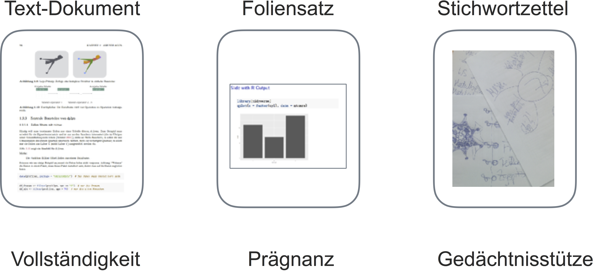

```{r setup, include=FALSE}
knitr::opts_chunk$set(echo = TRUE,
                      out.width = "50%",
                      fig.align = "center")
```


Liebe Kolleginnen und Kollegen,

Herzlich willkommen bei "PraDa" -- schön, dass Sie als Dozent^[Alle Geschlechter sind mittels generischem Maskulinum gleichermaßen angepsprochen (genau genommen müssten das mehr als sein). Das generische Maskulinum wird laut dem Duden traditionell dann gewählt, 'wenn das natürliche Geschlecht unwichtig ist oder männliche und weibliche Personen gleichermaßen gemeint sind. Das Maskulinum ist hier neutralisierend bzw. verallgemeinernd ("generisch").'] an Bord sind!

Dieser Hinweiszettel soll Ihnen helfen, das Modul erfolgreich und mit Freude zu lehren. Gerade bei neuen Modulen ist es nicht immer leicht, sich zurecht zufinden. Gerade wenn die Materie anspruchsvoll, neu oder umfangreich ist. 

# Ein schlankes Folienskript, ein umfangreiches Skript

Eine Besonderheit dieses Moduls ist es, dass es kein "normales" Powerpoint-Skript gibt. Wie, höre ich Sie gerade sagen, soll ich bitteschön unterrichten? Die gute Nachricht ist: Sie bekommen ausführliches, ausgeschriebenes Material, in weit größerem Umfang als dies normalerweise der Fall ist. Allerdings wird dieses Textmaterial in dem Format geliefert, in dem Texte vemittelt werden sollte: Als Textdokument ("Buch"), nicht (primär) als Powerpoint-Folie. Aber wie, so könnten Sie entgegnen, soll ich das präsentieren im Unterricht? Schwerlich kann ich ein Buch an die Wand projizieren. Für den Zweck des Visualisierens (Präsentierens) gibt es einen Foliensatz (bewusst nicht "Skript" geannt). Allerdings ist der Foliensatz schlank; es beinhaltet im Wesentlichen Dinge, die sich zum Visualisieren eignen: Bilder und Kernaussagen. 

Gemeinhin wird ein anderer Gebrauch von Folien gemacht: ~~Über~~voll geladene Powerpoint-Folien, die den Spagat versuchen zwischen ein Buch zu sein und Wesentliches zu präsentieren. Und dabei keinem von beidem gerecht werden. Zum einen: Auf einer Folie ist einfach viel weniger Platz als auf einer Buchseite. Zum anderen: Übervolle Folien sind zum Verdeutlichen ungeeignet, da die Teilnehmer mit Lesen beschäftigt sind und Ihnen nicht zuhören. Viel besser ist es, Verdeutlichen (Visualisieren, Präsentieren) vom Dokumentieren der Detail-Informationen zu trennen. Das ist in diesem Skript umgesetzt. Es gibt also ein umfangreiches Skript (ein "Rumpfbuch") und einen schlanken Foliensatz Sie haben außerdem einfachen Zugriff auf alle Bilder, R-Code, Tabellen und Text. Damit können Sie sich einfach einen eigenen Foliensatz bauen. Das geht natürlich nur dann einfach, wenn Sie die Methode dieses Moduls umsetzen, und den Foliensatz schlank halten. Dann (und nur dann) ist es sehr einfach, einen Foliensatz selber zu erstellen. 

Schließlich bleibt noch die Frage: "Hey, ich brauche die Folien auch als Stichwortgeber. Natürlich kann ich meinen Stoff, aber die Folie hilft mir, alles zu sagen, was wichtig ist". Dazu: Alles Wichtige ist im Textdokument nachzulesen. Und: valider Punkt; aber dieser berechtigte Hinweis ist besser umgesetzt mit einem Stichwortzettel - ähnlich zu den Karteikarten, die Studierende gerne bei Referaten verwenden. 

An Dokumenten für einen Vortrag braucht man also dreierlei Dokumente [s. Abb. @fig:fig1].

{#fig:fig1 width=90%}


Jedes dieser drei Dokument-Formate (Text, Folie, Stichwortzettel) hat ein anderes Ziel:

- Text -- Vollständigkeit
- Folie -- Prägnante Darstellung: einen Sachverhalt auf den Punkt bringen
- Stichwort-Zettel -- Merkhilfe für das eigene Vortragen


Anstelle eines Kompromis (der mit weniger Entwicklungsaufwand verbunden wäre), ist hier die Lösung gewält, alle drei Formate  zu nutzen. "Halt, wo ist jetzt mein Stichwort-Zettel?", tja, den müssen Sie sich selber erstellen, da nur Sie wissen, welche und wie viele Stichworte Sie benötigen.


# Fokus auf praktische Aspekte der modernen Datenanalyse

Inhaltlich ist der wesentliche Punkt dieses Moduls, dass es sich auf *praktische* Aspekte der *modernen* Datenanalyse bezieht. Was heißt praktisch? Praktisch heißt, dass das Tun bzw. "Selber-Tun-Können" einen prominenten Platz in der Didaktik dieses Moduls einnimmt. Die Studierenden sollen die Analysen selber ausführen können - im Gegensatz zu "nur" wissen, was die Theorie solcher Methoden ist. Selber ausführen können bedeutet heutzutage in hohem Maße: Software bedienen können. In diesem Fall wird $R$ als Analysesoftware verwendet. Um den Selber-Tun Rechnung zu tragen, findet R in großem Umfang Verwendung in diesem Skript. R verlangt einiges an Aufwand, um sich einigermaßen sicher zu fühlen. Entsprechend werden Dozenten und Studenten einen substanziellen Teil der Lernzeit mit Arbeit (und Erlernen von) R verbringen.

Das Selber-Tun-Können bringt zu einem weiteren, verwandten Punkt: *Moderne Methoden*. Modern heißt einerseits, mit R zu arbeiten. R ist eine oder die führende Plattform für statistische Analysen; eine Eintrittskarte in das Datenzeitalter. Für SPSS oder Excel gilt das nicht. Innerhalb von R werden neuere Ansätze verwendet - ein Schwerpunkt bildet die Arbeiten um Hadley Wickham und besonders gilt das für das "Durchpfeifen" ("to pipe"; s. Kapitel "Datenjudo"). Das Durchpfeifen wurde von einigen als eine der Innovation (in R) der letzten Jahre begrüßt.

Moderne Methoden der Datenanalyse zeichnen sich auch durch die Orientierung zu Prinzipien des 'statistischen Lernens' aus. So überschätzt man die Güte der Vorhersage zukünftiger Fälle, wenn man die Vorhersagegüte am Datensatz misst, anhand dessen das Modell erstellt wurde. Aus diesem Grund sind einige grundlegende Ideen des statistischen Lernens aufgeführt.

# Hilfen für die Dozenten

Folgende Hilfestellungen stehen für Dozenten bereit:

- Ausführliches Skript (PDF)
- [HTML-Version des Skripts](https://sebastiansauer.github.io/Praxis_der_Datenanalyse/) zur einfachen Navigation innerhalb des Skripts
- Alle Bilder und Tabellen stehen zum Zugriff bereit
- Foliensatz
- Übungsklausur (im Skript)
- Übungsaufgaben für jedes Kapitel (im Skript)
- Ausführliche Verweise auf weiterführendes Material (im Skript)
- Literaturhinweise (im Skript); besonders hilfreich ist das Buch [R for Data Science](http://r4ds.had.co.nz/).
- [Strukturiertes Fehlersystem](https://github.com/sebastiansauer/Praxis_der_Datenanalyse/issues): Fehler im Skript oder Wünsche zum Skript können auf speziellem Internetformular aufgegeben und ihr Status nachverfolgt werden. Klicken Sie auf der Seite des Links auf den Button "New Issue", wenn Sie einen neuen "Issue" aufgeben möchten.


Workshops und eine Telefonhotline sind als weitere Unterstützung geplant auch in Abhängigkeit vom Bedarf.


# Organisatorisches

Die wichtigsten organisatorischen Punkte sind im Skript im Kapitel [Organisatorisches](https://sebastiansauer.github.io/Praxis_der_Datenanalyse/organisatorisches.html) festgehalten, z.B. Modulziele, Zuordnung von Themen zu Terminen etc.

# Freiheit der Lehre

Die Freieheit der Lehre ist gewährt. Wie in jedem Modul gilt: Wir sollen die Modulziele erfüllen und sind im Übrigen frei. Nutzen Sie diese Freiheit: Falls Ihnen ein Kapitel nicht zusagt, lassen Sie es aus oder begrenzen Sie den Stoff indem Sie z.B. ein Teilkapitel auslassen.


# Themen

Die Themen pro Kapitel sind im Skript dargestellt, s. Kapitel [Organisatorisches](https://sebastiansauer.github.io/Praxis_der_Datenanalyse/organisatorisches.html). Sehen Sie Sie als Richtwert; setzen Sie Schwerpunkte nach eigenem Ermessen. Es ist auch nicht unbedingt nötig, den kompletten Stoff jedes Kapitels zu erarbeiten. Auch hier gilt es, eigene Schwerpunkte zu setzen.
