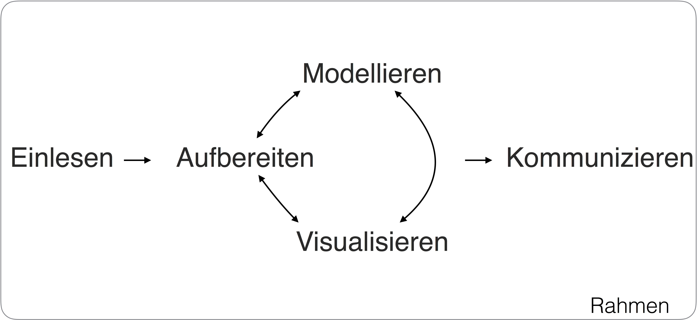
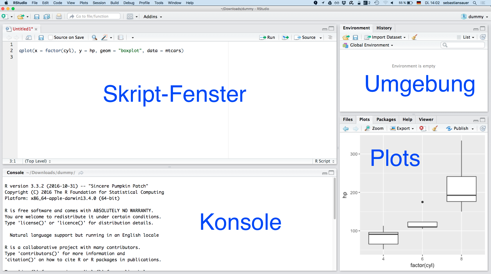
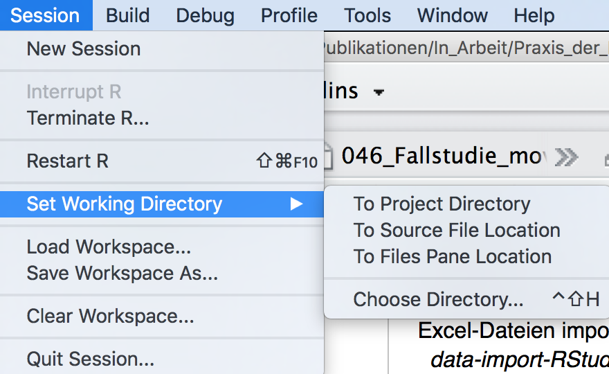

\mainmatter


\setcounter{chapter}{0}
\part{Grundlagen}


# Rahmen


\BeginKnitrBlock{rmdcaution}<div class="rmdcaution">Lernziele:

- Einen Überblick über die fünf wesentliche Schritte der Datenanalyse gewinnen.
- R und RStudio installieren können.
- Einige häufige technische Probleme zu lösen wissen.
- R-Pakete installieren können.
- Einige grundlegende R-Funktionalitäten verstehen.
- Auf die Frage "Was ist Statistik?" eine Antwort geben können.

</div>\EndKnitrBlock{rmdcaution}


In diesem Skript geht es um die Praxis der Datenanalyse. Mit Rahmen ist das 
"Drumherum" oder der Kontext der eigentlichen Datenanalyse gemeint. Dazu gehören
einige praktische Vorbereitungen und ein paar Überlegungen. Zum Beispiel 
brauchen wir einen Überblick über das Thema. Voilà (Abb. \@ref(fig:fig-prozess)):

<div class="figure" style="text-align: center">

<p class="caption">(\#fig:fig-prozess)Der Prozess der Datenanalyse</p>
</div>


Datenanalyse, praktisch betrachtet, kann man in fünf Schritte einteilen [@r4ds].
Zuerst muss man die Daten *einlesen*, die Daten also in R (oder einer anderen 
Software) verfügbar machen (laden). Fügen wir hinzu: In *schöner Form* verfügbar
machen; man nennt dies auch *tidy data* (hört sich cooler an). Sobald die Daten in geeigneter 
Form in R geladen sind, folgt das *Aufbereiten*. Das beinhaltet Zusammenfassen, 
Umformen oder Anreichern je nach Bedarf. Ein nächster wesentlicher Schritt ist 
das *Visualisieren* der Daten. Ein Bild sagt bekanntlich mehr als viele Worte. 
Schließlich folgt das *Modellieren* oder das Hypothesen prüfen: Man überlegt 
sich, wie sich die Daten erklären lassen könnten. Zu beachten ist, dass diese 
drei Schritte - Aufbereiten, Visualisieren, Modellieren - keine starre Abfolge 
sind, sondern eher ein munteres Hin-und-Her-Springen, ein aufbauendes 
Abwechseln. Der letzte Schritt ist das *Kommunizieren* der Ergebnisse der 
Analyse - nicht der Daten. Niemand ist an Zahlenwüsten interessiert; es gilt, 
spannende Einblicke zu vermitteln.

Der Prozess der Datenanalyse vollzieht sich nicht im luftleeren Raum, sondern 
ist in einem *Rahmen* eingebettet. Dieser beinhaltet praktische Aspekte - wie 
Software, Datensätze - und grundsätzliche Überlegungen - wie Ziele und 
Grundannahmen.


## Software installieren


Als Haupt-Analysewerkzeug nutzen wir R; daneben wird uns die sog. 
"Entwicklungsumgebung" RStudio einiges an komfortabler Funktionalität bescheren.
Eine Reihe von R-Paketen ("Packages"; d.h. Erweiterungen) werden wir auch 
nutzen. R ist eine recht alte Sprache; viele Neuerungen finden in Paketen 
Niederschlag, da der "harte Kern" von R lieber nicht so stark geändert wird. 
Stellen Sie sich vor: Seit 29 Jahren nutzen Sie eine Befehl, der Ihnen einen 
Mittelwert ausrechnet, sagen wir die mittlere Anzahl von Tassen Kaffee am Tag. 
Und auf einmal wird der Mittelwert anders berechnet?! Eine Welt stürzt ein! 
Naja, vielleicht nicht ganz so tragisch in dem Beispiel, aber grundsätzlich sind
Änderungen in viel benutzen Befehlen potenziell problematisch. Das ist wohl ein 
Grund, warum sich am "R-Kern" nicht so viel ändert. Die Innovationen in R 
passieren in den Paketen. Und es gibt viele davon; als ich diese Zeilen 
schreibe, sind es fast schon 10.000! Genauer: 9937 nach dieser Quelle: 
<https://cran.r-project.org/web/packages/>.


### R und RStudio installieren

{ width=20% } { width=20% }

Sie können R unter 
<https://cran.r-project.org> herunterladen und installieren (für Windows, Mac 
oder Linux). RStudio finden Sie auf der gleichnamigen Homepage: 
<https://www.rstudio.com>; laden Sie die "Desktop-Version" für Ihr 
Betriebssystem herunter.


Die Oberfläche von R, die "Console", sieht so aus:

<!--   -->


Die Oberfläche von RStudio sieht (unter allen Betriebssystemen etwa gleich) so 
aus:




Das *Skript-Fenster*\index{Skript-Fenster} ähnelt einem normalem Text-Editor; 
praktischerweise finden Sie aber einen Button "run", der 
die aktuelle Zeile oder die Auswahl "abschickt", d.h. in die 
Konsole gibt, wo die Syntax ausgeführt wird. Wenn Sie ein Skript-Fenster
öffnen möchten, so können Sie das Icon  
klicken (Alternativ: Ctrl-Shift-N oder File > New File > R Script).

Aus dem Fenster der *Konsole*\index{Konsole} spricht R zu uns bzw. 
wir mit R. Wird ein Befehl\index{Funktion} (synonym: *Funktion*\index{Funktion}) hier eingegeben, so führt R ihn aus. 
Es ist aber viel praktischer, Befehle in das Skript-Fenster einzugeben, als in
die Konsole. Behalten Sie dieses Fenster im Blick, wenn Sie Antwort von R erwarten.

Im Fenster *Umgebung*\index{Umgebung} (engl. "environment") zeigt R, 
welche Variablen (Objekte) vorhanden sind. Stellen Sie sich die Umgebung wie einen
Karpfenteich vor, in dem die Datensätze und andere Objekte herumschwimmen. Was nicht
in der Umgebung angezeigt wird, existiert nicht für R.

Im Fenster rechts unten werden mehrere Informationen bereit gestellt, z.B. 
werden Diagramme (Plots) dort ausgegeben. Klicken Sie mal die anderen Reiter im Fenster
rechts unten durch.


Wer Shortcuts mag, wird in RStudio überschwänglich beschenkt; der Shortcut für die Shortcuts ist `Shift-Alt-K`.


 Wenn Sie RStudio starten, startet R automatisch auch. Starten Sie daher, wenn 
Sie RStudio gestartet haben, *nicht* noch extra R. Damit hätten Sie sonst zwei 
Instanzen von R laufen, was zu Verwirrungen (bei R und beim Nutzer) führen kann.


### Sonstiges Material für dieses Skript

Bitte laden Sie sich auch das sonstige Material aus diesem [Github-Repositorium](https://github.com/sebastiansauer/Praxis_der_Datenanalyse/tree/gh-pages) herunter:

- Daten (Ordner `data`)
- Liste der benötigten R-Pakete (Datei `Pakete_fuer_PraDa.txt`)

Praktischerweise lädt man im Standard ganze Ordner von Github herunter, so dass man nicht alle Dateien einzeln anpacken muss. Um Download-Zeit zu sparen, sind diese Ordner gezippt. Bevor Sie mit den Dateien arbeiten können, müssen Sie diese erst entzippen^[auf vielen Computern zu bewerkstelligen mit rechter Maustate/Kontextmenü und dann "Dateien extrahieren" o.ä., sonst Googeln.]. 


### Hilfe! R startet nicht!

>    Manntje, Manntje, Timpe Te,   
    Buttje, Buttje inne See,    
    myne Fru de Ilsebill    
    will nich so, as ik wol will. 


*Gebrüder Grimm, Märchen vom Fischer und seiner Frau^[<https://de.wikipedia.org/wiki/Vom_Fischer_und_seiner_Frau>]*


Ihr R startet nicht oder nicht richtig? Die drei wichtigsten Heilmittel sind:

1. Schließen Sie die Augen für eine Minute. Denken Sie an etwas Schönes und was 
Rs Problem sein könnte. 
2. Schalten Sie den Rechner aus und probieren Sie es 
morgen noch einmal. 
3. Googeln.

Sorry für die schnoddrigen Tipps. Aber: Es passiert allzu leicht, dass man 
*Fehler* wie diese macht:


\BeginKnitrBlock{rmdcaution}<div class="rmdcaution">
OH NO:

- install.packages(dplyr) 

- install.packages("dliar")

- install.packages("derpyler") 

- install.packages("dplyr")  # dependencies vergessen 

- Keine Internet-Verbindung 

- library(dplyr)  # ohne vorher zu installieren
</div>\EndKnitrBlock{rmdcaution}


Wenn R oder RStudio dann immer noch nicht starten oder nicht richtig laufen, 
probieren Sie dieses:


- Sehen Sie eine Fehlermeldung, die von einem fehlenden Paket spricht (z.B. 
"Package 'Rcpp' not available") oder davon spricht, dass ein Paket nicht 
installiert werden konnte (z.B. "Package 'Rcpp' could not be installed" oder "es
gibt kein Paket namens ‘Rcpp’" oder "unable to move temporary installation XXX 
to YYY"), dann tun Sie folgendes:

    - Schließen Sie R und starten Sie es neu. 
    - Installieren Sie das oder die angesprochenen Pakete mit `install.packages("name_des_pakets", dependencies = TRUE)` oder mit dem entsprechenden Klick in RStudio. 
    - Starten Sie das entsprechende Paket mit `library(name_des_pakets)`.


- Gerade bei Windows 10 scheinen die Schreibrechte für R (und damit RStudio oder
RCommander) eingeschränkt zu sein. Ohne Schreibrechte kann R aber nicht die 
Pakete ("packages") installieren, die Sie für bestimmte R-Funktionen benötigen. 
Daher schließen Sie R bzw. RStudio und suchen Sie das Icon von R oder wenn Sie 
RStudio verwenden von RStudio. Rechtsklicken Sie das Icon und wählen Sie "als 
Administrator ausführen". Damit geben Sie dem Programm Schreibrechte. Jetzt 
können Sie etwaige fehlende Pakete installieren.

- Ein weiterer Grund, warum R bzw. RStudio die Schreibrechte verwehrt werden 
könnten (und damit die Installation von Paketen), ist ein Virenscanner. Der 
Virenscanner sagt, nicht ganz zu Unrecht: "Moment, einfach hier Software zu 
installieren, das geht nicht, zu gefährlich". Grundsätzlich gut, in diesem Fall 
unnötig. Schließen Sie R/RStudio und schalten Sie dann den Virenscanner 
*komplett* (!) aus. Öffnen Sie dann R/RStudio wieder und versuchen Sie fehlende 
Pakete zu installieren.


#### I am an outdated model


Verwenden Sie möglichst die neueste Version von R, RStudio und Ihres 
Betriebssystems. Ältere Versionen führen u.U. zu Problemen; je älter, desto 
Problem... Updaten Sie Ihre Packages regelmäßig z.B. mit `update.packages()` 
oder dem Button "Update" bei RStudio (Reiter `Packages`).


### Die Denk- und Gefühlswelt von R


#### R-Skript-Dateien

- Ein neues *R-Skript*\index{R-Skript} im RStudio können Sie z.B. öffnen mit `File-New File-R Script`. Schreiben Sie dort Ihre R-Befehle; Sie können die Skriptdatei speichern, öffnen, ausdrucken, übers Bett hängen...

- R-Skripte können Sie speichern (unter `File-Save`) und öffnen.

- R-Skripte sind einfache Textdateien, die jeder Texteditor verarbeiten kann. 
Nur statt der Endung `.txt`, sind R-Skripte stolzer Träger der Endung `.R`. Es 
bleibt aber eine schnöde Textdatei. Geben Sie Ihren R-Skript-Dateien die Endung ".R",
damit erkennt RStudio, dass es sich um ein R-Skript handelt und bietet ein paar 
praktische Funktionen wie den "Run-Button".


### Pakete 

Ein Großteil der Neuentwicklungen bei R passiert in sog. 'Paketen' (engl. *packages*), das sind Erweiterungen für R. Jeder, der sich berufen fühlt, kann ein R-Paket schreiben und es zum 'R-Appstore' ([CRAN](https://cran.r-project.org/)) hochladen. Von dort kann es dann frei (frei wie in Bier) heruntergeladen werden.

Am einfachsten installiert man R-Pakete in RStudio über den Button "Install" im Reiter "Packages" (s. Abb. \@ref(fig:fig-install-packages)).

<div class="figure" style="text-align: center">

<p class="caption">(\#fig:fig-install-packages)So installiert man Pakete in RStudio</p>
</div>


Ein R-Paket, welches für die praktische Datenanalyse praktisch ist, heißt 
`tidyverse`. Wir werden viel mit diesem Paket arbeiten. Bitte installieren Sie es 
schon einmal, sofern noch nicht geschehen. Sie können auch folgenden Befehl verwenden, um Pakete zu installieren.


```r
install.packages("tidyverse", dependencies = TRUE) 
```


Sofern Sie online sind, sollte das Paket `tidyverse` jetzt installiert sein.

\BeginKnitrBlock{rmdcaution}<div class="rmdcaution">Beim Installieren von 
R-Paketen könnten Sie gefragt werden, welchen "Mirror" Sie verwenden möchten. 
Das hat folgenden Hintergrund: R-Pakete sind in einer Art "App-Store", mit Namen
CRAN (Comprehense R Archive Network) gespeichert. Damit nicht ein armer, kleiner
Server überlastet wird, wenn alle Studis dieser Welt just gerade beschließen, 
ein Paket herunterzuladen, gibt es viele Kopien dieses Servers - seine Spiegelbilder (engl. "mirrors"). 
Suchen Sie sich einfach einen aus, der in der Nähe ist.
</div>\EndKnitrBlock{rmdcaution}


Bei der Installation von Paketen mit `install.packages("name_des_pakets")` 
sollte stets der Parameter `dependencies = TRUE` angefügt werden. Also 
`install.packages("name_des_pakets", dependencies = TRUE)`. Hintergrund ist: 
Falls das zu installierende Paket seinerseits Pakete benötigt, die noch nicht 
installiert sind (gut möglich), dann werden diese sog. "dependencies" gleich 
mitinstalliert (wenn Sie  `dependencies = TRUE` setzen).


Nicht vergessen: Installieren muss man eine Software *nur einmal*; *starten* 
(laden) muss man sie jedes Mal, wenn man sie vorher geschlossen hat und wieder 
nutzen möchte:


```r
library(dplyr) 
```

Der Befehl bedeutet sinngemäß: "Hey R, geh in die Bücherei (library) und hole 
das Buch (package) dplyr!".


\BeginKnitrBlock{rmdcaution}<div class="rmdcaution">Wann benutzt man bei R Anführungszeichen? Das ist etwas verwirrend im Detail, aber die Grundegel 
lautet: wenn man Text anspricht. Im Beispiel oben "library(dplyr)" ist "dplyr" 
hier erst mal für R nichts Bekanntes, weil noch nicht geladen. Demnach müssten 
*eigentlich* Anführungsstriche stehen. Allerdings meinte ein Programmierer, dass
es doch so bequemer ist. Hat er Recht. Aber bedenken Sie, dass es sich um die 
Ausnahme einer Regel handelt. Sie können also auch schreiben: library("dplyr") 
oder library('dplyr'); geht beides.
</div>\EndKnitrBlock{rmdcaution}


Das Installieren und Starten anderer Pakete läuft genauso ab. Am besten 
installieren Sie alle Pakete, die wir in diesem Buch benötigen auf einmal, dann 
haben Sie Ruhe (eine schnelle Internetverbindung vorausgesetzt).


### R-Pakete für dieses Buch 

In diesem Skript verwenden wir die folgenden 
R-Pakete; diese müssen installiert sein und geladen. Ggf. benötigen Sie Administrator-Rechte, um Pakete zu installieren. Virenscanner müssen evtl. ausgestaltet sein. 


```
#>  [1] "BaylorEdPsych" "broom"         "car"           "caret"        
#>  [5] "cluster"       "corrplot"      "corrr"         "downloader"   
#>  [9] "dplyr"         "GGally"        "ggplot2"       "grid"         
#> [13] "knitr"         "lmtest"        "lsa"           "MBESS"        
#> [17] "modelr"        "nycflights13"  "okcupiddata"   "pdftools"     
#> [21] "png"           "psych"         "ROCR"          "SDMTools"     
#> [25] "SnowballC"     "stringr"       "tidyr"         "tidytext"     
#> [29] "tidyverse"     "wordcloud"
```

Mit folgenden Befehlen installieren Sie alle Pakete für diesen Kurs auf einmal. Das ist ganz praktisch, weil Sie ggf. Aktualisierungen bereits installierter Pakete bekommen.


```r
load("div/Pakete_fuer_PraDa.Rda")
install.packages(packages)
```

Denken Sie daran, dass dieser Befehl - und alle anderen, die auf Dateien zu diesem Skript zugrifen, davon ausgehen, dass das Arbeitsverzeichnis passend gesetzt ist (vgl. Kapitel \@ref(wd)). Für jedes Kapitel ist angegeben, welches Kapitels jeweils benötigt d.h. zu laden sind. 


### Vertiefung: Zuordnung von Paketen zu Befehlen


*Woher weiß man, welche Befehle (oder auch Daten) in einem Paket enthalten sind?*

Eine einfache Möglichkeit ist es, beim Reiter 'Pakete' auf den Namen eines der installierten Pakete zu klicken. Daraufhin öffnet sich die Dokumentation des Pakets und man sieht dort alle Befehle und Daten aufgeführt (s. Abbildung \@ref(fig:pakete-hilfe)). Übrigens sehen Sie dort auch die Version eines Pakets (vielleicht sagt jemand mal zu Ihnen, "Sie sind ja outdated", dann schauen Sie mal auf die die Paket-Versionen).

<div class="figure" style="text-align: center">

<p class="caption">(\#fig:pakete-hilfe)Hier werden Sie geholfen: Die Dokumentation der R-Pakete</p>
</div>


Für geladenen Pakete kann man auch den Befehl `help` nutzen, z.B. `help(ggplot2)`.


*Und umgekehrt, woher weiß ich, in welchem Paket ein Befehl 'wohnt'?*

Probieren Sie den Befehl `help.search("qplot")`, wenn Sie wissen möchten, in welchem Paket `qplot` zuhause ist. `help.search` sucht alle Hilfeseiten von *installierten* Paketen, in der der Suchbegriff irgendwie vorkommt. Um das Paket eines *geladenen* Befehl zu finden, hilft der Befehl `find`: `find("qplot")`.


Sie können auch diesen selbstgestrickten Befehl nutzen, den Sie zuerst laden müssen:


```r
source("includes/find_funs.R")
find_funs("qplot")
#> [1] "ggplot2"
```


In diesem Skript sind am Ende jedes Kapitels die jeweils besprochenen (neuen) Befehle aufgeführt - inklusive ihres Paketes. Falls bei einem Befehl kein Paket angegeben ist, heißt das, dass der Befehl im 'Standard-R' wohnt - Sie müssen kein weiteres Paket laden^[Eine Liste der Pakete, die beim Standard-R enthalten sind (also bereits installiert sind) finden Sie [hier](https://stat.ethz.ch/R-manual/R-devel/doc/html/packages.html)]. Also zum Beispiel `ggplot2::qplot`: Der *Befehl* `qplot` ist im *Paket* `ggplot2` enthalten. Das Zeichen `::` trennt also Paket von Befehl.


\BeginKnitrBlock{rmdcaution}<div class="rmdcaution">
Manche Befehle haben Allerweltsnamen (z.B. 'filter'). Manchmal gibt es Befehle mit gleichem Namen in verschiedenen Paketen; besonders Befehle mit Allerweltsnamen (wie 'filter') sind betroffen ('mosaic::filter' vs. 'dplyr::filter'). Falls Sie von wirre Ausgaben bekommen oder diffuse Fehlermeldung kann es sein, kann es sein, dass R einen Befehl mit dem richtigen Namen aber aus dem 'falschen' Paket zieht. Geben Sie im Zweifel lieber den Namen des Pakets vor dem Paketnamen an, z.B. so `dplyr::filter`.</div>\EndKnitrBlock{rmdcaution}


Außerdem sind zu Beginn jedes Kapitels die in diesem Kapitel benötigten Pakete angegeben. Wenn sie diese Pakete laden, werden alle Befehle dieses Kapitels funktionieren^[es sei denn, sie tun es nicht].


*Wie weiß ich, ob ein Paket geladen ist?*

Wenn der Haken im Reiter 'Packages' gesetzt ist (s. Abbildung \@ref(fig:pakete-hilfe)), dann ist das Paket geladen. Sonst nicht.


### Datensätze {#daten}

Die folgenden Datensätze liegen [hier](https://github.com/sebastiansauer/Praxis_der_Datenanalyse/tree/gh-pages/data). Bitte laden Sie den Ordner Ordner herunter.

- Datensatz `profiles` aus dem R-Paket {okcupiddata} [@kim2015okcupid]; es handelt sich um Daten von einer Online-Singlebörse 
- Datensatz `Wage` aus dem R-Paket {ISLR} [@introstatlearning]; es handelt sich um Gehaltsdaten von US-amerikanischen Männern 
- Datensatz `inf_test_short`, URL: <https://osf.io/sjhu> [@Sauer_2017]; es handelt sich um Ergebnisse einer Statistikklausur 
- Datensatz `flights` aus dem R-Paket {nycflights13} [@nycflights13]; es handelt sich um Abflüge von den New Yorker Flughäfen 
- Datensatz 'wo_men`, URL: <https://osf.io/ja9dw> [@Sauer_2017a]; es handelt sich um Körper- und Schuhgröße von Studierenden
- Datensatz `tips` aus dem R-Paket {reshape2} [@bryant1995practical]; es handelt sich um Trinkgelder in einem Restaurant 
- Datensatz `extra`, URL: <https://osf.io/4kgzh> [@Sauer_2016]; es handelt sich die Ergebnisse einer Umfrage zu Extraversion
- Datensatz `Werte` URL: <https://osf.io/4kgzh/> [@Gansser_2017]; es handelt sich um Werte von Studierenden
- Datensatz `Segment` URL: <https://goo.gl/eUm8PI> [@Chapman2015]; es handelt sich um soziodemographische Daten (simuliert)


Wie man Daten in R 'einlädt' (Studierende sagen gerne 'ins R hochladen'), besprechen wir im Kapitel \@ref(daten-einlesen).


## ERRRstkontakt

### Datentypen in R

Die (für diesen Kurs) wichtigsten Datentypen von R sind in Tabelle \@ref(tab:datentypen) aufgeführt.


Table: (\#tab:datentypen)Wichtige Datentypen in R

Name        Synonyme           Beschreibung                                                                                                     R-Befehl       Beispiel                         Restriktionen                                       
----------  -----------------  ---------------------------------------------------------------------------------------------------------------  -------------  -------------------------------  ----------------------------------------------------
numeric     num, double, dbl   Reelle Zahl (mit Nachkommastellen)                                                                               as.numeric     x <- c(2.71, 3.14)               grundlegend                                         
integer     int, L             Ganze Zahl                                                                                                       as.integer     y <- c(42,7)                     grundlegend                                         
character   chr, string        Text                                                                                                             as.character   der_name <- "Joachim"            grundlegend                                         
logical     lgl, logi          logisch; gibt an, ob ein Ausdruck wahr (TRUE; T) oder falsch (FALSE, F) ist                                      as.logical     c(TRUE, FALSE)                   grundlegend                                         
factor      fctr               Nominal skalierte Variable mit vorab definierten Ausprägungen; z.B. um Gruppen (Männer vs. Frauen) zu benennen   factor         der_name <- factor(der_name)     grundlegend                                         
vector      -                  Mehrere Elemente eines grundlegenden Typs                                                                        c              x <- c(2.71, 3.14)               sortenrein                                          
dataframe   tibble, df         Tabelle aus einem oder mehr Vektoren, die jeweils einen Namen haben                                              data.frame     df <- data.frame(x,y)            rechteckig: Vektoren müssen von gleicher Länge sein 
list        -                  Kombination beliebigiger Vektoren                                                                                list           liste <- list(x, der_name, df)   keine besonderen Restriktionen                      

Für die praktische Datenanalyse ist der `dataframe` (Dataframe) am wichtigsten. Grob gesagt handelt es sich dabei um eine Tabelle wie man sie aus Excel kennt. Etwas genauer ist eine Kombination von Vektoren mit gleicher Länge, so dass eine 'rechteckige' Datenstruktur entsteht. Alle Spalten (d.h. Vektoren) haben einen Namen, so dass es 'Spaltenköpfe' gibt. Eine neuere Variante von Dataframes sind 'tibbles', die *auch* Dataframes sind, aber ein paar praktische Zusatzeigenschaften aufweisen.


### Hinweise

Unser erster Kontakt mit R! Ein paar Anmerkungen vorweg:

- R unterscheidet zwischen Groß- und Kleinbuchstaben, d.h. `Oma` und `oma` sind 
zwei verschiedene Dinge für R!
- R verwendet den Punkt `.` als 
Dezimaltrennzeichen.
- Fehlende Werte werden in R durch `NA` kodiert.
- Kommentare werden mit dem Rautezeichen `#` eingeleitet; der Rest der Zeile von von R dann ignoriert. 
- Hilfe zu einem Befehl erhält man über ein vorgestelltes Fragezeichen `?`.
- Zusätzliche Funktionalität kann über Zusatzpakete hinzugeladen werden. Diese 
müssen ggf. zunächst installiert werden.
- *Variablennamen*\index{Variablen} (synonym: *Objekte*\index{Objekte}) in R müssen mit Buchstaben beginnen; ansonsten dürfen nur Zahlen, Unterstriche `-` und Minuszeichen `-` enthalten sein. Leerzeichen sind nicht erlaubt.
- Variablen einen Namen zu geben, ist nicht leicht, aber wichtig. Namen sollten knapp, aber aussagekräftig sein.

```
# so nicht:
var
x
dummy
objekt
dieser_name_ist_etwas_lang_vielleicht

# gut:
tips_mw
lm1
```

Um den Inhalt einer Variablen auszulesen, geben wir einfach den Namen des Objekts ein (und schicken den Befehl ab).

### R als Taschenrechner

Auch wenn Statistik nicht Mathe ist, so kann man mit R 
auch rechnen. Geben Sie zum Üben die Befehle in der R Konsole hinter der 
Eingabeaufforderung `>` ein und beenden Sie die Eingabe mit `Return` bzw. 
`Enter`. 


```r
4+2 
#> [1] 6
```
Das Ergebnis wird direkt angezeigt. Bei 

```r
x <- 4+2 
```

erscheint zunächst kein Ergebnis. Über `<-` wird der Variable `x` der Wert 
`4+2` zugewiesen. Wenn Sie jetzt 

```r
x 
```

eingeben, wird das 
Ergebnis 

```
#> [1] 6
```

angezeigt. Sie können jetzt auch mit `x` 
weiterrechnen, z.B.: 


```r
x/4 
#> [1] 1.5
```

Vielleicht fragen Sie sich was die `[1]` vor dem 
Ergebnis bedeutet. R arbeitet vektororientiert, und die `[1]` zeigt an, dass es 
sich um das erste (und hier auch letzte) Element des Vektors handelt.


### Text und Variablen zuweisen

Man kann einer Variablen auch Text zuweisen (im Gegensatz zu Zahlen):


```r
y <- "Hallo R!"
```


Man kann auch einer Variablen eine andere zuweisen:


```r
y <- x
```

Wird jetzt y mit dem Inhalt von x überschrieben oder umgekehrt? Der Zuweisungspfeil `<-` macht die Richtung der Zuweisung ganz klar. Zwar ist in R das Gleichheitszeichen synonym zum Zuweisungspfeil erlaubt, aber der Zuweisungspfeil macht die Sache glasklar und sollte daher bevorzugt werden.


Man kann auch einer Variablen *mehr als* einen Wert zuweisen:


```r
x <- c(1, 2, 3)
```

Dieser Befehl erzeugt eine "Spalte" (einen Vektor). Will man einer Variablen *mehr als* einen Wert zuweisen, muss man die Werte erst in einen Vektor "zusammen binden"; das geht mit dem Befehl `c` (vom engl. "***c**ombine*").


### Funktionen aufrufen


Um einen *Befehl*\index{Befehl, Funktion} (präziser aber synonym hier: eine Funktion) aufzurufen, geben wir ihren Namen an und definieren sog. *Parameter*\index{Parameter eines R-Befehls} in einer runden Klammer, z.B. so:


```r
wo_men <- read.csv("data/wo_men.csv")
```

Allgemein gesprochen:

```
funktionsname(parametername1 = wert1, parametername2 = wert2, ...)
```

Die drei Punkte `...` sollen andeuten, dass evtl. weitere Parameter zu übergeben wären. 
Die Reihenfolge der Parameter ist *egal* - wenn man die Parameternamen anführt. 
Ansonsten muss man sich an die Standard-Reihenfolge, die eine Funktion vorgibt halten:


```r
#ok:
wo_men <- read.csv(file = "data/wo_men.csv", header = TRUE, sep = ",")
wo_men <- read.csv("data/wo_men.csv", TRUE, ",")
wo_men <- read.csv(header = TRUE, sep = ",", file = "data/wo_men.csv")


# ohno:
wo_men <- read.csv(TRUE, "data/wo_men.csv", ",")
```


In der Hilfe zu einem Befehl findet man die Standard-Syntax inklusive der möglichen Parameter, ihrer Reihenfolge und Standardwerten (default values) von Parametern. Zum Beispiel ist beim Befehl `read.csv` der Standardwert für `sep` mit `;` voreingestellt (schauen Sie mal in der Hilfe nach). Gibt man einen Parameter nicht an, für den ein Standardwert eingestellt ist, 'befüllt' R den Parameter mit diesem Standardwert.


### Das Arbeitsverzeichnis {#wd}


Das aktuelle Verzeichnis (Arbeitsverzeichnis; "working directory") kann man mit `getwd()` erfragen und mit `setwd()` einstellen. Komfortabler ist es aber, das aktuelle Verzeichnis per Menü zu ändern (vgl. Abb. \@ref(fig:Arbeitsverzeichnis). In RStudio: `Session > Set Working Directory > Choose Directory ...` (oder per Shortcut, der dort angezeigt wird).

<div class="figure" style="text-align: center">

<p class="caption">(\#fig:Arbeitsverzeichnis)Das Arbeitsverzeichnis mit RStudio auswählen</p>
</div>


Es ist praktisch, das Arbeitsverzeichnis festzulegen, denn dann kann man z.B. eine Datendatei einlesen, ohne den Pfad eingeben zu müssen:


```r
# nicht ausführen:
daten_deutsch <- read.csv("daten_deutsch.csv", sep = ";", dec = ".")
```

R geht dann davon aus, dass sich die Datei `daten_deutsch.csv` im Arbeitsverzeichnis befindet.


Für diesen Kurs ist es sinnvoll, das Arbeitsverzeichnis in einen "Hauptordner" zu legen (z.B. "Praxis_der_Datenanalyse"), in dem Daten und sonstiges Material als Unterordner abgelegt sind.


\BeginKnitrBlock{rmdcaution}<div class="rmdcaution">
Übrigens: Wenn Sie keinen Pfad angeben, so geht R davon aus, dass die Daten im aktuellen Verzeichnis (dem *working directory*) liegen. 
</div>\EndKnitrBlock{rmdcaution}


### Hier werden Sie geholfen

Es ist keine Schande, nicht alle Befehle der ca. 10,000 R-Pakete auswendig zu 
wissen. Schlauer ist, zu wissen, wo man Antworten findet. Hier eine Auswahl:

- Zu diesen Paketen gibt es gute "Spickzettel" (cheatsheets): ggplot2, 
RMarkdown, dplyr, tidyr. Klicken Sie dazu in RStudio auf *Help > Cheatsheets > 
...* oder gehen Sie auf <https://www.rstudio.com/resources/cheatsheets/>.

- In RStudio gibt es eine Reihe (viele) von Tastaturkürzeln (Shortcuts), die Sie
hier finden: *Tools > Keyboard Shortcuts Help*.

- Für jeden Befehl (d.i. Funktion) können Sie mit `?` Hilfe erhalten; probieren 
Sie z.B. `?mean`.

- Im Internet finden sich zuhauf Tutorials.

- Der Reiter "Help" bei RStudio verweist auf die Hilfe-Seite des jeweiligen Pakets bzw. Befehls.

- Die bekannteste Seite, um Fragen rund um R zu diskutieren ist 
<http://stackoverflow.com>.


### Aufgaben 


1. Öffnen Sie das Cheatsheet für RStudio und machen Sie sich mit dem Cheatsheet vertraut.

2. Sichten Sie kurz die übrigen Cheatsheets; später werden die Ihnen vielleicht von Nutzen sein.


3. Führen Sie diese Syntax aus:


```r
meine_coole_variable <- 10
meine_coole_var1able 
```

Woher rührt der Fehler?

4. Korrigieren Sie die Syntax:


```r
install.packages(dplyer)
```


`y <- Hallo R!`


`Hallo R <- 1`


```r
Hallo_R < - 1
```


## Was ist Statistik? Wozu ist sie gut?

Zwei Fragen bieten sich sich am Anfang der Beschäftigung mit jedem Thema an: Was
ist die Essenz des Themas? Warum ist das Thema (oder die Beschäftigung damit) 
wichtig?

Was ist Statistik? *Eine* Antwort dazu ist, dass Statistik die Wissenschaft von
Sammlung, Analyse, Interpretation und Kommunikation von Daten ist mithilfe 
mathematischer Verfahren ist und zur Entscheidungshilfe beitragen solle 
[@oxford; @sep-statistics]. Damit hätten wir auch den Unterschied zur schnöden 
Datenanalyse (ein Teil der Statistik) herausgemeißelt. Statistik wird häufig in 
die zwei Gebiete *deskriptive* und *inferierende* Statistik eingeteilt (vgl. Abb. \@ref(fig:desk-vs-inf)). Erstere 
fasst viele Zahlen zusammen, so dass wir den Wald statt vieler Bäume sehen. 
Letztere verallgemeinert von den vorliegenden (sog. "Stichproben-")Daten auf 
eine zugrunde liegende Grundmenge (Population). Dabei spielt die 
Wahrscheinlichkeitsrechnung (Stochastik) eine große 
Rolle.

<div class="figure" style="text-align: center">

<p class="caption">(\#fig:desk-vs-inf)Sinnbild für die Deskriptiv- und die Inferenzstatistik</p>
</div>


Aufgabe der deskriptiven Statistik ist es primär, Daten prägnant 
zusammenzufassen. Aufgabe der Inferenzstatistik ist es, zu prüfen, ob Daten 
einer Stichprobe auf eine Grundgesamtheit verallgemeinert werden können.


Dabei lässt sich der Begriff "Statistik" als Überbegriff von "Datenanalyse" 
verstehen, wenn diese Sicht auch nicht von allen geteilt wird 
[@grolemund2014cognitive]. In diesem Buch steht die Aufbereitung, Analyse, 
Interpretation und Kommunikation von Daten im Vordergrund. Liegt der Schwerpunkt
dieser Aktivitäten bei computerintensiven Methoden, so wird auch von *Data 
Science* gesprochen, wobei der Begriff nicht einheitlich verwendet wird [@r4ds;
@hardin2015data]

*Daten* kann man definieren als *Informationen, die in einem Kontext stehen*
[@moore1990uncertainty], wobei eine numerische Konnotation mitschwingt.

*Modellieren* kann man als *zentrale Aufgabe von Statistik* begreifen 
[@cobb2007introductory; @grolemund2014cognitive]. Einfach gesprochen, bedeutet 
Modellieren in diesem Sinne, ein mathematisches Narrativ ("Geschichte") zu 
finden, welches als Erklärung für gewisse Muster in den Daten fungiert; vgl. 
Kap. \@ref(mod1).

Statistisches Modellieren läuft gewöhnlich nach folgendem Muster ab [@grolemund2014cognitive]:


```
Prämisse 1: Wenn Modell M wahr ist, dann sollten die Daten das Muster D aufweisen.
Prämisse 2: Die Daten weisen das Muster D auf.
---
Konklusion: Daher muss das Modell M wahr sein.
```

Die Konklusion ist *nicht* zwangsläufig richtig. Es ist falsch zu sagen, dass dieses Argumentationsmuster - Abduktion [@peirce1955abduction] genannt - wahre, sichere Schlüsse (Konklusionen) liefert. Die Konklusion *kann, muss aber nicht*, zutreffen.

Ein Beispiel: Auf dem Nachhauseweg eines langen Arbeitstags wartet, in einer dunklen Ecke, ein Mann, der sich als Statistik-Professor vorstellt und Sie zu einem Glücksspiel einlädt. Sofort sagen Sie zu. Der Statistiker will 10 Mal eine Münze werfen, er setzt auf Zahl (versteht sich). Wenn er gewinnt, bekommt er 10€ von Ihnen; gewinnen Sie, bekommen Sie 11€ von ihm. Hört sich gut an, oder? Nun wirft er die Münze zehn Mal. Was passiert? Er gewinnt 10 Mal, natürlich (so will es die Geschichte). Sollten wir glauben, dass er ein Betrüger ist?

Ein Modell, welches wir hier verwenden könnten, lautet: Wenn die Münze gezinkt ist (Modell M zutrifft), dann wäre diese Datenlage D (10 von 10 Treffern) wahrscheinlich - Prämisse 1. Datenlage D ist tatsächlich der Fall; der Statistiker hat 10 von 10 Treffer erzielt - Prämisse 2. Die Daten D "passen" also zum Modell M; man entscheidet sich, dass der Professor ein Falschspieler ist. 

Wichtig zu erkennen ist, dass Abduktion mit dem Wörtchen *wenn* beginnt. Also davon *ausgeht*, dass ein Modell M der Fall ist (der Professor also tatsächlich ein Betrüger ist). Das, worüber wir entscheiden wollen, wird bereits vorausgesetzt. Falls M gilt, gehen wir mal davon aus, wie gut passen dann die Daten dazu? 

>    Wie gut passen die Daten D zum Modell M?

Das ist die Frage, die hier tatsächlich gestellt bzw. beantwortet wird.

Natürlich ist es keineswegs sicher, *dass* das Modell gilt. Darüber macht die Abduktion auch keine Aussage. Es könnte also sein, dass ein anderes Modell zutrifft: Der Professor könnte ein Heiliger sein, der uns auf etwas merkwürdige Art versucht, Geld zuzuschanzen... Oder er hat einfach Glück gehabt.

>   Statistische Modelle beantworten i.d.R. nicht, wie wahrscheinlich es ist, dass ein Modell gilt. Statistische Modelle beurteilen, wie gut Daten zu einem Modell passen.

Häufig trifft ein Modell eine Reihe von Annahmen, die nicht immer explizit gemacht werden, aber die klar sein sollten. Z.B. sind die Münzwürfe unabhängig voneinander? Oder kann es sein, dass sich die Münze "einschießt" auf eine Seite? Dann wären die Münzwürfe nicht unabhängig voneinander. In diesem Fall klingt das reichlich unplausibel; in anderen Fällen kann dies eher der Fall sein[^447]. Auch wenn die Münzwürfe unabhängig voneinander sind, ist die Wahrscheinlichkeit für Zahl jedes Mal gleich? Hier ist es wiederum unwahrscheinlich, dass sich die Münze verändert, ihre Masse verlagert, so dass eine Seite Unwucht bekommt. In anderen Situationen können sich Untersuchungsobjekte verändern (Menschen lernen manchmal etwas, sagt man), so dass die Wahrscheinlichkeiten für ein Ereignis unterschiedlich sein können, man dies aber nicht berücksichtigt. 


## Befehlsübersicht

Tabelle \@ref(tab:befehle-rahmen) stellt die Befehle dieses Kapitels dar. 


Table: (\#tab:befehle-rahmen)Befehle des Kapitels 'Rahmen'

Paket::Funktion         Beschreibung                             
----------------------  -----------------------------------------
install.packages("x")   Installiert Paket "x" (nicht: Paket "X") 
library                 lädt ein Paket                           
<-                      Weist einer Variablen einen Wert zu      
c                       erstellt eine Spalte/ einen Vektor       


Diese Befehle "wohnen" alle im Standard-R; es ist für diese Befehle nicht nötig, zusätzliche Pakete zu installieren/ laden.


## Verweise

- Chester Ismay erläutert einige Grundlagen von R und RStudio, die für 
Datenanalyse hilfreich sind: https://bookdown.org/chesterismay/rbasics/.

- Roger Peng und Kollegen bieten hier einen Einstieg in Data Science mit R: 
https://bookdown.org/rdpeng/artofdatascience/

- Wickam und Grolemund [-@r4ds] geben einen hervorragenden Überblick in das 
Thema dieses Buches; ihr Buch ist sehr zu empfehlen.

- Wer einen stärker an der Statistik orientierten Zugang sucht, aber 
"mathematisch sanft" behandelt werden möchte, wird bei James et al. 
[-@introstatlearning] glücklich oder zumindest fündig werden.


[^447]: Sind z.B. die Prüfungsergebnisse von Schülern unabhängig voneinander? Möglicherweise haben sie von einem "Superschüler" abgeschrieben. Wenn der Superschüler viel weiß, dann zeigen die Abschreiber auch gute Leistung.
