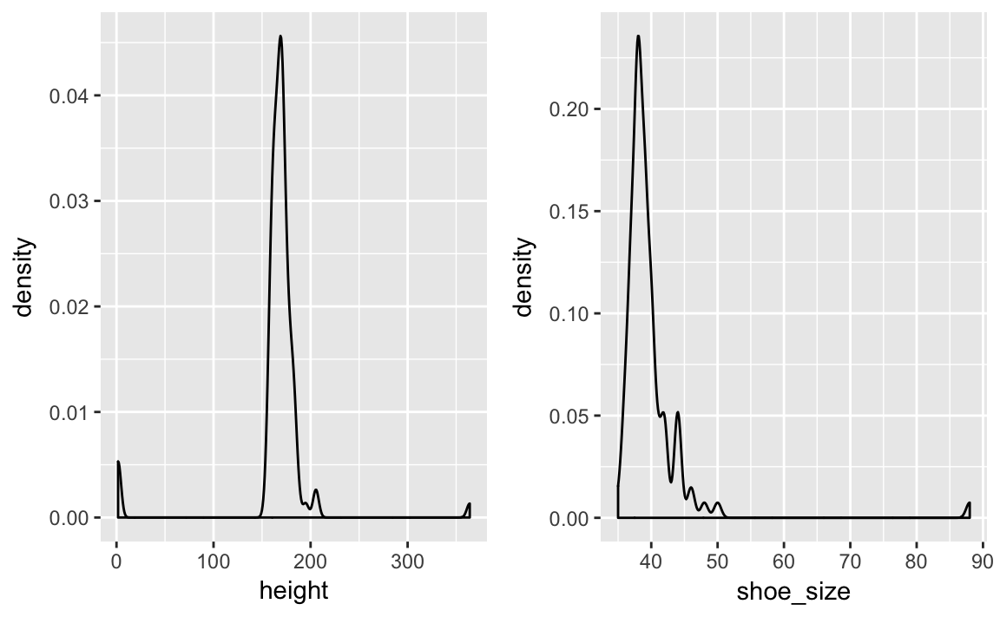

# Daten aufbereiten


<div class="figure" style="text-align: center">

<p class="caption">(\#fig:unnamed-chunk-2)Daten aufbereiten</p>
</div>

In diesem Kapitel benötigte Pakete: 

```r
library(tidyverse)  # Datenjudo
library(corrr)  # Korrelationen berechnen mit der Pfeife
library(stringr)   # Texte bearbeiten
library(car)  # für 'recode'
library(nycflights13)  # Datensatz 'flights'
library(knitr)  # für HTML-Tabellen
library(gridExtra)  # für Mehrfachplots
```


Unter Daten aufbereiten im engeren Sinne ist gemeint, die Daten einer "Grundreinigung" zu unterziehen, dass sie für weitere Analysen in geeigneter Form sind. Daten zusammenfassen meint die deskriptive Statistik; Daten visualisieren ist das Erstellen von Diagrammen. Im Anschluss kann man die Daten modellieren.

Ist das Explorieren von Daten auch nicht statistisch anspruchsvoll, so ist es trotzdem von großer Bedeutung und häufig recht zeitintensiv, vor allem das Daten aufbereiten. Eine Anekdote zur Relevanz der Exploration, die (so will es die Geschichte) mir an einer Bar nach einer einschlägigen Konferenz erzählt wurde (daher keine Quellenangebe, Sie verstehen...). Eine Computerwissenschaftlerin aus den USA (deutschen Ursprungs) hatte einen beeindruckenden "Track Record" an Siegen in Wettkämpfen der Datenanalyse. Tatsächlich hatte sie keine besonderen, raffinierten Modellierungstechniken eingesetzt; klassische Regression war ihre Methode der Wahl. Bei einem Wettkampf, bei dem es darum ging, Krebsfälle aus Krankendaten vorherzusagen (z.B. Röntgenbildern) fand sie nach langem Datenjudo heraus, dass in die "ID-Variablen" Information gesickert war, die dort nicht hingehörte und die sie nutzen konnte für überraschend (aus Sicht der Mitstreiter) gute Vorhersagen zu Krebsfällen. Wie war das möglich? Die Daten stammten aus mehreren Kliniken, jede Klinik verwendete ein anderes System, um IDs für Patienten zu erstellen. Überall waren die IDs stark genug, um die Anonymität der Patienten sicherzustellen, aber gleich wohl konnte man (nach einigem Judo) unterscheiden, welche ID von welcher Klinik stammte. Was das bringt? Einige Kliniken waren reine Screening-Zentren, die die Normalbevölkerung versorgte. Dort sind wenig Krebsfälle zu erwarten. Andere Kliniken jedoch waren Onkologie-Zentren für bereits bekannte Patienten oder für Patienten mit besonderer Risikolage. Wenig überraschen, dass man dann höhere Krebsraten vorhersagen kann. Eigentlich ganz einfach; besondere Mathe steht hier (zumindest in dieser Geschichte) nicht dahinter. Und, wenn man den Trick kennt, ganz einfach. Aber wie so oft ist es nicht leicht, den Trick zu finden. Sorgfältiges Datenjudo hat hier den Schlüssel zum Erfolg gebracht.


## Typische Probleme
Bevor man seine Statistik-Trickkiste so richtig schön aufmachen kann, muss man die Daten häufig erst noch in Form bringen. Das ist nicht schwierig in dem Sinne, dass es um komplizierte Mathe ginge. Allerdings braucht es mitunter recht viel Zeit und ein paar (oder viele) handwerkliche Tricks sind hilfreich. Hier soll das folgende Kapitel helfen.

Mit "Datenjudo" (ein Fachbegriff aus der östlichen Zahlentheorie) ist gemeint, die Daten so "umzuformen", "aufzubereiten", oder "reinigen" , dass sie passend für statistische Analysen sind. 

Typische Probleme, die immer wieder auftreten, sind:

- Fehlende Werte: Irgend jemand hat auf eine meiner schönen Fragen in der Umfrage nicht geantwortet!
- Unerwartete Daten: Auf die Frage, wie viele Facebook-Freunde er oder sie habe, schrieb die Person "I like you a lot". Was tun???
- Daten müssen umgeformt werden: Für jede der beiden Gruppen seiner Studie hat Joachim einen Google-Forms-Fragebogen aufgesetzt. Jetzt hat er zwei Tabellen, die er "verheiraten" möchte. Geht das?
- Neue Spalten berechnen: Ein Student fragt nach der Anzahl der richtigen Aufgaben in der Statistik-Probeklausur. Wir wollen helfen und im entsprechenden Datensatz eine Spalte erzeugen, in der pro Person die Anzahl der richtig beantworteten Fragen steht.


## Daten aufbereiten mit `dplyr`

Es gibt viele Möglichkeiten, Daten mit R aufzubereiten; `dplyr` ist ein populäres Paket dafür. Eine zentrale Idee von `dplyr` ist, dass es nur ein paar wenige Grundbausteine geben sollte, die sich gut kombinieren lassen. Sprich: Wenige grundlegende Funktionen mit eng umgrenzter Funktionalität. Der Autor, Hadley Wickham, sprach einmal in einem Forum (citation needed), dass diese Befehle wenig können, das Wenige aber gut. Ein Nachteil dieser Konzeption kann sein, dass man recht viele dieser Bausteine kombinieren muss, um zum gewünschten Ergebnis zu kommen. Außerdem muss man die Logik des Baukastens gut verstanden habe - die Lernkurve ist also erstmal steiler. Dafür ist man dann nicht darauf angewiesen, dass es irgendwo "Mrs Right" gibt, die genau das kann, so wie ich das will. Außerdem braucht man sich auch nicht viele Funktionen merken. Es reicht einen kleinen Satz an Funktionen zu kennen (die praktischerweise konsistent in Syntax und Methodik sind). 


Willkommen in der Welt von `dyplr`! `dplyr` hat seinen Namen, weil es sich ausschließlich um *D*ataframes bemüht; es erwartet einen Dataframe als Eingabe und gibt einen Dataframe zurück[^3].


Diese Bausteine sind typische Tätigkeiten im Umgang mit Daten; nichts Überraschendes. Schauen wir uns diese Bausteine näher an.


### Zeilen filtern mit `filter`

Häufig will man bestimmte Zeilen aus einer Tabelle filtern. Zum Beispiel man arbeitet für die Zigarettenindustrie und ist nur an den Rauchern interessiert (die im Übrigen unser Gesundheitssystem retten [@kraemer2011wir]), nicht an Nicht-Rauchern; es sollen die nur Umsatzzahlen des letzten Quartals untersucht werden, nicht die vorherigen Quartale; es sollen nur die Daten aus Labor X (nicht Labor Y) ausgewertet werden etc.

Ein Sinnbild:

<div class="figure" style="text-align: center">

<p class="caption">(\#fig:fig-filter)Zeilen filtern</p>
</div>

Merke:

>    Die Funktion `filter` filtert Zeilen aus einem Dataframe.

Schauen wir uns einige Beispiel an; zuerst die Daten laden nicht vergessen. Achtung: "Wohnen" die Daten in einem Paket, muss dieses Paket installiert sein, damit man auf die Daten zugreifen kann.


```r
data(profiles, package = "okcupiddata")  # Das Paket muss installiert sein
```


```r
df_frauen <- filter(profiles, sex == "f")  # nur die Frauen
df_alt <- filter(profiles, age > 70)  # nur die alten
df_alte_frauen <- filter(profiles, age > 70, sex == "f")  # nur die alten Frauen, d.h. UND-Verknüpfung
df_nosmoke_nodrinks <- filter(profiles, smokes == "no" | drinks == "not at all") 
# liefert alle Personen, die Nicht-Raucher *oder* Nicht-Trinker sind
```

Gar nicht so schwer, oder? Allgemeiner gesprochen werden diejenigen Zeilen gefiltert (also behalten bzw. zurückgeliefert), für die das Filterkriterium `TRUE` ist. 


\BeginKnitrBlock{rmdcaution}<div class="rmdcaution">Manche Befehle wie `filter` haben einen Allerweltsnamen; gut möglich, dass ein Befehl mit gleichem Namen in einem anderen (geladenen) Paket existiert. Das kann dann zu Verwirrungen führen - und kryptischen Fehlern. Im Zweifel den Namen des richtigen Pakets ergänzen, und zwar zum Beispiel so: `dplyr::filter(...)`.
</div>\EndKnitrBlock{rmdcaution}

Einige fortgeschrittene Beispiele für `filter`:

Man kann alle Elemente (Zeilen) filtern, die zu einer Menge gehören und zwar mit diesem Operator: `%in%`:


```r
filter(profiles, body_type %in% c("a little extra", "average"))
```

Besonders Textdaten laden zu einigen Extra-Überlegungen ein; sagen wir, wir wollen alle Personen filtern, die Katzen bei den Haustieren erwähnen. Es soll reichen, wenn `cat` ein Teil des Textes ist; also `likes dogs and likes cats` wäre OK (soll gefiltert werden). Dazu nutzen wir ein Paket zur Bearbeitung von Strings (Textdaten):


```r

filter(profiles, str_detect(pets, "cats"))
```


Ein häufiger Fall ist, Zeilen *ohne* fehlende Werte (`NA`s) zu filtern. Das geht einfach:


```r
profiles_keine_nas <- na.omit(profiles)

```

Aber was ist, wenn wir nur bei bestimmten Spalten wegen fehlender Werte besorgt sind? Sagen wir bei `income` und bei `sex`:


```r
filter(profiles, !is.na(income) | !is.na(sex))
```

### Spalten wählen mit `select`

Das Gegenstück zu `filter` ist `select`; dieser Befehl liefert die gewählten Spalten zurück. Das ist häufig praktisch, wenn der Datensatz sehr "breit" ist, also viele Spalten enthält. Dann kann es übersichtlicher sein, sich nur die relevanten auszuwählen. Das Sinnbild für diesen Befehl:

<div class="figure" style="text-align: center">

<p class="caption">(\#fig:fig-select, select_schema)Spalten auswählen</p>
</div>


Merke:

>    Die Funktion select wählt Spalten aus einem Dataframe aus.


```r
if (!file.exists("./data/test_inf_short.csv")) {
  stats_test <- read.csv("https://sebastiansauer.github.io/data/test_inf_short.csv") 
} else {
  stats_test <- read.csv("./data/test_inf_short.csv")
}
```

Hier haben wir erst geprüft, ob die Datei `test_inf_short.csv` existiert; falls nein, laden wir sie herunter. Andernfalls lesen wir sie aus dem lokalen Verzeichnis.


```r
select(stats_test, score)  # Spalte `score` auswählen
select(stats_test, score, study_time)  # Splaten `score` und `study_time` auswählen
select(stats_test, score:study_time) # dito
select(stats_test, 5:6) Spalten 5 bis 6 auswählen
```

Tatsächlich ist der Befehl `select` sehr flexibel; es gibt viele Möglichkeiten, Spalten auszuwählen. Im `dplyr`-Cheatsheet findet sich ein guter Überblick dazu [^4].


### Zeilen sortieren mit `arrange`

Man kann zwei Arten des Umgangs mit R unterscheiden: Zum einen der "interaktive Gebrauch" und zum anderen "richtiges Programmieren". Im interaktiven Gebrauch geht es uns darum, die Fragen zum aktuell vorliegenden Datensatz (schnell) zu beantworten. Es geht nicht darum, eine allgemeine Lösung zu entwickeln, die wir in die Welt verschicken können und die dort ein bestimmtes Problem löst, ohne dass der Entwickler (wir) dabei Hilfestellung geben muss. "Richtige" Software, wie ein R-Paket oder Microsoft Powerpoint, muss diese Erwartung erfüllen; "richtiges Programmieren" ist dazu vonnöten. Natürlich sind in diesem Fall die Ansprüche an die Syntax (der "Code", hört sich cooler an) viel höher. In dem Fall muss man alle Eventualitäten voraussehen und sicherstellen, dass das Programm auch beim merkwürdigsten Nutzer brav seinen Dienst tut. Wir haben hier, beim interaktiven Gebrauch, niedrigere Ansprüche bzw. andere Ziele. 

Beim interaktiven Gebrauch von R (oder beliebigen Analyseprogrammen) ist das Sortieren von Zeilen eine recht häufige Tätigkeit. Typisches Beispiel wäre der Lehrer, der eine Tabelle mit Noten hat und wissen will, welche Schüler die schlechtesten oder die besten sind in einem bestimmten Fach. Oder bei der Prüfung der Umsätze nach Filialen möchten wir die umsatzstärksten sowie -schwächsten Niederlassungen kennen. 

Ein R-Befehl hierzu ist `arrange`; einige Beispiele zeigen die Funktionsweise am besten:


```r

arrange(stats_test, score)  %>% head() # liefert die *schlechtesten* Noten zurück
#>     X                 V_1 study_time self_eval interest score
#> 1 234 23.01.2017 18:13:15          3         1        1    17
#> 2   4 06.01.2017 09:58:05          2         3        2    18
#> 3 131 19.01.2017 18:03:45          2         3        4    18
#> 4 142 19.01.2017 19:02:12          3         4        1    18
#> 5  35 12.01.2017 19:04:43          1         2        3    19
#> 6  71 15.01.2017 15:03:29          3         3        3    20
arrange(stats_test, -score) %>% head() # liefert die *besten* Noten zurück
#>    X                 V_1 study_time self_eval interest score
#> 1  3 05.01.2017 23:33:47          5        10        6    40
#> 2  7 06.01.2017 14:25:49         NA        NA       NA    40
#> 3 29 12.01.2017 09:48:16          4        10        3    40
#> 4 41 13.01.2017 12:07:29          4        10        3    40
#> 5 58 14.01.2017 15:43:01          3         8        2    40
#> 6 83 16.01.2017 10:16:52         NA        NA       NA    40
arrange(stats_test, interest, score) %>% head()
#>     X                 V_1 study_time self_eval interest score
#> 1 234 23.01.2017 18:13:15          3         1        1    17
#> 2 142 19.01.2017 19:02:12          3         4        1    18
#> 3 221 23.01.2017 11:40:30          1         1        1    23
#> 4 230 23.01.2017 16:27:49          1         1        1    23
#> 5  92 17.01.2017 17:18:55          1         1        1    24
#> 6 107 18.01.2017 16:01:36          3         2        1    24
```


Einige Anmerkungen. Die generelle Syntax lautet `arrange(df, Spalte1, ...)`, wobei `df` den Dataframe bezeichnet und `Spalte1` die erste zu sortierende Spalte; die Punkte `...` geben an, dass man weitere Parameter übergeben kann. Am wichtigsten ist hier, dass man weitere Spalten übergeben kann. Dazu gleich mehr.

Standardmäßig sortiert `arrange` *aufsteigend*  (weil kleine Zahlen im Zahlenstrahl vor den großen Zahlen kommen). Möchte man diese Reihenfolge umdrehen (große Werte zuert), so kann man ein Minuszeichen vor den Namen der Spalte setzen.

Gibt man *zwei oder mehr* Spalten an, so werden pro Wert von `Spalte1` die Werte von `Spalte2` sortiert etc; man betrachte den Output des Beispiels oben dazu.

Aber was heißt dieses komisch Symbol:  `%>%`? Diese sogenannte "Pfeife" lässt sich mit "und dann" ins Deutshce übersetzen. Also:

```
sortiere(diese_Tabelle, nach_dieser_Spalte) UND DANN zeig_die_ersten_Zeilen
```

Der Befehl `head` zeigt dier ersten paar Zeilen eines Dataframes [^5].


Merke:

>    Die Funktion arrange sortiert die Zeilen eines Datafames.

Ein Sinnbild zur Verdeutlichung:

<div class="figure" style="text-align: center">

<p class="caption">(\#fig:fig-arrange)Spalten sortieren</p>
</div>


Ein ähnliches Ergebnis erhält mit man `top_n()`, welches die `n` *größten* *Ränge* widergibt:


```r

top_n(stats_test, 3)
#>      X                 V_1 study_time self_eval interest score
#> 1    3 05.01.2017 23:33:47          5        10        6    40
#> 2    7 06.01.2017 14:25:49         NA        NA       NA    40
#> 3   29 12.01.2017 09:48:16          4        10        3    40
#> 4   41 13.01.2017 12:07:29          4        10        3    40
#> 5   58 14.01.2017 15:43:01          3         8        2    40
#> 6   83 16.01.2017 10:16:52         NA        NA       NA    40
#> 7  116 18.01.2017 23:07:32          4         8        5    40
#> 8  119 19.01.2017 09:05:01         NA        NA       NA    40
#> 9  132 19.01.2017 18:22:32         NA        NA       NA    40
#> 10 175 20.01.2017 23:03:36          5        10        5    40
#> 11 179 21.01.2017 07:40:05          5         9        1    40
#> 12 185 21.01.2017 15:01:26          4        10        5    40
#> 13 196 22.01.2017 13:38:56          4        10        5    40
#> 14 197 22.01.2017 14:55:17          4        10        5    40
#> 15 248 24.01.2017 16:29:45          2        10        2    40
#> 16 249 24.01.2017 17:19:54         NA        NA       NA    40
#> 17 257 25.01.2017 10:44:34          2         9        3    40
#> 18 306 27.01.2017 11:29:48          4         9        3    40
top_n(stats_test, 3, interest)
#>     X                 V_1 study_time self_eval interest score
#> 1   3 05.01.2017 23:33:47          5        10        6    40
#> 2   5 06.01.2017 14:13:08          4         8        6    34
#> 3  43 13.01.2017 14:14:16          4         8        6    36
#> 4  65 15.01.2017 12:41:27          3         6        6    22
#> 5 110 18.01.2017 18:53:02          5         8        6    37
#> 6 136 19.01.2017 18:22:57          3         1        6    39
#> 7 172 20.01.2017 20:42:46          5        10        6    34
#> 8 214 22.01.2017 21:57:36          2         6        6    31
#> 9 301 27.01.2017 08:17:59          4         8        6    33
```

Gibt man *keine* Spalte an, so bezieht sich `top_n` auf die letzte Spalte im Datensatz.

Da sich hier mehrere Personen den größten Rang (Wert 40) teilen, bekommen wir *nicht* 3 Zeilen zurückgeliefert, sondern entsprechend mehr.


### Datensatz gruppieren mit `group_by`

Einen Datensatz zu gruppieren ist ebenfalls eine häufige Angelegenheit: Was ist der mittlere Umsatz in Region X im Vergleich zu Region Y? Ist die Reaktionszeit in der Experimentalgruppe kleiner als in der Kontrollgruppe? Können Männer schneller ausparken als Frauen? Man sieht, dass das Gruppieren v.a. in Verbindung mit Mittelwerten oder anderen Zusammenfassungen sinnvol ist; dazu im nächsten Abschnitt mehr.

<div class="figure" style="text-align: center">

<p class="caption">(\#fig:fig-groupby)Datensätze nach Subgruppen aufteilen</p>
</div>

In der Abbildung wurde der Datensatz anhand der Spalte `Fach` in mehrere Gruppen geteilt. Wir könnten uns als nächstes z.B. Mittelwerte pro Fach - d.h. pro Gruppe (pro Ausprägung von `Fach`) - ausgeben lassen; in diesem Fall vier Gruppen (Fach A bis D).


```r
test_gruppiert <- group_by(stats_test, interest)
test_gruppiert
#> Source: local data frame [306 x 6]
#> Groups: interest [7]
#> 
#>       X                 V_1 study_time self_eval interest score
#>   <int>              <fctr>      <int>     <int>    <int> <int>
#> 1     1 05.01.2017 13:57:01          5         8        5    29
#> 2     2 05.01.2017 21:07:56          3         7        3    29
#> 3     3 05.01.2017 23:33:47          5        10        6    40
#> # ... with 303 more rows
```

Schaut man sich nun den Datensatz an, sieht man erstmal wenig Effekt der Gruppierung. R teilt uns lediglich mit `Groups: interest [7]`, dass es die Gruppen gibt, aber es gibt keine extra Spalte oder sonstige Anzeichen der Gruppierung. Aber keine Sorge, wenn wir gleich einen Mittelwert ausrechnen, bekommen wir den Mittelwert pro Gruppe!


Merke:

>    Mit group_by teilt man einen Datensatz in Gruppen ein, entsprechend der Werte einer mehrerer Spalten.


### Eine Spalte zusammenfassen mit `summarise`

Vielleicht die wichtigste oder häufigte Tätigkeit in der Analyse von Daten ist es, eine Spalte zu *einem* Wert zusammenzufassen. Anders gesagt: Einen Mittelwert berechnen, den größten (kleinsten) Wert heraussuchen, die Korrelation berechnen oder eine beliebige andere Statistik ausgeben lassen. Die Gemeinsamkeit dieser Operaitonen ist, dass sie eine Spalte zu einem Wert zusammenfassen, "aus Spalte mach Zahl", sozusagen. Daher ist der Name des Befehls `summarise` ganz passend. Genauer gesagt fasst dieser Befehl eine Spalte zu einer Zahl zusammen *anhand* einer Funktion wie `mean` oder `max`. Hierbei ist jede Funktion erlaubt, die eine Spalte als Input verlangt und eine Zahl zurückgibt; andere Funktionen sind bei `summarise` nicht erlaubt. 

<div class="figure" style="text-align: center">

<p class="caption">(\#fig:fig-summarise)Spalten zu einer Zahl zusammenfassen</p>
</div>


```r
summarise(stats_test, mean(score))
#>   mean(score)
#> 1        31.1
```

Man könnte diesen Befehl so ins Deutsche übersetzen: `Fasse aus Tabelle stats_test die Spalte score anhand des Mittelwerts zusammen`. Nicht vergessen, wenn die Spalte `score` fehlende Werte hat, wird der Befehl `mean` standardmäßig dies mit `NA` quittieren.

Jetzt können wir auch die Gruppierung nutzen:

```r
test_gruppiert <- group_by(stats_test, interest)
summarise(test_gruppiert, mean(score))
#> # A tibble: 7 × 2
#>   interest `mean(score)`
#>      <int>         <dbl>
#> 1        1          28.3
#> 2        2          29.7
#> 3        3          30.8
#> # ... with 4 more rows
```

Der Befehl `summarise` erkennt also, wenn eine (mit `group_by`) gruppierte Tabelle vorliegt. Jegliche Zusammenfassung, die wir anfordern, wird anhand der Gruppierungsinformation aufgeteilt werden. In dem Beispiel bekommen wir einen Mittelwert für jeden Wert von `interest`. Interessanterweise sehen wir, dass der Mittelwert tendenziell größer wird, je größer `interest` wird.

Alle diese `dplyr`-Befehle geben einen Dataframe zurück, was praktisch ist für weitere Verarbeitung. In diesem Fall heißen die Spalten `interst` und `mean(score)`. Zweiter Name ist nicht so schön, daher ändern wir den wie folgt:

Jetzt können wir auch die Gruppierung nutzen:

```r
test_gruppiert <- group_by(stats_test, interest)
summarise(test_gruppiert, mw_pro_gruppe = mean(score, na.rm = TRUE))
#> # A tibble: 7 × 2
#>   interest mw_pro_gruppe
#>      <int>         <dbl>
#> 1        1          28.3
#> 2        2          29.7
#> 3        3          30.8
#> # ... with 4 more rows
```

Nun heißt die zweite Spalte `mw_pro_Gruppe`. `na.rm = TRUE` veranlasst, bei fehlenden Werten trotzdem einen Mittelwert zurückzuliefern (die Zeilen mit fehlenden Werten werden in dem Fall ignoriert).

Grundsätzlich ist die Philosophie der `dplyr`-Befehle: "Mach nur eine Sache, aber die dafür gut". Entsprechend kann `summarise` nur *Spalten* zusammenfassen, aber keine *Zeilen*.

Merke:

>    Mit summarise kann man eine Spalte eines Dataframes zu einem Wert zusammenfassen.


### Zeilen zählen mit `n` und `count`
Ebenfalls nützlich ist es, Zeilen zu zählen. Im Gegensatz zum Standardbefehle `nrow` versteht der `dyplr`-Befehl `n`auch Gruppierungen. `n` darf nur innerhalb von `summarise` oder ähnlichen `dplyr`-Befehlen verwendet werden.


```r
summarise(stats_test, n())
#>   n()
#> 1 306
summarise(test_gruppiert, n())
#> # A tibble: 7 × 2
#>   interest `n()`
#>      <int> <int>
#> 1        1    30
#> 2        2    47
#> 3        3    66
#> # ... with 4 more rows
nrow(stats_test)
#> [1] 306
```

Außerhalb von gruppierten Datensätzen ist `nrow` meist praktischer.


Praktischer ist der Befehl `count`, der nichts anderes ist als die Hintereinanderschaltung von `group_by` und `n`. Mit `count` zählen wir die Häufigkeiten nach Gruppen; Gruppen sind hier zumeist die Werte einer auszuzählenden Variablen (oder mehrerer auszuzählender Variablen). Das macht `count` zu einem wichtigen Helfer bei der Analyse von Häufigkeitsdaten.


```r
dplyr::count(stats_test, interest)
#> # A tibble: 7 × 2
#>   interest     n
#>      <int> <int>
#> 1        1    30
#> 2        2    47
#> 3        3    66
#> # ... with 4 more rows
dplyr::count(stats_test, study_time)
#> # A tibble: 6 × 2
#>   study_time     n
#>        <int> <int>
#> 1          1    31
#> 2          2    49
#> 3          3    85
#> 4          4    56
#> 5          5    17
#> 6         NA    68
dplyr::count(stats_test, interest, study_time)
#> Source: local data frame [29 x 3]
#> Groups: interest [?]
#> 
#>   interest study_time     n
#>      <int>      <int> <int>
#> 1        1          1    12
#> 2        1          2     7
#> 3        1          3     8
#> # ... with 26 more rows
```

Allgemeiner formuliert lautet die Syntax: `count(df, Spalte1, ...)`, wobei `df` der Dataframe ist und `Spalte1` die erste (es können mehrere sein) auszuzählende Spalte. Gibt man z.B. zwei Spalten an, so wird pro Wert der 1. Spalte die Häufigkeiten der 2. Spalte ausgegeben.

Merke:

>    n und count zählen die Anzahl der Zeilen, d.h. die Anzahl der Fälle. 


### Die Pfeife
Die zweite Idee kann man salopp als "Durchpfeifen" bezeichnen; ikonographisch mit diesem Symbol dargestellt ` %>% `[^6]. Der Begriff "Durchpfeifen" ist frei vom Englischen "to pipe" übernommen. Hierbei ist gemeint, einen Datensatz sozusagen auf ein Fließband zu legen und an jedem Arbeitsplatz einen Arbeitsschritt auszuführen. Der springende Punkt ist, dass ein Dataframe als "Rohstoff" eingegeben wird und jeder Arbeitsschritt seinerseits wieder einen Datafram ausgiebt. Damit kann man sehr schön, einen "Flow" an Verarbeitung erreichen, außerdem spart man sich Tipparbeit und die Syntax wird lesbarer. Damit das Durchpfeifen funktioniert, benötigt man Befehle, die als Eingabe einen Dataframe erwarten und wieder einen Dataframe zurückliefern. Das Schaubild verdeutlich beispielhaft eine Abfolge des Durchpfeifens.


<div class="figure" style="text-align: center">

<p class="caption">(\#fig:fig-durchpreifen)Das 'Durchpeifen'</p>
</div>

Die sog. "Pfeife" (pipe: ` %>% `) in Anspielung an das berühmte Bild von René Magritte, verkettet Befehle hintereinander. Das ist praktisch, da es die Syntax vereinfacht. Vergleichen Sie mal diese Syntax


```r
filter(summarise(group_by(filter(stats_test, !is.na(score)), interest), mw = mean(score)), mw > 30)
```

mit dieser

```r
stats_test %>% 
  filter(!is.na(score)) %>% 
  group_by(interest) %>% 
  summarise(mw = mean(score)) %>% 
  filter(mw > 30)
#> # A tibble: 4 × 2
#>   interest    mw
#>      <int> <dbl>
#> 1        3  30.8
#> 2        5  32.5
#> 3        6  34.0
#> 4       NA  33.1
```

Es ist hilfreich, diese "Pfeifen-Syntax" in deutschen Pseudo-Code zu übersetzen.


\BeginKnitrBlock{rmdpseudocode}<div class="rmdpseudocode">Nimm die Tabelle "stats_test" UND DANN  
filtere alle nicht-fehlenden Werte UND DANN  
gruppiere die verbleibenden Werte nach "interest" UND DANN  
bilde den Mittelwert (pro Gruppe) für "score" UND DANN  
liefere nur die Werte größer als 30 zurück.  
</div>\EndKnitrBlock{rmdpseudocode}


Die Pfeife zerlegt die "russische Puppe", also ineinander verschachelteten Code, in sequenzielle Schritte und zwar in der richtigen Reihenfolge (entsprechend der Abarbeitung). Wir müssen den Code nicht mehr von innen nach außen lesen (wie das bei einer mathematischen Formel der Fall ist), sondern können wie bei einem Kochrezept "erstens ..., zweitens .., drittens ..." lesen. Die Pfeife macht die Syntax einfacher. Natürlich hätten wir die verschachtelte Syntax in viele einzelne Befehle zerlegen können und jeweils eine Zwischenergebnis speichern mit dem Zuweisungspfeil `<-` und das Zwischenergebnis dann explizit an den nächsten Befehl weitergeben. Eigentlich macht die Pfeife genau das - nur mit weniger Tipparbeit. Und auch einfacher zu lesen. Flow!


#### Werte umkodieren und "binnen" mit `car::recode`

Manchmal möchte man z.B. negativ gepolte Items umdrehen oder bei kategoriellen Variablen kryptische Bezeichnungen in sprechendere umwandeln (ein Klassiker ist `1` in `maennlich` bzw. `2` in `weiblich` oder umgekehrt, kann sich niemand merken). Hier gibt es eine Reihe praktischer Befehle, z.B. `recode` aus dem Paket `car`. Übrigens: Wenn man explizit angeben möchte, aus welchem Paket ein Befehl stammt (z.B. um Verwechslungen zu vermeiden), gibt man `Paketnamen::Befehlnamen` an. Schauen wir uns ein paar Beispiele zum Umkodieren an.


```r

stats_test$score_fac <- car::recode(stats_test$study_time, "5 = 'sehr viel'; 2:4 = 'mittel'; 1 = 'wenig'", as.factor.result = TRUE)
stats_test$score_fac <- car::recode(stats_test$study_time, "5 = 'sehr viel'; 2:4 = 'mittel'; 1 = 'wenig'", as.factor.result = FALSE)

stats_test$study_time <- car::recode(stats_test$study_time, "5 = 'sehr viel'; 4 = 'wenig'; else = 'Hilfe'", as.factor.result = TRUE)

head(stats_test$study_time)
#> [1] sehr viel Hilfe     sehr viel Hilfe     wenig     Hilfe    
#> Levels: Hilfe sehr viel wenig
```

Der Befehle `recode` ist wirklich sehr prkatisch; mit `:` kann man "von bis" ansprechen (das ginge mit `c()` übrigens auch); `else` für "ansonsten" ist möglich und mit `as.factor.result` kann man entweder einen Faktor oder eine Text-Variable zurückgeliefert bekommen. Der ganze "Wechselterm" steht in Anführungsstrichen (`"`). Einzelne Teile des Wechselterms sind mit einem Strichpunkt (`;`) voneinander getrennt.


Das klassiche Umkodieren von Items aus Fragebögen kann man so anstellen; sagen wir `interest` soll umkodiert werden:


```r
stats_test$no_interest <- car::recode(stats_test$interest, "1 = 6; 2 = 5; 3 = 4; 4 = 3; 5 = 2; 6 = 1; else = NA")
glimpse(stats_test$no_interest)
#>  num [1:306] 2 4 1 5 1 NA NA 4 2 2 ...
```

Bei dem Wechselterm muss man aufpassen, nichts zu verwechseln; die Zahlen sehen alle ähnlich aus...

Testen kann man den Erfolg des Umpolens mit


```r
dplyr::count(stats_test, interest)
#> # A tibble: 7 × 2
#>   interest     n
#>      <int> <int>
#> 1        1    30
#> 2        2    47
#> 3        3    66
#> # ... with 4 more rows
dplyr::count(stats_test, no_interest)
#> # A tibble: 7 × 2
#>   no_interest     n
#>         <dbl> <int>
#> 1           1     9
#> 2           2    45
#> 3           3    41
#> # ... with 4 more rows
```

Scheint zu passen. Noch praktischer ist, dass man so auch numerische Variablen in Bereiche aufteilen kann ("binnen"):


```r
stats_test$Ergebnis <- car::recode(stats_test$score, "1:38 = 'durchgefallen'; else = 'bestanden'")
```


Natürlich gibt es auch eine Pfeifen komptatible Version, um Variablen umzukodieren bzw. zu binnen: `dplyr::recode`[^7]. Die Syntax ist allerdings etwas weniger komfortabel (da strenger), so dass wir an dieser Stelle bei `car::recode` bleiben.


## Fallstudie `nycflights13`
Schauen wir uns einige Beispiele der Datenaufbereitung mittels `dplyr` an. Wir verwenden hier den Datensatz `flights`aus dem Package `nycflights13`. Der Datensatz ist recht groß (~300.000 Zeilen und 19 Spalten); wenn man ihn als Excel importiert, kann eine alte Möhre von Computer schon in die Knie gehen. Beim Import als CSV habe ich noch nie von Problemen gehört; beim Import via Package ebenfalls nicht. Werfen wir einen ersten Blick in die Daten:


```r
data(flights)
glimpse(flights)
#> Observations: 336,776
#> Variables: 19
#> $ year           <int> 2013, 2013, 2013, 2013, 2013, 2013, 2013, 2013,...
#> $ month          <int> 1, 1, 1, 1, 1, 1, 1, 1, 1, 1, 1, 1, 1, 1, 1, 1,...
#> $ day            <int> 1, 1, 1, 1, 1, 1, 1, 1, 1, 1, 1, 1, 1, 1, 1, 1,...
#> $ dep_time       <int> 517, 533, 542, 544, 554, 554, 555, 557, 557, 55...
#> $ sched_dep_time <int> 515, 529, 540, 545, 600, 558, 600, 600, 600, 60...
#> $ dep_delay      <dbl> 2, 4, 2, -1, -6, -4, -5, -3, -3, -2, -2, -2, -2...
#> $ arr_time       <int> 830, 850, 923, 1004, 812, 740, 913, 709, 838, 7...
#> $ sched_arr_time <int> 819, 830, 850, 1022, 837, 728, 854, 723, 846, 7...
#> $ arr_delay      <dbl> 11, 20, 33, -18, -25, 12, 19, -14, -8, 8, -2, -...
#> $ carrier        <chr> "UA", "UA", "AA", "B6", "DL", "UA", "B6", "EV",...
#> $ flight         <int> 1545, 1714, 1141, 725, 461, 1696, 507, 5708, 79...
#> $ tailnum        <chr> "N14228", "N24211", "N619AA", "N804JB", "N668DN...
#> $ origin         <chr> "EWR", "LGA", "JFK", "JFK", "LGA", "EWR", "EWR"...
#> $ dest           <chr> "IAH", "IAH", "MIA", "BQN", "ATL", "ORD", "FLL"...
#> $ air_time       <dbl> 227, 227, 160, 183, 116, 150, 158, 53, 140, 138...
#> $ distance       <dbl> 1400, 1416, 1089, 1576, 762, 719, 1065, 229, 94...
#> $ hour           <dbl> 5, 5, 5, 5, 6, 5, 6, 6, 6, 6, 6, 6, 6, 6, 6, 5,...
#> $ minute         <dbl> 15, 29, 40, 45, 0, 58, 0, 0, 0, 0, 0, 0, 0, 0, ...
#> $ time_hour      <dttm> 2013-01-01 05:00:00, 2013-01-01 05:00:00, 2013...
```

Der Befehl `data` lädt Daten aus einem zuvor gestarteten Paket. 

Achtung, Fallstudie. Sie sind der/die Assistent_in des Chefs der New Yorker Flughäfen. Ihr Chef kommt gut gelaunt ins Büro und sagt, dass er diesen Schnarchnasen einheizen wolle und sagt, sie sollen ihm mal schnell die Flüge mit der größten Verspätung raussuchen. Nix schickes, aber zacki-zacki...


```r
flights %>% 
  arrange(arr_delay)
#> # A tibble: 336,776 × 19
#>    year month   day dep_time sched_dep_time dep_delay arr_time
#>   <int> <int> <int>    <int>          <int>     <dbl>    <int>
#> 1  2013     5     7     1715           1729       -14     1944
#> 2  2013     5    20      719            735       -16      951
#> 3  2013     5     2     1947           1949        -2     2209
#> # ... with 3.368e+05 more rows, and 12 more variables:
#> #   sched_arr_time <int>, arr_delay <dbl>, carrier <chr>, flight <int>,
#> #   tailnum <chr>, origin <chr>, dest <chr>, air_time <dbl>,
#> #   distance <dbl>, hour <dbl>, minute <dbl>, time_hour <dttm>
```

Hm, übersichtlicher wäre es wahrscheinllich, wenn wir weniger Spalten anschauen müssten. Am besten neben der Verspätung nur die Information, die wir zur Identifizierung der Schuldigen... will sagen der gesuchten Flüge benötigen


```r
flights %>% 
  arrange(arr_delay) %>% 
  select(arr_delay, carrier, month, day, dep_time, tailnum, flight, dest)
#> # A tibble: 336,776 × 8
#>   arr_delay carrier month   day dep_time tailnum flight  dest
#>       <dbl>   <chr> <int> <int>    <int>   <chr>  <int> <chr>
#> 1       -86      VX     5     7     1715  N843VA    193   SFO
#> 2       -79      VX     5    20      719  N840VA     11   SFO
#> 3       -75      UA     5     2     1947  N851UA    612   LAX
#> # ... with 3.368e+05 more rows
```

Da Zahlen in ihrer natürlichen Form von klein nach groß sortiert sind, sortiert `arrange` in ebendieser Richtung. Wir können das umdrehen mit einem Minuszeichen vor der zu sortierenden Spalte:


```r
flights %>% 
  arrange(-arr_delay) %>% 
  select(arr_delay, carrier, month, day, dep_time, tailnum, flight, dest)
#> # A tibble: 336,776 × 8
#>   arr_delay carrier month   day dep_time tailnum flight  dest
#>       <dbl>   <chr> <int> <int>    <int>   <chr>  <int> <chr>
#> 1      1272      HA     1     9      641  N384HA     51   HNL
#> 2      1127      MQ     6    15     1432  N504MQ   3535   CMH
#> 3      1109      MQ     1    10     1121  N517MQ   3695   ORD
#> # ... with 3.368e+05 more rows
```

Eine kleine Zugabe: Mit dem Befehl `knitr::kable` kann man einen Dateframe automatisch in eine (einigermaßen) schöne Tabelle ausgeben lassen. Oh halt, wir wollen keine Tabelle mit 300.000 Zeilen (der Chef ist kein Freund von Details). Also begrenzen wir die Ausgabe auf die ersten 10 Plätze.


```r
flights %>% 
  arrange(-arr_delay) %>% 
  select(arr_delay, carrier, month, day, dep_time, tailnum, flight, dest) %>% 
  filter(row_number() < 11) %>% 
  kable()
```


 arr_delay  carrier    month   day   dep_time  tailnum    flight  dest 
----------  --------  ------  ----  ---------  --------  -------  -----
      1272  HA             1     9        641  N384HA         51  HNL  
      1127  MQ             6    15       1432  N504MQ       3535  CMH  
      1109  MQ             1    10       1121  N517MQ       3695  ORD  
      1007  AA             9    20       1139  N338AA        177  SFO  
       989  MQ             7    22        845  N665MQ       3075  CVG  
       931  DL             4    10       1100  N959DL       2391  TPA  
       915  DL             3    17       2321  N927DA       2119  MSP  
       895  DL             7    22       2257  N6716C       2047  ATL  
       878  AA            12     5        756  N5DMAA        172  MIA  
       875  MQ             5     3       1133  N523MQ       3744  ORD  

"Geht doch", war die Antwort des Chefs, als sie die Tabelle rübergeben (er mag auch keine Emails). "Ach ja", raunt der Chef, als Sie das Zimmer verlassen wollen, "hatte ich erwähnt, dass ich die gleiche Auswertung für jeden Carrier brauche? Reicht bis in einer halben Stunde".

Wir gruppieren also den Datensatz nach der Fluggesellschaft (`carrier`) und filtern dann  die ersten 3 Zeilen (damit die Tabelle für den Chef nicht zu groß wird). Wie jeder `dplyr`-Befehl wird die vorherige Gruppierung berücksichtigt und daher die Top-3-Zeilen *pro Gruppe*, d.h. pro Fluggesellschaft, ausgegeben.


```r
flights %>% 
  arrange(-arr_delay) %>% 
  select(arr_delay, carrier, month, day, dep_time, tailnum, flight, dest) %>% 
  group_by(carrier) %>% 
  filter(row_number() < 4) 
#> Source: local data frame [48 x 8]
#> Groups: carrier [16]
#> 
#>   arr_delay carrier month   day dep_time tailnum flight  dest
#>       <dbl>   <chr> <int> <int>    <int>   <chr>  <int> <chr>
#> 1      1272      HA     1     9      641  N384HA     51   HNL
#> 2      1127      MQ     6    15     1432  N504MQ   3535   CMH
#> 3      1109      MQ     1    10     1121  N517MQ   3695   ORD
#> # ... with 45 more rows
```

Vielleicht gefällt dem Chef diese Darstellung (sortiert nach `carrier`) besser:


```r
flights %>% 
  arrange(-arr_delay) %>% 
  select(arr_delay, carrier, month, day, dep_time, tailnum, flight, dest) %>% 
  group_by(carrier) %>% 
  filter(row_number() < 4) %>% 
  arrange(carrier)
#> Source: local data frame [48 x 8]
#> Groups: carrier [16]
#> 
#>   arr_delay carrier month   day dep_time tailnum flight  dest
#>       <dbl>   <chr> <int> <int>    <int>   <chr>  <int> <chr>
#> 1       744      9E     2    16      757  N8940E   3798   CLT
#> 2       458      9E     7    24     1525  N927XJ   3538   MSP
#> 3       421      9E     7    10     2054  N937XJ   3325   DFW
#> # ... with 45 more rows
```

Da Sie den Chef gut kennen, berechnen Sie gleich noch die durchschnittliche Verspätung pro Fluggesellschaft.


```r
flights %>% 
  select(arr_delay, carrier, month, day, dep_time, tailnum, flight, dest) %>% 
  group_by(carrier) %>% 
  summarise(delay_mean = mean(arr_delay, na.rm = TRUE)) %>% 
  arrange(-delay_mean) %>% 
  kable()
```


carrier    delay_mean
--------  -----------
F9             21.921
FL             20.116
EV             15.796
YV             15.557
OO             11.931
MQ             10.775
WN              9.649
B6              9.458
9E              7.380
UA              3.558
US              2.130
VX              1.764
DL              1.644
AA              0.364
HA             -6.915
AS             -9.931

Der Chef ist zufrieden. Sie können sich wieder wichtigeren Aufgaben zuwenden...


## Checkliste zum Datenjudo
Fassen wir einige wesentliche Arbeitsschritte der Datenaufbereitung zusammen[^10].

### Auf fehlende Werte prüfen* 
Das geht recht einfach mit `summarise(meine_daten)`. Der Befehl liefert für jede Spalte die Anzahl der fehlenden Werte zurück.


```r
wo_men <- read.csv("https://sebastiansauer.github.io/data/wo_men.csv")
summary(wo_men)
#>                   time       sex         height      shoe_size   
#>  11.10.2016 12:31:59: 2   man  :18   Min.   :  2   Min.   :35.0  
#>  11.10.2016 12:32:10: 2   woman:82   1st Qu.:163   1st Qu.:38.0  
#>  11.10.2016 12:32:32: 2   NA's : 1   Median :168   Median :39.0  
#>  11.10.2016 12:32:33: 2              Mean   :165   Mean   :39.8  
#>  11.10.2016 12:32:42: 2              3rd Qu.:174   3rd Qu.:40.0  
#>  04.10.2016 17:58:51: 1              Max.   :364   Max.   :88.0  
#>  (Other)            :90              NA's   :1     NA's   :1
```

### Fälle mit fehlenden Werte löschen
Weist eine Variable (Spalte) "wenig" fehlende Werte auf, so kann es schlau sein, nichts zu tun. Eine andere Möglichkeit besteht darin, alle entsprechenden Zeilen zu löschen. Man sollte aber schauen, wie viele Zeilen dadurch verloren gehen.


```r
nrow(wo_men)
#> [1] 101
wo_men %>% 
  na.omit %>% 
  nrow
#> [1] 100
```

Hier verlieren wir nur 1 Zeile, das verschmerzen wir. Welche eigentlich?

```r
wo_men %>% 
  rownames_to_column %>%  # Zeilennummer werden eine eigene Spalte
  filter(!complete.cases(.))  # Nur die nicht-kompletten Fälle filtern
#>   rowname                time  sex height shoe_size
#> 1      86 11.10.2016 12:44:06 <NA>     NA        NA
```

Man beachte, dass der Punkt `.` für den Datensatz steht, wie er vom letzten Schritt weitergegeben wurde. Natürlich könnten wir diesen Datensatz jetzt als neues Objekt speichern und damit weiter arbeiten.

### Fehlende Werte ggf. ersetzen  
Ist die Anzahl der fehlenden Werte zu groß, als dass wir es verkraften könnten, die Zeilen zu löschen, so können wir die fehlenden Werte ersetzen. Allein, das ist ein weites Feld und übersteigt den Anspruch dieses Kurses[^9]. Eine einfache, aber nicht die beste Möglichkeit, besteht darin, die fehlenden Werte durch einen repräsentativen Wert, z.B. den Mittelwert der Spalte, zu ersetzen.


```r
wo_men$height <- replace(wo_men$height, is.na(wo_men$height), mean(wo_men$height, na.rm = TRUE))
  
```

`replace` ersetzt Werte aus dem Vektor `wo_men$height` alle Werte, für die `is.na(wo_men$height)` wahr ist. Diese Werte werden durch den Mittelwert der Spalte ersetzt[^10].

### Nach Fehlern suchen
Leicht schleichen sich Tippfehler oder andere Fehler ein. Man sollte darauf prüfen; so könnte man sich ein Histogramm ausgeben lassen pro Variable, um "ungewöhnliche" Werte gut zu erkennen. Meist geht das besser als durch das reine Betrachten von Zahlen. Gibt es wenig unterschiedliche Werte, so kann man sich auch die unterschiedlichen Werte ausgeben lassen.


```r
wo_men %>% 
  count(shoe_size) %>% 
  head  # nur die ersten paar Zeilen
#> # A tibble: 6 × 2
#>   shoe_size     n
#>       <dbl> <int>
#> 1      35.0     1
#> 2      36.0     6
#> 3      36.5     1
#> 4      37.0    14
#> 5      38.0    26
#> 6      39.0    18
```


### Ausreiser identifizieren
Ähnlich zu Fehlern, steht man Ausreisern häufig skeptisch gegenüber. Allerdings kann man nicht pauschal sagen, das Extremwerte entfernt werden sollen: Vielleicht war jemand in der Stichprobe wirklich nur 1.20m groß? Hier gilt es, begründet und nachvollziehbar im Einzelfall zu entscheiden. Histogramme und Boxplots sind wieder ein geeignetes Mittel, um Ausreiser zu finden.

### Hochkorrelierte Variablen finden
Haben zwei Leute die gleiche Meinung, so ist einer von beiden überflüssig - wird behauptet. Ähnlich bei Variablen; sind zwei Variablen sehr hoch korreliert (>.9, als grober (!) Richtwert), so bringt die zweite kaum Informationszuwachs zur ersten. Und kann ausgeschlossen werden. Oder man fasst ähnliche Variablen zusammen.


```r
wo_men %>% 
  select(height, shoe_size) %>% 
  correlate() -> km   # Korrelationsmatrix berechnen
km  
#> # A tibble: 2 × 3
#>     rowname height shoe_size
#>       <chr>  <dbl>     <dbl>
#> 1    height     NA     0.553
#> 2 shoe_size  0.553        NA

km %>% 
  shave() %>% # Oberes Dreieck ist redundant, wird "abrasiert"
  rplot()  # Korrelationsplot
```


Die Funktion `correlate` stammt aus dem Paket `corrr`[^11], welches vorher installiert und geladen sein muss. Hier ist die Korrelation nicht zu groß, so dass wir keine weiteren Schritte unternehmen.


### z-Standardisieren
Für eine Reihe von Analysen ist es wichtig, die Skalierung der Variablen zur vereinheitlichen. Die z-Standardisierung ist ein übliches Vorgehen. Dabei wird der Mittelwert auf 0 transformiert und die SD auf 1; man spricht - im Falle von (hinreichend) normalverteilten Variablen - jetzt von der *Standardnormalverteilung*\index{Standardnormalverteilung}. Unterscheiden sich zwei Objekte A und B in einer standardnormalverteilten Variablen, so sagt dies nur etwas zur relativen Position von A zu B innerhalb ihrer Verteilung aus - im Gegensatz zu den Rohwerten.


```r
wo_men %>% 
  select_if(is.numeric) %>%  # Spalte nur auswählen, wenn numerisch
  scale() %>%  # z-standardisieren
  head()  # nur die ersten paar Zeilen abdrucken
#>      height shoe_size
#> [1,] -0.132    0.0405
#> [2,]  0.146   -0.1395
#> [3,]  0.221   -0.1395
#> [4,]  0.272    0.0405
#> [5,]  0.751    1.1204
#> [6,] -0.208   -0.4994
```

Dieser Befehl liefert zwei z-standardisierte Spalten zurück. Kommoder ist es aber, alle Spalten des Datensatzes zurück zu bekommen, wobei zusätzlich die z-Werte aller numerischen Variablen hinzugekommen sind:


```r
wo_men %>% 
  mutate_if(is.numeric, funs("z" = scale)) %>% 
  head
#>                  time   sex height shoe_size height_z shoe_size_z
#> 1 04.10.2016 17:58:51 woman    160        40   -0.132      0.0405
#> 2 04.10.2016 17:58:59 woman    171        39    0.146     -0.1395
#> 3 04.10.2016 18:00:15 woman    174        39    0.221     -0.1395
#> 4 04.10.2016 18:01:17 woman    176        40    0.272      0.0405
#> 5 04.10.2016 18:01:22   man    195        46    0.751      1.1204
#> 6 04.10.2016 18:01:53 woman    157        37   -0.208     -0.4994
```

Der Befehl `mutate` berechnet eine neue Spalte; `mutate_if` tut dies, wenn die Spalte numerisch ist. Die neue Spalte wird berechnet als z-Transformierung der alten Spalte; zum Spaltenname wird ein "_z" hinzugefügt. Natürlich hätten wir auch mit `select` "händisch" die relevanten Spalten auswählen können.


### Quasi-Konstante finden
Hat eine Variable nur einen Wert, so verdient sie die Ehrenbezeichnung "Variable" nicht wirklich. Haben wir z.B. nur Männer im Datensatz, so kann das Geschlecht nicht für Unterschiede im Einkommen verantwortlich sein. Besser die Variable Geschlecht dann zu entfernen. Auch hier sind Histogramme oder Boxplots von Nutzen zur Identifiktion von (Quasi-)Konstanten. Alternativ kann man sich auch pro die Streuung (numerische Variablen) oder die Anzahl unterschiedlicher Werte (qualitative Variablen) ausgeben lassen.


### Auf Normalverteilung prüfen
Einige statistische Verfahren gehen von normalverteilten Variablen aus, daher macht es Sinn, Normalverteilung zu prüfen. *Perfekte* Normalverteilung ist genau so häufig, wie *perfekte* Kreise in der Natur. Entsprechend werden Signifikanztests, die ja auf perfekte Normalverteilung prüfen, immer signifikant sein, sofern die Stichrprobe groß genug ist. Daher ist meist zweckmäßiger, einen graphischen "Test" durchzuführen: Histogramm oder eine Dichte-Diagramm als "glatt geschmiergelte" Variante des Histogramms bieten sich an.


```r
wo_men %>% 
  ggplot() +
  aes(x = height) +
  geom_density() -> p1

wo_men %>% 
  ggplot() +
  aes(x = shoe_size) +
  geom_density() -> p2

grid.arrange(p1, p2, ncol = 2)
```



Während die Körpergröße sehr deutlich normalverteilt ist, ist die Schuhgröße recht schief. Bei schiefen Verteilung können Transformationen Abhilfe schaffen. Hier erscheint die Schiefe noch erträglich, so dass wir keine weiteren Maßnahmen einleiten.


### Mittelwerte pro Zeile berechnen
Um Umfragedaten auszuwerten, will man häufig einen Mittelwert *pro Zeile* berechnen. Normalerweise fasst man eine *Spalte* zu einer Zahl zusammen; aber jetzt, fassen wir eine *Zeile* zu einer Zahl zusammen. Der häufigste Fall ist, wie gesagt, einen Mittelwert zu bilden für jede Person. Nehmen wir an, wir haben eine Befragung zur Extraversion durchgeführt und möchten jetzt den mittleren Extraversions-Wert pro Person (d.h. pro Zeile) berechnen.


```r
extra <- read.csv("data/extra.csv")

extra_items <- extra %>% 
  select(i01:i10)

extra$extra_mw <- rowMeans(extra_items)
```

Da der Datensatz über 28 Spalten verfügt, wir aber nur 10 Spalten heranziehen möchten, um Zeilen auf eine Zahl zusammenzufassen, bilden wir als Zwischenschritt einen "schmäleren" Datensatz, `extra_items`. Im Anschluss berechnen wir mit `rowMeans` die Mittelwerte pro Zeile (engl. "row").

### U


```r
extra %>% 
  count(n_faceb)
```


## Verweise
- Eine schöne Demonstration der Mächtigkeit von `dplyr` findet sich hier[^8].

- Die GUI "exploratory" ist ein "klickbare" Umsetzung von `dplyr`, mächtig, modern und sieht cool aus: https://exploratory.io.

- *R for Data Science* bietet umfangreiche Unterstützung zu diesem Thema [@r4ds].  


[^2]: Man könnte vorher den Datensatz noch gruppieren, um dann den Mittelwert pro Gruppe zu verweden. Das sollte zu genaueren Ergebnissen führen. Vgl. hier: http://stackoverflow.com/questions/29982141/replacing-missing-values-with-average-groups-in-r-error-out-of-boundaries 


[^3]: zumindest bei den meisten Befehlen.

[^4]: <https://www.rstudio.com/resources/cheatsheets/>

[^5]: In der Regel 10 Zeilen, wobei ich irgendwo versteckt gesagt habe, es sollen nur 6 Zeilen am Bildschirm gedruckt werden.

[^6]: Eine Art Smiley für Nerds.

[^7]: https://blog.rstudio.org/2016/06/27/dplyr-0-5-0/. 

[^8]: <http://bit.ly/2kX9lvC>.

[^9]: Das sagen Autoren, wenn sie nicht genau wissen, wie etwas funktioniert.


[^10]: Hier findet sich eine ausführliche Darstellung: https://sebastiansauer.github.io/checklist_data_cleansing/index.html 

[^11]: https://github.com/drsimonj/corrr 


