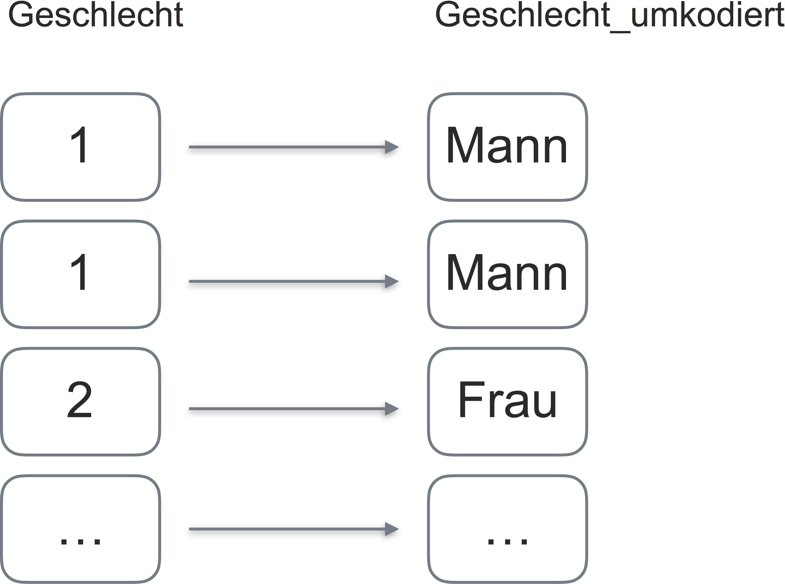
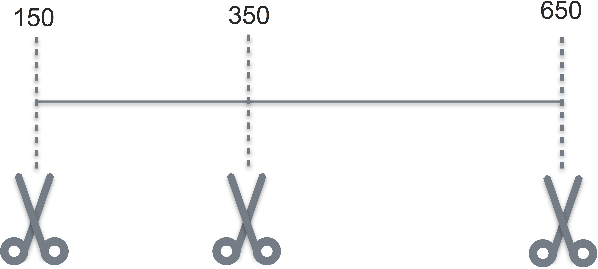

# Praxisprobleme der Datenaufbereitung


\BeginKnitrBlock{rmdcaution}<div class="rmdcaution">Lernziele:

- Typische Probleme der Datenaufbereitung kennen.
- Typische Probleme der Datenaufbereitung bearbeiten können.
</div>\EndKnitrBlock{rmdcaution}


Laden wir zuerst die benötigten Pakete; v.a. ist das `dplyr` and friends. Das geht mit dem Paket `tidyverse`. 


```r
library(tidyverse)
library(corrr)
library(gridExtra)
library(car)
```


Stellen wir einige typische Probleme des Datenjudo (genauer: der Datenaufbereitung) zusammen. Probleme heißt hier nicht, dass es etwas Schlimmes passiert ist, sondern es ist gemeint, wir schauen uns ein paar typische Aufgabenstellungen an, die im Rahmen der Datenaufbereitung häufig anfallen. 


## Datenaufbereitung


### Auf fehlende Werte prüfen 
Das geht recht einfach mit `summarise(mein_dataframe)`. Der Befehl liefert für jede Spalte des Dataframe `mein_dataframe` die Anzahl der fehlenden Werte zurück.


```r
stats_test <- read.csv("data/test_inf_short.csv")
summarise(stats_test)
#> data frame with 0 columns and 0 rows
```


### Fälle mit fehlenden Werte löschen
Weist eine Variable (Spalte) "wenig" fehlende Werte auf, so kann es schlau sein, nichts zu tun. Eine andere Möglichkeit besteht darin, alle entsprechenden Zeilen zu löschen. Man sollte aber schauen, wie viele Zeilen dadurch verloren gehen.


```r
# Unsprünglich Anzahl an Fällen (Zeilen)
nrow(stats_test)
#> [1] 306

# Nach Umwandlung in neuen Dataframe
stats_test %>%
   na.omit -> stats_test_na_omit
nrow(stats_test_na_omit)
#> [1] 238

# Nur die Anzahl der bereinigten Daten
stats_test %>%
   na.omit %>%
   nrow
#> [1] 238
```


\BeginKnitrBlock{rmdcaution}<div class="rmdcaution">Bei mit der Pfeife verketteten Befehlen darf man für Funktionen die runden Klammern weglassen, wenn man keinen Parameter schreibt. Also ist `nrow` (ohne Klammern) erlaubt bei `dplyr`, wo es eigentlich `nrow()` heißen müsste. Sie dürfen die Klammern natürlich schreiben, aber sie müssen nicht.
</div>\EndKnitrBlock{rmdcaution}


Hier verlieren wir 68 Zeilen, das verschmerzen wir.
Welche Zeilen verlieren wir eigentlich?

```r
stats_test %>% 
   filter(!complete.cases(.))  # Nur die nicht-kompletten Fälle filtern
#>    row_number           date_time study_time self_eval interest score
#> 1           6 06.01.2017 14:21:18         NA        NA       NA    39
#> 2           7 06.01.2017 14:25:49         NA        NA       NA    40
#> 3          15 09.01.2017 15:23:15         NA        NA       NA    30
#> 4          19 10.01.2017 17:16:48         NA        NA       NA    22
#> 5          42 13.01.2017 14:08:08         NA        NA       NA    38
#> 6          49 14.01.2017 07:02:39         NA        NA       NA    39
#> 7          67 15.01.2017 13:30:48         NA        NA       NA    24
#> 8          74 15.01.2017 16:12:54         NA        NA       NA    30
#> 9          83 16.01.2017 10:16:52         NA        NA       NA    40
#> 10         89 16.01.2017 21:18:05         NA        NA       NA    34
#> 11         91 17.01.2017 15:19:36         NA        NA       NA    29
#> 12         99 18.01.2017 09:04:30         NA        NA       NA    37
#> 13        104 18.01.2017 13:42:20         NA        NA       NA    39
#> 14        106 18.01.2017 15:52:04         NA        NA       NA    38
#> 15        111 18.01.2017 19:24:49         NA        NA       NA    37
#> 16        117 19.01.2017 08:06:05         NA        NA       NA    37
#> 17        118 19.01.2017 08:54:43         NA        NA       NA    33
#> 18        119 19.01.2017 09:05:01         NA        NA       NA    40
#> 19        124 19.01.2017 12:51:10         NA        NA       NA    32
#> 20        125 19.01.2017 13:03:26         NA        NA       NA    30
#> 21        132 19.01.2017 18:22:32         NA        NA       NA    40
#> 22        133 19.01.2017 18:22:38         NA        NA       NA    38
#> 23        139 19.01.2017 18:35:56         NA        NA       NA    31
#> 24        141 19.01.2017 18:44:32         NA        NA       NA    34
#> 25        150 20.01.2017 09:53:47         NA        NA       NA    32
#> 26        155 20.01.2017 15:33:55         NA        NA       NA    39
#> 27        157 20.01.2017 17:34:48         NA        NA       NA    31
#> 28        158 20.01.2017 17:53:16         NA        NA       NA    36
#> 29        159 20.01.2017 17:57:26         NA        NA       NA    34
#> 30        160 20.01.2017 17:59:19         NA        NA       NA    34
#> 31        162 20.01.2017 18:00:53         NA        NA       NA    35
#> 32        163 20.01.2017 18:04:21         NA        NA       NA    36
#> 33        180 21.01.2017 08:04:17         NA        NA       NA    39
#> 34        183 21.01.2017 12:20:37         NA        NA       NA    31
#> 35        187 21.01.2017 16:27:32         NA        NA       NA    26
#> 36        191 22.01.2017 11:31:27         NA        NA       NA    36
#> 37        195 22.01.2017 13:24:51         NA        NA       NA    23
#> 38        202 22.01.2017 17:13:02         NA        NA       NA    36
#> 39        206 22.01.2017 18:42:49         NA        NA       NA    20
#> 40        207 22.01.2017 18:56:56         NA        NA       NA    28
#> 41        211 22.01.2017 20:28:43         NA        NA       NA    38
#> 42        213 22.01.2017 21:47:06         NA        NA       NA    29
#> 43        225 23.01.2017 13:24:22         NA        NA       NA    39
#> 44        226 23.01.2017 14:17:10         NA        NA       NA    36
#> 45        235 23.01.2017 18:26:20         NA        NA       NA    20
#> 46        238 23.01.2017 19:53:10         NA        NA       NA    27
#> 47        242 24.01.2017 14:09:33         NA        NA       NA    28
#> 48        245 24.01.2017 14:56:24         NA        NA       NA    28
#> 49        246 24.01.2017 15:09:44         NA        NA       NA    24
#> 50        247 24.01.2017 15:37:27         NA        NA       NA    28
#> 51        249 24.01.2017 17:19:54         NA        NA       NA    40
#> 52        253 25.01.2017 09:32:55         NA        NA       NA    39
#> 53        255 25.01.2017 10:05:00         NA        NA       NA    29
#> 54        265 25.01.2017 13:14:00         NA        NA       NA    30
#> 55        270 25.01.2017 16:35:41         NA        NA       NA    28
#> 56        271 25.01.2017 16:53:17         NA        NA       NA    34
#> 57        272 25.01.2017 17:03:21         NA        NA       NA    36
#> 58        274 25.01.2017 17:38:36         NA        NA       NA    37
#> 59        275 25.01.2017 18:06:36         NA        NA       NA    34
#> 60        283 26.01.2017 10:39:44         NA        NA       NA    23
#> 61        285 26.01.2017 10:54:41         NA        NA       NA    34
#> 62        286 26.01.2017 11:19:10         NA        NA       NA    38
#> 63        288 26.01.2017 13:36:14         NA        NA       NA    28
#> 64        289 26.01.2017 14:19:14         NA        NA       NA    31
#> 65        290 26.01.2017 14:34:23         NA        NA       NA    36
#> 66        291 26.01.2017 14:55:17         NA        NA       NA    39
#> 67        293 26.01.2017 15:17:47         NA        NA       NA    36
#> 68        294 26.01.2017 15:51:56         NA        NA       NA    34
```

Man beachte, dass der Punkt `.` für den Datensatz steht, wie er vom letzten Schritt weitergegeben wurde. Innerhalb einer dplyr-Befehls-Kette können wir den Datensatz, wie er im letzten Schritt beschaffen war, stets mit `.` ansprechen; ganz praktisch, weil schnell zu tippen. Natürlich könnten wir diesen Datensatz jetzt als neues Objekt speichern und damit weiter arbeiten. Das Ausrufezeichen `!` steht für logisches "Nicht".

In Pseudo-Syntax liest es sich so:

\BeginKnitrBlock{rmdpseudocode}<div class="rmdpseudocode">Nehme den Datensatz `stats_test` UND DANN...  
filtere die nicht-kompletten Fälle 
</div>\EndKnitrBlock{rmdpseudocode}


### Fehlende Werte ggf. ersetzen  
Ist die Anzahl der fehlenden Werte zu groß, als dass wir es verkraften könnten, die Zeilen zu löschen, so können wir die fehlenden Werte ersetzen. Allein, das ist ein weites Feld und übersteigt den Anspruch dieses Kurses^[Das sagen Autoren, wenn sie nicht genau wissen, wie etwas funktioniert.]. Eine einfache, aber nicht die beste Möglichkeit, besteht darin, die fehlenden Werte durch einen repräsentativen Wert, z.B. den Mittelwert der Spalte, zu ersetzen.


```r
stats_test$interest <- replace(stats_test$interest, is.na(stats_test$interest),
                         mean(stats_test$interest, na.rm = TRUE))

sum(is.na(stats_test$interest))
#> [1] 0
```

`replace`^[aus dem "Standard-R", d.h. Paket "base".] ersetzt Werte aus dem Vektor `stats_test$interest` alle Werte, für die `is.na(stats_test$interest)` wahr ist, bei Zeilen mit fehlenden Werten in dieser Spalte also. Diese Werte werden durch den Mittelwert der Spalte ersetzt^[Hier findet sich eine ausführlichere Darstellung: https://sebastiansauer.github.io/checklist_data_cleansing/index.html].


### Nach Fehlern suchen
Leicht schleichen sich Tippfehler oder andere Fehler ein. Man sollte darauf prüfen; so könnte man sich ein Histogramm ausgeben lassen pro Variable, um "ungewöhnliche" Werte gut zu erkennen. Meist geht das besser als durch das reine Betrachten von Zahlen. Gibt es wenig unterschiedliche Werte, so kann man sich auch die unterschiedlichen Werte ausgeben lassen.


```r
stats_test %>% 
  count(interest) 
#> # A tibble: 7 x 2
#>   interest     n
#>      <dbl> <int>
#> 1     1.00    30
#> 2     2.00    47
#> 3     3.00    66
#> 4     3.21    68
#> 5     4.00    41
#> 6     5.00    45
#> 7     6.00     9
```

Da in der Umfrage nur ganze Zahlen von 1 bis 5 abgefragt wurden, ist die `3.21...` auf den ersten Blick suspekt. In diesem Fall ist aber alles ok, da wir diesen Wert selber erzeugt haben.

### Ausreißer identifizieren

Ähnlich zu Fehlern, steht man Ausreißer häufig skeptisch gegenüber. Allerdings kann man nicht pauschal sagen, das Extremwerte entfernt werden sollen: Vielleicht war jemand in der Stichprobe wirklich nur 1.20m groß? Hier gilt es, begründet und nachvollziehbar im Einzelfall zu entscheiden. Histogramme und Boxplots sind wieder ein geeignetes Mittel, um Ausreißer zu finden (vgl. Abb. \@ref(fig:fig-ausreisser)).


```r
qplot(x = score, data = stats_test, binwidth = 1)
```

<div class="figure" style="text-align: center">

<p class="caption">(\#fig:fig-ausreisser)Ausreißer identifizieren</p>
</div>

Mit `binwidth = 1` sagen wir, dass jeder Balken (bin) eine Breite (width) von 1 haben soll.

### Hochkorrelierte Variablen finden
Haben zwei Leute die gleiche Meinung, so ist einer von beiden überflüssig - wird behauptet. Ähnlich bei Variablen; sind zwei Variablen sehr hoch korreliert (>.9, als grober (!) Richtwert), so bringt die zweite kaum Informationszuwachs zur ersten. Und kann z.B. ausgeschlossen werden. 

Nehmen wir dazu den Datensatz `extra` her.


```r
extra <- read.csv("data/extra.csv")
```


```r
extra %>% 
  select(i01:i10) %>% # Wähle die Variablen von i01 bis i10 aus
  correlate() -> km   # Korrelationsmatrix berechnen
km  
#> # A tibble: 10 x 11
#>    rowname    i01   i02r    i03    i04    i05  i06r   i07   i08    i09
#>      <chr>  <dbl>  <dbl>  <dbl>  <dbl>  <dbl> <dbl> <dbl> <dbl>  <dbl>
#>  1     i01     NA 0.4895 0.0805 0.4528 0.4481 0.450 0.309 0.387 0.3795
#>  2    i02r 0.4895     NA 0.0849 0.3603 0.3897 0.520 0.240 0.323 0.2730
#>  3     i03 0.0805 0.0849     NA 0.0323 0.0492 0.155 0.156 0.101 0.0211
#>  4     i04 0.4528 0.3603 0.0323     NA 0.6478 0.316 0.446 0.219 0.2472
#>  5     i05 0.4481 0.3897 0.0492 0.6478     NA 0.348 0.395 0.287 0.2983
#>  6    i06r 0.4504 0.5197 0.1554 0.3163 0.3482    NA 0.163 0.294 0.2937
#>  7     i07 0.3090 0.2396 0.1557 0.4459 0.3949 0.163    NA 0.317 0.2803
#>  8     i08 0.3873 0.3232 0.1006 0.2190 0.2875 0.294 0.317    NA 0.4095
#>  9     i09 0.3795 0.2730 0.0211 0.2472 0.2983 0.294 0.280 0.409     NA
#> 10     i10 0.1850 0.0789 0.0939 0.3520 0.2929 0.136 0.380 0.220 0.1552
#> # ... with 1 more variables: i10 <dbl>
```

In diesem Beispiel sind keine Variablen sehr hoch korreliert. Wir leiten keine weiteren Schritte ein, abgesehen von einer Visualisierung.


```r

km %>% 
  shave() %>% # Oberes Dreieck ist redundant, wird "abrasiert"
  rplot()  # Korrelationsplot
```

<div class="figure" style="text-align: center">

<p class="caption">(\#fig:fig-corrr)Ein Korrelationsplot</p>
</div>

Die Funktion `correlate` stammt aus dem Paket `corrr`^[https://github.com/drsimonj/corrr ], welches vorher installiert und geladen sein muss. Hier ist die Korrelation nicht zu groß, so dass wir keine weiteren Schritte unternehmen. Hätten wir eine sehr hohe Korrelation gefunden, so hätten wir eine der beiden beteiligten Variablen aus dem Datensatz löschen können.


### z-Standardisieren
Für eine Reihe von Analysen ist es wichtig, die Skalierung der Variablen zur vereinheitlichen. Die z-Standardisierung ist ein übliches Vorgehen. Dabei wird der Mittelwert auf 0 transformiert und die SD auf 1; man spricht - im Falle von (hinreichend) normalverteilten Variablen - jetzt von der *Standardnormalverteilung*\index{Standardnormalverteilung}. Unterscheiden sich zwei Objekte A und B in einer standardnormalverteilten Variablen, so sagt dies nur etwas zur relativen Position von A zu B innerhalb ihrer Verteilung aus - im Gegensatz zu den Rohwerten.


```r
extra %>% 
  select_if(is.numeric) %>%  # Spalte nur auswählen, wenn numerisch
  scale() %>%  # z-standardisieren
  head()  # nur die ersten paar Zeilen abdrucken
#>          X    i01  i02r     i03   i04     i05    i06r     i07     i08  i09
#> [1,] -1.73 -0.499 -0.15  1.1784 -0.33  1.2307  1.3643  0.0466 -1.0826 -0.5
#> [2,] -1.72 -1.964 -1.39 -0.9838 -1.70 -0.0705 -1.2193 -1.3192  0.0867 -0.5
#> [3,] -1.71 -0.499  1.09 -0.9838  1.04  1.2307 -2.5111  0.0466 -1.0826 -0.5
#> [4,] -1.71 -0.499 -0.15  0.0973  1.04 -0.0705  0.0725  0.0466  0.0867 -0.5
#> [5,] -1.70  0.966 -0.15 -0.9838  1.04  1.2307  0.0725  1.4124 -1.0826 -0.5
#> [6,] -1.69 -0.499 -1.39 -0.9838  1.04 -1.3718  0.0725  1.4124  0.0867 -0.5
#>         i10 n_facebook_friends n_hangover    age extra_single_item
#> [1,] -1.388            -0.4111     -0.434 -0.306             1.350
#> [2,] -1.388            -0.9094     -0.487  1.621             0.183
#> [3,] -1.388            -0.5322     -0.487 -0.131             1.350
#> [4,] -0.273            -0.5841      0.305  2.322             0.183
#> [5,]  1.956            -0.9301     -0.487  0.570             1.350
#> [6,]  0.841             0.0249     -0.434  1.271             1.350
#>      time_conversation n_party extra_description prop_na_per_row
#> [1,]           -0.0468  0.0961                NA           0.519
#> [2,]           -0.0468 -0.6174                NA           0.519
#> [3,]           -0.0468 -0.7126                NA           0.519
#> [4,]           -0.0468  0.3340                NA           0.519
#> [5,]           -0.0468 -0.6650                NA           0.519
#> [6,]           -0.0468 -0.6650                NA           0.519
#>      extra_mean extra_median client_freq
#> [1,]    -0.0175       -0.024          NA
#> [2,]    -1.7517       -1.740          NA
#> [3,]    -0.6678       -0.024          NA
#> [4,]    -0.0175       -0.024          NA
#> [5,]     0.6328        0.834          NA
#> [6,]    -0.2343       -0.024          NA
```

Dieser Befehl liefert zwei z-standardisierte Spalten zurück. Kommoder ist es aber, alle Spalten des Datensatzes zurück zu bekommen, wobei zusätzlich die z-Werte aller numerischen Variablen hinzugekommen sind:


```r
extra %>% 
  mutate_if(is.numeric, funs("z" = scale)) %>% 
  head
#>   X           timestamp code i01 i02r i03 i04 i05 i06r i07 i08 i09 i10
#> 1 1 11.03.2015 19:17:48  HSC   3    3   3   3   4    4   3   2   3   1
#> 2 2 11.03.2015 19:18:05  ERB   2    2   1   2   3    2   2   3   3   1
#> 3 3 11.03.2015 19:18:09  ADP   3    4   1   4   4    1   3   2   3   1
#> 4 4 11.03.2015 19:18:19  KHB   3    3   2   4   3    3   3   3   3   2
#> 5 5 11.03.2015 19:18:19  PTG   4    3   1   4   4    3   4   2   3   4
#> 6 6 11.03.2015 19:18:23  ABL   3    2   1   4   2    3   4   3   3   3
#>   n_facebook_friends n_hangover age  sex extra_single_item
#> 1                250          1  24 Frau                 4
#> 2                106          0  35 Frau                 3
#> 3                215          0  25 Frau                 4
#> 4                200         15  39 Frau                 3
#> 5                100          0  29 Frau                 4
#> 6                376          1  33 Mann                 4
#>   time_conversation presentation n_party clients extra_vignette
#> 1                10         nein      20                       
#> 2                15         nein       5                       
#> 3                15         nein       3                       
#> 4                 5         nein      25                       
#> 5                 5         nein       4                       
#> 6                20           ja       4                       
#>   extra_description prop_na_per_row extra_mean extra_median client_freq
#> 1                NA          0.0435        2.9          3.0          NA
#> 2                NA          0.0435        2.1          2.0          NA
#> 3                NA          0.0435        2.6          3.0          NA
#> 4                NA          0.0435        2.9          3.0          NA
#> 5                NA          0.0435        3.2          3.5          NA
#> 6                NA          0.0435        2.8          3.0          NA
#>     X_z  i01_z i02r_z   i03_z i04_z   i05_z  i06r_z   i07_z   i08_z i09_z
#> 1 -1.73 -0.499  -0.15  1.1784 -0.33  1.2307  1.3643  0.0466 -1.0826  -0.5
#> 2 -1.72 -1.964  -1.39 -0.9838 -1.70 -0.0705 -1.2193 -1.3192  0.0867  -0.5
#> 3 -1.71 -0.499   1.09 -0.9838  1.04  1.2307 -2.5111  0.0466 -1.0826  -0.5
#> 4 -1.71 -0.499  -0.15  0.0973  1.04 -0.0705  0.0725  0.0466  0.0867  -0.5
#> 5 -1.70  0.966  -0.15 -0.9838  1.04  1.2307  0.0725  1.4124 -1.0826  -0.5
#> 6 -1.69 -0.499  -1.39 -0.9838  1.04 -1.3718  0.0725  1.4124  0.0867  -0.5
#>    i10_z n_facebook_friends_z n_hangover_z  age_z extra_single_item_z
#> 1 -1.388              -0.4111       -0.434 -0.306               1.350
#> 2 -1.388              -0.9094       -0.487  1.621               0.183
#> 3 -1.388              -0.5322       -0.487 -0.131               1.350
#> 4 -0.273              -0.5841        0.305  2.322               0.183
#> 5  1.956              -0.9301       -0.487  0.570               1.350
#> 6  0.841               0.0249       -0.434  1.271               1.350
#>   time_conversation_z n_party_z extra_description_z prop_na_per_row_z
#> 1             -0.0468    0.0961                  NA             0.519
#> 2             -0.0468   -0.6174                  NA             0.519
#> 3             -0.0468   -0.7126                  NA             0.519
#> 4             -0.0468    0.3340                  NA             0.519
#> 5             -0.0468   -0.6650                  NA             0.519
#> 6             -0.0468   -0.6650                  NA             0.519
#>   extra_mean_z extra_median_z client_freq_z
#> 1      -0.0175         -0.024            NA
#> 2      -1.7517         -1.740            NA
#> 3      -0.6678         -0.024            NA
#> 4      -0.0175         -0.024            NA
#> 5       0.6328          0.834            NA
#> 6      -0.2343         -0.024            NA
```

Der Befehl `mutate` berechnet eine neue Spalte; `mutate_if` tut dies, wenn die Spalte numerisch ist. Die neue Spalte wird berechnet als z-Transformierung der alten Spalte; zum Spaltenname wird ein "_z" hinzugefügt. Natürlich hätten wir auch mit `select` "händisch" die relevanten Spalten auswählen können.


### Quasi-Konstante finden
Hier suchen wir nach Variablen (Spalten), die nur einen Wert oder zumindest nur sehr wenige verschiedene Werte aufweisen. Oder, ähnlich: Wenn 99.9% der Fälle nur von einem Wert bestritten wird. In diesen Fällen kann man die Variable als "Quasi-Konstante" bezeichnen. Quasi-Konstanten sind für die Modellierung von keiner oder nur geringer Bedeutung; sie können in der Regel für weitere Analysen ausgeschlossen werden.

Haben wir z.B. nur Männer im Datensatz, so kann das Geschlecht nicht für Unterschiede im Einkommen verantwortlich sein. Besser ist es, die Variable Geschlecht zu entfernen. Auch hier sind Histogramme oder Boxplots von Nutzen zur Identifikation von (Quasi-)Konstanten. Alternativ kann man sich auch pro die Streuung (numerische Variablen) oder die Anzahl unterschiedlicher Werte (qualitative Variablen) ausgeben lassen:


```r
IQR(extra$n_facebook_friends, na.rm = TRUE)  # keine Konstante
#> [1] 288
n_distinct(extra$sex)  # es scheint 3 Geschlechter zu geben...
#> [1] 3
```


### Auf Normalverteilung prüfen
Einige statistische Verfahren gehen von normalverteilten Variablen aus, daher macht es Sinn, Normalverteilung zu prüfen. *Perfekte* Normalverteilung ist genau so häufig wie *perfekte* Kreise in der Natur. Entsprechend werden Signifikanztests, die ja auf perfekte Normalverteilung prüfen, *immer signifikant* sein, sofern die *Stichprobe groß* genug ist. Daher ist meist zweckmäßiger, einen graphischen "Test" durchzuführen: ein Histogramm, ein QQ-Plot oder ein Dichte-Diagramm als "glatt geschmirgelte" Variante des Histogramms bieten sich an (s. Abb. \@ref(fig:fig-norm-check)).

<div class="figure" style="text-align: center">

<p class="caption">(\#fig:fig-norm-check)Visuelles Prüfen der Normalverteilung</p>
</div>

Während die der mittlere Extraversionswert recht gut normalverteilt ist, ist die Anzahl der Facebookfreunde ordentlich (rechts-)schief. Bei schiefen Verteilung können Transformationen Abhilfe schaffen; ein Thema, auf das wir hier nicht weiter eingehen.


### Werte umkodieren und partionieren ("binnen") 

*Umkodieren*\index{Umkodieren} meint, die Werte zu ändern. Man sieht immer mal wieder, dass die Variable "gender" (Geschlecht) mit `1` und `2` kodiert ist. Verwechslungen sind da vorprogrammiert ("Ich bin mir echt ziemlich sicher, dass ich 1 für Männer kodiert habe, wahrscheinlich..."). Besser wäre es, die Ausprägungen `male` und `female` ("Mann", "Frau") o.ä. zu verwenden (vgl. Abb. \@ref(fig:umkodieren)).

<div class="figure" style="text-align: center">

<p class="caption">(\#fig:umkodieren)Sinnbild für Umkodieren</p>
</div>


Partionieren\index{Partionieren) oder *"Binnen"*\index{Binnen} meint, eine kontinuierliche Variablen in einige Bereiche (mindestens 2) zu zerschneiden. Damit macht man aus einer kontinuierlichen Variablen eine diskrete. Ein Bild erläutert das am einfachsten (vgl. Abb. \@ref(fig:cut-schere)). 

<div class="figure" style="text-align: center">

<p class="caption">(\#fig:cut-schere)Sinnbild zum 'Binnen'</p>
</div>


#### Umkodieren und partionieren mit `car::recode`

Manchmal möchte man z.B. negativ gepolte Items umdrehen oder bei kategoriellen Variablen kryptische Bezeichnungen in sprechendere umwandeln. Hier gibt es eine Reihe praktischer Befehle, z.B. `recode` aus dem Paket `car`. Schauen wir uns ein paar Beispiele zum Umkodieren an.


```r

stats_test <- read.csv("data/test_inf_short.csv")

stats_test$score_fac <- car::recode(stats_test$study_time, 
                        "5 = 'sehr viel'; 2:4 = 'mittel'; 1 = 'wenig'",
                        as.factor.result = TRUE)
stats_test$score_fac <- car::recode(stats_test$study_time, 
                        "5 = 'sehr viel'; 2:4 = 'mittel'; 1 = 'wenig'",
                        as.factor.result = FALSE)

stats_test$study_time_2 <- car::recode(stats_test$study_time, 
                                       "5 = 'sehr viel'; 4 = 'wenig'; 
                                       else = 'Hilfe'", 
                                       as.factor.result = TRUE)

head(stats_test$study_time_2)
#> [1] sehr viel Hilfe     sehr viel Hilfe     wenig     Hilfe    
#> Levels: Hilfe sehr viel wenig
```

Der Befehle `recode` ist praktisch; mit `:` kann man "von bis" ansprechen (das ginge mit `c()` übrigens auch); `else` für "ansonsten" ist möglich und mit `as.factor.result` kann man entweder einen Faktor oder eine Text-Variable zurückgeliefert bekommen. Der ganze "Wechselterm" steht in Anführungsstrichen (`"`). Einzelne Teile des Wechselterms sind mit einem Strichpunkt (`;`) voneinander getrennt.


Das klassische Umkodieren von Items aus Fragebögen kann man so anstellen; sagen wir `interest` soll umkodiert werden:


```r
stats_test$no_interest <- car::recode(stats_test$interest, 
                                      "1 = 6; 2 = 5; 3 = 4; 4 = 3; 
                                      5 = 2; 6 = 1; else = NA")
glimpse(stats_test$no_interest)
#>  num [1:306] 2 4 1 5 1 NA NA 4 2 2 ...
```

Bei dem Wechselterm muss man aufpassen, nichts zu verwechseln; die Zahlen sehen alle ähnlich aus...

Testen kann man den Erfolg des Umpolens mit


```r
dplyr::count(stats_test, interest)
#> # A tibble: 7 x 2
#>   interest     n
#>      <int> <int>
#> 1        1    30
#> 2        2    47
#> 3        3    66
#> 4        4    41
#> 5        5    45
#> 6        6     9
#> 7       NA    68
dplyr::count(stats_test, no_interest)
#> # A tibble: 7 x 2
#>   no_interest     n
#>         <dbl> <int>
#> 1           1     9
#> 2           2    45
#> 3           3    41
#> 4           4    66
#> 5           5    47
#> 6           6    30
#> 7          NA    68
```

Scheint zu passen. Noch praktischer ist, dass man so auch numerische Variablen in Bereiche aufteilen kann ("binnen"):


```r
stats_test$Ergebnis <- car::recode(stats_test$score, 
                                   "1:38 = 'durchgefallen'; 
                                   else = 'bestanden'")
```


Natürlich gibt es auch eine Pfeifen kompatible Version, um Variablen umzukodieren bzw. zu binnen: `dplyr::recode`^[https://blog.rstudio.org/2016/06/27/dplyr-0-5-0/]. Die Syntax ist allerdings etwas weniger komfortabel (da strenger), so dass wir an dieser Stelle bei `car::recode` bleiben.


#### Einfaches Umkodieren mit einer Logik-Prüfung

Nehmen wir an, wir möchten die Anzahl der Punkte in einer Statistikklausur (`score`) umkodieren in eine Variable "bestanden" mit den zwei Ausprägungen "ja" und "nein"; der griesgrämige Professor beschließt, dass die Klausur ab 25 Punkten (von 40) bestanden sei. Die Umkodierung ist also von der Art "viele Ausprägungen in zwei Ausprägungen umkodieren". Das kann man z.B. so erledigen:


```r
stats_test$bestanden <- stats_test$score > 24

head(stats_test$bestanden)
#> [1]  TRUE  TRUE  TRUE FALSE  TRUE  TRUE
```

Genauso könnte man sich die "Grenzfälle" - die Bemitleidenswerten mit 24 Punkten - anschauen (knapp daneben ist auch vorbei, so der griesgrämige Professor weiter):


```r
stats_test$Grenzfall <- stats_test$score == 24

count(stats_test, Grenzfall)
#> # A tibble: 2 x 2
#>   Grenzfall     n
#>       <lgl> <int>
#> 1     FALSE   294
#> 2      TRUE    12
```

Natürlich könnte man auch hier "Durchpfeifen":


```r
stats_test <- 
stats_test %>% 
  mutate(Grenzfall = score == 24)

count(stats_test, Grenzfall)
#> # A tibble: 2 x 2
#>   Grenzfall     n
#>       <lgl> <int>
#> 1     FALSE   294
#> 2      TRUE    12
```


#### Binnen mit `cut`
Numerische Werte in Klassen zu gruppieren ("to bin", denglisch: "binnen") kann mit dem Befehl `cut` (and friends) besorgt werden. 

Es lassen sich drei typische Anwendungsformen unterscheiden:

Eine numerische Variable ...

1. in *k* gleich große Klassen gruppieren (gleichgroße Intervalle)
2. so in Klassen gruppieren, dass in jeder Klasse *n* Beobachtungen sind (gleiche Gruppengrößen)
3. in beliebige Klassen gruppieren


##### Gleichgroße Intervalle

Nehmen wir an, wir möchten die numerische Variable "Körpergröße" in drei Gruppen einteilen: "klein", "mittel" und "groß". Der Range von Körpergröße soll gleichmäßig auf die drei Gruppen aufgeteilt werden, d.h. der Range (Intervall) der drei Gruppen soll gleich groß sein. Dazu kann man `cut_interval` aus `ggplot2` nehmen^[d.h. `ggplot2` muss geladen sein; wenn man `tidyverse` lädt, wird `ggplot2` automatisch auch geladen].


```r
stats_test <- read.csv("data/test_inf_short.csv")


temp <- cut_interval(x = stats_test$score, n = 3)

levels(temp)
#> [1] "[17,24.7]"   "(24.7,32.3]" "(32.3,40]"
```

`cut_interval` liefert eine Variable vom Typ `factor` zurück. Hier haben wir das Punktespektrum in drei gleich große Bereiche unterteilt (d.h. mit jeweils gleichem Punkte-Range). 


##### Gleiche Gruppengrößen


```r
temp <- cut_number(stats_test$score, n = 2)
str(temp)
#>  Factor w/ 2 levels "[17,31]","(31,40]": 1 1 2 1 2 2 2 1 1 2 ...
median(stats_test$score)
#> [1] 31
```

Mit `cut_number` (aus ggplot2) kann man einen Vektor in `n` Gruppen mit (etwa) gleich viel Observationen einteilen. Hier haben wir `score` am Median geteilt.

>   Teilt man einen Vektor in zwei gleich große Gruppen, so entspricht das einer Aufteilung am Median (Median-Split).


##### In beliebige Klassen gruppieren


```r
stats_test$punkte_gruppe <- cut(stats_test$score, 
                             breaks = c(-Inf, 25, 29, 33, 37, 40),
                             labels = c("5", "4", "3", "2", "1"))

count(stats_test, punkte_gruppe)
#> # A tibble: 5 x 2
#>   punkte_gruppe     n
#>          <fctr> <int>
#> 1             5    56
#> 2             4    68
#> 3             3    63
#> 4             2    64
#> 5             1    55
```

`cut` ist im Standard-R (Paket "base") enthalten. Mit `breaks` gibt man die Intervallgrenzen an. Zu beachten ist, dass man eine Unter- bzw. Obergrenze angeben muss. D.h. der kleinste Wert in der Stichprobe wird nicht automatisch als unterste Intervallgrenze herangezogen. Anschaulich gesprochen ist `cut` ein Messer, das ein Seil (die kontinuierliche Variable) mit einem oder mehreren Schnitten zerschneidet (vgl. Abb. \@ref(fig:cut-schere)). Wenn wir 6 Schnitte (`breaks`) tun, haben wir 5 Teile, wie Abb. \@ref(fig:cut-schere) zeigt. Darum müssen wir auch nur 5 (6-1) `labels` für die Teile vergeben.


## Deskriptive Statistiken berechnen


### Mittelwerte pro Zeile berechnen

#### `rowMeans`
Um Umfragedaten auszuwerten, will man häufig einen Mittelwert *pro Zeile* berechnen. Normalerweise fasst man eine *Spalte* zu einer Zahl zusammen; aber jetzt, fassen wir eine *Zeile* zu einer Zahl zusammen. Der häufigste Fall ist, wie gesagt, einen Mittelwert zu bilden für jede Person. Nehmen wir an, wir haben eine Befragung zur Extraversion durchgeführt und möchten jetzt den mittleren Extraversions-Wert pro Person (d.h. pro Zeile) berechnen.


```r
extra <- read.csv("data/extra.csv")

extra_items <- extra %>% 
  select(i01:i10)  # `select` ist aus `dplyr`

# oder:
# select(extra_items, i01:i10)

extra$extra_mw <- rowMeans(extra_items)
```

Da der Datensatz über 28 Spalten verfügt, wir aber nur 10 Spalten heranziehen möchten, um Zeilen auf eine Zahl zusammenzufassen, bilden wir als Zwischenschritt einen "schmäleren" Datensatz, `extra_items`. Im Anschluss berechnen wir mit `rowMeans` die Mittelwerte pro Zeile (engl. "row").


### Mittelwerte pro Spalte berechnen


Eine Möglichkeit ist der Befehl `summary` aus `dplyr`.


```r
stats_test %>% 
  na.omit %>% 
  summarise(mean(score),
            sd(score),
            median(score),
            IQR(score))
#>   mean(score) sd(score) median(score) IQR(score)
#> 1        30.6      5.72            31          9
```

Die Logik von `dplyr` lässt auch einfach Subgruppenanalysen zu. Z.B. können wir eine Teilmenge des Datensatzes mit `filter` erstellen und dann mit `group_by` Gruppen vergleichen:


```r
stats_test %>% 
  filter(study_time > 1) %>% 
  group_by(interest) %>% 
  summarise(median(score, na.rm = TRUE))
#> # A tibble: 6 x 2
#>   interest `median(score, na.rm = TRUE)`
#>      <int>                         <dbl>
#> 1        1                            28
#> 2        2                            30
#> 3        3                            33
#> 4        4                            31
#> 5        5                            34
#> 6        6                            34
```


Wir können auch Gruppierungskriterien unterwegs erstellen:


```r
stats_test %>% 
  na.omit %>% 
  filter(study_time > 1) %>% 
  group_by(intessiert = interest > 3) %>% 
  summarise(median(score))
#> # A tibble: 2 x 2
#>   intessiert `median(score)`
#>        <lgl>           <dbl>
#> 1      FALSE              30
#> 2       TRUE              32
```

Die beiden Gruppen von `interessiert` sind "ja, interessiert" (`interest > 3` ist `TRUE`) und "nein, nicht interessiert" (`interest > 3` ist `FALSE`).


Etwas expliziter wäre es, `mutate` zu verwenden, um die Variable `interessiert` zu erstellen:


```r
stats_test %>% 
  na.omit %>% 
  filter(study_time > 1) %>% 
  mutate(interessiert = interest > 3) %>% 
  group_by(interessiert) %>% 
  summarise(median(score))
#> # A tibble: 2 x 2
#>   interessiert `median(score)`
#>          <lgl>           <dbl>
#> 1        FALSE              30
#> 2         TRUE              32
```


\BeginKnitrBlock{rmdcaution}<div class="rmdcaution">Statistiken, die auf dem Mittelwert (arithmetisches Mittel) beruhen, sind nicht robust gegenüber Ausreißer: Schon wenige Extremwerte können diese Statistiken so verzerren, dass sie erheblich an Aussagekraft verlieren.

Daher: besser robuste Statistiken verwenden. Der Median, der Modus und der IQR bieten sich an. 
</div>\EndKnitrBlock{rmdcaution}


### Korrelationstabellen berechnen

Korrelationen bzw. Korrelationstabellen lassen sich mit dem R-Standardbefehl `cor` berechnen:


```r

stats_test %>% 
  select(study_time,interest,score) %>% 
  cor()
#>            study_time interest score
#> study_time          1       NA    NA
#> interest           NA        1    NA
#> score              NA       NA     1
```


Oh! Lauter NAs! Besser wir löschen Zeilen mit fehlenden Werten bevor wir die Korrelation ausrechnen:


```r
stats_test %>% 
  select(study_time:score) %>% 
  na.omit %>% 
  cor()
#>            study_time self_eval interest score
#> study_time      1.000     0.559    0.461 0.441
#> self_eval       0.559     1.000    0.360 0.628
#> interest        0.461     0.360    1.000 0.223
#> score           0.441     0.628    0.223 1.000
```


Alternativ zu `cor` kann man auch `corrr:correlate` verwenden:


```r

stats_test %>% 
  select(study_time:score) %>% 
  correlate
#> # A tibble: 4 x 5
#>      rowname study_time self_eval interest score
#>        <chr>      <dbl>     <dbl>    <dbl> <dbl>
#> 1 study_time         NA     0.559    0.461 0.441
#> 2  self_eval      0.559        NA    0.360 0.628
#> 3   interest      0.461     0.360       NA 0.223
#> 4      score      0.441     0.628    0.223    NA
```


`correlate` hat den Vorteil, dass es bei fehlenden Werten einen Wert ausgibt; die Korrelation wird paarweise mit den verfügbaren (nicht-fehlenden) Werten berechnet. Außerdem wird eine Dataframe (genauer: tibble) zurückgeliefert, was häufig praktischer ist zur Weiterverarbeitung. Wir könnten jetzt die resultierende Korrelationstabelle plotten, vorher "rasieren" wir noch das redundanten obere Dreieck ab (da Korrelationstabellen ja symmetrisch sind):


```r
stats_test %>% 
  select(study_time:score) %>% 
  correlate %>% 
  shave %>% 
  rplot
```


## Befehlsübersicht

Tabelle \@ref(tab:befehle-praxisprobleme) stellt die Befehle dieses Kapitels dar. 


Table: (\#tab:befehle-praxisprobleme)Befehle des Kapitels 'Praxisprobleme'

Paket::Funktion         Beschreibung                                                       
----------------------  -------------------------------------------------------------------
na.omit                 Löscht Zeilen, die fehlende Werte enthalten                        
nrow                    Liefert die Anzahl der Zeilen des Dataframes zurück                
complete.cases          Gibt die Zeilen ohne fehlenden Werte eines Dataframes zurück       
car::recode             Kodiert Werte um                                                   
cut                     Schneidet eine kontinuierliche Variable in Wertebereiche           
rowMeans                Berechnet Zeilen-Mittelwerte                                       
dplyr::rowwise          Gruppiert nach Zeilen                                              
ggplot2::cut_number     Schneidet eine kontinuierliche Variable in n gleich große Bereiche 
ggplot2::cut_interval   Schneidet eine kontinuierliche Variable in Intervalle der Größe k  
head                    Zeigt nur die ersten Zeilen/Werte eines Dataframes/Vektors an.     
scale                   z-skaliert eine Variable                                           
dplyr::select_if        Wählt eine Spalte aus, wenn ein Kriterium erfüllt ist              
dplyr::glimpse          Gibt einen Überblick über einen Dataframe                          
dplyr::mutate_if        definiert eine Spalte, wenn eine Kriterium erfüllt ist             
:                       Definiert einen Bereich von … bis …                                
corrr::correlate        Berechnet Korrelationtabelle, liefert einen Dataframe zurück       
cor                     Berechnet Korrelationtabelle                                       
corrr::rplot            Plottet Korrelationsmatrix von correlate                           
corrr::shave            “Rasiert” redundantes Dreick in Korrelationsmatrix ab              

