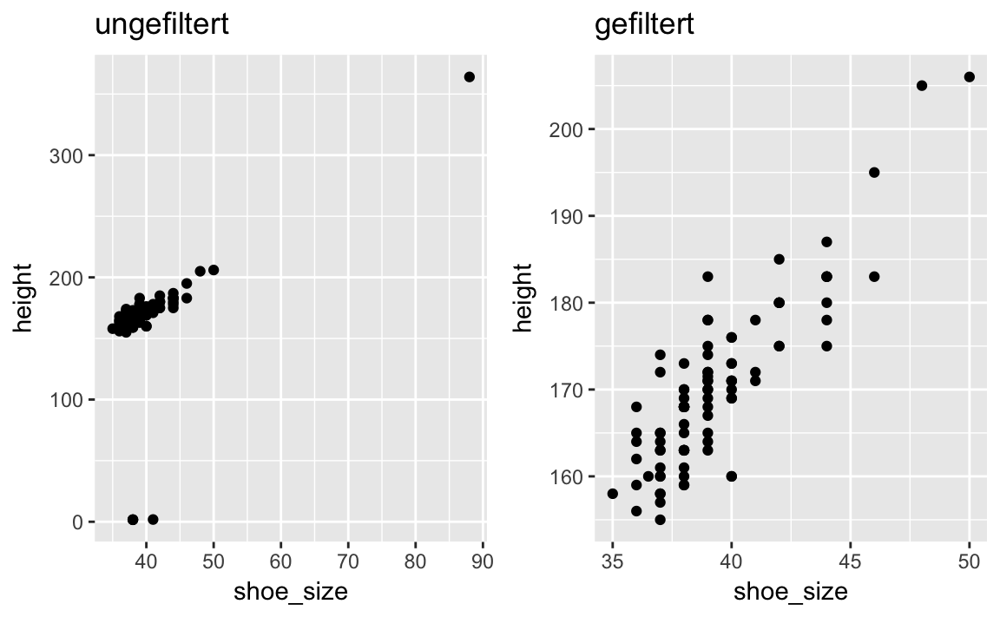

# Typische Probleme der Datenanalyse

Laden wir zuerst die benögtigten Pakete; v.a. ist das `dplyr` and friends. Das geht mit dem Paket `tidyverse`. 

```r
library(tidyverse)
library(corrr)
library(gridExtra)
```


Stellen wir einige typische Probleme des Datenjudo (Daten aufbereiten) zusammen. Probleme heißt hier nicht, dass es etwas Schlimmes passiert ist, sondern es ist gemeint, wir schauen uns ein paar typische Aufgabenstellungen an, die im Rahmen der Datenanalyse häufig anfallen.

## Auf fehlende Werte prüfen 
Das geht recht einfach mit `summarise(meine_daten)`. Der Befehl liefert für jede Spalte die Anzahl der fehlenden Werte zurück.


```r
wo_men <- read.csv("https://sebastiansauer.github.io/data/wo_men.csv")
glimpse(wo_men)
#> Observations: 101
#> Variables: 4
#> $ time      <fctr> 04.10.2016 17:58:51, 04.10.2016 17:58:59, 04.10.201...
#> $ sex       <fctr> woman, woman, woman, woman, man, woman, woman, woma...
#> $ height    <dbl> 160, 171, 174, 176, 195, 157, 160, 178, 168, 171, 16...
#> $ shoe_size <dbl> 40, 39, 39, 40, 46, 37, 38, 39, 38, 41, 39, 44, 38, ...
```

## Fälle mit fehlenden Werte löschen
Weist eine Variable (Spalte) "wenig" fehlende Werte auf, so kann es schlau sein, nichts zu tun. Eine andere Möglichkeit besteht darin, alle entsprechenden Zeilen zu löschen. Man sollte aber schauen, wie viele Zeilen dadurch verloren gehen.


```r
nrow(wo_men)
#> [1] 101
wo_men %>% 
  na.omit %>% 
  nrow
#> [1] 100
```

Hier verlieren wir nur 1 Zeile, das verschmerzen wir. Welche eigentlich?

```r
wo_men %>% 
  rownames_to_column %>%  # Zeilennummer werden eine eigene Spalte
  filter(!complete.cases(.))  # Nur die nicht-kompletten Fälle filtern
#>   rowname                time  sex height shoe_size
#> 1      86 11.10.2016 12:44:06 <NA>     NA        NA
```

Man beachte, dass der Punkt `.` für den Datensatz steht, wie er vom letzten Schritt weitergegeben wurde. Natürlich könnten wir diesen Datensatz jetzt als neues Objekt speichern und damit weiter arbeiten.

## Fehlende Werte ggf. ersetzen  
Ist die Anzahl der fehlenden Werte zu groß, als dass wir es verkraften könnten, die Zeilen zu löschen, so können wir die fehlenden Werte ersetzen. Allein, das ist ein weites Feld und übersteigt den Anspruch dieses Kurses^[Das sagen Autoren, wenn sie nicht genau wissen, wie etwas funktioniert.]. Eine einfache, aber nicht die beste Möglichkeit, besteht darin, die fehlenden Werte durch einen repräsentativen Wert, z.B. den Mittelwert der Spalte, zu ersetzen.


```r
wo_men$height <- replace(wo_men$height, is.na(wo_men$height), mean(wo_men$height, na.rm = TRUE))
  
```

`replace`^[aus dem "Standard-R", d.h. Paket "base".] ersetzt Werte aus dem Vektor `wo_men$height` alle Werte, für die `is.na(wo_men$height)` wahr ist. Diese Werte werden durch den Mittelwert der Spalte ersetzt^[Hier findet sich eine ausführlichere Darstellung: https://sebastiansauer.github.io/checklist_data_cleansing/index.html].

## Nach Fehlern suchen
Leicht schleichen sich Tippfehler oder andere Fehler ein. Man sollte darauf prüfen; so könnte man sich ein Histogramm ausgeben lassen pro Variable, um "ungewöhnliche" Werte gut zu erkennen. Meist geht das besser als durch das reine Betrachten von Zahlen. Gibt es wenig unterschiedliche Werte, so kann man sich auch die unterschiedlichen Werte ausgeben lassen.


```r
wo_men %>% 
  count(shoe_size) %>% 
  head  # nur die ersten paar Zeilen
#> # A tibble: 6 × 2
#>   shoe_size     n
#>       <dbl> <int>
#> 1      35.0     1
#> 2      36.0     6
#> 3      36.5     1
#> 4      37.0    14
#> 5      38.0    26
#> 6      39.0    18
```


## Ausreiser identifizieren
Ähnlich zu Fehlern, steht man Ausreisern häufig skeptisch gegenüber. Allerdings kann man nicht pauschal sagen, das Extremwerte entfernt werden sollen: Vielleicht war jemand in der Stichprobe wirklich nur 1.20m groß? Hier gilt es, begründet und nachvollziehbar im Einzelfall zu entscheiden. Histogramme und Boxplots sind wieder ein geeignetes Mittel, um Ausreiser zu finden.




## Hochkorrelierte Variablen finden
Haben zwei Leute die gleiche Meinung, so ist einer von beiden überflüssig - wird behauptet. Ähnlich bei Variablen; sind zwei Variablen sehr hoch korreliert (>.9, als grober (!) Richtwert), so bringt die zweite kaum Informationszuwachs zur ersten. Und kann ausgeschlossen werden. Oder man fasst ähnliche Variablen zusammen.


```r
wo_men %>% 
  select(height, shoe_size) %>% 
  correlate() -> km   # Korrelationsmatrix berechnen
km  
#> # A tibble: 2 × 3
#>     rowname height shoe_size
#>       <chr>  <dbl>     <dbl>
#> 1    height     NA     0.553
#> 2 shoe_size  0.553        NA

km %>% 
  shave() %>% # Oberes Dreieck ist redundant, wird "abrasiert"
  rplot()  # Korrelationsplot
```


Die Funktion `correlate` stammt aus dem Paket `corrr`^[https://github.com/drsimonj/corrr ], welches vorher installiert und geladen sein muss. Hier ist die Korrelation nicht zu groß, so dass wir keine weiteren Schritte unternehmen.


## z-Standardisieren
Für eine Reihe von Analysen ist es wichtig, die Skalierung der Variablen zur vereinheitlichen. Die z-Standardisierung ist ein übliches Vorgehen. Dabei wird der Mittelwert auf 0 transformiert und die SD auf 1; man spricht - im Falle von (hinreichend) normalverteilten Variablen - jetzt von der *Standardnormalverteilung*\index{Standardnormalverteilung}. Unterscheiden sich zwei Objekte A und B in einer standardnormalverteilten Variablen, so sagt dies nur etwas zur relativen Position von A zu B innerhalb ihrer Verteilung aus - im Gegensatz zu den Rohwerten.


```r
wo_men %>% 
  select_if(is.numeric) %>%  # Spalte nur auswählen, wenn numerisch
  scale() %>%  # z-standardisieren
  head()  # nur die ersten paar Zeilen abdrucken
#>      height shoe_size
#> [1,] -0.132    0.0405
#> [2,]  0.146   -0.1395
#> [3,]  0.221   -0.1395
#> [4,]  0.272    0.0405
#> [5,]  0.751    1.1204
#> [6,] -0.208   -0.4994
```

Dieser Befehl liefert zwei z-standardisierte Spalten zurück. Kommoder ist es aber, alle Spalten des Datensatzes zurück zu bekommen, wobei zusätzlich die z-Werte aller numerischen Variablen hinzugekommen sind:


```r
wo_men %>% 
  mutate_if(is.numeric, funs("z" = scale)) %>% 
  head
#>                  time   sex height shoe_size height_z shoe_size_z
#> 1 04.10.2016 17:58:51 woman    160        40   -0.132      0.0405
#> 2 04.10.2016 17:58:59 woman    171        39    0.146     -0.1395
#> 3 04.10.2016 18:00:15 woman    174        39    0.221     -0.1395
#> 4 04.10.2016 18:01:17 woman    176        40    0.272      0.0405
#> 5 04.10.2016 18:01:22   man    195        46    0.751      1.1204
#> 6 04.10.2016 18:01:53 woman    157        37   -0.208     -0.4994
```

Der Befehl `mutate` berechnet eine neue Spalte; `mutate_if` tut dies, wenn die Spalte numerisch ist. Die neue Spalte wird berechnet als z-Transformierung der alten Spalte; zum Spaltenname wird ein "_z" hinzugefügt. Natürlich hätten wir auch mit `select` "händisch" die relevanten Spalten auswählen können.


## Quasi-Konstante finden
Hat eine Variable nur einen Wert, so verdient sie die Ehrenbezeichnung "Variable" nicht wirklich. Haben wir z.B. nur Männer im Datensatz, so kann das Geschlecht nicht für Unterschiede im Einkommen verantwortlich sein. Besser die Variable Geschlecht dann zu entfernen. Auch hier sind Histogramme oder Boxplots von Nutzen zur Identifiktion von (Quasi-)Konstanten. Alternativ kann man sich auch pro die Streuung (numerische Variablen) oder die Anzahl unterschiedlicher Werte (qualitative Variablen) ausgeben lassen.


## Auf Normalverteilung prüfen
Einige statistische Verfahren gehen von normalverteilten Variablen aus, daher macht es Sinn, Normalverteilung zu prüfen. *Perfekte* Normalverteilung ist genau so häufig, wie *perfekte* Kreise in der Natur. Entsprechend werden Signifikanztests, die ja auf perfekte Normalverteilung prüfen, immer signifikant sein, sofern die Stichrprobe groß genug ist. Daher ist meist zweckmäßiger, einen graphischen "Test" durchzuführen: Histogramm oder eine Dichte-Diagramm als "glatt geschmiergelte" Variante des Histogramms bieten sich an.


```r
wo_men %>% 
  ggplot() +
  aes(x = height) +
  geom_density() -> p1

wo_men %>% 
  ggplot() +
  aes(x = shoe_size) +
  geom_density() -> p2

grid.arrange(p1, p2, ncol = 2)
```


Während die Körpergröße sehr deutlich normalverteilt ist, ist die Schuhgröße recht schief. Bei schiefen Verteilung können Transformationen Abhilfe schaffen. Hier erscheint die Schiefe noch erträglich, so dass wir keine weiteren Maßnahmen einleiten.


## Mittelwerte pro Zeile berechnen
Um Umfragedaten auszuwerten, will man häufig einen Mittelwert *pro Zeile* berechnen. Normalerweise fasst man eine *Spalte* zu einer Zahl zusammen; aber jetzt, fassen wir eine *Zeile* zu einer Zahl zusammen. Der häufigste Fall ist, wie gesagt, einen Mittelwert zu bilden für jede Person. Nehmen wir an, wir haben eine Befragung zur Extraversion durchgeführt und möchten jetzt den mittleren Extraversions-Wert pro Person (d.h. pro Zeile) berechnen.


```r
extra <- read.csv("data/extra.csv")

extra_items <- extra %>% 
  select(i01:i10)  # `select` ist aus `dplyr`

# oder:
# select(extra_items, i01:i10)

extra$extra_mw <- rowMeans(extra_items)
```

Da der Datensatz über 28 Spalten verfügt, wir aber nur 10 Spalten heranziehen möchten, um Zeilen auf eine Zahl zusammenzufassen, bilden wir als Zwischenschritt einen "schmäleren" Datensatz, `extra_items`. Im Anschluss berechnen wir mit `rowMeans` die Mittelwerte pro Zeile (engl. "row").

### Vertiefung

Alternativ können wir Mittelwerte mit dplyr berechnen:


```r
extra_items %>% 
  na.omit %>% 
  rowwise() %>% 
  mutate(mean_row = mean(i01:i10)) %>% 
  select(mean_row) %>% 
  head # nur die ersten paar Zeilen von `mean_row` zeigen
#> # A tibble: 6 × 1
#>   mean_row
#>      <dbl>
#> 1      2.0
#> 2      1.5
#> 3      2.0
#> 4      2.5
#> 5      4.0
#> 6      3.0
```

`na.omit` wirft alle Zeilen raus, in denen fehlende Werte vorkommen. Das ist nötig, damit `mean` ein Ergebnis ausgibt (bei fehlenden Werten gibt `mean` sonst `NA` zurück).

`rowwise` gruppiert den Datensatz nach Zeilen (`row_number()`), ist also synonym zu:


```r
extra_items %>% 
  na.omit %>% 
  group_by(row_number()) %>% 
  mutate(mean_row = mean(i01:i10)) %>% 
  select(mean_row) %>% 
  head # nur die ersten paar Zeilen von `mean_row` zeigen
#> Source: local data frame [6 x 2]
#> Groups: row_number() [6]
#> 
#>   `row_number()` mean_row
#>            <int>    <dbl>
#> 1              1      2.0
#> 2              2      1.5
#> 3              3      2.0
#> 4              4      2.5
#> 5              5      4.0
#> 6              6      3.0
```


