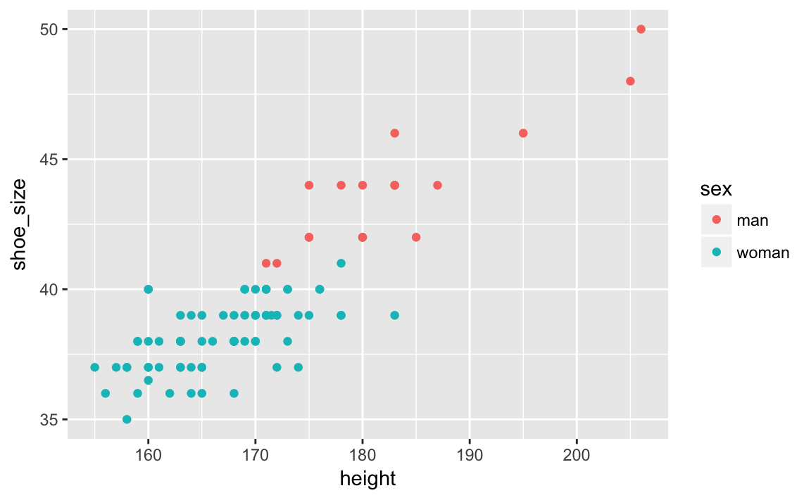
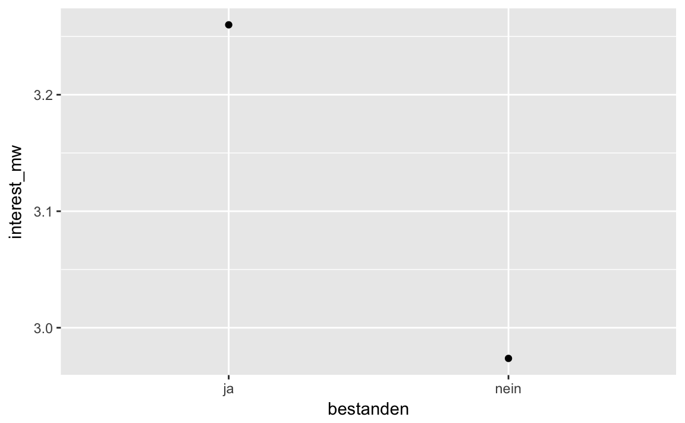

# Daten visualisieren


\BeginKnitrBlock{rmdcaution}<div class="rmdcaution">Lernziele:

- An einem Beispiel erläutern können, warum/ wann ein Bild mehr sagt, als 1000 Worte.
- Häufige Arten von Diagrammen erstellen können.
- Diagramme bestimmten Zwecken zuordnen können.

</div>\EndKnitrBlock{rmdcaution}


In diesem Kapitel werden folgende Pakete benötigt::

```r
library(tidyverse)  # Zum Plotten
# library(car)  # Umkodieren
# library(knitr)  # HTML-Tabellen
```


Dieses Kapitel erläutert das Daten visualisieren anhand des R-Pakets `ggplot2`.

## Ein Bild sagt mehr als 1000 Worte


Ein Bild sagt bekanntlich mehr als 1000 Worte. Schauen wir uns zur Verdeutlichung das berühmte Beispiel von Anscombe^[https://de.wikipedia.org/wiki/Anscombe-Quartett] an. Es geht hier um vier Datensätze mit zwei Variablen (Spalten; X und Y). Offenbar sind die Datensätze praktisch identisch: Alle X haben den gleichen Mittelwert und die gleiche Varianz; dasselbe gilt für die Y. Die Korrelation zwischen X und Y ist in allen vier Datensätzen gleich. Allerdings erzählt eine Visualisierung der vier Datensätze eine ganz andere Geschichte.


<div class="figure" style="text-align: center">

<p class="caption">(\#fig:fig-anscombe)Das Anscombe-Quartett</p>
</div>


Offenbar "passieren" in den vier Datensätzen gänzlich unterschiedliche Dinge. Dies haben die Statistiken nicht aufgedeckt; erst die Visualisierung erhellte uns... Kurz: Die Visualisierung ist ein unverzichtbares Werkzeug, um zu verstehen, was in einem Datensatz (und damit in der zugrunde liegenden "Natur") passiert. 


Es gibt viele Möglichkeiten, Daten zu visualisieren (in R). Wir werden uns hier auf einen Weg bzw. ein Paket konzentrieren, der komfortabel, aber mächtig ist und gut zum Prinzip des Durchpfeifens passt: `ggplot2`^["gg" steht für "grammer of graphics" nach einem Buch von Wilkinson[-@wilkinson2006grammar]; "plot" steht für "to plot", also ein Diagramm erstellen ("plotten"); vgl. https://en.wikipedia.org/wiki/Ggplot2].


## Die Anatomie eines Diagramms

`ggplot2` unterscheidet folgende Bestandteile ("Anatomie") eines Diagramms (vgl. Abb. \@ref(fig:fig-anatomie)):

- Daten
- Abbildende Aspekte (Achsen, Farben, ...)
- Geome (statistische Bilder wie Punkte, Linien, Boxplots, ...)


<div class="figure" style="text-align: center">

<p class="caption">(\#fig:fig-anatomie)Anatomie eines Diagramms</p>
</div>

Bei *Daten* muss ein Dataframe angegeben werden. Zu den *abbildenden Aspekte* (in `ggplot2` als "aesthetics" bezeichnet) zählen vor allem die Achsen, aber auch Farben u.a. Was ist mit abbildend gemeint? Weist man einer Achse einen Variable zu, so wird jede Ausprägung der Variablen einer Ausprägung der Achse zugeordnet (welcher Wert genau entscheidet `ggplot2` für uns, wenn wir es nicht explizieren). Mit *Geom* ist das eigentlich Art von "Bild" gemeint, wie Punkt, Linie oder Boxplot (vgl. Abschnitt \@ref(geome)).

## Einstieg in `ggplot2` - `qplot`

Los geht's! Laden wir zuerst den Datensatz `nycflights::flights`.


```r
data(flights, package = "nycflights13")
```


```r
qplot(x = carrier, y = arr_delay, geom = "boxplot", data = flights)
```

<div class="figure" style="text-align: center">

<p class="caption">(\#fig:fig-flights)Mittlere Verspätung nach Flugggesellschaft</p>
</div>

Schauen wir uns den Befehl `qplot` etwas näher an. Wie ist er aufgebaut?


\BeginKnitrBlock{rmdpseudocode}<div class="rmdpseudocode">`qplot`: Erstelle schnell (q wie quick in `qplot`) mal einen Plot (engl. "plot": Diagramm).    
`x`: Der X-Achse soll die Variable "carrier" zugeordnet werden.    
`y`: Der Y-Achse soll die Variable "arr_dely" zugeorndet werden.  
`geom`: ("geometriches Objekt") Gemalt werden soll ein Boxplot, nicht etwa Punkte, Linien oder sonstiges.   
`data`: Als Datensatz bitte `flights` verwenden.  
</div>\EndKnitrBlock{rmdpseudocode}


Offenbar gibt es viele Extremwerte, was die Verspätung betrifft. Das erscheint mir nicht unplausibel (Schneesturm im Winter, Flugzeug verschwunden...). Vor dem Hintergrund der Extremwerte erscheinen die mittleren Verspätungen (Mediane) in den Boxplots als ähnlich. Vielleicht ist der Unterschied zwischen den Monaten ausgeprägter?


```r
qplot(x = factor(month), y = arr_delay, geom = "boxplot", data = flights)
```


Kaum ein Unterschied ersichtlich; das spricht gegen die Schneesturm-Idee als Grund für Verspätung. Aber schauen wir uns zuerst die Syntax von `qplot` näher an. "q" in `qplot` steht für "quick". Tatsächlich hat `qplot` einen großen Bruder, `ggplot`^[Achtung: Nicht `qqplot`, nicht `ggplot2`, nicht `gplot`...], der deutlich mehr Funktionen aufweist - und daher auch die umfangreichere (=komplexere) Syntax. Fangen wir mit `qplot` an.


Diese Syntax des letzten Beispiels ist recht einfach, nämlich:


```r
qplot (x = X_Achse, y = Y_Achse, data = mein_dataframe, geom = "ein_geom")
```

Wir definieren mit `x`, welche Variable der X-Achse des Diagramms zugewiesen werden soll, z.B. `month`; analog mit Y-Achse. Mit `data` sagen wir, in welchem Dataframe die Spalten "wohnen" und als "geom" ist die Art des statistischen "*geom*etrischen Objects" gemeint, also Punkte, Linien, Boxplots, Balken...

## Häufige Arten von Diagrammen
Unter den vielen Arten von Diagrammen und vielen Arten, diese zu klassifizieren greifen wir uns ein paar häufige Diagramme heraus und schauen uns diese der Reihe nach an.


### Eine kontinuierliche Variable

Schauen wir uns die Verteilung der Schuhgrößen von Studierenden an.


```r
wo_men <- read.csv("data/wo_men.csv")

qplot(x = shoe_size, data = wo_men)
```


Weisen wir nur der X-Achse (aber nicht der Y-Achse) eine kontinuierliche Variable zu, so wählt `ggplot2` automatisch als Geom automatisch ein Histogramm; wir müssen daher nicht explizieren, dass wir ein Histogramm als Geom wünschen (aber wir könnten es hinzufügen). Alternativ wäre ein Dichtediagramm hier von Interesse:


```r
# qplot(x = shoe_size, data = wo_men)  wie oben

qplot(x = shoe_size, data = wo_men, geom = "density")
```


Was man sich merken muss, ist, dass hier nur das Geom mit Anführungsstrichen zu benennen ist, die übrigen Parameter *ohne*.

Vielleicht wäre es noch schön, beide Geome zu kombinieren in einem Diagramm. Das ist etwas komplizierter; wir müssen zum großen Bruder `ggplot` umsteigen, da `qplot` nicht diese Funktionen anbietet.


```r
ggplot(data = wo_men) +
  aes(x = shoe_size) +
  geom_histogram(aes(y = ..density..), alpha = .7) +
  geom_density(color = "blue")
```


Zuerst haben wir mit dem Parameter `data` den Dataframe benannt. `aes` definiert, welche Variablen welchen Achsen (oder auch z.B. Füllfarben) zugewiesen werden. Hier sagen wir, dass die Schuhgröße auf X-Achse stehen soll. Das `+`-Zeichen trennt die einzelnen Bestandteile des `ggplot`-Aufrufs voneinander. Als nächstes sagen wir, dass wir gerne ein Histogram hätten: `geom_histogram`. Dabei soll aber nicht wie gewöhnlich auf der X-Achse die Häufigkeit stehen, sondern die Dichte. `ggplot` berechnet selbständig die Dichte und nennt diese Variable `..density..`; die vielen Punkte sollen wohl klar machen, dass es sich nicht um eine "normale" Variable aus dem eigenen Datenframe handelt, sondern um eine "interne" Variable von `ggplot` - die wir aber nichtsdestotrotz verwenden können. `alpha` bestimmt die "Durchsichtigkeit" eines Geoms; spielen Sie mal etwas damit herum. Schließlich malen wir noch ein blaues Dichtediagramm *über* das Histogramm.

Wünsche sind ein Fass ohne Boden... Wäre es nicht schön, ein Diagramm für Männer und eines für Frauen zu haben, um die Verteilungen vergleichen zu können?


```r
qplot(x = shoe_size, data = wo_men, geom = "density", color = sex)
qplot(x = shoe_size, data = wo_men, geom = "density", fill = sex, alpha = I(.7))
```


Hier sollten vielleicht noch die Extremwerte entfernt werden, um den Blick auf das Gros der Werte nicht zu verstellen:


```r

wo_men %>% 
  filter(shoe_size <= 47) -> wo_men2

qplot(x = shoe_size, data = wo_men2, geom = "density", fill = sex, alpha = I(.7))
```


Besser. Man kann das Durchpfeifen auch bis zu `qplot` weiterführen:


```r
wo_men %>% 
  filter(shoe_size <= 47) %>% 
  qplot(x = shoe_size, data = ., geom = "density", fill = sex, alpha = I(.7))
```


Die Pfeife versucht im Standard, das Endprodukt des letzten Arbeitsschritts an den *ersten* Parameter des nächsten Befehls weiterzugeben. Ein kurzer Blick in die Hilfe von `qplot` zeigt, dass der erste Parameter nicht `data` ist, sondern `x`. Daher müssen wir explizit sagen, an welchen Parameter wir das Endprodukt des letzen Arbeitsschritts geben wollen. Netterweise müssen wir dafür nicht viel tippen: Mit einem schlichten Punkt `.` können wir sagen "nimm den Dataframe, so wie er vom letzten Arbeitsschritt ausgegeben wurde".

Mit `fill = sex` sagen wir `qplot`, dass er für Männer und Frauen jeweils ein Dichtediagramm erzeugen soll; jedem Dichtediagramm wird dabei eine Farbe zugewiesen (die uns `ggplot2` im Standard voraussucht). Mit anderen Worten: Die Werte von `sex` werden der Füllfarbe der Histogramme zugeordnet. Anstelle der Füllfarbe hätten wir auch die Linienfarbe verwenden können; die Syntax wäre dann: `color = sex`.

### Zwei kontinuierliche Variablen

Ein Streudiagramm ist die klassische Art, zwei metrische Variablen darzustellen. Das ist mit `qplot` einfach:


```r
qplot(x = height, y = shoe_size, data = wo_men)
```


Wir weisen wieder der X-Achse und der Y-Achse eine Variable zu; handelt es sich in beiden Fällen um Zahlen, so wählt `ggplot2` automatisch ein Streudiagramm - d.h. Punkte als Geom (`geom = "point"`). Wir sollten aber noch die Extremwerte herausnehmen:


```r
wo_men %>% 
  filter(height > 150, height < 210, shoe_size < 55) %>% 
  qplot(x = height, y = shoe_size, data = .)
```


Der Trend ist deutlich erkennbar: Je größer die Person, desto länger die Füß´. Zeichnen wir noch eine Trendgerade ein.


```r
wo_men %>% 
  filter(height > 150, height < 210, shoe_size < 55) %>% 
  qplot(x = height, y = shoe_size, data = .) +
  geom_smooth(method = "lm")
```


Synonym könnten wir auch schreiben:


```r
wo_men %>% 
  filter(height > 150, height < 210, shoe_size < 55) %>% 
  ggplot() +
  aes(x = height, y = shoe_size) +
  geom_point() +
  geom_smooth(method = "lm")
```

Da `ggplot` als *ersten* Parameter die Daten erwartet, kann die Pfeife hier problemlos durchgereicht werden. *Innerhalb* eines `ggplot`-Aufrufs werden die einzelne Teile durch ein Pluszeichen `+` voneinander getrennt. Nachdem wir den Dataframe benannt haben, definieren wir die Zuweisung der Variablen zu den Achsen mit `aes` ("aes" wie "aesthetics", also das "Sichtbare" eines Diagramms, die Achsen etc., werden definiert). Ein "Smooth-Geom" ist eine Linie, die sich schön an die Punkte anschmiegt, in diesem Falls als Gerade (lineares Modell, `lm`).

Bei sehr großen Datensätze, sind Punkte unpraktisch, da sie sich überdecken ("overplotting"). Ein Abhilfe ist es, die Punkte nur "schwach" zu färben. Dazu stellt man die "Füllstärke" der Punkte über `alpha` ein: `geom_point(alpha = 1/100)`. Um einen passablen Alpha-Wert zu finden, bedarf es häufig etwas Probierens. Zu beachten ist, dass es mitunter recht lange dauert, wenn `ggplot` viele (>100.000) Punkte malen soll.

Bei noch größeren Datenmengen bietet sich an, den Scatterplot als "Schachbrett" aufzufassen, und das Raster einzufärben, je nach Anzahl der Punkte pro Schachfeld; zwei Geome dafür sind `geom_hex()` und `geom_bin2d()`.


```r
data(flights, package = "nycflights13")
nrow(flights)  # groß!
#> [1] 336776

ggplot(flights) +
  aes(x = distance, y = air_time) +
  geom_hex()
```


Wenn man dies verdaut hat, wächst der Hunger nach einer Aufteilung in Gruppen.


```r

wo_men <- read.csv("data/wo_men.csv")

wo_men %>% 
  filter(height > 150, height < 210, shoe_size < 55) -> wo_men2

wo_men2 %>% 
  qplot(x = height, y = shoe_size, color = sex, data = .)
```


Mit `color = sex` sagen wir, dass die Linienfarbe (der Punkte) entsprechend der Stufen von `sex` eingefärbt werden sollen. Die genaue Farbwahl übernimmt `ggplot2` für uns.


Alternativ kann man auch zwei "Teil-Bildchen" ("facets") erstellen, eines für Frauen und eines für Männer:


```r
wo_men %>% 
  dplyr::filter(height > 150, height < 210, shoe_size < 55) %>% 
  qplot(x = height, y = shoe_size, facets = "~sex", color = sex, data = .)
```


Man beachte die Tilde `~`, die vor die "Gruppierungsvariable" `sex` zu setzen ist.

#### Vertiefung zu Facetten

Ein netter visueller Effekt wird erreicht, wenn in jeder Facette zwar alle Punkte gezeigt werden in einem leichten Grau. Aber farbig betont werden nur die Punkte, die zur jeweiligen Gruppe gehören. Der optische Eindruck erklärt es einfacher als Worte:


```r
wo_men %>% 
  dplyr::filter(height > 150, height < 210, shoe_size < 55) %>% 
  dplyr::select(-sex) -> wo_men4

wo_men4 %>% 
  ggplot(ggplot2::aes(x = height, y = shoe_size)) +
  geom_point(color = "grey80") +
  #facet_wrap(~sex) +
  geom_point(data = wo_men2, ggplot2::aes(color = sex))
  
```

<<<<<<< HEAD

=======

>>>>>>> debug


Der "ggplot-Trick" ist, zuerst die Punkte *ohne* Gruppierungsinformation (hier: `sex`) zu plotten. Danach plotten wir die nach Gruppenzugehörigkeit gefärbten Punkte.


### Eine diskrete Variable
Bei diskreten Variablen, vor allem nominalen Variablen, geht es in der Regel darum, Häufigkeiten auszuzählen. Wie viele Männer und Frauen sind in dem Datensatz?


```r
qplot(x = sex, data = wo_men)
```

<<<<<<< HEAD

=======

>>>>>>> debug

Falls nur die X-Achse definiert ist und dort eine Faktorvariable oder eine Text-Variable steht, dann nimmt `qplot` automatisch ein Balkendiagramm als Geom.

Entfernen wir vorher noch die fehlenden Werte:


```r
wo_men %>% 
  na.omit() %>% 
  qplot(x = sex, data = .)
```

<<<<<<< HEAD

=======

>>>>>>> debug

Wir könnten uns jetzt die Frage stellen, wie viele kleine und viele große Menschen es bei Frauen und bei den Männern gibt. Dazu müssen wir zuerst eine Variable wie "Größe gruppiert" erstellen mit zwei Werten: "klein" und "groß". Nennen wir sie `groesse_gruppe`


```r
wo_men$groesse_gruppe <- car::recode(wo_men$height, "lo:175 = 'klein'; else = 'gross'")

wo_men %>% 
  filter(height > 150, height < 210, shoe_size < 55) %>% 
  na.omit -> wo_men2
  
qplot(x = sex, fill = groesse_gruppe, data = wo_men2)
```

<<<<<<< HEAD

=======

>>>>>>> debug

In Worten sagt der `recode`-Befehl hier in etwa: "Kodiere `wo_men$height` um, und zwar vom kleinsten (`lo`) Wert bis 170 soll den Wert `klein` bekommen, ansonsten bekommt eine Größe den Wert `gross`".

Hier haben wir `qplot` gesagt, dass der die Balken entsprechend der Häufigkeit von `groesse_gruppe` füllen soll. Und bei den Frauen sind bei dieser Variablen die Werte `klein` häufig; bei den Männern hingegen die Werte `gross`.

Schön wäre noch, wenn die Balken Prozentwerte angeben würden. Das geht mit `qplot` (so) nicht; wir schwenken auf `ggplot` um^[Cleveland fände diese Idee nicht so gut.].


```r
wo_men2 %>% 
  ggplot() +
  aes(x = sex, fill = groesse_gruppe) +
  geom_bar(position = "fill")
```

<<<<<<< HEAD

=======

>>>>>>> debug

Schauen wir uns die Struktur des Befehls `ggplot` näher an.

\BeginKnitrBlock{rmdpseudocode}<div class="rmdpseudocode">
`wo_men2`:  Hey R, nimm den Datensatz `wo_men2` UND DANN...  
`ggpplot()` : Hey R, male ein Diagramm von Typ ggplot (mit dem Datensatz aus dem vorherigen Pfeifen-Schritt, d.h. aus der vorherigen Zeile, also `wo_men2`)!    
`+`:  Das Pluszeichen grenzt die Teile eines ggplot-Befehls voneinander ab.  
`aes`:  von "aethetics", also welche Variablen des Datensatzes den sichtbaren Aspekten (v.a. Achsen, Farben) zugeordnet werden.  
`x`: Der X-Achse (Achtung, `x` wird klein geschrieben hier) wird die Variable `sex` zugeordnet.   
`y`: gibt es nicht??? Wenn in einem ggplot-Diagramm *keine* Y-Achse definiert wird, wird ggplot automatisch ein Histogramm bzw. ein Balkendiagramm erstellen. Bei diesen Arten von Diagrammen steht auf der Y-Achse keine eigene Variable, sondern meist die Häufigkeit des entsprechenden X-Werts (oder eine Funktion der Häufigkeit, wie relative Häufigkeit).  
`fill` Das Diagramm (die Balken) sollen so gefüllt werden, dass sich die Häufigkeit der Werte von `groesse_gruppe` darin widerspiegelt.  

`geom_XYZ`: Als "Geom" soll ein Balken ("bar") gezeichnet werden.  Ein Geom ist in ggplot2 das zu zeichnende Objekt, also ein Boxplot, ein Balken, Punkte, Linien etc. Entsprechend wird gewünschte Geom mit `geom_bar`, `geom_boxplot`, geom_point` etc. gewählt.  

`position = fill`: `position_fill` will sagen, dass die Balken alls eine Höhe von 100% (1) haben. Die Balken zeigen also nur die Anteile der Werte der `fill`-Variablen. 
</div>\EndKnitrBlock{rmdpseudocode}


Die einzige Änderung in den Parametern ist `position = "fill"`. Dieser Parameter weist `ggplot` an, die Positionierung der Balken auf die Darstellung von Anteilen auszulegen. Damit haben alle Balken die gleiche Höhe, nämlich 100% (1). Aber die "Füllung" der Balken schwankt je nach der Häufigkeit der Werte von `groesse_gruppe` pro Balken (d.h. pro Wert von `sex`).

Wir sehen, dass die Anteile von großen bzw. kleinen Menschen bei den beiden Gruppen (Frauen vs. Männer) *unterschiedlich hoch* ist. Dies spricht für einen *Zusammenhang* der beiden Variablen; man sagt, die Variablen sind *abhängig* (im statistischen Sinne).

>    Je unterschiedlicher die "Füllhöhe", desto stärker sind die Variablen (X-Achse vs. Füllfarbe) voneinander abhängig (bzw. desto stärker der Zusammenhang). 


### Zwei diskrete Variablen 
Arbeitet man mit nominalen Variablen, so sind Kontingenztabellen Täglich Brot. Z.B.: Welche Produkte wurden wie häufig an welchem Standort verkauft? Wie ist die Verteilung von Alkoholkonsum und Körperform bei Menschen einer Single-Börse. Bleiben wir bei letztem Beispiel. 


```r
data(profiles, package = "okcupiddata")

profiles %>% 
  count(drinks, body_type) %>% 
  ggplot +
  aes(x = drinks, y = body_type, fill = n) +
  geom_tile() +
  theme(axis.text.x = element_text(angle = 90))
```

<<<<<<< HEAD

=======

>>>>>>> debug

Was haben wir gemacht? Also:


\BeginKnitrBlock{rmdpseudocode}<div class="rmdpseudocode">Nehme den Datensatz "profiles" UND DANN  
Zähle die Kombinationen von "drinks" und "body_type" UND DANN  
Erstelle ein ggplot-Plot UND DANN  
Weise der X-Achse "drinks" zu, der Y-Achse "body_type" und der Füllfarbe "n" UND DANN  
Male Fliesen UND DANN  
Passe das Thema so an, dass der Winkel für Text der X-Achse auf 90 Grad steht.  
</div>\EndKnitrBlock{rmdpseudocode}


     
Was sofort ins Auge sticht, ist dass "soziales Trinken", nennen wir es mal so, am häufigsten ist, unabhängig von der Körperform. Ansonsten scheinen die Zusammenhäng nicht sehr stark zu sein.     

### Zusammenfassungen zeigen
Manchmal möchten wir *nicht* die Rohwerte einer Variablen darstellen, sondern z.B. die Mittelwerte pro Gruppe. Mittelwerte sind eine bestimmte *Zusammenfassung* einer Spalte; also fassen wir zuerst die Körpergröße zum Mittelwert zusammen - gruppiert nach Geschlecht.


```r
wo_men2 %>% 
  group_by(sex) %>% 
  summarise(Groesse_MW = mean(height)) -> wo_men3

wo_men3
#> # A tibble: 2 × 2
#>      sex Groesse_MW
#>   <fctr>      <dbl>
#> 1    man        183
#> 2  woman        167
```


Diese Tabelle schieben wir jetzt in `ggplot2`; natürlich hätten wir das gleich in einem Rutsch durchpfeifen können.


```r
wo_men3 %>% 
  qplot(x = sex, y = Groesse_MW, data = .)
```

<<<<<<< HEAD

=======

>>>>>>> debug

Das Diagramm besticht nicht durch die Tiefe und Detaillierung. Wenn wir noch zusätzlich die Mittelwerte nach `Groesse_Gruppe` ausweisen, wird das noch überschaubar bleiben.


```r
wo_men2 %>% 
  group_by(sex, groesse_gruppe) %>% 
  summarise(Groesse_MW = mean(height)) %>% 
  qplot(x = sex, color = factor(groesse_gruppe), y = Groesse_MW, data = .)
```

<<<<<<< HEAD

=======

>>>>>>> debug

## Die Gefühlswelt von `ggplot2`

- Geben Sie eine *diskrete X-Achs*e an und *keine Y-AchseÜ, so greift qplot im Standard auf das Geom `bar` zurück (Balkendiagramm), falls Sie kein Geom angeben:


```r
qplot(x = smoker, data = tips)  # identisch zu
qplot(x = smoker, data = tips, geom = "bar)

```

- Geben Sie eine *kontinuierliche X-Achse* an und *keine Y-Achse*, so greift qplot im Standard auf das Geom `histogram` zurück (Histogramm).


```r
qplot(x = smoker, data = tips)  # identisch zu
qplot(x = smoker, data = tips, geom = "histogram")
```

- Geben Sie eine *kontinuierliche X-Achse* an und eine *kontinuierliche Y-Achse* an, so greift qplot im Standard auf das Geom `point` zurück (Streudiagramm).


```r
qplot(x = total_bill, y = tip, data = tips)  # identisch zu
qplot(x = total_bill, y=  tip, data = tips, geom = "point")
```

- Möchten Sie mehrere Geome für eine Variable darstellen, so muss die Variable diskret sein:


```r
#oh no: 
qplot(x = rating, y = affairs, geom = "boxplot", data = Affairs)

#oh yes: 
qplot(x = factor(rating), y = affairs, geom = "boxplot", data = Affairs)

#oh yes: 
qplot(x = gender, y = affairs, geom = "boxplot", data = Affairs)
```


## Aufgaben

1. Erzählen Sie einer vertrauenswürdigen Person jeweils eine "Geschichte", die das Zustandekommen der vier Plots von Anscombe (Abb. \@ref(fig:fig-anscombe)) erklärt!

1. Abb. \@ref(fig:fig-flights) stellt die mittlere Verspätung verschiedener Fluggesellschaften dar; als "Geom" wird ein Boxplot verwendet. Andere Geome wären auch möglich - aber wie sinnvoll wären sie?

Erstellen Sie ein Diagramm, welches Histogramme der Verspätung verwendet anstelle von Boxplots! Damit das Diagramm nicht so groß wird, nehmen Sie zur Gruppierung nicht `carrier` sondern `origin`.

Ist das Histogramm genauso erfolgreich wie der Boxplot, wenn es darum geht, viele Verteilungen vergleichend zu präsentieren? Warum?

1. Erstellen Sie ein sehr grobes und ein sehr feines Histogramm für die Schuhgröße!


1. Vertiefung: Erstellen Sie ein Diagramm, das sowohl eine Zusammenfassung (Mittelwert) der Körpergrößen nach Geschlecht darstellt als auch die einzelnen Werte darstellt!


## Lösungen

1. :-)

2. :


```r
qplot(x = arr_delay, geom = "histogram", data = flights, facets = "~origin")
```

<<<<<<< HEAD

=======

>>>>>>> debug

Der Boxplot ist besser geeignet, um mehrere Verteilungen vergleichend zu präsentieren. Durch die gleiche Ausrichtung der Boxplots ist es dem Auge viel einfacher, Vergleiche anzustellen im Vergleich zu den Histogrammen. Einen optisch schönenen Effekt könnte man mit `geom_jitter` anstelle von `geom_point`erreichen. Auch die Reihenfolge der beiden Geome könnte man umdrehen. Natürlich ist auch an Form, Größe und Farbe der Geome noch zu feilen.


3. :


```r
qplot(x = shoe_size, data = wo_men, bins = 10)
qplot(x = shoe_size, data = wo_men, bins = 50)
```

<<<<<<< HEAD

=======

>>>>>>> debug

4. :


```r
wo_men2 %>% 
  group_by(sex) %>% 
  summarise(height = mean(height)) -> wo_men3


wo_men3 %>% 
  ggplot() +
  aes(x = sex, y = height) +
  geom_point(color = "red", size = 8) +
  geom_point(data = wo_men2, color = "grey80")
```

<<<<<<< HEAD

=======

>>>>>>> debug

Der "Trick" ist hier, erst die zusammengefassten Daten in ein Geom zu stecken (`wo_men3`). Dann werden die Rohdaten (`wo_men2`) ebenfalls in ein Geom gepackt. Allerdings muss die Achsen-Beschriftung bei beiden Geomen identisch sein, sonst gibt es eine Fehlermeldung.


## Befehlsübersicht


Paket::Funktion        Beschreibung
-----------------      -------------
ggplot2::qplot         Malt schnell mal einen Plot
ggplot2::ggplot        Malt einen Plot
factor                 Wandelt einen Vektor in den Typ `factor` um


## Vertiefung: Geome bei ggplot2 {#geome}

Einen guten Überblick über Geome bietet das Cheatsheet von ggplot2^[https://www.rstudio.com/wp-content/uploads/2015/03/ggplot2-cheatsheet.pdf].

Verschiedenen Taxonomien von statistischen "Bildchen" sind denkbar; eine einfache ist die folgende; es wird nur ein Teil der verfügbaren Geome dargestellt.

1. Eine kontinuerliche Variable

<<<<<<< HEAD

=======

>>>>>>> debug


2. Zwei kontinuierliche Variablen

<<<<<<< HEAD

=======

>>>>>>> debug

3. Eine diskrete Variable (X-Achse)


```r

ggplot(tips) +
  aes(x = day) +
  geom_bar()
```

<<<<<<< HEAD

=======

>>>>>>> debug


4. Eine diskrete Variable auf der X-Achse und eine kontinuierliche Y-Achse

<<<<<<< HEAD

=======

>>>>>>> debug


## Verweise

- Einen Befehlsüberblick zu `ggplot2` findet sich hier: http://ggplot2.tidyverse.org/reference/.

- Edward Tufte gilt als Grand Seigneur der Datenvisualisierung; er hat mehrere lesenswerte Bücher zu dem Thema geschrieben [@1930824130; @1930824165; @1930824149].

- William Cleveland, ein amerikanischer Statistiker ist bekannt für seine grundlegenden, und weithin akzeptierten Ansätze für Diagramme, die die wesentliche Aussage schnörkellos transportieren [@Cleveland]. 

- Die (graphische) Auswertung von Umfragedaten basiert häufig auf Likert-Skalen. Ob diese metrisches Niveau aufweisen, darf bezweifelt werden. Hier findet sich einige vertiefenden Überlegungen dazu und zur Frage, wie Likert-Daten ausgewertet werden könnten: https://bookdown.org/Rmadillo/likert/. 

- Es finden sich viele Tutorials online zu `ggplot2`; ein deutschsprachiger Tutorial findet sich hier: http://md.psych.bio.uni-goettingen.de/mv/unit/ggplot2/ggplot2.html.


