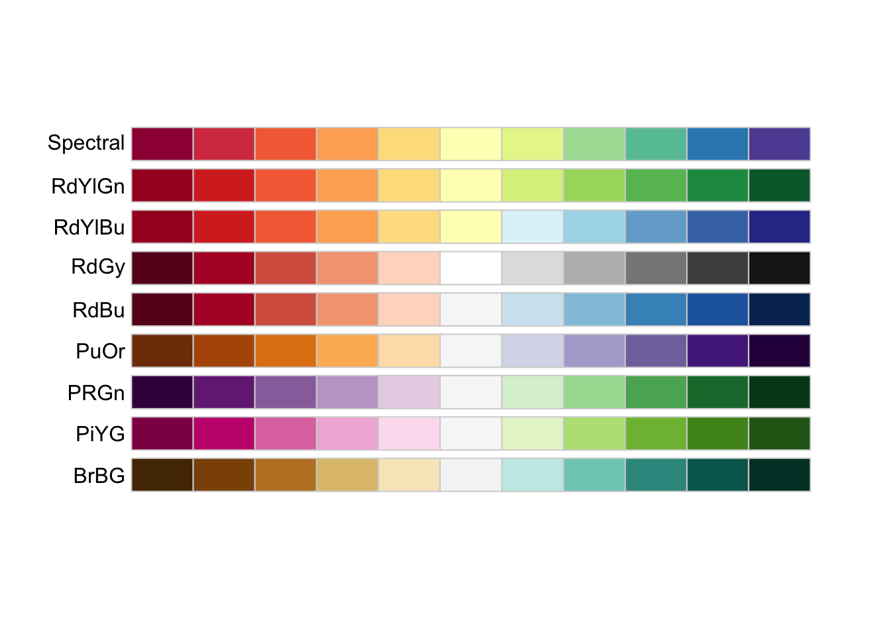
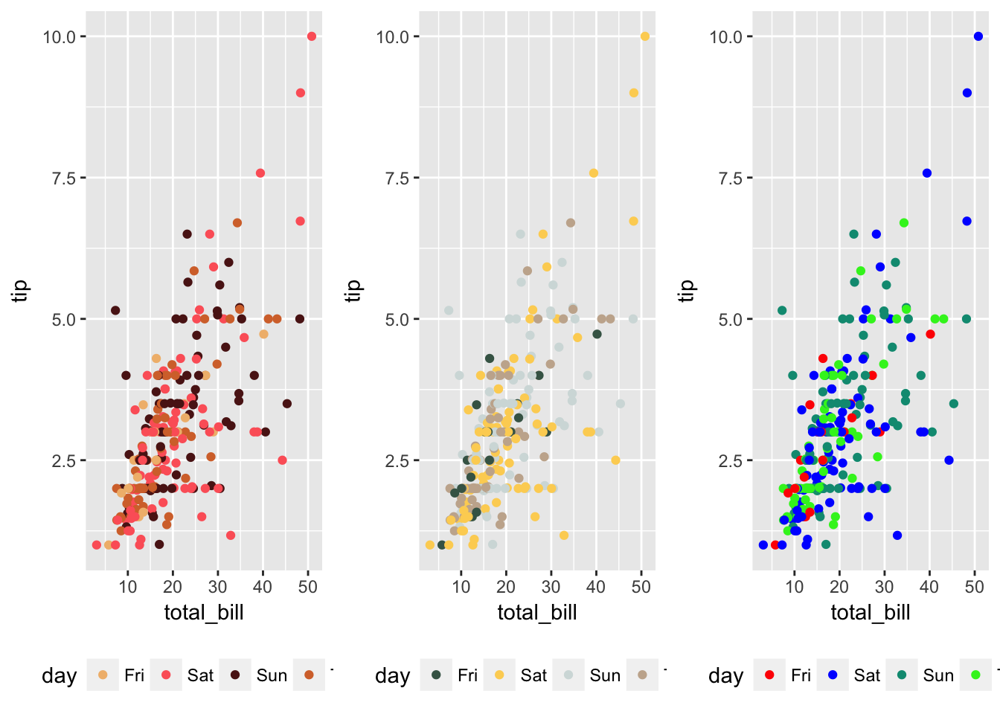
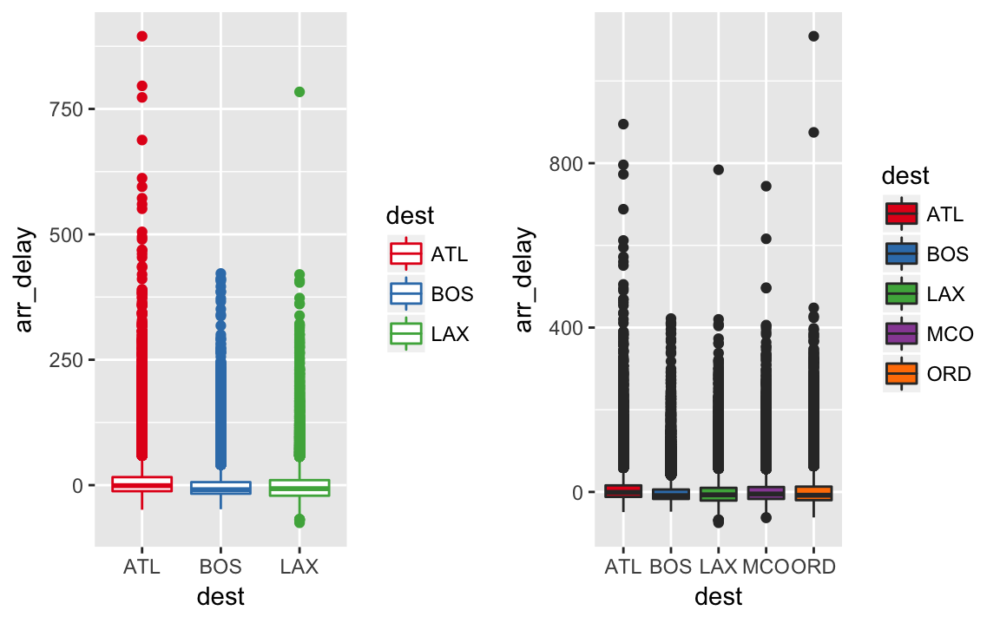
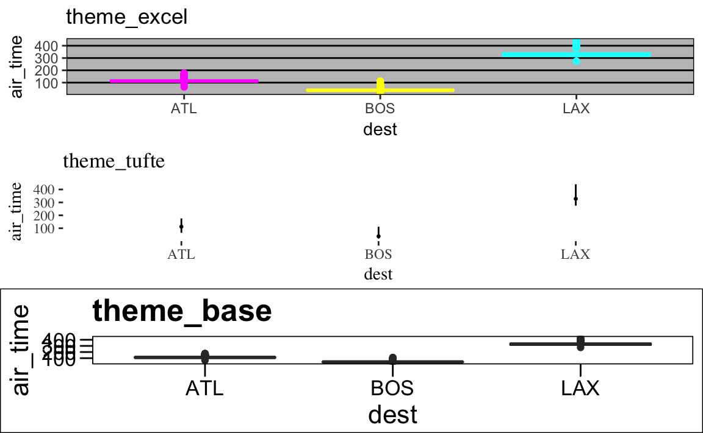

\BeginKnitrBlock{rmdcaution}<div class="rmdcaution">Lernziele:

- Mindestens eine bekannte Farbauswahl (Palette) nennen können.
- Farbpaletten bei ggplot2 anwenden können.
- Themen bei ggplot2 ändern können.

</div>\EndKnitrBlock{rmdcaution}

# Farben wählen

Benötigte Pakete:

```r
library(tidyverse)  # Zum Plotten
library(wesanderson)  # Farb-Palette von Wes Anderson
library(RColorBrewer)  # Farb-Palette von Cynthia Brewer
library(knitr)  # für HTML-Tabellen
library(gridExtra)  # für kombinierte Plots
library(ggthemes)  # für zusätzliche ggplot2-Themen (Layouts)

```


Erstens, nicht schaden - so könnte hier die Maßregel der der Wahl von Farben sein. Es ist leicht, zu grelle oder wenig kontrastierende Farben auszuwählen. Eine gute Farbauswahl (Palette) ist nicht so leicht und hängt vom Zweck der Darstellung ab.

## Die Farben von Cynthia Brewer

Cynthia Brewer^[http://colorbrewer2.org/#type=sequential&scheme=BuGn&n=3] hat einige schöne Farbpaletten zusammengestellt; diese sind in R und in ggplot2 über das Paket `RcolorBrewer` verfügbar. 


```r
brewer.pal.info %>% rownames_to_column %>% rename(Name = rowname) %>% kable
```


Name        maxcolors  category   colorblind 
---------  ----------  ---------  -----------
BrBG               11  div        TRUE       
PiYG               11  div        TRUE       
PRGn               11  div        TRUE       
PuOr               11  div        TRUE       
RdBu               11  div        TRUE       
RdGy               11  div        FALSE      
RdYlBu             11  div        TRUE       
RdYlGn             11  div        FALSE      
Spectral           11  div        FALSE      
Accent              8  qual       FALSE      
Dark2               8  qual       TRUE       
Paired             12  qual       TRUE       
Pastel1             9  qual       FALSE      
Pastel2             8  qual       FALSE      
Set1                9  qual       FALSE      
Set2                8  qual       TRUE       
Set3               12  qual       FALSE      
Blues               9  seq        TRUE       
BuGn                9  seq        TRUE       
BuPu                9  seq        TRUE       
GnBu                9  seq        TRUE       
Greens              9  seq        TRUE       
Greys               9  seq        TRUE       
Oranges             9  seq        TRUE       
OrRd                9  seq        TRUE       
PuBu                9  seq        TRUE       
PuBuGn              9  seq        TRUE       
PuRd                9  seq        TRUE       
Purples             9  seq        TRUE       
RdPu                9  seq        TRUE       
Reds                9  seq        TRUE       
YlGn                9  seq        TRUE       
YlGnBu              9  seq        TRUE       
YlOrBr              9  seq        TRUE       
YlOrRd              9  seq        TRUE       


- Kontrastierende Darstellung (nominale/ qualitative Variablen) - z.B. Männer vs. Frauen


```r
display.brewer.all(type="qual")
```


- Sequenzielle Darstellung (unipolare numerische Variablen) - z.B. Preis oder Häufigkeit

```r
display.brewer.all(type="seq")
```




- Divergierende Darstellung (bipolare numerische Variablen) - z.B. semantische Potenziale oder Abstufung von "stimme überhaupt nicht zu" über "neutral" bis "stimme voll und ganz zu"


```r
display.brewer.all(type="div")
```



In `ggplot2` können wir folgendermaßen Paletten ändern (dazu laden wir den Datensatz `flights` noch einmal, falls Sie ihn nicht mehr geladen haben).


```r

library(nycflights13)
data(flights)

flights %>% 
  group_by(dest) %>% 
  count(dest) %>% 
  top_n(5)
#> # A tibble: 5 × 2
#>    dest     n
#>   <chr> <int>
#> 1   ATL 17215
#> 2   BOS 15508
#> 3   LAX 16174
#> 4   MCO 14082
#> 5   ORD 17283

p1 <- flights %>% 
  filter(dest %in% c("BOS", "ATL", "LAX")) %>% 
  ggplot() +
  aes(x = dest, y = arr_delay, color = dest) +
  geom_boxplot() +
  scale_color_brewer(palette = "Set1")

p2 <- flights %>% 
  filter(dest %in% c("BOS", "ATL", "LAX", "MCO", "ORD")) %>% 
  ggplot() +
  aes(x = dest, y = arr_delay, fill = dest) +
  geom_boxplot() +
  scale_fill_brewer(palette = "Set1")

grid.arrange(p1, p2, ncol = 2)
```



`scale_color_brewer` meint hier: "Ordne der Variablen, die für 'color' zuständig ist, hier `sex`, eine Farbe aus der Brewer-Palette 'Set1' zu". Die Funktion wählt *automatisch* die richtige Anzahl von Farben.

Man beachte, dass die Linienfarbe über `color` und die Füllfarbe über `fill` zugewiesen wird. Punkte haben nur eine Linienfarbe, keine Füllfarbe.


## Die Farben von Wes Anderson

Auch die Farbpaletten von Wes Anderson sind erbaulich^[https://github.com/karthik/wesanderson]. Diese sind nicht "hart verdrahtet" in ggplot2, sondern werden über `scale_XXX_manual` zugewiesen (wobei XXX z.B. `color` oder `fill` sein kann).


```r
data(tips, package = "reshape2")

p1 <- tips %>% 
  ggplot() +
  aes(x = total_bill, y = tip, color = day) +
  geom_point() +
  scale_color_manual(values = wes_palette("GrandBudapest")) +
  theme(legend.position = "bottom")

p2 <- tips %>% 
  ggplot() +
  aes(x = total_bill, y = tip, color = day) +
  geom_point() +
  scale_color_manual(values = wes_palette("Chevalier"))  +
  theme(legend.position = "bottom")

meine_farben <- c("red", "blue", "#009981", "#32F122")

p3 <- tips %>% 
  ggplot() +
  aes(x = total_bill, y = tip, color = day) +
  geom_point() +
  scale_color_manual(values = meine_farben)  +
  theme(legend.position = "bottom")

grid.arrange(p1, p2, p3, ncol = 3)
```


Wer sich berufen fühlt, eigene Farben (oder die seiner Organisation zu verwenden), kommt auf ähnlichem Weg zu Ziel. Man definiere sich seine Palette, wobei ausreichend Farben definiert sein müssen. Diese weist man dann über `scale_XXX_manual` dann zu. Man kann einerseits aus den in R definierten Farben auswählen^[http://sape.inf.usi.ch/quick-reference/ggplot2/colour] oder sich selber die RBG-Nummern (in Hexadezimal-Nummern) heraussuchen.


## Themen ändern
Ein "Thema" bei `ggplot2` umfasst die Gestaltung aller Aspekte eines Diagramms, welche nicht die Daten betreffen, also Axen, Hintergrund, Titel etc^[http://docs.ggplot2.org/dev/vignettes/themes.html]. `ggplot2` kommt mit einer Auswahl an "eingebauten" Themen, aber es gibt noch einige weitere Themen in anderen Paketen.

Betrachten wir zuerst die "Standard-Themen":


```r
p1 <- flights %>% 
  filter(dest %in% c("BOS", "ATL", "LAX")) %>% 
  ggplot() +
  aes(x = dest, y = air_time) +
  geom_boxplot() +
  theme_classic() +
  ggtitle("theme_classic") +
  theme(legend.position = "none")

p2 <- flights %>% 
  filter(dest %in% c("BOS", "ATL", "LAX")) %>% 
  ggplot() +
  aes(x = dest, y = air_time) +
  geom_boxplot() +
  theme_bw()  +
  theme(legend.position = "none") +
  ggtitle("theme_bw") 
  

p3 <- flights %>% 
  filter(dest %in% c("BOS", "ATL", "LAX")) %>% 
  ggplot() +
  aes(x = dest, y = air_time) +
  geom_boxplot() +
  theme_minimal() +
  theme(legend.position = "none") +
  ggtitle("theme_minimal") 

p4 <- flights %>% 
  filter(dest %in% c("BOS", "ATL", "LAX")) %>% 
  ggplot() +
  aes(x = dest, y = air_time) +
  geom_boxplot() +
  theme_void() +
  theme(legend.position = "none") +
  ggtitle("theme_void") 


p5 <- flights %>% 
  filter(dest %in% c("BOS", "ATL", "LAX")) %>% 
  ggplot() +
  aes(x = dest, y = air_time) +
  geom_boxplot() +
  theme_gray() +
  theme(legend.position = "none") +
  ggtitle("theme_gray (Standard(") 

grid.arrange(p1, p2, p3, p4, p5, ncol = 1)
```


Mit  `theme(legend.position = "none")` kann man noch die Legende abschalten.


Über das Paket `ggthemes`^[https://cran.r-project.org/web/packages/ggthemes/vignettes/ggthemes.html] kann man ein gutes Dutzend Themen anfordern:


```r
p1 <- flights %>% 
  filter(dest %in% c("BOS", "ATL", "LAX")) %>% 
  ggplot() +
  aes(x = dest, y = air_time, color = dest) +
  geom_boxplot() +
  theme_excel() +
  ggtitle("theme_excel") +
  theme(legend.position = "none") + scale_colour_excel()

p2 <- flights %>% 
  filter(dest %in% c("BOS", "ATL", "LAX")) %>% 
  ggplot() +
  aes(x = dest, y = air_time) +
  geom_tufteboxplot() +
  theme_tufte()  +
  theme(legend.position = "none") +
  ggtitle("theme_tufte") 
  

p3 <- flights %>% 
  filter(dest %in% c("BOS", "ATL", "LAX")) %>% 
  ggplot() +
  aes(x = dest, y = air_time) +
  geom_boxplot() +
  theme_base() +
  theme(legend.position = "none") +
  ggtitle("theme_base") 


grid.arrange(p1, p2, p3, ncol = 1)
```




Weitere Themes sind verfügbar^[https://github.com/ricardo-bion/ggtech]. Ein recht schönes, weil klares Design (Theme) für ggplot2 bietet `cowplot`.


```r
library(cowplot) # ein weiteres Theme für ggplot2

flights %>% 
  filter(dest %in% c("BOS", "ATL", "LAX")) %>% 
  ggplot() +
  aes(x = dest, y = air_time, color = dest) +
  geom_boxplot() 
```


