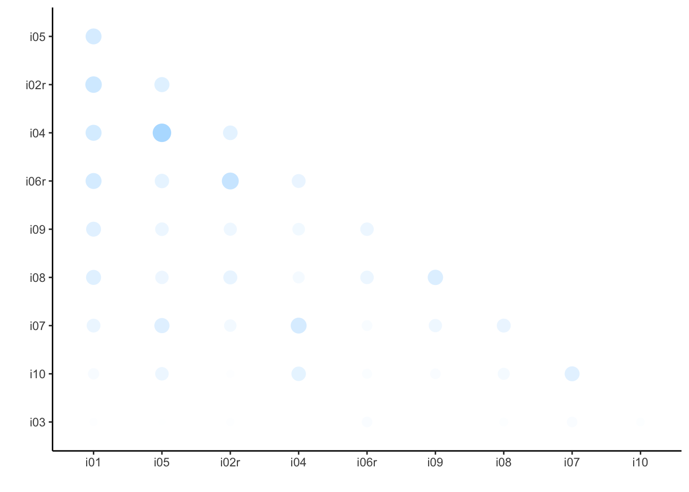

# Erweiterungen für `ggplot2`

Für `ggplot2` gibt es eine Reihe von Erweiterungen^[http://www.ggplot2-exts.org]; einige stellen wir hier vor.


## ggpairs

Benötigte Pakete:

```r
library(ggplot2)
library(corrr)
```

```
## Loading required package: dplyr
```

```
## 
## Attaching package: 'dplyr'
```

```
## The following objects are masked from 'package:stats':
## 
##     filter, lag
```

```
## The following objects are masked from 'package:base':
## 
##     intersect, setdiff, setequal, union
```

```r
library(GGally)
```

```
## 
## Attaching package: 'GGally'
```

```
## The following object is masked from 'package:dplyr':
## 
##     nasa
```

Laden wir zuerst, falls noch nicht geschehen, Daten:


```r
tips <- read.csv("https://sebastiansauer.github.io/data/tips.csv") 
```


Um eine Streudiagramm-Matrix darzustellen, ist der Befehl `GGally::ggpairs` praktisch:


```r
tips %>% 
  ggpairs(aes(color = sex), columns = c("total_bill", "smoker", "tip"))
```

```
## `stat_bin()` using `bins = 30`. Pick better value with `binwidth`.
## `stat_bin()` using `bins = 30`. Pick better value with `binwidth`.
```


Dabei gibt man an, welche Variable (hier `sex`) für die Farben im Diagramm zuständig sein soll (wir ordnen den Werten von `sex` jeweils eine Farbe zu). Mit `columns` sagen wir, welche Spalten des Dataframes wir dargestellt haben möchten. Lassen wir diesen Parameter weg, so werden alle Spaltne des Dataframes dargestellt.


## Correlationsplots
Mit dem Paket `corrr` lassen sich mehrere Korrelationskoeffizienten auf einmal visualisieren. 


```r
df <- read.csv("https://osf.io/meyhp/?action=download")


df %>% 
  select(i01:i10) %>%   # Spalten wählen
  correlate() %>%   # Korrelationsmatrix berechnen
  rearrange() %>%   # Korrelation der Stärke nach ordnen  
  shave() %>%   # das obere Dreieck ist redundant, rasieren wir ab
  rplot()  # plotten
```

<div class="figure">

<p class="caption">(\#fig:unnamed-chunk-4)Korr</p>
</div>

 

## Weitere
Hier finden sich viele weitere Ergänzungen für ggplot2: https://www.ggplot2-exts.org

