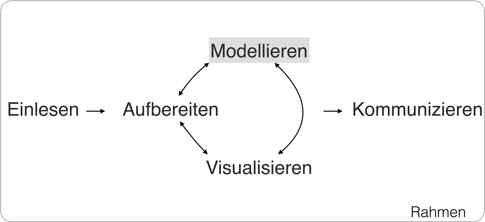
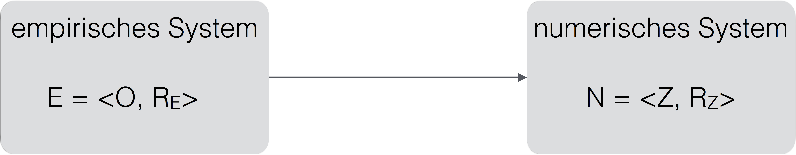
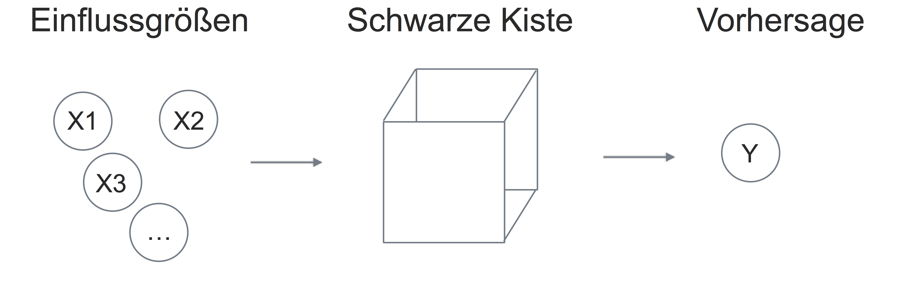
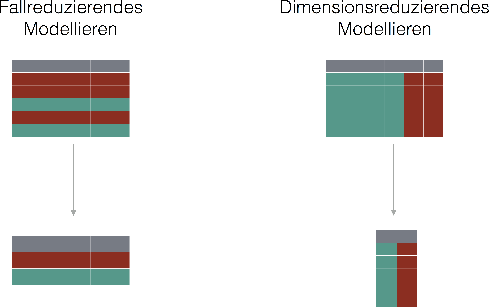
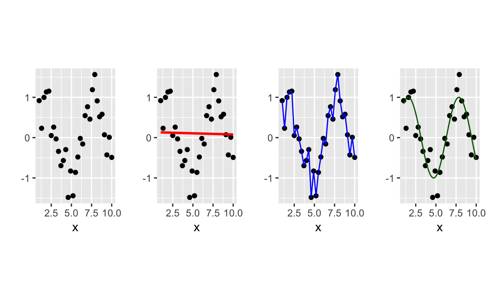
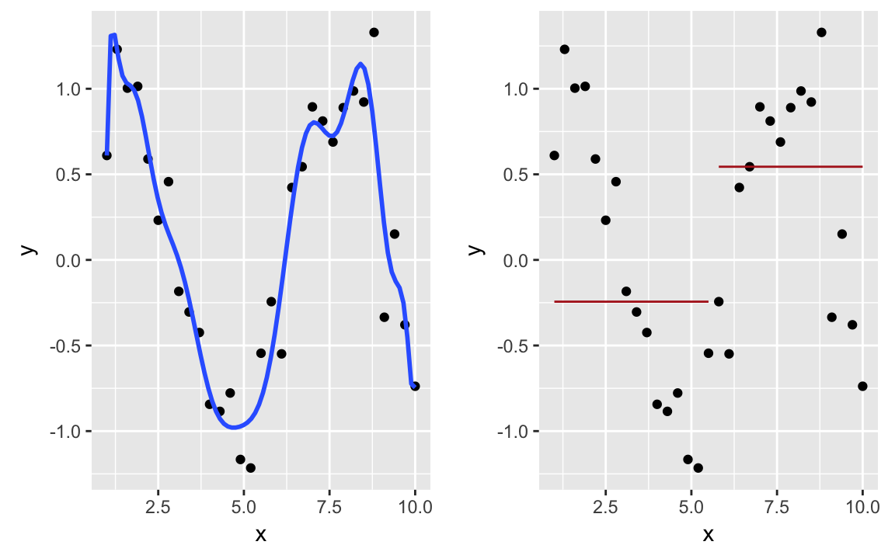

# Grundlagen des Modellierens {#mod1}


\BeginKnitrBlock{rmdcaution}<div class="rmdcaution">Lernziele:

- Erläutern können, was man unter einem Modell versteht.
- Die Ziele des Modellieren aufzählen und erläutern können.
- Die Vor- und Nachteile von einfachen vs. komplexen Modellen vergleichen können.
- Wissen, was man unter "Bias-Varianz-Abwägung" versteht.
- Um die Notwendigkeit von Trainings- und Test-Stichproben wissen.
- Wissen, was man unter Modellgüte versteht.
- Um die Schwierigkeiten der Prädiktorenauswahl wissen.

</div>\EndKnitrBlock{rmdcaution}


In diesem Kapitel benötigen wir diese Pakete:

```r
library(tidyverse)
```





## Was ist ein Modell? Was ist Modellieren? {#Modellieren}

In diesem Kapitel geht es um *Modelle* und *Modellieren*; aber was ist das eigentlich? Seit dem 16. Jahrhundert wird mit dem italienischen Begriff *modelle* ein verkleinertes Muster, Abbild oder Vorbild für ein Handwerksstück benannt [@gigerenzer1980]. Prototisch für ein Modell ist - wer hätt's gedacht - ein Modellauto (s. Abb. \@ref(fig:vwmodell)).

<div class="figure" style="text-align: center">

<p class="caption">(\#fig:vwmodell)Modell eines VW-Käfers</p>
</div>

In die Wissenschaft kam der Begriff in der Zeit nach Kant, als man sich klar wurde, dass (physikalische) Theorien nicht die Wirklichkeit als solche zeigen, sondern ein *Modell* davon. Modellieren ist eine grundlegenden Tätigkeit, derer sich Menschen fortlaufend bedienen, um die Welt zu *verstehen*. Denn das Leben ist schwer... oder sagen wir: komplex. Um einen Ausschnitt der Wirklichkeit zu verstehen, erscheint es daher sinnvoll, sich einige als wesentlich erachteten Aspekte "herauszugreifen" bzw. auszusuchen und sich nur noch deren Zusammenspiel näher anzuschauen. Modelle sind häufig vereinfachend: es wird nur ein Ausschnitt der Wirklichkeit berücksichtigt.

Manche Aspekte der Wirklichkeit sind wirklicher als andere: Interessiert man sich für den Zusammenhang von Temperatur und Grundwasserspiegel, so sind diese Dinge direkt beobachtbar. Interessiert man sich hingegen für Lebensqualität und Zufriedenheit, so muss man diese Untersuchungsgegenstände erst konstruieren, da Lebensqualität nicht direkt beobachtbar ist. Sprechen wir daher von Wirklichkeit lieber vorsichtiger vom *Gegenstandsbereich*, also den *konstruierten Auszug der Wirklichkeit* für den sich die forschende Person interessiert. Bestenfalls (er)findet man eine *Annäherung* an die Wirklichkeit, schlechterenfalls eine *verzerrte*, gar *grob falsche* Darstellung (vgl. Abb. \@ref(fig:modellieren-plot)). Da keine Wiedergabe der Wirklichkeit perfekt ist, sind streng genommen alle Modelle "falsch" in diesem Sinne.


<div class="figure" style="text-align: center">

<p class="caption">(\#fig:modellieren-plot)Modellieren</p>
</div>


Damit verstehen wir *Modellieren als eine typische Aktivität von Menschen* [@gigerenzer1980], genauer *eines Menschen* mit einem *bestimmten Ziel*. Wir können gar nicht anders, als uns ein Modell unserer Umwelt zu machen. Vielfältige Medien kommen dazu in Frage: Bilder, Geschichten, Logik, Gleichungen. Wir werden uns hier auf eine bestimmte Art formalisierter Modelle, *numerische* Modelle, konzentrieren, weil es dort am einfachsten ist, die Informationen auf präzise Art und Weise herauszuziehen. Allgemein gesprochen ist hier unter Modellieren der Vorgang gemeint, ein Stück Wirklichkeit ("Empirie") in eine mathematische Struktur zu übersetzen. 

Wirklichkeit kann dabei als *empirisches System* bezeichnet werden, welches aus einer oder mehr Mengen von Objekten besteht, die zu einander in bestimmten Beziehungen stehen. Ein Bespiel wäre eine Reihe von Personen, die in bestimmten Größe-Relationen zueinander stehen oder eine Reihe von Menschen, bei denen die Füße tendenziell größer werden, je größer die Körpergröße ist. 

Mit mathematische Struktur ist ein formalisiertes Pendant zum empirischen System gemeint, daher spricht man von einem *numerischen System*. Auch hier gibt es eine Reihe von (mathematischen) Objekten wie Zahlen oder Vektoren. Diese mathematischen Objekten stehen ebenfalls in gewissen Relationen zueinander. Der springende Punkt ist: die Beziehungen zwischen den mathematischen Objekten sollen die Beziehungen zwischen den empirischen Objekten widerspiegeln. Was heißt das? Ist Anna (Person A) größer als Berta (Berson B), so soll die Zahl von Anna größer sein als die Zahl von Berta. Oder: Anna hat ein große Körpergröße (KG) und eine große Schuhgröße (SG); Berta ist kleiner, daher soll gelten $KG_A > KG_B \wedge SG_A > SG_B$.

Sprich: Die Relation im empirischen System findet sich im numerischen System wieder.

<div class="figure" style="text-align: center">

<p class="caption">(\#fig:modellieren-formal)Formaleres Modell des Modollierens</p>
</div>

In gewisser Weise gibt es keine Modelle. Es gibt nur "Modelle von" etwas; dieser Satz soll zeigen, dass zwar ein empirisches System für sich alleine stehen kann, aber ein Modell nicht. Ein Modell verweist immer auf ein empirisches System.

Abb. \@ref(fig:modellieren-formal) stellt diese formalere Sichtweise des Modellierens dar; das empirische System *E* wird dem numerische System *Z* zugeordnet. Dabei besteht E aus einer Menge von Objekten *O* sowie einer Menge von Relationen R_E (Relationen zwischen den Elementen von O). Analog besteht Z aus einer Menge von numerischen Objekten *Z* sowie einer Menge von Relationen R_Z (Relationen zwischen den Elementen von Z)^[Diese Sichtweise des Modellierens basiert auf der Repräsentationstheorie des Messens nach Suppes und Zinnes [-@suppes1962basic] zurück; vgl. @gigerenzer1980].


## Ein Besipiel zum Modellieren in der Datenanalyse

Schauen wir uns ein Beispiel aus der Datenanalyse an; laden Sie dazu zuerst den Datensatz `wo_men`.


<div class="figure" style="text-align: center">

<p class="caption">(\#fig:plot-women)Ein Beispiel für Modellieren</p>
</div>


Im ersten Plot von Abb. \@ref(fig:plot-women) sehen wir - schon übersetzt in eine Datenvisualisierung - den Gegenstandsbereich. Dort sind einige Objekte zusammen mit ihren Relationen abgebildet (Körpergröße und Schuhgröße). Der rechte Plot spezifiziert nun diesen Einfluss: Es wird ein *linearer Zusammenhang* (eine Gerade) zwischen Körpergröße und Schuhgröße unterstellt. 

Im nächsten Plot (Abb. \@ref(fig:mod-beispiel)) sehen wir ein Schema dazu, ein sog. *Pfadmodell*. Noch ist das Modell recht unspezifisch; es wird nur postuliert, dass Körpergröße auf Schuhgröße einen linearen Einfluss habe. Linear heißt hier, dass der Einfluss von Körpergröße auf Schuhgröße immer gleich groß ist, also unabhängig vom Wert der Körpergröße.


<div class="figure" style="text-align: center">

<p class="caption">(\#fig:mod-beispiel)Ein Beispiel für ein Pfadmodell</p>
</div>


Ein etwas aufwändigeres Modell könnte so aussehen (Abb. \@ref(fig:plot-modell-bsp2):

<div class="figure" style="text-align: center">

<p class="caption">(\#fig:plot-modell-bsp2)Ein etwas aufwändigeres Modell</p>
</div>


Allgemeiner formuliert, haben wir einen oder mehrere *Eingabegrößen*\index{Einflussgrößen} bzw. *Prädiktoren*\index{Prädiktoren}, von denen wir annehmen, dass sie einen Einfluss haben auf genau eine *Zielgröße* (*Ausgabegröße*) bzw. *Kriterium*\index{Kriterium}.


\BeginKnitrBlock{rmdcaution}<div class="rmdcaution">
*Einfluss* ist hier *nicht* kausal gemeint, auch wenn es das Wort so vermuten lässt. Stattdessen ist nur ein statistischer Einfluss gemeint; letztlich nichts anderes als ein Zusammenhang. In diesem Sinne könnte man postulieren, dass die Größe des Autos, das man fährt einen "Einfluss" auf das Vermögen des Fahrers habe. Empirisch ist es gut möglich, dass man Belege für dieses Modell findet. Jedoch wird dieser Einfluss nicht kausal sein (man informiere mich, wenn es anders sein sollte).
</div>\EndKnitrBlock{rmdcaution}


Modelle, wie wir sie betrachten werden, postulieren eine quantifizierbaren Zusammenhang zwischen diesen beiden Arten von Größen - Prädiktoren und Kriterien. Wir gehen dabei nicht davon aus, dass unsere Modelle perfekt sind, sondern dass Fehler passieren. Damit lassen sich unsere Modelle in drei Aspekte gliedern.

<div class="figure" style="text-align: center">

<p class="caption">(\#fig:fig-blackbox)Modelle mit schwarzer Kiste</p>
</div>


Die Einflussgrößen werden in einer "schwarzen Kiste", die wir hier noch nicht näher benennen, irgendwie verwurstet, will sagen, verrechnet, so dass ein *geschätzter* Wert für das Kriterium, eine *Vorhersage* "hinten bei rauskommt"^[das ist schließlich entscheidend - frei nach Helmut Kohl.]. Mathematischer ausgedrückt:

$$Y = f(X) + \epsilon$$

Hier stehen $Y$ für das Kriterium, $X$ für den oder die Prädiktoren, $f$ für die "schwarze Kiste" und $\epsilon$ für den Fehler, den wir bei unserer Vorhersage begehen. Durch den Fehlerterm in der Gleichung ist das Modell *nicht*  *deterministisch*\index{deterministisch}, sondern beinhaltet erstens einen funktionalen Term ($Y=f(x)$) und zweitens einen *stochastischen* Term ($\epsilon$). Die schwarze Kiste könnte man auch als eine "datengenerierende Maschine" bezeichnen.

Übrigens: Auf das Skalenniveau der Eingabe- bzw. Ausgabegrößen (qualitativ vs. quantitativ) kommt es hier nicht grundsätzlich an; es gibt Modelle für verschiedene Skalenniveaus bzw. Modelle, die recht anspruchslos sind hinsichtlich des Skalenniveaus (sowohl für Eingabe- als auch Ausgabegrößen). Was die Ausgabegröße (das Kriterium) betrifft, so "fühlen" qualitative Variablen von quantitativen Variablen anders an. Ein Beispiel zur Verdeutlichung: "Gehört Herr Bussi-Ness zur Gruppe der Verweigerer oder der Wichtigmacher?" (qualitatives Kriterium); "Wie hoch ist der Wichtigmacher-Score von Herrn Bussi-Ness?" (quantitatives Kriterium). Ein Modell mit qualitativem Kriterium bezeichnet man auch als *Klassifikation*\index{Klassifikation}; ein Modell mit quantitativem Kriterium bezeichnet man auch als *Regression*\index{Klassifikation}. Bei letzterem Begriff ist zu beachten, dass er *doppelt* verwendet wird. Neben der gerade genannten Bedeutung steht er auch für ein häufig verwendetes Modell - eigentlich das prototypische Modell - für quantitative Kriterien.


## Taxonomie der Ziele des Modellierens {#Ziele}

Modelle kann man auf vielerlei Arten gliedern; für unsere Zwecke ist folgende Taxonomie der Ziele von Modellieren nützlich.

---


- Geleitetes Modellieren
    - Prädiktives Modellieren
    - Explikaties Modellieren
- Ungeleitetes Modellieren
    - Dimensionsreduzierendes Modellieren
    - Fallreduzierendes Modellieren
  
---

Betrachten wir diese vier Ziele des Modellierens genauer.


*Geleitetes Modellieren*\index{Geleitetes Modellieren} ist jede Art des Modellierens, wo die Variablen in Prädiktoren und Kriterien unterteilt werden, z.B. Abb. \@ref(fig:mod-beispiel). Man könnte diese Modelle einfach dastellen als "X führt zu Y". 

*Prädiktives Modellieren*\index{Prädiktives Modellieren} könnte man kurz als *Vorhersagen*\index{Vorhersagen} bezeichnen. Hier ist das Ziel, eine Black Box geschickt zu wählen, so dass der Vohersagefehler möglichst klein ist. Man zielt also darauf ab, möglichst exakte Vorhersagen zu treffen. Sicherlich wird der Vorhersagefehler kaum jemals Null sein; aber je präziser, desto besser. Das Innenleben der "schwarzen Kiste" interessiert uns hier *nicht*.

*Explikatives Modellieren*\index{Explikatives Modellieren} oder kurz *Erklären*\index{Erklären} bedeutet, verstehen zu wollen, *wie* oder *warum* sich ein Kriteriumswert so verändert, wie er es tut. Auf *welche Art* werden die Prädiktoren verrechnet, so dass eine bestimmter Kriteriumswert resultiert? Welche Prädikatoren sind dabei (besonders) wichtig? Ist die Art der Verrechnung abhängig von den Werten der Prädiktoren? Hierbei interessiert uns vor allem die *Beschaffenheit* der schwarzen Kiste; die Güte der Vorhersage ist zweitrangig.

Vorhersagen und Erklären haben gemein, dass Eingabegrößen genutzt werden, um Aussagen über einen Ausgabegröße zu treffen. Hat man einen Datensatz, so kann man prüfen, *wie gut* das Modell funktioniert, also wie genau man die Ausgabewerte vorhergesagt hat. Das ist also eine Art "Lernen mit Anleitung" oder *angeleitetes Lernen*\index{angeleitetes Lernen} oder *geleitetes Modellieren* (engl. *supervised learning*). Abbildung \@ref(fig:fig-blackbox) gibt diesen Fall wieder.


Beim *ungeleiteten Modellieren*\index{Ungeleiteten Modellieren} entfällt die Unterteilung zwischen Prädiktor und Kriterium. Ungeleitetes Modelieren (*Reduzieren*\index{Reduzieren}) meint, dass man die Fülle des Datenmaterials verringert, in dem man ähnliche Dinge zusammenfasst (vgl. Abb. \@ref(fig:ungeleitetes-modellieren)).

<div class="figure" style="text-align: center">

<p class="caption">(\#fig:ungeleitetes-modellieren)Die zwei Arten des ungeleiteten Modellierens</p>
</div>


Fässt man *Fälle* zusammen, so spricht man von *Fallreduzierendem Modellieren*\index{Fallreduzierendes Modellieren}. Zum Beispiel könnte man spektakulärerweise "Britta", "Carla" und "Dina" zu "Frau" und "Joachim", "Alois" und "Casper" zu "Mann" zusammen fassen.

Analog spricht man von *Dimensionsreduzierendes Modellieren*\index{Dimensionsreduzierendes Modellieren} wenn Variablen zusammengefasst werden. Hat man z.B. einen Fragebogen zur Mitarbeiterzufriedenheit mit den Items "Mein Chef ist fair", "Mein Chef ist kompetent", "Meinem Chef ist meine Karriere wichtig", so könnte man - wenn die Daten dies unterstützen - die Items zu einer Variable "Zufriedenheit mit Chef" zusammenfassen.


Wenn also das Ziel des Modellieren lautet, die Daten zu reduzieren, also z.B. Kunden nach Persönlichkeit zu gruppieren, so ist die Lage anders als beim geleiteten Modellieren: Es gibt keine Zielgröße. Wir wissen nicht, was die "wahre Kundengruppe" von Herrn Casper Bussi-Ness ist. Wir sagen eher, "OK, die drei Typen sind sich irgendwie ähnlich, sie werden wohl zum selben Typen von Kunden gehören". Wir tappen (noch mehr) in Dunkeln, was die "Wahrheit" ist. Unser Modell muss ohne Hinweise darauf, was richtig ist auskommen. Man spricht daher in diesem Fall von *Lernen ohne Anleitung*\index{Lernen ohne Anleitung} oder *ungeleitetes Modellieren* (engl. *unsupervised learning*\index{unsupervised learning}).


## Die vier Schritte des statistischen Modellierens

Modellieren ist in der Datenanalyse bzw. in der Statistik eine zentrale Tätigkeit. Modelliert man in der Statistik, so führt man die zwei folgenden Schritte aus:

1. Man wählt eines der vier Ziele des Modellierens (z.B. ein prädiktives Modell).
1. Man wählt ein Modell aus (genauer: eine Modellfamilie), z.B. postuliert man, dass die Körpergröße einen linearen Einfluss auf die Schuhgröße habe.
3. Man bestimmt die Details des Modells anhand der Daten: Wie groß ist die Steigung der Geraden und wo ist der Achsenabschnitt? Man sagt auch, dass man die *Modellparameter* anhand der Daten schätzt ("Modellinstantiierung").
4. Dann prüft man, wie gut das Modell zu den Daten passt; wie gut lässt sich die Schuhgröße anhand der Körpergröße vorhersagen bzw. wie groß ist der Vorhersagefehler?


## Einfache vs. komplexe Modelle: Unter- vs. Überanpassung
Je komplexer ein Modell, desto besser passt sie meistens auf den Gegenstandsbereich. Eine grobe, Holzschnitt artige Theorie ist doch schlechter als eine, die feine Nuancen berücksichtigt, oder nicht? Einiges spricht dafür; aber auch einiges dagegen. Schauen wir uns ein Problem mit komplexen Modellen an.


<div class="figure" style="text-align: center">

<p class="caption">(\#fig:overfitting-4-plots)Welches Modell passt am besten zu diesen Daten?</p>
</div>

Der 1. Plot (links) von Abb. \@ref(fig:overfitting-4-plots) zeigt den Datensatz ohne Modell; der 2. Plot legt ein lineares Modell (rote Gerade) in die Daten. Der 3. Plot zeigt ein Modell, welches die Daten exakt erklärt - die (blaue) Linie geht durch alle Punkte. Der 4. Plot zeigt ein Modell (grüne Linie), welches die Punkte gut beschreibt, aber nicht exakt trifft.

Welchem Modell würden Sie (am meisten) vertrauen? Das "blaue" Modell beschreibt die Daten sehr gut, aber hat das Modell überhaupt eine "Idee" vom Gegenstandsbereich, eine "Ahnung", wie Y und X zusammenhängen, bzw. wie X einen Einfluss auf Y ausübt? Offenbar nicht. Das Modell ist "übergenau" oder zu komplex. Man spricht von *Überanpassung*\index{Überanpassung} (engl. *overfitting*\index{overfitting}). Das Modell scheint zufälliges, bedeutungsloses Rauschen zu ernst zu nehmen. Das Resultat ist eine zu wackelige Linie - ein schlechtes Modell, da wir wenig Anleitung haben, auf welche Y-Werte wir tippen müssten, wenn wir neue, unbekannte X-Werte bekämen.

Was das "blaue Modell" zu detailverliebt ist, ist das "rote Modell" zu simpel. Die Gerade beschreibt die Y-Werte nur sehr schlecht. Man hätte gleich den Mittelwert von Y als Schätzwert für jedes einzelne $Y_i$ hernehmen können. Dieses lineare Modell ist *unterangepasst*\index{Unteranpassung}, könnte man sagen (engl. *underfittting*\index{underfitting}). Auch dieses Modell wird uns wenig helfen können, wenn es darum geht, zukünftige Y-Werte vorherzusagen (gegeben jeweils einen bestimmten X-Wert).

Ah! Das *grüne Modell* scheint das Wesentliche, die "Essenz" der "Punktebewegung" zu erfassen. Nicht die Details, die kleinen Abweichungen, aber die "große Linie" scheint gut getroffen. Dieses Modell erscheint geeignet, zukünftige Werte gut zu beschreiben. Das grüne Modell ist damit ein Kompromiss aus Einfachheit und Komplexität und würde besonders passen, wenn es darum gehen sollte, zyklische Veränderungen zu erklären[^208].


>    Je komplexer ein Modell ist, desto besser beschreibt es einen bekannten Datensatz (Trainings-Stichprobe). Allerdings ist das Modell, welches den Trainings-Datensatz am besten beschreibt, nicht zwangsläufig das Modell, welches neue, unbekannte Daten am besten beschreibt. Oft im Gegenteil!


Je komplexer das Modell, desto kleiner der Fehler im *Trainings*-Datensatz. Allerdings: Die Fehler-Kurve im *Test-*Datensatz ist *U-förmig*: Mit steigender Komplexität wird der Fehler einige Zeit lang kleiner; ab einer gewissen Komplexität steigt der Fehler im Test-Datensatz wieder!


## Bias-Varianz-Abwägung

Einfache Modelle bilden (oft) verfehlen oft wesentliche Aspekte des Gegenstandsbereich; die Wirklichkeit ist häufig zu komplex für einfache Modelle. Die resultierende *Verzerrung* in den vorhergesagten Werten nennt man auch *Bias*\index{Bias}. Mit anderen Worten: ist ein Modell zu einfach, passt es zu wenig zu den Daten (engl. *underfitting*). Auf der anderen Seite ist das Modell aber *robust*\index{robust} in dem Sinne, dass sich die vorhergesagten Werte kaum ändern, falls sich der Trainings-Datensatz etwas ändert.


Ist das Modell aber zu reichhaltig ("komplex"), bildet es alle Details des Trainings-Datensatzes ab, wird es auch zufällige Variation des Datensatzes vorhersagen; Variation, die nicht relevant ist, der nichts Eigentliches abbildet. Das Modell ist "überangepasst" (engl. *overfitting*); geringfügige Änderungen im Datensatz können das Modell stark verändern. Das Model ist nicht robust. Auf der positiven Seite werden die Nuancen der Daten gut abgebildet; der Bias ist gering bzw. tendenziell geringer als bei einfachen Modellen.

>    Einfache Modelle: Viel Bias, wenig Varianz.
     Komplexe Modelle: Wenig Bias, viel Varianz.
     
     
Dieser Sachverhalt ist in folgendem Diagramm dargestellt (vgl. Abb. \@ref(fig:plot-bias-variance); basierend auf [@kuhn2013applied]).


<div class="figure" style="text-align: center">

<p class="caption">(\#fig:plot-bias-variance)Der Spagat zwischen Verzerrung und Varianz</p>
</div>

Der linke Plot zeigt ein komplexes Modell[^260]; das Modell (blaue Linie) erscheint "zittrig"; kleine Änderungen in den Daten können große Auswirkungen auf das Modell (Verlauf der blauen Linie) haben. Darüber hinaus sind einige Details des Modells unplausibel: es gibt viele kleine "Hügel", die nicht augenscheinlich plausibel sind.

Der Plot auf der rechten Seiten hingegen ist sehr einfach und robust. Änderungen in den Daten werden vergleichsweise wenig Einfluss auf das Modell (die beiden roten Linien) haben.


## Training- vs. Test-Stichprobe
Wie wir gerade gesehen haben, kann man *immer* ein Modell finden, welches die *vorhandenen* Daten sehr gut beschreibt. Das gleicht der Tatsache, dass man im Nachhinein (also bei vorhandenen Daten) leicht eine Erklärung findet. Ob diese Erklärung sich in der Zukunft, bei unbekannten Daten bewahrheitet, steht auf einem ganz anderen Blatt. 

Daher sollte man *immer* sein Modell an einer Stichprobe *entwickeln* ("trainieren" oder "üben") und an einer zweiten Stichprobe *testen*. Die erste Stichprobe nennt man auch *training sample* (Trainings-Stichprobe) und die zweite *test sample* (Test-Stichprobe). Entscheidend ist, dass das Test-Sample beim Entwickeln des Modells unbekannt war bzw. nicht verwendet wurde.

>    Die Güte des Modells sollte nur anhand eines - bislang nicht verwendeten - Test-Samples überprüft werden. Das Test-Sample darf bis zur Modellüberprüfung nicht analysiert werden.


Die Modellgüte ist im Trainings-Sample meist deutlich besser als im Test-Sample (vgl. die Fallstudie dazu: \@ref(overfitting-casestudy)).


```r
train <- wo_men %>% 
  sample_frac(.8, replace = FALSE)  # Stichprobe von 80%, ohne Zurücklegen

test <- wo_men %>% 
  anti_join(train)  # Alle Zeilen von "wo_men", die nicht in "train" vorkommen
```


Damit haben wir ein Trainings-Sample (`train`), in dem wir ein oder besser mehrere Modelle entwickeln können. 

So schön wie dieses Vorgehen auch ist, es ist nicht perfekt. Ein Nachteil ist, dass unsere Modellgüte wohl *anders* wäre, hätten wir andere Fälle im Test-Sample erwischt. Würden wir also ein neues Trainings-Sample und ein neues Test-Sample aus diesen Datensatz ziehen, so hätten wir wohl andere Ergebnisse. Was wenn diese Ergebnisse nun deutlich von den ersten abweichen? Dann würde unser Vertrauen in die die Modellgüte sinken. Wir bräuchten also noch ein Verfahren, welches *Variabilität* in der Modellgüte widerspiegelt.

## Wann welches Modell?

Tja, mit dieser Frage lässt sich ein Gutteil des Kopfzerbrechens in diesem Metier erfassen. Die einfache Antwort lautet: Es gibt kein "bestes Modell", aber es mag für *einen bestimmten Gegenstandsbereich*, in *einem bestimmten (historisch-kulturellen) Kontext*, für *ein bestimmtes Ziel* und mit *einer bestimmten Stichprobe* ein best mögliches Modell geben. Dazu einige Eckpfeiler:

- Unter sonst gleichen Umständen sind einfachere Modelle den komplexeren vorzuziehen. Gott sei Dank.

- Je nach Ziel der Modellierung ist ein erklärendes Modell oder ein Modell mit reinem Vorhersage-Charakter vorzuziehen.

- Man sollte stets mehrere Modelle vergleichen, um abzuschätzen, welches Modell in der aktuellen Situation geeigneter ist.


## Modellgüte

Wie "gut" ist mein Modell? Modelle bewerten bzw. vergleichend bewerten ist einer der wichtigsten Aufgaben beim Modellieren. Die Frage der Modellgüte hat viele feine technisch-statistische Verästelungen, aber einige wesentlichen Aspekte kann man einfach zusammenfassen.

>    Kriterium der theoretischen Plausibilität: Ein statistisches Modell sollte theoretisch plausibel sein.

Anstelle "alles mit allem" durchzuprobieren, sollte man sich auf Modelle konzentrieren, die theoretisch plausibel sind. Die Modellwahl ist theoretisch zu begründen.

>    Kriterium der guten Vorhersage: Die Vorhersagen eines Modells sollen präzise und überraschend sein.

Dass ein Modell die Wirklichkeit präzise vorhersagen soll, liegt auf der Hand. Hier verdient nur der Term *vorher*sagen Beachtung. Es ist einfach, im Nachhinein Fakten (Daten) zu erklären. Jede Nachbesprechung eines Bundesliga-Spiels liefert reichlich Gelegenheit, *posthoc* Erklärungen zu hören. Schwieriger sind Vorhersagen[^233]. Die Modellgüte ist also idealerweise an *in der Zukunft liegende* Ereignisse bzw. deren Vorhersage zu messen. Zur Not kann man auch schon in der Vergangenheit angefallene Daten hernehmen. Dann müssen diese Daten aber *für das Modell* neu sein.

Was ist mit überraschend gemeint? Eine Vorhersage, dass die Temperatur morgen in Nürnberg zwischen -30 und +40°C liegen wird, ist sicherlich sehr treffend, aber nicht unbedingt präzise und nicht wirklich überraschend. Die Vorhersage, dass der nächste Chef der Maurer-Innung (wenn es diese geben sollte) ein Mann sein wird, und nicht eine Frau, kann zwar präzise sein, ist aber nicht überraschend. Wir werden also in dem Maße unseren Hut vor dem Modell ziehen, wenn die Vorhersagen sowohl präzise als auch überraschen sind. Dazu später mehr Details.

>    Kriterium der Situationsangemessenheit: Die Güte des Modells ist auf die konkrete Situation abzustellen.

Ein Klassifikationsmodell muss anders beurteilt werden als ein Regressionsmodell. Reduktionsmodelle müssen wiederum anders beurteilt werden. In den entsprechenden Kapiteln werden diese Unterschiede präzisiert.


## Auswahl von Prädiktoren

Wie oben diskutiert, stellen wir ein (geleitetes) Modell gerne als ein Pfaddiagramm des Typs $X \rightarrow Y$ dar (wobei X ein Vektor sein kann). Nehmen wir an das Kriterium $Y$ als gesetzt an; bleibt die Frage: Welche Prädiktoren ($X$) wählen wir, um das Kriterium möglichst gut vorherzusagen?

Eine einfache Frage. Keine leichte Antwort. Es gibt zumindest drei Möglichkeiten, die Prädiktoren zu bestimmen: theoriegeleitet, datengetrieben oder auf gut Glück.

- theoriegeleitet: Eine starke Theorie macht präzise Aussagen, welche Faktoren eine Rolle spielen und welche nicht. Auf dieser Basis wählen wir die Prädiktoren. Diese Situation ist wünschenswert; nicht nur, weil Sie Ihnen das Leben leicht macht, sondern weil es nicht die Gefahr gibt, die Daten zu "overfitten", "Rauschen als Muster" zu bewerten - kurz: zu optimistisch bei der Interpretation von Statistiken zu sein.

- datengetrieben: Kurz gesagt werden die Prädiktoren ausgewählt, welche das Kriterium am besten vorhersagen. Das ist einerseits stimmig, andererseits birgt es die Gefahr, dass Zufälligkeiten in den Daten für echte Strukturen, die sich auch in zukünftigen Stichproben finden würden, missverstanden werden.

- auf gut Glück: tja, kann man keine Theorie zu Rate ziehen und sind die Daten wenig aussagekräftig oder man nicht willens ist, sie nicht genug zu ~~quälen~~ analysieren, so neigen Menschen dazu, zuerst sich selbst und dann andere von der Plausibilität der Entscheidung zu überzeugen. Keine sehr gute Strategie.


In späteren Kapiteln betrachten wir Wege, um Prädiktoren für bestimmte Modelle auszuwählen.


## Aufgaben

1. Erfolg beim Online-Dating

Lesen Sie diesen^[https://thewinnower.com/papers/\\5202-the-effect-of-a-status-symbol-on-success-in-online-dating-\\an-experimental-study-data-paper?review_it=true] Artikel [@sauer_wolff]. Zeichnen Sie ein Pfaddiagramm zum Modell!^[Status $\rightarrow$ Erfolg beim Online-Dating].


2. Ziele des Modellierens

Welche drei Ziele des Modellierens kann man unterscheiden?^[\@ref(Ziele)]


3. Bias-Varianz-Abwägung

Betrachten Sie Abb. \@ref(fig:plot-bias-variance2). Welches der beiden  Modelle (visualiert im jeweiligen Plot) ist wahrscheinlich...

- mehr bzw. weniger robust gegenüber Änderungen im Datensatz?
- mehr oder weniger präzise?


<div class="figure" style="text-align: center">

<p class="caption">(\#fig:plot-bias-variance2)Bias-Varianz-Abwägung. Links: Wenig Bias, viel Varianz. Rechts: Viel Bias, wenig Varianz.</p>
</div>


4. Richtig oder falsch?^[R, F, F, F, R]


\BeginKnitrBlock{rmdexercises}<div class="rmdexercises">Richtig oder Falsch!?

1. Die Aussage "Pro Kilo Schoki steigt der Hüftumfang um einen Zentimeter" kann als Beispiel für ein deterministisches Modell herhalten.
1. Gruppiert man Kunden nach ähnlichen Kaufprofilen, so ist man insofern an "Reduzieren" der Datenmenge interessiert.
1. Grundsätzlich gilt: Je komplexer ein Modell, desto besser.
1. Mit "Bias" ist gemeint, dass ein Modell "zittrig" oder "wackelig" ist - sich also bei geringer Änderung der Stichprobendaten massiv in den Vorhersagen ändert.
1. In der Gleichung $Y=f(x)+\epsilon$ steht $\epsilon$ für den Teil der Kriteriums, der nicht durch das Modell erklärt wird.


</div>\EndKnitrBlock{rmdexercises}


## Befehlsübersicht


Funktion             Beschreibung
-----------------    -------------
dplyr::sample_frac   Zielt eine Stichprobe von x% aus einem Dataframe
dplyr::anti_join     Behält alle Zeilen von df1, die *nicht in df2 vorkommen


## Verweise

- Einige Ansatzpunkte zu moderner Statistik ("Data Science") finden sich bei Peng und Matsui [-@peng2015art].

- Chester Ismay erläutert einige Grundlagen von R und RStudio, die für Modellierung hilfreich sind: https://bookdown.org/chesterismay/rbasics/.  


[^208]: Tatsächlich wurden die Y-Werte als Sinus-Funktion plus etwas normalverteiltes Rauschen simuliert.


[^233]: Gerade wenn sie die Zukunft betreffen; ein Bonmot, das Yogi Berra nachgesagt wird.

[^260]: Genauer gesagt ein Polynom vom Grad 5.
