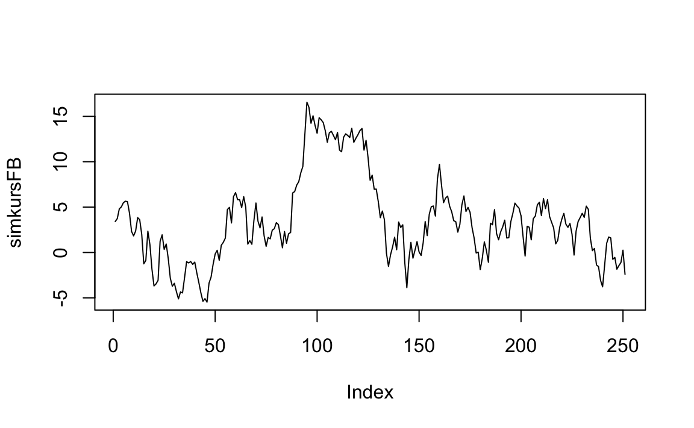

# Inferenz für metrische Variablen


\BeginKnitrBlock{rmdcaution}<div class="rmdcaution">Lernziele:

- Das Konzept des "random walk" verstehen.
- den t-Test verstehen und anwenden können.
- Die (einfaktorielle) Varianzanalyse verstehen und anwenden können.

</div>\EndKnitrBlock{rmdcaution}


In diesem Kapitel benötigen wir folgende Pakete:


```r
library(mosaic)
```


## Random Walk


Beim Glücksspiel ist es offensichtlich, aber auch an vielen, vielen anderen Stellen im Leben begegnen wir dem *Zufall*. Daten, Beobachtungen sind häufig Realisationen von sogenannten Zufallsvariablen. Das sind Variablen, deren Werte vom Zufall (und damit auch seinen Modellen und Gesetzen) abhängen. So werden Aktienkurse und -renditen häufig als Random Walk aufgefasst und modelliert - häufig unter der *Annahme* einer Normalverteilung.^[Sowohl die Annahme einer Normalverteilung, als auch die Annahme, dass die Renditen unabhängig voneinander sind (d. h., dass keine *Autokorrelation* vorliegt) und einer identischen Verteilung folgen (hier gleiche Varianz) sind in der Praxis kritisch zu hinterfragen.]


## t-Test für eine Stichprobe

An den `n=251` Handelstagen des Jahres 2015 lag der arithmetische Mittelwert der (logarithmierten) Rendite der Facebook Aktie bei `0.11`, bei einer Standardabweichung (hier auch Volatilität genannt) von `1.62`. Zeigen diese Daten, dass die Rendite der Aktie nicht zufällig größer als Null ist, können wir aus dem Daten also auf die Alternativhypothese $H_A: \mu>0$ schließen? Dabei gehen wir von eine unabhängigen, identischen Normalverteilung der Beobachtungen aus.

```r
mFB <- 0.11 # Mittelwert
sdFB <- 1.62 # Standardabweichung
nFB <- 251 # Anzahl Beobachtungen
seFB <- sdFB / sqrt(nFB) # Standardfehler
z0 <- (mFB - 0) / seFB # z-Wert
xpnorm(z0, lower.tail = FALSE) # p-Wert
#> 
#> If X ~ N(0, 1), then 
#> 
#> 	P(X <= 1.08) = P(Z <= 1.08) = 0.859
#> 	P(X >  1.08) = P(Z >  1.08) = 0.141
#> [1] 0.141
```


Mit einem p-Wert von 0.141 kann die Nullhypothese, der Lageparameter der Rendite ist kleiner gleich 0 $H_0: \mu \leq 0$ *nicht* verworfen werden. (Teststatistik $T=\frac{\bar{x}-\mu_0}{\frac{sd}{\sqrt{n}}}$)

Das zeigen auch Simulationen: Der Befehl `rnorm` erzeugt Zufallszahlen aus einer Normalverteilung:

```r
set.seed(1896) # Zufallszahlengenerator setzen
simFB <- rnorm(n = nFB, mean = mFB, sd = sdFB) # Renditen simulieren
simkursFB <- cumsum(simFB) # Kursverlauf aus Renditen berechnen
plot(simkursFB, type="l") # Kurs plotten
```



Sieht doch *fast* realistisch aus, oder?


```r
mean(simFB)
#> [1] -0.00964
```

In der Simulation, für die wir die (Populations-) Parameter durch ihre (Stichproben) Punktschätzer ersetzt haben, haben wir einen Mittelwert der Rendite von -0.01 -- und nicht wie (zufällig) beobachtet von 0.11. 

Für Hypothesentests und Konfidenzintervalle reicht natürlich nicht eine Simulation:

```r
FB1000 <- mosaic::do(1000) *  mean( rnorm(n = nFB, mean = mFB, sd = sdFB) )
histogram(~FB1000, v=mFB)
```


Das *simulierte* 95% Konfidenzintervall geht also von

```r
sort(FB1000$mean)[floor(1000*0.025)]
#> [1] -0.0823
```
bis

```r
sort(FB1000$mean)[ceiling(1000*0.975)]
#> [1] 0.307
```
und enthält damit die 0. Von den 1000 Simulationen haben 

```r
sum(FB1000$mean <= 0)
#> [1] 140
```
einen Mittelwert in der Jahresrendite unter 0. 


***
**Übung:**

1.  Berechnen (nicht simulieren!) Sie das 95\% Konfidenzintervall unter der Annahme einer Normalverteilung.
2.  Wie ändern sich Standardfehler und p-Werte, wenn die gleichen Punktschätzer nicht auf der Basis von einem sondern von 3 Jahren ermittelt wurden?

***

## t-Test für eine abhängige/ gepaarte Stichprobe
Der B3 Datensatz *Heilemann, U. and Münch, H.J. (1996): West German Business Cycles 1963-1994: A Multivariate Discriminant Analysis. CIRET–Conference in Singapore, CIRET–Studien 50.* enthält Quartalsweise Konjunkturdaten aus (West-)Deutschland.

Er kann von [https://goo.gl/0YCEHf](https://goo.gl/0YCEHf) heruntergeladen werden:
```
download.file("https://goo.gl/0YCEHf", destfile = "data/B3.csv")
```
Anschließend können die Daten in R eingelesen werden:

```r
B3 <- read.csv2("data/B3.csv")
str(B3) # Datenstruktur
#> 'data.frame':	157 obs. of  14 variables:
#>  $ PHASEN  : int  2 2 3 3 3 3 3 3 3 3 ...
#>  $ BSP91JW : num  10.53 10.6 9.21 5.17 4.93 ...
#>  $ CP91JW  : num  9.31 12.66 6.55 7.87 8.6 ...
#>  $ DEFRATE : num  0.05 0.06 0.05 0.05 0.04 0.04 0.04 0.03 0.03 0 ...
#>  $ EWAJW   : num  5.7 5.2 4.8 3.3 2.1 3.2 2.5 2.7 3 0.3 ...
#>  $ EXIMRATE: num  3.08 1.96 2.82 3.74 4.16 2.9 3.65 4.57 4.37 2.89 ...
#>  $ GM1JW   : num  11.15 11.03 10.04 8.33 7.69 ...
#>  $ IAU91JW : num  23.56 12.72 11.52 0.85 -2.08 ...
#>  $ IB91JW  : num  14.69 24.95 14.9 7.55 3.23 ...
#>  $ LSTKJW  : num  3 2.36 3.39 5.3 6.91 1.03 3.73 6.2 4.12 7.94 ...
#>  $ PBSPJW  : num  2.89 2.59 3.01 3.03 3.46 1.95 3.18 3.98 3.29 5.63 ...
#>  $ PCPJW   : num  1.91 2.2 3.09 2.08 1.48 1.65 1.47 3.29 3.59 4.19 ...
#>  $ ZINSK   : num  6.27 4.6 6.19 6.71 7.1 4.96 5.21 4.83 4.5 3.83 ...
#>  $ ZINSLR  : num  3.21 3.54 3.22 3.37 3.14 4.95 3.82 3.09 3.91 1.47 ...
head(B3); tail(B3)
#>   PHASEN BSP91JW CP91JW DEFRATE EWAJW EXIMRATE GM1JW IAU91JW IB91JW LSTKJW
#> 1      2   10.53   9.31    0.05   5.7     3.08 11.15   23.56  14.69   3.00
#> 2      2   10.60  12.66    0.06   5.2     1.96 11.03   12.72  24.95   2.36
#> 3      3    9.21   6.55    0.05   4.8     2.82 10.04   11.52  14.90   3.39
#> 4      3    5.17   7.87    0.05   3.3     3.74  8.33    0.85   7.55   5.30
#> 5      3    4.93   8.60    0.04   2.1     4.16  7.69   -2.08   3.23   6.91
#> 6      3    8.39   5.62    0.04   3.2     2.90  6.62   -3.76  14.58   1.03
#>   PBSPJW PCPJW ZINSK ZINSLR
#> 1   2.89  1.91  6.27   3.21
#> 2   2.59  2.20  4.60   3.54
#> 3   3.01  3.09  6.19   3.22
#> 4   3.03  2.08  6.71   3.37
#> 5   3.46  1.48  7.10   3.14
#> 6   1.95  1.65  4.96   4.95
#>     PHASEN BSP91JW CP91JW DEFRATE EWAJW EXIMRATE GM1JW IAU91JW IB91JW
#> 152      3   -1.27   1.29   -4.87 -1.97     6.03  9.79  -18.29   1.73
#> 153      3   -2.13  -0.57   -2.98 -2.05     7.59  0.72  -15.82  -3.23
#> 154      3    1.39   2.33   -2.86 -1.84     7.49 11.33  -10.59   4.62
#> 155      4    1.63   0.64    1.20 -1.58     7.75 11.38   -4.90   3.62
#> 156      1    1.40   0.57   -3.56 -1.34     5.58  9.53   -0.76   2.19
#> 157      1    1.83  -0.08   -2.22 -0.93     7.50 15.20    2.75   6.12
#>     LSTKJW PBSPJW PCPJW ZINSK ZINSLR
#> 152   1.08   2.73  2.98  6.83   3.55
#> 153   1.67   2.67  3.31  6.35   3.05
#> 154  -0.12   2.66  2.94  5.88   3.17
#> 155  -1.81   1.77  2.58  5.29   4.82
#> 156  -1.54   1.85  2.60  5.01   5.27
#> 157  -0.92   1.79  2.49  5.28   5.62
```
Hier interessieren besonders die (Veränderung) der Investitionen in Ausrüstungsgüter (`IAUJW91`) und in Bauten (`IB91JW`). Die deskriptiven Kennzahlen zeigen,

```r
favstats( ~ IAU91JW, data=B3)
#>    min    Q1 median  Q3  max mean   sd   n missing
#>  -19.9 -1.25    5.3 9.1 27.2 3.99 8.86 157       0
favstats( ~ IB91JW, data=B3)
#>    min    Q1 median   Q3  max mean   sd   n missing
#>  -21.6 -1.16    2.6 5.55 40.2 2.57 7.48 157       0
```
dass im betrachteten Zeitraum die Investitionen in Ausrüstungsgüter mit im arithmetischen Mittelwert von 3.99 im Mittel stärker gestiegen sind als die in Bauten mit 2.57. Da die Investitionen sicherlich in Zusammenhang mit der gesamten konjunkturellen Entwicklung stehen, ist davon auszugehen, dass es sich hier um vom jeweiligen Zeitpunkt abhängige Beobachtungen handelt. Daher wird hier die Differenz der Werte betrachtet: `IB91JW - IAU91JW`.  Der R Befehl für einen t-Test lautet `t.test`:

```r
t.test (~ (IB91JW - IAU91JW), data=B3)
#> 
#> 	One Sample t-test
#> 
#> data:  B3$(IB91JW - IAU91JW)
#> t = -2, df = 200, p-value = 0.05
#> alternative hypothesis: true mean is not equal to 0
#> 95 percent confidence interval:
#>  -2.8654  0.0103
#> sample estimates:
#> mean of x 
#>     -1.43
```


Der (umfangreichen) Ausgabe können Sie neben dem z- bzw. t-Wert (-1.96) mit unter der Nullhypothese der Gleichheit des Lageparameters $$H_0: \mu_{\text{IB91JW}-\text{IAU91JW}}=0$$ insbesondere den p-Wert (0.052) und das Konfidenzintervall (-2.87, 0.01) entnehmen. Zum Signifikanznvieau von 5% wird die Nullhypothese also gerade so *nicht* abgelehnt, da der p-Wert über 5\% liegt.

***
**Übung:**

3.  Testen Sie, ob es einen nicht zufälligen mittleren Lageunterschied zwischen der Veränderung des Preisindex des Bruttosozialproduktes `PBSPJW` und dem des privaten Verbrauchs `PCPJW` gibt.

***

## t-Test für zwei unabhängige Stichprobe
Untersuchen wir, ob sich makroökonomische Kennzahlen im Auf- und Abschwung unterscheiden. 
Zunächst stellen wir fest, dass die eigentlich kategorielle Variable `PHASEN` hier numerisch kodiert wurde, was aber schnell verwirren würde.

```r
typeof(B3$PHASEN)
#> [1] "integer"
```
Typänderung zu `factor` geht einfach:

```r
B3$PHASEN <- as.factor(B3$PHASEN)
```
Wenn wir die einzelnen `levels` des Faktors als numerische Werte verwenden wollen würde man den Befehl `as.numeric()` verwenden. Aber sicherheitshalber vorher über `levels()` gucken, ob die Reihenfolge auch stimmt.

Um die Interpretation zu erleichtern können wir hier einfach die Faktorstufe umbenennen.

```r
levels(B3$PHASEN) <- c("Aufschwung", "Oberer Wendepunkt", 
                       "Abschwung", "Unterer Wendepunkt")
```

Jetzt ist keine Verwechselung von kategoriellen und metrischen Variablen mehr möglich.

Zunächst wird der Datensatz, der auch die konjunkturellen Wendepunkte enthält, nur auf Auf- und Abschwung eingeschränkt. 

```r
B3AufAb <- filter(B3, PHASEN %in% c("Aufschwung", "Abschwung")) 
B3AufAb <- droplevels(B3AufAb)
```

In der politischen Diskussion werden immer niedrige Zinsen gefordert. Schauen wir mal, wie die Zinsen in den Konjunkturphasen in der Vergangenheit (1955-1994) verteilt waren:

```r
bwplot(ZINSK ~ PHASEN, data=B3AufAb)
```


Anscheinend waren die Zinsen in Zeiten des Aufschwungs niedriger. 

Was sagen die deskriptiven Kennzahlen:

```r
favstats(ZINSK ~ PHASEN, data=B3AufAb)
#>       PHASEN  min   Q1 median   Q3  max mean   sd  n missing
#> 1 Aufschwung 2.81 3.83   4.50 5.06  8.2 4.72 1.21 59       0
#> 2  Abschwung 3.00 5.21   7.37 9.73 14.2 7.68 3.02 47       0
```
Alle Lagemaße für die Zinskosten sind in der Aufschwungphase niedriger. 

Der t-Test der Zinskosten für $$H_0: \mu_{\text{Aufschwung}}=\mu_{\text{Abschwung}} \Leftrightarrow \mu_{\text{Aufschwung}}-\mu_{\text{Abschwung}}=0$$ mit der Teststatistik $$T=\frac{\bar{x}_A-\bar{x}_B}{\sqrt{\frac{sd^2_A}{{n_A}}+\frac{sd^2_B}{{n_B}}}}$$
hat dann den gleichen Aufbau des Syntax wie `bwplot` oder `favstats`: Teste die Zinskosten in Abhängigkeit der Konjunkturphase.

Die Berechnung der Teststatistik 

```r
t.test(ZINSK ~ PHASEN, data=B3AufAb)
#> 
#> 	Welch Two Sample t-test
#> 
#> data:  ZINSK by PHASEN
#> t = -6, df = 60, p-value = 4e-08
#> alternative hypothesis: true difference in means is not equal to 0
#> 95 percent confidence interval:
#>  -3.90 -2.03
#> sample estimates:
#> mean in group Aufschwung  mean in group Abschwung 
#>                     4.72                     7.68
```

Der kleine p-Wert von $3.743\times 10^{-8}$ zeigt, dass die Nullhypothese der Gleichheit der Lageparameter verworfen werden kann. Wir können der Funktion auch eine spezielle Alternativhypothese übergeben:

```r
t.test(ZINSK ~ PHASEN, data=B3AufAb, alternative = "less")
#> 
#> 	Welch Two Sample t-test
#> 
#> data:  ZINSK by PHASEN
#> t = -6, df = 60, p-value = 2e-08
#> alternative hypothesis: true difference in means is less than 0
#> 95 percent confidence interval:
#>   -Inf -2.19
#> sample estimates:
#> mean in group Aufschwung  mean in group Abschwung 
#>                     4.72                     7.68
```
Jetzt haben wir die Nullhypothese "Das Lagemaß für die Zinskosten ist im Aufschwung *nicht* kleiner als im Abschwung" gegen die Alternativhypothese (Forschungshypothese) "Das Lagemaß für die Zinskosten ist im Aufschwung kleiner als im Abschwung" getestet:
$$H_0: \mu_{\text{Aufschwung}} \geq \mu_{\text{Abschwung}} \quad vs. \quad H_A: \mu_{\text{Aufschwung}} < \mu_{\text{Abschwung}}$$
bzw. 
$$H_0: \mu_{\text{Aufschwung}} - \mu_{\text{Abschwung}} \geq 0 \quad vs. \quad H_A: \mu_{\text{Aufschwung}} - \mu_{\text{Abschwung}} < 0 $$

***
**Übung:**

4.  Untersuchen Sie, ob sich die mittlere Entwicklung des privaten Verbrauchs `CP91JW` zwischen den Konjunkturphasen unterscheidet.

***

Auch hier können wir, ohne eine Verteilungsannahme zu verwenden permutieren.

```r
mdiff <- diff(mean(ZINSK ~ PHASEN, data=B3AufAb))
mdiff
#> Abschwung 
#>      2.97
mdiff.null <- mosaic::do(1000) * diff(mean(ZINSK ~ sample(PHASEN), data=B3AufAb))
histogram( ~ mdiff.null)
```


Unter der Nullhypothese der Gleichheit der Lagemaße kommt eine gleich große oder größere Differenz also

```r
sum(mdiff.null >= mdiff)
#> [1] 0
```
mal bei 1000 Permutationen vor!

Da die statistische *Signifikanz* vom Standardfehler abhängt, welcher wiederum vom Stichprobenumfang abhängt, wurde von Cohen ein Maß für die *Effektstärke*, **Cohen's d** vorgeschlagen:
$$d=\frac{\bar{x}_A-\bar{x}_B}{sd_{\text{pool}}}$$
mit $${sd_{\text{pool}}=\sqrt{\frac{1}{n_A+n_B-2}\Bigl((n_1-1)sd^2_A+(n_2-1)sd^2_B \Bigr)}}$$


```r
# Kennzahlen 1. Stichprobe
m1 <- mean(B3$ZINSK[B3$PHASEN=="Aufschwung"]) 
sd1 <- sd(B3$ZINSK[B3$PHASEN=="Aufschwung"]) 
n1 <- length(B3$ZINSK[B3$PHASEN=="Aufschwung"])
# Kennzahlen 2. Stichprobe
m2 <- mean(B3$ZINSK[B3$PHASEN=="Abschwung"]) 
sd2 <- sd(B3$ZINSK[B3$PHASEN=="Abschwung"]) 
n2 <- length(B3$ZINSK[B3$PHASEN=="Abschwung"])
# Gepoolte Standardabweichung
sdpool <- sqrt( ((n1-1)*sd1^2 + (n2-1)*sd2^2) / (n1+n2-2))
# Cohen's d
d <- (m1-m2)/sdpool
d
#> [1] -1.35
```

Cohen's d ist ein Maß der Überlappung der Verteilungen:


Häufig werden Werte 

* |d|<=0.2 als kleine
* |d|<=0.5 als mittlere 
* |d|>=0.8 als große Effekte 

bezeichnet.

Eine direkte Berechnung geht über das Paket `lsr`:

```r
# install.packages("lsr") Einmalig installieren
library(lsr)
library(methods)
lsr::cohensD(ZINSK ~ PHASEN, data=B3AufAb)
#> [1] 1.35
```


## Varianzanalyse (ANOVA)
Bei mehr als zwei Gruppen funktionieren die Techniken des t-Tests nicht mehr. Um Lagemaßunterschiede zu testen wird anstelle der Mittelwerte die Streuung verglichen: Ist die Streuung zwischen den Gruppen groß im Vergleich zur Streuung innerhalb der Gruppen?

Unterscheidet sich der mittlere Anteil des Staatsdefizits `DEFRATE` nicht zufällig zwischen den Konjunkturphasen?


```r
bwplot( DEFRATE ~ PHASEN, data=B3)
favstats( DEFRATE ~ PHASEN, data=B3)
#>               PHASEN    min    Q1 median    Q3  max   mean   sd  n missing
#> 1         Aufschwung  -4.38 -2.76  -1.52 0.165 2.12 -1.339 1.68 59       0
#> 2  Oberer Wendepunkt -11.02 -2.25   0.02 0.478 3.22 -0.848 2.84 24       0
#> 3          Abschwung  -6.12 -2.79   0.00 0.580 2.95 -0.838 2.29 47       0
#> 4 Unterer Wendepunkt  -5.99 -3.44  -0.37 0.025 1.94 -1.655 2.36 27       0
```


Vielleicht, vielleicht nicht.

Um eine Varianzanalyse (*Analysis of Variance, ANOVA*) mit $$H_0: \mu_1=\mu_2=\ldots =\mu_k$$ gegen $$H_A: \text{Mindestens ein } \mu \text{ ist verschieden.}$$ durchzuführen kann in R u. a. der Befehl `aov` verwendet werden:

```r
DEFaov <- aov(DEFRATE ~ PHASEN, data=B3)
summary(DEFaov)
#>              Df Sum Sq Mean Sq F value Pr(>F)
#> PHASEN        3     16    5.24    1.09   0.36
#> Residuals   153    735    4.80
```
Der p-Wert des F-Tests der Nullhypothese $$H_0: \mu_{\text{Aufschwung}}=\mu_{\text{Oberer Wendepunt}}=\mu_{\text{Abschwung}}=\mu_{\text{Unterer Wendepunkt}}$$ der Gleichheit der Lage ist mit 0.355 größer als 0.05, die Nullhypothese kann also für das Staatsdefizit nicht verworfen werden. 

Unterscheidet sich das Lagemaß der Veränderung der Lohnstückkosten `LSTKJW` nicht zufällig?

```r
bwplot(LSTKJW ~ PHASEN, data=B3)
favstats(LSTKJW ~ PHASEN, data=B3)
#>               PHASEN   min    Q1 median   Q3   max mean   sd  n missing
#> 1         Aufschwung -1.54 0.625   2.02 3.52  6.09 2.11 1.84 59       0
#> 2  Oberer Wendepunkt  0.32 2.840   4.22 5.22  8.16 4.20 2.07 24       0
#> 3          Abschwung -0.12 4.385   5.71 8.01 14.21 6.29 3.12 47       0
#> 4 Unterer Wendepunkt -2.53 1.270   3.46 8.04 12.18 4.25 4.45 27       0
LSTKaov <- aov(LSTKJW ~ PHASEN, data=B3)
summary(LSTKaov)
#>              Df Sum Sq Mean Sq F value  Pr(>F)    
#> PHASEN        3    459   153.2    18.6 2.4e-10 ***
#> Residuals   153   1258     8.2                    
#> ---
#> Signif. codes:  0 '***' 0.001 '**' 0.01 '*' 0.05 '.' 0.1 ' ' 1
```


Die Nullhypothese der Gleichheit wird hier also verworfen. Interessanterweise unterscheiden sich insbesondere die Lagemaße von Auf- und Abschwung, die beiden Wendepunkte liegen dazwischen.


Im Paket `effects` gibt es übrigens eine schöne Plotfunktion für die Effekte:

```r
# Einmalig installieren:
# install.packages("effects")

library(effects)
plot(allEffects(LSTKaov))
```


Neben dem arithmetischen Mittelwert (Punktschätzer) wird in der Standardeinstellung das 95\% Konfidenzintervall eingezeichnet.

***
**Übung:** 

5.  Gibt es nicht zufällige Lageunterschiede bei der Änderung der Erwerbstätigen `EWAJW` zwischen den Konjunkturphasen?

***

## Vertiefung: Mehrfaktorielle Varianzanalyse mit Wechselwirkung
Betrachten wir noch einmal den  *tips* Datensatz aus *Bryant, P. G. and Smith, M (1995) Practical Data Analysis: Case Studies in Business Statistics. Homewood, IL: Richard D. Irwin Publishing*.

Sofern noch nicht geschehen, können Sie in [hier](https://goo.gl/whKjnl) als `csv`-Datei herunterladen:
```
download.file("https://goo.gl/whKjnl", destfile = "data/tips.csv")
```

Das Einlesen der Daten in R erfolgt, sofern die Daten im Verzeichnis `data` liegen, über:

```r
tips <- read.csv("data/tips.csv")
```

Um zu schauen, inwieweit das Trinkgeld vom Geschlecht *und* dem Rauchverhalten abhängt, kann folgende Analyse durchgeführt werden:

```r
favstats(tip ~ sex + smoker, data=tips)
#>   sex.smoker  min Q1 median   Q3  max mean   sd  n missing
#> 1  Female.No 1.00  2   2.68 3.44  5.2 2.77 1.13 54       0
#> 2    Male.No 1.25  2   2.74 3.71  9.0 3.11 1.49 97       0
#> 3 Female.Yes 1.00  2   2.88 3.50  6.5 2.93 1.22 33       0
#> 4   Male.Yes 1.00  2   3.00 3.82 10.0 3.05 1.50 60       0
tipaov <- aov(tip ~ sex + smoker, data=tips)
summary(tipaov)
#>              Df Sum Sq Mean Sq F value Pr(>F)
#> sex           1      4    3.67    1.92   0.17
#> smoker        1      0    0.02    0.01   0.93
#> Residuals   241    462    1.92
plot(allEffects(tipaov))
```


Beide Faktoren sind zum Signifikanzniveau 5\% *nicht* signifikant, d. h., $H_0$, dass sich die Mittelwerte in der Population nicht unterscheiden, wird nicht verworfen.

Allerdings beobachten wir etwas anderes: Während der Mittelwert des Trinkgeldes bei den Frauen bei den Rauchern größer ist, ist es bei den Männern umgekehrt. Hier könnte also eine Wechselwirkung, eine Interaktion vorliegen. Diese wird in R über ein `:` in der Formel eingefügt:


```r
tipaovww <- aov(tip ~ sex + smoker + sex:smoker, data=tips)
summary(tipaovww)
#>              Df Sum Sq Mean Sq F value Pr(>F)
#> sex           1      4    3.67    1.91   0.17
#> smoker        1      0    0.02    0.01   0.93
#> sex:smoker    1      1    0.64    0.33   0.56
#> Residuals   240    461    1.92
plot(allEffects(tipaovww ))
```


Auch hier gilt: Mit einem p-Wert von $0.564$ wird die Nullhypothese, dass in der Population keine Wechselwirkung von Geschlecht und Rauchverhalten für den Mittelwert vorliegt, nicht verworfen.


## Übung: Teaching Rating
Dieser Datensatz analysiert u. a. den Zusammenhang zwischen Schönheit und Evaluierungsergebnis von Dozenten:

*Hamermesh, D.S., and Parker, A. (2005). Beauty in the Classroom: Instructors' Pulchritude and Putative Pedagogical Productivity. Economics of Education Review, 24, 369–376.*

Sie können ihn, sofern noch nicht geschehen, von [https://goo.gl/6Y3KoK](https://goo.gl/6Y3KoK) als `csv` herunterladen.

1.  Ist das arithmetische Mittel der Evaluierung `eval` nicht zufällig größer als befriedigend (3)?
2.  Gibt es einen nicht zufälligen Unterschied im Lagemaß der Evaluation `eval` zwischen männlichen und weiblichen Dozent/innen (`gender`)?

## Verweise


- David M. Diez, Christopher D. Barr, Mine &Ccedil;etinkaya-Rundel (2014): *Introductory Statistics with Randomization and Simulation*, [https://www.openintro.org/stat/textbook.php?stat_book=isrs](https://www.openintro.org/stat/textbook.php?stat_book=isrs),  Kapitel 4
- Nicholas J. Horton, Randall Pruim, Daniel T. Kaplan (2015): Project MOSAIC Little Books *A Student's Guide to R*,  [https://github.com/ProjectMOSAIC/LittleBooks/raw/master/StudentGuide/MOSAIC-StudentGuide.pdf](https://github.com/ProjectMOSAIC/LittleBooks/raw/master/StudentGuide/MOSAIC-StudentGuide.pdf), Kapitel 7, 10.1
- Maike Luhmann (2015): *R für Einsteiger*, Kapitel 13, 14
- Andreas Quatember (2010): *Statistik ohne Angst vor Formeln*, Kapitel 3.5, 3.7, 3.12
- Daniel Wollschläger (2014): *Grundlagen der Datenanalyse mit R*, Kapitel 7.2, 7.3, 7.5

## Lizenz
Diese Übung wurde von Karsten Lübke entwickelt und orientiert sich an der Übung zum Buch [OpenIntro](https://www.openintro.org/stat/index.php?stat_book=isrs) von Andrew Bray, Mine &Ccedil;etinkaya-Rundel und steht wie diese unter der Lizenz [Creative Commons Attribution-ShareAlike 3.0 Unported](http://creativecommons.org/licenses/by-sa/3.0).  
