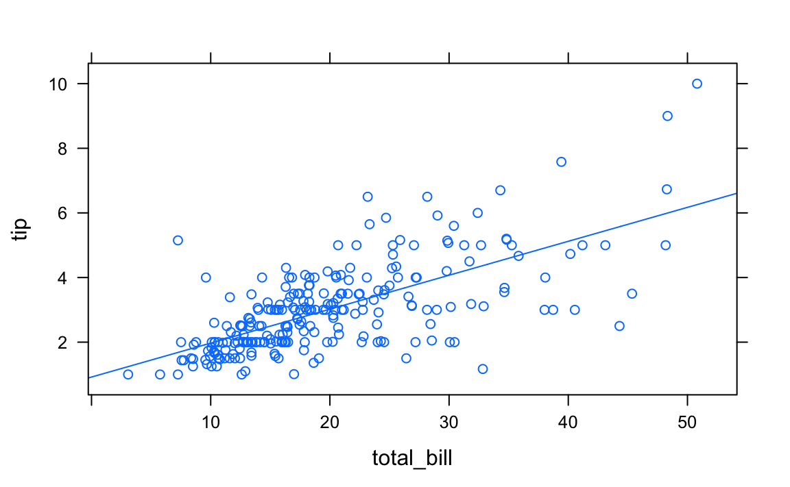
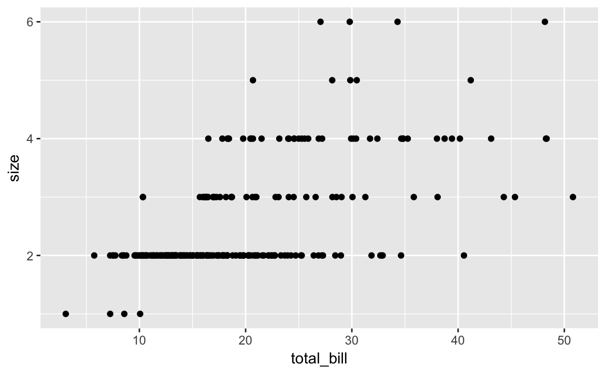
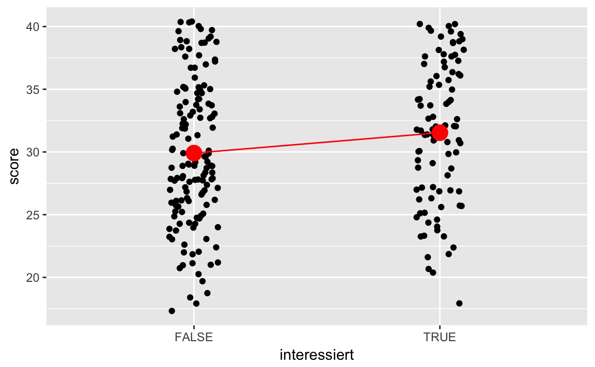
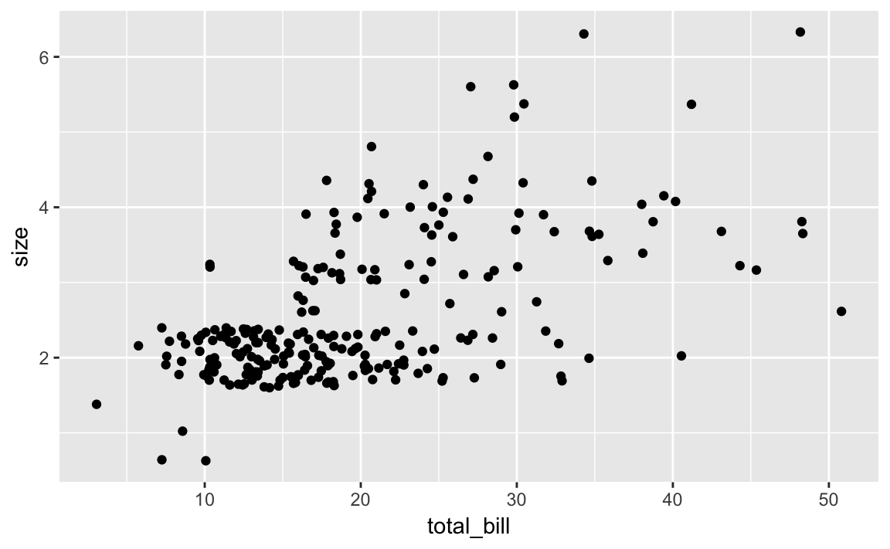

# Klassische lineare (numerische) Regression


\BeginKnitrBlock{rmdcaution}<div class="rmdcaution">Lernziele:

- Wissen, was man unter Regression versteht.
- Die Annahmen der Regression überprüfen können.
- Regression mit kategorialen Prädiktoren durchführen können.
- Die Regression inferenzstatisisch absichern können.
- Die Modellgüte bei der Regression bestimmen können.
- Vertiefende Aspekte beherrschen, wie Modellwahl und Interaktionen.

</div>\EndKnitrBlock{rmdcaution}


Benötigte Pakete:

```r
library(caret)  # Modellieren
library(tidyverse)  # Datenjudo, Visualisierung,...
library(gridExtra)  # Mehrere Plots kombinieren
```


## Einfache Regression
Wir werden weiter den Datensatz *tips* analysieren [@bryant1995practical].

Sofern noch nicht geschehen, können Sie in [hier](https://goo.gl/whKjnl) als `csv`-Datei herunterladen:

```r
tips <- read.csv("https://sebastiansauer.github.io/data/tips.csv")
```

Zur Unterstützung der Analyse wird (wieder) das Paket `mosaic` verwendet; außerdem laden wir `ggplot2` für `qplot`:


```r
library(mosaic)
library(ggplot2)
```

Wie hängen Trinkgeldhöhe `tip` und Rechnungshöhe `total_bill` zusammen? Kann die Höhe des Trinkgeldes als *lineare* Funktion der Rechnungshöhe linear modelliert werden? 
$$tip_i=\beta_0+\beta_1\cdot total\_bill_i+\epsilon_i$$

Zunächst eine visuelle Analyse mi Hilfe eines Scatterplots.

```r
qplot(y = tip, x = total_bill, data = tips)
```


Es scheint einen positiven Zusammenhang zu geben. Modellieren wir die **abhängige** Variable `tip` (inhaltliche Entscheidung!) als lineare Funktion der **unabhängigen** Variable `total_bill`:

```r
LinMod.1 <- lm(tip ~ total_bill, data=tips)
summary(LinMod.1)
#> 
#> Call:
#> lm(formula = tip ~ total_bill, data = tips)
#> 
#> Residuals:
#>    Min     1Q Median     3Q    Max 
#> -3.198 -0.565 -0.097  0.486  3.743 
#> 
#> Coefficients:
#>             Estimate Std. Error t value Pr(>|t|)    
#> (Intercept)  0.92027    0.15973    5.76  2.5e-08 ***
#> total_bill   0.10502    0.00736   14.26  < 2e-16 ***
#> ---
#> Signif. codes:  0 '***' 0.001 '**' 0.01 '*' 0.05 '.' 0.1 ' ' 1
#> 
#> Residual standard error: 1.02 on 242 degrees of freedom
#> Multiple R-squared:  0.457,	Adjusted R-squared:  0.454 
#> F-statistic:  203 on 1 and 242 DF,  p-value: <2e-16
```
Der Achsenabschnitt (`intercept`) wird mit 0.92 geschätzt, die Steigung in Richtung `total_bill` mit 0.11: steigt `total_bill` um einen Dollar, steigt im *Durchschnitt* `tip` um 0.11. 

Die (Punkt-)Prognose für `tip` lautet also

`tip` = 0.92 + 0.11 * `total_bill`

Die Koeffzienten werden dabei so geschätzt, dass $\sum \epsilon_i^2$ minimiert wird. Dies wird auch als  *Kleinste Quadrate* (*Ordinary Least Squares*, *OLS*) Kriterium bezeichnet. Eine robuste Regression ist z. B. mit der Funktion `rlm()` aus dem Paket `MASS` möglich.


In mosaic kann ein solches Modell einfach als neue Funktion definiert werden:

```r
LinMod.1Fun <- makeFun(LinMod.1)
```
Die (Punkt-)Prognose für die Trinkgeldhöhe, bspw. für eine Rechnung von 30$ kann dann berechnet werden

```r
LinMod.1Fun(total_bill=30)
#>    1 
#> 4.07
```
also 4.07$.

In mosaic kann die Modellgerade über 

```r
plotModel(LinMod.1)
```



betrachtet werden. Das Bestimmtheitsmaß R² ist mit 0.46 "ok": 46-\% der Variation des Trinkgeldes wird im Modell erklärt.

## Überprüfung der Annahmen der linearen Regression

Aber wie sieht es mit den Annahmen aus?

- Die Linearität des Zusammenhangs haben wir zu Beginn mit Hilfe des Scatterplots "überprüft".
- Zur Überprüfung der Normalverteilung der Residuen zeichnen wir ein Histogramm. Die *Residuen*\index{Residuen} können über den Befehl `resid()` aus einem Linearen Modell extrahiert werden. Hier scheint es zu passen:


```r
resid_df <- data.frame(Residuen = resid(LinMod.1))
qplot(x = Residuen, data = resid_df)
```




- *Konstante Varianz*: Dies kann z. B. mit einem Scatterplot der Residuen auf der y-Achse und den angepassten Werten auf der x-Achse überprüft werden. Die angepassten (geschätzten) Werte werden über den Befehl `fitted()`[^3] extrahiert. Diese Annahme scheint verletzt zu sein (siehe unten): je größer die Prognose des Trinkgeldes, desto größer wirkt die Streuung der Residuen. Dieses Phänomen ließ sich schon aus dem ursprünglichen Scatterplot 
`qplot(x = tip, y = total_bill, data=tips)` erahnen. Das ist auch inhaltlich plausibel: je höher die Rechnung, desto höher die Varianz beim Trinkgeld. Die Verletzung dieser Annahme beeinflusst *nicht* die Schätzung der Steigung, sondern die Schätzung des Standardfehlers, also des p-Wertes des Hypothesentests, d. h., $H_0:\beta_1=0$. 


```r
resid_df$fitted <- fitted(LinMod.1)
qplot(x = Residuen, y = fitted, data = resid_df)
```


- *Extreme Ausreißer*: Wie am Plot der Linearen Regression `plotModel(LinMod.1)` erkennbar, gibt es vereinzelt Ausreißer nach oben, allerdings ohne einen extremen Hebel.


Hängt die Rechnungshöhe von der Anzahl der Personen ab? Bestimmt, aber wie?

```r
xyplot(total_bill ~ size, data=tips)
```



Da bei diskreten metrischen Variablen (hier `size`) Punkte übereinander liegen können, sollte man "jittern" ("schütteln"), d. h., eine (kleine) Zufallszahl addieren:

```r
qplot(x = total_bill, y = size, data = tips, geom = "jitter")
```




\BeginKnitrBlock{rmdexercises}<div class="rmdexercises">1.  Um wie viel Dollar steigt im Durchschnitt das Trinkgeld, wenn eine Person mehr am Tisch sitzt?

2.  Für wie aussagekräftig halten Sie Ihr Ergebnis aus 1.?
</div>\EndKnitrBlock{rmdexercises}


## Regression mit kategorialen Prädiktoren
Der Wochentag `day` ist eine kategoriale Variable. Wie sieht eine Regression des Trinkgeldes darauf aus?

Zunächst grafisch:

```r
qplot(x = tip,y = day, data=tips)
```


Und als Lineares Modell:

```r
LinMod.2 <- lm(tip ~ day, data=tips)
summary(LinMod.2)
#> 
#> Call:
#> lm(formula = tip ~ day, data = tips)
#> 
#> Residuals:
#>    Min     1Q Median     3Q    Max 
#> -2.245 -0.993 -0.235  0.538  7.007 
#> 
#> Coefficients:
#>             Estimate Std. Error t value Pr(>|t|)    
#> (Intercept)   2.7347     0.3161    8.65  7.5e-16 ***
#> daySat        0.2584     0.3489    0.74     0.46    
#> daySun        0.5204     0.3534    1.47     0.14    
#> dayThur       0.0367     0.3613    0.10     0.92    
#> ---
#> Signif. codes:  0 '***' 0.001 '**' 0.01 '*' 0.05 '.' 0.1 ' ' 1
#> 
#> Residual standard error: 1.38 on 240 degrees of freedom
#> Multiple R-squared:  0.0205,	Adjusted R-squared:  0.00823 
#> F-statistic: 1.67 on 3 and 240 DF,  p-value: 0.174
```

Die im Modell angegebenen Schätzwerte sind die Änderung der Trinkgeldprognose, wenn z. B. der Tag ein Samstag (`daySat`) im Vergleich zu einer Referenzkategorie. Dies ist in R das erste Element des Vektors der Faktorlevel. Welcher dies ist ist über den Befehl `levels()` zu erfahren

```r
levels(tips$day)
#> [1] "Fri"  "Sat"  "Sun"  "Thur"
```
hier also Fri (aufgrund der standardmäßig aufsteigenden alphanumerischen Sortierung). Dies kann über `relevel()` geändert werden. Soll z. B. die Referenz der Donnerstag, `Thur` sein:

```r
tips$day <- relevel(tips$day, ref = "Thur")
levels(tips$day)
#> [1] "Thur" "Fri"  "Sat"  "Sun"
```
Das Modell ändert sich entsprechend:

```r
LinMod.3 <- lm(tip ~ day, data=tips)
summary(LinMod.3)
#> 
#> Call:
#> lm(formula = tip ~ day, data = tips)
#> 
#> Residuals:
#>    Min     1Q Median     3Q    Max 
#> -2.245 -0.993 -0.235  0.538  7.007 
#> 
#> Coefficients:
#>             Estimate Std. Error t value Pr(>|t|)    
#> (Intercept)   2.7715     0.1750   15.84   <2e-16 ***
#> dayFri       -0.0367     0.3613   -0.10    0.919    
#> daySat        0.2217     0.2290    0.97    0.334    
#> daySun        0.4837     0.2358    2.05    0.041 *  
#> ---
#> Signif. codes:  0 '***' 0.001 '**' 0.01 '*' 0.05 '.' 0.1 ' ' 1
#> 
#> Residual standard error: 1.38 on 240 degrees of freedom
#> Multiple R-squared:  0.0205,	Adjusted R-squared:  0.00823 
#> F-statistic: 1.67 on 3 and 240 DF,  p-value: 0.174
```
sowie als Plot:

```r
plotModel(LinMod.3)
```


Eine Alternative zu `relevel()` zur Bestimmung der Referenzkategorie ist es, innerhalb von `factor()` die Option `levels=` direkt in der gewünschten Sortierung zu setzen.

```r
day <- factor(tips$day, levels=c("Thur", "Fri", "Sat",  "Sun"))
```


Die (Punkt-)Prognose für die Trinkgeldhöhe, bspw. an einen Freitag kann dann berechnet werden

```r
LinMod.3Fun <- makeFun(LinMod.3)
LinMod.3Fun(day="Fri")
#>    1 
#> 2.73
```


\BeginKnitrBlock{rmdexercises}<div class="rmdexercises">3.  Wie verändert sich die Rechnungshöhe im Durchschnitt, wenn die Essenszeit Dinner statt Lunch ist?
4.  Wie viel \% der Variation der Rechnungshöhe können Sie durch die Essenszeit modellieren?
</div>\EndKnitrBlock{rmdexercises}


## Multiple Regression
Aber wie wirken sich die Einflussgrößen *zusammen* auf das Trinkgeld aus?

```r
LinMod.4 <- lm(tip ~ total_bill + size + sex  + smoker + day + time, data=tips)
summary(LinMod.4)
#> 
#> Call:
#> lm(formula = tip ~ total_bill + size + sex + smoker + day + time, 
#>     data = tips)
#> 
#> Residuals:
#>    Min     1Q Median     3Q    Max 
#> -2.848 -0.573 -0.103  0.476  4.108 
#> 
#> Coefficients:
#>             Estimate Std. Error t value Pr(>|t|)    
#> (Intercept)   0.6416     0.4976    1.29    0.199    
#> total_bill    0.0945     0.0096    9.84   <2e-16 ***
#> size          0.1760     0.0895    1.97    0.051 .  
#> sexMale      -0.0324     0.1416   -0.23    0.819    
#> smokerYes    -0.0864     0.1466   -0.59    0.556    
#> dayFri        0.1623     0.3934    0.41    0.680    
#> daySat        0.0408     0.4706    0.09    0.931    
#> daySun        0.1368     0.4717    0.29    0.772    
#> timeLunch     0.0681     0.4446    0.15    0.878    
#> ---
#> Signif. codes:  0 '***' 0.001 '**' 0.01 '*' 0.05 '.' 0.1 ' ' 1
#> 
#> Residual standard error: 1.02 on 235 degrees of freedom
#> Multiple R-squared:  0.47,	Adjusted R-squared:  0.452 
#> F-statistic: 26.1 on 8 and 235 DF,  p-value: <2e-16
```
Interessant sind die negativen Vorzeichen vor den Schätzwerten für `sexMale` und `smokerYes` -- anscheinend geben Männer und Raucher weniger Trinkgeld, wenn alle anderen Faktoren konstant bleiben. Bei einer rein univariaten Betrachtung wäre etwas anderes herausgekommen.

```r
summary(lm(tip ~ sex, data=tips))
#> 
#> Call:
#> lm(formula = tip ~ sex, data = tips)
#> 
#> Residuals:
#>    Min     1Q Median     3Q    Max 
#> -2.090 -1.090 -0.090  0.667  6.910 
#> 
#> Coefficients:
#>             Estimate Std. Error t value Pr(>|t|)    
#> (Intercept)    2.833      0.148   19.14   <2e-16 ***
#> sexMale        0.256      0.185    1.39     0.17    
#> ---
#> Signif. codes:  0 '***' 0.001 '**' 0.01 '*' 0.05 '.' 0.1 ' ' 1
#> 
#> Residual standard error: 1.38 on 242 degrees of freedom
#> Multiple R-squared:  0.0079,	Adjusted R-squared:  0.0038 
#> F-statistic: 1.93 on 1 and 242 DF,  p-value: 0.166
summary(lm(tip ~ smoker, data=tips))
#> 
#> Call:
#> lm(formula = tip ~ smoker, data = tips)
#> 
#> Residuals:
#>    Min     1Q Median     3Q    Max 
#> -2.009 -0.994 -0.100  0.558  6.991 
#> 
#> Coefficients:
#>             Estimate Std. Error t value Pr(>|t|)    
#> (Intercept)   2.9919     0.1128   26.52   <2e-16 ***
#> smokerYes     0.0169     0.1828    0.09     0.93    
#> ---
#> Signif. codes:  0 '***' 0.001 '**' 0.01 '*' 0.05 '.' 0.1 ' ' 1
#> 
#> Residual standard error: 1.39 on 242 degrees of freedom
#> Multiple R-squared:  3.51e-05,	Adjusted R-squared:  -0.0041 
#> F-statistic: 0.00851 on 1 and 242 DF,  p-value: 0.927
```
Diese *Umkehrung* des modellierten Effektes liegt daran, dass es auch einen positiven Zusammenhang zur Rechnungshöhe gibt:

```r
summary(lm(total_bill ~ sex, data=tips))
#> 
#> Call:
#> lm(formula = total_bill ~ sex, data = tips)
#> 
#> Residuals:
#>    Min     1Q Median     3Q    Max 
#> -14.99  -6.02  -1.94   3.99  30.07 
#> 
#> Coefficients:
#>             Estimate Std. Error t value Pr(>|t|)    
#> (Intercept)   18.057      0.946   19.08   <2e-16 ***
#> sexMale        2.687      1.180    2.28    0.024 *  
#> ---
#> Signif. codes:  0 '***' 0.001 '**' 0.01 '*' 0.05 '.' 0.1 ' ' 1
#> 
#> Residual standard error: 8.83 on 242 degrees of freedom
#> Multiple R-squared:  0.021,	Adjusted R-squared:  0.0169 
#> F-statistic: 5.19 on 1 and 242 DF,  p-value: 0.0236
summary(lm(total_bill ~ smoker, data=tips))
#> 
#> Call:
#> lm(formula = total_bill ~ smoker, data = tips)
#> 
#> Residuals:
#>    Min     1Q Median     3Q    Max 
#> -17.69  -6.46  -1.89   4.58  30.05 
#> 
#> Coefficients:
#>             Estimate Std. Error t value Pr(>|t|)    
#> (Intercept)   19.188      0.723   26.53   <2e-16 ***
#> smokerYes      1.568      1.172    1.34     0.18    
#> ---
#> Signif. codes:  0 '***' 0.001 '**' 0.01 '*' 0.05 '.' 0.1 ' ' 1
#> 
#> Residual standard error: 8.89 on 242 degrees of freedom
#> Multiple R-squared:  0.00735,	Adjusted R-squared:  0.00325 
#> F-statistic: 1.79 on 1 and 242 DF,  p-value: 0.182
```

Im vollem Modell `LinMod.4` sind alle unabhängigen Variablen berücksichtigt, die Koeffizienten beziehen sich dann immer auf: gegeben, die anderen Variablen bleiben konstant, d. h. ceteris paribus.

Vergleichen wir mal zwei Modelle:

```r
LinMod.5a <- lm(tip ~  sex, data=tips)
coef(LinMod.5a) # Koeffizienten extrahieren
#> (Intercept)     sexMale 
#>       2.833       0.256
LinMod.5b <- lm(tip ~  sex + total_bill, data=tips)
coef(LinMod.5b) # Koeffizienten extrahieren
#> (Intercept)     sexMale  total_bill 
#>      0.9333     -0.0266      0.1052
```
Ohne die Berücksichtigung der **Kovariable/Störvariable** Rechnungshöhe geben 
 Male  
 ein um im Durchschnitt 0.26
 *höheres* Trinkgeld, bei Kontrolle, d. h. gleicher Rechnungshöhe ein um 
 0.03
 *niedrigeres* Trinkgeld als die Referenzklasse 
 Female (`levels(tips$sex)[1]`). 

## Inferenz in der linearen Regression
Kehren wir noch einmal zur multivariaten Regression (`LinMod.4`) zurück. 

```r
summary(LinMod.4)
#> 
#> Call:
#> lm(formula = tip ~ total_bill + size + sex + smoker + day + time, 
#>     data = tips)
#> 
#> Residuals:
#>    Min     1Q Median     3Q    Max 
#> -2.848 -0.573 -0.103  0.476  4.108 
#> 
#> Coefficients:
#>             Estimate Std. Error t value Pr(>|t|)    
#> (Intercept)   0.6416     0.4976    1.29    0.199    
#> total_bill    0.0945     0.0096    9.84   <2e-16 ***
#> size          0.1760     0.0895    1.97    0.051 .  
#> sexMale      -0.0324     0.1416   -0.23    0.819    
#> smokerYes    -0.0864     0.1466   -0.59    0.556    
#> dayFri        0.1623     0.3934    0.41    0.680    
#> daySat        0.0408     0.4706    0.09    0.931    
#> daySun        0.1368     0.4717    0.29    0.772    
#> timeLunch     0.0681     0.4446    0.15    0.878    
#> ---
#> Signif. codes:  0 '***' 0.001 '**' 0.01 '*' 0.05 '.' 0.1 ' ' 1
#> 
#> Residual standard error: 1.02 on 235 degrees of freedom
#> Multiple R-squared:  0.47,	Adjusted R-squared:  0.452 
#> F-statistic: 26.1 on 8 and 235 DF,  p-value: <2e-16
```

In der 4. Spalte der, mit Zeilennamen versehenen Tabelle `Coefficients` stehen die p-Werte der Nullhypothese, die unabhängige Variable hat, gegeben alle anderen Variablen im Modell, keinen linearen Einfluss auf die abhängige Variable: $H_0: \beta_i=0$. Zur Bestimmung des p-Wertes wird der Schätzer (`Estimate`) durch den Standardfehler (`Std. Error`) dividiert. Der resultierende t-Wert (`t value`) wird dann, zusammen mit der Anzahl an Freiheitsgraden zur Berechnung des p-Wertes (`Pr(>|t|)`) verwendet. Ein einfacher t-Test! 

Zur schnelleren Übersicht finden sich dahinter "Sternchen" und "Punkte", die die entsprechenden Signifikanzniveaus symbolisieren: `***` bedeutet eine Irrtumswahrscheinlichkeit, Wahrscheinlichkeit für Fehler 1. Art, von unter 0.001, d. h. unter 0,1\%. `**` entsprechend 1\%, `*` 5\% und `.` 10\%. 

Zum Signifikanzniveau von 10\% sind hier also zwei Faktoren und der Achsenabschnitt (`(Intercept)`) signifikant -- nicht notwendigerweise relevant: Rechnungshöhe `total_bill` sowie Anzahl Personen `size`. Beides wirkt sich linear positiv auf die Trinkgeldhöhe aus: Mit jedem Dollar Rechnungshöhe steigt im Mittelwert die Trinkgeldhöhe um 0.09 Dollar, 
mit jeder Person um 0.18 Dollar -- gegeben alle anderen Faktoren bleiben konstant. Das Bestimmtheitsmaß R² (`Multiple R-squared:`) liegt bei 
0.47, also 47\% der Variation des Trinkgeldes wird im Modell erklärt.

Außerdem wird getestet, ob alle Koeffizienten der unabhängigen Variablen gleich Null sind:
$$H_0: \beta_1=\beta_2=\cdots=\beta_k=0$$
Das Ergebnis des zugrundeliegenden F-Tests (vgl. Varianzanalyse) wird in der letzten Zeile angegeben (`F-Statistic`). Hier wird $H_0$ also verworfen.


## Modellgüte bei Regressionsmodellen
In einem Regressionsmodell lautet die grundlegenden Überlegung zur Modellgüte so:

>    Wie groß ist der Unterschied zwischen Vorhersage und Wirklichkeit?

Die Größe des Unterschieds (Differenz, "Delta") zwischen vorhergesagten (geschätzten) Wert und Wirklichkeit, bezeichnet man als *Fehler*, *Residuum* oder Vohersagefehler, häufig mit $\epsilon$ (griechisch e wie "error") abgekürzt.

Graphisch kann man das gut veranschaulichen:


Betrachten Sie die beiden Plots. Die rote Linie gibt die vorhergesagten (geschätzten) Werte wieder; die Punkte die beobachteten ("echten") Werte. Je länger die blauen Linien, desto größer die Vorhersagefehler. 

>   Je kürzer die typische "Abweichungslinie", desto besser die Vohersage.


Sagt mein Modell voraus, dass Ihre Schuhgröße 49 ist, aber in Wahrheit liegt sie bei 39, so werden Sie dieses Modell als schlecht beurteilen.

Leider ist es nicht immer einfach zu sagen, wie groß der Fehler sein muss, damit das Modell als "schlecht" gilt. Man kann argumentieren, dass es keine wissenschaftliche Frage sei, wie viel "viel" oder "genug" ist [@uncertainty]. Das ist zwar plausibel, hilft aber nicht, wenn ich eine Entscheidung treffen muss. Stellen Sie sich vor: Ich zwinge Sie mit der Pistole auf der Brust, meine Schuhgröße zu schätzen.

Eine einfache Lösung ist, das beste Modell unter mehreren Kandidaten zu wählen.

Ein anderer Ansatz ist, die Vorhersage in Bezug zu einem Kriterium zu setzen. Dieses "andere Kriterium" könnte sein "einfach raten". Oder, etwas intelligenter, Sie schätzen meine Schuhgröße auf einen Wert, der eine gewisse Plausibiliät hat, also z.B. die durchschnittliche Schuhgröße des deutschen Mannes. Auf dieser Basis kann man dann quantifizieren, ob und wieviel besser man als dieses Referenzkriterium ist.

### Mittlere Quadratfehler
Eine der häufigsten Gütekennzahlen ist der *mittlere quadrierte Fehler* (engl. "mean squared error", MSE), wobei Fehler wieder als Differenz zwischen Vorhersage (`pred`) und beobachtete Wirklichkeit (`obs`, `y`) definiert ist. Dieser berechnet für jede Beobachtung den Fehler, quadriert diesen Fehler und bilden dann den Mittelwert dieser "Quadratfehler", also einen *mittleren Quadratfehler*. Die englische Abkürzung *MSE* ist auch im Deutschen gebräuchlich.

$$ MSE = \frac{1}{n} \sum{(pred - obs)^2} $$

Konzeptionell ist dieses Maß an die Varianz angelehnt. Zieht man aus diesem Maß die Wurzel, so erhält man den sog. *root mean square error* (RMSE), welchen man sich als die Standardabweichung der Vorhesagefehler vorstellen kann. In Pseudo-R-Syntax:


```pseudo
RMSE <- sqrt(mean((df$pred - df$obs)^2))
```

Der RMSE hat die selben Einheiten wie die zu schätzende Variable, also z.B. Schuhgrößen-Nummern.

Übrigens: Der RMSE hat eine Reihe von wünschenswerten statistischen Eigenschaften, über die wir uns hier ausschweigen 


### R-Quadrat ($R^2$)
$R^2$, auch Bestimmtheitsmaß oder Determinationskoeffizient genannt, gibt die Vorhersagegüte im Verhältnis zu einem "Nullmodell" an. Das Nullmodell hier würde sagen, wenn es sprechen könnte: "Keine Ahnung, was ich schätzen soll, mich interessieren auch keine Prädiktoren, ich schätzen einfach immer den Mittelwert der Grundgesamtheit!".

Damit gibt $R^2$ an, wie gut unsere Vorhersagen im Verhältnis zu den Vorhersagen des Nullmodells sind. Ein $R^2$ von 25% (0.25) hieße, dass unser Vorhersagefehler 25% *kleiner* ist als der der Nullmodells. Ein $R^2$ von 100% (1) heißt also, dass wir den kompletten Fehler reduziert haben (Null Fehler übrig) - eine perfekte Vorhersage. Etwas formaler, kann man $R^2$ so definieren:

$$ R^2 = 1 - (\frac{Nullmodellfehler - Vorhersagefehler}{Nullmodellfehler})$$

Präziser, in R-Syntax:


```r
R2 <- 1 - sum((df$pred - df$obs)^2) / sum((mean(df$obs) - df$obs)^2)
```

Praktischerweise gibt es einige R-Pakete, die diese Berechnung für uns besorgen:


```r
library(caret)
postResample(obs = obs, pred = pred)
```

Hier steht`obs` für beobachtete Werte und `pred` für die vorhergesagten Werte. Dieser Befehl gibt sowohl RMSE als auch $R^2$ wieder.

### Likelihood and Friends
Der *Likelihood* $L$ beantwortet folgende Frage:

>   Angenommen, ein Modell M ist wahr. Wie wahrscheinlich ist es dann, die Daten D zu beobachten?

Zum Beispiel: Eine faire Münze wird 10 Mal geworfen (Modell M: faire Münze). Wie wahrscheinlich ist es, 10 Mal Zahl zu werfen? Die Wahrscheinlichkeit hierfür liegt bei ca. 0.1%. Der Likelihood wäre also hier ~0.1%.

Bei komplexen Modellen kann der Likelihood sehr klein werden. Damit haben Computer Probleme, weil z.B. nur eine begrenzte Anzahl von Dezimalen berücksichtigt werden. Werden zuviele Dezimalstellen gerundet, kann es das Ergebnis verfälschen. Daher wird der Likelihood häufig logarithmiert; man spricht dann vom *log Likelihood*. Der Logarithmus von einer positiven, sehr kleine Zahl ist eine negative Zahl mit großen Absolutwert. Man verwendet meist den natürlichen Logarithmus, wobei das eigentlich keine Rolle spielt. Manchmal dreht man noch das Vorzeichen um, damit der Log Likelihood wieder positiv ist. 

Gütekriterien wie AIC, BIC, CAIC oder die Devianz (engl. *deviance*) sind vom Likelihood abgeleitet. Meist wird noch berücksichtigt, wie komplex das Modell ist; komplexe Modelle tun sich leichter als einfachere Modelle, die Daten zu erklären. Aber sie könnten die Daten auch "überanpassen". Um die mögliche Scheingenauigkeit komplexerer Modelle auszugleichen, wird der Likelihood vom AIC etc. mit einem Strafwert belegt, der proportional zur Komplexität des Modells ist [@zumel2014practical].


\BeginKnitrBlock{rmdcaution}<div class="rmdcaution">Man sollte in der Regel die Korrelation (r) nicht als Gütekriterium verwenden. Der Grund ist, dass die Korrelation sich nicht verändert, wenn man die Variablen skaliert. Die Korrelation zieht allein auf das Muster der Zusammenhänge - nicht die Größe der Abstände - ab. In der Regel ist die Größe der Abstände zwischen beobachteten und vorhergesagten Werten das, was uns interessiert.
</div>\EndKnitrBlock{rmdcaution}


## Vertiefungen zum Regressionmodell

### Modellwahl
Das Modell mit allen Variablen des Datensatzes, d. h., mit 6 unabhängigen (`LinMod.4`) erklärt 47.01% der Variation, das Modell *nur* mit der Rechnungshöhe als erklärende Variable (`LinMod.1`) schon 45.66%, der Erklärungszuwachs liegt also gerade einmal bei 1.35 Prozentpunkten. In der Statistik ist die Wahl des *richtigen* Modells eine der größten Herausforderungen, auch deshalb, weil das wahre Modell in der Regel nicht bekannt ist und es schwer ist, die richtige Balance zwischen Einfachheit und Komplexität zu finden. Aufgrund des Zufalls kann es immer passieren, dass das Modell sich zu sehr an die *zufälligen* Daten anpasst (Stichwort: Overfitting). Es gibt unzählige Modellwahlmethoden, und leider garantiert keine, dass immer das beste Modell gefunden wird. Eine Möglichkeit ist die sogenannte Schrittweise-Rückwärtsselektion auf Basis des Akaike-Informationskriteriums (AIC)^[siehe z. B. Rob J Hyndman & George Athanasopoulos, Forecasting: principles and practice, Kapitel 5.3: Selecting predictors,   [https://www.otexts.org/fpp/5/3](https://www.otexts.org/fpp/5/3)]. Diese ist nicht nur recht weit verbreitet - und liefert unter bestimmten Annahmen das "richtige" Modell - sondern in R durch den Befehl `step()` einfach umsetzbar:

```r
step(LinMod.4)
#> Start:  AIC=20.5
#> tip ~ total_bill + size + sex + smoker + day + time
#> 
#>              Df Sum of Sq RSS   AIC
#> - day         3       0.6 247  15.1
#> - time        1       0.0 247  18.5
#> - sex         1       0.1 247  18.6
#> - smoker      1       0.4 247  18.9
#> <none>                    247  20.5
#> - size        1       4.1 251  22.5
#> - total_bill  1     101.6 348 102.7
#> 
#> Step:  AIC=15.1
#> tip ~ total_bill + size + sex + smoker + time
#> 
#>              Df Sum of Sq RSS  AIC
#> - time        1       0.0 247 13.1
#> - sex         1       0.0 247 13.2
#> - smoker      1       0.4 248 13.5
#> <none>                    247 15.1
#> - size        1       4.3 251 17.4
#> - total_bill  1     101.7 349 97.2
#> 
#> Step:  AIC=13.1
#> tip ~ total_bill + size + sex + smoker
#> 
#>              Df Sum of Sq RSS  AIC
#> - sex         1       0.0 247 11.2
#> - smoker      1       0.4 248 11.5
#> <none>                    247 13.1
#> - size        1       4.3 251 15.4
#> - total_bill  1     103.3 350 96.3
#> 
#> Step:  AIC=11.2
#> tip ~ total_bill + size + smoker
#> 
#>              Df Sum of Sq RSS  AIC
#> - smoker      1       0.4 248  9.5
#> <none>                    247 11.2
#> - size        1       4.3 252 13.4
#> - total_bill  1     104.3 351 95.0
#> 
#> Step:  AIC=9.53
#> tip ~ total_bill + size
#> 
#>              Df Sum of Sq RSS  AIC
#> <none>                    248  9.5
#> - size        1       5.2 253 12.6
#> - total_bill  1     106.3 354 94.7
#> 
#> Call:
#> lm(formula = tip ~ total_bill + size, data = tips)
#> 
#> Coefficients:
#> (Intercept)   total_bill         size  
#>      0.6689       0.0927       0.1926
```
In den letzten Zeilen der Ausgabe steht das beste Modell, das diese Methode (schrittweise, rückwärts) mit diesem Kriterium (AIC) bei diesen Daten findet (Punktprognose, d. h. ohne Residuum):

`tip =  0.66894 +  0.09271 * total_bill + 0.19260 * size`

Der Ausgabe können Sie auch entnehmen, welche Variablen in welcher Reihenfolge *entfernt* wurden: Zunächst `day`, dann `time`, danach `sex` und schließlich `smoker`. Hier sind also dieselben Variablen noch im Modell, die auch in `LinMod.4` signifikant zum Niveau 10\% waren, eine Auswahl der dort signifikanten Variablen hätte also dasselbe Modell ergeben. Das ist häufig so, aber nicht immer!

### Interaktionen 

Wir haben gesehen, dass es einen Zusammenhang zwischen der Trinkgeldhöhe und der Rechnungshöhe gibt. Vielleicht unterscheidet sich der Zusammenhang je nachdem, ob geraucht wurde, d. h., vielleicht gibt es eine Interaktion (Wechselwirkung). Die kann in `lm` einfach durch ein `*` zwischen den unabhängigen Variablen modelliert werden:


```r
LinMod.6 <- lm(tip ~ smoker*total_bill, data = tips)
summary(LinMod.6)
#> 
#> Call:
#> lm(formula = tip ~ smoker * total_bill, data = tips)
#> 
#> Residuals:
#>    Min     1Q Median     3Q    Max 
#> -2.679 -0.524 -0.120  0.475  4.900 
#> 
#> Coefficients:
#>                      Estimate Std. Error t value Pr(>|t|)    
#> (Intercept)           0.36007    0.20206    1.78  0.07601 .  
#> smokerYes             1.20420    0.31226    3.86  0.00015 ***
#> total_bill            0.13716    0.00968   14.17  < 2e-16 ***
#> smokerYes:total_bill -0.06757    0.01419   -4.76  3.3e-06 ***
#> ---
#> Signif. codes:  0 '***' 0.001 '**' 0.01 '*' 0.05 '.' 0.1 ' ' 1
#> 
#> Residual standard error: 0.979 on 240 degrees of freedom
#> Multiple R-squared:  0.506,	Adjusted R-squared:   0.5 
#> F-statistic: 81.9 on 3 and 240 DF,  p-value: <2e-16
```

Der Schätzwert für die Interaktion steht bei `:`. Hier also: Wenn geraucht wurde, ist die Steigung im Durchschnitt um 6,8 Cent geringer. Aber wenn geraucht wurde, ist die Rechnung im Achsenabschnitt erstmal um 1,20\$ höher (Effekt, ceteris paribus). Wer will, kann ausrechnen, ab welcher Rechnungshöhe Rauchertische im Mittelwert lukrativer sind... 

Das gleiche Bild (höhere Achsenabschnitt, geringere Steigung) ergibt sich übrigens bei getrennten Regressionen:

```r
lm(tip~total_bill, data=tips, subset = smoker=="Yes")
#> 
#> Call:
#> lm(formula = tip ~ total_bill, data = tips, subset = smoker == 
#>     "Yes")
#> 
#> Coefficients:
#> (Intercept)   total_bill  
#>      1.5643       0.0696
lm(tip~total_bill, data=tips, subset = smoker=="No")
#> 
#> Call:
#> lm(formula = tip ~ total_bill, data = tips, subset = smoker == 
#>     "No")
#> 
#> Coefficients:
#> (Intercept)   total_bill  
#>       0.360        0.137
```

### Weitere Modellierungsmöglichkeiten

Über das Formelinterface `y~x` können auch direkt z. B. Polynome modelliert werden. Hier eine quadratische Funktion:

```r
summary(lm(tip~I(total_bill^2)+total_bill, data=tips))
#> 
#> Call:
#> lm(formula = tip ~ I(total_bill^2) + total_bill, data = tips)
#> 
#> Residuals:
#>    Min     1Q Median     3Q    Max 
#> -3.200 -0.559 -0.098  0.484  3.776 
#> 
#> Coefficients:
#>                  Estimate Std. Error t value Pr(>|t|)    
#> (Intercept)      8.91e-01   3.47e-01    2.57  0.01078 *  
#> I(total_bill^2) -5.71e-05   6.02e-04   -0.09  0.92457    
#> total_bill       1.08e-01   3.08e-02    3.51  0.00054 ***
#> ---
#> Signif. codes:  0 '***' 0.001 '**' 0.01 '*' 0.05 '.' 0.1 ' ' 1
#> 
#> Residual standard error: 1.02 on 241 degrees of freedom
#> Multiple R-squared:  0.457,	Adjusted R-squared:  0.452 
#> F-statistic:  101 on 2 and 241 DF,  p-value: <2e-16
```

D. h., die geschätzte Funktion ist eine "umgedrehte Parabel" (negatives Vorzeichen bei `I(total_bill^2) `), bzw. die Funktion ist konkav, die Steigung nimmt ab. Allerdings ist der Effekt nicht signifikant. **Hinweis:** Um zu "rechnen" und nicht beispielsweise Interaktion zu modellieren, geben Sie die Variablen in der Formel in der Funktion `I()` (*As Is*) ein.


### Prognoseintervalle

Insgesamt haben wir viel "Unsicherheit" u. a. aufgrund von Variabilität in den Beobachtungen und in den Schätzungen. Wie wirken sich diese auf die Prognose aus?

Dazu können wir über die Funktion `predict.lm` Prognoseintervalle berechnen -- hier für das einfache Modell `LinMod.1`:

```r
newdat <- data.frame(total_bill = seq(0, 75))
preddat <- predict(LinMod.1, newdata = newdat, interval = "prediction")
head(preddat)
#>    fit    lwr  upr
#> 1 0.92 -1.117 2.96
#> 2 1.03 -1.010 3.06
#> 3 1.13 -0.903 3.16
#> 4 1.24 -0.797 3.27
#> 5 1.34 -0.690 3.37
#> 6 1.45 -0.583 3.47
tail(preddat)
#>     fit  lwr  upr
#> 71 8.27 6.13 10.4
#> 72 8.38 6.23 10.5
#> 73 8.48 6.33 10.6
#> 74 8.59 6.43 10.7
#> 75 8.69 6.53 10.9
#> 76 8.80 6.63 11.0
matplot(newdat$total_bill, preddat, lty = c(1,2,2), type="l" )
points(x=tips$total_bill, y=tips$tip)
```


Sie sehen, dass 95\% Prognoseintervall ist recht breit: über den gewählten Rechnungsbereich von $0-75$\$ im Mittelwert bei 4.11\$. 


```r
favstats((preddat[,3]-preddat[,2]))
#>   min   Q1 median   Q3  max mean     sd  n missing
#>  4.03 4.04   4.07 4.17 4.34 4.12 0.0904 76       0
```

Zu den Rändern hin wird es breiter. Am schmalsten ist es übrigens beim Mittelwert der unabhängigen Beobachtungen, hier also bei 19.79\$.

***

## Übung: Teaching Rating
Dieser Datensatz analysiert u. a. den Zusammenhang zwischen Schönheit und Evaluierungsergebnis von Dozenten [@hamermesh2005beauty]. Sie können ihn, sofern noch nicht geschehen, von [https://goo.gl/6Y3KoK](https://goo.gl/6Y3KoK) als `csv` herunterladen.


Versuchen Sie, das Evaluierungsergebnis als abhängige Variable anhand geeigneter Variablen des Datensatzes zu erklären. Wie groß ist der Einfluss der Schönheit? Sind die Modellannahmen erfüllt und wie beurteilen Sie die Modellgüte?


## Fallstudie zu Overfitting {#overfitting-casestudy}

Vergleichen wir im ersten Schritt eine Regression, die die Modellgüte anhand der *Trainingsstichprobe* schätzt mit einer Regression, bei der die Modellgüte in einer *Test-Stichprobe* überprüft wird.


Zuerst führen wir dafür eine simple Regression aus und lassen uns $R^2$ ausgeben.

```r
df <-  read_csv("https://sebastiansauer.github.io/data/wo_men.csv")

lm1 <- lm(shoe_size ~ height, data = df)
summary(lm1)$r.squared
#> [1] 0.306
```


Im zweiten Schritt teilen wir die Stichprobe in eine Trainings- und eine Test-Stichprobe auf. Wir "trainineren" das Modell anhand der Daten aus der Trainings-Stichprobe:

```r
train <- df %>% 
  sample_frac(.8, replace = FALSE)  # Stichprobe von 80%, ohne Zurücklegen

test <- df %>% 
  anti_join(train)  # Alle Zeilen von "df", die nicht in "train" vorkommen

lm2 <- lm(shoe_size ~ height, data = train)
```


Dann testen wir (die Modellgüte) anhand der Test-Stichprobe. Also los, `lm2`, mach Deine Vorhersage:


```r
lm2_predict <- predict(lm2, newdata = test)
```

Diese Syntax sagt:

\BeginKnitrBlock{rmdpseudocode}<div class="rmdpseudocode">Speichere unter dem Namen "lm2_predict" das Ergebnis folgender Berechnung:  
Mache eine Vorhersage ("to predict") anhand des Modells "lm2",   
wobei frische Daten ("data = test") verwendet werden sollen. 
</div>\EndKnitrBlock{rmdpseudocode}

Als Ergebnis bekommen wir einen Vektor, der für jede Beobachtung des Test-Samples den geschätzten (vorhergesagten) Trinkgeld-Wert speichert.


```r
caret::postResample(pred = lm2_predict, obs = test$shoe_size)
#>     RMSE Rsquared 
#>   10.540    0.634
```

Die Funktion `postResample` aus dem Paket `caret` liefert uns zentrale Gütekennzahlen unser Modell. Wir sehen, dass die Modellgüte im Test-Sample deutlich schlechter ist als im Trainings-Sample. Ein typischer Fall, der uns warnt, nicht vorschnell optimistisch zu sein!


## Literatur


- David M. Diez, Christopher D. Barr, Mine &Ccedil;etinkaya-Rundel (2014): *Introductory Statistics with Randomization and Simulation*, [https://www.openintro.org/stat/textbook.php?stat_book=isrs](https://www.openintro.org/stat/textbook.php?stat_book=isrs),  Kapitel 5, 6.1-6.3
- Nicholas J. Horton, Randall Pruim, Daniel T. Kaplan (2015): Project MOSAIC Little Books *A Student's Guide to R*,  [https://github.com/ProjectMOSAIC/LittleBooks/raw/master/StudentGuide/MOSAIC-StudentGuide.pdf](https://github.com/ProjectMOSAIC/LittleBooks/raw/master/StudentGuide/MOSAIC-StudentGuide.pdf), Kapitel 5.4, 10.2
 - Gareth James, Daniela Witten, Trevor Hastie, Robert Tibshirani (2013): *An Introduction to Statistical Learning -- with Applications in R*, [http://www-bcf.usc.edu/~gareth/ISL/](http://www-bcf.usc.edu/~gareth/ISL/), Kapitel 3
- Maike Luhmann (2015): *R für Einsteiger*, Kapitel 16, 17.1-17.3
- Andreas Quatember (2010): *Statistik ohne Angst vor Formeln*, Kapitel 3.11
- Daniel Wollschläger (2014): *Grundlagen der Datenanalyse mit R*, Kapitel 6

***

Diese Übung basiert teilweise auf Übungen zum Buch [OpenIntro](https://www.openintro.org/stat/index.php?stat_book=isrs) von Andrew Bray und Mine &Ccedil;etinkaya-Rundel unter der Lizenz [Creative Commons Attribution-ShareAlike 3.0 Unported](http://creativecommons.org/licenses/by-sa/3.0). 


