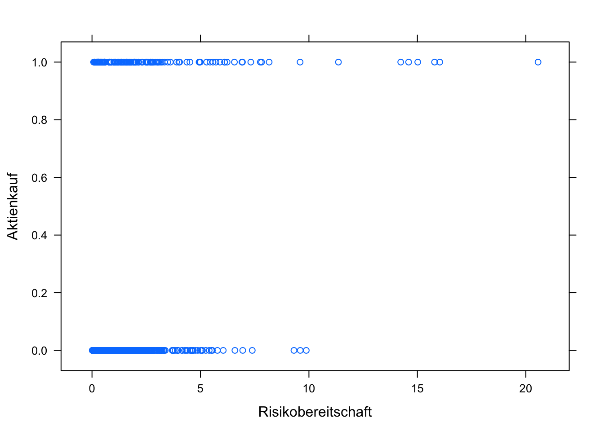
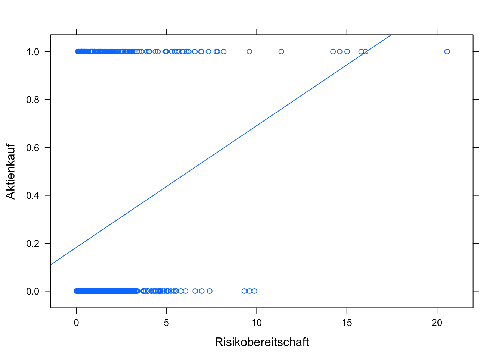
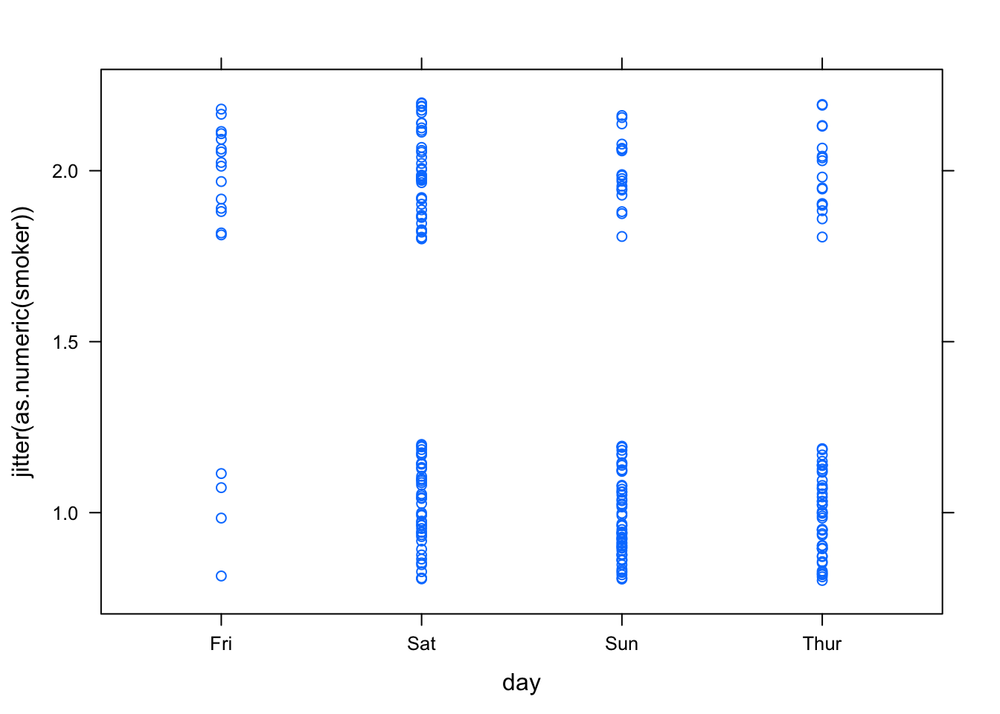
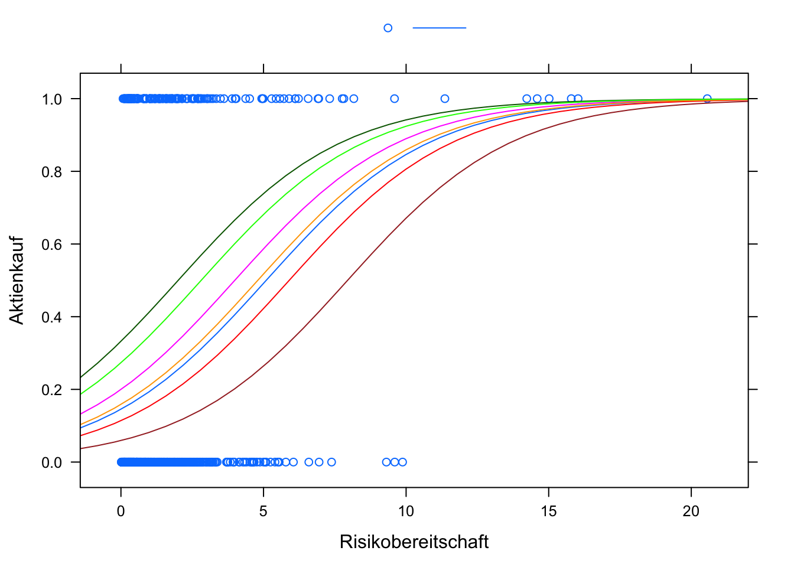
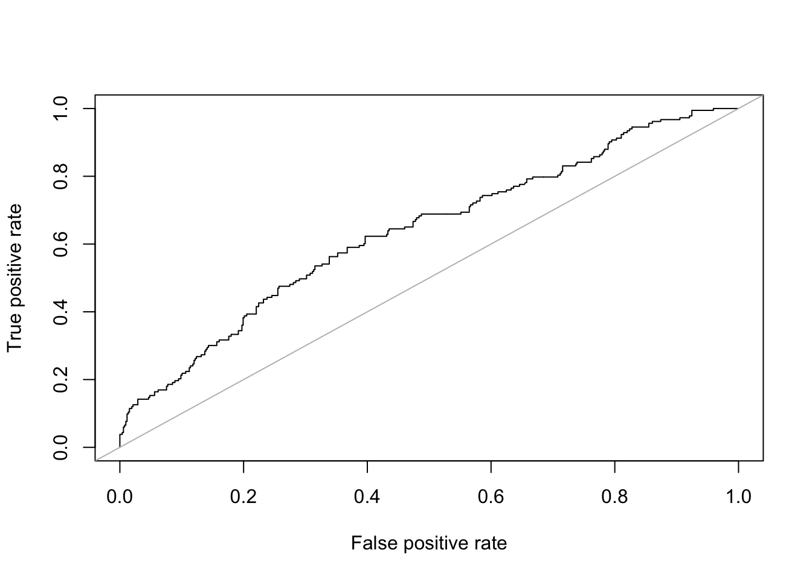

## Klassifizierende Regression

### Vorbereitung
Hier werden wir den Datensatz *Aktienkauf* der Universität Zürich ([Universität Zürich, Methodenberatung](http://www.methodenberatung.uzh.ch/de/datenanalyse/zusammenhaenge/lreg.html)) analysieren. Es handelt es sich hierbei um eine Befragung einer Bank im Zusammenhang mit den Fakten, die mit der Wahrscheinlichkeit, dass jemand Aktien erwirbt, zusammenhängen. Es wurden 700 Personen befragt. Folgende Daten wurden erhoben: Aktienkauf (0 = nein, 1 = ja), Jahreseinkommen (in Tausend CHF), Risikobereitschaft (Skala von 0 bis 25) und  Interesse an der aktuellen Marktlage (Skala von 0 bis 45).

Den Datensatz können Sie in so als `csv`-Datei herunterladen:


```r
Aktien <- read.csv2("https://raw.githubusercontent.com/luebby/Datenanalyse-mit-R/master/Daten/Aktienkauf.csv")
```

Zur Unterstützung der Analyse wird (wieder) `mosaic` und `ggplot2` verwendet.

```r
library(mosaic)
library(ggplot2)
```

### Problemstellung
Können wir anhand der Risikobereitschaft abschätzen, ob die Wahrscheinlichkeit für einen Aktienkauf steigt? Schauen wir uns zunächst ein Streudiagramm an:


```r
xyplot(Aktienkauf ~ Risikobereitschaft, data = Aktien)
```



Der Zusammenhang scheint nicht sehr ausgeprägt zu sein. Lassen Sie uns dennoch ein lineare Regression durchführen und das Ergebnis auswerten und graphisch darstellen.


```r
lm1 <- lm(Aktienkauf ~ Risikobereitschaft, data = Aktien)
summary(lm1)
```

```
## 
## Call:
## lm(formula = Aktienkauf ~ Risikobereitschaft, data = Aktien)
## 
## Residuals:
##     Min      1Q  Median      3Q     Max 
## -0.6845 -0.2434 -0.2044  0.3480  0.8138 
## 
## Coefficients:
##                    Estimate Std. Error t value Pr(>|t|)    
## (Intercept)        0.182460   0.020007   9.120  < 2e-16 ***
## Risikobereitschaft 0.050831   0.007622   6.669 5.25e-11 ***
## ---
## Signif. codes:  0 '***' 0.001 '**' 0.01 '*' 0.05 '.' 0.1 ' ' 1
## 
## Residual standard error: 0.4267 on 698 degrees of freedom
## Multiple R-squared:  0.0599,	Adjusted R-squared:  0.05855 
## F-statistic: 44.47 on 1 and 698 DF,  p-value: 5.249e-11
```

```r
plotModel(lm1)
```



Der Schätzer für die Steigung für `Risikobereitschaft` ist signifikant. Das Bestimmtheitsmaß R\textsuperscript2 ist allerdings sehr niedrig, aber wir haben bisher ja auch nur eine unabhängige Variable für die Erklärung der abhängigen Variable herangezogen.

Doch was bedeutet es, dass die Wahrscheinlichkeit ab einer Risikobereitsschaft von ca. 16 über 1 liegt?

Wahrscheinlichkeiten müssen zwischen 0 und 1 liegen. Daher brauchen wir eine Funktion, die das Ergebnis einer linearen Regression in einen Bereich von 0 bis 1 bringt, die sogenannte *Linkfunktion*. Eine häufig dafür verwendete Funktion ist die logistische Funktion: $$p(y=1)=\frac{e^\eta}{1+e^\eta}=\frac{1}{1+e^{-\eta}}$$

$\eta$, das sogenannte *Logit*, ist darin die Linearkombination der Einflussgrößen: $$\eta=\beta_0+\beta_1\cdot x_1+\dots$$

Exemplarisch können wir die logistische Funktion für einen Bereich von $\eta=-10$ bis $+10$ darstellen:


### Die Idee der logistischen Regression
Die logistische Regression ist eine Anwendung des allgemeinen linearen Modells (*general linear model, GLM*). Die Modellgleichung lautet: $$p(y_i=1)=L\bigl(\beta_0+\beta_1\cdot x_{i1}+\dots+\beta_K\cdot x_{ik}\bigr)+\epsilon_i$$

> $L$ ist die Linkfunktion, in unserer Anwendung die logistische Funktion.  
$x_{ik}$ sind die beobachten Werte der unabhängigen Variablen $X_k$.  
$k$ sind die unabhängigen Variablen $1$ bis $K$.

Die Funktion `glm` führt die logistische Regression durch. Wir schauen uns im Anschluss zunächst den Plot an.


```r
glm1 <- glm(Aktienkauf ~ Risikobereitschaft, family = binomial("logit"),
            data = Aktien)
plotModel(glm1)
```


> Es werden ein Streudiagramm der beobachten Werte sowie die *Regressionslinie* ausgegeben. Wir können so z. B. ablesen, dass ab einer Risikobereitschaft von etwa 7 die Wahrscheinlichkeit für einen Aktienkauf nach unserem Modell bei mehr als 50 % liegt.

Die Zusammenfassung des Modells zeigt folgendes:


```r
summary(glm1)
```

```
## 
## Call:
## glm(formula = Aktienkauf ~ Risikobereitschaft, family = binomial("logit"), 
##     data = Aktien)
## 
## Deviance Residuals: 
##     Min       1Q   Median       3Q      Max  
## -1.6531  -0.7384  -0.6766   0.8247   1.8226  
## 
## Coefficients:
##                    Estimate Std. Error z value Pr(>|z|)    
## (Intercept)        -1.46895    0.11842 -12.405  < 2e-16 ***
## Risikobereitschaft  0.25726    0.04676   5.501 3.77e-08 ***
## ---
## Signif. codes:  0 '***' 0.001 '**' 0.01 '*' 0.05 '.' 0.1 ' ' 1
## 
## (Dispersion parameter for binomial family taken to be 1)
## 
##     Null deviance: 804.36  on 699  degrees of freedom
## Residual deviance: 765.86  on 698  degrees of freedom
## AIC: 769.86
## 
## Number of Fisher Scoring iterations: 4
```

Der Achsenabschnitt (`intercept`) des logits $\eta$ wird mit -1.47 geschätzt, die Steigung in Richtung `Risikobereitschaft` mit 0.26. Die (Punkt-)Prognose für die Wahrscheinlickeit eines Aktienkaufs $p(y=1)$ benötigt anders als in der linearen Regression noch die Linkfunktion und ergibt sich somit zu:
$$p(\texttt{Aktienkauf}=1)=\frac{1}{1+e^{-(-1.47 + 0.26 \cdot \texttt{Risikobereitschaft})}}$$

Die p-Werte der Koeffizienten können in der Spalte `Pr(>|z|)` abgelesen werden. Hier wird ein *Wald*-Test durchgeführt, nicht wie bei der linearen Regression ein t-Test, ebenfalls mit der $H_0:\beta_i=0$. Die Teststastistik (`z value`) wird wie in der linearen Regression durch Divisions des Schätzers (`Estimate`) durch den Standardfehler (`Std. Error`) ermittelt. Im *Wald*-Test ist die Teststatistik allerdings $\chi^2$-verteilt mit einem Freiheitsgrad.

### Welche Unterschiede zur linearen Regression gibt es in der Ausgabe?
Es gibt kein R\textsuperscript2 im Sinne einer erklärten Streuung der $y$-Werte, da die beobachteten $y$-Werte nur $0$ oder $1$ annehmen können. Das Gütemaß bei der logistischen Regression ist das *Akaike Information Criterion* (*AIC*). Hier gilt allerdings: je **kleiner**, desto **besser**. (Anmerkung: es kann ein Pseudo-R\textsuperscript2 berechnet werden -- kommt später.)

Es gibt keine F-Statistik (oder ANOVA) mit der Frage, ob das Modell als Ganzes signifikant ist. (Anmerkung: es kann aber ein vergleichbarer Test durchgeführt werden -- kommt später.)

### Interpretation der Koeffizienten
#### y-Achsenabschnitt (`Intercept`) $\beta_0$ 
Für $\beta_0>0$ gilt, dass selbst wenn alle anderen unabhängigen Variablen $0$ sind, es eine Wahrscheinlichkeit von mehr als 50% gibt, dass das modellierte Ereignis eintritt. Für $\beta_0<0$ gilt entsprechend das Umgekehrte.

#### Steigung $\beta_i$ mit $i=1,2,...,K$
Für $\beta_i>0$ gilt, dass mit zunehmenden $x_i$ die Wahrscheinlichkeit für das modellierte Ereignis steigt. Bei $\beta_i<0$ nimmt die Wahrscheinlichkeit entsprechend ab.

Eine Abschätzung der Änderung der Wahrscheinlichkeit (*relatives Risiko*, *relative risk* $RR$) kann über das Chancenverhältnis (*Odds Ratio* $OR$) gemacht werden.^[Wahrscheinlichkeit vs. Chance: Die Wahrscheinlichkeit bei einem fairen Würfel, eine 6 zu würfeln, ist $1/6$. Die Chance (*Odd*), eine 6 zu würfeln, ist die Wahrscheinlichkeit dividiert durch die Gegenwahrscheinlichkeit, also $\frac{1/6}{5/6}=1/5$.] Es ergibt sich vereinfacht $e^{\beta_i}$. Die Wahrscheinlichkeit ändert sich näherungsweise um diesen Faktor, wenn sich $x_i$ um eine Einheit erhöht. **Hinweis:** $RR\approx OR$ gilt nur, wenn der Anteil des modellierten Ereignisses in den beobachteten Daten sehr klein ($<5\%$) oder sehr groß ist ($>95\%$).

*Übung*: Berechnen Sie das relative Risiko für unser Beispielmodell, wenn sich die `Risikobereitschaft` um 1 erhöht (Funktion `exp()`). Vergleichen Sie das Ergebnis mit der Punktprognose für `Risikobereitschaft `$=7$ im Vergleich zu `Risikobereitschaft `$=8$. Zur Erinnerung: Sie können `makeFun(model)` verwenden.


```r
# aus Koeffizient abgeschätzt
exp(coef(glm1)[2])
```

```
## Risikobereitschaft 
##           1.293379
```

```r
# mit dem vollständigen Modell berechnet
fun1 <- makeFun(glm1)
fun1(Risikobereitschaft = 7)
```

```
##        1 
## 0.582213
```

```r
fun1(Risikobereitschaft = 8)
```

```
##         1 
## 0.6431639
```

```r
# als Faktor ausgeben
fun1(Risikobereitschaft = 8)/fun1(Risikobereitschaft = 7)
```

```
##        1 
## 1.104688
```

Sie sehen also, die ungefähr abgeschätzte Änderung der Wahrscheinlichkeit weicht hier doch deutlich von der genau berechneten Änderung ab. Der Anteil der Datensätze mit `Risikobereitschaft`$=1$ liegt allerdings auch bei 0.26.

### Kategoriale Variablen
Wie schon in der linearen Regression können auch in der logistschen Regression kategoriale Variablen als unabhängige Variablen genutzt werden. Als Beispiel nehmen wir den Datensatz `tips` und versuchen abzuschätzen, ob sich die Wahrscheinlichkeit dafür, dass ein Raucher bezahlt hat (`smoker == yes`), in Abhängigkeit vom Wochentag ändert. 

Sofern noch nicht geschehen, können Sie so als `csv`-Datei herunterladen:

```r
tips <- read.csv("https://sebastiansauer.github.io/data/tips.csv")
```


Zunächst ein Plot:

```r
xyplot(jitter(as.numeric(smoker)) ~ day, data = tips)
```



**Hinweis:** Um zu sehen, ob es an manchen Tagen mehr Raucher gibt, sollten Sie zumindest eine Variable "verrauschen" ("*jittern*"). Da die Variable `smoker` eine nominale Variable ist und die Funktion `jitter()` nur mit numerischen Variablen arbeitet, muss sie mit `as.numeric()` in eine numerische Variable umgewandelt werden.

Die relativen Häufigkeiten zeigt folgende Tabelle:


```r
(tab_smoke <- tally(smoker ~ day, data = tips, format = "proportion"))
```

```
##       day
## smoker       Fri       Sat       Sun      Thur
##    No  0.2105263 0.5172414 0.7500000 0.7258065
##    Yes 0.7894737 0.4827586 0.2500000 0.2741935
```

Hinweis: Durch die Klammerung wird das Objekt `tab_smoke` direkt ausgegeben.

Probieren wir die logistische Regression aus:


```r
glmtips <- glm(smoker ~ day, family = binomial("logit"),data = tips)
summary(glmtips)
```

```
## 
## Call:
## glm(formula = smoker ~ day, family = binomial("logit"), data = tips)
## 
## Deviance Residuals: 
##     Min       1Q   Median       3Q      Max  
## -1.7653  -0.8006  -0.7585   1.2068   1.6651  
## 
## Coefficients:
##             Estimate Std. Error z value Pr(>|z|)    
## (Intercept)   1.3218     0.5627   2.349 0.018833 *  
## daySat       -1.3907     0.6022  -2.309 0.020928 *  
## daySun       -2.4204     0.6220  -3.891 9.96e-05 ***
## dayThur      -2.2952     0.6306  -3.639 0.000273 ***
## ---
## Signif. codes:  0 '***' 0.001 '**' 0.01 '*' 0.05 '.' 0.1 ' ' 1
## 
## (Dispersion parameter for binomial family taken to be 1)
## 
##     Null deviance: 324.34  on 243  degrees of freedom
## Residual deviance: 298.37  on 240  degrees of freedom
## AIC: 306.37
## 
## Number of Fisher Scoring iterations: 4
```

Auch hier können wir die Koeffizienten in Relation zur Referenzkategorie (hier: Freitag) interpretieren. Die Wahrscheinlichkeit ist an einem Samstag niedriger, der Wert für `daySat` ist negativ. Eine Abschätzung erhalten wir wieder mit $e^{\beta_i}$:


```r
exp(coef(glmtips)[2])
```

```
##    daySat 
## 0.2488889
```

Daher ist das Chancenverhältnis (*Odds Ratio*), dass am Samstag ein Raucher am Tisch sitzt, näherungsweise um den Faktor 0.25 niedriger als am Freitag: 


$${OR=\frac{\frac{P(Raucher|Samstag)}{1-P(Raucher|Samstag)}}
{\frac{P(Raucher|Freitag)}{1-P(Raucher|Freitag)}}
=\frac{\frac{0.4828}{0.5172}}
{\frac{0.7895}{0.2105}}
\approx 0.2489}$$


### Multiple logistische Regression
Wir kehren wieder zurück zu dem Datensatz *Aktienkauf*. Können wir unser Model `glm1` mit nur einer erklärenden Variable verbessern, indem weitere unabhängige Variablen hinzugefügt werden?


```r
glm2 <- glm(Aktienkauf ~ Risikobereitschaft + Einkommen + Interesse, 
            family = binomial("logit"),data = Aktien)
plotModel(glm2)
```



```r
summary(glm2)
```

```
## 
## Call:
## glm(formula = Aktienkauf ~ Risikobereitschaft + Einkommen + Interesse, 
##     family = binomial("logit"), data = Aktien)
## 
## Deviance Residuals: 
##     Min       1Q   Median       3Q      Max  
## -2.1303  -0.7150  -0.5390   0.5178   3.2143  
## 
## Coefficients:
##                     Estimate Std. Error z value Pr(>|z|)    
## (Intercept)        -1.667913   0.279029  -5.978 2.27e-09 ***
## Risikobereitschaft  0.347805   0.088224   3.942 8.07e-05 ***
## Einkommen          -0.021573   0.005636  -3.828 0.000129 ***
## Interesse           0.085200   0.017751   4.800 1.59e-06 ***
## ---
## Signif. codes:  0 '***' 0.001 '**' 0.01 '*' 0.05 '.' 0.1 ' ' 1
## 
## (Dispersion parameter for binomial family taken to be 1)
## 
##     Null deviance: 804.36  on 699  degrees of freedom
## Residual deviance: 679.01  on 696  degrees of freedom
## AIC: 687.01
## 
## Number of Fisher Scoring iterations: 5
```


Alle Schätzer sind signifkant zum 0.1 %-Niveau (`***` in der Ausgabe). Zunehmende Risikobereitschaft (der Einfluss ist im Vergleich zum einfachen Modell stärker geworden) und zunehmendes Interesse erhöhen die Wahrscheinlichkeit für einen Aktienkauf. Steigendes Einkommen hingegen senkt die Wahrscheinlichkeit.

Ist das Modell besser als das einfache? Ja, da der AIC-Wert von 769.86 auf 687.01 gesunken ist.

Die Graphik zeigt die Verläufe in Abhängigkeit von den verschiedenen Variablen und den Kombinationen der Variablen.

### Erweiterungen

#### Klassifikationsgüte
Logistische Regressionsmodelle werden häufig zur Klassifikation verwendet, z. B. ob der Kredit für einen Neukunden ein "guter" Kredit ist oder nicht. Daher sind die Klassifikationseigenschaften bei logistischen Modellen wichtige Kriterien.

Hierzu werden die aus dem Modell ermittelten Wahrscheinlichkeiten ab einem Schwellenwert (*cutpoint*), häufig $0.5$, einer geschätzten $1$ zugeordnet, unterhalb des Schwellenwertes einer $0$. Diese aus dem Modell ermittelten Häufigkeiten werden dann in einer sogenannten Konfusionsmatrix (*confusion matrix*) mit den beobachteten Häufigkeiten verglichen.

Daher sind wichtige Kriterien eines Modells, wie gut diese Zuordnung erfolgt. Dazu werden die Sensitivität (*True Positive Rate, TPR*), also der Anteil der mit $1$ geschätzten an allen mit $1$ beobachten Werten, und die Spezifität (*True Negative Rate*) berechnet. Ziel ist es, dass beide Werte möglichst hoch sind.

Sie können die Konfusionsmatrix "zu Fuß" berechnen, in dem Sie eine neue Variable einfügen, die ab dem cutpoint $1$ und sonst $0$ ist und mit dem Befehl `tally()` ausgeben. Alternativ können Sie das Paket `SDMTools` verwenden mit der Funktion `confusion.matrix()`. Ein Parameter ist `cutpoint`, der standardmäßig auf $0.5$ steht.


```r
# Konfusionsmatrix "zu Fuß" berechnen
# cutpoint = 0.5 setzen
# neue Variable predicted anlegen mit 1, wenn modellierte Wahrscheinlichkeit > 1 ist
cutpoint = 0.5
Aktien$predicted <- ((glm1$fitted.values) > cutpoint)*1
# Kreuztabelle berechnen
(cm <- tally(~predicted+Aktienkauf, data = Aktien))
```

```
##          Aktienkauf
## predicted   0   1
##         0 509 163
##         1   8  20
```

```r
# Sensitivität (TPR)
cm[2,2]/sum(cm[,2])
```

```
## [1] 0.1092896
```

```r
# Spezifität (TNR)
cm[1,1]/sum(cm[,1])
```

```
## [1] 0.9845261
```

```r
# mit Hilfe des Pakets SDMTools
# ggf. install.packages("SDMTools")
library(SDMTools)
# optional noch Parameter cutpoint = 0.5  angeben
(cm <- confusion.matrix(Aktien$Aktienkauf, glm1$fitted.values)) 
```

```
##     obs
## pred   0   1
##    0 509 163
##    1   8  20
## attr(,"class")
## [1] "confusion.matrix"
```

```r
sensitivity(cm)
```

```
## [1] 0.1092896
```

```r
specificity(cm)
```

```
## [1] 0.9845261
```


Wenn die Anteile der $1$ in den beobachteten Daten sehr gering sind (z. B. bei einem medizinischem Test auf eine seltene Krankheit, Klicks auf einen Werbebanner oder Kreditausfall), kommt eine Schwäche der logistischen Regression zum Tragen: Das Modell wird so optimiert, dass die Wahrscheinlichkeiten $p(y=1)$ alle unter $0.5$ liegen. Das würde zu einer Sensitität von $0$ und einer Spezifiät von $1$ führen. Daher kann es sinnvoll sein, den Cutpoint zu varieren. Daraus ergibt sich ein verallgemeinertes Gütemaß, die *ROC*-Kurve (*Return Operating Characteristic*) und den daraus abgeleiteten *AUC*-Wert (*Area Under Curve*). 

Hierzu wird der Cutpoint zwischen 0 und 1 variiert und die Sensitivität gegen $1-$Spezifität (welche Werte sind als $1$ modelliert worden unter den beobachten $0$, *False Positive Rate, FPR*). Um diese Werte auszugeben, benötigen Sie das Paket `ROCR` und die Funktion `performance()`.


```r
# ggf. install.packages("ROCR")
library(ROCR)
```

```
## Loading required package: gplots
```

```
## 
## Attaching package: 'gplots'
```

```
## The following object is masked from 'package:stats':
## 
##     lowess
```

```
## Loading required package: methods
```

```r
# Ein für die Auswertung notwendiges prediction Objekt anlegen
pred <- prediction(glm1$fitted.values, Aktien$Aktienkauf)
# ROC Kurve
perf <- performance(pred,"tpr","fpr")
plot(perf)
abline(0,1, col = "grey")
```



```r
# Area under curve (ROC-Wert)
performance(pred,"auc")@y.values
```

```
## [[1]]
## [1] 0.6361892
```


AUC liegt zwischen $0.5$, wenn das Modell gar nichts erklärt (im Plot die graue Linie) und $1$. Hier ist der Wert also recht gering. Akzeptable Werte liegen bei $0.7$ und größer, gute Werte sind es ab $0.8$.^[Hosmer/Lemeshow, Applied Logistic Regression, 3rd Ed. (2013), S. 164]


#### Modellschätzung
Das Modell wird nicht wie bei der lineare Regression über die Methode der kleinsten Quadrate (OLS) geschätzt, sondern über die *Maximum Likelihood* Methode. Die Koeffizienten werden so gewählt, dass die beobachteten Daten am wahrscheinlichsten (*Maximum Likelihood*) werden.

Das ist ein iteratives Verfahren (OLS erfolgt rein analytisch), daher wird in der letzten Zeile der Ausgabe auch die Anzahl der Iterationen (`Fisher Scoring Iterations`) ausgegeben.

Die Devianz des Modells (`Residual deviance`) ist $-2$ mal die logarithmierte Likelihood. Die Nulldevianz (`Null deviance`) ist die Devianz eines Nullmodells, d. h., alle $\beta$ außer der Konstanten sind 0.

#### Likelihood Quotienten Test
Der Likelihood Quotienten Test (*Likelihood Ratio Test, LR-Test*) vergleicht die Likelihood $L_0$ des Nullmodels mit der Likelihood $L_{\beta}$ des geschätzten Modells. Die Prüfgröße des LR-Tests ergibt sich aus: $${T=-2\cdot ln\left( \frac{L_0}{L_{\beta}}\right)}$$
$T$ ist näherungsweise $\chi ^2$-verteilt mit $k$ Freiheitsgraden.

In R können Sie den Test mit `lrtest()` aufrufen. Sie benötigen dazu das Paket `lmtest`.


```r
library(lmtest)
```

```
## Loading required package: zoo
```

```
## 
## Attaching package: 'zoo'
```

```
## The following objects are masked from 'package:base':
## 
##     as.Date, as.Date.numeric
```

```r
lrtest(glm2)
```

```
## Likelihood ratio test
## 
## Model 1: Aktienkauf ~ Risikobereitschaft + Einkommen + Interesse
## Model 2: Aktienkauf ~ 1
##   #Df  LogLik Df  Chisq Pr(>Chisq)    
## 1   4 -339.50                         
## 2   1 -402.18 -3 125.36  < 2.2e-16 ***
## ---
## Signif. codes:  0 '***' 0.001 '**' 0.01 '*' 0.05 '.' 0.1 ' ' 1
```


Das Modell `glm2` ist als Ganzes signifikant, der p-Wert ist sehr klein.

Den Likelihood Quotienten Test können Sie auch verwenden, um zwei Modelle miteinander zu vergleichen, z. B., wenn Sie eine weitere Variable hinzugenommen haben und wissen wollen, ob die Verbesserung auch signifikant war.


```r
lrtest(glm1, glm2)
```

```
## Likelihood ratio test
## 
## Model 1: Aktienkauf ~ Risikobereitschaft
## Model 2: Aktienkauf ~ Risikobereitschaft + Einkommen + Interesse
##   #Df  LogLik Df  Chisq Pr(>Chisq)    
## 1   2 -382.93                         
## 2   4 -339.50  2 86.856  < 2.2e-16 ***
## ---
## Signif. codes:  0 '***' 0.001 '**' 0.01 '*' 0.05 '.' 0.1 ' ' 1
```


Ja, die Modelle `glm1` (mit einer erklärenden Variable) und `glm2` unterscheiden sich signifikant voneinander.


#### Pseudo-R\textsuperscript2 
Verschiedene Statistiker haben versucht, aus der Likelihood eine Größe abzuleiten, die dem R\textsuperscript2 der linearen Regression entspricht. Exemplarisch sei hier McFaddens R\textsuperscript2 gezeigt: $${R^2=1-\frac{ln(L_{\beta})}{ln(L_0)}}$$ Wie bei bei dem R\textsuperscript2 der linearen Regression liegt der Wertebereich zwischen 0 und 1. Ab einem Wert von 0,4 kann die Modellanpassung als gut eingestuft werden. Wo liegen  R\textsuperscript2 der beiden Modelle `glm1` und `glm2`? Sie können es direkt berechnen oder das Paket `BaylorEdPsych` verwenden.


```r
# direkte Berechnung
1 - glm1$deviance/glm1$null.deviance
```

```
## [1] 0.04786616
```

```r
1 - glm2$deviance/glm2$null.deviance
```

```
## [1] 0.1558465
```

```r
# ggf. install.packages("BaylorEdPsych")
library(BaylorEdPsych)
PseudoR2(glm1)
```

```
##         McFadden     Adj.McFadden        Cox.Snell       Nagelkerke 
##       0.04786616       0.04040685       0.05351732       0.07834758 
## McKelvey.Zavoina           Effron            Count        Adj.Count 
##       0.08260722       0.05840899       0.75571429       0.06557377 
##              AIC    Corrected.AIC 
##     769.86238269     769.87959934
```

```r
PseudoR2(glm2)
```

```
##         McFadden     Adj.McFadden        Cox.Snell       Nagelkerke 
##       0.15584653       0.14341435       0.16396262       0.24003587 
## McKelvey.Zavoina           Effron            Count        Adj.Count 
##       0.28278782       0.18453835       0.76142857       0.08743169 
##              AIC    Corrected.AIC 
##     687.00683459     687.06438855
```


Insgesamt ist die Modellanpassung, auch mit allen Variablen, als schlecht zu bezeichnen. **Hinweis:** Die Funktion `PseudoR2(model)` zeigt verschiedene Pseudo-R\textsuperscript2 Statistiken, die jeweils unter bestimmten Bedingungen vorteilhaft einzusetzen sind. Für weitere Erläuterungen sei auf die Literatur verwiesen.


### Übung: Rot- oder Weißwein?

Der Datensatz untersucht den Zusammenhang zwischen der Qualität und physiochemischen Eigenschaften von portugisieschen Rot- und Weißweinen. 

*P. Cortez, A. Cerdeira, F. Almeida, T. Matos and J. Reis. Modeling wine preferences by data mining from physicochemical properties. In Decision Support Systems, Elsevier, 47(4):547-553, 2009.*

Sie können in [hier](https://goo.gl/Dkd7nK)). Die Originaldaten finden Sie im UCI [Machine Learning Repository](http://archive.ics.uci.edu/ml/datasets/Wine+Quality).

Versuchen Sie anhand geeigneter Variablen, Rot- und Weißweine zu klassifizieren.^[Anregungen zu dieser Übung stammen von [INTW Statistics](https://www.inwt-statistics.de/blog-artikel-lesen/Logistische_Regression_Beispiel_mit_R.html)]

**Zusatzaufgabe:** Die Originaldaten bestehen aus einem Datensatz für Weißweine und einem für Rotweine. Laden Sie diese, beachten Sie die Fehlermeldung und beheben die damit verbundenen Fehler und fassen beide Datensätze zu einem gemeinsamen Datensatz zusammen, in dem eine zusätzliche Variable `color` aufgenommen wird (Rot = 0, Weiß = 1).


### Literatur


- David M. Diez, Christopher D. Barr, Mine &Ccedil;etinkaya-Rundel (2014): *Introductory Statistics with Randomization and Simulation*, [https://www.openintro.org/stat/textbook.php?stat_book=isrs](https://www.openintro.org/stat/textbook.php?stat_book=isrs),  Kapitel 6.4
- Nicholas J. Horton, Randall Pruim, Daniel T. Kaplan (2015): Project MOSAIC Little Books *A Student's Guide to R*,  [https://github.com/ProjectMOSAIC/LittleBooks/raw/master/StudentGuide/MOSAIC-StudentGuide.pdf](https://github.com/ProjectMOSAIC/LittleBooks/raw/master/StudentGuide/MOSAIC-StudentGuide.pdf), Kapitel 8
 - Gareth James, Daniela Witten, Trevor Hastie, Robert Tibshirani (2013): *An Introduction to Statistical Learning -- with Applications in R*, [http://www-bcf.usc.edu/~gareth/ISL/](http://www-bcf.usc.edu/~gareth/ISL/), Kapitel 4.1-4.3
- Maike Luhmann (2015): *R für Einsteiger*, Kapitel 17.5
- Daniel Wollschläger (2014): *Grundlagen der Datenanalyse mit R*, Kapitel 8.1


