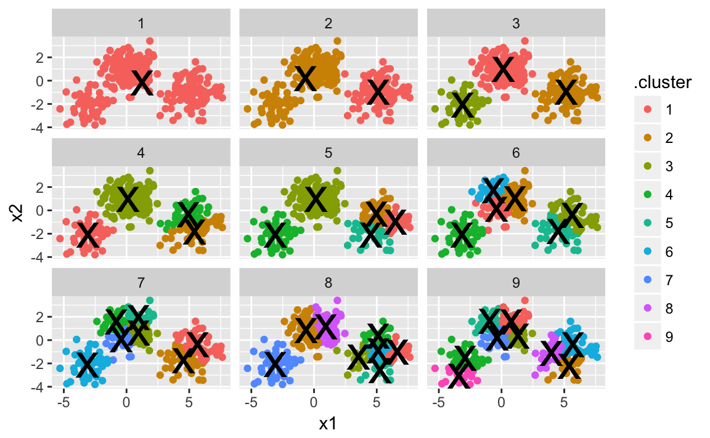
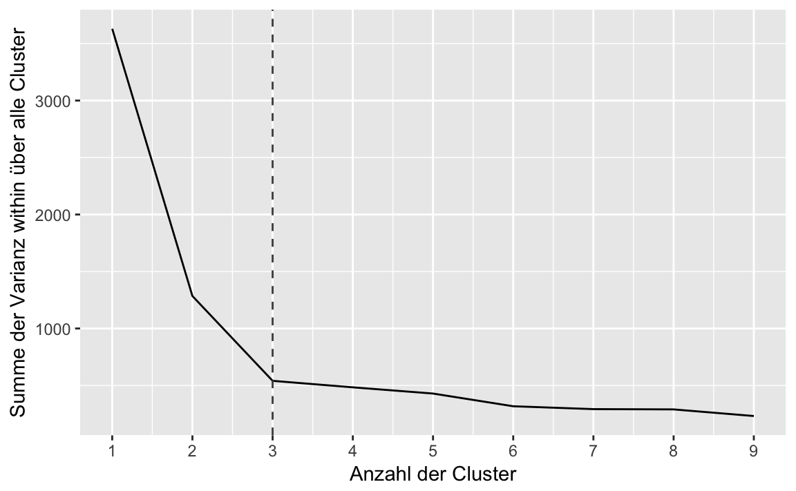
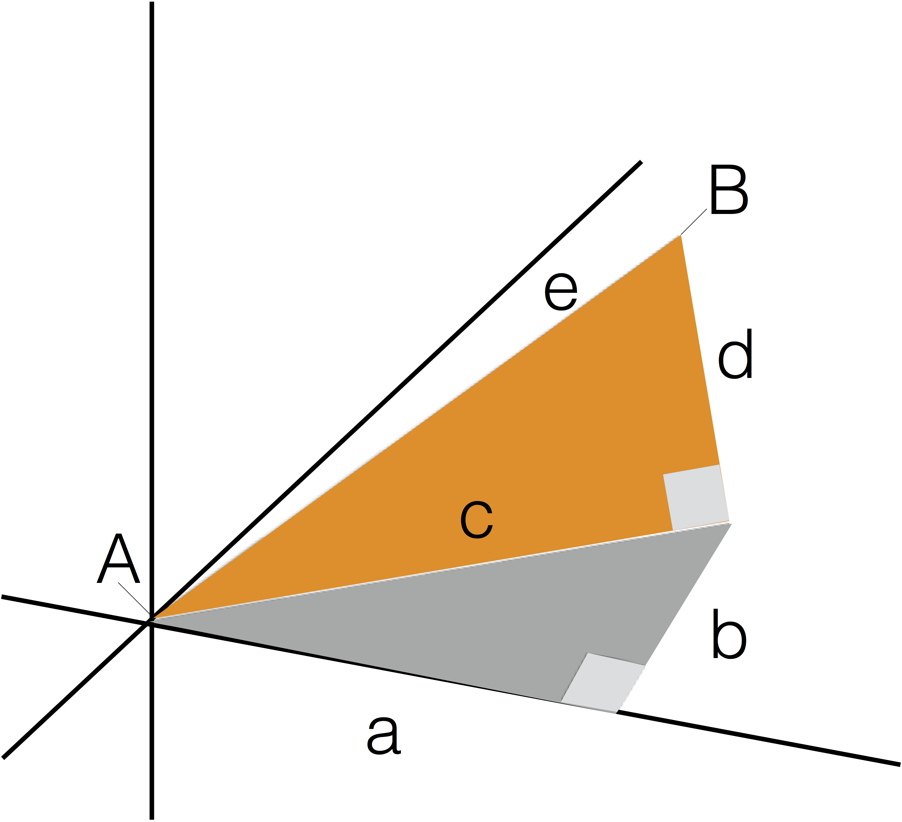

\part{Ungeleitetes Modellieren}


# Vertiefung: Clusteranalyse {#cluster}


Benötigte Pakte:


```r
library(tidyverse)
library(cluster)
```


\BeginKnitrBlock{rmdcaution}<div class="rmdcaution">Lernziele:

- Das Ziel einer Clusteranalyse erläutern können.
- Das Konzept der euklidischen Abstände verstehen.
- Eine k-Means-Clusteranalyse berechnen und interpretieren können.
</div>\EndKnitrBlock{rmdcaution}


## Einführung

Das Ziel einer Clusteranalyse ist es, Gruppen von Beobachtungen (d. h. *Cluster*) zu finden, die innerhalb der Cluster möglichst homogen, zwischen den Clustern möglichst heterogen sind. Um die Ähnlichkeit von Beobachtungen zu bestimmen, können verschiedene Distanzmaße herangezogen werden. Für metrische Merkmale wird z. B. häufig die euklidische Metrik verwendet, d. h., Ähnlichkeit und Distanz werden auf Basis des euklidischen Abstands bestimmt. Aber auch andere Abstände wie "Manhatten" oder "Gower" sind möglich. Letztere haben den Vorteil, dass sie nicht nur für metrische Daten sondern auch für gemischte Variablentypen verwendet werden können. Wir werden uns hier auf den euklischen Abstand konzentrieren.


## Intuitive Darstellung der Clusteranalayse


Betrachten Sie das folgende Streudiagramm (die Daten sind frei erfunden; "simuliert", sagt der Statistiker). Es stellt den Zusammenhang von Lernzeit (wieviel ein Student für eine Statistikklausur lernt) und dem Klausurerfolg (wie viele Punkte ein Student in der Klausur erzielt) dar. Sehen Sie Muster? Lassen sich Gruppen von Studierenden mit bloßem Auge abgrenzen (Abb. \@ref(fig:cluster1))?

<div class="figure" style="text-align: center">

<p class="caption">(\#fig:cluster1)Ein Streudiagramm - sehen Sie Gruppen (Cluster) ?</p>
</div>

Färben wir das Diagramm mal ein (Abb. \@ref(fig:cluster2)).

<div class="figure" style="text-align: center">

<p class="caption">(\#fig:cluster2)Ein Streudiagramm - mit drei Clustern</p>
</div>

Nach dieser "Färbung", d.h. nach dieser Aufteilung in drei Gruppen, scheint es folgende "Cluster", "Gruppen" oder "Typen" von Studierenden zu geben:

 - "Blaue Gruppe": Fälle dieser Gruppe lernen wenig und haben wenig Erfolg in der Klausr. Tja.
 
 - "Rote Gruppe": Fälle dieser Gruppe lernen viel; der Erfolg ist recht durchwachsen.
 
 - "Grüne Gruppe": Fälle dieser Gruppe lernen mittel viel und erreichen einen vergleichsweise großen Erfolg in der Klausur.


Drei Gruppen scheinen ganz gut zu passen. Wir hätten theoretisch auch mehr oder weniger Gruppen unterteilen können. Die Clusteranalyse gibt keine definitive Anzahl an Gruppen vor; vielmehr gilt es, aus theoretischen und statistischen Überlegungen heraus die richtige Anzahl auszuwählen (dazu gleich noch mehr).

Unterteilen wir zur Illustration den Datensatz einmal in bis zu 9 Cluster (Abbildung \@ref(fig:cluster3)).


<div class="figure" style="text-align: center">

<p class="caption">(\#fig:cluster3)Unterschiedliche Anzahlen von Clustern im Vergleich</p>
</div>

Das "X" soll den "Mittelpunkt" des Clusters zeigen. Der Mittelpunkt ist so gewählt, dass die Distanz von jedem Punkt zum Mittelpunkt möglichst kurz ist. Dieser Abstand wird auch "Varianz innerhalb des Clusters" oder kurz "Varianz within" bezeichnet. Natürlich wird diese Varianz within immer kleiner, je größer die Anzahl der Cluster wird.

<div class="figure" style="text-align: center">

<p class="caption">(\#fig:cluster4)Die Summe der Varianz within in Abhängigkeit von der Anzahl von Clustern. Ein Screeplot.</p>
</div>

Die vertikale gestrichtelte Linie zeigt an, wo die Einsparung an Varianz auf einmal "sprunghaft" weniger wird - just an jedem Knick bei x=3; dieser "Knick" wird auch "Ellbogen" genannt (da sage einer, Statistiker haben keine Phantasie). Man kann jetzt sagen, dass 3 Cluster eine gute Lösung seien, weil mehr Cluster die Varianz innerhalb der Cluster nur noch wenig verringern. Diese Art von Diagramm wird als "Screeplot" bezeihchnet. Fertig!


## Euklidische Distanz

Aber wie weit liegen zwei Punkte entfernt? Betrachten wir ein Beispiel. Anna und Berta sind zwei Studentinnen, die eine Statistikklausur ~~geschrieben haben~~schreiben mussten (bedauernswert). Die beiden unterscheiden sich sowohl in Lernzeit als auch in Klausurerfolg. Aber wie sehr unterscheiden sie sich? Wie groß ist der "Abstand" zwischen Anna und Berta (vgl. Abb. \@ref(fig:distanz))?

<div class="figure" style="text-align: center">

<p class="caption">(\#fig:distanz)Distanz zwischen zwei Punkten in der Ebene</p>
</div>


Eine Möglichkeit, die Distanz zwischen zwei Punkten in der Ebene (2D) zu bestimmen, ist der *Satz des Pythagoras* (leise Trompetenfanfare). Generationen von Schülern haben diese Gleichung ähmm... geliebt:

$$c^2 = a^2 + b^2$$

In unserem Beispiel heißt das $c^2 = 3^2+4^2 = 25$. Folglich ist $\sqrt{c^2}=\sqrt{25}=5$. Der Abstand oder der Unterschied zwischen Anna und Berta beträgt also 5 - diese Art von "Abstand" nennt man den *euklidischen Abstand*\index{euklidischen Abstand}.

Aber kann man den euklidischen Abstand auch in 3D (Raum) verwenden? Oder gar in Räumen mehr mehr Dimensionen??? Betrachten wir den Versuch, zwei Dreiecke in 3D zu zeichnen. Stellen wir uns vor, zusätzlich zu Lernzeit und Klausurerfolg hätten wir als 3. Merkmal der Studentinnen noch "Statistikliebe" erfasst (Bertas Statistikliebe ist um 2 Punkte höher als Annas).

<div class="figure" style="text-align: center">

<p class="caption">(\#fig:pythagoras2)Pythagoras in 3D</p>
</div>

Sie können sich Punkt $A$ als Ecke eines Zimmers vorstellen; Punkt $B$ schwebt dann in der Luft, in einiger Entfernung zu $A$.  

Wieder suchen wir den Abstand zwischen den Punkten $A$ und $B$. Wenn wir die Länge $e$ wüssten, dann hätten wir die Lösung; $e$ ist der Abstand zwischen $A$ und $B$. Im orange farbenen Dreieck gilt wiederum der Satz von Pythagoras: $c^2+d^2=e^2$. Wenn wir also $c$ und $d$ wüssten, so könnten wir $e$ berechnen... $c$ haben wir ja gerade berechnet (5) und $d$ ist einfach der Unterschied in Statistikliebe zwischen Anna und Berta (2)! Also

$$e^2 = c^2 + d^2$$
$$e^2 = 5^2 + 2^2$$
$$e^2 = 25 + 4$$

$$e = \sqrt{29} \approx 5.4$$

Ah! Der Unterschied zwischen den beiden Studentinnen beträgt also ~5.4!

Intuitiv gesprochen, "schalten wir mehrere Pythagoras-Sätze hintereinander".

>   Der euklidische Abstand berechnet sich mit Pythagoras' Satz!


<div class="figure" style="text-align: center">

<p class="caption">(\#fig:pythagoras)Pythagoras in Reihe geschaltet</p>
</div>

Das geht nicht nur für "zwei Dreiecke hintereinander", sondern der Algebra ist es wurscht, wie viele Dreiecke das sind.

>   Um den Abstand zweier Objekte mit *k* Merkmalen zu bestimmen, kann der euklische Abstand berechnet werden mit. Bei k=3 Merkmalen lautet die Formel dann $e^2 = a^2 + b^2 + d^2$. Bei mehr als 3 Merkmalen erweitert sich die Formel entsprechend.


Dieser Gedanken ist mächtig! Wir können von allen möglichen Objekten den Unterschied bzw. die (euklidische) Distanz ausrechnen! Betrachten wir drei Professoren, die einschätzen sollten, wir sehr sie bestimmte Filme mögen (1: gar nicht; 10: sehr). Die Filme waren: "Die Sendung mit der Maus", "Bugs Bunny", "Rambo Teil 1", "Vom Winde verweht" und "MacGyver".


```r
profs <- data_frame(
  film1 = c(9, 1, 8),
  film2 = c(8, 2, 7),
  film3 = c(1, 8, 3),
  film4 = c(2, 3, 2),
  film5 = c(7, 2, 6)
)

```

Betrachten Sie die Film-Vorlieben der drei Professoren. Gibt es ähnliche Professoren hinsichtlich der Vorlieben? Welche Professoren haben eingen größeren "Abstand" in ihren Vorlieben? 

Wir könnten einen "fünffachen Pythagoras" zu Rate ziehen. Praktischerweise gibt es aber eine R-Funktion, die uns die Rechnerei abnimmt:


```r
dist(profs)
#>       1     2
#> 2 13.23      
#> 3  2.65 10.77
```

Offenbar ist der (euklidische) Abstand zwischen Prof. 1 und 2 groß (13.2); zwischen Prof 2 und 3 auch recht groß (10.8). Aber der Abstand zwischen Prof. 1 und 3 ist relativ klein! Endlich hätten wir diese Frage auch geklärt. Sprechen Sie Ihre Professoren auf deren Filmvorlieben an...

## Daten

Schauen wir uns eine Clusteranalyse praktisch an. Wir werden einen *simulierten* Datensatz  aus @Chapman2015 analysieren. Näheres zu den Daetn siehe Kapitel 5 dort.

Sie können ihn von <https://goo.gl/eUm8PI> als `csv`-Datei herunterladen; oder, wenn sich die Datei im Unterordner `data/` (relativ zu ihrem Arbeitsverzeichnis) befindet:


```r
segment <- read.csv2("data/segment.csv")
```


Wir verwenden die Variante `read.csv2`, da es sich um eine "deutsche" CSV-Datei handelt.


Ein Überblick über die Daten verschafft uns die Funktion `glimpse`.

```r
glimpse(segment)
#> Observations: 300
#> Variables: 7
#> $ Alter          <dbl> 50.2, 40.7, 43.0, 40.3, 41.1, 40.2, 39.5, 35.7,...
#> $ Geschlecht     <fctr> Mann, Mann, Frau, Mann, Frau, Mann, Frau, Mann...
#> $ Einkommen      <dbl> 51356, 64411, 71615, 42728, 71641, 60325, 54746...
#> $ Kinder         <int> 0, 3, 2, 1, 4, 2, 5, 1, 1, 0, 3, 4, 0, 2, 6, 0,...
#> $ Eigenheim      <fctr> Nein, Nein, Ja, Nein, Nein, Ja, Nein, Nein, Ne...
#> $ Mitgliedschaft <fctr> Nein, Nein, Nein, Nein, Nein, Nein, Ja, Ja, Ne...
#> $ Segment        <fctr> Gemischte Vorstadt, Gemischte Vorstadt, Gemisc...
```


## Distanzmaße mit R berechnen


Auf Basis der drei metrischen Merkmale (d. h. `Alter`, `Einkommen` und `Kinder`) ergeben sich für die ersten sechs Beobachtungen folgende Abstände:

```r
dist(head(segment))
#>         1       2       3       4       5
#> 2 19941.8                                
#> 3 30946.1 11004.3                        
#> 4 13179.5 33121.3 44125.6                
#> 5 30985.9 11044.0    39.9 44165.3        
#> 6 13700.4  6241.5 17245.8 26879.9 17285.5
```

Sie können erkennen, dass die Beobachtungen `5` und `3` den kleinsten Abstand haben, während `5` und `4` den größten haben. Allerdings zeigen die Rohdaten auch, dass die euklidischen Abstände von der Skalierung der Variablen abhängen (`Einkommen` streut stärker als `Kinder`). Daher kann es evt. sinnvoll sein, die Variablen vor der Analyse zu standardisieren (z. B. über `scale()`). 

Mit der Funktion `daisy()` aus dem Paket `cluster` kann man sich auch den Abstand zwischen den Objekten ausgeben lassen. Die Funktion errechnet auch Abstandsmaße, wenn die Objekte aus Variablen mit unterschiedlichen Skalenniveaus bestehen


```r
daisy(head(segment))
```


## k-Means Clusteranalyse

Beim k-Means Clusterverfahren handelt es sich um eine bestimmte Form von Clusteranalysen; zahlreiche Alternativen existieren, aber die k-Means Clusteranalyse ist recht verbreitet. Im Gegensatz zur z.B. der hierarchischen Clusteranalyse um ein partitionierendes Verfahren. Die Daten werde in $k$ Cluster aufgeteilt -- dabei muss die Anzahl der Cluster im vorhinein feststehen. Ziel ist es, dass die Quadratsumme der Abweichungen der Beobachtungen im Cluster zum Clusterzentrum minimiert wird. 

Der Ablauf des Verfahrens ist wie folgt:

1.  Zufällige Beobachtungen als Clusterzentrum
2.  Zuordnung der Beobachtungen zum nächsten Clusterzentrum (Ähnlichkeit, z. B. über die euklidische Distanz)
3.  Neuberechnung der Clusterzentren als Mittelwert der dem Cluster zugeordneten Beobachtungen

Dabei werden die Schritte 2. und 3. solange wiederholt, bis sich keine Änderung der Zuordnung mehr ergibt -- oder eine maximale Anzahl an Iterationen erreicht wurde.


Zur Vorbereitung überführen wir die nominalen Merkmale in logische, d. h. binäre Merkmale und löschen die Segmente sowie das Ergebnis der hierarchischen Clusteranalyse:

```r
segment.num <- segment %>%
  mutate(Frau = Geschlecht == "Frau") %>%
  mutate(Eigenheim = Eigenheim == "Ja") %>%
  mutate(Mitgliedschaft = Mitgliedschaft == "Ja") %>%
  dplyr::select(-Geschlecht, -Segment)
```

Über die Funktion `mutate()` werden Variablen im Datensatz erzeugt oder verändert. Über `select()` werden einzene Variablen ausgewählt. Mit der "Pfeife" `%>%` übergeben wir das Ergebnis der vorherigen Funktion an die folgende.

Aufgrund von (1.) hängt das Ergebnis einer k-Means Clusteranalyse vom Zufall ab. Aus Gründen der Reproduzierbarkeit sollte daher der Zufallszahlengenerator gesetzt werden. Außerdem bietet es sich an verschiedene Startkonfigurationen zu versuchen. in der Funktion `kmeans()` erfolgt dies durch die Option `nstart =`. Hier mit `k = 4` Clustern:


```r
set.seed(1896)

seg.k <- kmeans(segment.num, centers = 4, nstart = 10)
seg.k
#> K-means clustering with 4 clusters of sizes 111, 26, 58, 105
#> 
#> Cluster means:
#>   Alter Einkommen Kinder Eigenheim Mitgliedschaft  Frau
#> 1  42.9     46049  1.649     0.505         0.1081 0.568
#> 2  56.4     85973  0.385     0.538         0.0385 0.538
#> 3  27.0     22608  1.224     0.276         0.2069 0.414
#> 4  43.6     62600  1.505     0.457         0.1238 0.590
#> 
#> Clustering vector:
#>   [1] 1 4 4 1 4 4 4 1 2 4 1 1 4 4 1 1 1 1 1 4 4 4 1 4 1 1 1 1 4 1 4 4 1 1 2
#>  [36] 1 4 1 1 4 4 4 1 4 4 4 4 1 1 1 1 1 2 1 1 4 4 4 4 1 4 1 4 1 1 1 1 4 4 4
#>  [71] 4 1 1 4 1 1 4 4 4 4 1 4 1 3 1 4 1 1 1 1 4 4 4 1 1 4 1 4 4 4 3 3 3 3 3
#> [106] 3 3 3 3 3 3 3 3 3 3 3 3 3 3 3 3 3 3 3 3 3 3 3 3 3 3 3 3 3 3 3 3 3 3 3
#> [141] 3 3 3 3 3 3 3 3 3 3 1 2 4 2 2 4 1 1 2 2 4 4 1 1 4 2 4 4 1 2 2 3 4 1 2
#> [176] 2 4 2 3 4 4 4 1 1 1 1 1 1 4 3 1 4 4 4 4 1 1 1 2 4 4 1 2 4 4 1 4 2 1 2
#> [211] 4 3 4 2 2 4 2 1 4 3 1 2 2 4 2 4 4 1 4 4 1 1 1 1 1 3 1 1 4 1 4 3 1 4 1
#> [246] 4 1 4 1 4 4 4 4 1 1 1 4 4 1 1 1 1 1 1 4 1 1 1 1 1 2 4 4 1 4 1 1 1 1 2
#> [281] 4 4 4 4 1 4 1 4 4 4 1 4 1 4 1 4 1 1 4 1
#> 
#> Within cluster sum of squares by cluster:
#> [1] 3.18e+09 2.22e+09 1.69e+09 2.81e+09
#>  (between_SS / total_SS =  90.6 %)
#> 
#> Available components:
#> 
#> [1] "cluster"      "centers"      "totss"        "withinss"    
#> [5] "tot.withinss" "betweenss"    "size"         "iter"        
#> [9] "ifault"
```
Neben der Anzahl Beobachtungen im Cluster (z. B. 26 in Cluster 2) werden auch die Clusterzentren ausgegeben. Diese können dann direkt verglichen werden. Sie sehen z. B., dass das Durchschnittsalter in Cluster 3 mit 27 am geringsten ist. Der Anteil der Eigenheimbesitzer ist mit 54 \% in Cluster 2 am höchsten.

In zwei Dimensionen kann man Cluster gut visualisieren (Abbildung \@ref(fig:cluster3)).; in drei Dimensionen wird es schon unübersichtlich. Mehr Dimensionen sind schwierig. Daher ist es oft sinnvoll, die Anzahl der Dimensionen durch Verfahren der Dimensionsreduktion zu verringern. Die Hauptkomponentenanalyse oder die Faktorenanalyse bieten sich dafür an.

Einen Plot der Scores auf den beiden ersten Hauptkomponenten können Sie über die Funktion `clusplot()` aus dem Paket `cluster` erhalten.

```r
clusplot(segment.num, seg.k$cluster, 
         color = TRUE, shade = TRUE, labels = 4)
```


Wie schon im deskriptiven Ergebnis: Die Cluster `1` und `4` unterscheiden sich (in den ersten beiden Hauptkomponenten) nicht wirklich. Vielleicht sollten dies noch zusammengefasst werden, d. h., mit `centers=3` die Analyse wiederholt werden?


## Aufgaben^[R, R, F, F, R]

\BeginKnitrBlock{rmdexercises}<div class="rmdexercises">Richtig oder Falsch!?

1. Die Clusteranalyse wird gemeinhin dazu verwenden, *Objekte* nach Ähnlichkeit zu Gruppen zuammenzufassen.

1. Die Varianz innerhalb eines Clusters kann als Maß für die Anzahl der zu extrahierenden Cluster herangezogen werden.

1. Unter euklidischer Distanz versteht jedes Maß, welches den Abstand zwischen Punkten in der Ebene misst.

4. Bei der k-means-Clusteranalyse darf man die Anzahl der zu extrahierenden Clustern nicht vorab festlegen.

5. Cluster einer k-means-Clusteranalyse werden so bestimmt, dass die Cluster möglichst homogen sind, d.h. möglichst wenig Streuung aufweisen (m.a.W. möglichst nah am Cluster-Zentrum sind).
</div>\EndKnitrBlock{rmdexercises}


Laden Sie den Datensatz `extra` zur Extraversion.

1. Unter Berücksichtigung der 10 Extraversionsitems: Lassen sich die Teilnehmer der Umfrage in eine Gruppe oder in mehrere Gruppen einteilen? Wenn in mehrere Gruppen, wie viele Gruppen passen am besten?

1. Berücksichtigen Sie den Extraversionsmittelwert und einige andere Variablen aus dem Datensatz (aber nicht die Items). Welche Gruppen ergeben sich? Versuchen Sie die Gruppen zu interpretieren!

1. Suchen Sie sich zwei Variablen aus dem Datensatz und führen Sie auf dieser Basis eine Clusteranalyse durch. Visualisieren Sie das Ergebnis anhand eines Streudiagrammes oder ähnlichen Datensatzes!


## Befehlsübersicht


Tabelle \@ref(tab:befehle-cluster) fasst die R-Funktionen dieses Kapitels zusammen.


Table: (\#tab:befehle-cluster)Befehle des Kapitels 'Clusteranalyse'

Paket::Funktion     Beschreibung                                         
------------------  -----------------------------------------------------
dist                Berechnet den euklidischen Abstand zwischen Vektoren 
dplyr::glimpse      Stellt einen Dataframe im Überblick dar              
cluster::daisy      Berechnet verschiedene Abstandsmaße                  
set.seed            Zufallsgenerator auf bestimmte Zahlen festlegen      
cluster::clusplot   Visualisiert eine Clusteranalyse                     


## Verweise

- Diese Übung orientiert sich am Beispiel aus Kapitel 11.3 aus @Chapman2015 und steht unter der Lizenz [Creative Commons Attribution-ShareAlike 3.0 Unported](http://creativecommons.org/licenses/by-sa/3.0). Der Code steht unter der [Apache Lizenz 2.0](http://www.apache.org/licenses/LICENSE-2.0)

- Der erste Teil dieser Übung basiert auf diesem Skript: <https://cran.r-project.org/web/packages/broom/vignettes/kmeans.html>

- Eine weiterführende, aber gut verständliche Einführung findet sich bei @james2013introduction.

- Die Intuition zum euklidischen Abstand mit Pythagoras' Satz kann hier im Detail nachgelesen werden: <https://betterexplained.com/articles/measure-any-distance-with-the-pythagorean-theorem/>.


