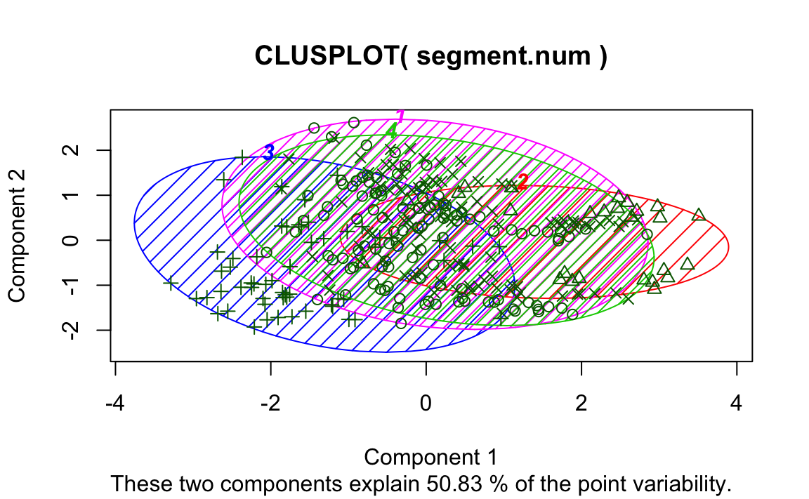

Benötigte Pakte:


```r
library(tidyverse)
library(cluster)
```


# Clusteranalyse


## Einführung

Das Ziel einer Clusteranalyse ist es, Gruppen von Beobachtungen (d. h. *Cluster*) zu finden, die innerhalb der Cluster möglichst homogen, zwischen den Clustern möglichst heterogen sind. Um die Ähnlichkeit von Beobachtungen zu bestimmen, können verschiedene Distanzmaße herangezogen werden. Für metrische Merkmale wird z. B. häufig die euklidische Metrik verwendet, d. h., Ähnlichkeit und Distanz werden auf Basis des euklidischen Abstands bestimmt. Aber auch andere Abstände wie "Manhatten" oder "Gower" sind möglich. Letztere haben den Vorteil, dass sie nicht nur für metrische Daten sondern auch für gemischte Variablentypen verwendet werden können. Wir werden uns hier auf den euklischen Abstand konzentrieren.


## Intuitive Darstellung der Clusteranalayse


Betrachten Sie das folgende Streudiagramm (die Daten sind frei erfunden; "simuliert", sagt der Statistiker). Es stellt den Zusammenhang von Lernzeit (wieviel ein Student für eine Statistikklausur lernt) und dem Klausurerfolg (wie viele Punkte ein Student in der Klausur erzielt) dar. Sehen Sie Muster? Lassen sich Gruppen von Studierenden mit bloßem Auge abgrenzen (Abb. \@ref(fig:cluster1))?

<div class="figure" style="text-align: center">

<p class="caption">(\#fig:cluster1)Ein Streudiagramm - sehen Sie Gruppen (Cluster) ?</p>
</div>

Färben wir das Diagramm mal ein (Abb. \@ref(fig:cluster2)).

<div class="figure" style="text-align: center">

<p class="caption">(\#fig:cluster2)Ein Streudiagramm - mit drei Clustern</p>
</div>

Nach dieser "Färbung", d.h. nach dieser Aufteilung in drei Gruppen, scheint es folgende "Cluster", "Gruppen" oder "Typen" von Studierenden zu geben:

 - "Blaue Gruppe": Fälle dieser Gruppe lernen wenig und haben wenig Erfolg in der Klausr. Tja.
 
 - "Rote Gruppe": Fälle dieser Gruppe lernen viel; der Erfolg ist recht durchwachsen.
 
 - "Grüne Gruppe": Fälle dieser Gruppe lernen mittel viel und erreichen einen vergleichsweise großen Erfolg in der Klausur.


Drei Gruppen scheinen ganz gut zu passen. Wir hätten theoretisch auch mehr oder weniger Gruppen unterteilen können. Die Clusteranalyse gibt keine definitive Anzahl an Gruppen vor; vielmehr gilt es, aus theoretischen und statistischen Überlegungen heraus die richtige Anzahl auszuwählen (dazu gleich noch mehr).

Unterteilen wir zur Illustration den Datensatz einmal in bis zu 9 Cluster (Abb. \@ref(fig:cluster3)).


<div class="figure" style="text-align: center">

<p class="caption">(\#fig:cluster3)Unterschiedliche Anzahlen von Clustern im Vergleich</p>
</div>

Das "X" soll den "Mittelpunkt" des Clusters zeigen. Der Mittelpunkt ist so gewählt, dass die Distanz von jedem Punkt zum Mittelpunkt möglichst kurz ist. Dieser Abstand wird auch "Varianz innerhalb des Clusters" oder kurz "Varianz within" bezeichnet. Natürlich wird diese Varianz within immer kleiner, je größer die Anzahl der Cluster wird.

<div class="figure" style="text-align: center">

<p class="caption">(\#fig:cluster4)Die Summe der Varianz within in Abhängigkeit von der Anzahl von Clustern</p>
</div>

Die vertikale gestrichtelte Linie zeigt an, wo die Einsparung an Varianz auf einmal "sprunghaft" weniger wird - just an jedem Knick bei x=3; dieser "Knick" wird auch "Ellbogen" genannt (da sage einer, Statistiker haben keine Phantasie). Man kann jetzt sagen, dass 3 Cluster eine gute Lösung seien, weil mehr Cluster die Varianz innerhalb der Cluster nur noch wenig verringern. Fertig!


## Daten

Schauen wir uns eine Clusteranalyse praktisch an. Wir werden einen *simulierten* Datensatz  aus *Chapman & Feit (2015): R for Marketing Research and Analytics. Springer* analysieren ([http://r-marketing.r-forge.r-project.org](http://r-marketing.r-forge.r-project.org)). Näheres dazu siehe Kapitel 5 dort.

Sie können ihn von [hier](https://goo.gl/eUm8PI) als `csv`-Datei herunterladen:


```r
segment <- read.csv2("https://goo.gl/eUm8PI")
```

Wir verwenden die Variante `read.csv2`, da es sich um eine "deutsche" CSV-Datei handelt.


Ein Überblick über die Daten verschafft uns die Funktion `glimpse`.

```r
glimpse(segment)
#> Observations: 300
#> Variables: 7
#> $ Alter          <dbl> 50.2, 40.7, 43.0, 40.3, 41.1, 40.2, 39.5, 35.7,...
#> $ Geschlecht     <fctr> Mann, Mann, Frau, Mann, Frau, Mann, Frau, Mann...
#> $ Einkommen      <dbl> 51356, 64411, 71615, 42728, 71641, 60325, 54746...
#> $ Kinder         <int> 0, 3, 2, 1, 4, 2, 5, 1, 1, 0, 3, 4, 0, 2, 6, 0,...
#> $ Eigenheim      <fctr> Nein, Nein, Ja, Nein, Nein, Ja, Nein, Nein, Ne...
#> $ Mitgliedschaft <fctr> Nein, Nein, Nein, Nein, Nein, Nein, Ja, Ja, Ne...
#> $ Segment        <fctr> Gemischte Vorstadt, Gemischte Vorstadt, Gemisc...
```


## Distanzmaße


Auf Basis der drei metrischen Merkmale (d. h. `Alter`, `Einkommen` und `Kinder`) ergeben sich für die ersten sechs Beobachtungen folgende Abstände:

```r
dist(head(segment))
#>         1       2       3       4       5
#> 2 19941.8                                
#> 3 30946.1 11004.3                        
#> 4 13179.5 33121.3 44125.6                
#> 5 30985.9 11044.0    39.9 44165.3        
#> 6 13700.4  6241.5 17245.8 26879.9 17285.5
```

Sie können erkennen, dass die Beobachtungen `5` und `3` den kleinsten Abstand haben, während `5` und `4` den größten haben. Allerdings zeigen die Rohdaten auch, dass die euklidischen Abstände von der Skalierung der Variablen abhängen (`Einkommen` streut stärker als `Kinder`). Daher kann es evt. sinnvoll sein, die Variablen vor der Analyse zu standardisieren (z. B. über `scale()`). 

Mit der Funktion `daisy()` aus dem Paket `cluster` kann man sich den Abstand zwischen den Objekten ausgeben lassen. Die Funktion errechnet auch Abstandsmaße, wenn die Objekte unterschiedliche Skalenniveaus aufweisen.


```r
daisy(head(segment))
#> Dissimilarities :
#>       1     2     3     4     5
#> 2 0.307                        
#> 3 0.560 0.390                  
#> 4 0.219 0.184 0.502            
#> 5 0.516 0.220 0.242 0.404      
#> 6 0.401 0.206 0.239 0.268 0.426
#> 
#> Metric :  mixed ;  Types = I, N, I, I, N, N, N 
#> Number of objects : 6
```


## k-Means Clusteranalyse

Beim k-Means Clusterverfahren handelt es sich im Gegensatz zur hierarchischen Clusteranalyse um ein partitionierendes Verfahren. Die Daten werde in k Cluster aufgeteilt -- dabei muss die Anzahl der Cluster im vorhinein feststehen. Ziel ist es, dass die Quadratsumme der Abweichungen der Beobachtungen im Cluster zum Clusterzentrum minimiert wird. 

Der Ablauf des Verfahrens ist wie folgt:

1.  Zufällige Beobachtungen als Clusterzentrum
2.  Zuordnung der Beobachtungen zum nächsten Clusterzentrum (Ähnlichkeit, z. B. über die euklidische Distanz)
3.  Neuberechnung der Clusterzentren als Mittelwert der dem Cluster zugeordneten Beobachtungen

Dabei werden die Schritte 2. und 3. solange wiederholt, bis sich keine Änderung der Zuordnung mehr ergibt -- oder eine maximale Anzahl an Iterationen erreicht wurde.

*Hinweis:* Die (robuste) Funktion `pam()` aus dem Paket `cluster` kann auch mit allgemeinen Distanzen umgehen. Außerdem für gemischte Variablentypen gut geeignet: Das Paket [`clustMixType`](https://cran.r-project.org/web/packages/clustMixType/index.html).


Zur Vorbereitung überführen wir die nominalen Merkmale in logische, d. h. binäre Merkmale, und löschen die Segmente sowie das Ergebnis der hierarchischen Clusteranalyse:

```r
segment.num <- segment %>%
  mutate(Frau = Geschlecht == "Frau") %>%
  mutate(Eigenheim = Eigenheim =="Ja") %>%
  mutate(Mitgliedschaft = Mitgliedschaft == "Ja") %>%
  dplyr::select(-Geschlecht, -Segment)
```

Über die Funktion `mutate()` werden Variablen im Datensatz erzeugt oder verändert. Über `select()` werden einzene Variablen ausgewählt. Die "Pfeife" `%>%` übergeben das Ergebnis der vorherigen Funktion an die folgende.

Aufgrund von (1.) hängt das Ergebnis einer k-Means Clusteranalyse vom Zufall ab. Aus Gründen der Reproduzierbarkeit sollte daher der Zufallszahlengenerator gesetzt werden. Außerdem bietet es sich an verschiedene Startkonfigurationen zu versuchen. in der Funktion `kmeans()` erfolgt dies durch die Option `nstart=`. Hier mit `k=4` Clustern:


```r
set.seed(1896)

seg.k <- kmeans(segment.num, centers = 4, nstart = 10)
seg.k
#> K-means clustering with 4 clusters of sizes 111, 26, 58, 105
#> 
#> Cluster means:
#>   Alter Einkommen Kinder Eigenheim Mitgliedschaft  Frau
#> 1  42.9     46049  1.649     0.505         0.1081 0.568
#> 2  56.4     85973  0.385     0.538         0.0385 0.538
#> 3  27.0     22608  1.224     0.276         0.2069 0.414
#> 4  43.6     62600  1.505     0.457         0.1238 0.590
#> 
#> Clustering vector:
#>   [1] 1 4 4 1 4 4 4 1 2 4 1 1 4 4 1 1 1 1 1 4 4 4 1 4 1 1 1 1 4 1 4 4 1 1 2
#>  [36] 1 4 1 1 4 4 4 1 4 4 4 4 1 1 1 1 1 2 1 1 4 4 4 4 1 4 1 4 1 1 1 1 4 4 4
#>  [71] 4 1 1 4 1 1 4 4 4 4 1 4 1 3 1 4 1 1 1 1 4 4 4 1 1 4 1 4 4 4 3 3 3 3 3
#> [106] 3 3 3 3 3 3 3 3 3 3 3 3 3 3 3 3 3 3 3 3 3 3 3 3 3 3 3 3 3 3 3 3 3 3 3
#> [141] 3 3 3 3 3 3 3 3 3 3 1 2 4 2 2 4 1 1 2 2 4 4 1 1 4 2 4 4 1 2 2 3 4 1 2
#> [176] 2 4 2 3 4 4 4 1 1 1 1 1 1 4 3 1 4 4 4 4 1 1 1 2 4 4 1 2 4 4 1 4 2 1 2
#> [211] 4 3 4 2 2 4 2 1 4 3 1 2 2 4 2 4 4 1 4 4 1 1 1 1 1 3 1 1 4 1 4 3 1 4 1
#> [246] 4 1 4 1 4 4 4 4 1 1 1 4 4 1 1 1 1 1 1 4 1 1 1 1 1 2 4 4 1 4 1 1 1 1 2
#> [281] 4 4 4 4 1 4 1 4 4 4 1 4 1 4 1 4 1 1 4 1
#> 
#> Within cluster sum of squares by cluster:
#> [1] 3.18e+09 2.22e+09 1.69e+09 2.81e+09
#>  (between_SS / total_SS =  90.6 %)
#> 
#> Available components:
#> 
#> [1] "cluster"      "centers"      "totss"        "withinss"    
#> [5] "tot.withinss" "betweenss"    "size"         "iter"        
#> [9] "ifault"
```
Neben der Anzahl Beobachtungen im Cluster (z. B. 26 in Cluster 2) werden auch die Clusterzentren ausgegeben. Diese können dann direkt verglichen werden. Sie sehen z. B., dass das Durchschnittsalter in Cluster 3 mit 27 am geringsten ist. Der Anteil der Eigenheimbesitzer ist mit 54 \% in Cluster 2 am höchsten.

Einen Plot der Scores auf den beiden ersten Hauptkomponenten können Sie über die Funktion `clusplot()` aus dem Paket `cluster` erhalten.

```r
clusplot(segment.num, seg.k$cluster, 
         color = TRUE, shade = TRUE, labels = 4)
```


Wie schon im deskriptiven Ergebnis: Die Cluster `1` und `4` unterscheiden sich (in den ersten beiden Hauptkomponenten) nicht wirklich. Vielleicht sollten dies noch zusammengefasst werden, d. h., mit `centers=3` die Analyse wiederholt werden?^[Das Paket `NbClust`, siehe Malika Charrad, Nadia Ghazzali, Veronique Boiteau, Azam Niknafs (2014) *NbClust: An R Package for Determining the Relevant Number of Clusters in a Data Set*, Journal of Statistical Software, 61(6), 1-36. [http://dx.doi.org/10.18637/jss.v061.i06](http://dx.doi.org/10.18637/jss.v061.i06), bietet viele Möglichkeiten die Anzahl der Cluster optimal zu bestimmen.]

***

## Übung: B3 Datensatz

Der B3 Datensatz *Heilemann, U. and Münch, H.J. (1996): West German Business Cycles 1963-1994: A Multivariate Discriminant Analysis. CIRET–Conference in Singapore, CIRET–Studien 50.* enthält Quartalsweise Konjunkturdaten aus (West-)Deutschland.

Er kann von [https://goo.gl/0YCEHf](https://goo.gl/0YCEHf) heruntergeladen werden.

1. Wenn die Konjunkturphase `PHASEN` nicht berücksichtigt wird, wie viele Cluster könnte es geben? Ändert sich das Ergebnis, wenn die Variablen standardisiert werden?
2. Führen Sie eine k-Means Clusteranalyse mit 4 Clustern durch. Worin unterscheiden sich die gefundenen Segmente?


## Literatur

- Chris Chapman, Elea McDonnell Feit (2015): *R for Marketing Research and Analytics*, Kapitel 11.3
- Reinhold Hatzinger, Kurt Hornik, Herbert Nagel (2011): *R -- Einführung durch angewandte Statistik*. Kapitel 12


## Verweise

- Diese Übung orientiert sich am Beispiel aus Kapitel 11.3 aus @Chapman2015 und steht unter der Lizenz [Creative Commons Attribution-ShareAlike 3.0 Unported](http://creativecommons.org/licenses/by-sa/3.0). Der Code steht unter der [Apache Lizenz 2.0](http://www.apache.org/licenses/LICENSE-2.0)

- Der erste Teil dieser Übung basiert auf diesem Skript: <https://cran.r-project.org/web/packages/broom/vignettes/kmeans.html>

- Eine weiterführende, aber gut verständliche Einführung findet sich bei @james2013introduction.


