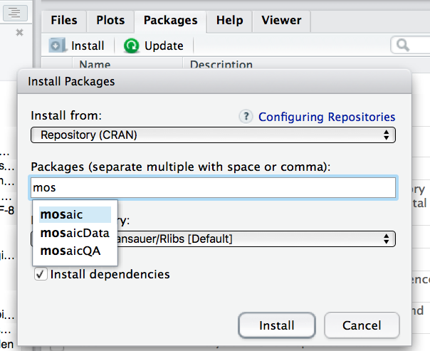
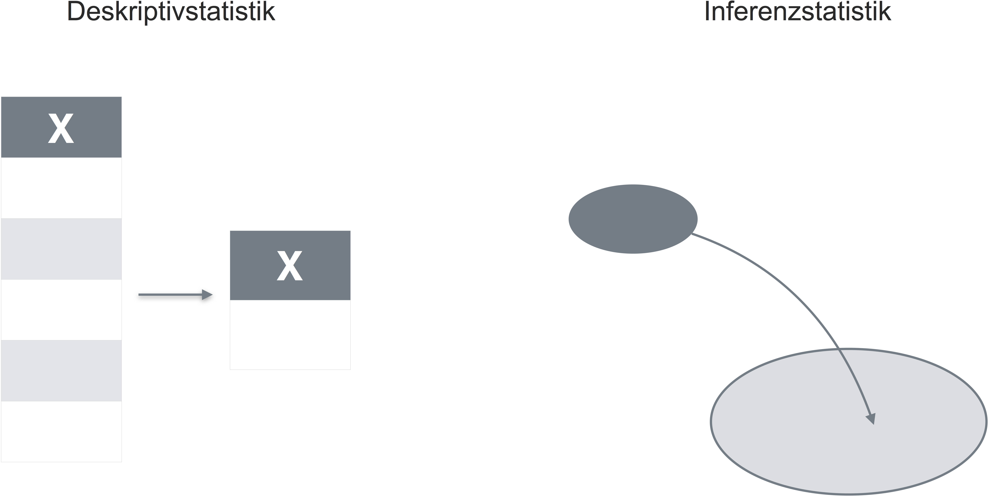
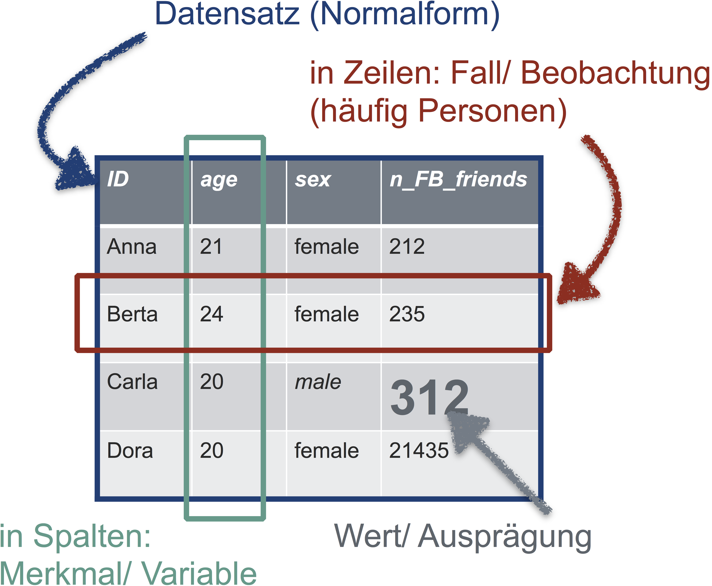
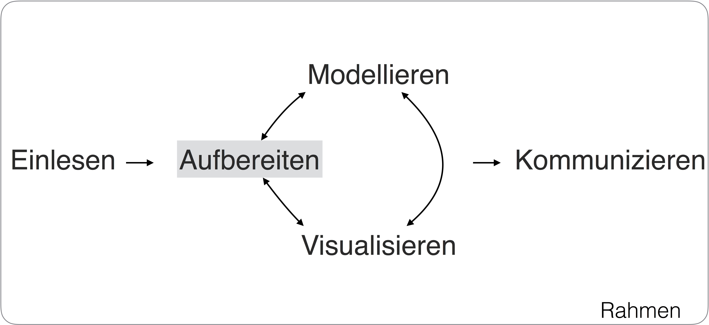
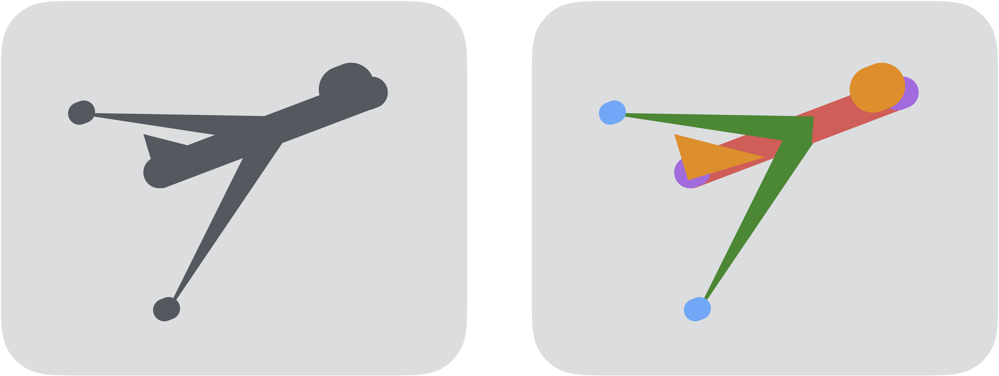
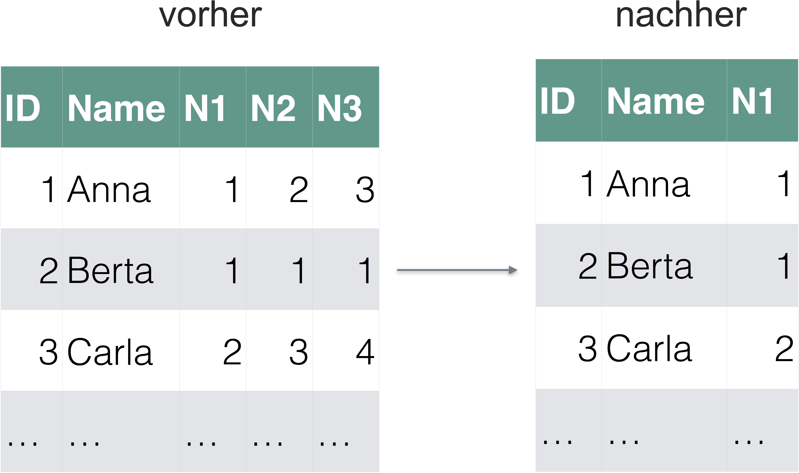
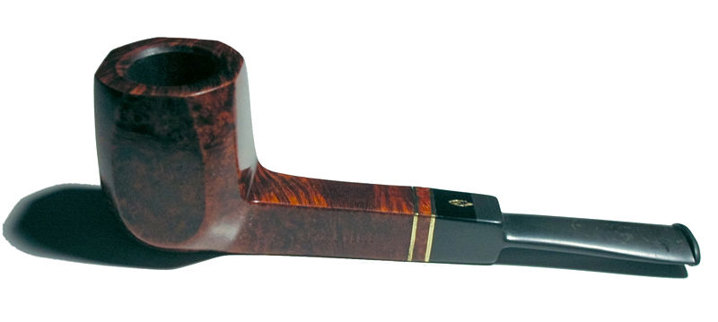
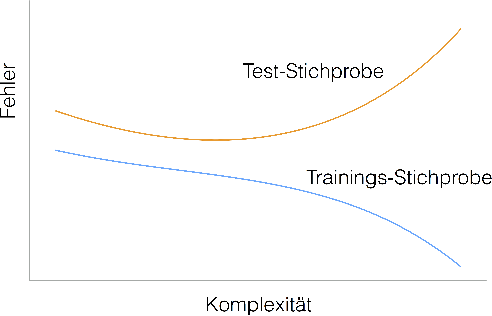

```{r setup, include=FALSE}
library(knitr)

knitr::opts_chunk$set(
    echo = TRUE,
    background='#E0E0E0',
    fig.keep="none",
    out.width="80%",
    cache = TRUE,
    tidy = FALSE,
    fig.align = "center",
    width.cutoff=70,
    fig.asp = .618,
    message = FALSE,
    warning = FALSE
)

options(width = 73)


```


```{r libs, include = FALSE, echo = FALSE}
#library(mosaic)
library(tidyverse)
library(formatR)
library(knitr)
library(gridExtra)
library(broom)
library(grid)
library(modelr)
library(viridis)
library(SDMTools)  # Güte von Klassifikationsmodellen
library(pROC)  # für ROC- und AUC-Berechnung
library(BaylorEdPsych)  # Pseudo-R-Quadrat
library(pander)
library(cluster)
library(psych)
library(stringr)  # Textverarbeitung
library(tidytext)  # Textmining
library(pdftools)  # PDF einlesen
library(downloader)  # Daten herunterladen
library(lsa)  # Stopwörter 
library(SnowballC)  # Wörter trunkieren
library(wordcloud)  # Wordcloud anzeigen
```


## Grobgliederung


- [Vorwort](#Vorwort)
- [Rahmen](#Rahmen)
- [Daten einlesen](#tidy)
- [Datenjudo](#Datenjudo)
- [Daten visualisieren](#vis)
- [Grundlagen des Modellierens](#mod)
- [Der p-Wert](#p-wert)
- [Lineare Regression](#Lineare-Regression)
- [Klassifizierende (logistische) Regression](#Klassifizierende-(logistische)- Regression)
- [Clusteranalyse](#Clusteranalyse)
- [Dimensionsreduktion](#Dimensionsreduktion)
- [Textmining](#Textmining)
- [Anhang](#Anhang)

# Vorwort 

## Hinweise

- Diese Folien vermitteln *nicht* den Stoff. Sie visualisieren nur einige zentrale Ideen.

- Der Stoff wird vom [Skript](https://sebastiansauer.github.io/Praxis_der_Datenanalyse/) vermittelt. Nutzen Sie das Skript zum eigentlichen Arbeiten.


# Organisatorisches

## Modulziele

Die Studierenden können nach erfolgreichem Abschluss des Moduls:


- den Ablauf eines Projekts aus der Datenanalyse in wesentlichen Schritten nachvollziehen,
-	Daten aufbereiten und ansprechend visualisieren,
-	Inferenzstatistik anwenden und kritisch hinterfragen,
- klassische Vorhersagemethoden (Regression) anwenden,
-	moderne Methoden der angewandten Datenanalyse anwenden (z.B. Textmining),
-	betriebswirtschaftliche Fragestellungen mittels datengetriebener Vorhersagemodellen beantworten.


## Themen pro Termin (insgesamt 44UE Lehre)


\footnotesize
```{r termin-themen, echo = FALSE}

df <- readr::read_csv("../includes/Termin_Themen.csv")

knitr::kable(df)

```


## Prüfung - Allgemeine Hinweise


- Die Prüfung besteht aus zwei Teilen
    - einer Klausur (50% der Teilnote)
    - einer Datenanalyse (50% der Teilnote).
   
   
   
*Prüfungsrelevant* ist der gesamte Stoff aus dem Skript und dem Unterricht mit [einigen Ausnahmen](https://sebastiansauer.github.io/Praxis_der_Datenanalyse/organisatorisches.html#prufung)


Alle Hinweise zur Prüfung gelten nur insoweit nicht anders vom Dozenten festgelegt. 


## Klausur und Datenanalyse


### Klausur
- Hinweise zur Klausur finden Sie [hier](https://sebastiansauer.github.io/Praxis_der_Datenanalyse/organisatorisches.html#klausur)
- Im Skript finden Sie eine [Probeklausur](https://sebastiansauer.github.io/Praxis_der_Datenanalyse/probeklausur.html).
- Lernaufgaben finden sich im Skript am Ende jedes Kapitels.


### Datenanalyse
- Hinweise zur Datenanalyse finden Sie [hier](https://sebastiansauer.github.io/Praxis_der_Datenanalyse/organisatorisches.html#klausur).
- Die Datenanalyse wird (in fast jeder Stunde) praktisch eingeübt.
- Beispiele für gute Datenanalysen von Studierenden finden Sie [hier](https://sebastiansauer.github.io/Praxis_der_Datenanalyse/organisatorisches.html#klausur) (im OC).


# Rahmen

## Lernziele

- Einen Überblick über die fünf wesentliche Schritte der Datenanalyse gewinnen.
- R und RStudio installieren können.
- Einige häufige technische Probleme zu lösen wissen.
- R-Pakete installieren können.
- Einige grundlegende R-Funktionalitäten verstehen.
- Auf die Frage "Was ist Statistik?" eine Antwort geben können.


## Prozess der Datenanalyse - Überblick über das Modul

```{r fig-prozess, echo = FALSE, fig.cap = "Der Prozess der Datenanalyse"}
knitr::include_graphics("../images/Rahmen/Prozess_Datenanalyse.png") 
```


## R und RStudio installieren

{ width=10% } { width=10% }


```{r echo = FALSE, fig.cap = "RStudio", out.width = "50%"} 
knitr::include_graphics("../images/Rahmen/RStudio-Screenshot.png")

```


## Sonstiges Material für dieses Skript

Bitte laden Sie sich diesen Ordner [Github-Repositorium](https://github.com/sebastiansauer/Praxis_der_Datenanalyse/tree/gh-pages) herunter. Dazu klicken Sie auf den grünen Button "Clone or Download", wählen Sie dann "Download Zip". Daraufhin wird dieser Ordner heruntergeladen. 


## Hilfe! R!

Beliebte Fehler beim Installieren von Paketen:

```
- install.packages(dplyr) 

- install.packages("dliar")

- install.packages("derpyler") 
- Keine Internet-Verbindung 

- install.packages("dplyr")  # dependencies vergessen 


- library(dplyr)  # ohne vorher zu installieren
```

## Pakete installieren leichtgemacht


```{r fig-install-packages, echo = FALSE, fig.cap = "So installiert man Pakete in RStudio", out.width = "50%"}



```


## Datensätze {#daten}


Alle Datensätze liegen im Ordner `data/`, den Sie vom [Github-Repositorium](https://github.com/sebastiansauer/Praxis_der_Datenanalyse) herunterladen können.


## Was ist Statistik?

*Eine* Antwort dazu ist, dass Statistik die Wissenschaft von
Sammlung, Analyse, Interpretation und Kommunikation von Daten ist mithilfe 
mathematischer Verfahren ist und zur Entscheidungshilfe beitragen soll. 

```{r desk-vs-inf, echo = FALSE, fig.cap  ="Sinnbild für die Deskriptiv- und die Inferenzstatistik"}


```


## Abduktion als klassische Denkfigur in der Statistik


```
Prämisse 1: Wenn Modell M wahr ist,   
dann sollten die Daten das Muster D aufweisen.
Prämisse 2: Die Daten weisen das Muster D auf.
---
Konklusion: Daher muss das Modell M wahr sein.
```


Die Konklusion ist *nicht* zwangsläufig richtig.


# Daten einlesen {#tidy}

## Lernziele

- Wissen, was eine CSV-Datei ist.
- Wissen, was UTF-8 bedeutet.
- Erläutern können, was R unter dem "working directory" versteht.
- Erkennen können, ob eine Tabelle in Normalform vorliegt.
- Daten aus R hinauskriegen (exportieren).


Dieses Kapitel beantwortet eine Frage: "Wie kriege ich Daten in vernünftiger Form in R hinein?".


## Prozess der Datenanalyse -- Einlesen


```{r step-Einlesen, echo = FALSE, fig.cap = "Daten sauber einlesen"}
knitr::include_graphics("../images/tidy/Einlesen.png")
```


## Daten (CSV, XLS,...) mit RStudio importieren


```{r data-import-RStudio, echo = FALSE, out.width = "50%", fig.cap = "Daten einlesen (importieren) mit RStudio"}
knitr::include_graphics("../images/tidy/import_RStudio.png")
```

## CSV-Dateien sind einer der wichtigsten Daten-Formate


```
row_number,date_time,study_time,self_eval,interest,score
1,05.01.2017 13:57:01,5,8,5,29
2,05.01.2017 21:07:56,3,7,3,29
3,05.01.2017 23:33:47,5,10,6,40
4,06.01.2017 09:58:05,2,3,2,18
5,06.01.2017 14:13:08,4,8,6,34
6,06.01.2017 14:21:18,NA,NA,NA,39
```

## Das Arbeitsverzeichnis mit RStudio wählen


```{r Arbeitsverzeichnis, echo = FALSE, fig.cap = "Das Arbeitsverzeichnis mit RStudio auswählen", out.width = "50%"}

knitr::include_graphics("../images/tidy/Arbeitsverzeichnis.png")
```


## Normalform einer Tabelle

```{r tidy1, fig.cap = "Schematische Darstellung eines Dataframes in Normalform", echo = FALSE}
knitr::include_graphics("../images/tidy/tidy-1.png")
```


## Breit vs. Lang

```{r lang-breit, echo = FALSE, fig.cap = "Dieselben Daten - einmal breit, einmal lang"}
knitr::include_graphics("../images/tidy/breit_lang.png")
```


## Ein Dataframe in Normalform - Beispiel

```{r fig-Normalform, echo = FALSE, fig.cap = "Illustration eines Datensatzes in Normalform", out.width = "40%"}

```


## Tabelle in Normalform bringen {#normalform}


```{r gather-spread, echo = FALSE, fig.cap = "Mit 'gather' und 'spread' wechselt man von der breiten Form zur langen Form"}

knitr::include_graphics("../images/tidy/gather_spread-crop.png")

```


## Beispiel für die Normalisierung einer Tabelle

```{r bsp-abb, echo = FALSE, fig.cap = "Ein Beispiel für eine Abbildung zu einer Normalform-Tabelle", out.width = "50%"}

knitr::include_graphics("../images/tidy/bsp_diagramm-crop.png")
```


## `gather` und `spread`

```{r eval = FALSE}


df_lang <- gather(df_breit, key = "Quartal",
                  value = "Umsatz")

df_breit <- spread(df_lang, Quartal, Umsatz)

df_lang <- gather(df_breit, key = "Quartal",
                  value = "Umsatz", -ID)
```


## Textkodierung und Daten exportieren

>    Speichern Sie R-Textdateien wie Skripte stets mit UTF-8-Kodierung ab.


```{r eval = FALSE}
write.csv(name_der_tabelle, "Dateiname.csv")
```


# Datenjudo

## Lernziele für das Kapitel 'Datenjudo'

- Die zentralen Ideen der Datenanalye mit dplyr verstehen.
- Typische Probleme der Datenanalyse schildern können.
- Zentrale `dplyr`-Befehle anwenden können.
- `dplyr`-Befehle kombinieren können.
- Die Pfeife anwenden können.
- Werte umkodieren und "binnen" können.


## Prozess der Datenanalyse -- Datenjudo


```{r fig-datenjudo, echo = FALSE, fig.cap = "Daten aufbereiten"}

```


## Typische Probleme bei der Datenaufbereitung


Typische Probleme, die immer wieder auftreten, sind:

- *Fehlende Werte*
- *Unerwartete Daten*
- *Daten müssen umgeformt werden*
- *Neue Variablen (Spalten) berechnen*: 
- ...


## Daten aufbereiten mit `dplyr`


\begin{columns}
  \begin{column}{0.49\textwidth}
    
```{r bausteine, echo = FALSE, fig.cap = "Lego-Prinzip: Zerlege eine komplexe Struktur in einfache Bausteine", out.width = "100%"}

```

 \end{column}
  \begin{column}{0.49\textwidth}


```{r durchpfeifen-allgemein, echo = FALSE, fig.cap = "Durchpfeifen: Ein Dataframe wird von Operation zu Operation weitergereicht", out.width = "100%"}
knitr::include_graphics("../images/Datenjudo/durchpfeifen_allgemein_crop.png")
```


  \end{column}
\end{columns}

## Zeilen filtern mit `filter`


```{r fig-filter, echo = FALSE, fig.cap = "Zeilen filtern"}
knitr::include_graphics("../images/Datenjudo/filter.png")
```


## Spalten wählen mit `select`


```{r fig-select, echo = FALSE, fig.cap = "Spalten auswählen"}

```


## Zeilen sortieren mit `arrange`


```{r fig-arrange, echo = FALSE, fig.cap = "Spalten sortieren"}
knitr::include_graphics("../images/Datenjudo/arrange-crop.png")
```


## Datensatz gruppieren mit `group_by`


```{r fig-groupby, echo = FALSE, fig.cap = "Datensätze nach Subgruppen aufteilen"}
knitr::include_graphics("../images/Datenjudo/group_by.png")
```


## Eine Spalte zusammenfassen mit `summarise`


```{r fig-summarise, echo = FALSE, fig.cap = "Spalten zu einer Zahl zusammenfassen"}
knitr::include_graphics("../images/Datenjudo/summarise.png")
```


## Zeilen zählen mit `n` und `count`


```{r fig-count, echo = FALSE, fig.cap = "Sinnbild für 'count'"}

knitr::include_graphics("../images/Datenjudo/count-crop.png")
```


## Die Pfeife

```{r cecie-une-pipe, echo = FALSE, fig.cap = "Das ist keine Pfeife"}

```


## Befehle hintereinander reihen mit der Pfeife


```{r fig-durchpfeifen, echo = FALSE, out.width  = "80%", fig.cap = "Das 'Durchpeifen'"}
knitr::include_graphics("../images/Datenjudo/durchpfeifen.png")
```

## Introducing Pipe-Syntax

Vergleichen Sie mal diese Syntax

```{r eval = FALSE}
filter(summarise(group_by(filter(stats_test, 
       !is.na(score)), interest), mw = mean(score)), 
       mw > 30)
```

mit dieser

```{r eval = FALSE}
stats_test %>% 
  filter(!is.na(score)) %>% 
  group_by(interest) %>% 
  summarise(mw = mean(score)) %>% 
  filter(mw > 30)
```


## Pfeifen macht das Leben leichter

Tipp: In RStudio gibt es einen Shortcut für die Pfeife: Strg-Shift-M (auf allen Betriebssystemen).


Die Syntax von oben auf Deutsch:

- Nimm die Tabelle "stats_test" UND DANN  
- filtere alle nicht-fehlenden Werte UND DANN  
- gruppiere die verbleibenden Werte nach "interest" UND DANN  
- bilde den Mittelwert (pro Gruppe) für "score" UND DANN  
- liefere nur die Werte größer als 30 zurück.  


## Spalten berechnen mit `mutate`


```{r fig-mutate, echo = FALSE, fig.cap = "Sinnbild für mutate"}
knitr::include_graphics("../images/Datenjudo/mutate.png")
```


## Beispiel für `mutate`


```{r eval = FALSE}
stats_test %>% 
  mutate(Streber = score > 38) %>% 
  head()
```


## Deskriptive Statistik mit `dplyr`


```{r eval = FALSE}
stats_test2 <- select(stats_test, -date_time) 
desctable(stats_test2l)
```


# Daten visualisieren {#vis}


## Lernziele für das Kapitel 'Daten visualisieren'

- An einem Beispiel erläutern können, warum/ wann ein Bild mehr sagt, als 1000 Worte.
- Häufige Arten von Diagrammen erstellen können.
- Diagramme bestimmten Zwecken zuordnen können.


## Statistik ist wie ein Bikini...


```{r fig-anscombe, echo = FALSE, fig.cap = "Das Anscombe-Quartett", out.width = "50%"}
knitr::include_graphics("../images/visualisieren/anscombe.png")
```


[Dinosaurier-Video](https://youtu.be/DbJyPELmhJc)


## Die Anatomie eines Diagramms


```{r fig-anatomie, echo = FALSE, fig.cap = "Anatomie eines Diagramms", out.width = "50%"}
knitr::include_graphics("../images/visualisieren/anatomie_diagramm_crop.jpg")
```


## Beispiel für ein Diagramm it mit `ggplot2::qplot`

```{r echo = FALSE}
movies <- read.csv("../data/movies.csv")
```


```{r fig-movies, message = FALSE, fig.cap = "Mittleres Budget pro Jahr", out.width = "50%"}
qplot(x = year, y = budget, geom = "point", data = movies)
```

## Anatomiestunde mit `qplot`


- `qplot`: Erstelle schnell (q wie quick in `qplot`) mal einen Plot (engl. "plot": Diagramm).    
- `x`: Der X-Achse soll die Variable "year" zugeordnet werden.    
- `y`: Der Y-Achse soll die Variable "budget" zugeorndet werden.  
- `geom`: ("geometriches Objekt") Gemalt werden sollen Punkte und zwar pro Beobachtung (hier: Film) ein Punkt; nicht etwa Linien oder Boxplots.
- `data`: Als Datensatz bitte `movies` verwenden.  


## Syntax-Blaupause für `qplot`

Diese Syntax des letzten Beispiels ist recht einfach, nämlich:

```{r, eval = FALSE}
qplot (x = X_Achse, 
       y = Y_Achse, 
       data = mein_dataframe, 
       geom = "ein_geom")
```


## Häufige Diagrammtypen

[s. Skript](https://sebastiansauer.github.io/Praxis_der_Datenanalyse/daten-visualisieren.html#haufige-arten-von-diagrammen)

- Histogramm, Dichtediagramm
- Punkte, Schachbrett-Diagramme
- Balkendiagramm
- Mosaicplot (Fliesendiagramm)
- Punktediagramm für Zusammenfassungen
- Boxplots 


# Grundlagen des Modellierens {#mod}


## Prozess der Datenanalyse - Modellieren


```{r echo = FALSE, out.width = "70%"}
knitr::include_graphics("../images/modellieren/Modellieren.png")
```


## Was ist ein Modell

```{r vwmodell, echo = FALSE, fig.cap = "Modell eines VW-Käfers"}
knitr::include_graphics("../images/modellieren/vw_modell.JPG")
```


## Die Beziehung von Gegenstandsbereich und Modell

```{r modellieren-plot, echo = FALSE, fig.cap = "Modellieren"}
knitr::include_graphics("../images/modellieren/Modell.png")
```


## Modelle spiegeln empirische Relationen in numerischen Relationen

>   Modellieren bedeutet ein Verfahren zu erstellen, welches empirische Sachverhalte adäquat in numerische Sachverhalte umsetzt.

```{r modellieren-formal, echo = FALSE, fig.cap = "Formaleres Modell des Modellierens"}
knitr::include_graphics("../images/modellieren/Modellieren_formal_crop.png")
```


## Ein Beispiel zum Modellieren aus der Datenanalyse

```{r plot-stats-smooth, echo = FALSE}
stats_test <- readr::read_csv("../data/test_inf_short.csv")

stats_test %>% 
ggplot(aes(y = score, x = self_eval)) +
geom_jitter() -> p1

p2 <- p1 + geom_smooth(method = "lm", se = FALSE)

# p3 <- grid::rasterGrob(readPNG("../images/Modellieren_Bsp1.png"), interpolate=TRUE)
grid.arrange(p1, p2, nrow = 1)
```

Die blaue Gerade ist ein Modell für den Datensatz (sie versucht es zumindest).


## Modelle umfassen drei Aspekte

```{r fig-blackbox, echo = FALSE, fig.cap = "Modelle mit schwarzer Kiste"}
knitr::include_graphics("../images/modellieren/Modell_Blackbox.png")
```


## Taxonomie der Ziele des Modellierens 

- Geleitetes Modellieren
    - Prädiktives Modellieren
    - Explikaties Modellieren
- Ungeleitetes Modellieren
    - Dimensionsreduzierendes Modellieren
    - Fallreduzierendes Modellieren


## Veranschaulichung der beiden Arten des Modellierens

```{r ungeleitetes-modellieren, echo = FALSE, fig.cap = "Die zwei Arten des ungeleiteten Modellierens"}

knitr::include_graphics("../images/modellieren/ungeleitetes_Modellieren_crop.png")

```


## Die vier Schritte des statistischen Modellierens


1. Man wählt eines der vier Ziele des Modellierens (z.B. ein prädiktives Modell).
1. Man wählt ein Modell aus (genauer: eine Modellfamilie), z.B. postuliert man, dass die Körpergröße einen linearen Einfluss auf die Schuhgröße habe.
3. Man bestimmt (berechnet) die Details des Modells anhand der Daten: Wie groß ist die Steigung der Geraden und wo ist der Achsenabschnitt? Man sagt auch, dass man die *Modellparameter* anhand der Daten schätzt ("Modellinstantiierung" oder "Modellanpassung", engl. "model fitting").
4. Dann prüft man, wie gut das Modell zu den Daten passt (Modellgüte, engl. "model fit"); wie gut lässt sich die Schuhgröße anhand der Körpergröße vorhersagen bzw. wie groß ist der Vorhersagefehler?


## Einfache vs. komplexe Modelle: Unter- vs. Überanpassung


```{r overfitting-prep-4-plots, echo = FALSE, include = FALSE, fig.height = 3, fig.width = 3}
x <- seq(from = 1, to = 10, by = .3)
y <- sin(x) + rnorm(n = length(x), mean = 0, sd = .3)

daten <- data_frame(x, y)

ggplot(daten) +
  aes(x = x, y = y) + 
  coord_fixed(ratio = 5/1) +
  labs(y = "") +
  geom_point() +
  ggtitle("A") -> p1

ggplot(daten) +
  aes(x = x, y = y) +
  geom_point() + 
  coord_fixed(ratio = 5/1) +
  labs(y = "") +
  geom_smooth(method = "lm", se = FALSE, color = "red") +
  ggtitle("B")-> p2


ggplot(daten) +
  aes(x = x, y = y) +
  geom_point() + 
  coord_fixed(ratio = 5/1) +
  labs(y = "") +
  geom_line(color = "blue") +
  ggtitle("C") -> p3

ggplot(daten) +
  aes(x = x, y = y) +
  geom_point() + 
  coord_fixed(ratio = 5/1) +
  labs(y = "") +
  stat_function(n = 99, fun = sin, color = "darkgreen") +
  ggtitle("D") -> p4
```


```{r overfitting-4-plots, echo = FALSE, fig.cap = "Welches Modell (Teil B-D; rot, grün, blau) passt am besten zu den Daten (Teil A) ?", out.width = "90%"}

grid.arrange(p1, p2, p3, p4, ncol = 4)

```


## Vorhersagegüte der Trainings-Stichprobe vs. der Test-Stichprobe

Beschreibt ein Modell (wie das blaue Modell hier) eine Stichprobe sehr gut, heißt das noch *nicht*, dass es auch zukünftige (und vergleichbare) Stichproben gut beschreiben wird.  Die Güte (Vorhersagegenauigkeit) eines Modells sollte sich daher stets auf eine neue Stichprobe beziehen (Test-Stichprobe), die nicht in der Stichprobe beim Anpassen des Modells (Trainings-Stichprobe) enthalten war. 


## Overfitting

```{r overfitting-schema, echo = FALSE, fig.cap = "'Mittlere' Komplexität hat die beste Vorhersagegenauigkeit (am wenigsten Fehler) in der Test-Stichprobe", out.width = "50%"}

```


## Bias-Varianz-Abwägung

>    Einfache Modelle: Viel Bias, wenig Varianz.
     Komplexe Modelle: Wenig Bias, viel Varianz.
     
     

```{r plot-bias-variance, echo = FALSE, fig.cap = "Der Spagat zwischen Verzerrung und Varianz", out.width = "50%"}
poly_degree = 15
df <- data_frame(x = seq(from = 1, to = 10, by = .3),
                 y = sin(x) + rnorm(n = length(x), mean = 0, sd = .3))

df %>% 
  mutate(binned = cut(.$x, breaks = c(-Inf, 5.5, +Inf))) %>% 
  group_by(binned) %>% 
  mutate(y_group_md = median(y)) -> df


p1 <- ggplot(df) +
  aes(x = x, y = y) +
  geom_point() +
  geom_smooth(method = "lm", formula = y ~ poly(x, poly_degree), se = FALSE) +
  coord_fixed(ratio = 5/1)


p2 <-  ggplot(df) +
  aes(x = x) +
  geom_point(aes(y = y)) +
  geom_line(aes(y = y_group_md, group = binned), color = "firebrick") + 
  coord_fixed(ratio = 5/1) 


grid.arrange(p1, p2, ncol = 2)
```


# Der p-Wert {#p-wert}


## Lernziele


- Den p-Wert erläutern können.
- Den p-Wert kritisieren können.
- Alternativen zum p-Wert kennen.
- Inferenzstatistische Verfahren für häufige Fragestellungen kennen.


## Sir Ronald Fisher, Erfinder des Nullhypothesen Testens 


```{r sir-fisher, echo = FALSE, fig.cap = "Der größte Statistiker des 20. Jahrhunderts (p < .05)", out.width = "20%", fig.align = "center"}
knitr::include_graphics("../images/inferenz/Ronald_Fisher.jpg")
```

## Der p-Wert ist die heilige Kuh der Forscher

```{r who-said, echo = FALSE, out.width = "35%", fig.cap  = "Der p-Wert wird oft als wichtig erachtet", fig.align = "center"}
knitr::include_graphics("../images/inferenz/p_value_who_said.png")
```

>   Der p-Wert sagt, wie gut die Daten zur Nullhypothese passen.


## Von Männern und Päpsten

$$ P(M|P) \ne P(P|M) $$

```{r moslems-terroristen, echo = FALSE, fig.cap = "Mann und Papst zu sein, ist nicht das gleiche."}
knitr::include_graphics("../images/inferenz/maenner_papst-crop.png")
```

## Der p-Wert ist eine Funktion der Stichprobengröße

```{r einfluss-pwert, echo = FALSE, fig.cap = "Zwei Haupteinflüsse auf den p-Wert"}

knitr::include_graphics("../images/inferenz/einfluss_pwert-crop.png")
```


## Zur Philosophie des p-Werts: Frequentismus


```{r echo = FALSE}
df <- data_frame(
  i = 1:500,
  flip = sample(x = c(0,1), size = 500, replace = TRUE),
  prop = cumsum(flip) / i
)
```


```{r muenzwurf, echo = FALSE, fig.cap = "Anteil von 'Kopf' bei wiederholtem Münzwurf"}

ggplot(df) +
  aes(x = i, y = prop) +
  geom_line() +
  geom_point(color = "grey40") +
  ylim(c(0,1)) +
  labs(x = "Anzahl der Würfe",
       y = "Anteil von 'Kopf'")

```


## Alternativen zum p-Wert - Konfidenzintervalle

>   Das 95%-Konfidenzintervall ist der Bereich, in dem der Parameter in 95% der Fälle fallen würde bei sehr häufiger Wiederholung des Versuchs. 


[Visualisierung zum Konfidenzintervall](http://rpsychologist.com/d3/CI/)


## Alternativen zum p-Wert - Effektstärken

s. [Tabelle im Skript](https://sebastiansauer.github.io/Praxis_der_Datenanalyse/der-p-wert-inferenzstatistik-und-alternativen.html#effektstarke)


## Alternativen zum p-Wert - Bayes-Statistik

Bayes liefert $p(D|H)$. 

```{r bayes, echo = FALSE, fig.cap = "Die zwei Stufen der Bayes-Statistik in einem einfachen Beispieli"}

knitr::include_graphics("../images/inferenz/bayes-crop.png")

```


# Lineare Regression


## Lernziele


- Wissen, was man unter Regression versteht.
- Die Annahmen der Regression überprüfen können.
- Regression mit kategorialen Prädiktoren durchführen können.
- Die Modellgüte bei der Regression bestimmen können.
- Interaktionen erkennen und ihre Stärke einschätzen können.


## Beispiel für eine lineare Regression

```
score = achsenabschnitt + steigung*study_time
```

```{r bsp-regression, fig.cap = "Beispiel für eine Regression", echo = FALSE, out.width = "50%"}
stats_test <- readr::read_csv("../data/test_inf_short.csv")

stats_test %>% 
  ggplot +
  aes(x = study_time, y = score) +
  geom_jitter() +
  geom_abline(intercept = 24, 
              slope = 2.3, 
              color = "red")

```


## Die Formel einer einfachen Regression


```
score = achsenabschnitt + steigung*study_time
```


## Vorhersagegüte - Veranschaulichung

```{r resids-plot, echo = FALSE, results = "hold", fig.cap = "Geringer (links) vs. hoher (rechts) Vorhersagefehler"}

set.seed(42)  
N      <- 100
beta   <- 0.4
intercept <- 1


sim <- data_frame(
  x = rnorm(N),
  error1 = rnorm(N, mean = 0, sd = .5),
  error2 = rnorm(N, mean = 0, sd = 2),
  y1 = intercept + x*beta + error1,
  y2 = intercept + x*beta + error2,
  pred = 1 + x*beta
)


p1 <- ggplot(sim, aes(x, y1)) + 
  geom_abline(intercept = intercept, slope = beta, colour = "red") +
  geom_point(colour = "#00998a") +
  geom_linerange(aes(ymin = y1, ymax = pred), colour = "grey40") +
  ylim(-6,+6)


p2 <- ggplot(sim, aes(x, y2)) + 
  geom_abline(intercept = intercept, slope = beta, colour = "red") +
  geom_point(colour = "#00998a") +
  geom_linerange(aes(ymin = y2, ymax = pred), colour = "grey40") +
  ylim(-6,+6)


grid.arrange(p1, p2, ncol = 2)

```


## Vorhersagegüte - MSE und $R^2$

$$ MSE = \frac{1}{n} \sum{(pred - obs)^2} $$

$$ R^2 = 1 - \left( \frac{SS_T - SS_M}{SS_T} \right)$$


## Überprüfung der Annahmen der linearen Regression

- Linearität des Zusammenhangs
- Normalverteilung der Residuen
- Konstante Varianz
- Extreme Ausreißer
- Unabhängigkeit der Beobachtungen


## Unterscheiden sich Interessierten von Nicht-I. im Klausurerfolg?

```{r echo = FALSE}
stats_test$interessiert <- stats_test$interest > 3
stats_test %>% 
  group_by(interessiert) %>% 
  summarise(score = mean(score)) -> score_interesse

score_interesse %>% knitr::kable()
```


## Kategoriale Prädiktoren


```{r}
stats_test %>% 
  na.omit %>% 
  ggplot() +
  aes(x = interessiert, y = score) +
  geom_jitter(width = .1) +
  geom_point(data = score_interesse, color = "red", size = 5) +
  geom_line(data = score_interesse, group = 1, color = "red")
```


## Multiple Regression


```{r no-interakt, echo = FALSE, fig.cap = "Eine multivariate Analyse fördert Einsichten zu Tage, die bei einfacheren Analysen verborgen bleiben"}

library(viridis)

df1 <- data_frame(
  interessiert = c(T, F),
  slope = c(2.3, 2.3),
  intercept = c(23.7, 24)
)


p1 <- stats_test %>% 
  na.omit %>% 
  ggplot +
  aes(x=study_time, y = score) +
  geom_jitter(width = .1) +
  #facet_wrap(~interessiert) +
  geom_abline(data = df1, mapping = aes(slope = slope, intercept = intercept, color = interessiert)) +
  guides(color = FALSE) +
  scale_color_viridis(discrete = TRUE) +
  labs(title = "A") +
  coord_cartesian(ylim = c(25,35))


df2 <- data_frame(
  slope = rep(-.33, 5),
  intercept = rep(c(24), 5),
  study_time = 1:5)


p2 <- stats_test %>% 
  na.omit %>% 
  ggplot +
  aes(x=interessiert, y = score) +
  geom_jitter(width = .1) +
  facet_wrap(~study_time) +
  geom_abline(data = df2, mapping = aes(slope = slope, intercept = intercept, color = study_time)) +
  scale_color_viridis() +
  guides(color = FALSE) +
  labs(title = "B")


gridExtra::grid.arrange(p1, p2, nrow = 2)
```


## Multivariate Analysen sind cool

>    Die multivariate Analyse zeigt ein anderes Bild, ein genaueres Bild als die einfachere Analyse. Ein Sachverhalt, der für den ganzen Datensatz gilt, kann in Subgruppen anders sein.

Erlaubt man der Regression, dass die Regressionsgeraden nicht parallel sein müssen, spricht man von einer *Interaktion*.


## Ein Beispiel für einen Interaktionseffekt

Die Linien sind *nicht* (ganz) parallel: ein kleiner Interaktionseffekt.

```{r interakt-stats-test, echo = FALSE, fig.cap = "Eine Regressionsanalyse mit Interaktionseffekten"}

lm4 <- lm(score ~ interessiert*study_time, data = stats_test)


df1 <- data_frame(
  interessiert = c(F, T),
  slope = c(2.44, 2.44-.32),
  intercept = c(23.6, 23.6+.66)
)


p1 <- stats_test %>% 
  na.omit %>% 
  ggplot +
  aes(x=study_time, y = score) +
  geom_jitter(width = .1) +
  #facet_wrap(~interessiert) +
  geom_abline(data = df1, mapping = aes(slope = slope, intercept = intercept, color = interessiert)) +
  guides(color = FALSE) +
  scale_color_viridis(discrete = TRUE) +
  labs(title = "A") +
  coord_cartesian(ylim = c(25,35))


df2 <- stats_test %>% 
  data_grid(
    study_time = 1:5,
    interessiert = c(F, T)
  ) %>% 
  add_predictions(lm4)
  


p2 <- stats_test %>% 
  na.omit %>% 
  ggplot +
  aes(x=interessiert, group = study_time) +
  geom_jitter(aes(y = score), width = .1) +
  geom_line(data = df2, aes(y = pred, color = factor(study_time))) +
  scale_color_viridis(discrete = TRUE) +
  theme(legend.position = "bottom")
  


grid.arrange(p1, p2, nrow = 2)
```


## Fallstudie zu Overfitting {#overfitting-casestudy}


```{r echo = FALSE, message = FALSE}
lm1 <- lm(score ~ study_time, data = stats_test)
train <- stats_test %>% 
  sample_frac(.8, replace = FALSE)  # Stichprobe von 80%, ohne Zurücklegen

test <- stats_test %>% 
  anti_join(train)  # Alle Zeilen von "df", die nicht in "train" vorkommen

lm_train <- lm(score ~ study_time, data = train)
lm2_predict <- predict(lm_train, newdata = test)


```


```{r}
caret::postResample(pred = lm2_predict, obs = test$score)

```

Die Modellgüte im in der Test-Stichprobe ist meist schlechter als in der Trainings-Stichprobe. Das warnt uns vor Befunden, die naiv nur die Werte aus der Trainings-Stichprobe berichten.


# Klassifizierende (logistische) Regression

## Lernziele

- Die Idee der logistischen Regression verstehen.
- Die Koeffizienten der logistischen Regression interpretieren können.
- Die Modellgüte einer logistischten Regression einschätzen können.
- Klassifikatorische Kennzahlen kennen und beurteilen können.


## Problemstellung

```{r echo = FALSE}
Aktien <- readr::read_csv("../data/Aktien.csv") %>% na.omit

```


```{r fig-logist-regr1, fig.cap = "Streudiagramm von Risikobereitschaft und Aktienkauf", echo = FALSE, out.width = "50%"}
p1 <- ggplot(aes(y = Aktienkauf, x = Risikobereitschaft), data = Aktien) + geom_point()
p1
```


## R-Befehl zur logistischen Regression


Die Funktion `glm` führt die logistische Regression durch. 
```{r}

glm1 <- glm(Aktienkauf ~ Risikobereitschaft, 
            family = binomial("logit"),
            data = Aktien)
```


## Visualisierung der logistischen Regression

```{r fig-logist-regr2, echo = FALSE, fig.cap = "Regressionsgerade für Aktien-Modell", out.width = "50%"}

p1 + geom_abline(intercept = .18, 
                 slope = .05, color = "red")


```


## Formel der logistischen Regression


```{r logist-curve, echo = FALSE, fig.cap = "Die logistische Regression beschreibt eine 's-förmige' Kurve"}
# eta-Werte von -10 bis +10 erzeugen
x <- seq(-10,10,by = 0.1)
# y-Werte mit logistischer Funktion berechnen
y <- 1/(1+exp(-x))        # exp() ist die e-Funktion


library(latex2exp)


data_frame(
  x = x,
  y = y) %>% 
ggplot() +
  aes(x = x, y = y) + 
  geom_line(color = "#00998a") +
  ggtitle(TeX("Die e-Funktion: $p(y=1)=\\frac{e^x}{1+e^x}$"))
```

## Die logistische Regression für die Aktien-Daten

```{r aktien-plot, echo = FALSE, fig.cap = "Modelldiagramm für den Aktien-Datensatz"}

Aktien %>% 
  mutate(pred = stats::predict(glm1, 
                              data = data.frame(Aktienkauf = Aktien$Aktienkauf), 
                               type = "response")) %>% 
  ggplot() +
  aes(x = Risikobereitschaft) +
  geom_point(aes(y = Aktienkauf)) +
  geom_line(aes(y = pred), color = "red")

```


## Interpretation der Koeffizienten


Ist ein Logit $\mathfrak{L}$ größer als $0$, so ist die zugehörige Wahrscheinlichkeit größer als 50% (und umgekehrt.)

*Logits*\index{Logit} $\mathfrak{L} = ln\left( \frac{p}{1-p} \right)$

`y = intercept + 3*Risikobereitschaft`, also

```{r}
(y <- -1.469 + 3 * 0.257)
```

Also y = `r y` *Logits* ($\mathfrak{L}$).


## Vorhersage individueller Wahrscheinlichkeiten  

```{r}
predict(glm1, data.frame(Risikobereitschaft = 1), 
        type = "response")
```


## Kategoriale Prädiktoren


```{r eval = FALSE}
str(stats_test$bestanden)
stats_test$bestanden <- factor(stats_test$bestanden, 
                               levels = c("nein", "ja"))
log_stats <- glm(bestanden ~ interessiert,
                 family = binomial("logit"),
                 data = stats_test)
summary(log_stats)
```


## Vier Arten von Ergebnisse von Klassfikationen

```{r class-stats1, echo = FALSE}
df <- readr::read_csv("../includes/class_results.csv")

pander(data.frame(df), caption = "Vier Arten von Ergebnisse von Klassfikationen")
```


## Konfusionsmatrix

```{r echo = FALSE}
(cm <- SDMTools::confusion.matrix(Aktien$Aktienkauf, 
                                  glm1$fitted.values)) 
sensitivity(cm); specificity(cm)
```


## Vier Arten von Ergebnissen einer Klassifikation


```{r class-stats, echo = FALSE}

df <- readr::read_csv("../includes/diag_stats.csv")

knitr::kable(df[-3], caption = "Geläufige Kennwerte der Klassifikation")
```


## ROC-Kurven

```{r}
lets_roc <- roc(Aktien$Aktienkauf, glm1$fitted.values)
plot(lets_roc)

```


## Beispiele für ROC-Kurven


```{r example-rocs, echo = FALSE, fig.cap = "Beispiel für eine sehr gute (A), gute (B) und schlechte (C) Klassifikation"}

library(plotROC)
library(gridExtra)
D.ex <- rbinom(200, size = 1, prob = .5)
M1 <- rnorm(200, mean = D.ex, sd = .3)
M2 <- rnorm(200, mean = D.ex, sd = 1.5)
M3 <- rnorm(200, mean = D.ex, sd = 10)


test <- data.frame(D = D.ex, D.str = c("Healthy", "Ill")[D.ex + 1], 
                   M1 = M1, M2 = M2, stringsAsFactors = FALSE)


p1 <- ggplot(test, aes(d = D, m = M1)) + geom_roc(labels = FALSE) + style_roc() + ggtitle("A")
p2 <- ggplot(test, aes(d = D, m = M2)) + geom_roc(labels = FALSE) + style_roc() + ggtitle("B")
p3 <- ggplot(test, aes(d = D, m = M3)) + geom_roc(labels = FALSE) + style_roc() + ggtitle("C")

grid.arrange(p1, p2, p3, nrow = 1)

```


# Clusteranalyse


## Lernziele

- Das Ziel einer Clusteranalyse erläutern können.
- Das Konzept der euklidischen Abstände verstehen.
- Eine k-Means-Clusteranalyse berechnen und interpretieren können.


## Clustern Sie diesen Datensatz!

```{r cluster-intuition, echo = FALSE}


set.seed(2014)
centers <- data.frame(cluster=factor(1:3), size=c(100, 150, 50), x1=c(5, 0, -3), x2=c(-1, 1, -2))
points <- centers %>% group_by(cluster) %>%
    do(data.frame(x1=rnorm(.$size[1], .$x1[1]),
                  x2=rnorm(.$size[1], .$x2[1])))

library(ggplot2)
p1 <- ggplot(points, aes(x1, x2)) + geom_point() +
  xlab("Lernzeit") + ylab("Klasurpunkte")

p2 <- ggplot(points, aes(x1, x2, color=cluster)) + geom_point() +
  xlab("Lernzeit") + ylab("Klasurpunkte")
```


```{r cluster1, echo = FALSE, fig.cap = "Ein Streudiagramm - sehen Sie Gruppen (Cluster) ?"}
p1
```

## Intuitive Darstellung der Clusteranalayse


```{r cluster2, echo = FALSE, fig.cap = "Ein Streudiagramm - mit drei Clustern"}
p2
```


## Unterschiedliche Anzahlen von Clustern im Vergleich


```{r cluster3, echo = FALSE, fig.cap = "Unterschiedliche Anzahlen von Clustern im Vergleich"}


points.matrix <- cbind(x1 = points$x1, x2 = points$x2)
kclust <- kmeans(points.matrix, 3)
kclusts <- data.frame(k=1:9) %>% group_by(k) %>% do(kclust=kmeans(points.matrix, .$k))

clusters <- kclusts %>% group_by(k) %>% do(tidy(.$kclust[[1]]))
assignments <- kclusts %>% group_by(k) %>% do(augment(.$kclust[[1]], points.matrix))
clusterings <- kclusts %>% group_by(k) %>% do(glance(.$kclust[[1]]))

p3 <- ggplot(assignments, aes(x1, x2)) + geom_point(aes(color=.cluster)) + facet_wrap(~ k)


p4 <- p3 + geom_point(data=clusters, size=10, shape="x")
p4
```


## Wie groß ist der "Abstand" zwischen Anna und Berta?

```{r distanz, echo = FALSE, fig.cap = "Distanz zwischen zwei Punkten in der Ebene", out.width = "50%"}

knitr::include_graphics("../images/cluster/distanz_crop.png")
```


## Pythagoras strikes back


$$c^2 = a^2 + b^2$$

In unserem Beispiel heißt das $c^2 = 3^2+4^2 = 25$. Folglich ist $\sqrt{c^2}=\sqrt{25}=5$. Der Abstand oder der Unterschied zwischen Anna und Berta beträgt also 5 - diese Art von "Abstand" nennt man den *euklidischen Abstand*.


## Pythagoras in 3D


```{r pythagoras2, echo = FALSE, fig.cap = "Pythagoras in 3D", out.width = "50%"}

knitr::include_graphics("../images/cluster/pythagoras2_crop.png")
```


## Pythagoras in Reihe geschaltet


```{r pythagoras, echo = FALSE, fig.cap = "Pythagoras in Reihe geschaltet"}

knitr::include_graphics("../images/cluster/pythagoras_crop.png")
```

## Wie viele Cluster sind "richtig"?


```{r cluster4, echo = FALSE, fig.cap = "Die Summe der Varianz within in Abhängigkeit von der Anzahl von Clustern. Ein Screeplot.", out.width = "50%"}
ggplot(clusterings, aes(k, tot.withinss)) + geom_line() + geom_vline(xintercept = 3, linetype = "dashed", color = "grey30") +
  xlab("Anzahl der Cluster") +
  ylab("Summe der Varianz within über alle Cluster") +
  scale_x_continuous(breaks = 1:9)

```


## k-Means Clusteranalyse

```{r echo = FALSE, results = "hide"}
set.seed(1896)
segment <- read.csv2("../data/segment.csv")

segment.num <- segment %>%
  mutate(Frau = Geschlecht == "Frau") %>%
  mutate(Eigenheim = Eigenheim == "Ja") %>%
  mutate(Mitgliedschaft = Mitgliedschaft == "Ja") %>%
  dplyr::select(-Geschlecht, -Segment)
seg.k <- kmeans(segment.num, centers = 4, nstart = 10)
seg.k

```


```{r echo = FALSE}
clusplot(segment.num, seg.k$cluster, 
         color = TRUE, shade = TRUE, labels = 4)
```

# Dimensionsreduktion


## Lernziele


- Den Unterschied zwischen einer Hauptkomponentenanalyse und einer Exploratorische Faktorenanalyse kennen
- Methoden kennen, um die Anzahl von Dimensionen zu bestimmen
- Methoden der Visualisierung anwenden können
- Umsetzungsmethoden in R anwenden können
- Ergebnisse interpretieren können.


## PCA vs. EFA

- Die *Hauptkomponentenanalyse* (engl. principal component analysis, PCA) 
    - reduziert Daten
    - erklärt die Gesamtvarianz

- Die *Exploratorische Faktorenanalyse (EFA)* 
    - führt manifeste Variablen (Items) auf latente Faktoren zurück
    - erklärt nicht die komplette Varianz, sondern nur die Varianz, die durch die vorhandenen Variablen erklärt wird
  
    
    

## Nutzen der Dimensionsreduktion

- *Dimensionen reduzieren*

- *Unsicherheit verringern*

- *Aufwand verringern*


## Intuition zur Dimensionsreduktion


```{r fig-scatter3d, echo = FALSE, fig.cap = "Der Pfeil ist eindimensional; reduziert also die drei Dimensionen auf eine"}

library(MASS)
library(plot3D)


mu3d <- c(0, 0,0 )
sigma3d <- c(17, 16, 16, 16, 17, 14, 16, 14, 17) %>% matrix(nrow = 3)


corvars3d <- MASS::mvrnorm(n=100, mu=mu3d, Sigma=sigma3d) %>% as_tibble


lm3d <- lm(V3 ~ V1+V2, data = corvars3d)


add_3dline <- function(){
  
  arrows3D(x0 =  -10, y0 = -10 , z0 = -10, 
           x1 = 7, y1 = 7, z1 = 7*1.31+7*-.41,
           add = TRUE)
}


op <- par(mfrow = c(2,2),
          oma = c(5,4,0,0) + 0.1,
          mar = c(0,0,1,1) + 0.1)

scatter3D(corvars3d$V1, corvars3d$V2, corvars3d$V2, corvars3d$V3, theta = 15, phi = 20)
add_3dline()

scatter3D(corvars3d$V1, corvars3d$V2, corvars3d$V2, corvars3d$V3, theta = 15, phi = 20)
add_3dline()

scatter3D(corvars3d$V1, corvars3d$V2, corvars3d$V2, corvars3d$V3, theta = 190, phi = 20)
add_3dline()

scatter3D(corvars3d$V1, corvars3d$V2, corvars3d$V2, corvars3d$V3, theta = 100, phi = 60)
add_3dline()

par(op)


```


## Datensatz `Werte` -- z-transformiert

```{r echo = FALSE}
Werte <- read.csv2("../data/Werte.csv")

Werte %>% scale %>% as_tibble -> Werte.sc
```


```{r echo = FALSE}
Werte.sc %>% 
  dplyr::select(1:5) %>% 
  slice(1:5) %>% 
  knitr::kable()

```


## Korrelationsplot


```{r out.width = "50%"}
corrplot::corrplot(cor(Werte.sc), order = "hclust")
```


## PCA berechnen

```{r werte-prcomp, results = "hide"}
Werte.pc <- prcomp(Werte.sc)  # Principal Components berechnen
summary(Werte.pc)

Gesamtvarianz <- sum(Werte.pc$sdev^2)

# Varianzanteil der ersten Hauptkomponente
Werte.pc$sdev[1]^2 / Gesamtvarianz
```


## Scree-Plot


```{r pca-scree, fig.cap = "Screeplot"}
plot(Werte.pc, type="l")
```


## Eigenwert-Kriterium

Der *Eigenwert*\index{Eigenwert} ist eine Metrik für den Anteil der erklärten Varianz pro Hauptkomponente. 

```{r show-eigenvalues, results = "hide"}
eigen(cor(Werte))
```


Laut dem Eigenwert-Kriterium sollen nur Faktoren mit einem *Eigenwert größer 1* extrahiert werden.


## Screeplot

```{r vss-scree, fig.cap = "VSS-Screeplot"}
VSS.scree(Werte)
```


## Biplot


```{r out.width = "50%"}
biplot(Werte.pc)
```


## Ladungen der Items auf die Hauptkomponenten


```{r results = "hide"}
Werte.pca <- principal(Werte, nfactors = 5, rotate = "none")

```


## Pfaddiagramm der Ladungen auf die Hauptkomponenten
```{r out.width = "40%"}
fa.diagram(Werte.pca)
```


## Rotation
```{r rotation, echo = FALSE, fig.cap = "Beispiel für eine rechtwinklige Rotation", out.width = "50%"}

knitr::include_graphics("../images/dimred/rotation.png")

```


## Heatmap


```{r efa-heatmap, echo = FALSE, fig.cap = "Heatmap einer EFA"}
Werte.fa<-factanal(Werte, factors = 5)

gplots::heatmap.2(Werte.fa$loadings,
          dendrogram = "both",
          labRow = NULL,
          labCol = NULL,
          cexRow=1,
          cexCol=1,
          margins = c(7,7),
          trace = "none",
          #lmat = rbind(c(0,0),c(0,1)),
          lhei = c(1,4),
          keysize=0.75, 
          key.par = list(cex=0.5)
          )
```


## Faktorwerte

```{r eval = FALSE}
Werte.ob <- factanal(Werte, factors = 5, scores = "Bartlett")
```


## Interne Konsistenz der Skalen
Inhaltlich ist Alpha eine Art mittlere Korrelation, die sich ergibt wenn man alle Items (paarweise) miteinander korreliert: I1-I2, I1-I3,...

```{r eval = FALSE}
Werte %>% 
  select(W12, W13, W14, W15) -> df

psych::alpha(df, check.keys = TRUE)
```

## Faustregeln zur Höhe von Cronbachs Alpha

Alpha      |   Bedeutung    
-----------|--------------
größer 0,9 |   exzellent     
größer 0,8 |   gut     
größer 0,7 |   akzeptabel     
größer 0,6 |   fragwürdig     
größer 0,5 |   schlecht     


# Textmining


## Lernziele


- Sie kennen zentrale Ziele und Begriffe des Textminings.
- Sie wissen, was ein 'tidy text dataframe' ist.
- Sie können Worthäufigkeiten auszählen.
- Sie können Worthäufigkeiten anhand einer Wordcloud visualisieren.


## Zentrale Begriffe


- Ein *Corpus* bezeichnet die Menge der zu analyisierenden Dokumente-

  - Ein *Token* (*Term*) ist ein elementarer Baustein eines Texts, die kleinste Analyseeinheit, häufig ein Wort.

- Unter *tidy text* versteht man einen Dataframe, in dem pro Zeile nur ein Term steht.


## Tidytext -- Input

```{r tidy=FALSE}
text <- c("Wir haben die Frauen zu Bett gebracht,",
          "als die Männer in Frankreich standen.",
          "Wir hatten uns das viel schöner gedacht.",
          "Wir waren nur Konfirmanden.")
text_df <- data_frame(Zeile = 1:4,
                      text = text)
```

## Tidytext -- Output

```{r echo = FALSE}
text_df %>%
  unnest_tokens(output = wort, input = text) -> tidytext_df

tidytext_df %>% head %>% knitr::kable()
```

>   In einem 'tidy text Dataframe'  steht in jeder Zeile ein Wort (token) und die Häufigkeit des Worts
im Dokument.


```{r echo = FALSE}
afd_url <- paste0("https://www.alternativefuer.de",
                  "/wp-content/uploads/sites/7/2016/05/",
                  "2016-06-27_afd-grundsatzprogramm_web-version.pdf")

afd_url <- "../data/2016-06-27_afd-grundsatzprogramm_web-version.pdf"

afd_pfad <- "../data/afd_programm.pdf"

# download(afd_url, afd_pfad)

afd_raw <- pdftools::pdf_text(afd_pfad)
afd_df <- data_frame(Zeile = 1:96,
                     afd_raw)


afd_df %>%
  unnest_tokens(token, afd_raw) %>%
  filter(str_detect(token, "[a-z]")) -> afd_df

count(afd_df)

```


## Worthäufigkeiten auszählen

```{r}
afd_df %>%
  na.omit() %>%  # fehlende Werte löschen
  count(token, sort = TRUE) %>%
  head()
```

## Stopwörter entfernen


```{r echo = FALSE}
stopwords_de <- data_frame(word = stopwords_de)

stopwords_de %>% head %>% knitr::kable()
```


```{r include = FALSE}
# data(stopwords_de)

stopwords_de %>%
  dplyr::rename(token = word) -> stopwords_de

afd_df %>%
  anti_join(stopwords_de) -> afd_df

afd_df %>%
  count(token, sort = TRUE) -> afd_count


```


```{r echo = FALSE}
afd_count %>%
  top_n(5) %>%
  knitr::kable()
```


## Die drei häufigsten Wörter im AfD-Parteiprogramm


```{r echo = FALSE}
afd_df %>% 
  mutate(token_stem = wordStem(.$token, language = "german")) %>% 
  count(token_stem, sort = TRUE) -> afd_count

afd_count %>% 
  top_n(3) %>% 
  knitr::kable(caption = "Die häufigsten Wörter im AfD-Parteiprogramm mit 'stemming'")
```


## Wordcloud

```{r}
wordcloud(words = afd_count$token_stem, 
          freq = afd_count$n, 
          max.words = 100, 
          scale = c(2,.5), 
          colors=brewer.pal(6, "Dark2"))
```


# Anhang
